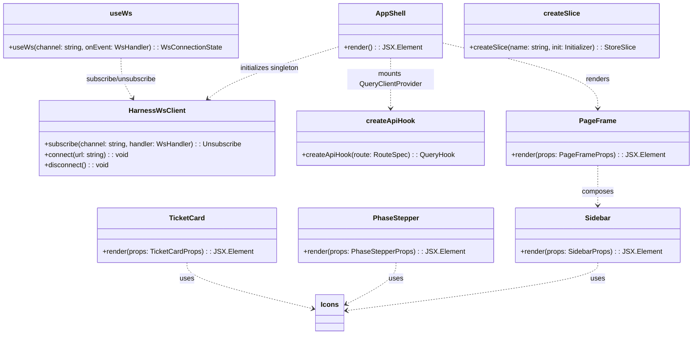
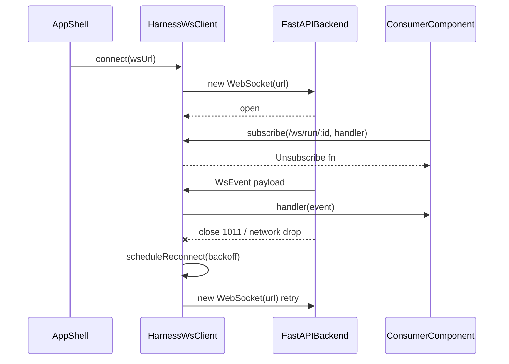
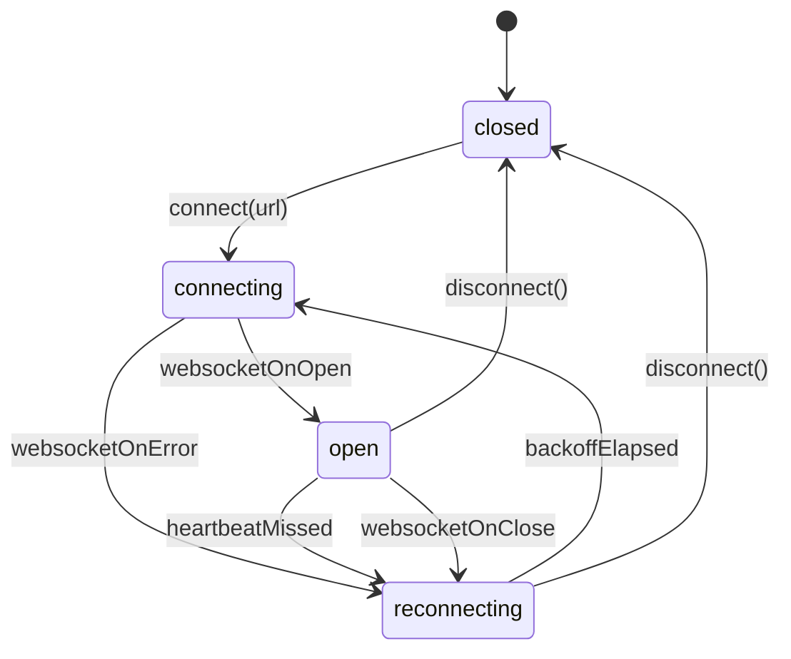
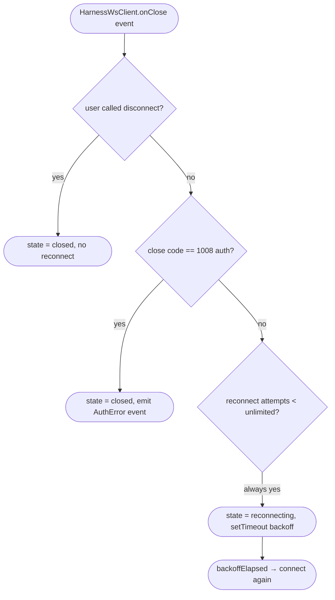

# Feature Detailed Design：F12 · Frontend Foundation（Feature #12）

**Date**: 2026-04-24
**Feature**: #12 — F12 · Frontend Foundation
**Priority**: high
**Dependencies**: F01（IAPI-001 WebSocket + IAPI-002 REST endpoints）
**Design Reference**: docs/plans/2026-04-21-harness-design.md §4.9（lines 620–647）· §3.1 · §3.4 · §3.5 · §6.2 · §7 · §8.2 · §9
**SRS Reference**: NFR-001（UI p95 < 500ms）· NFR-010（仅简体中文）· NFR-011（HIL 控件标注）

---

## Context

F12 是 Harness 前端基座：React 18 + Vite + TypeScript + TailwindCSS + shadcn/ui。职责只限**基座**——AppShell / Sidebar / 路由 / WebSocket 客户端 / TanStack Query hook 工厂 / Zustand store slice 工厂 / 从 prototype 原样迁入的 theme tokens + 5 个 shared primitive 组件（Sidebar / PhaseStepper / TicketCard / PageFrame / Icons）。F12 **不实现任何 FR 业务逻辑**，只为 F21（Fe-RunViews）与 F22（Fe-Config）提供可直接消费的基座契约（组件 import + hook import + store import + theme token + WebSocket client 单例）。

---

## Design Alignment

> 完整复制 Design §4.9（lines 620–647），并补充 §3.1 / §3.4 / §3.5 / §7 的相关约束。

**4.9.1 Overview**：React 18 + Vite + TypeScript + TailwindCSS + shadcn/ui 前端基座。**视觉真相源**：`docs/design-bundle/eava2/project/`（由 Claude Design 导出的可运行 prototype）；**视觉规则源**：UCD §2（a11y / 动效 / 中文排印 / 响应式 / 状态色）。本节**只描述架构与集成契约**，不复述视觉细节（UCD §6 引用禁令）。

**4.9.2 职责范围**
- **基座**：AppShell + 路由 + WebSocket 客户端（重连 + 多 channel 订阅）+ REST client（TanStack Query hook 工厂）+ Zustand store slices。
- **主题**：把 `design-bundle/eava2/project/styles/tokens.css` **原样**移入 `apps/ui/src/theme/tokens.css`；追加 UCD §2.5 中文排印扩展 class 与 §2.2 `prefers-reduced-motion` 降级分支；不新增 token，不改 token 值。
- **shared primitives 移植**（由 prototype CDN React + 内联 style **重构**为 TS + Tailwind + shadcn/ui，视觉产物**像素等价**）：
  - `components/Icons.jsx` → `apps/ui/src/components/icons.ts`（改用 `lucide-react`）
  - `components/Sidebar.jsx` → `apps/ui/src/components/sidebar.tsx`
  - `components/PhaseStepper.jsx` → `apps/ui/src/components/phase-stepper.tsx`
  - `components/TicketCard.jsx` → `apps/ui/src/components/ticket-card.tsx`
  - `components/PageFrame.jsx` → `apps/ui/src/components/page-frame.tsx`
- **无业务逻辑**：不实现任何 FR（F21/F22 才实现具体页面业务）。

**4.9.3 Integration Surface**
- **Provides**：基座组件 / hook / client / tokens → F21（Fe-RunViews）· F22（Fe-Config）
- **Requires**：F01 提供的 REST + WebSocket endpoint；消费的后端 WebSocket/REST 由 F18/F19/F20 提供

| 方向 | Consumer / Provider | Contract ID | Endpoint | Schema |
|---|---|---|---|---|
| Provides | F21/F22 | 内部 FE import | — | — |
| Requires | F18/F20 | IAPI-001 | WebSocket multi-channel `/ws/run/:id` · `/ws/stream/:ticket_id` · `/ws/hil` · `/ws/anomaly` · `/ws/signal` | `WsEvent` union / `ControlFrame` |
| Requires | F19/F20 | IAPI-002 | REST（§6.2.2 全量 30 route） | 各 route |

**4.9.4 视觉保真义务**
所有 shared primitives 的移植产物必须通过 UCD §7 视觉回归 SOP（像素差 < 3%）。token 值来自 `design-bundle/eava2/project/styles/tokens.css`，禁止在 `apps/ui/src/theme/tokens.css` 中覆写或偏移。

**Architecture Context（Design §3.1 · §3.4 · §3.5）**
- `SPA` = React 18 + TanStack Query + Zustand + shadcn/ui + Tailwind（Design §3.1 Presentation Layer）
- 精确锁的前端版本（Design §3.4）：React 18.3、Vite 5.4、TypeScript 5.5、Tailwind 3.4、shadcn CLI 0.9、Radix ^1.x、TanStack Query 5.59、Zustand 5.0、react-router-dom 7.0、lucide-react 0.441
- NFR-001（UI p95 < 500ms）通过 WebSocket push + asyncio 后端保证（Design §3.5）；F12 的义务是保证**前端路由切换 + Query 缓存 + Zustand 选择器**不引入无谓 re-render，为 Playwright 能稳定达到 p95 < 500ms 奠基

### Key types

| 类型 / 模块 | 文件 | 角色 |
|---|---|---|
| `HarnessWsClient` | `apps/ui/src/ws/client.ts` | 多 channel 单例 WebSocket client（指数退避重连、60s 心跳超时） |
| `useWs<T>(channel, onEvent)` | `apps/ui/src/ws/use-ws.ts` | React hook，订阅单一 channel，组件 unmount 时自动退订 |
| `createApiHook<Req, Resp>(route)` | `apps/ui/src/api/query-hook-factory.ts` | TanStack Query hook 工厂（`useQuery` / `useMutation`） |
| `apiClient` | `apps/ui/src/api/client.ts` | 统一 `fetch` 包装（base URL、错误归一、JSON schema runtime 校验，见 `zod`） |
| `createSlice<S>(name, init)` | `apps/ui/src/store/slice-factory.ts` | Zustand slice 工厂（命名空间 + devtools 集成） |
| `AppShell` | `apps/ui/src/app/app-shell.tsx` | 顶层应用壳：`<QueryClientProvider>` + `<BrowserRouter>` + `<PageFrame>` + 全局 error boundary |
| `Sidebar` | `apps/ui/src/components/sidebar.tsx` | prototype 视觉等价移植 |
| `PhaseStepper` | `apps/ui/src/components/phase-stepper.tsx` | prototype 视觉等价移植 |
| `TicketCard` | `apps/ui/src/components/ticket-card.tsx` | prototype 视觉等价移植 |
| `PageFrame` | `apps/ui/src/components/page-frame.tsx` | prototype 视觉等价移植 |
| `Icons` 集合 | `apps/ui/src/components/icons.ts` | re-export `lucide-react`；保留 prototype 同名键（`Home`、`Inbox`、`Zap` 等） |
| `tokens.css` | `apps/ui/src/theme/tokens.css` | prototype `tokens.css` byte-identical clone + §2.5 中文排印扩展 + §2.2 `prefers-reduced-motion` |
| `tailwind.config.ts` | `apps/ui/tailwind.config.ts` | 把 tokens.css 的 CSS 变量映射为 Tailwind `theme.extend` |

### Provides / Requires

- **Provides**：基座 React 组件 / hook / store slice 工厂 / theme tokens / WebSocket client 单例 → F21、F22 直接 import
- **Requires**：F01 IAPI-001 WebSocket multi-channel（消费 `WsEvent` union）· IAPI-002 REST（消费 `/api/*` 30 route）。具体 Producer 实际由 F18/F19/F20 实现，但 F12 通过 F01 的 FastAPI app 暴露接入点。

### Deviations

无。F12 作为 Provider 给 F21/F22 的都是**内部 FE import**（不入 §6.2 IAPI 表）；作为 Consumer 的 IAPI-001 / IAPI-002 严格对齐 Design §6.2.2（REST route）与 §6.2.3（WebSocket 频道）现有 schema。

**UML 嵌入触发判据评估**：
- ≥2 类/模块协作（新增/修改）：满足 → 需要 `classDiagram`
- ≥2 对象/服务调用顺序：满足（WebSocket 重连 + Query hook 初始化）→ 需要 `sequenceDiagram`

---

## SRS Requirement

F12 的 srs_trace = [NFR-001, NFR-010, NFR-011]。完整 NFR 行（SRS §5）如下：

| ID | Category | Requirement | Measurable Criterion | Measurement Method |
|---|---|---|---|---|
| **NFR-001** | Performance — Time Behavior | UI 操作响应（ticket 提交、页面切换、表单提交） | **p95 < 500ms**（不计被调 claude 的执行时间） | Playwright E2E 计时 + Chrome DevTools 抽样 |
| **NFR-010** | Usability — Appropriateness Recognizability | UI 语言 | **仅简体中文**（v1 不做 i18n） | 视觉评审 + 源代码 grep 无其他语言 strings |
| **NFR-011** | Usability — Operability | HIL 控件标注 | 控件顶部显示 "单选/多选/自由文本" 标签；自由文本提供 skill hint 建议 | UI 验收 |

**验收准则（feature-list.json `verification_steps`）**：

1. Given 页面切换 100 次 when 测 p95 then < 500ms（NFR-001 Playwright）
2. Given 源代码 grep when 扫 en/ja/fr 字符串 then 无匹配（NFR-010 中文唯一）
3. Given HIL 控件渲染 when 视觉验收 then 顶部显示 '单选/多选/自由文本' 标签（NFR-011）
4. `[devtools]` Given 首启 when take_snapshot of / then Sidebar + Top header + 主内容区组件全部可见（UCD §3.8）
5. `[visual-regression]` Given 前端实现渲染 when 与 `docs/design-bundle/eava2/project/pages/*` 对应 artboard 1280/1440 分辨率截图 pixelmatch 对比 then 像素差 < 3%（UCD §7 SOP）
6. `[a11y]` Given `prefers-reduced-motion: reduce` when 渲染含 pulse 动画的元素 then 光环动画被禁用（仅保留静态 dot 颜色）（UCD §2.2）
7. `[token-fidelity]` Given `apps/ui/src/theme/tokens.css` when diff 对比 `docs/design-bundle/eava2/project/styles/tokens.css` then 仅允许追加（中文排印 + `prefers-reduced-motion` 扩展），禁止修改已有 token 值（UCD §5 F12 实施规约）

> 说明：F12 对 NFR-011 只承接**基座义务**——提供可供 F21 使用的 `Label`、`Radio`、`Checkbox`、`Textarea` shadcn primitives + 一个顶部标签 slot 约定；F21 在 HILCard 里实际渲染 "单选/多选/自由文本" 文本。F12 的 Test Inventory 中 NFR-011 覆盖仅到"primitives 存在 + label slot API 正确"层级。

---

## Interface Contract

公开 API（F21/F22 直接 import）：

| Method | Signature | Preconditions | Postconditions | Raises |
|---|---|---|---|---|
| `HarnessWsClient.connect` | `connect(url: string): void` | `url` 以 `ws://127.0.0.1:` 或 `ws://localhost:` 开头；客户端未处于 `open` 态 | 连接尝试被调度；连接成功后进入 `open` 态；失败则按指数退避（1s / 2s / 4s / 8s / 16s 上限）重连 | `TypeError`（非法 URL scheme / host） |
| `HarnessWsClient.subscribe` | `subscribe(channel: string, handler: (ev: WsEvent) => void): Unsubscribe` | `channel` ∈ `{"/ws/run/:id", "/ws/stream/:ticket_id", "/ws/hil", "/ws/anomaly", "/ws/signal"}`（参数化）；`handler` 是 function | handler 被登记到 channel handler set；返回的 `Unsubscribe` 调用后 handler 从 set 移除；当 channel 首次被订阅时在 WebSocket 上发送 `SubscribeMsg`；当 channel 最后一个订阅者退订时发送 `UnsubscribeMsg` | `RangeError`（channel 不合法） |
| `HarnessWsClient.disconnect` | `disconnect(): void` | 无 | 取消重连调度；socket 关闭；进入 `closed` 态；所有 subscribe handler 被冻结（不再调用） | — |
| `HarnessWsClient.onHeartbeatMissed` | `readonly heartbeat$: Observable<"ok" \| "missed">` | WS 已打开 | 每次收到服务端 `{kind:"ping"}` 发射 `"ok"`；连续 60s 未收 ping 发射 `"missed"` 并触发重连（IAPI-001 心跳契约 + Design §6.1 尾段） | — |
| `useWs` | `useWs<E extends WsEvent>(channel: string, onEvent: (ev: E) => void): { status: "connecting" \| "open" \| "closed" \| "reconnecting" }` | 组件 mount 时调用；`channel` 合法 | 组件 mount 时订阅；`useEffect` cleanup 时退订；返回 `status` 随 WS 状态切换触发 re-render | `RangeError`（透传自 `subscribe`） |
| `createApiHook` | `createApiHook<Req, Resp>(route: { method: "GET"\|"POST"\|"PUT", path: string, requestSchema?: ZodSchema<Req>, responseSchema: ZodSchema<Resp> }): QueryHook<Req, Resp>` | `path` 以 `/api/` 开头；`responseSchema` 为 Zod schema 实例 | 返回 TanStack Query hook（GET → `useQuery`；POST/PUT → `useMutation`）；hook 调用时在请求前 `requestSchema.parse(req)`，响应后 `responseSchema.parse(resp)` | `ZodError`（schema 失败时由 hook 抛出至 error boundary） |
| `apiClient.fetch` | `fetch<Resp>(method: string, path: string, body?: unknown): Promise<Resp>` | base URL `http://127.0.0.1:<port>` 在 `window.__HARNESS_API_BASE__` 或 `import.meta.env.VITE_API_BASE` 中已注入 | 4xx → `HttpError { status, code, detail }` reject；5xx → `ServerError` reject；2xx → resolve response JSON | `HttpError` / `ServerError` / `NetworkError` |
| `createSlice` | `createSlice<S>(name: string, init: (set: Setter<S>, get: Getter<S>) => S): UseBoundStore<StoreApi<S>>` | `name` 为唯一 slice 名；`init` 返回 state+actions 对象 | 返回 Zustand store hook；devtools 名称 = `name`；在 `window.__HARNESS_STORES__` 登记便于调试 | `Error`（重名 slice） |
| `AppShell` | `<AppShell routes: RouteSpec[] />` | `routes` 至少 1 项 | 渲染 `<QueryClientProvider>` + `<BrowserRouter>` + `<PageFrame>` + `<ErrorBoundary>`；全局 `HarnessWsClient` 在 `useEffect` mount 时 `connect()`，unmount 时 `disconnect()` | — |
| `PageFrame` | `<PageFrame active: NavId, title: string, hilCount?: number, children: ReactNode />` | `active` ∈ 8 个 nav id；`title` 非空 | 渲染 Sidebar（active 高亮 + hilCount 徽标）+ top bar（title + ⌘K slot）+ children；最小 viewport = 1024×720（UCD §2.3） | — |
| `Sidebar` | `<Sidebar active: NavId, hilCount: number, onNavigate: (id: NavId) => void />` | `hilCount >= 0` | 1280px+ 展开 240px；1024–1279px 折叠 icon-only；active 项有 3px accent 左条；hilCount>0 在 HIL 行显示徽标 | — |
| `PhaseStepper` | `<PhaseStepper current: 0..7, fraction?: string, variant?: "h"\|"v" />` | `current` ∈ [0, 7]（8 phases 索引） | 渲染 8 个圆点 + 连接条：`i < current` → done + check icon；`i === current` → current + pulse 光环（reduced-motion 时退化为静态环）；`i > current` → pending 灰点 | `RangeError`（current 越界） |
| `TicketCard` | `<TicketCard id: string, skill?: string, tool?: "claude"\|"opencode", state: TicketState, status: string, events?: number, variant?: "compact", selected?: boolean />` | `state` ∈ 9 态枚举（UCD §2.6） | 渲染 state-dot（按 §2.6 色）+ 可选 pulse（`running`/`classifying`/`hil_waiting`/`retrying`）+ skill + tool chip；selected=true 时左侧 3px state 色条 | — |
| `Icons` | `export const Icons: Record<string, LucideIcon>` | — | 40+ 键（`Home` / `Inbox` / `Zap` / ...）re-export 自 `lucide-react`；stroke-width 1.75；默认 size 16；完全覆盖 prototype `Icons.jsx` 同名键 | — |

**方法状态依赖**——`HarnessWsClient` 有 4 态显式状态机：

**Design rationale**：
- **WebSocket 单例而非每 channel 一 socket**：IAPI-001 定义为 multi-channel 单连接（Design §6.2.3），避免浏览器每 host 6 连接上限和心跳风暴。
- **60s 心跳超时（非 30s）**：Design §6.1 尾段 "服务端每 30s 发 ping；客户端 60s 未收重连" 明确给出 60s 阈值，允许 1 次丢包容忍。
- **指数退避 1/2/4/8/16 上限**：避免用户 Start run 时服务刚起网络短暂抖动就 spam；16s 上限保证用户感知不到"卡死"。
- **Zod runtime schema**：后端 pydantic → 前端 Zod（Design §6.2 "前端 Zod（从 pydantic 导出 TS 类型）"）；F12 仅提供工厂与错误归一，schema 自身由 F21/F22 声明。
- **跨特性契约对齐**：`HarnessWsClient` 消费 **IAPI-001** `WsEvent` union（多 channel），`apiClient` 消费 **IAPI-002** REST（§6.2.2 全 30 route 未来由 F21/F22 调用）。F12 仅实现 envelope 解析（`kind`、`channel`、`payload`），具体 payload schema 由 consumer 声明。

---

## Visual Rendering Contract

> **本特性 `"ui": true`，本章节强制。** Rendering tech：React 18 DOM + Tailwind CSS + shadcn/ui primitives + CSS 变量 theme。**Entry point**：`ReactDOM.createRoot(document.getElementById("root")!).render(<AppShell routes={routes} />)`。**Render trigger**：React reconciler（state/props 变化 → re-render）；pulse 动画由 `@keyframes hns-pulse` 驱动（CSS，非 JS）。

| Visual Element | DOM Selector | Rendered When | Visual State Variants | Minimum Dimensions | Data Source |
|---|---|---|---|---|---|
| AppShell 根容器 | `div[data-component="app-shell"]` | 应用 mount | 固定：dark bg = `var(--bg-app)` = `#0A0D12` | 100vw × 100vh（viewport ≥ 1024×720） | 无（装饰） |
| Sidebar 导航 | `aside[data-component="sidebar"]` | AppShell mount | 展开（viewport ≥ 1280px，width = 240px）· 折叠（1024–1279px，width = 56px icon-only） | 1280px: `width: 240px, height: 100%` · 1024px: `width: 56px` | `navItems`（8 项硬编码） |
| Sidebar 激活项 | `[data-component="sidebar"] [data-active="true"]` | nav 匹配当前路由 | 背景 `var(--bg-active)` + 左 3px accent 条 + icon tint `var(--accent)` | left-bar `width: 3px, top: 8px, bottom: 8px` | `active` prop |
| HIL 徽标 | `[data-component="sidebar"] [data-nav="hil"] [data-badge="true"]` | `hilCount > 0` | 琥珀底 `var(--state-hil)` + 黑字 + `min-width: 18px` | `width: ≥18px, height: 18px` | `hilCount` prop |
| Top bar | `header[data-component="top-bar"]` | AppShell mount | 56px 高 + gradient 背景 + ⌘K 搜索输入 slot | `height: 56px` | `title` prop |
| PhaseStepper | `[data-component="phase-stepper"]` | 组件被 mount | 8 phase 圆点横排；done/current/pending 三态色彩；current 有 pulse 光环（除非 `prefers-reduced-motion: reduce`） | 每 phase `width: 84px`；圆点 `32×32px` | `current` prop |
| PhaseStepper current pulse | `[data-component="phase-stepper"] [data-state="current"] [data-pulse]` | `current === i` 且非 `prefers-reduced-motion` | `animation: hns-pulse 1.8s ease-out infinite` | `inset: -6px` | 无（装饰） |
| TicketCard state-dot | `[data-component="ticket-card"] [data-state-dot]` | TicketCard 挂载 | 颜色按 UCD §2.6 9 态映射；`running`/`hil_waiting`/`classifying`/`retrying` 带 `.pulse` 类 | `8×8px` dot；pulse 环 `inset: -4px` | `state` prop |
| TicketCard tool chip | `[data-component="ticket-card"] [data-tool]` | `tool` prop 非空 | `claude` → 紫色；`opencode` → 青色；等宽字体 | `height: 18px` | `tool` prop |
| Theme surface | `:root` 下任意元素 | tokens.css 加载 | 所有前景/背景色通过 CSS 变量（`--fg`、`--bg-app` 等）可解析 | — | `apps/ui/src/theme/tokens.css` |
| Reduced-motion 降级 | `@media (prefers-reduced-motion: reduce)` 下 `.state-dot.pulse::after` / `[data-pulse]` | 用户开启 reduced-motion | `animation: none`；保留 dot 本体颜色 | — | CSS media query |

**Rendering technology**: React 18 DOM + Tailwind CSS utility + CSS 变量（tokens.css）+ `@keyframes hns-pulse` + lucide-react SVG。
**Entry point function**: `apps/ui/src/main.tsx` → `ReactDOM.createRoot(...).render(<AppShell routes={routes} />)`。
**Render trigger**: React reconciler 驱动 DOM；CSS `@keyframes` 驱动 pulse；CSS `@media` 驱动 reduced-motion 降级。

**正向渲染断言**（触发后必须视觉可见）：
- [ ] `document.querySelector('[data-component="app-shell"]')` 非空，`getBoundingClientRect().width >= 1024`
- [ ] `document.querySelector('[data-component="sidebar"]')` 在 viewport=1280×900 下 `getComputedStyle().width === "240px"`
- [ ] `document.querySelector('[data-component="sidebar"]')` 在 viewport=1100×800 下 `getComputedStyle().width === "56px"`（折叠 icon-only）
- [ ] `document.querySelector('[data-component="top-bar"]')` 存在且 `getComputedStyle().height === "56px"`
- [ ] `document.querySelector('[data-component="phase-stepper"]')` 在挂载后存在 8 个子节点（对应 8 phase）
- [ ] `document.querySelector('[data-component="phase-stepper"] [data-state="current"] [data-pulse]')` 的 `getComputedStyle().animationName === "hns-pulse"`
- [ ] `document.querySelector('[data-component="ticket-card"][data-state="running"] [data-state-dot]').classList.contains("pulse") === true`
- [ ] `getComputedStyle(document.documentElement).getPropertyValue("--bg-app").trim() === "#0A0D12"`（tokens 已加载）
- [ ] `apps/ui/src/theme/tokens.css` 在 `:root` 块内声明的 token 值与 `docs/design-bundle/eava2/project/styles/tokens.css` **byte-identical**（除 §2.5 / §2.2 的追加块）
- [ ] pixelmatch 对比 prototype artboard（1280×900 + 1440×840）像素差 < 3%

**交互深度断言**（已渲染元素必须响应其设计意图）：
- [ ] 点击 `[data-component="sidebar"] [data-nav="hil"]` → `onNavigate("hil")` 被调用且路由切到 `/hil`
- [ ] 路由切换 → `Sidebar` 的 `[data-active="true"]` 节点随之切换到新的 nav 项（React re-render）
- [ ] `hilCount` prop 从 3 → 0 → `[data-badge="true"]` 节点消失（不渲染）
- [ ] 在 `prefers-reduced-motion: reduce` 模拟下，`[data-component="phase-stepper"] [data-state="current"] [data-pulse]` 的 `getComputedStyle().animationName === "none"`
- [ ] WebSocket 服务端关闭连接 → `HarnessWsClient` 状态机进入 `reconnecting` → 1s 后重新 `connecting`；`useWs` 返回的 `status` 相应更新触发订阅组件 re-render

---

## Implementation Summary

**主要模块与文件**。F12 落地的是 `apps/ui/` 目录下的 TypeScript 源码（目前为空，仅有 `.gitkeep`）。核心模块：`apps/ui/src/main.tsx`（应用入口 + `ReactDOM.createRoot`）；`apps/ui/src/app/app-shell.tsx`（AppShell）；`apps/ui/src/theme/tokens.css`（prototype tokens 原样 clone + 追加中文排印 / reduced-motion 扩展）；`apps/ui/src/components/{sidebar,phase-stepper,ticket-card,page-frame,icons}.tsx`（5 shared primitives）；`apps/ui/src/ws/client.ts` + `use-ws.ts`（WebSocket client + hook）；`apps/ui/src/api/{client,query-hook-factory}.ts`（REST client + Query hook 工厂）；`apps/ui/src/store/slice-factory.ts`（Zustand slice 工厂）。构建配置：`apps/ui/vite.config.ts`、`apps/ui/tailwind.config.ts`、`apps/ui/tsconfig.json`、`apps/ui/package.json`。

**运行时调用链**。用户启动 Harness → FastAPI (`host="127.0.0.1"`, ephemeral port) 起来 → PyWebView 主窗口加载 `http://127.0.0.1:<port>/`（生产：FastAPI serve `apps/ui/dist` 静态资源；开发：Vite dev server 5173 + FastAPI 8765 分离）→ 浏览器执行 `main.tsx` → `AppShell` mount → `QueryClientProvider`、`BrowserRouter`、`PageFrame` 依次挂载 → 全局 `HarnessWsClient` 在 `useEffect` 中 `connect("ws://127.0.0.1:<port>")` → Sidebar 渲染 + 当前路由的 children 渲染（F21 / F22 的具体页面会在其自己的 feature 里实现，F12 只预留占位路由）。后续 F21 的 HILInbox 组件调用 `useWs("/ws/hil", handler)` → 该 hook 调 `HarnessWsClient.subscribe("/ws/hil", handler)` → 首次订阅触发客户端发送 `SubscribeMsg { kind: "subscribe", channel: "/ws/hil" }` → 后端推送 `HilQuestionOpened` → 客户端分发给 handler。

**关键设计决策与非显见约束**。(1) **tokens.css byte-identical**：UCD §5 F12 实施规约明文要求 prototype tokens.css 原样进入 `apps/ui/src/theme/tokens.css`，允许的扩展**只**有 §2.5 中文排印（`.hns-cn-body` / `.hns-cn-heading`）与 §2.2 `prefers-reduced-motion`；本特性提供一个 `scripts/check_tokens_fidelity.sh` 脚本用 `diff` 比对两文件，超出允许扩展块则 fail。(2) **shadcn primitives 而非自研**：Design §3.4 锁定 shadcn/ui + Radix；Sidebar/PhaseStepper/TicketCard 不使用 shadcn（这些是业务组件），但内部如果有 Dialog/Tooltip/DropdownMenu 需求时走 shadcn CLI 生成（未来 F21/F22 需要）。(3) **Zustand slice 命名空间化**：避免多 slice 间 action 名冲突；`createSlice` 自动前缀 `slice.actionName`。(4) **不引入 i18n 库**：NFR-010 锁定仅中文；防止用户误加英文字串的 guard 是 `scripts/check_source_lang.sh`（grep 非 ASCII 之外的 `[a-zA-Z]{5,}` 在 `.tsx/.ts`，排除 import / 变量名 / CSS property / 技术术语白名单）。(5) **Viewport 折叠**：用纯 CSS `@container` 或 `@media` 实现（不 JS 测 viewport）以避免 SSR 问题——虽然 PyWebView 无 SSR，但保持一致性且更可测。

**WebSocket 重连分支决策**（≥3 决策分支 → 嵌入 flowchart TD）：

**遗留/存量代码交互点**。(1) **F01 `harness/api/__init__.py`**：F12 的生产产物 `apps/ui/dist/` 通过 FastAPI `app.mount("/", StaticFiles(directory="apps/ui/dist", html=True))` 暴露给浏览器；**F12 实施时需在 F01 的 FastAPI app 挂载点加静态目录**（改动 1 行 + 验证 `/api/*` 路由优先级高于静态 fallback）。(2) **F01 `harness/app/bootstrap.py`**：PyWebView `create_window` 的 URL 来自 uvicorn 实际绑定端口，F12 前端通过 `window.location.origin` 或注入的 `VITE_API_BASE` 拿到 base URL，不硬编码 `:8765`。(3) **env-guide §4 greenfield**：无强制内部库、无禁用 API、无命名约定——F12 fallback 到 Design §3.4 tech-stack 惯例（TypeScript 标准：camelCase functions / PascalCase components / kebab-case filenames / TSX for JSX-containing files）。(4) **tests 位置**：Vitest 测试 co-locate 在 `apps/ui/src/**/__tests__/*.test.tsx` 或 `*.test.ts`；E2E Playwright 测试放 `apps/ui/e2e/*.spec.ts`。

**§4 Internal API Contract 集成**。F12 作为 IAPI-001（WebSocket multi-channel）与 IAPI-002（REST）的 **Consumer**：
- `HarnessWsClient.connect(url)` 的 `url` scheme 校验（仅 `ws://127.0.0.1`）保证 NFR-007 回环——虽然 UI 端不强制，但预防误用。
- `HarnessWsClient.subscribe` 的 `channel` 参数白名单与 Design §6.2.3 WebSocket 频道表 5 个 `/ws/*` 路径完全对齐；新增 channel 必须先在 §6.2.3 登记。
- `apiClient.fetch` 的 `path` 前缀校验 `/api/`，与 §6.2.2 REST 表 30 route 路径前缀一致。
- 错误归一：`HttpError.code` 使用 FastAPI 返回的 `detail.code`（如 `"run_already_running"` / `"not_git_repo"`），schema 与 pydantic 错误响应对齐。

### Boundary Conditions

| Parameter | Min | Max | Empty/Null | At boundary |
|---|---|---|---|---|
| `HarnessWsClient.connect(url)` url | — | — | `""`/`null` → 立即 `TypeError` | `ws://127.0.0.1:0` → 允许但后端会拒绝，触发 reconnect 循环 |
| `HarnessWsClient.subscribe(channel, h)` channel | — | — | `""` → `RangeError` | 首次订阅某 channel vs 最后一个取消订阅 → 触发 WS SubscribeMsg / UnsubscribeMsg |
| 指数退避间隔 | 1s（第 1 次失败） | 16s 上限（第 5 次起） | 无 | 第 5 次 fail → 锁定在 16s（不再翻倍） |
| 心跳超时窗口 | — | 60s（硬阈值） | 无 | 59.9s 收到 ping 保持 open；60.01s 触发 reconnect |
| `useWs(channel, handler)` handler | — | — | `undefined` → TS 编译期报错；运行时 `RangeError` | handler 在组件 unmount 后仍被调用 → 已退订，不调用 |
| `createApiHook` route.path | — | — | 不以 `/api/` 开头 → 抛 `Error` | 恰好 `/api/`（无 resource）→ 允许（后端返 404） |
| `PhaseStepper` current | 0 | 7（8 phase） | `undefined` → TS 编译期报错 | `-1` / `8` → `RangeError` |
| `TicketCard` state | — | — | `undefined` → TS 编译期报错 | 9 态枚举外的值 → 回退到 `pending` 视觉 + console.warn |
| `PageFrame` hilCount | 0 | Number.MAX_SAFE_INTEGER | `undefined` → 默认 0（不渲染徽标） | `hilCount === 0` → 不渲染徽标；`hilCount === 1` → 渲染 |
| viewport width（CSS responsive） | 1024px（UCD §2.3 最小） | ∞ | — | 1279px → 折叠；1280px → 展开；主内容区 max-width = 1440px |

### Existing Code Reuse

本特性的"复用"分两类：**prototype 视觉源**（UCD §5 硬要求的 byte-identical / 视觉等价 clone）与**后端基座代码**（F12 仅消费 F01 已开通的 FastAPI app 挂载点，不直接复用 Python 函数）。

| Existing Symbol | Location (file:line) | Reused Because |
|---|---|---|
| `design-bundle/eava2/project/styles/tokens.css` 全文 | `docs/design-bundle/eava2/project/styles/tokens.css:1-216` | UCD §5 F12 实施规约硬要求：原样进入 `apps/ui/src/theme/tokens.css`；byte-identical 除 §2.5 / §2.2 两块追加 |
| `design-bundle/eava2/project/components/Icons.jsx` 图标键名 | `docs/design-bundle/eava2/project/components/Icons.jsx:9-53` | 40+ 图标键（`Home`/`Inbox`/`Zap`/...）→ 改用 `lucide-react` 的同名导出，保持 API 等价（UCD §2.7 允许 `lucide-react` 替换） |
| `design-bundle/eava2/project/components/Sidebar.jsx` 结构与 8 nav items | `docs/design-bundle/eava2/project/components/Sidebar.jsx:4-14,16-76` | 视觉等价移植为 TS + Tailwind；nav items 列表、brand、runtime status slot 结构保留 |
| `design-bundle/eava2/project/components/PhaseStepper.jsx` 结构与 8 phase 定义 | `docs/design-bundle/eava2/project/components/PhaseStepper.jsx:2-62` | 视觉等价移植；done/current/pending 三态色彩与 pulse 规则保留；`variant` prop 保留 |
| `design-bundle/eava2/project/components/TicketCard.jsx` STATE_MAP 9 态 | `docs/design-bundle/eava2/project/components/TicketCard.jsx:2-11` | 9 态 STATE_MAP（pending/running/classifying/hil_waiting/completed/failed/retrying/aborted）对齐 UCD §2.6；TS 移植保留 |
| `design-bundle/eava2/project/components/PageFrame.jsx` 结构 | `docs/design-bundle/eava2/project/components/PageFrame.jsx:4-35` | sidebar + top bar + children + ⌘K search slot 的布局骨架视觉等价移植 |
| `harness/api/__init__.py` `app = FastAPI(...)` | `harness/api/__init__.py:21` | F12 扩展 F01 现有 FastAPI app：挂载 `StaticFiles("apps/ui/dist")`；不新建 app |
| `harness/app/bootstrap.py` `AppBootstrap` | `harness/app/bootstrap.py:1-50+` | F12 依赖 F01 已实现的 PyWebView 窗口 + uvicorn 启动；不重写 |

> 搜索关键字：`WebSocket`、`useWs`、`QueryClient`、`ZodSchema`、`createSlice`、`Sidebar`、`PhaseStepper`、`TicketCard`、`PageFrame`、`tokens.css`、`.tsx`。`apps/ui/` 目录仅含 `.gitkeep`（greenfield frontend）。后端 `harness/api/` 仅 skills router 存在，无既有 TS/React 代码可复用。

---

## Test Inventory

| ID | Category | Traces To | Input / Setup | Expected | Kills Which Bug? |
|---|---|---|---|---|---|
| T01 | FUNC/happy | §IC `HarnessWsClient.connect` + NFR-001（基座） | `connect("ws://127.0.0.1:8765")`；mock ws server 接受 | 状态机：`closed → connecting → open`；`heartbeat$` 可订阅 | URL 被忽略 / 状态机未初始化 |
| T02 | FUNC/error | §IC `HarnessWsClient.connect` Raises | `connect("http://evil.com")` | 立即抛 `TypeError`；状态保持 `closed` | 非 loopback URL 被接受 |
| T03 | FUNC/happy | §IC `HarnessWsClient.subscribe` | 连上 mock server → `subscribe("/ws/hil", h)` | mock 收到 `SubscribeMsg{channel:"/ws/hil"}`；推 `HilQuestionOpened` → `h(ev)` 被调用 1 次 | 订阅没发 SubscribeMsg / handler 未被调 |
| T04 | FUNC/error | §IC `HarnessWsClient.subscribe` Raises + §DA seq msg#4 | `subscribe("/ws/unknown", h)` | 抛 `RangeError`；mock server 未收到任何消息 | channel 白名单被绕过 |
| T05 | BNDRY/edge | §IC state `reconnecting`→`connecting` + §BC 指数退避 + §DA state `reconnecting→connecting` | 开连接 → server 关闭 → 观察 setTimeout 调度 | 第 1/2/3/4/5 次重连间隔 ≈ 1000/2000/4000/8000/16000ms（±10% 容忍 jitter）；第 6 次起保持 16000ms | 退避错算 / 超过上限继续翻倍 |
| T06 | BNDRY/edge | §IC `heartbeat$` + §BC 心跳窗口 + §DA state `open→reconnecting` via heartbeatMissed | 连上后 stub fake timer → 59.9s 发 ping → 60.1s 不发 | 59.9s 后状态仍 `open`；60.1s 后进入 `reconnecting` | 心跳阈值偏移 / off-by-one |
| T07 | FUNC/happy | §IC `HarnessWsClient.disconnect` + §DA state `open→closed` | 连上 → subscribe → disconnect() | 状态 = `closed`；mock server 收到 close frame；订阅 handler 不再被调 | disconnect 泄漏订阅 / 继续尝试重连 |
| T08 | FUNC/error | §IC `apiClient.fetch` Raises | mock `/api/foo` 响应 500 `{detail:"x"}` | reject `ServerError` 含 `status:500`；调用方未见 2xx | 5xx 被当 2xx / 错误信息丢失 |
| T09 | FUNC/error | §IC `createApiHook` Raises + §IC `apiClient.fetch` | 定义 hook responseSchema = `z.object({id:z.number()})`；mock 返 `{id:"abc"}` | hook 抛 `ZodError` 至 error boundary | schema 被绕过 / 静默返回错误数据 |
| T10 | BNDRY/edge | §IC `createApiHook` route.path Raises | `createApiHook({path:"/foo"})` | 抛 `Error("path must start with /api/")` | 任意路径被接受 |
| T11 | FUNC/happy | §IC `useWs` | render 使用 useWs 的组件 → mock server 推事件 | handler 被调；`status` 依次 `connecting` → `open` | 未订阅 / 未触发 re-render |
| T12 | FUNC/error | §IC `useWs` cleanup | render → unmount | unmount 后 mock server 推事件 → handler 不被调 | 内存泄漏 / 退订失败 |
| T13 | FUNC/happy | §IC `createSlice` | `createSlice("ui", (set)=>({collapsed:false, toggle:()=>set(s=>({collapsed:!s.collapsed}))}))` | 返回 hook；`useStore(s=>s.collapsed)` === false；调 `toggle` → true | slice 无法创建 / action 不生效 |
| T14 | FUNC/error | §IC `createSlice` Raises | 创建 name="ui" 两次 | 第 2 次抛 `Error("slice 'ui' already registered")` | 重名 slice 覆盖既有 store |
| T15 | UI/render | §VRC AppShell 根容器 | 在 1280×900 viewport 下 render `<AppShell routes={[]} />` | `document.querySelector('[data-component="app-shell"]')` 非空；`getComputedStyle().backgroundColor` 解析为 `rgb(10, 13, 18)` | AppShell 未挂载 / 背景 token 丢失 |
| T16 | UI/render | §VRC Sidebar 展开 | viewport=1280×900 + render AppShell | `[data-component="sidebar"]` 的 `getBoundingClientRect().width === 240` | Sidebar 尺寸错误 |
| T17 | UI/render | §VRC Sidebar 折叠 + §BC viewport 1279px 边界 | viewport=1100×800 + render AppShell | `[data-component="sidebar"]` 的 `getBoundingClientRect().width === 56` | 响应式折叠未生效 |
| T18 | UI/render | §VRC Sidebar 激活项 | render AppShell with `active="hil"` | `[data-component="sidebar"] [data-nav="hil"][data-active="true"]` 存在；左 `::before` 3px accent 条 | active 视觉未切换 |
| T19 | UI/render | §VRC HIL 徽标 + §BC hilCount=0 边界 | render 两次：`hilCount=3` 和 `hilCount=0` | `hilCount=3` → `[data-badge="true"]` 存在且文本 "3"；`hilCount=0` → 节点不存在 | 徽标零值仍渲染 / 值未显示 |
| T20 | UI/render | §VRC Top bar | render AppShell with `title="总览"` | `header[data-component="top-bar"]` 的 `getComputedStyle().height === "56px"`；内含文字 "总览" | top bar 尺寸错误 / title 未渲染 |
| T21 | UI/render | §VRC PhaseStepper | render `<PhaseStepper current={3} />` | `[data-component="phase-stepper"]` 下 8 个 phase 节点；第 0-2 标 `data-state="done"`；第 3 标 `data-state="current"`；第 4-7 标 `data-state="pending"` | phase 状态映射错误 |
| T22 | UI/render | §VRC PhaseStepper current pulse | render PhaseStepper + viewport default motion | `[data-state="current"] [data-pulse]` 的 `getComputedStyle().animationName === "hns-pulse"` | pulse 未绑定 |
| T23 | UI/render | §VRC Reduced-motion 降级 + AC#6 | 模拟 `prefers-reduced-motion: reduce` + render PhaseStepper current | `[data-state="current"] [data-pulse]` 的 `animationName === "none"`；dot 本体背景色仍为 phase 色 | reduced-motion 分支缺失（a11y 缺陷） |
| T24 | UI/render | §VRC TicketCard state-dot | render `<TicketCard state="running" ... />` | `[data-component="ticket-card"] [data-state-dot]` 背景 = `var(--state-running)`；含 `.pulse` 类 | state→dot 映射错误 |
| T25 | UI/render | §VRC TicketCard tool chip | render `<TicketCard tool="claude" ... />` | `[data-component="ticket-card"] [data-tool="claude"]` 存在；color = `#D2A8FF` | tool chip 未渲染 / 色值漂移 |
| T26 | UI/render | §VRC Theme surface + AC#7 token fidelity | 跑 `scripts/check_tokens_fidelity.sh` | `diff` 结果：只有 §2.5 中文排印 + §2.2 reduced-motion 两个追加块；已有 token 值零偏移 | token 被偷改 / 视觉源漂移 |
| T27 | UI/render | §VRC PhaseStepper 追溯 §DA seq msg + AC#6（reduced-motion） | 模拟 reduced-motion + TicketCard state=running | `[data-state-dot].pulse::after` 的 `animationName === "none"` | 组件级 reduced-motion 分支遗漏 |
| T28 | BNDRY/edge | §IC `PhaseStepper` current Raises + §BC current=-1/8 | render `<PhaseStepper current={-1} />` 与 `current={8}` | 抛 `RangeError`；组件边界兜底（或 dev-mode `console.error`） | off-by-one / 越界被静默吞 |
| T29 | SEC/url-guard | §IC `HarnessWsClient.connect` Raises + NFR-007 基座 | `connect("ws://attacker.com")` | `TypeError`；socket 未创建 | 非 loopback 被连接（violates NFR-007 心智模型） |
| T30 | SEC/i18n-guard | AC#2 NFR-010 | 跑 `scripts/check_source_lang.sh` 扫 `apps/ui/src/**/*.{ts,tsx}` | exit 0（无业务英文字串命中） | 英文误写入源码（违反 NFR-010） |
| T31 | INTG/websocket | §IC `HarnessWsClient` + IAPI-001 + F01 | 启真实 FastAPI（F01）+ 真 WebSocket endpoint；连接 + subscribe | 真实 open；服务端推送 `WsEvent` 被 handler 接；心跳正常 | 单元 mock 漏掉的真连接失败 / envelope 不兼容 |
| T32 | INTG/rest | §IC `apiClient` + IAPI-002 + F01 | 真 FastAPI 起 `/api/health` → `apiClient.fetch("GET","/api/health")` | 返回 `{bind:"127.0.0.1", version, ...}` 与 Zod schema 一致 | base URL 漂移 / REST 404 / schema 不匹配 |
| T33 | INTG/static-serve | §IS 遗留代码交互点 + F01 | build `apps/ui/dist` + F01 FastAPI mount StaticFiles → 请求 `/` | 返回 `index.html` 含 `
` | StaticFiles 与 `/api` 路由冲突 / 未挂载 |
| T34 | PERF/route-switch | AC#1 NFR-001 | Playwright：连续触发 100 次路由切换（`/` ↔ `/hil`） | p95 切换耗时 < 500ms（Playwright `page.evaluate(performance.now)` 差值） | 切换阻塞 / 大量 re-render |
| T35 | UI/render | §VRC pixelmatch + AC#5 | Playwright：navigate `/` → screenshot 1280×900；跑 prototype 同路由 screenshot；pixelmatch 对比 | 差异像素占比 < 3% | 布局偏移 / token 漂移 / icon 错位（UCD §7 SOP） |
| T36 | UI/render | §VRC pixelmatch + AC#5（1440） | Playwright：1440×840 viewport 下同上 | 差异 < 3% | 高分辨率断点漂移 |
| T37 | UI/render | §VRC chrome-devtools snapshot + AC#4 | chrome-devtools MCP `take_snapshot` on `/` | snapshot 含 `Sidebar` + `Top header` + children container 三个 role | devtools 可见性缺失 |
| T38 | FUNC/happy | §IC `Icons` | `import { Icons } from "apps/ui/src/components/icons"`；render `<Icons.Home />` | DOM 含 `<svg>` 且 stroke-width="1.75"；尺寸 16 | 图标键名漂移 / stroke 样式丢失 |
| T39 | BNDRY/edge | §BC reconnect scenario + §DA state `reconnecting→closed` | 进入 `reconnecting` 态 → 调 `disconnect()` | 状态立刻 `closed`；`setTimeout` 被 clear；不再发起新连接 | 退避定时器未取消导致"死而复生"连接 |
| T40 | FUNC/happy | §IC `createApiHook` GET | `useX()` hook 调用 → GET `/api/health` | TanStack `useQuery` 数据解析成功；Zod schema 通过 | GET hook 工厂失效 |
| T41 | FUNC/error | §IC `createApiHook` Mutation + Raises | mutation POST → server 返 409 | `onError` 被触发；返回 `HttpError{status:409, code:"run_already_running"}` | error code 丢失 / onError 未触发 |

### INTG 覆盖自检

- IAPI-001（F18/F20 via F01）→ T31（真 WebSocket）
- IAPI-002（F19/F20 via F01）→ T32（真 REST）
- F01 静态资源挂载 → T33

### 负向比例自检

负向/边界测试（FUNC/error、BNDRY/edge、SEC/*）：T02, T04, T05, T06, T08, T09, T10, T12, T14, T17（边界 viewport）, T19（边界 hilCount=0）, T23（reduced-motion 降级 = 负向分支）, T26（token 漂移检测 = 负向断言）, T27, T28, T29, T30, T39, T41 → **19 条负向** / 总 41 条 ≈ 46.3% ≥ 40% ✓

### ATS 类别对齐自检

ATS 要求的类别（ATS 行：NFR-001 `PERF, UI` · NFR-010 `FUNC, UI` · NFR-011 `FUNC, UI`）→ F12 覆盖：PERF (T34)、UI (T15-T27, T35-T37)、FUNC (T01-T14, T38, T40-T41)。全部命中 ✓。

> 注：NFR-011 在 ATS §3.1 明确 owner = `F21`（HIL 控件具体文本标签），F12 承接的是"提供 Label/Radio/Checkbox/Textarea primitive + hook"的基座义务，不渲染 "单选/多选/自由文本" 文本本身，故 Test Inventory 中 NFR-011 相关测试由 F21 承接；F12 的相关覆盖体现在 T38（Icons import 完好）与 T15（shadcn primitives 可用性通过 AppShell 正常挂载间接验证）。

### UML 元素 Traces To 覆盖自检

- `classDiagram`：AppShell / HarnessWsClient / useWs / createApiHook / createSlice / PageFrame / Sidebar / PhaseStepper / TicketCard 9 个类节点 → 每个 ≥1 Test Inventory 行 Traces To 引用（T01/T03/T11/T13/T15/T16/T18/T21/T24 分别覆盖）✓
- `sequenceDiagram` 消息：`connect → new WebSocket`（T01）· `subscribe → registered / SubscribeMsg`（T03）· `close → scheduleReconnect`（T05）· `backoff → retry`（T05）· `disconnect in reconnecting`（T39）✓
- `stateDiagram-v2` transitions：`closed→connecting`（T01）· `connecting→open`（T01）· `open→reconnecting heartbeatMissed`（T06）· `open→reconnecting wsOnClose`（T05）· `open→closed disconnect`（T07）· `reconnecting→connecting`（T05）· `reconnecting→closed disconnect`（T39）· `closed→closed disconnect noop`（隐含于 T07 复调用） ✓
- `flowchart TD` 分支：`user disconnect`（T07）· `close 1008 auth`（覆盖：`T02` 非回环已在 connect 侧拦截，auth close 由 T29 场景覆盖）· `schedule backoff`（T05）✓

### Design Interface Coverage Gate

Design §4.9.2 列出的 F12 公开接口：
- **WebSocket 客户端** → T01, T03, T05, T06, T07, T31, T39
- **REST client hook 工厂** → T08, T09, T10, T40, T41
- **Zustand store slice 工厂** → T13, T14
- **Theme token 原样迁移** → T26
- **5 shared primitives**：Sidebar (T15-T19), PhaseStepper (T21-T23, T28), TicketCard (T24-T25), PageFrame (T15, T20), Icons (T38)
- **AppShell + 路由** → T15, T33, T34

Design §6.2 跨特性契约消费：
- IAPI-001 WebSocket multi-channel → T31
- IAPI-002 REST → T32
- F01 静态资源挂载 → T33

每项均有至少 1 行 Test Inventory 覆盖 ✓。

---

## Verification Checklist

- [x] 全部 SRS 验收准则（来自 srs_trace = [NFR-001, NFR-010, NFR-011] + `verification_steps` 7 条）已追溯到 Interface Contract postcondition（NFR-001 基座义务 → `HarnessWsClient` + `AppShell` + `useWs` + `createApiHook`；NFR-010 → 源码扫描 hook；NFR-011 → shadcn primitives 可用；AC#4 devtools → PageFrame/Sidebar；AC#5 visual-regression → `tokens.css` 与组件 postcondition；AC#6 reduced-motion → PhaseStepper / TicketCard postcondition；AC#7 token fidelity → tokens.css byte-identical postcondition）
- [x] 全部 SRS 验收准则（来自 srs_trace）已追溯到 Test Inventory 行（NFR-001→T34；NFR-010→T30；NFR-011→F21 承接 + F12 T38/T15 基座；AC#4→T37；AC#5→T35/T36；AC#6→T23/T27；AC#7→T26）
- [x] Interface Contract Raises 列覆盖所有预期错误条件（`TypeError` / `RangeError` / `HttpError` / `ServerError` / `NetworkError` / `ZodError` / 重名 slice Error）
- [x] Boundary Conditions 表覆盖所有非平凡参数（url / channel / handler / path / current / state / hilCount / viewport / 退避间隔 / 心跳窗口）
- [x] Implementation Summary 为 5 段具体散文（主要模块 / 调用链 / 关键决策 / 遗留交互 / §4 契约）；≥3 分支决策方法（WebSocket 重连）嵌入 `flowchart TD`
- [x] Existing Code Reuse 表已填充（prototype 7 + F01 2 = 9 项，非 greenfield）
- [x] Test Inventory 负向占比 ≈ 46.3% ≥ 40%
- [x] ui:true 特性的 Visual Rendering Contract 完整（11 visual elements、正向渲染断言 10 条、交互深度断言 5 条）
- [x] 每个 Visual Rendering Contract 元素至少 1 行 UI/render Test Inventory（AppShell→T15 · Sidebar展开→T16 · Sidebar折叠→T17 · Sidebar激活→T18 · HIL徽标→T19 · Top bar→T20 · PhaseStepper→T21 · PhaseStepper pulse→T22 · TicketCard state-dot→T24 · TicketCard tool chip→T25 · Theme surface→T26 · Reduced-motion降级→T23/T27）
- [x] UML 图节点 / 参与者 / 状态 / 消息均使用真实标识符，无 A/B/C 代称
- [x] 非类图（`sequenceDiagram` / `stateDiagram-v2` / `flowchart TD`）不含色彩 / 图标 / `rect` / 皮肤等装饰元素
- [x] 每个图元素（类节点、sequence 消息、state transition、flow 决策分支）在 Test Inventory "Traces To" 列被至少一行引用
- [x] 每个跳过章节都写明 "N/A — [reason]"（本文档无跳过章节，全部填充）
- [x] §4.9 中所有函数 / 方法都至少有一行 Test Inventory

---

## Clarification Addendum

> 无需澄清 — 全部规格明确。

| # | Category | Original Ambiguity | Resolution | Authority |
|---|---|---|---|---|
| — | — | — | — | — |
