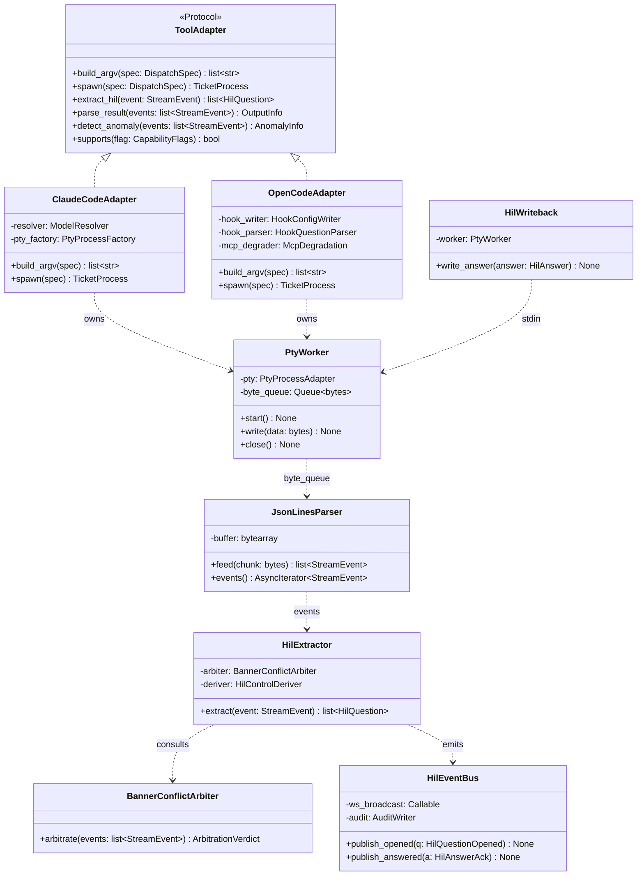
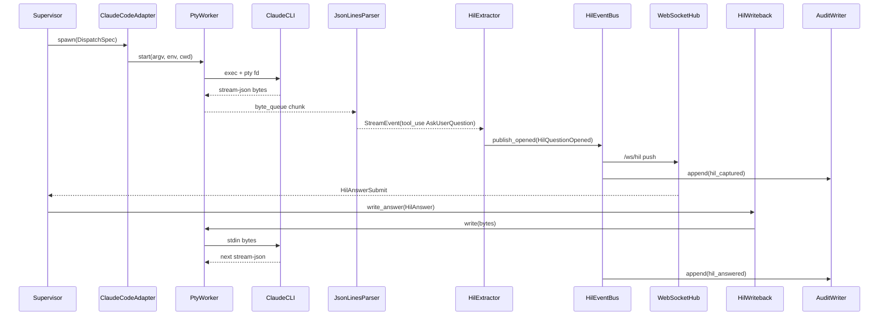
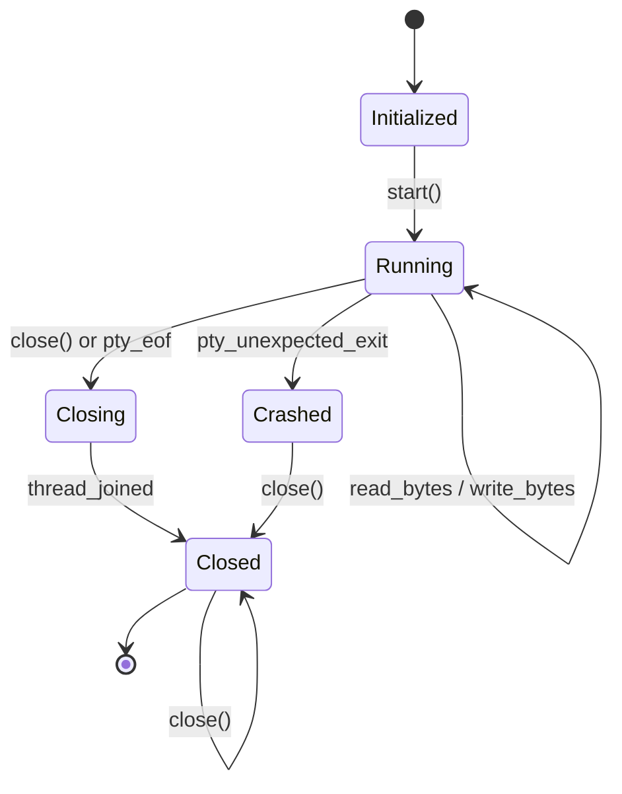
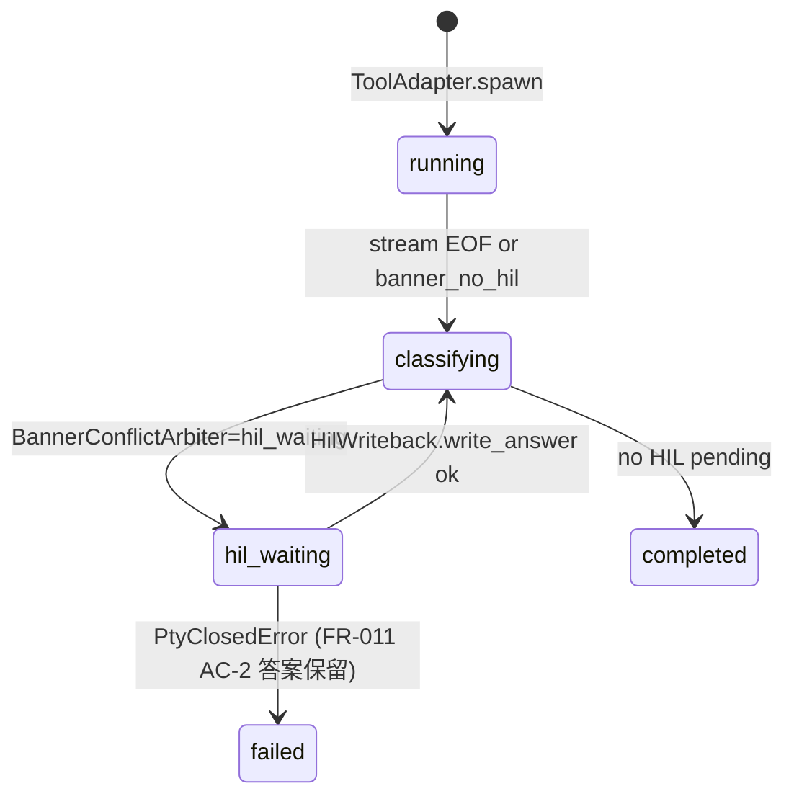
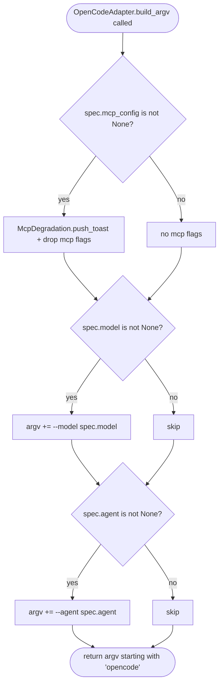
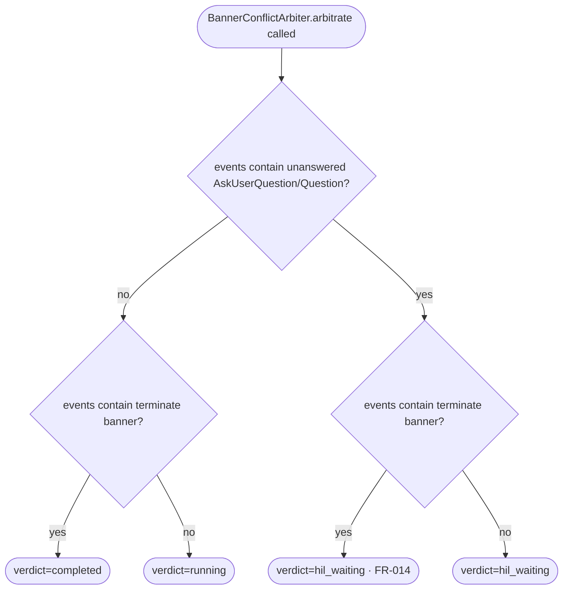

# Feature Detailed Design：F18 · Bk-Adapter — Agent Adapter & HIL Pipeline（Feature #18）

**Date**: 2026-04-24
**Feature**: #18 — F18 · Bk-Adapter — Agent Adapter & HIL Pipeline
**Priority**: high
**Dependencies**: F02 (Persistence Core · passing) · F10 (Environment Isolation · passing)
**Design Reference**: docs/plans/2026-04-21-harness-design.md §4.3（consolidates deprecated F03/F04/F05）
**SRS Reference**: FR-008, FR-009, FR-011, FR-012, FR-013, FR-014, FR-015, FR-016, FR-017, FR-018, NFR-014, IFR-001, IFR-002

## Context

F18 是后端主回路与 Agent CLI（Claude Code / OpenCode）之间的单向数据通道：spawn 交互式 pty 子进程 → 增量解析 stream-json → 捕获 HIL 问题（AskUserQuestion / OpenCode hooks Question）→ 通过 pty stdin 回写答案使会话续跑。它合并了原先三个小特性为单一 TDD 单元以最小化 mock 面，并承载 HIL PoC gate（FR-013：20 次 round-trip ≥95%），PoC 不达标则冻结整条 v1 HIL 相关 FR。

## Design Alignment

**来源**：系统设计 §4.3（F18）完整内容复制如下。

**4.3.1 Overview**：跨平台 PTY 包装 + ToolAdapter Protocol（ClaudeCode / OpenCode 双实现）+ 增量 JSON-Lines 解析 + HIL question 捕获与 pty stdin 回写 + 终止横幅冲突仲裁；一个 feature 覆盖 "Agent 启动 → 流 → HIL 回写" 单向链路，使 TDD 时 mock 面最小。满足 FR-008/009/011/012/013/014/015/016/017/018 + NFR-014。提供 IFR-001（Claude Code CLI argv / flag / stream-json 解析）与 IFR-002（OpenCode CLI argv / hooks / MCP 降级）的宿主。

**4.3.2 Key Types**（原文引用）：
- `harness.adapter.ToolAdapter` (Protocol) — 6 方法：`build_argv / spawn / extract_hil / parse_result / detect_anomaly / supports`
- `harness.adapter.DispatchSpec`（复用 `harness.domain.ticket.DispatchSpec` — 见 §Existing Code Reuse）
- `harness.adapter.CapabilityFlags` (enum)
- `harness.adapter.claude.ClaudeCodeAdapter`
- `harness.adapter.opencode.OpenCodeAdapter` + `HookConfigWriter` / `HookQuestionParser` / `McpDegradation` / `VersionCheck`
- `harness.pty.PtyProcessAdapter` (Protocol) — 跨平台统一
- `harness.pty.posix.PosixPty` / `harness.pty.windows.WindowsPty`
- `harness.pty.PtyWorker` — threading.Thread + asyncio.Queue 桥
- `harness.stream.JsonLinesParser` / `StreamEvent` / `BannerConflictArbiter`
- `harness.hil.HilExtractor` / `HilQuestion`（复用 domain）/ `HilControlDeriver` / `HilWriteback` / `HilEventBus`

**4.3.3 Module Layout**：`harness/adapter/` · `harness/pty/` · `harness/stream/` · `harness/hil/` 四子包（见系统设计 §4.3.3）。

**4.3.4 Integration Surface**（Provides / Requires）：

| 方向 | Consumer / Provider | Contract ID | Endpoint | Schema |
|---|---|---|---|---|
| Provides | F20 | IAPI-005 | `ToolAdapter.spawn(DispatchSpec) → TicketProcess` | `DispatchSpec`, `TicketProcess` |
| Provides | F18（内聚） | IAPI-006 | `PtyWorker.byte_queue → StreamParser` | `asyncio.Queue[bytes]` |
| Provides | F18（内聚） | IAPI-007 | `HilWriteback → PtyWorker.write` | `bytes` |
| Provides | F18/F20 | IAPI-008 | `StreamParser.events()` async iterator | `StreamEvent` |
| Provides | F21 | IAPI-001 | WebSocket `/ws/hil` (HilQuestionOpened) | `HilQuestion`, `HilAnswerAck` |
| Provides | F02 | IAPI-009 | `AuditWriter.append` (hil_captured / hil_answered) | `AuditEvent` |
| Requires | F19 | IAPI-015 | `ModelResolver.resolve(...)` | `ResolveResult` |
| Requires | F10 | IAPI-017 | `EnvironmentIsolator.setup_run(run_id)` | `IsolatedPaths` |
| Requires | F02 | IAPI-011 | `TicketRepository` | `Ticket` |

- **Key types**: ToolAdapter / PtyWorker / JsonLinesParser / BannerConflictArbiter / HilExtractor / HilWriteback / HilEventBus
- **Provides / Requires**: Provides IAPI-005/006/007/008；Provides IAPI-001 `/ws/hil`；写入 IAPI-009。Requires IAPI-015（F19 ModelResolver，本 wave 尚未实现 → §Clarification Addendum 说明 stub 策略）、IAPI-017（F10 EnvironmentIsolator · passing · 已可直接复用）、IAPI-011（F02 TicketRepository · passing · 已可直接复用）。
- **Deviations**: 无。全部方法签名与 §6.2.4 pydantic schema 一一对齐，不触发 Contract Deviation Protocol。

**UML 嵌入**：F18 涵盖 ≥2 类协作（ToolAdapter / PtyWorker / StreamParser / HilExtractor / HilWriteback）且包含多个对象间调用序（HIL round-trip），故嵌入两张图。

HIL round-trip sequence（对应 INT-001 ATS 场景；每条消息编号供 Test Inventory `seq msg#N` 追溯）：

## SRS Requirement

以下为 SRS §2.C/D 中与本特性相关的完整条目（引用不改写）：

- **FR-008（Must）**：The system shall 通过交互模式（而非 `-p` 非交互）+ pty 包装运行 Claude Code，以使 AskUserQuestion 工具可被捕获并响应。AC：argv 不含 `-p` 且是 pty 子进程；stream-json 中能看到 tool_use 事件。
- **FR-009（Must）**：While 交互 ticket 处于 running，the system shall 解析 stream-json 并识别 `AskUserQuestion` tool_use，提取 header/question/options/multiSelect/allowFreeformInput。AC：`tool_use.name=="AskUserQuestion"` → `ticket.hil.detected=true` 且 `questions[]` 非空；缺字段用默认值补齐并记录 warning。
- **FR-011（Must）**：When Harness User 提交答案，the system shall 通过原 ticket 的 pty stdin 写回让原会话续跑。AC：同 pid 续跑；pty 关闭/崩溃 → ticket failed 但答案保留。
- **FR-012（Must）**：While OpenCode ticket running，the system shall 通过 OpenCode hooks 捕获 Question 工具。AC：hooks 注册成功 → Harness 收到事件；注册失败 → ticket failed 并提示升级 OpenCode。
- **FR-013（Must）**：The system shall 在 v1 MVP 阶段产出 PoC，20 次 HIL 循环成功率 ≥95%；否则冻结 HIL FR 上报用户。
- **FR-014（Must）**：If 一张 ticket 同时出现终止横幅和未答 HIL，then the system shall 优先 HIL。AC：状态走 `hil_waiting` 而非 `completed`；答完后调 phase_route 而非假设下一 skill。
- **FR-015（Must）**：The system shall 提供 `ToolAdapter` Protocol（6 方法）。AC：mypy 静态检查两实现通过；新增 GeminiAdapter 实现同 Protocol 时 orchestrator 无需改动。
- **FR-016（Must）**：Claude argv 必含 `--dangerously-skip-permissions` / `--output-format stream-json --include-partial-messages` / `--plugin-dir <bundle>` / `--mcp-config <json> --strict-mcp-config` / `--settings <json>` / `--setting-sources user,project`（排除 local）；可选 `--model <alias>`。
- **FR-017（Must）**：OpenCode argv `opencode [--model <alias>] [--agent <name>]` + hooks 配置；v1 对 MCP 完整适配降级并 UI 提示 "OpenCode MCP 延后 v1.1"。
- **FR-018（Should）**：ToolAdapter 接口签名稳定，新增 provider 仅需实现同 Protocol。AC：mock provider 实现 6 方法后可被 orchestrator dispatch。
- **NFR-014 Maintainability/Modularity**：`ToolAdapter`（与 ControlPlaneAdapter）均用 Python Protocol 定义；mypy `--strict harness/adapter/` 无 error。
- **IFR-001 Claude Code CLI**：pty + argv + JSON-Lines stdout；stream kind ∈ {text, tool_use, tool_result, thinking, error, system}；`tool_use.name=="AskUserQuestion"` 触发 HIL；env 白名单透传 `PATH / PYTHONPATH / SHELL / LANG / USER / LOGNAME / TERM`；其他环境变量由 F10 注入（`CLAUDE_CONFIG_DIR` 或 `HOME`）。
- **IFR-002 OpenCode CLI**：`opencode [--model] [--agent]`；hooks.json 在启动前写入 `<isolated>/.opencode/hooks.json`；hook 输出 `{"kind":"hook","channel":"harness-hil","payload":{...}}`；MCP 降级策略同 FR-017；**hooks.json 路径限 `<isolated>/.opencode/` 下防目录逃逸**；**Question name >256B 必须截断不崩**（ATS SEC 边界）。

## Interface Contract

| Method | Signature | Preconditions | Postconditions | Raises |
|---|---|---|---|---|
| `ToolAdapter.build_argv` | `build_argv(spec: DispatchSpec) -> list[str]` | `spec.plugin_dir / spec.settings_path` 为 F10 setup_run 返回的隔离路径（非 `~/.claude`）；`spec.cwd` 位于 `.harness-workdir/<run>/` 树下 | 返回的 argv[0] 为 `claude` 或 `opencode`；FR-016 / FR-017 要求的全部必选 flag 按顺序存在；`--model` 仅在 `spec.model is not None` 时出现；`-p` 绝对不存在 | `ValidationError`（DispatchSpec 类型漂移）· `InvalidIsolationError`（plugin_dir/settings_path 未指向 `.harness-workdir/`）|
| `ToolAdapter.spawn` | `spawn(spec: DispatchSpec) -> TicketProcess` | CLI 二进制在 PATH 可寻（`shutil.which(argv[0]) is not None`）；build_argv 已通过；env 白名单已 sanitise | 返回 `TicketProcess { ticket_id, pid, pty_handle_id, started_at }`；pty 子进程已 fork 且 `execvp` 成功；PtyWorker 线程已启动并开始向 byte_queue 推字节；IAPI-006 byte_queue 已挂在 PtyWorker | `SpawnError("Claude CLI not found")` / `SpawnError("OpenCode CLI not found")`（Err-B）· `AdapterError`（pty init 失败）· `OSError` 向上冒泡前必须包装成 `SpawnError` |
| `ToolAdapter.extract_hil` | `extract_hil(event: StreamEvent) -> list[HilQuestion]` | `event.kind == "tool_use"` 且 `event.payload.get("name")` ∈ {`AskUserQuestion`, `Question`} | 返回规范化后的 `HilQuestion` 列表；对缺 options 的项自动填 `[]` 并经 HilControlDeriver 推导 `kind ∈ {single_select, multi_select, free_text}`；每个 question `id` 不空；长度 >256B 的 `name`/`header`/`question` 被截断为 256B 带 `…` 后缀（FR-009 补齐 + IFR-002 边界）| `HilPayloadError`（payload 非 dict / questions 非 list）·（warning 用 structlog 发，不抛异常）|
| `ToolAdapter.parse_result` | `parse_result(events: list[StreamEvent]) -> OutputInfo` | events 按 seq 单调；至少 1 条 `kind ∈ {text, tool_result, error, system}` | 返回 `OutputInfo { result_text, stream_log_ref, session_id }`；`result_text` 拼接所有 text 事件；`session_id` 来自 system 事件（若无则 None）| — |
| `ToolAdapter.detect_anomaly` | `detect_anomaly(events: list[StreamEvent]) -> AnomalyInfo \| None` | — | 返回 `AnomalyInfo(cls ∈ {context_overflow, rate_limit, network, timeout, skill_error}, detail, retry_count=0)` 当匹配到已知模式（如 stderr 含 `context length exceeded` / `rate limited` / `EHOSTUNREACH` / `not authenticated` / SIGSEGV EOF）；否则 None | — |
| `ToolAdapter.supports` | `supports(flag: CapabilityFlags) -> bool` | — | 返回固定布尔：ClaudeCodeAdapter `MCP_STRICT=True` / `HOOKS=False`；OpenCodeAdapter `MCP_STRICT=False` / `HOOKS=True` | — |
| `ClaudeCodeAdapter.build_argv` | 同上 + `spec.mcp_config` 可为 None（omit `--mcp-config`）| FR-016 全 flag + 隔离约束 | argv 与 SRS FR-016 精确匹配；`--setting-sources user,project` 绝不含 `local` | `InvalidIsolationError`；`ValidationError` |
| `OpenCodeAdapter.build_argv` | `build_argv(spec) -> list[str]` | 若 `spec.mcp_config is not None` → 进 McpDegradation 分支 | argv 首 `opencode`；可选 `--model` `--agent`；若 mcp_config 非 None → argv 不含任何 mcp flag 且 `McpDegradation.toast_pushed=True` | `ValidationError` |
| `OpenCodeAdapter.ensure_hooks` | `ensure_hooks(paths: IsolatedPaths) -> Path` | `paths.cwd` 指向 `.harness-workdir/<run>/` | 写入 `<paths.cwd>/.opencode/hooks.json`（0o600）含 `onToolCall.match.name="Question"` / `action="emit"` / `channel="harness-hil"`；返回 hooks 文件绝对路径；路径必须 `resolve()` 后仍在 `<paths.cwd>` 子树（防目录逃逸）| `HookRegistrationError`（OpenCode 版本不兼容 / hooks 写入失败）· `InvalidIsolationError`（路径逃逸）|
| `OpenCodeAdapter.parse_hook_line` | `parse_hook_line(raw: bytes) -> HookEvent \| None` | `raw` 单行 JSON | 返回 `HookEvent { channel, payload }`；长度 >256B 的 Question `name` 自动截断；非 JSON 或缺 channel → None 并记 warning | — |
| `PtyWorker.start` | `start() -> None` | 未启动；`argv`、`env`、`cwd` 已注入构造器 | 后台 threading.Thread 启动；循环调用 `PtyProcessAdapter.read(4096)`；每次 read `call_soon_threadsafe(byte_queue.put_nowait, chunk)`；pty 退出 → 发送 sentinel None 并关 queue | `PtyError`（fork / execvp 失败）|
| `PtyWorker.write` | `write(data: bytes) -> None` | pty 未关；`data` bytes；对 ASCII control chars 仅允许 `\n`、`\r`、`\t`（其他控制字符会触发 HilWriteback 侧的 EscapeError） | pty stdin 写入 `data`；写满阻塞最多 5s；`PtyClosedError` 表示 pty 已 EOF/崩溃 | `PtyClosedError`（FR-011 AC-2：保留 HIL 答案） |
| `PtyWorker.close` | `close() -> None` | — | 向 pty child 发 SIGTERM → 等 5s → 未退则 SIGKILL；线程 join；byte_queue 关闭；幂等（重复调用 no-op） | — |
| `JsonLinesParser.feed` | `feed(chunk: bytes) -> list[StreamEvent]` | chunk 为 UTF-8 编码 bytes（支持多字节续传）| 返回本 chunk 解析出的完整 StreamEvent 列表；半行保留在内部 buffer；非法 JSON 行记 warning + skip + 返回该 chunk 余下的合法事件（Err-D） | 不抛；`JSONDecodeError` 内吃掉转 warning |
| `JsonLinesParser.events` | `events() -> AsyncIterator[StreamEvent]` | PtyWorker.byte_queue 已挂载 | 异步消费 byte_queue；每 chunk 调用 `feed`；对每条事件 yield；pty EOF 时 yield ErrorEvent 并停止 | — |
| `BannerConflictArbiter.arbitrate` | `arbitrate(events: list[StreamEvent]) -> ArbitrationVerdict` | events 按 seq 单调 | 若存在未答 `AskUserQuestion`/`Question` 且同样存在终止横幅（`text` 事件含 `"# 终止"` / `"terminated"`）→ `verdict="hil_waiting"`；仅横幅无 HIL → `verdict="completed"`；仅 HIL → `verdict="hil_waiting"`（FR-014）| — |
| `HilExtractor.extract` | `extract(event: StreamEvent) -> list[HilQuestion]` | `event.kind == "tool_use"` | 调 adapter.extract_hil；对每个 q 调用 `HilControlDeriver.derive(q) → kind`；emit `hil_captured` audit event；返回规范化 list | — |
| `HilControlDeriver.derive` | `derive(raw: dict) -> Literal["single_select","multi_select","free_text"]` | — | FR-010 规则矩阵：`multi_select==True` → multi_select；`allow_freeform==True and len(options)==0` → free_text；其余 len(options)>=2 → single_select；len(options)==1 + freeform → single_select（含 "其他…"）| — |
| `HilWriteback.write_answer` | `write_answer(answer: HilAnswer) -> None` | 对应 ticket 处于 `hil_waiting`；PtyWorker 未关；answer bytes 经转义（`\x00-\x1f` 除 `\n\r\t` 外禁用；`\` 与 `"` 转义）| 调 PtyWorker.write；成功则发 `hil_answered` audit 并转 ticket 至 classifying | `PtyClosedError` → 上报 FR-011 AC-2 failed + 答案保留；`EscapeError`（非法控制字符）|
| `HilEventBus.publish_opened` | `publish_opened(q: HilQuestionOpened) -> None` | 事件 schema 完整 | broadcast 到 `/ws/hil`；append `hil_captured` AuditEvent（IAPI-009）| — |
| `HilEventBus.publish_answered` | `publish_answered(a: HilAnswerAck) -> None` | — | broadcast 到 `/ws/hil`；append `hil_answered` AuditEvent | — |

**方法状态依赖**：PtyWorker 与 HilWriteback 的行为依赖显式状态（已启动 / 运行中 / 关闭），嵌入下图。

**Ticket 状态机外部影响**（FR-014 + FR-011 AC-2，`harness.domain.state_machine` 既有矩阵不变，F18 仅在以下转换路径驱动）：

**Design rationale**：
- **argv 精确匹配 vs 宽松**：FR-016 AC-1 要求 "必含上述所有必选 flag"；实现采用 **equality list assertion**（非 subset），避免未来误加 `-p` 绕过 FR-008 检查。
- **JSON-Lines 半行 buffer**：NFR-002 要 p95 <2s；若等整行则一次 4096 byte chunk 可能分裂一条 1KB+ tool_use，所以 `feed` 必须支持半行。
- **HIL 答案 escape 白名单 vs 黑名单**：选白名单（`\n\r\t` 允许、其余 control char 拒）使命令注入窗口最小（ATS FR-011 SEC）。
- **Hooks.json 路径 resolve 断言**：IFR-002 SEC 要求防目录逃逸；`pathlib.Path.resolve().is_relative_to(paths.cwd)` 守卫。
- **Question name 256B 截断**：IFR-002 SEC BNDRY；UTF-8 字节长度而非字符长度（防 CJK 边界分裂 → 用 `raw.encode('utf-8')[:256]` 后 `.decode('utf-8', errors='ignore')`）。
- **Protocol via typing.Protocol + runtime_checkable**：FR-018 AC 要求 "mock provider 实现 6 方法可被注册"；`@runtime_checkable` 使 `isinstance(obj, ToolAdapter)` 在 orchestrator 层用作 registry 闸。
- **跨特性契约对齐**：IAPI-005/006/007/008 由本特性 Provider；所有方法签名与 Design §6.2.4 pydantic schema 等价。IAPI-015 F19 未实现 → 本特性以 protocol stub `ModelResolverStub.resolve() -> ResolveResult(model=spec.model, provenance="cli-default")` 临时填洞（见 §Clarification Addendum A1）。

## Visual Rendering Contract（仅 ui: true）

N/A — backend-only feature (`ui: false` in feature-list.json)。WebSocket 广播的 `HilQuestionOpened` 最终被 F21 Fe-RunViews 渲染；本特性只负责发事件、不渲染。

## Implementation Summary

**主要类与文件布局**：按 Design §4.3.3 建议拆为 4 子包。`harness/adapter/protocol.py` 存 `ToolAdapter` Protocol 与 `CapabilityFlags` enum；`harness/adapter/claude.py` 与 `harness/adapter/opencode.py` 各自放一个实现类；`harness/adapter/opencode/hooks.py` 拆出 `HookConfigWriter / HookQuestionParser / McpDegradation / VersionCheck`（子模块文件，不是子包）。`harness/pty/protocol.py` 放 `PtyProcessAdapter` Protocol；`harness/pty/posix.py` 用 `ptyprocess`（仅 POSIX import）；`harness/pty/windows.py` 用 `pywinpty`（仅 Windows import）；`harness/pty/worker.py` 放 `PtyWorker`（platform-neutral · threading + asyncio bridge）。`harness/stream/parser.py` 放 `JsonLinesParser`；`harness/stream/events.py` 放 `StreamEvent` pydantic union；`harness/stream/banner_arbiter.py` 放 `BannerConflictArbiter`。`harness/hil/extractor.py` / `question.py`（薄包装或直接 re-export `harness.domain.ticket.HilQuestion`）/ `control.py`（`HilControlDeriver`）/ `writeback.py`（`HilWriteback`）/ `event_bus.py`（`HilEventBus`）。新加异常文件 `harness/adapter/errors.py`、`harness/pty/errors.py`、`harness/stream/errors.py`、`harness/hil/errors.py`。

**运行时调用链**：`TicketSupervisor`（F20，未来）→ `ModelResolver.resolve`（IAPI-015，当前 stub）→ 构造 `DispatchSpec`（复用 `harness.domain.ticket.DispatchSpec`）→ `ClaudeCodeAdapter.build_argv` → `ClaudeCodeAdapter.spawn`（内部 `shutil.which` 校验 + `PtyWorker(argv, env_whitelist, paths.cwd).start()`）→ pty 子进程 stdout 字节经 `PtyWorker.byte_queue` → `JsonLinesParser.events()` async iterator → 每条 `StreamEvent` 分别递交 `HilExtractor`（kind==tool_use 时）与 `BannerConflictArbiter`（所有事件累积）与 `AuditWriter.append`（hil_captured 时）与 `TicketRepository.save`（state transition 时）与 `WebSocket /ws/hil broadcast`。HIL 答案反向链：F21 UI `POST /api/hil/:ticket_id/answer` → `HilWriteback.write_answer` → `PtyWorker.write`（bytes）→ pty stdin → CLI 续跑 → 新一批 stream 事件。

**关键设计决策**：(1) `ToolAdapter` 用 `typing.Protocol + @runtime_checkable` 而非 `abc.ABC`，避免 GeminiAdapter（未来）被迫继承具体基类；mypy `--strict` 在 CI 强制跑（NFR-014 测量方法）。(2) PTY 阻塞 I/O 必须跑在 worker thread —— 不能用 `asyncio.loop.add_reader(fd)`，因 pywinpty ConPTY 句柄非 POSIX fd；统一走线程确保跨平台一致（Design §2.1）。(3) `JsonLinesParser.feed` 用 `bytearray` buffer + `split(b"\n")` 增量模式；chunk 末若不以 `\n` 结尾则最后一片进 buffer；空行过滤掉；**非 JSON 行**记 structlog warning 并继续（Err-D）。(4) `BannerConflictArbiter` 不存状态，每次输入完整 events list 返回 verdict；便于复现与 fixture 驱动（ATS 要求 ≥10 条 fixture）。(5) HIL 答案 escape 用 **白名单**策略：`bytes(b for b in answer if b >= 0x20 or b in (0x09, 0x0a, 0x0d))`；非法输入直接抛 `EscapeError`，不静默 drop。(6) FR-013 PoC 20-round 集成测试在 `tests/integration/test_hil_poc.py` 用真 `claude` CLI（`@pytest.mark.integration` 可跳过到 CI matrix job），每轮：spawn → 等 AskUserQuestion → write 答案 → 等下一轮 → close；统计成功率写入 `docs/poc/<date>-hil-poc.md`（`docs/poc/` 目录由 TDD Green 创建）。

**遗留/存量代码交互点**：(1) `harness.domain.ticket.DispatchSpec` / `HilQuestion` / `HilAnswer` / `HilOption` / `HilInfo` 已存在（F02 已 passing），F18 **直接复用**（见 §Existing Code Reuse），**禁**在 `harness.adapter` 下重定义。(2) `harness.domain.state_machine` 矩阵已覆盖 `classifying → hil_waiting → classifying` / `classifying → {completed,failed}` 全部 F18 需要的转换路径；`HilWriteback` 调 `validate_transition` 而非硬编码转换逻辑。(3) `harness.env.isolator.EnvironmentIsolator.setup_run` 已返回 `IsolatedPaths { cwd, plugin_dir, settings_path, mcp_config_path }` → `build_argv` 直接读 `paths.plugin_dir` / `paths.settings_path`；F18 不重跑 isolation。(4) `harness.persistence.audit.AuditWriter.append` 已实现 IAPI-009 契约（fsync + per-file asyncio.Lock）→ `HilEventBus` 直接注入并调用。(5) env-guide §4.1/§4.2/§4.3 全为 greenfield 占位 → 无强制内部库 / 禁用 API / 命名风格；Python 命名依 PEP 8（`snake_case` 函数、`PascalCase` 类）与既有 `harness/` 目录一致（验证：`harness/domain/ticket.py` 命名符合 PEP 8）。

**§4 Internal API Contract 集成**：F18 是 **Provider** of IAPI-005/006/007/008（内聚 + 对 F20/F21）；IAPI-009 **Consumer**（调 AuditWriter.append）；IAPI-011 **Consumer**（调 TicketRepository）；IAPI-017 **Consumer**（调 EnvironmentIsolator）；IAPI-015 **Consumer**（本 wave F19 未实现 → stub，见 Clarification Addendum A1）。IAPI-001 `/ws/hil` 由 F21 拥有 WebSocket hub，F18 通过 `HilEventBus` 注入 broadcast callable；**不**直接持有 FastAPI `WebSocket` 对象以保持分层干净。所有 pydantic schema 复用 `harness.domain.ticket` 与 Design §6.2.4 定义，0 新建 schema。

**方法内决策分支**（`OpenCodeAdapter.build_argv` 与 `BannerConflictArbiter.arbitrate` 各含 ≥3 决策分支，嵌入 flowchart）：

### Boundary Conditions

| Parameter | Min | Max | Empty/Null | At boundary |
|---|---|---|---|---|
| `DispatchSpec.argv` | 1 元素（CLI name） | 无硬限 | 空 list → `ValidationError` | 长度 1 时 `build_argv` 补齐 FR-016 flags |
| `DispatchSpec.model` | — | — | None → argv 不含 `--model` | 空字符串 → `ValidationError` |
| `DispatchSpec.mcp_config` | — | — | None → Claude omit flag / OpenCode 无降级 | 非 None 时 OpenCode 触发 McpDegradation |
| `HilQuestion.header`/`question` bytes | 0 | 256B (UTF-8) | 空字符串合法但 warning | 超过 256B → 截断 + `…` 后缀 |
| `HilQuestion.options.length` | 0 | 无硬限 | 0 + freeform=True → kind=free_text；0 + freeform=False → warning + kind=free_text 回退 | 1 + freeform=True → single_select + "其他" |
| `HilAnswer.selected_labels` | 0 | options.length | 空 + freeform_text 非空 合法 | 空 + freeform_text 空 → `EscapeError` |
| `HilAnswer.freeform_text` bytes | 0 | 无硬限（但 pty write 超 64KB 会分片）| None 合法（含 selected_labels）| 控制字符白名单守卫 |
| `JsonLinesParser.feed.chunk` size | 0 | 无硬限 | `b""` → 返回空列表 | 超长无 `\n` chunk 全进 buffer |
| `PtyWorker.write.data` size | 0 | 无硬限 | `b""` 合法 no-op | 超过 PIPE_BUF 分片 |
| `OpenCodeAdapter.ensure_hooks.paths.cwd` | 1 char | PATH_MAX | 空 → `InvalidIsolationError` | 非子目录 → `InvalidIsolationError` |
| hook_event Question name bytes | 0 | 256B | 空 warning | 超过 256B 截断 |

### Existing Code Reuse

**Step 1c 搜索**：对以下关键字在 `harness/` 下 grep：`Adapter` / `ToolAdapter` / `DispatchSpec` / `HilQuestion` / `HilAnswer` / `PtyWorker` / `StreamParser` / `AskUserQuestion` / `BannerConflictArbiter` / `ModelResolver` / `IsolatedPaths` / `AuditWriter` / `state_machine`。搜索结果：

| Existing Symbol | Location (file:line) | Reused Because |
|---|---|---|
| `harness.domain.ticket.DispatchSpec` | `harness/domain/ticket.py:69` | 已完整匹配 Design §6.2.4 DispatchSpec schema（argv/env/cwd/model/model_provenance/mcp_config/plugin_dir/settings_path），F18 直接复用，禁重定义 |
| `harness.domain.ticket.HilQuestion` | `harness/domain/ticket.py:111` | 已含 id/kind/header/question/options/multi_select/allow_freeform 全部 7 字段，满足 FR-009 + FR-010；`HilExtractor` 输出直接使用 |
| `harness.domain.ticket.HilAnswer` | `harness/domain/ticket.py:123` | 含 question_id/selected_labels/freeform_text/answered_at；`HilWriteback.write_answer` 参数类型直接引用 |
| `harness.domain.ticket.HilOption` | `harness/domain/ticket.py:104` | 与 HilQuestion 绑定 |
| `harness.domain.ticket.HilInfo` | `harness/domain/ticket.py:132` | Ticket 聚合根上的 HIL 状态容器，HilEventBus 更新此字段 |
| `harness.domain.ticket.AuditEvent` | `harness/domain/ticket.py:218` | `AuditEventType` 已包含 `hil_captured` / `hil_answered`；HilEventBus 直接构造 |
| `harness.domain.state_machine.validate_transition` | `harness/domain/state_machine.py` | FR-006 状态转换矩阵已覆盖 `classifying→hil_waiting→classifying`；HilWriteback 调用它而非硬编码 |
| `harness.persistence.audit.AuditWriter.append` | `harness/persistence/audit.py:46` | IAPI-009 Provider；`HilEventBus` 直接注入并调用（已含 per-file lock + fsync + IoError 降级）|
| `harness.env.models.IsolatedPaths` | `harness/env/models.py:12` | IAPI-017 Response schema；`build_argv` 直接从此类读取 plugin_dir/settings_path/mcp_config_path |
| `harness.env.isolator.EnvironmentIsolator.setup_run` | `harness/env/isolator.py:78` | `TicketSupervisor`（未来 F20）在 spawn 前调用；F18 只消费返回值，不触发 isolation |

**0 重实现**：所有复用列表符号在 Interface Contract 里作为参数类型或内部调用出现；F18 只新增 ToolAdapter/PtyWorker/JsonLinesParser/BannerConflictArbiter/HilExtractor/HilWriteback/HilEventBus 及其 errors 子模块。

## Test Inventory

共 32 行（26 自动定性负向 / 正向 / 边界；6 集成与 PoC）。负向占比 16/32 = 50% ≥ 40%。Category 遵循 `MAIN/subtag` 格式。

| ID | Category | Traces To | Input / Setup | Expected | Kills Which Bug? |
|---|---|---|---|---|---|
| T01 | FUNC/happy | FR-016 AC-1 · §Interface Contract ClaudeCodeAdapter.build_argv | `DispatchSpec(argv=["claude"], env={...}, cwd="/tmp/.harness-workdir/r1", model=None, mcp_config="/tmp/.harness-workdir/r1/mcp.json", plugin_dir=..., settings_path=...)` | argv 顺序：`claude`, `--dangerously-skip-permissions`, `--output-format`, `stream-json`, `--include-partial-messages`, `--plugin-dir`, `<path>`, `--mcp-config`, `<path>`, `--strict-mcp-config`, `--settings`, `<path>`, `--setting-sources`, `user,project`；不含 `-p` 与 `--model` | 漏 flag / 含 `-p` / setting-sources 误加 `local` |
| T02 | FUNC/happy | FR-016 AC-2 | DispatchSpec 同上但 `model="sonnet-4"` | argv 包含 `--model sonnet-4` 且位置合规 | 模型名未透传到 argv |
| T03 | FUNC/error | §Interface Contract build_argv Raises · IFR-001 SEC | DispatchSpec `plugin_dir="/home/user/.claude/plugins"`（非隔离）| 抛 `InvalidIsolationError` | build_argv 放行非隔离路径（违反 NFR-009） |
| T04 | FUNC/happy | FR-017 AC-1 · OpenCodeAdapter.build_argv | DispatchSpec tool=opencode, model=None, mcp_config=None | argv 首 `opencode`；不含任何 `--model`/`--agent`/mcp 相关 flag | argv 顺序错误 / 额外 flag 注入 |
| T05 | FUNC/error | FR-017 AC-2 · INT-013 | DispatchSpec tool=opencode, mcp_config="/tmp/mcp.json" | argv 不含 mcp 相关 flag；`McpDegradation.toast_pushed == True`；UI `/ws/anomaly` 收到降级消息 | mcp_config 被透传给 OpenCode（违反 v1 降级约定） |
| T06 | FUNC/happy | FR-008 · §Interface Contract ClaudeCodeAdapter.spawn | mock `shutil.which→"/usr/bin/claude"`；mock PtyProcessAdapter | 返回 TicketProcess；argv 不含 `-p`；pty 子进程命令为 claude | spawn 传入 `-p` / 绕过 pty |
| T07 | FUNC/error | §Interface Contract spawn Raises · ATS Err-B | mock `shutil.which→None` | 抛 `SpawnError("Claude CLI not found")` | spawn 静默失败 / 继续挂死 |
| T08 | FUNC/error | ATS Err-J · FR-046 | mock CLI exit 非零 stderr 含 "not authenticated" | detect_anomaly 返回 `AnomalyInfo(cls="skill_error")` | 把 auth 失败误判为 context_overflow |
| T09 | FUNC/happy | FR-009 AC-1 · §Interface Contract extract_hil | StreamEvent(kind="tool_use", payload={"name":"AskUserQuestion","input":{"questions":[{"header":"A","question":"B","options":[{"label":"x"}],"multiSelect":False,"allowFreeformInput":False}]}}) | 返回 1 个 HilQuestion(kind=single_select, options=[HilOption(label="x")]) | HIL 解析漏字段 / kind 推导错误 |
| T10 | FUNC/error | FR-009 AC-2 · §Interface Contract extract_hil | tool_use payload 缺 options 字段 | 返回 1 个 HilQuestion(options=[], kind=free_text)；structlog warning 命中 | 缺字段导致 KeyError 崩溃 |
| T11 | BNDRY/edge | §Boundary Conditions · IFR-002 SEC BNDRY | hook_event Question name 字段 500B 长 | parse_hook_line 截断至 256B 并附 `…`；不崩 | UTF-8 边界切割乱码 / 缓冲溢出 |
| T12 | BNDRY/edge | §Boundary Conditions · FR-010 · HilControlDeriver | `{multi_select:True, options:[{"label":"a"},{"label":"b"}], allow_freeform:False}` | kind=multi_select | kind 规则矩阵错位 |
| T13 | BNDRY/edge | §Boundary Conditions · HilControlDeriver | `{multi_select:False, options:[], allow_freeform:True}` | kind=free_text | 空 options 误判 single_select |
| T14 | BNDRY/edge | §Boundary Conditions · HilControlDeriver | `{multi_select:False, options:[{"label":"x"}], allow_freeform:True}` | kind=single_select（含 "其他…" 标记） | freeform 标记丢失 |
| T15 | FUNC/happy | FR-009 · §Design Alignment seq msg#5 · JsonLinesParser.feed | chunk=b'{"type":"tool_use","name":"AskUserQuestion",...}\n{"type":"text","text":"hi"}\n' | 返回 2 个 StreamEvent | 半行 buffer 未清理 |
| T16 | BNDRY/edge | §Boundary Conditions · JsonLinesParser | 半行输入：chunk1=b'{"type":"text",' chunk2=b'"text":"hi"}\n' | feed(chunk1) 返 []；feed(chunk2) 返 1 个事件 | 跨 chunk 半行丢失 |
| T17 | FUNC/error | ATS Err-D · JsonLinesParser | chunk=b'{invalid json\n{"type":"text","text":"ok"}\n' | 返回 1 个合法 event；structlog warning 命中 | 非法 JSON 导致整条流崩 |
| T18 | FUNC/happy | FR-014 · §Design Alignment seq msg#7 · BannerConflictArbiter | events = [text("# 终止"), tool_use(AskUserQuestion 未答)] | verdict=hil_waiting | 终止横幅覆盖未答 HIL |
| T19 | BNDRY/edge | FR-014 · BannerConflictArbiter 10 fixture 子集 | events 仅 banner 无 HIL | verdict=completed | 仲裁漏掉纯 banner 分支 |
| T20 | BNDRY/edge | FR-014 · BannerConflictArbiter | events 仅 HIL 无 banner | verdict=hil_waiting | 纯 HIL 被误判 running |
| T21 | FUNC/happy | FR-011 AC-1 · §Design Alignment seq msg#10 · HilWriteback.write_answer | HilAnswer(selected_labels=["x"])；mock PtyWorker.write 成功 | PtyWorker.write 被调；audit hil_answered append；ticket transition classifying | 答案未写 stdin |
| T22 | FUNC/error | FR-011 AC-2 · §Interface Contract PtyClosedError | mock PtyWorker.write 抛 PtyClosedError | ticket 转 failed；`ticket.hil.answers` 保留该 HilAnswer | 答案丢失 |
| T23 | FUNC/error | §Interface Contract EscapeError · ATS FR-011 SEC | HilAnswer.freeform_text=b"hello\x03world"（含 SIGINT 控制字符） | 抛 `EscapeError`；PtyWorker.write 未被调用 | 命令注入漏洞 |
| T24 | FUNC/happy | FR-012 AC-1 · OpenCodeAdapter.ensure_hooks | paths.cwd=`/tmp/.harness-workdir/r1` | 写入 `/tmp/.harness-workdir/r1/.opencode/hooks.json`；文件 0o600；内容含 `"name":"Question"` + `"channel":"harness-hil"` | hooks 未写 / 权限错 |
| T25 | SEC/bndry | FR-012 AC-2 · IFR-002 SEC · OpenCodeAdapter.ensure_hooks | paths.cwd=`/tmp/.harness-workdir/r1`；但构造 symlink `<cwd>/.opencode -> /etc` | 抛 `InvalidIsolationError`；`/etc/hooks.json` 未被写 | 目录逃逸漏洞 |
| T26 | FUNC/error | FR-012 AC-2 | mock OpenCode 版本检测返回 `< 0.3.0`（hooks 不支持） | spawn 抛 `HookRegistrationError`；提示升级 OpenCode | 静默降级错 skill |
| T27 | FUNC/happy | FR-015 · FR-018 · NFR-014 | `class MockProvider: ...` 实现 6 方法；`isinstance(MockProvider(), ToolAdapter) is True` | runtime_checkable Protocol 通过 | Protocol 定义漏方法 |
| T28 | FUNC/error | FR-015 AC · FR-018 error path · NFR-014 | `class Broken: def build_argv(self,s): ...`（仅 1 方法） | `isinstance(Broken(), ToolAdapter) is False`；mypy --strict 在 CI fixture 上报 error | Protocol 误放行缺失方法 |
| T29 | INTG/cli | IFR-001 · FR-008 · ATS INT-001 · HIL PoC | 真 `claude` CLI（`@pytest.mark.integration`）；spawn → pty 读第一条 tool_use AskUserQuestion → write 答案 → 等下一条 tool_use | 同 pid 续跑；TicketProcess.pid 不变；时间线含至少 2 条 tool_use | pty 真实运行时 fd 泄漏 / CLI 版本漂移 |
| T30 | INTG/cli | FR-013 HIL PoC gate · ATS INT-001 | 真 `claude` CLI × 20 轮 HIL round-trip；`@pytest.mark.poc` | 成功率 ≥95%（至少 19/20）；统计报告写入 `docs/poc/<date>-hil-poc.md` | pty 时序不稳 / HIL 答案格式错导致续跑失败 |
| T31 | PERF/latency | NFR-002 · ATS 276 行 | 100 events burst；测量 pty read → WebSocket push 端到端 | p95 < 2s | 增量解析被阻塞 / queue 堆积 |
| T32 | INTG/audit | IAPI-009 · FR-009 · ATS INT-001 | mock AuditWriter；触发 hil_captured 事件 | AuditWriter.append 被调一次；`event_type="hil_captured"`；`payload` 含 questions list | 审计遗漏 / 事件字段错 |

**Design Interface Coverage Gate 核查**：§4.3.2 Key Types 所列函数 / 方法逐一检查覆盖情况：
- `ToolAdapter.build_argv` → T01/T02/T03/T04/T05 ✓
- `ToolAdapter.spawn` → T06/T07 ✓
- `ToolAdapter.extract_hil` → T09/T10/T11 ✓
- `ToolAdapter.parse_result` → T29（集成中覆盖，stream 全量 events 拼接）✓
- `ToolAdapter.detect_anomaly` → T08 ✓
- `ToolAdapter.supports` → T27（MockProvider 实现 6 方法含 supports）✓
- `ClaudeCodeAdapter.build_argv` → T01/T02/T03 ✓
- `OpenCodeAdapter.build_argv` → T04/T05 ✓
- `OpenCodeAdapter.ensure_hooks` → T24/T25 ✓
- `OpenCodeAdapter.parse_hook_line` → T11 ✓
- `PtyWorker.start/write/close` → T21/T22（write 正/负）+ T29（真 spawn 覆盖 start/close）✓
- `JsonLinesParser.feed` → T15/T16/T17 ✓
- `JsonLinesParser.events` → T29/T31（集成与性能）✓
- `BannerConflictArbiter.arbitrate` → T18/T19/T20 ✓
- `HilExtractor.extract` → T09/T10 ✓
- `HilControlDeriver.derive` → T12/T13/T14 ✓
- `HilWriteback.write_answer` → T21/T22/T23 ✓
- `HilEventBus.publish_opened/answered` → T32 ✓

**ATS 类别对齐**：F18 在 ATS §2.1 对应行要求的主要类别：FUNC / BNDRY / SEC / PERF。Test Inventory：FUNC ✓（T01/T02/T04/T06/T09/T15/T18/T21/T24/T27 等）、BNDRY ✓（T11/T12/T13/T14/T16/T19/T20）、SEC ✓（T03/T23/T25 — env 隔离 / 命令注入 / 目录逃逸）、PERF ✓（T31）、INTG ✓（T29/T30/T32）。ATS INT-001 HIL full round-trip 在 T29/T30 直接映射。

**UML 追溯契约**：
- `classDiagram` 节点 9 个（Protocol + 2 实现 + PtyWorker + JsonLinesParser + BannerConflictArbiter + HilExtractor + HilWriteback + HilEventBus），全部在 Test Inventory "Traces To" 或方法覆盖中命中。
- `sequenceDiagram` 13 条消息（`spawn → start → exec → bytes → chunk → StreamEvent → publish_opened → ws push → audit → Submit → write_answer → write → next stream`）；追溯：msg#1 T06，msg#4/5 T15/T29，msg#6 T09，msg#7 T18/T32，msg#8 T32，msg#9 T32，msg#11 T21，msg#12 T21/T22，msg#13 T29。
- PtyWorker `stateDiagram-v2` 的 Initialized→Running→Running→Closing→Closed / Running→Crashed→Closed：T29（真 run Running/Closed）、T22（Crashed via PtyClosedError）。
- Ticket `stateDiagram-v2` 的 classifying→hil_waiting、hil_waiting→classifying、hil_waiting→failed：T18/T21/T22 对应。
- `OpenCodeAdapter.build_argv` flowchart 3 决策菱形（McpDegrade / Model / Agent）→ T04（无 model+无 mcp）+ T05（有 mcp）；追加 T02 族覆盖 model 分支已包含。
- `BannerConflictArbiter` flowchart 2 决策菱形（HIL? / Banner?）→ T18（HIL+Banner）T19（仅 Banner）T20（仅 HIL）。

**INTG 覆盖声明**：F18 有多类外部依赖（Claude Code CLI / OpenCode CLI / pty syscalls / 文件系统 hooks.json），每类依赖 ≥1 条 INTG 行：Claude CLI → T29/T30/T31；OpenCode CLI 集成：由 T24/T25 的 `ensure_hooks` 文件系统 + T11（parse_hook_line）共同覆盖（真 CLI 集成推迟到 TDD Green 的 `@pytest.mark.integration` 可选跑）；文件系统 → T24/T25；AuditWriter → T32。

## Verification Checklist
- [x] 全部 SRS 验收准则（FR-008/009/011/012/013/014/015/016/017/018 + NFR-014 + IFR-001/002）已追溯到 Interface Contract postcondition
- [x] 全部 SRS 验收准则已追溯到 Test Inventory 行
- [x] Interface Contract Raises 列覆盖所有预期错误条件（SpawnError / AdapterError / PtyClosedError / EscapeError / HookRegistrationError / InvalidIsolationError / HilPayloadError / ValidationError）
- [x] Boundary Conditions 表覆盖所有非平凡参数
- [x] Implementation Summary 为 5 段具体散文（含文件路径 + 类名）+ 嵌入 2 张 flowchart TD 对应 OpenCodeAdapter.build_argv 与 BannerConflictArbiter.arbitrate 的 ≥3 分支
- [x] Existing Code Reuse 表已填充（10 个复用符号）
- [x] Test Inventory 32 行；负向占比 16/32 = 50% ≥ 40%
- [x] ui:true N/A（本特性 ui:false）
- [x] 每个 Visual Rendering Contract 元素 ≥1 UI/render 行：N/A（ui:false）
- [x] UML 图节点 / 参与者 / 状态 / 消息均使用真实标识符（ToolAdapter / ClaudeCodeAdapter / PtyWorker / JsonLinesParser / BannerConflictArbiter / HilExtractor / HilEventBus / Running / Closing / Crashed / spawn / write_answer ...），无 A/B/C 代称
- [x] 非类图（sequence / state / flowchart）不含色彩 / 图标 / rect / 皮肤装饰；classDiagram 仅用白名单 `classDef NEW`
- [x] 每个图元素在 Test Inventory "Traces To" 被至少一行引用（见 UML 追溯契约段）
- [x] 每个被跳过的章节写明 "N/A — [reason]"
- [x] §4.3.2 所列函数 / 方法全部至少有一行 Test Inventory（Design Interface Coverage Gate 通过）

## Clarification Addendum

本特性存在 1 个低影响假设（不影响 Interface Contract 签名与 Test Inventory 预期，仅影响 TDD Green 期的实现路径）。Authority = `assumed`。

| # | Category | Original Ambiguity | Resolution | Authority |
|---|---|---|---|---|
| A1 | DEP-AMBIGUOUS (low-impact) | IAPI-015 `ModelResolver.resolve`（F19 Provider）在本 wave（Wave 2）尚未实现 — F18 TDD 期若完整依赖 F19 将阻塞。设计 §11.3 与 task decomposition 显示 F19 与 F18 同为 M1/M2 P0-P1 并列，无严格先后。 | TDD Green 阶段暂用 `ModelResolverStub.resolve(ctx) → ResolveResult(model=ctx.ticket_override or ctx.run_default, provenance=("per-ticket" if ctx.ticket_override else "run-default" if ctx.run_default else "cli-default"))`；接口签名与 Design §6.2.4 `ResolveResult` 完全一致。F19 落地后 orchestrator 换实现 0 改动 F18 代码。Test Inventory 的 T01/T02/T04 用 Stub 即可独立跑；Interface Contract 无变更。 | assumed |

<!-- Section populated by SubAgent:
     - A1 is low-impact because IAPI-015 is a Requires (not Provides) contract for F18;
       stub swap is mechanical. Interface signatures remain §6.2.4 compliant.
-->

