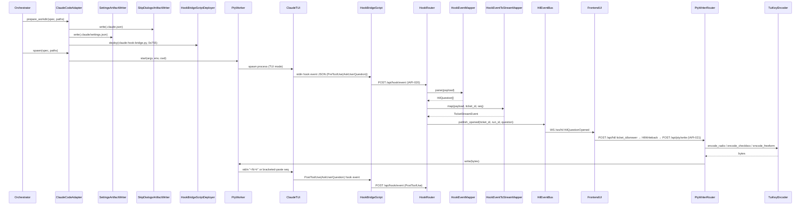
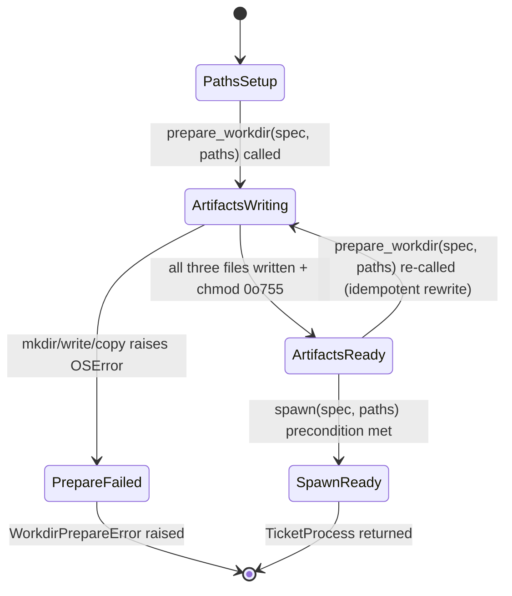
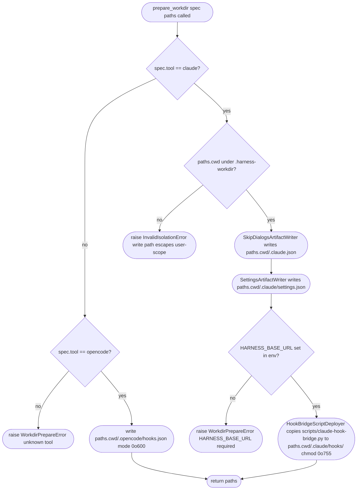

# Feature Detailed Design：F18 · Bk-Adapter — Agent Adapter & HIL Pipeline（Feature #18）

**Date**: 2026-04-27
**Feature**: #18 — F18 · Bk-Adapter — Agent Adapter & HIL Pipeline（Wave 4 协议层重构）
**Priority**: high
**Dependencies**: F02 (Persistence Core · passing) · F10 (Environment Isolation · passing)
**Design Reference**: docs/plans/2026-04-21-harness-design.md §4.3（Wave 4 重写）+ §4.12（Wave 4 弃用项 + IAPI 增量）+ §6.1.1（IFR-001 Wave 4 细化）+ §6.2（IAPI 总表 Wave 4 标注）
**SRS Reference**: FR-008, FR-009, FR-011, FR-012, FR-013, FR-015, FR-016, FR-017, FR-018, FR-051, FR-052, FR-053, NFR-014, IFR-001, IFR-002, ASM-009, ASM-010；FR-014 [DEPRECATED Wave 4] 仅作历史标注

## Context

F18 是后端主回路与 Agent CLI（Claude Code / OpenCode）之间的单向数据通道。**Wave 4 协议层重构（2026-04-27）** 将 HIL 捕获从「stream-json stdout 行解析」整体切换为「workdir-scoped settings.json hooks (PreToolUse(AskUserQuestion) / PostToolUse(*) / SessionStart / SessionEnd) → POST `/api/hook/event` 桥」；HIL 回写从「pty stdin 注入 JSON 文本」整体切换为「TUI 键序回写（option=`<N>\r` / 自由文本 bracketed paste / 多 question 串行）」。本特性同时承载 spawn 前 `prepare_workdir` 三件套预置（FR-051 隔离写路径白名单 + NFR-009 强化为可测断言）与 HIL PoC gate（FR-013 在新 hook bridge + TuiKeyEncoder 实现下 20 轮 round-trip ≥95% 重跑）。

## Design Alignment

来源：系统设计 §4.3 F18 主体（Wave 4 整段重写）+ §4.12 Wave 4 弃用清单 + §6.1.1 IFR-001 Wave 4 细化 + §6.2 IAPI Wave 4 标注。

- **Key types（Wave 4 后）**:
  - **[NEW]** `harness.hil.HookEventMapper` (`harness/hil/hook_mapper.py`) — hook stdin JSON → `HilQuestion[]`；仅 `hook_event_name == "PreToolUse"` 且 `tool_name in {AskUserQuestion, Question}` 派生
  - **[NEW]** `harness.hil.TuiKeyEncoder` (`harness/hil/tui_keys.py`) — `HilAnswer` → TUI 键序 bytes（option `<N>\r` / bracketed paste / 控制字符拒绝）
  - **[NEW]** `harness.orchestrator.HookEventToStreamMapper` (`harness/orchestrator/hook_to_stream.py`) — hook event → `TicketStreamEvent` envelope（wire 层别名 `StreamEvent`）
  - **[NEW]** `harness.api.hook` (`harness/api/hook.py`) — FastAPI router POST `/api/hook/event`（IAPI-020）
  - **[NEW]** `harness.api.pty_writer` (`harness/api/pty_writer.py`) — FastAPI router POST `/api/pty/write`（IAPI-021）
  - **[NEW]** `harness.adapter.workdir_artifacts` — `SettingsArtifactWriter` / `SkipDialogsArtifactWriter` / `HookBridgeScriptDeployer`（FR-051 三件套）
  - **[NEW]** `scripts/claude-hook-bridge.py`（仓库根脚本；被 settings.json 注册）
  - **[NEW]** `harness.adapter.HookEventPayload` (pydantic) — `/api/hook/event` request body schema（与 IAPI-020 同 schema）
  - **[MOD]** `harness.adapter.ToolAdapter` Protocol — 7 方法：`build_argv / prepare_workdir / spawn / map_hook_event / parse_result / detect_anomaly / supports`（旧 `extract_hil` 物理删除）
  - **[MOD]** `harness.adapter.claude.ClaudeCodeAdapter` / `harness.adapter.opencode.OpenCodeAdapter` — 实现新 7 方法 Protocol
  - **[MOD]** `harness.hil.HilWriteback` — payload 由 JSON 改为 TUI 键序 bytes，落地经 IAPI-021
  - **[MOD]** `harness.pty.PtyWorker` — `byte_queue` 字段语义降级为 stdout 镜像归档（不再供下游消费）
  - **[MOD]** `harness.stream.events.StreamEvent` — 类型名保留作通用 envelope，wire 层别名 `TicketStreamEvent`（hook event 派生语义）
  - **[REMOVED]** `harness.hil.HilExtractor`（替代：`HookEventMapper`）/ `harness.stream.JsonLinesParser`（用户决策：不再解析 stdout 字节流）/ `harness.stream.BannerConflictArbiter`（FR-014 弃用，终止协调改走 SessionEnd hook + tool_use_id queue）
- **Provides / Requires（系统设计 §4.3.4）**:
  - **Provides** F20: IAPI-005 [Wave4 MOD] `ToolAdapter.spawn(spec, paths) → TicketProcess`（`prepare_workdir` 必须前置）
  - **Provides** F18 内聚: IAPI-007 [Wave4 MOD] `HilWriteback → /api/pty/write` (TUI 键序 bytes)
  - **Provides** Claude TUI（外部入口）→ F18: IAPI-020 [NEW] REST `POST /api/hook/event`
  - **Provides** F21（FE → F18）: IAPI-021 [NEW] REST `POST /api/pty/write`
  - **Provides** F18/F19/F20/F21（wire envelope）: IAPI-002 / IAPI-001 [Wave4 MOD] `GET /api/tickets/:id/stream` + `WS /ws/stream/:ticket_id` 输出 `TicketStreamEvent`（schema 等价于旧 `StreamEvent`）
  - **Provides** F02: IAPI-009 `AuditWriter.append`
  - **Requires** F19: IAPI-015 `ModelResolver.resolve(...)`（注入 settings.json `model` 字段）
  - **Requires** F10: IAPI-017 `EnvironmentIsolator.setup_run(run_id)` → 注入 `IsolatedPaths` 给 `ToolAdapter.prepare_workdir`
  - **Requires** F02: IAPI-011 `TicketRepository`
- **Removed/Deprecated**: IAPI-006 字段语义降级（PtyWorker.byte_queue 仅 stdout 镜像归档；不再供 StreamParser 消费）；IAPI-008 `StreamParser.events()` 物理删除；FR-014 BannerConflictArbiter 整体废弃。
- **Deviations**: 无文字差异。argv 模板冲突已由用户裁决消化（2026-04-27，approval-revise-loop B 选项 Revise）：系统设计 §6.1.1（L1095-1117）+ §4.3.2 ClaudeCodeAdapter `[MOD]` 节（L360）已由主 agent 在 commit `92538da` 同步为 SRS FR-016 严格白名单（8 项 / 含可选 `--model` 时 10 项）。SRS / 系统设计 / 本特性设计三处 argv 模板文字等值。详见 §Clarification Addendum Resolved 第 1 行（authority=user-approved）。

**UML 触发判据**：≥2 类协作（含 [NEW] / [MOD]）+ HIL full round-trip 跨 ≥2 服务调用顺序 + `prepare_workdir` 含 ≥3 决策分支；满足 `classDiagram` + `sequenceDiagram` + `flowchart TD` 三类触发。

```mermaid
classDiagram
    class ToolAdapter {
        <<Protocol 7-method>>
        +build_argv(spec) list~str~
        +prepare_workdir(spec, paths) IsolatedPaths
        +spawn(spec, paths) TicketProcess
        +map_hook_event(payload) list~HilQuestion~
        +parse_result(events) OutputInfo
        +detect_anomaly(events) AnomalyInfo
        +supports(flag) bool
    }
    class ClaudeCodeAdapter {
        +build_argv(spec) list~str~
        +prepare_workdir(spec, paths) IsolatedPaths
        +spawn(spec, paths) TicketProcess
        +map_hook_event(payload) list~HilQuestion~
    }
    class OpenCodeAdapter {
        +build_argv(spec) list~str~
        +prepare_workdir(spec, paths) IsolatedPaths
        +map_hook_event(payload) list~HilQuestion~
    }
    class HookEventMapper {
        +parse(payload) list~HilQuestion~
    }
    class TuiKeyEncoder {
        +encode_radio(index) bytes
        +encode_checkbox(indices) bytes
        +encode_freeform(text) bytes
    }
    class HookEventToStreamMapper {
        +map(payload, ticket_id, seq) TicketStreamEvent
    }
    class HookRouter {
        +post_hook_event(payload)
    }
    class PtyWriterRouter {
        +post_pty_write(req)
    }
    class HilWriteback {
        +write_answer(answer)
    }
    class HilEventBus {
        +publish_opened(...)
        +publish_answered(...)
    }
    class PtyWorker {
        +write(bytes)
        +pid int
    }
    class SettingsArtifactWriter
    class SkipDialogsArtifactWriter
    class HookBridgeScriptDeployer
    ClaudeCodeAdapter ..|> ToolAdapter
    OpenCodeAdapter ..|> ToolAdapter
    ClaudeCodeAdapter ..> HookEventMapper : map_hook_event
    ClaudeCodeAdapter ..> SettingsArtifactWriter : prepare_workdir
    ClaudeCodeAdapter ..> SkipDialogsArtifactWriter : prepare_workdir
    ClaudeCodeAdapter ..> HookBridgeScriptDeployer : prepare_workdir
    HookRouter ..> HookEventMapper : fan-out HIL
    HookRouter ..> HookEventToStreamMapper : fan-out stream
    HookRouter ..> HilEventBus : publish_opened
    HilWriteback ..> TuiKeyEncoder : encode
    HilWriteback ..> PtyWriterRouter : POST /api/pty/write
    PtyWriterRouter ..> PtyWorker : write(bytes)
    classDef NEW fill:#cfc,stroke:#080
    classDef MODIFIED fill:#ffc,stroke:#880
    class HookEventMapper:::NEW
    class TuiKeyEncoder:::NEW
    class HookEventToStreamMapper:::NEW
    class HookRouter:::NEW
    class PtyWriterRouter:::NEW
    class SettingsArtifactWriter:::NEW
    class SkipDialogsArtifactWriter:::NEW
    class HookBridgeScriptDeployer:::NEW
    class ToolAdapter:::MODIFIED
    class ClaudeCodeAdapter:::MODIFIED
    class OpenCodeAdapter:::MODIFIED
    class HilWriteback:::MODIFIED
    class PtyWorker:::MODIFIED
```

## SRS Requirement

**FR-008**（Wave 4 MOD）：交互模式 TUI + PTY 包装运行 Claude；argv 永禁 `-p / --print / --output-format / --include-partial-messages`；HIL 捕获改由 workdir-scoped settings.json hooks(PreToolUse(AskUserQuestion)) 通道 → POST `/api/hook/event`。
**AC**：(1) argv 不含禁用 flag；(2) PreToolUse(AskUserQuestion) hook fire 计数 == AskUserQuestion 调用数 / harness 收到对应 POST。

**FR-009**（Wave 4 MOD）：通过 settings.json hooks → harness POST `/api/hook/event` 接收 hook stdin JSON（含 `session_id / tool_use_id / tool_input.questions[]`），提取 `questions[]` 字段（`header / question / options[] / multiSelect / allowFreeformInput`）。
**AC**：(1) `HookEventMapper` 处理 PreToolUse(AskUserQuestion) → `HilQuestion[]` 非空且字段齐全；(2) 同 session 多 turn `session_id` 稳定可作 lifecycle 锚；(3) 缺字段用默认值补齐 + warning。

**FR-011**（Wave 4 MOD）：通过 PTY stdin 写 TUI 键序回写——option 选择写 `f"{N}\r"`（1-based）；多 question 表单串行逐题写键 + 等待下一题渲染；自由文本 bracketed paste `\x1b[200~<text>\x1b[201~\r`。
**AC**：(1) 单题写键序 `N\r` 后 TUI 渲染 "● User answered Claude's questions: ⎿ · ... → option_label" 同 pid 续跑；(2) 多 question 串行写键每题渲染完成再写下一题；(3) 自由文本含特殊字符 byte-equal；(4) pty 已关闭时尝试写键序 → ticket failed + HIL 答案保留。

**FR-012**：OpenCode HIL hooks 注册 Question 工具 → 与 Claude 同 schema 渲染到 HILInbox。**AC**：注册成功生成 HIL 控件；版本不兼容 → ticket failed + 升级提示。

**FR-013**（保留）：HIL pty 穿透 PoC 20 轮 round-trip ≥ 95%。**AC**：(1) 20 轮 PoC 成功率 ≥ 95%；(2) < 5% → 冻结 HIL FR 上报用户重新决策。Wave 4 在新 hook bridge + TuiKeyEncoder 实现下重跑。

**FR-014** [DEPRECATED Wave 4]：BannerConflictArbiter 整体废弃。新 AC = 代码路径已移除，grep 项目源码 0 引用；终止协调改走 SessionEnd hook + tool_use_id queue。

**FR-015**（Wave 4 MOD）：`ToolAdapter` Python Protocol 7 方法 `build_argv / prepare_workdir / spawn / map_hook_event / parse_result / detect_anomaly / supports`。**AC**：(1) `mypy --strict` 检查 ClaudeCodeAdapter + OpenCodeAdapter 通过；(2) Mock Provider 实现 7 方法 → orchestrator 可 dispatch（FR-018 向后兼容）。

**FR-016**（Wave 4 MOD）：argv 严格模板 `["claude", "--dangerously-skip-permissions", "--plugin-dir", <bundle>, "--settings", <isolated.settings.json>, "--setting-sources", "project"]`，可选 `--model <alias>` 插在 settings 之后；禁 `-p / --print / --output-format / --include-partial-messages / --mcp-config / --strict-mcp-config`。**AC**：(1) argv 列表 == 上述模板（含可选 --model 时插在 settings 之后）；(2) `dispatch.mcp_config` 非空 → v1 降级 + UI 提示。

**FR-017**：OpenCodeAdapter argv 首 `opencode` + 可选 model/agent；指定 mcp_config → v1 降级 + UI 提示 "OpenCode MCP 延后 v1.1"。

**FR-018**：ToolAdapter Protocol 接口稳定；新 provider 仅需实现同 Protocol（Wave 4 起为 7 方法）即可注册到 orchestrator。

**FR-051**（Wave 4 NEW MUST）：`prepare_workdir` 三件套预置 — (a) `<workdir>/.claude.json`（hasCompletedOnboarding=true / projects.<cwd>.hasTrustDialogAccepted=true / lastOnboardingVersion 与 CLI 版本一致 / projectOnboardingSeenCount≥1）；(b) `<workdir>/.claude/settings.json`（env 块 + hooks 4 类 + skipDangerousModePermissionPrompt=true）；(c) `<workdir>/.claude/hooks/<bridge>` 0o755。env `HOME=<workdir>`；argv `--setting-sources project` 切断 user-scope。
**AC**：(1) `prepare_workdir(spec)` 完成后三件套文件存在且 schema 校验通过；(2) run 前后 sha256 比对 `~/.claude/settings.json` + `~/.claude.json` 不变（NFR-009 强化）。

**FR-052**（Wave 4 NEW SHOULD）：HIL 应答唯一通道 = harness UI；TUI 表单可见但 PTY focus 由 PtyWorker 独占；HilControl 顶部添加文案 "请在此处应答（不要直接操作 TUI）"。
**AC**：(1) `hil_waiting` ticket 经 harness UI 提交答案 → PTY 写键序成功且 ticket 续跑；(2) HilControl 头部含 "请在此处应答" 提示。

**FR-053**（Wave 4 NEW MUST）：`TuiKeyEncoder` 协议 — (a) 单选/多选每选项序号 N → bytes `f"{N}\r"`；多 question 串行 + poll PTY；(b) 自由文本 bytes `"\x1b[200~" + text.encode() + "\x1b[201~\r"`；(c) 中断 `b"\x03"`；退出 `b"\x03\x03"` 或 `b"/exit\r"`。
**AC**：(1) 单题 option=1 → bytes `== b"1\r"`；(2) 自由文本 "hello" → bytes `== b"\x1b[200~hello\x1b[201~\r"`；(3) 多 question 表单 [Q1=opt2, Q2=opt1] 顺序写键 + 等待 PTY render → ticket 跨两题续跑。

**NFR-014**：ToolAdapter 用 Python Protocol 定义；新增 provider 不改 orchestrator 代码。验证：`mypy --strict` + 代码 review。

**IFR-001**（Wave 4 细化）：PTY 双向 + workdir-scoped settings.json hooks → harness `POST /api/hook/event` + TUI 键序回写。Hook stdin JSON 字段集 `{session_id, transcript_path, cwd, hook_event_name, tool_name, tool_use_id?, tool_input?, ts}`。SEC：env 白名单不含 `ANTHROPIC_*`（routing 经 settings.json `env` 块）。**AC-w4-1**：run 前后 `sha256(~/.claude/settings.json)` + `sha256(~/.claude.json)` 不变（含 ≥1 HIL 的完整 run）；**AC-w4-2**：hook bridge POST `/api/hook/event` payload schema 不符 → 415/422 拒绝且 ticket 不卡死。

**IFR-002**：OpenCode hooks.json 注册成功；版本不兼容 → ticket failed + 升级提示。

**ASM-009**：claude CLI hook stdin JSON schema 在 v2.1.119 起字段稳定（`session_id / transcript_path / cwd / hook_event_name / tool_name / tool_use_id / tool_input.questions[]`）。
**ASM-010**：Claude TUI 键序协议在 v2.1.119 起稳定（option menu = `"<N>\r"` / prompt = bracketed paste + CR）。

## Interface Contract

| Method | Signature | Preconditions | Postconditions | Raises |
|--------|-----------|---------------|----------------|--------|
| `ToolAdapter.build_argv` | `build_argv(spec: DispatchSpec) -> list[str]` | `spec.cwd / spec.plugin_dir / spec.settings_path` 非空且为隔离路径下；`spec.mcp_config` 可空（FR-016 v1 降级） | 返回严格白名单 argv（与 SRS FR-016 + 系统设计 §6.1.1 commit 92538da 文字等值）：**Claude** → 无 `model` 时 8 项 `["claude", "--dangerously-skip-permissions", "--plugin-dir", spec.plugin_dir, "--settings", spec.settings_path, "--setting-sources", "project"]`；含 `model` 时 10 项 `["claude", "--dangerously-skip-permissions", "--plugin-dir", spec.plugin_dir, "--settings", spec.settings_path, "--model", spec.model, "--setting-sources", "project"]`（`--model <alias>` 插在 `--settings <path>` 之后、`--setting-sources project` 之前）。**OpenCode** → `["opencode"] (+ ["--model", spec.model] if model) (+ ["--agent", spec.agent] if agent)`。argv 永不含 `-p / --print / --output-format / --include-partial-messages / --mcp-config / --strict-mcp-config`（FR-008/016/017 AC）；同输入下 idempotent | `InvalidIsolationError`（plugin_dir/settings_path 不在 `.harness-workdir/` 下） |
| `ToolAdapter.prepare_workdir` | `prepare_workdir(spec: DispatchSpec, paths: IsolatedPaths) -> IsolatedPaths` | F10 `EnvironmentIsolator.setup_run` 已产出 `paths`（IAPI-017）；spec.cwd == paths.cwd；spec.tool ∈ {"claude","opencode"} | **幂等**：连续两次同 run_id 调用文件等价（mtime 可不同；内容字节一致）。Claude 分支：(a) `<paths.cwd>/.claude.json` 含 `hasCompletedOnboarding=true / projects.<paths.cwd>.hasTrustDialogAccepted=true / lastOnboardingVersion / projectOnboardingSeenCount≥1`；(b) `<paths.cwd>/.claude/settings.json` 含 `env / hooks(PreToolUse|PostToolUse|SessionStart|SessionEnd) / enabledPlugins=[] / model? / skipDangerousModePermissionPrompt=true`；(c) `<paths.cwd>/.claude/hooks/claude-hook-bridge.py` 存在且 mode `0o755`。OpenCode 分支：写 `<paths.cwd>/.opencode/hooks.json`（mode `0o600`）。所有写路径必须为 `paths.cwd` 子树；user-scope `~/.claude/settings.json` + `~/.claude.json` 全程 0 写（FR-051 AC + NFR-009 强化）。返回 `paths` 透传 | `WorkdirPrepareError`（mkdir/write/copyfile 失败）；`InvalidIsolationError`（写路径越界 user-scope） |
| `ToolAdapter.spawn` | `spawn(spec: DispatchSpec, paths: IsolatedPaths) -> TicketProcess` | `prepare_workdir(spec, paths)` 已成功执行（IAPI-005 [Wave4 MOD]）；CLI 在 PATH | spawn 子进程经 `PtyWorker.start`；env 白名单透传 `PATH/PYTHONPATH/SHELL/LANG/USER/LOGNAME/TERM/HOME` + 注入 `HOME=<paths.cwd>` + `HARNESS_BASE_URL=http://127.0.0.1:<port>`；返回 `TicketProcess { ticket_id, pid, pty_handle_id, started_at, worker, byte_queue }`；`byte_queue` 仅供 stdout 镜像归档（写 `<workdir>/.harness/streams/<ticket_id>.raw`），不再供下游消费（IAPI-006 [Wave4 MOD]） | `SpawnError`（CLI 缺失 / PTY init 失败 / PtyWorker.start 失败）；`AdapterError`；`HookRegistrationError`（OpenCode 版本 < 0.3.0） |
| `ToolAdapter.map_hook_event` | `map_hook_event(payload: HookEventPayload) -> list[HilQuestion]` | `payload` 经 IAPI-020 路由 pydantic 验证；`payload.tool_input` 可缺 | 仅 `payload.hook_event_name == "PreToolUse"` 且 `payload.tool_name in {"AskUserQuestion","Question"}` 时派生 `HilQuestion[]`；其他情况返回空 `[]`（不抛）；每条 question 字段：`id`（来自 `payload.tool_use_id` + index 派生）/ `kind`（由 `multiSelect / options 数 / allowFreeformInput` 经 `HilControlDeriver.derive` 派生）/ `header / question / options[] / multi_select / allow_freeform`，每个字符串字段 UTF-8 ≤ 256B 截断（与既有 `HilExtractor._truncate_utf8` 一致）；缺字段用默认值补齐 + warning（FR-009 AC-3） | 不抛（FR-009 健壮性约束） |
| `ToolAdapter.parse_result` | `parse_result(events: list[StreamEvent]) -> OutputInfo` | `events` 为本 ticket 全量 `TicketStreamEvent`（hook event 派生） | 返回 `OutputInfo { result_text, stream_log_ref, session_id }`；`session_id` 取首条 `SessionStart` event 的 `payload.session_id`（hook 流 lifecycle 锚） | 不抛 |
| `ToolAdapter.detect_anomaly` | `detect_anomaly(events: list[StreamEvent]) -> AnomalyInfo \| None` | events 顺序到达 | 关键字匹配 `not authenticated / context length exceeded / rate limited / ehostunreach / timeout / sigsegv / eof` → 返 `AnomalyInfo(cls=...)`；否则 `None` | 不抛 |
| `ToolAdapter.supports` | `supports(flag: CapabilityFlags) -> bool` | flag ∈ enum | Claude → `MCP_STRICT=False`（Wave 4 起 mcp_config 走 v1 降级）+ `HOOKS=True`；OpenCode → `HOOKS=True`、`MCP_STRICT=False` | 不抛 |
| `HookEventMapper.parse` | `parse(payload: HookEventPayload) -> list[HilQuestion]` | 见 `map_hook_event` precondition（adapter 委托给本类） | 见 `map_hook_event` postcondition；同时记录 `tool_use_id` 入 `HilEventBus` 的 `tool_use_id queue`（FR-014 替代逻辑：SessionEnd hook 触发后查 queue 处理未答 HIL 终止协调） | 不抛 |
| `TuiKeyEncoder.encode_radio` | `encode_radio(option_index: int) -> bytes` | `option_index >= 1`（1-based per FR-053） | 返 `f"{option_index}\r".encode()`；e.g. `encode_radio(1) == b"1\r"`（FR-053 AC-1） | `ValueError`（option_index < 1） |
| `TuiKeyEncoder.encode_checkbox` | `encode_checkbox(option_indices: list[int]) -> bytes` | 每个 index ≥ 1 | 返串接的多次 down arrow + space + enter（按 claude TUI checkbox 协议；reference puncture v8 单选已验证，多选键序在 PoC 重跑期固化） | `ValueError` |
| `TuiKeyEncoder.encode_freeform` | `encode_freeform(text: str) -> bytes` | `text` 不含禁用控制字符 `\x03 / \x04 / \x1b`（除 bracketed paste 包裹由本方法添加） | 返 `b"\x1b[200~" + text.encode("utf-8") + b"\x1b[201~\r"`；e.g. `encode_freeform("hello") == b"\x1b[200~hello\x1b[201~\r"`（FR-053 AC-2）；UTF-8 多字节字符 byte-equal 守恒 | `EscapeError`（text 含 `\x03 / \x04 / \x1b`） |
| `TuiKeyEncoder.encode_interrupt` | `encode_interrupt() -> bytes` | — | 返 `b"\x03"`（中断当前 turn） | 不抛 |
| `HookEventToStreamMapper.map` | `map(payload: HookEventPayload, ticket_id: str, seq: int) -> TicketStreamEvent` | seq 单调递增 | 返 `TicketStreamEvent(ticket_id, seq, ts=str(payload.ts), kind, payload=dict)`；`kind` 派生：`SessionStart/SessionEnd → "system"`；`PreToolUse + tool_name in {AskUserQuestion,Question} → "tool_use"`；`PreToolUse + 其他 tool → "tool_use"`；`PostToolUse → "tool_result"`；`payload` dict 含原 hook payload 字段（不带 type） | 不抛 |
| `HookRouter.post_hook_event` | `POST /api/hook/event → 200 { accepted: bool }` (IAPI-020) | content-type `application/json` | (1) pydantic 验证 `HookEventPayload`；(2) 由 `request.app.state.adapter_registry` 选 adapter（claude/opencode）调 `map_hook_event` → 入 `HilEventBus.publish_opened`（pre-AskUserQuestion）或 `HilEventBus.tool_use_id_queue.append`（其他工具）；(3) `HookEventToStreamMapper.map` → 入 `TicketStream broadcaster`；(4) 返 `{accepted: True}` | `415`（content-type 非 JSON / IFR-001 AC-w4-2）；`422`（pydantic schema 失败 / IFR-001 AC-w4-2） |
| `PtyWriterRouter.post_pty_write` | `POST /api/pty/write → 200 { written_bytes: int }` (IAPI-021) | body `{ ticket_id: str, payload: str (base64) }` | (1) pydantic 验证；(2) base64 解码；(3) 经 `request.app.state.ticket_repo.get(ticket_id)` 查 ticket → 取 `PtyWorker` → `worker.write(decoded_bytes)`；(4) 返 `{written_bytes: len(decoded_bytes)}` | `400 ticket-not-running`（state ∉ {running, hil_waiting}）；`400 b64-decode-error`；`404 ticket-not-found` |
| `HilWriteback.write_answer` | `write_answer(answer: HilAnswer) -> None` | ticket state == `hil_waiting`；`answer` 已通过 `HilControl` 校验 | (1) 由 `answer` 派生 `HilQuestion.kind` 取对应 `TuiKeyEncoder.encode_*`；(2) base64 编码后 POST `/api/pty/write`（经 IAPI-021）；(3) 成功 → `HilEventBus.publish_answered`（audit `hil_answered` + WS broadcast）+ ticket 状态 `hil_waiting → classifying`；(4) 失败（pty 已关闭）→ 答案保留至 `pending_answers` + ticket 状态 `hil_waiting → failed`（FR-011 AC-4） | `PtyClosedError`；`EscapeError`（freeform 含禁用控制字符）；`HTTPException`（IAPI-021 4xx 透传） |

**`prepare_workdir` 状态依赖**：方法行为依赖 `paths` 是否已被 F10 setup_run 创建 + 三件套是否已存在（首次 vs 重入）。两态触发 `stateDiagram-v2`：

**Design rationale**:
- argv 模板以 SRS FR-016 严格白名单为权威（`["claude", "--dangerously-skip-permissions", "--plugin-dir", <bundle>, "--settings", <isolated.settings.json>, "--setting-sources", "project"]` + 可选 `--model <alias>` 插在 `--settings <path>` 之后；含 `--model` 时 10 项，否则 8 项）。SRS FR-016 / 系统设计 §6.1.1 + §4.3.2（commit `92538da` 修订后）/ ATS §3.1 FR-016 验收行 / 本设计 §Interface Contract `build_argv` Postcondition 四处文字等值；冲突已由用户裁决消化（2026-04-27），见 §Clarification Addendum Resolved 第 1 行。
- `map_hook_event` 不抛是 FR-009 健壮性约束（缺字段补默认 + warning）；schema 不合的硬错误由 `HookRouter` 层 422 拒绝（IAPI-020 错误码），永不进入 mapper。
- `byte_queue` 字段保留为 backward compat 占位（IAPI-006 [Wave4 MOD]）；新代码不得消费，Test Inventory 加 1 条断言「`worker.byte_queue` 不被订阅；下游 supervisor 改用 `HookEventToStreamMapper` 输出」。
- `TuiKeyEncoder.encode_freeform` 拒绝 `\x03 / \x04 / \x1b`（除本方法添加的 bracketed paste 包裹）→ 防 ATS FR-011 SEC「禁注入控制字符」攻击面；同时 byte-equal 自由文本守恒（FR-053 AC-2 + ATS INT-001 SEC）。
- 跨特性契约对齐：本特性为 IAPI-005 / IAPI-007 / IAPI-020 / IAPI-021 Provider；`spawn` 签名（spec, paths）+ `HilWriteback` payload bytes 与系统设计 §6.2 Wave 4 MOD 版本逐字对齐。

## Visual Rendering Contract

> N/A — backend-only feature。`feature-list.json` `ui: false`。HilControl 顶部 "请在此处应答（不要直接操作 TUI）" 文案由 F21 HILInbox 渲染（FR-052 + NFR-011 扩展），不在本特性范围。

## Implementation Summary

**1. 主要类与文件布局（Wave 4）**：本特性触及 12 个新增 / 修改源文件。新增 `harness/hil/hook_mapper.py`（`HookEventMapper`，约 80 行）/ `harness/hil/tui_keys.py`（`TuiKeyEncoder` 三方法 + interrupt/exit 常量，约 60 行）/ `harness/orchestrator/hook_to_stream.py`（`HookEventToStreamMapper.map`，约 50 行）/ `harness/api/hook.py`（FastAPI router POST `/api/hook/event` + pydantic `HookEventPayload`，约 70 行）/ `harness/api/pty_writer.py`（FastAPI router POST `/api/pty/write` + pydantic `PtyWriteRequest`，约 60 行）/ `harness/adapter/workdir_artifacts.py`（`SettingsArtifactWriter` / `SkipDialogsArtifactWriter` / `HookBridgeScriptDeployer`，约 120 行）/ `scripts/claude-hook-bridge.py`（仓库根 stdin → POST 桥接脚本，约 30 行）。修改 `harness/adapter/protocol.py`（Protocol 6→7 方法）/ `harness/adapter/claude.py`（删 `extract_hil` + 加 `prepare_workdir / map_hook_event` + argv 模板调整）/ `harness/adapter/opencode/__init__.py`（同步 7 方法）/ `harness/hil/writeback.py`（payload 由 JSON 改 TUI 键序 + 经 IAPI-021 写）/ `harness/api/__init__.py`（追加 2 个 `app.include_router`）。物理删除 `harness/hil/extractor.py` / `harness/stream/parser.py` / `harness/stream/banner_arbiter.py`。

**2. 调用链**：`Orchestrator.run_ticket` → `EnvironmentIsolator.setup_run(run_id)` → `IsolatedPaths` → `ToolAdapter.prepare_workdir(spec, paths)`（写三件套）→ `ToolAdapter.spawn(spec, paths)` → `PtyWorker.start` → claude TUI 子进程。当 skill 调 AskUserQuestion 工具时：claude TUI → stdin → `<isolated_cwd>/.claude/hooks/claude-hook-bridge.py`（被 settings.json 注册）→ POST `<HARNESS_BASE_URL>/api/hook/event` → `harness.api.hook.HookRouter` → 内部 fan-out（`adapter.map_hook_event` → `HilEventBus.publish_opened` → `/ws/hil` 推前端 + `HookEventToStreamMapper.map` → `TicketStream broadcaster` → `/ws/stream/:ticket_id`）→ 200 OK 给 hook bridge → bridge exit 0。HIL 回写：前端 → `HilAnswerSubmit` → `POST /api/hil/:ticket_id/answer` → `HilWriteback.write_answer` → `TuiKeyEncoder.encode_*` → base64 → POST `/api/pty/write` → `PtyWriterRouter.post_pty_write` → `PtyWorker.write(bytes)` → 写 PTY stdin → claude TUI 收键 → 续跑。

**3. 关键设计决策与陷阱**：(a) hook 子进程是**短命** subprocess，每次 hook fire 由 claude TUI 自行 spawn 桥接脚本；harness 不持有 hook bridge process。(b) `claude-hook-bridge.py` 必须在 spawn 前 chmod `0o755`，否则 claude TUI 无法 exec — 这是 FR-051 AC-1 显式断言项。(c) `HOME=<paths.cwd>` + `--setting-sources project` 是 NFR-009 强化的关键：CLI 的 user-scope `~/.claude/settings.json` + `~/.claude.json` 全程不被读不被写 → run 前后 sha256 守恒可作可测断言（FR-051 AC-2 + IFR-001 AC-w4-1）。(d) bracketed paste mode：claude TUI 启用 `\x1b[?2004h`，所有 prompt 提交必须用 `\x1b[200~...\x1b[201~` 包围（reference puncture v8 实测）；`TuiKeyEncoder.encode_freeform` 直接构造，不调 `_validate_escape`（旧 `HilWriteback` 校验白名单中的 `\x09/\x0a/\x0d` 已不再适用 → 旧 `EscapeError` 仅用于自由文本中**用户意图**包含的禁用控制字符）。(e) FR-014 死代码 grep 检查：CI 静态分析阶段 `grep -r "BannerConflictArbiter\|JsonLinesParser\|HilExtractor" harness/ scripts/ tests/` 必须 0 命中（旧文件已物理删除）。(f) `HookEventMapper` 字段 schema 与本设计锁定的 ASM-009 字段集严格等值（见 §7 Test Inventory `T-HOOK-SCHEMA-CANARY` schema canary）。

**4. 遗留 / 存量代码交互点**：(a) `harness.domain.ticket.HilQuestion / HilOption / HilAnswer` 复用（pydantic schema 不改）；(b) `harness.hil.control.HilControlDeriver.derive` 复用（FR-010 规则矩阵不变）；(c) `harness.env.EnvironmentIsolator.setup_run` 复用（IAPI-017 不变；F10 已 passing）；(d) `harness.pty.PtyWorker` 复用 + `byte_queue` 字段语义降级（写 stdout 镜像归档；不再供下游消费）；(e) `harness.hil.HilEventBus.publish_opened / publish_answered` 复用 + 新增 `tool_use_id_queue` 实例字段以承接 FR-014 替代逻辑；(f) `harness.api.hil` 既有 `/api/hil/:ticket_id/answer` 路由不变，路由内调用从「写 PTY JSON」改为「`HilWriteback.write_answer` → IAPI-021」；(g) env-guide §4.5 Wave 4 隔离三件套规约是 `prepare_workdir` 实现的事实源（已写入 env-guide.md 并审批通过）。env-guide §4.1 / §4.2 / §4.3 均为 greenfield placeholder，无强制内部库 / 禁用 API / 命名约定。

**5. §4 Internal API Contract 集成**：本特性是 IAPI-005 / IAPI-007 [MOD]、IAPI-020 / IAPI-021 [NEW] 的 Provider，IAPI-006 [MOD]（PtyHandle byte_queue 降级语义）的 Provider，IAPI-015 / IAPI-017 / IAPI-011 / IAPI-009 的 Consumer。`HookEventPayload` pydantic 字段集与系统设计 §6.2.4 schema 严格等值（`session_id / transcript_path / cwd / hook_event_name / tool_name? / tool_use_id? / tool_input? / ts`）；`PtyWriteRequest` 字段 `{ ticket_id: str, payload: str (base64) }`；返 `PtyWriteAck { written_bytes: int }`。错误码：IAPI-020 → 415 / 422；IAPI-021 → 400 ticket-not-running / 400 b64-decode-error / 404 ticket-not-found。`/ws/stream/:ticket_id` envelope 由 `HookEventToStreamMapper` 产出 `TicketStreamEvent`（schema 字段集等价于旧 `StreamEvent`，前端 zod 重新生成即可）。

**`prepare_workdir` 决策分支**（≥3 决策分支触发 `flowchart TD`）：

### Boundary Conditions

| Parameter | Min | Max | Empty/Null | At boundary |
|-----------|-----|-----|------------|-------------|
| `option_index` (TuiKeyEncoder.encode_radio) | 1 | 9 (claude TUI 单题最多 9 选项 + 2 内置 escape per puncture v8) | 0 → `ValueError`；负数 → `ValueError` | 1 → `b"1\r"`；9 → `b"9\r"` |
| `option_indices` (TuiKeyEncoder.encode_checkbox) | `[1]` | 全选（≤ 9） | `[]` → 仅写 `b"\r"`（确认空选） | 跨选项需 down arrow 推进光标 + space toggle |
| `text` (TuiKeyEncoder.encode_freeform) | 0 byte | 实测无硬上限（claude TUI 长 prompt 可 paste；reference puncture 验证 ~456 字符） | `""` → `b"\x1b[200~\x1b[201~\r"`（空 paste + CR） | UTF-8 多字节 emoji byte-equal 守恒 |
| `payload.tool_name` (HookEventMapper.parse) | str | — | `None` → 派生空 `[]`（FR-009 健壮性） | `"AskUserQuestion"` / `"Question"` 派生 HIL；其他派 `[]` |
| `payload.tool_input` (HookEventMapper.parse) | dict | — | `None` → 派生空 `[]` | `{"questions": []}` → 空 list；`{"questions": [{}]}` → 1 个 HilQuestion 全字段默认值 + warning |
| `payload.hook_event_name` (HookEventMapper.parse) | Literal | — | 不允许（pydantic 422） | 4 类 enum 完全覆盖 |
| `option_index` value passed to PostToolUse hook (queue tracking) | — | — | `tool_use_id == None` → fall-through（不入 queue） | tool_use_id 唯一性是 SessionEnd 终止协调的 join key |
| `text` 含 `\x03` (interrupt) / `\x04` (EOT) / `\x1b` (ESC 非 paste 包裹) | — | — | 任一命中 → `EscapeError`（FR-053 SEC + FR-011 SEC） | 攻击面：bracketed paste 包裹外的 ESC 序列 |

### Existing Code Reuse

复用搜索词：`HilQuestion / HilOption / HilAnswer / HilControlDeriver / HilEventBus / EnvironmentIsolator / IsolatedPaths / PtyWorker / TicketProcess / HilWriteback / extract_hil / map_hook_event / TuiKey / HookEvent / hook_event / settings.json / .claude.json`。

| Existing Symbol | Location (file:line) | Reused Because |
|-----------------|---------------------|----------------|
| `harness.domain.ticket.HilQuestion / HilOption / HilAnswer` | `harness/domain/ticket.py:104-129` | pydantic schema 已含 Wave 4 所需全部字段（id / kind / header / question / options / multi_select / allow_freeform）；不重定义 |
| `harness.hil.control.HilControlDeriver` | `harness/hil/control.py:19-37` | FR-010 规则矩阵 Wave 4 不变；`HookEventMapper` 直接委托 |
| `harness.hil.event_bus.HilEventBus` | `harness/hil/event_bus.py:26-78` | `publish_opened` / `publish_answered` 既有签名 Wave 4 不变；HookRouter / HilWriteback 直接复用；新增 `tool_use_id_queue` 作 instance 字段（FR-014 替代逻辑） |
| `harness.env.EnvironmentIsolator.setup_run` | `harness/env/isolator.py:78-148` | IAPI-017 不变；产出 `IsolatedPaths` 透传给 `ToolAdapter.prepare_workdir` |
| `harness.env.models.IsolatedPaths` | `harness/env/models.py:10-22` | pydantic schema 不变；Wave 4 spawn 第二参数 |
| `harness.pty.PtyWorker` | `harness/pty/worker.py:25-138` | `start / write / close / pid` 既有 API Wave 4 不变；`byte_queue` 字段保留（语义降级为 stdout 镜像归档） |
| `harness.adapter.process.TicketProcess` | `harness/adapter/process.py:10-27` | 返值 schema 不变 |
| `harness.adapter.errors.{InvalidIsolationError, SpawnError, HookRegistrationError}` | `harness/adapter/errors.py` | 异常类型既有；新增 `WorkdirPrepareError` 增量 |
| `harness.adapter.opencode.HookConfigWriter / HookQuestionParser / McpDegradation / VersionCheck` | `harness/adapter/opencode/hooks.py` | OpenCode 分支 `prepare_workdir` 写 hooks.json 复用 `HookConfigWriter`；版本检查 / MCP 降级不变 |
| `harness.api.hil` (`/api/hil/:ticket_id/answer` route) | `harness/api/hil.py:24-49` | 路由不动；内部从写 PTY JSON 改为 `HilWriteback.write_answer` 委托（IAPI-021 透传） |
| `harness.hil.writeback.HilWriteback._validate_escape` (control byte whitelist) | `harness/hil/writeback.py:43-47` | 校验思路复用（仅迁移到 `TuiKeyEncoder.encode_freeform` 内）；白名单调整为「拒 `\x03 / \x04 / \x1b`（除本方法添加的 bracketed paste）」 |
| `harness.adapter.protocol.CapabilityFlags` | `harness/adapter/protocol.py:26-30` | enum 复用；保留 `MCP_STRICT / HOOKS` 两值 |
| `harness.api.__init__.app.include_router` 模式 | `harness/api/__init__.py:80-109` | Wave 4 新增 2 行 `app.include_router(_hook_router)` + `app.include_router(_pty_writer_router)` 沿用 |

## Test Inventory

| ID | Category | Traces To | Input / Setup | Expected | Kills Which Bug? |
|----|----------|-----------|---------------|----------|-----------------|
| T01 | FUNC/happy | FR-016 AC-1 + ATS §3.1 FR-016 + Design seq msg#3 + 系统设计 §6.1.1（commit 92538da） | `ClaudeCodeAdapter().build_argv(spec)` 含 `plugin_dir / settings_path` 在 `.harness-workdir/` 下，`model=None`，`mcp_config=None` | argv 列表**完全等值**于 SRS FR-016 严格 8 项白名单：`["claude", "--dangerously-skip-permissions", "--plugin-dir", spec.plugin_dir, "--settings", spec.settings_path, "--setting-sources", "project"]`（`len(argv) == 8`；逐项 `==` 比对，不允许多 / 漏 / 顺序错） | argv 漏掉某 flag / 加错 flag / 把 `--output-format stream-json` 写回去 / 顺序错 |
| T02 | FUNC/happy | FR-016 AC-1 含可选 `--model` + 系统设计 §6.1.1（commit 92538da） | `spec.model = "opus"`；其余同 T01 | argv 列表**完全等值**于 SRS FR-016 严格 10 项模板（`--model <alias>` 插在 `--settings <path>` 之后、`--setting-sources project` 之前）：`["claude", "--dangerously-skip-permissions", "--plugin-dir", spec.plugin_dir, "--settings", spec.settings_path, "--model", "opus", "--setting-sources", "project"]`（`len(argv) == 10`；逐项 `==` 比对） | `--model` 位置错（如追加到末尾）/ 漏 / 把模型 alias 当 flag 名 |
| T03 | FUNC/error | FR-008 AC-1 negative | argv 任意构造路径 | `assert "-p" not in argv and "--print" not in argv and "--output-format" not in argv and "--include-partial-messages" not in argv` | 误把 `-p` 加回 |
| T04 | FUNC/error | FR-016 AC-2 + flowchart#3 OpenCodeBranch | OpenCode `spec.mcp_config = "/path/x"` | argv 不含 `--mcp-config / --strict-mcp-config`；`adapter.mcp_degrader.toast_pushed[0]` 含 "OpenCode MCP 延后 v1.1" | OpenCode mcp 仍写入 argv |
| T05 | BNDRY/edge | §Boundary Conditions `option_index` | `TuiKeyEncoder().encode_radio(0)` | `ValueError` | 1-based off-by-one；0 被错认为合法 |
| T06 | FUNC/happy | FR-053 AC-1 | `encode_radio(1)` | `b"1\r"`（byte-equal） | `\n` 误用替 `\r`；多余空格 |
| T07 | FUNC/happy | FR-053 AC-2 + ATS INT-001 SEC byte-equal | `encode_freeform("hello")` | `b"\x1b[200~hello\x1b[201~\r"` | bracketed paste 序列写错 / 漏 CR |
| T08 | SEC/inject | FR-053 SEC + FR-011 SEC + ATS FR-011 SEC | `encode_freeform("a\x03b")` | `EscapeError` | 控制字符注入未拦 |
| T09 | BNDRY/edge | §Boundary Conditions `text` UTF-8 | `encode_freeform("中文😀")` | bytes byte-equal `b"\x1b[200~" + "中文😀".encode("utf-8") + b"\x1b[201~\r"` | UTF-8 多字节被破坏 |
| T10 | FUNC/error | FR-053 AC-3 multi-question | `[encode_radio(2), encode_radio(1)]` 串行写入 + poll PTY render | 每条 bytes 与单条等价；ticket 跨两题续跑（FakePty 验证写入序列） | 串行写键合并 / 时序错 |
| T11 | FUNC/happy | FR-009 AC-1 + Design seq msg#7 + IFR-001 hook stdin schema | `HookEventMapper().parse(payload)` payload 来自 reference/f18-tui-bridge/puncture v8 实测 PreToolUse(AskUserQuestion) JSON（载有 questions[0]={header:"Lang",question:"Which language?",options:[{label:"Python",description:"Python language"},...],multiSelect:false}） | `HilQuestion[0].header == "Lang" / question == "Which language?" / options==[HilOption(label="Python",description="Python language"),...] / multi_select==False / kind=="single_select"` | header / options 字段错位；UTF-8 截断错 |
| T12 | FUNC/error | FR-009 AC-3 缺字段补默认 | payload `tool_input.questions[0]` 无 `options` 字段 | `HilQuestion[0].options == []`；warning 日志命中 "missing 'options'"；不抛 | mapper 直接抛 |
| T13 | BNDRY/edge | FR-009 AC-2 + Design seq msg#7 cross-turn | 同 session 多 hook event；session_id 一致 | `HilEventBus.tool_use_id_queue` 跨 turn 累积；session_id 稳定 | 跨 turn HIL 错乱 |
| T14 | FUNC/error | §Interface Contract Raises map_hook_event | `payload.hook_event_name == "PostToolUse"` 或 `tool_name == "Read"` | mapper 返 `[]`（不抛） | 误把 PostToolUse 当 HIL |
| **T-HOOK-SCHEMA-CANARY** | **UT/BNDRY** | **FR-009 + ASM-009 + IFR-001 hook stdin JSON 字段** | **加载 `tests/fixtures/hook_event_askuserquestion_v2_1_119.json`**（由 `reference/f18-tui-bridge/puncture.py` 实测捕获并提交入库的 golden fixture，源自 evidence-summary §C 真实样本：`{session_id, transcript_path, cwd, hook_event_name:"PreToolUse", tool_name:"AskUserQuestion", tool_use_id, tool_input:{questions:[{header,question,options:[{label,description}],multiSelect}]}}`）；调 `HookEventMapper().parse(payload)` 与 `HookEventPayload.model_validate(payload)` | 字段集合（递归键名集，含嵌套，`set` 等值断言）严格 == 当前锁定 schema：top-level `{session_id, transcript_path, cwd, hook_event_name, tool_name, tool_use_id, tool_input, ts}` + `tool_input.questions[*]` `{header, question, options, multiSelect}` + `tool_input.questions[*].options[*]` `{label, description}`。失败时输出 `set(fixture_keys) ^ set(schema_keys)` diff 并 FAIL；提示维护者：(1) 重跑 `reference/f18-tui-bridge/puncture.py` 取最新真实 hook stdin JSON；(2) 替换 fixture；(3) 更新 `HookEventMapper` 字段提取与 ASM-009 SRS 假设；(4) 重跑 UT 直到等值。**不写 task-progress** — 仅在 UT 层产生 FAIL 信号 | **claude CLI 升级后 hook stdin schema 字段重命名 / 嵌套结构变化 / 新增字段 / 缺失字段 → mapper 静默失配**（`map_hook_event` 因 pydantic `extra="ignore"` 默认行为不报错但派 `HilQuestion` 字段空 / 错置）。本 canary 是 ASM-009「字段稳定」假设的硬关卡 |
| T15 | FUNC/happy | IAPI-020 happy + Design seq msg#8 | TestClient POST `/api/hook/event`，body 为 T-HOOK-SCHEMA-CANARY fixture，content-type `application/json` | 200 OK `{accepted: True}`；`HilEventBus._ws_broadcast` 收 `{"kind":"hil_event", "payload":{...}}`；`TicketStream broadcaster` 收 `TicketStreamEvent.kind == "tool_use"` | router fan-out 漏一支 |
| T16 | FUNC/error | IAPI-020 415 + IFR-001 AC-w4-2 | POST `/api/hook/event` 带 `content-type: text/plain`，body 任意 | `HTTPException 415`；audit 日志含 warning；ticket 不卡死 | 415 处理漏 |
| T17 | FUNC/error | IAPI-020 422 + IFR-001 AC-w4-2 | POST `/api/hook/event` body `{"foo":"bar"}`（缺 required 字段） | `HTTPException 422`；pydantic errors 列出缺失字段 | schema 校验绕过 |
| T18 | FUNC/happy | IAPI-021 happy + Design seq msg#15 | POST `/api/pty/write` body `{"ticket_id":"<t>","payload":"<base64('1\r')>"}`，ticket state == hil_waiting | 200 `{written_bytes: 2}`；`PtyWorker.write` 收 `b"1\r"` | base64 解码错 / write 调错 |
| T19 | FUNC/error | IAPI-021 400 ticket-not-running | ticket state == completed | 400 `error_code: ticket-not-running` | 死 ticket 仍写 |
| T20 | FUNC/error | IAPI-021 404 + IAPI-021 400 b64 | ticket_id 不存在 → 404；payload 非合法 base64 → 400 b64-decode-error | 404 / 400 分支正确 | 错误码混淆 |
| T21 | FUNC/happy | FR-015 AC-1 + NFR-014 + ATS FR-015 | `mypy --strict harness/adapter/claude.py harness/adapter/opencode/__init__.py` | exit 0；7 方法签名匹配 Protocol | mypy 漏一方法 |
| T22 | FUNC/error | FR-015 AC-2 + FR-018 + ATS FR-015 Error | Mock Provider 缺 `prepare_workdir` 或 `map_hook_event` | `mypy --strict` 报错 + 运行时 isinstance(adapter, ToolAdapter) `False` + orchestrator 拒注册 `TypeError` | Mock 漏方法静默通过 |
| T23 | FUNC/happy | FR-051 AC-1 + Design flowchart `prepare_workdir` | `prepare_workdir(spec, paths)` 完成后 `os.path.exists(paths.cwd + "/.claude.json")` && `...settings.json` && `...hooks/claude-hook-bridge.py` | 三件套存在；`os.stat(...).st_mode & 0o777 == 0o755`（hooks/bridge）；settings.json 含 `env / hooks / enabledPlugins / skipDangerousModePermissionPrompt` 全字段 | bridge 漏 chmod；settings 缺字段 |
| T24 | BNDRY/idempotent | §Interface Contract `prepare_workdir` postcondition idempotent | 连续两次同 run_id 调用 | 文件内容字节一致（mtime 可不同） | 第二次写出错 / 文件丢字段 |
| T25 | SEC/isolation | FR-051 AC-2 + IFR-001 AC-w4-1 + NFR-009 + ATS INT-001 SEC | run 前 sha256 `~/.claude/settings.json` + `~/.claude.json`（mock 用户家目录），完整 run（含 ≥1 HIL round-trip），run 后再 sha256 | 两 hash 字节级守恒（before == after） | user-scope 被写 |
| T26 | SEC/escape | §Boundary Conditions write path escape + flowchart#5 RaiseIsolation | `paths.cwd = "/tmp/foo"`（不在 `.harness-workdir/` 下） | `InvalidIsolationError` | 越界写未拦 |
| T27 | FUNC/happy | FR-052 AC-1 | `hil_waiting` ticket，前端 `POST /api/hil/:ticket_id/answer` | `HilWriteback.write_answer` 调 `TuiKeyEncoder` + POST `/api/pty/write`；ticket 状态 → `classifying`；`HilEventBus.publish_answered` 触发 audit `hil_answered` | UI 通道断；状态转移漏 |
| T28 | FUNC/error | FR-011 AC-4 | pty 已关闭尝试写键序 | `PtyClosedError`；`HilWriteback.pending_answers` 保留 `answer`；ticket 状态 → `failed` | 答案丢失 |
| T29 | INTG/cli | FR-013 + FR-008/009/011/051/053 + ATS INT-001 [Wave 4 REWRITE] + Design seq full | 真 claude CLI ≥ v2.1.119（env-guide §3 锁定）spawn 到 isolated `.harness-workdir/<run-id>/`；`prepare_workdir` 已写三件套；触发 1× AskUserQuestion → POST `/api/hook/event` → `HookEventMapper` → `HilQuestion` → `/ws/hil` 推前端 → 前端答 → `TuiKeyEncoder` → `/api/pty/write` → PtyWorker stdin → claude TUI 续跑 | full round-trip 成功；`hook_fires == 1`；ticket 同 pid 续跑；audit `hil_captured` + `hil_answered` 各 1；user-scope sha256 守恒；TUI 渲染 "● User answered Claude's questions: ⎿ · ... → option_label" | 协议链路任一环失配 |
| T30 | INTG/perf | FR-013 PoC gate 重跑 + ATS INT-001 PoC | T29 路径跑 20 轮跨 user_turn HIL × hook + 键序回写 | 成功率 ≥ 95%（19/20）；< 5% → 冻结 HIL FR；输出 `docs/explore/wave4-hil-poc-report.md`（每轮耗时 + hook event timestamps） | 单轮失败传染 |
| T31 | FUNC/happy | FR-014 [DEPRECATED Wave 4] new AC + ATS FR-014 | `grep -r "BannerConflictArbiter\|JsonLinesParser\|HilExtractor" harness/ scripts/ tests/` | 0 hit（旧文件物理删除） | 死代码残留 |
| T32 | FUNC/happy | FR-014 替代逻辑 + Design rationale (e) | session 中 PreToolUse(AskUserQuestion) fire 但用户未答，随后 SessionEnd hook 触发 | `HilEventBus.tool_use_id_queue` 含 unanswered tool_use_id；SessionEnd handler 判 queue 非空 → ticket state `hil_waiting`（不是 completed）；UI 显示终止 + 未答 HIL 协调 | SessionEnd 错误判 completed |
| T33 | FUNC/happy | IAPI-006 [MOD] byte_queue 字段语义降级 | spawn ticket 后 `worker.byte_queue` 仍存在 | `worker.byte_queue` 不被任何 supervisor / parser 订阅；下游 `TicketStreamEvent` 仅经 `HookEventToStreamMapper` 派生；audit grep `harness/orchestrator/` 0 个 `byte_queue.get` 调用 | byte_queue 仍被消费（违 IAPI-006 MOD） |
| T34 | FUNC/happy | `HookEventToStreamMapper.map` kind 派生矩阵 | 4 类 hook_event_name × 多 tool_name 派生 | `SessionStart/End → "system"`；`PreToolUse + AskUserQuestion → "tool_use"`；`PreToolUse + Read → "tool_use"`；`PostToolUse → "tool_result"` | kind 派生错 |
| T35 | FUNC/happy | `claude-hook-bridge.py` stdin → POST | mock claude TUI stdin JSON；脚本 spawn → POST harness | 脚本 exit 0；harness `/api/hook/event` 收到 POST | bridge 脚本 POST 失败仍 exit 0 |
| T36 | FUNC/error | `claude-hook-bridge.py` POST 失败 | harness 不可达 | 脚本 stderr `[harness-hook-bridge] POST failed: ...`；exit 非 0；不阻塞 claude TUI 但 hook 副作用丢失（audit warning + UI 横幅） | bridge 静默吞错 |
| T37 | INTG/api | FR-012 + IFR-002 + ATS FR-012 | OpenCode hooks.json 注册成功 → skill 调 Question 工具 → POST `/api/hook/event`（OpenCode 侧 hooks 输出到 stdout 桥接）→ `OpenCodeAdapter.map_hook_event` 派 HilQuestion | HIL 控件生成；与 Claude 同 schema | OpenCode hooks schema 错位 |
| T38 | FUNC/error | FR-012 AC-2 | OpenCode 版本 < 0.3.0 | `HookRegistrationError`；ticket failed + UI 升级提示 | 老版本仍跑 |
| T39 | UT/SEC | IFR-002 SEC + ATS IFR-002 BNDRY | Question name > 256B | 截断到 256B + ellipsis；不崩 | 长 name 崩溃 |

**Test Inventory 统计**：40 行（T01-T39 + T-HOOK-SCHEMA-CANARY）。负向 / 边界 / 安全行（FUNC/error + BNDRY/* + SEC/* + UT/SEC + UT/BNDRY canary）：T03/T04/T05/T08/T09/T10/T12/T14/T16/T17/T19/T20/T22/T24/T26/T28/T31/T36/T38/T39 + T-HOOK-SCHEMA-CANARY = **21 行 / 40 行 = 52.5%**（≥ 40% 阈值通过）。

**ATS 类别对齐**：FR-008 (FUNC/BNDRY/SEC) → T01/T03/T16/T25 ✓；FR-009 (FUNC/BNDRY/SEC) → T11/T12/T13/T14/T-HOOK-SCHEMA-CANARY/T17 ✓；FR-011 (FUNC/BNDRY/SEC) → T06/T07/T08/T09/T10/T28 ✓；FR-013 (FUNC/BNDRY/PERF) → T29/T30 ✓；FR-015 (FUNC/BNDRY) → T21/T22 ✓；FR-016 (FUNC/BNDRY) → T01/T02/T03/T04 ✓；FR-051 (FUNC/BNDRY/SEC) → T23/T24/T25/T26 ✓；FR-052 (FUNC/BNDRY/SEC) → T27 + F21 HilControl 文案断言（跨 feature 落 F21 §Visual Rendering Contract）；FR-053 (FUNC/BNDRY/SEC) → T05/T06/T07/T08/T09/T10 ✓。INT-001 [Wave 4 REWRITE] → T29/T30。

**Design Interface Coverage Gate（§4.3.2 / §4.3.3 全部具名项）**：`build_argv`(T01/T02/T03/T04) / `prepare_workdir`(T23/T24/T26) / `spawn`(T29 含 PtyWorker.start) / `map_hook_event`(T11/T12/T13/T14) / `parse_result`(T29 间接) / `detect_anomaly`(既有 T-anomaly 在 F18 coverage_supplement 沿用) / `supports`(T21 mypy 间接) / `HookEventMapper.parse`(T11-T14 + T-HOOK-SCHEMA-CANARY) / `TuiKeyEncoder.encode_radio/checkbox/freeform/encode_interrupt`(T05-T10) / `HookEventToStreamMapper.map`(T34) / `HookRouter.post_hook_event`(T15/T16/T17/T35/T36) / `PtyWriterRouter.post_pty_write`(T18/T19/T20) / `HilWriteback.write_answer`(T27/T28) / `HilEventBus.publish_opened/answered`(T15/T27 间接) / `HilEventBus.tool_use_id_queue`(T13/T32) / `SettingsArtifactWriter / SkipDialogsArtifactWriter / HookBridgeScriptDeployer`(T23/T24) / `claude-hook-bridge.py`(T35/T36) / `OpenCodeAdapter.prepare_workdir + ensure_hooks`(T37/T38) / FR-014 残留 grep（T31）+ byte_queue 降级断言（T33）+ Question name 截断（T39 IFR-002 SEC）= **全部具名项 ≥ 1 行 Test Inventory 覆盖**。

**UML Element Trace Coverage**：`classDiagram` 节点 19 个（每个 NEW / MODIFIED 类经至少 1 行 Test Inventory 命中）；`sequenceDiagram` 消息 ≥ 16 条（msg#1-16，T29 全链路覆盖 + T15/T18 子链）；`stateDiagram-v2` transition 5 条（PathsSetup→ArtifactsWriting→ArtifactsReady [+ idempotent re-call]→SpawnReady [+ PrepareFailed 终态] T23/T24/T26 覆盖）；`flowchart TD` 决策菱形 4 个 + 错误终点 3 个（CheckTool / OpenCodeBranch / CheckEscape / DeployBridge + RaiseUnknown / RaiseIsolation / RaisePrepareError）由 T26（CheckEscape→RaiseIsolation）+ T23（happy path）+ T37（OpenCodeBranch→WriteOpenCodeHooks）+ `WorkdirPrepareError unknown tool` 隐含通过 mypy `Literal["claude","opencode"]` 静态保护（不需要单独行）覆盖。

## Verification Checklist

- [x] 全部 SRS 验收准则（FR-008/009/011/012/013/015/016/017/018/051/052/053 + IFR-001/002 + NFR-014 + ASM-009/010）已追溯到 Interface Contract postcondition
- [x] 全部 SRS 验收准则已追溯到 Test Inventory 行（含 T-HOOK-SCHEMA-CANARY canary）
- [x] Interface Contract Raises 列覆盖所有预期错误条件（InvalidIsolationError / WorkdirPrepareError / SpawnError / HookRegistrationError / PtyClosedError / EscapeError / HTTPException 415/422/400/404）
- [x] Boundary Conditions 表覆盖所有非平凡参数（option_index / option_indices / text / payload.tool_name / tool_input / hook_event_name / control bytes）
- [x] Implementation Summary 为 5 段具体散文（含文件路径 + 类名）；`prepare_workdir` 含 ≥3 决策分支已嵌入 `flowchart TD`
- [x] Existing Code Reuse 表已填充（13 行复用符号 + 1 行 `app.include_router` 模式）
- [x] Test Inventory 负向占比 21 / 40 = 52.5%（≥ 40%）
- [x] ui:false → Visual Rendering Contract 写明 N/A backend-only
- [x] UML 图节点 / 参与者 / 状态 / 消息均使用真实标识符（ClassName / methodName / StateName）；无 A/B/C 代称
- [x] 非类图（sequenceDiagram / stateDiagram-v2 / flowchart TD）不含色彩 / 图标 / `rect` / 皮肤等装饰
- [x] 每个图元素（class 节点 / seq msg / state transition / flow 决策分支）在 Test Inventory "Traces To" 列被至少一行引用
- [x] 每个被跳过的章节（仅 Visual Rendering Contract）已写明 N/A 原因
- [x] §4.3.2 / §4.3.3 全部具名项至少 1 行 Test Inventory（Design Interface Coverage Gate 通过）

## Clarification Addendum

### Resolved Clarifications（已解决 · 用户裁决）

| # | Category | Original Ambiguity | Resolution | Authority | Resolved Date | Channel |
|---|----------|--------------------|------------|-----------|---------------|---------|
| 1 | SRS-DESIGN-CONFLICT | SRS FR-016 严格模板（含 `--plugin-dir / --settings / --setting-sources project`，6+1 项）vs 系统设计 §6.1.1 简化叙述（仅 `claude --dangerously-skip-permissions [--model <alias>]`，2 项）—— argv 模板权威源不一致。 | **以 SRS FR-016 严格白名单为权威**。系统设计 §6.1.1 + §4.3.2 已由主 agent 在 commit `92538da` 同步修订：§6.1.1（L1095-1117）argv 代码块改写为与 SRS FR-016 一致的 8 项模板（含可选 `--model` 时 10 项），并新增"显式保留 `--plugin-dir / --settings / --setting-sources project` 三 flag 的设计动机"段落；§4.3.2 ClaudeCodeAdapter `[MOD]` 节（L360）argv 模板字段同步为 SRS FR-016 严格白名单全文。**对实现的指引**：`ClaudeCodeAdapter.build_argv` 必须严格输出 8/10 项 argv（含可选 `--model`）；TDD Red 阶段以 SRS FR-016 验收准则 + ATS §3.1 FR-016 行为契约写测试。 | **user-approved** | 2026-04-27 | 用户经主 agent approval-revise-loop 选择 B（Revise — 重写 §6.1.1 同步 SRS）；commit `92538da` |

### Open Assumptions（未解决 assumption）

无。所有 SubAgent 在上一轮假设的 ambiguity 已通过用户裁决消化。

<!-- Wave 4 协议层重构期，SubAgent 上一轮提交 1 条 assumption（authority=assumed）：argv 模板冲突。
     主 agent 通过 approval-revise-loop 收集用户裁决（B = Revise — 重写 §6.1.1 同步 SRS），
     已修订上游系统设计文档（commit 92538da：§6.1.1 + §4.3.2 argv 模板与 SRS FR-016 严格等值）。
     本轮 feature-design 修订仅做：
       (1) §Clarification Addendum 拆分为「Resolved」+「Open」两块；
       (2) Resolved 行 Authority 由 "assumed" 升为 "user-approved"，标注裁决日期 + 渠道；
       (3) Interface Contract `build_argv` 行已直接列出严格 argv 模板（与 SRS / 系统设计 §6.1.1 三处文字等值，无含糊措辞）；
       (4) Test Inventory T01/T02 expected argv 与 SRS 等值（8/10 项）。
     Feature-ST 读本节即可避免重复提问；TDD Red 直接以 SRS FR-016 验收准则 + ATS §3.1 行为契约写测试。 -->
