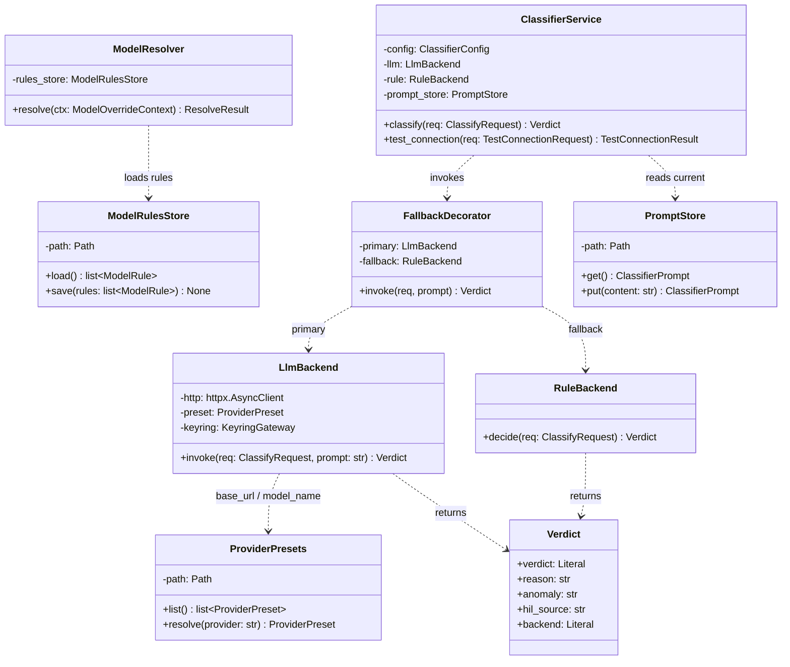
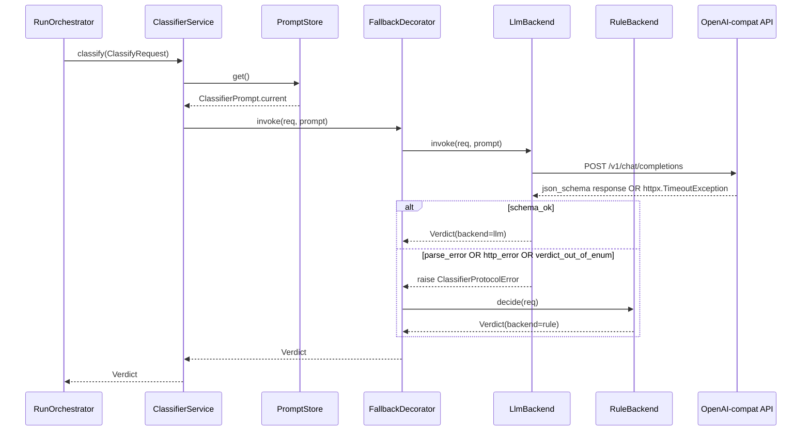
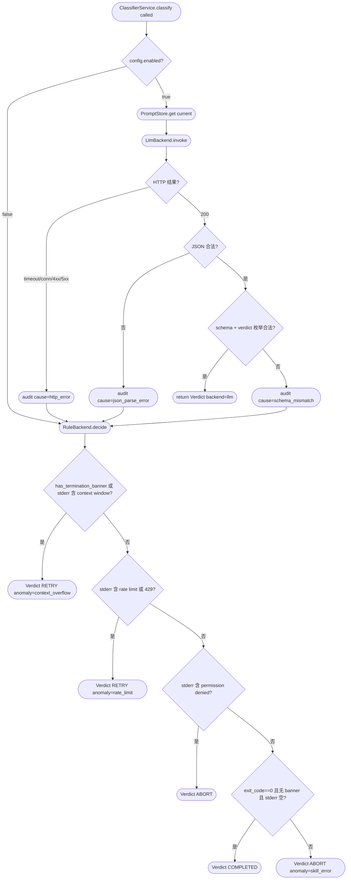

# Feature Detailed Design：F19 · Bk-Dispatch — Model Resolver & Classifier（Feature #19）

**Date**: 2026-04-25
**Feature**: #19 — F19 · Bk-Dispatch — Model Resolver & Classifier
**Priority**: high
**Dependencies**: F01 (App Shell & Platform Bootstrap · passing — `harness.auth.keyring_gateway.KeyringGateway` / `harness.config.store.ConfigStore` / `harness.api:app` FastAPI skeleton 已就绪)
**Design Reference**: docs/plans/2026-04-21-harness-design.md §4.4（consolidates deprecated F07 / F08）
**SRS Reference**: FR-019, FR-020, FR-021, FR-022, FR-023, IFR-004

## Context

F19 是 spawn 前置与 spawn 后置两条 dispatch 决策的合并单元：spawn 前 `ModelResolver` 按 4 层优先级 (`per-ticket > per-skill > run-default > provider-default`) 决定 `--model` argv 片段（供 F18 `ClaudeCodeAdapter.build_argv` 消费）；spawn 后 `ClassifierService` 读取 ticket 末尾 exit_code / stderr / stdout / banner，通过 LLM（OpenAI-compat HTTP，`response_format=json_schema`）或硬编码规则回路给出 `Verdict`（供 F20 `RunOrchestrator` 做转态决策）。合并后 LLM mock（respx）与 keyring mock 共享一套 fixture，TDD 单元 mock 面相对旧 F07/F08 减半。

## Design Alignment

**来源**：系统设计 §4.4（F19）完整内容复制如下。

**4.4.1 Overview**：Dispatch 前置决策服务——4 层模型优先级解析（per-ticket > per-skill > run-default > provider-default）+ ticket 结果分类（LLM backend via OpenAI-compat HTTP + rule backend 降级 + toggle off）。满足 FR-019/020/021/022/023；提供 IFR-004（OpenAI-compatible HTTP）的 httpx 客户端与 preset 管理。

**4.4.2 Key Types**（原文引用）：
- `harness.dispatch.model.ModelResolver` — 4 层优先级链
- `harness.dispatch.model.ModelRule` / `ModelRulesStore` / `ProvenanceTag`
- `harness.dispatch.classifier.ClassifierService` — 门面
- `harness.dispatch.classifier.LlmBackend` — httpx AsyncClient + `response_format=json_schema`（**Wave 3**：strict-off 分支 — prompt-only JSON suffix + tolerant `<think>`/JSON 提取，详见系统设计 §6.1.4 Effective Strict Schema 标志）
- `harness.dispatch.classifier.RuleBackend` — 硬编码规则降级
- `harness.dispatch.classifier.Verdict` — pydantic
- `harness.dispatch.classifier.PromptStore` — classifier prompt 当前 + 历史
- `harness.dispatch.classifier.ProviderPresets` — GLM / MiniMax / OpenAI / custom（**Wave 3**：含 `supports_strict_schema: bool = True` 能力位；MiniMax preset = `False`）
- `harness.dispatch.classifier.FallbackDecorator` — LLM 失败自动 rule 降级

**4.4.3 Module Layout 建议**：`harness/dispatch/` — `model/` 子包 + `classifier/` 子包 + `__init__.py`（暴露 `ModelResolver`、`ClassifierService`）

**4.4.4 Integration Surface**：
- **Provides**：模型解析 → F18（Bk-Adapter）；分类服务 → F20（Bk-Loop）；CRUD 路由 → F22（Fe-Config）
- **Requires**：F01（ConfigStore + keyring）

| 方向 | Consumer / Provider | Contract ID | Endpoint | Schema |
|---|---|---|---|---|
| Provides | F18 | IAPI-015 | `ModelResolver.resolve(ModelOverrideContext) → ResolveResult` | `ResolveResult` |
| Provides | F20 | IAPI-010 | `ClassifierService.classify(ClassifyRequest) → Verdict` | `Verdict` |
| Provides | F22 | IAPI-002 | REST `GET/PUT /api/settings/model_rules`、`/api/settings/classifier`、`/api/settings/classifier/test`、`/api/prompts/classifier` | `ModelRule[]`、`ClassifierConfig`、`TestConnectionRequest/Result`、`ClassifierPrompt` |
| Requires | IFR-004 | 外部 | HTTP `POST <base_url>/v1/chat/completions` + `Authorization: Bearer <key>` | OpenAI-compat |
| Requires | F01 | IAPI-014 | `KeyringGateway.get_secret(service, user)` | `str \| None` |

- **Key types**: ModelResolver / ModelRulesStore / ClassifierService / LlmBackend / RuleBackend / FallbackDecorator / PromptStore / ProviderPresets / Verdict
- **Provides / Requires**: Provides IAPI-015（ModelResolver → F18）、IAPI-010（ClassifierService → F20）、IAPI-002 子路由（/api/settings/model_rules · /api/settings/classifier · /api/settings/classifier/test · /api/prompts/classifier → F22）；Requires IAPI-014（F01 `KeyringGateway` · passing · 已可直接复用）、IFR-004（外部 OpenAI-compat HTTP，httpx 客户端本特性自建）
- **Deviations**: 无。全部方法签名与 §6.2.4 pydantic schema（`ModelOverrideContext` / `ResolveResult` / `ClassifyRequest` / `Verdict` / `ClassifierConfig` / `ClassifierPrompt` / `ModelRule`）一一对齐，不触发 Contract Deviation Protocol。

**UML 嵌入**：F19 涵盖 ≥2 类协作（ClassifierService / LlmBackend / RuleBackend / FallbackDecorator / PromptStore / ProviderPresets + ModelResolver / ModelRulesStore），且包含 ClassifierService → LlmBackend 失败 → RuleBackend 的调用序。故嵌入 classDiagram + sequenceDiagram 各一张。





## SRS Requirement

（以下内容直接引用 `docs/plans/2026-04-21-harness-srs.md` §FR-019..FR-023 + §IFR-004，无修改）

### FR-019: per-ticket / per-skill 模型覆写
**优先级**: Must
**EARS**: The system shall 支持在 SystemSettings 中配置 per-ticket 与 per-skill 的模型覆写规则，例如 `requirements` skill 默认 opus、`work` skill 默认 sonnet，并在 UI 中以规则表呈现可编辑。
**验收准则**:
- AC-1: Given per-skill 映射 `requirements=opus`，when dispatch 一张 requirements ticket，then argv 含 `--model opus`
- AC-2: Given 同时存在 per-ticket 与 per-skill 规则，when 构造 argv，then 按 FR-020 优先级链选择

### FR-020: 模型配置三层优先级
**优先级**: Must
**EARS**: When 为一张 ticket 选择 model, the system shall 按 per-ticket > per-skill > run-level default > provider default（省略 --model）优先级链决定最终值。
**验收准则**:
- AC-1: Given 仅 run-level default 设置，when dispatch，then argv 含该 model
- AC-2: Given 四层都未设置，when dispatch，then argv 不含 `--model`（交 CLI）
- AC-3: Given per-ticket 覆写优先于 per-skill，when 两者都设置，then per-ticket 胜出

### FR-021: Classifier OpenAI-compatible endpoint 支持
**优先级**: Must
**EARS**: The system shall 支持 Classifier 连接任意 OpenAI-compatible 聊天 completion endpoint（内置 GLM / MiniMax / OpenAI.com 预设，另支持自定义 endpoint），配置项包含 base_url / api_key / model_name。
**EARS（Wave 3 extension）**: The system shall 在 ProviderPreset 数据结构中包含 `supports_strict_schema: bool` 能力位 (GLM/OpenAI/custom=True, MiniMax=False)；ClassifierConfig 增 `strict_schema_override: bool | None = None`，None 沿用 preset，True/False 运行时覆写。
**验收准则**:
- AC-1: Given 选中 GLM 预设，when 保存，then base_url 自动填为 GLM 官方；api_key 从 keyring 读
- AC-2: Given 自定义 endpoint，when 保存空 base_url，then 前端阻止提交并红色提示
- AC-3 (ATS L89 补齐): Given base_url 非白名单域，when 后端校验，then 拒绝保存（SSRF 防护）
- AC-4 (Wave 3): Given preset='minimax' when ProviderPresets.resolve then supports_strict_schema=False
- AC-5 (Wave 3): Given preset ∈ {glm, openai, custom} when resolve then supports_strict_schema=True
- AC-6 (Wave 3): Given strict_schema_override=False + preset.supports_strict_schema=True when 计算 effective_strict then 取覆写值 False

### FR-022: Classifier 开关 + 硬编码规则降级
**优先级**: Must
**EARS**: Where Classifier 开关被用户关闭, the system shall 使用硬编码规则（exit_code / stderr 正则 / permission_denials / 终止横幅）替代 LLM 分类判定票据类别。
**验收准则**:
- AC-1: Given Classifier Off，when ticket 结束 exit_code=0 且无终止横幅，then 硬编码规则判 COMPLETED
- AC-2: Given Classifier Off，when stderr 含 "context window"，then 判 context_overflow 类

### FR-023: Classifier 启用时固定 Schema JSON 输出
**优先级**: Must
**EARS**: While Classifier 启用, the system shall 按固定 System Prompt 做无状态单次分类，使用 response_format=json_schema 强制返回 `{verdict: HIL_REQUIRED|CONTINUE|RETRY|ABORT|COMPLETED, reason, anomaly, hil_source}` 严格 JSON。
**EARS（Wave 3 extension — strict-off path）**: When effective_supports_strict_schema=False, the LlmBackend shall 不发送 `response_format` 字段；改为在 system message 末尾追加固定 JSON-only suffix；HTTP method/URL/Authorization header 与 strict-on 路径完全一致。
**EARS（Wave 3 extension — tolerant parse）**: The system shall 对所有 provider 的 LLM 响应内容应用容错解析（不论 strict on/off）：剥离 `<think>...</think>` 包裹的推理段；提取首个语法平衡 JSON 对象；解析失败仍走 RuleBackend 兜底（IAPI-010 永不抛保留）。
**验收准则**:
- AC-1: Given LLM 返回非合法 JSON，when 解析失败，then 降级到硬编码规则且在 audit log 记 warning
- AC-2: Given LLM 返回合法 JSON 但 verdict 不在枚举，then 降级并记 warning
- AC-3 (Wave 3): Given effective strict-off when LlmBackend.invoke then request body 不含 'response_format' 键；system message = PromptStore.current + 固定 JSON-only suffix
- AC-4 (Wave 3): Given strict-off + LLM 返合法 JSON when parse then Verdict(backend='llm') verdict ∈ enum
- AC-5 (Wave 3): Given content='<think>x</think>{...}' when parse then 提取后段合法 JSON 解析成功
- AC-6 (Wave 3): Given content 含多个 JSON 段 when parse then 取首个语法平衡对象
- AC-7 (Wave 3): Given content 无可提取 JSON when parse then ClassifierProtocolError(cause='json_parse_error') → FallbackDecorator 兜底 rule（audit 记 classifier_fallback）

### IFR-004: OpenAI-compatible HTTP API
**Protocol**: HTTP POST `<base_url>/v1/chat/completions` + `Authorization: Bearer <key>`
**Data Format**: JSON request + JSON response（`response_format=json_schema` 在 effective_strict=true 时发送；effective_strict=false 时省略该字段并在 system message 追加 JSON-only suffix — 详见 SRS §6 "Effective Strict Schema 标志" + design §6.1.4）
**ATS 约束**（L182）：10s timeout、SSRF 防 base_url 白名单、401 → 降级 rule + audit。
**验收准则**:
- AC-mod (Wave 3): Given effective_strict=false when 构造 HTTP request then URL/method/Authorization 一致；body 不含 'response_format' 字段

## Interface Contract

| Method | Signature | Preconditions | Postconditions | Raises |
|--------|-----------|---------------|----------------|--------|
| `ModelResolver.resolve` | `resolve(ctx: ModelOverrideContext) -> ResolveResult` | `ctx.tool ∈ {"claude","opencode"}`；任意层可为 None | 返回 `ResolveResult(model, provenance)`；provenance ∈ `{per-ticket, per-skill, run-default, cli-default}`；若四层全空，`model is None` 且 `provenance == "cli-default"`（FR-020 AC-2）；否则选中首个非空层并记录对应 provenance（FR-020 AC-1/AC-3） | — |
| `ModelRulesStore.load` | `load() -> list[ModelRule]` | 路径可读或不存在 | 返回 `ModelRule[]`（空文件 / 不存在 → `[]`）；JSON 非法 → 抛 | `ModelRulesCorruptError`（JSON 非法或 schema 不匹配） |
| `ModelRulesStore.save` | `save(rules: list[ModelRule]) -> None` | 每条 `ModelRule` 通过 pydantic 校验；`skill` 可选、`tool ∈ {"claude","opencode"}`、`model` 非空 | 原子写 `~/.harness/model_rules.json`（temp+rename、0o600 POSIX）；下次 `load()` 返回同列表 | `ModelRulesStoreError`（磁盘 IO 失败） |
| `ClassifierService.classify` | `async classify(req: ClassifyRequest) -> Verdict` | `req.stderr_tail` / `stdout_tail` 为 `str`（可空）；`req.exit_code` 可为 `None`；`req.has_termination_banner ∈ {True, False}` | 返回 `Verdict`；当 `config.enabled=True` 且 LLM 回合法 schema → `backend="llm"`；LLM 任一失败（http 错误 / timeout / JSON 非法 / verdict 越界） → 降级 `RuleBackend` 并写一条 audit warning（结构化 `{ event:"classifier_fallback", cause:<原因> }`）且返回 `backend="rule"`；当 `config.enabled=False` → 直接 `backend="rule"`（FR-022）。**Wave 3 增量**：classify 内部按 `effective_strict = config.strict_schema_override if config.strict_schema_override is not None else preset.supports_strict_schema` 计算，并注入 `LlmBackend`；计算结果不改变 classify 对外返回 schema 与永不抛承诺 | 不抛 — 所有分类路径都必须返回 `Verdict`（F20 依赖"永不失败"语义，参见 §6.2.1 IAPI-010 "rule 降级后抛"实质为不再向调用方抛出分类失败） |
| `LlmBackend.invoke` | `async invoke(req: ClassifyRequest, prompt: str) -> Verdict` | `config.enabled=True`；keyring 能取到 `api_key`；`preset.base_url` 已通过 SSRF 白名单；`prompt` 为 PromptStore.current；**Wave 3**：构造期注入 `effective_strict: bool` | 发 HTTP POST 到 `<base_url>/v1/chat/completions`，10s timeout（NFR-004/IFR-004 PERF）。**Wave 3 双路径 body 构造**：`effective_strict=True` → body 含 `response_format.type="json_schema"` + `strict=true` + Verdict schema，响应 json_schema 严格校验；`effective_strict=False` → body 不含 `response_format`，system message 末尾拼接 `_JSON_ONLY_SUFFIX` 常量（prompt-only JSON 约束），响应走 tolerant `_extract_json`（剥 `<think>...</think>` 后扫首个语法平衡 JSON 对象）。URL / method / Authorization / temperature=0 不变。返回 `Verdict(backend="llm")` 或抛 | `ClassifierHttpError`（httpx timeout / connection / 4xx/5xx）、`ClassifierProtocolError`（JSON 非法 / schema 不匹配 / verdict 不在枚举 / tolerant extractor 无法定位 JSON） |
| `RuleBackend.decide` | `decide(req: ClassifyRequest) -> Verdict` | 无 — 纯函数 | 按规则链判定：①`has_termination_banner` 或 `stderr_tail` 匹配 `r"(?i)context window\|exceeded max tokens\|token limit"` → `anomaly="context_overflow", verdict="RETRY"`（FR-022 AC-2）；②`stderr_tail` 匹配 `r"(?i)rate limit\|overloaded\|HTTP 429"` → `anomaly="rate_limit", verdict="RETRY"`；③`stderr_tail` 匹配 `r"(?i)permission denied"` → `verdict="ABORT"`；④`exit_code == 0` 且无 banner 且 stderr/stdout 无匹配 → `verdict="COMPLETED"`（FR-022 AC-1）；⑤其他 → `verdict="ABORT", anomaly="skill_error"`；`backend="rule"` 恒成立 | — |
| `FallbackDecorator.invoke` | `async invoke(req: ClassifyRequest, prompt: str) -> Verdict` | `primary: LlmBackend`、`fallback: RuleBackend` 均已注入 | `primary.invoke()` 成功 → 透传；任一异常 → 调 `fallback.decide()` 并 audit log（`event="classifier_fallback"`，`cause` 填异常类名 + 摘要） | — |
| `ClassifierService.test_connection` | `async test_connection(req: TestConnectionRequest) -> TestConnectionResult` | `req.base_url` 通过 SSRF 白名单校验；keyring 可返回 api_key 或 `None` | 发探测 request；成功 → `ok=True, latency_ms, model_list?`；失败 → `ok=False, error_code ∈ {"401","connection_refused","dns_failure","timeout"}, message`（ATS INT-025）；不改变已持久化 config | 不抛 — 统一封装为 `TestConnectionResult` 返回 |
| `PromptStore.get` | `get() -> ClassifierPrompt` | 路径可读或不存在 | 返回 `ClassifierPrompt(current, history[])`；不存在 → 首次读返回内置默认 prompt + `history=[]` | `PromptStoreCorruptError` |
| `PromptStore.put` | `put(content: str) -> ClassifierPrompt` | `content` 非空、UTF-8 可编码、长度 ≤ 32 KB | 原子写；追加一条 `ClassifierPromptRev(rev=N+1, saved_at, hash=sha256, summary=first_line_120_chars)` 到 `history[]`；返回新 `ClassifierPrompt`（v1：append-only，不做 diff；FR-033b 延至 v1.1） | `PromptStoreError`（磁盘 IO 失败）、`PromptValidationError`（空 / 过大） |
| `ProviderPresets.resolve` | `resolve(provider: Literal["glm","minimax","openai","custom"]) -> ProviderPreset` | `provider` 为枚举值 | 返回对应 `ProviderPreset(name, base_url, default_model, api_key_user_slot, supports_strict_schema)`；`custom` 时 `base_url`/`model_name` 留给调用方填。**Wave 3**：新字段 `supports_strict_schema: bool = True`，GLM/OpenAI/custom = `True`、MiniMax = `False`；旧 preset JSON 缺字段加载默认 `True`（Additive，向后兼容） | `ProviderPresetError`（未知 provider） |
| `ProviderPresets.validate_base_url` | `validate_base_url(base_url: str) -> None` | — | `base_url` 通过检查：scheme==`https`（loopback test 可破例 `http://127.0.0.1`）；hostname 属于内置白名单域（`open.bigmodel.cn`、`api.minimax.chat`、`api.openai.com`）或其子域；自定义 endpoint 则 hostname 不能解析到 IANA 私网 / loopback / link-local（FR-021 AC-3 / ATS L182 SSRF） | `SsrfBlockedError`（白名单外 + 私网 + 非 https） |

**方法状态依赖**：`ClassifierService.classify` 行为依赖 `config.enabled` 布尔（2 态：on/off），但 enabled→disabled 切换是**立即无状态**（每次 call 读当前 config），无 transition 图需画。`FallbackDecorator.invoke` 依赖 primary 成功/失败 — 这是分支流程，在 §Implementation Summary 下方用 `flowchart TD` 表达，不是状态机。故本段跳过 `stateDiagram-v2`。

**Design rationale**（每条非显见决策一行）：
- **ClassifierService 对 F20 永不抛**：F20 `RunOrchestrator` 依据 `Verdict` 驱动状态机（see §6.2.4）。若 classify 本身失败，F20 无可处理路径 → 故 F19 保证所有失败路径归一为 `Verdict(backend="rule", …)` + audit warning。IAPI-010 签名中 `ClassifierHttpError` 是 **内部** 异常，仅出现在 `LlmBackend` 层，经 `FallbackDecorator` 拦截后不再上浮。
- **rule backend 优先级序列**：context_overflow 判定放在 permission_denied / exit_code 之前，以对齐 FR-022 AC-2（context_window 即便 exit_code=0 也判 context_overflow）。
- **SSRF 白名单严格匹配 hostname**：不使用 `in` 子串匹配（`evil-api.openai.com.attacker.com` 绕过），改用 `urllib.parse.urlparse().hostname` 精确比对白名单 + 子域 `endswith(".open.bigmodel.cn")` 模式。
- **PromptStore v1 append-only history**：FR-033b（diff view）延至 v1.1（`deferred.md` DFR-001）；v1 仅按 IAPI-002 `ClassifierPrompt { current, history[] }` schema 写 `{rev, saved_at, hash, summary}` 元数据，不持久化 full body history（节省磁盘）；FR-033 v1 界面读 summary + hash 足矣。
- **10s httpx timeout 硬编码**：IFR-004 ATS PERF 明确阈值；不走 config 避免用户误配导致 `RunOrchestrator` spawn-to-classify 卡死。
- **`cli-default` provenance**：当四层全空，ResolveResult `model=None` 且 `provenance="cli-default"`；F18 `ClaudeCodeAdapter.build_argv` 读 `model is None` 则省略 `--model` argv（§6.2.4 DispatchSpec.model Optional）。
- **跨特性契约对齐**：方法签名一对一对齐 IAPI-010（`ClassifierService.classify`）、IAPI-015（`ModelResolver.resolve`）、IAPI-002 子路由的 pydantic schema（ClassifierConfig / ClassifierPrompt / ModelRule / TestConnectionResult）。

## Visual Rendering Contract

> N/A — 后端专用特性（`ui: false`）。UI 部分（SystemSettings 模型规则表 / Classifier 卡片 / PromptsAndSkills 编辑器）由 F22 拥有，通过 IAPI-002 REST 子路由消费本特性 Provider。

## Implementation Summary

**1. 主要类与文件**：新增目录 `harness/dispatch/`，内含两个子包 `model/`（模块：`resolver.py`、`rules_store.py`、`models.py`）与 `classifier/`（模块：`service.py`、`llm_backend.py`、`rule_backend.py`、`fallback.py`、`prompt_store.py`、`provider_presets.py`、`models.py`、`errors.py`、`default_prompt.md`）。`harness/dispatch/__init__.py` 对外暴露 `ModelResolver` / `ClassifierService`（F18/F20 import 入口）。同时在 `harness/api/` 下新建 `settings.py`（挂载 `/api/settings/model_rules` · `/api/settings/classifier` · `/api/settings/classifier/test` 路由）与 `prompts.py`（挂载 `/api/prompts/classifier`），两者在 `harness/api/__init__.py` 中以 `app.include_router` 方式注册（参考 §4.4.4 既有 `_skills_router` 注册风格）。

**2. 运行时调用链**：① spawn 前 — F20 `RunOrchestrator` 构造 `ModelOverrideContext(ticket_override, skill_hint, run_default, tool)` → `ModelResolver.resolve` 从 `ModelRulesStore.load()` 取当前规则集 → 命中层返回 `ResolveResult(model, provenance)` → F20 写入 `DispatchSpec.model / model_provenance` → F18 `ClaudeCodeAdapter.build_argv` 生成 `--model <model>` 片段。② spawn 后 — F20 收 pty 退出事件后构造 `ClassifyRequest(exit_code, stderr_tail, stdout_tail, has_termination_banner)` → `ClassifierService.classify` 先 `PromptStore.get()` → 若 `ClassifierConfig.enabled=False`，直接 `RuleBackend.decide`；否则走 `FallbackDecorator.invoke` → `LlmBackend.invoke`（内部 `ProviderPresets.resolve` → `KeyringGateway.get_secret("harness-classifier", user=preset.api_key_user_slot)` 拿 key，httpx AsyncClient POST 10s timeout，`response_format=json_schema`）→ 成功返 `Verdict(backend="llm")`；任一异常 → `FallbackDecorator` 吞 + audit warning + `RuleBackend.decide` 兜底；`Verdict` 回传给 F20 的 state machine。③ REST 路由 — `/api/settings/classifier/test` 走 `ClassifierService.test_connection`（POST 一条 `ping` 消息，401/502/timeout/dns 错误分三类归一为 `TestConnectionResult`，对齐 ATS INT-025）；`/api/prompts/classifier PUT` 走 `PromptStore.put(content)` 并 broadcast audit。

**3. 关键设计决策 / 非显见约束**：**永不抛**语义是核心 — `ClassifierService.classify` 任何路径都必须返回合法 `Verdict`，把决策复杂度锁在 F19 内部而不是让 F20 再分叉（简化 F20 状态机）；**SSRF 严格 hostname 白名单**不能用 substring，必须精确等价或 `.`-前缀 endswith（避免 `open.bigmodel.cn.evil.com` 绕过），且对 `provider=="custom"` 额外检查 hostname 非私网 / loopback（链路地址 169.254.0.0/16 / 10.0.0.0/8 / 172.16.0.0/12 / 192.168.0.0/16 / fc00::/7）；**Prompt v1 仅 append-only**，不构造 diff 树（DFR-001 延至 v1.1），每条 rev 只存 `{rev, saved_at, hash, summary}`，full body 由 `current` 覆写，节省磁盘 + 避免落盘 prompt 越滚越大；**httpx AsyncClient 单例**（每 `ClassifierService` 一个，不每次请求新建）；**`response_format=json_schema`** 使用 OpenAI-compat 严格 schema（见下表 schema 字段），保证 verdict 枚举越界即协议违反，LlmBackend 抛 `ClassifierProtocolError` 触发 fallback。

**3a. Wave 3（2026-04-25）effective_strict 计算 + 双路径 body 构造 + tolerant parse（全 provider 通用）**：
- **计算点**：`ClassifierService._resolve_preset` / `classify` 内部一次性求值 `effective_strict = config.strict_schema_override if config.strict_schema_override is not None else preset.supports_strict_schema`，作为构造参数注入 `LlmBackend`（不污染 LlmBackend 接口签名：仍为 `invoke(req, prompt)`，strict 决策在构造期固化）。
- **body 双路径**（`LlmBackend._build_request_body`）：`effective_strict=True` 分支与旧行为等价（带 `response_format` json_schema + `strict=true`）；`effective_strict=False` 分支**剥离** `response_format` 字段，并把 `_JSON_ONLY_SUFFIX` 常量追加到 system message 末尾（"只输出严格 JSON 对象，不要包裹 markdown 代码块，不要输出 `<think>` 推理链"），URL / method / Authorization / `temperature=0` 不变；F19 的 IFR-004 协议根 0 变化。
- **tolerant parse**（`LlmBackend._extract_json`，**全 provider 共用**，不限 strict-off）：①先用正则剥离所有 `<think>...</think>` 块（DeepSeek-R1 系 reasoning model + MiniMax 输出可能残留）；②在剩余文本里逐字符扫首个语法平衡（大括号计数平衡）的 JSON 对象，`json.loads` 成功则返回 dict；③若没有可平衡对象或 `json.loads` 失败 → 抛 `ClassifierProtocolError(cause="json_parse_error")` → FallbackDecorator 捕获 → rule 兜底 + audit。该函数为**幂等/纯函数**，strict-on 路径也经它反序列化（减少重复代码），只是 strict-on 下响应通常为干净 JSON，extractor 的 `<think>` 剥离是 no-op。
- **Provider 能力位映射**（`provider_presets.py`）：GLM=True、OpenAI=True、custom=True、MiniMax=False（与 F19 smoke 回归证据一致：MiniMax OpenAI-compat 端点对 `response_format=json_schema` 支持不稳，详见 §11.4 Risk 表 Wave 3 行）。用户可通过 `ClassifierConfig.strict_schema_override` 对任一 provider 覆写（None=沿用 preset，True/False=显式强制）。
- **AC-7 审计粒度**：audit 事件 `classifier_fallback` 的 `cause` 枚举新增 `"json_parse_error"` 值（strict-off 分支 tolerant extractor 失败时命中；strict-on 分支 JSON 非法亦复用同枚举），FallbackDecorator 既有 audit 路径无需重构。

**4. 存量代码交互点**：① `KeyringGateway`（F01 · `harness/auth/keyring_gateway.py:60`）— `LlmBackend` 通过 `get_secret("harness-classifier", user=<provider>)` 取 api_key，利用既有的 `harness-*` service prefix 约束 + `PlaintextKeyring` 降级检测；② `HarnessConfig.provider_refs`（F01 · `harness/config/schema.py:45`）— 持久化 `ApiKeyRef(service, user)` 指针，`ClassifierConfig.api_key_ref` 字段写入该映射（复用 `ConfigStore` 的 leak detector 防止明文误入 config.json）；③ `harness/api/__init__.py:28`（F01 `app`）— 新增 routers `include_router` 注入；④ `env-guide.md §4` 为 Greenfield 占位，无强制内部库 / 禁用 API 约束；命名约定沿用仓库内已定型风格（`snake_case` 模块文件、`PascalCase` 类、pydantic `ConfigDict(extra="forbid")`，对齐 `harness/config/schema.py` / `harness/domain/ticket.py`）；错误处理沿用既有 `*Error` 异常类 + `raise ... from exc` chain 模式（`harness/auth/keyring_gateway.py:117`）。

**5. §4 Internal API Contract 集成**：本特性对 IAPI-015 / IAPI-010 / IAPI-002 / IAPI-014（Consumer）严格匹配 §6.2.4 schema — `ModelOverrideContext` / `ResolveResult` / `ClassifyRequest` / `Verdict` / `ModelRule` / `ClassifierConfig` / `ClassifierPrompt` 均复用系统设计 §6.2.4 pydantic 定义（本特性在 `harness/dispatch/*/models.py` import 或重新声明等价模型，如 §6.2.4 未涵盖的 `TestConnectionRequest/Result` 在本特性新增并挂到 IAPI-002 子路由）；IAPI-014 消费端则直接 `from harness.auth import KeyringGateway`；响应 schema 的 `verdict` 枚举与 Design §5.4 `Classification.verdict` 完全一致；LLM `response_format` schema JSON Schema 如下：
```json
{
  "name": "verdict_schema",
  "schema": {
    "type": "object",
    "additionalProperties": false,
    "required": ["verdict","reason","anomaly","hil_source"],
    "properties": {
      "verdict": {"type": "string", "enum": ["HIL_REQUIRED","CONTINUE","RETRY","ABORT","COMPLETED"]},
      "reason":  {"type": "string", "minLength": 1, "maxLength": 1024},
      "anomaly": {"type": ["string","null"], "enum": ["context_overflow","rate_limit","network","timeout","skill_error",null]},
      "hil_source": {"type": ["string","null"]}
    },
    "strict": true
  }
}
```

**方法内决策分支（`flowchart TD`）**：`FallbackDecorator.invoke` + `RuleBackend.decide` 含 ≥3 决策分支 / 异常路径，画流程图：



### Boundary Conditions

| Parameter | Min | Max | Empty/Null | At boundary |
|-----------|-----|-----|------------|-------------|
| `ModelOverrideContext.ticket_override` | — | — | None → 跳到 per-skill 层 | 空字符串 `""` 视为 None（避免 `--model ""`） |
| `ModelOverrideContext.skill_hint` | — | — | None → 跳到 run-default | `""` 视为 None |
| `ModelOverrideContext.run_default` | — | — | None → 跳到 cli-default | `""` 视为 None |
| `ModelOverrideContext.tool` | — | — | 不允许 None（必填） | `"claude" / "opencode"` 外值 → pydantic 校验拒 |
| `ModelRule.model` | 非空 | 64 chars | 空 → pydantic 拒 | 超 64 → 拒 |
| `ModelRule.skill` | — | 128 chars | None → 视为 run-default rule（`skill IS NULL` 查询匹配） | 空串 `""` 归一为 None |
| `ClassifyRequest.exit_code` | `-128` | `255` | None → 规则视为 "unknown"（exit code 不纳入判断） | -1（SIGKILL 后常见）→ ABORT + skill_error |
| `ClassifyRequest.stderr_tail` | — | 32 KB（截断） | 空串 → 规则跳过 stderr 分支 | 32 KB 以上取尾部 |
| `ClassifyRequest.stdout_tail` | — | 32 KB（截断） | 同上 | 同上 |
| `ClassifyRequest.has_termination_banner` | — | — | 不允许 None | False / True 二态 |
| `PromptStore.put.content` | 1 char | 32 KB | 空 → 抛 `PromptValidationError` | 32 KB + 1 → 抛 |
| `ClassifierConfig.base_url` | `https://a.b/` 最短 | 256 chars | 空串 → 400（API 层）；pydantic 拒 | hostname 不在白名单 → `SsrfBlockedError` |
| `ClassifierConfig.strict_schema_override` | — | — | `None`（默认，沿用 `preset.supports_strict_schema`） | `True` / `False` / `None` 三态；Wave 3 Additive；旧 payload 缺字段等价 `None` |
| `ProviderPreset.supports_strict_schema` | — | — | 不允许 None | `True`（GLM/OpenAI/custom 默认）/ `False`（MiniMax）；Wave 3 Additive 字段，旧 preset JSON 缺字段加载默认 `True` |
| `ProviderPresets.resolve.provider` | — | — | 不允许 None | 不在 `{glm,minimax,openai,custom}` → `ProviderPresetError` |

### Existing Code Reuse

Step 1c 搜索关键字与结果：

| Keyword | 文件范围 | 结果 |
|---|---|---|
| `ModelResolver` / `model_resolver` | `harness/**` | 0 match（greenfield） |
| `ClassifierService` / `classifier` / `classify` | `harness/**` | 0 match |
| `httpx` / `AsyncClient` / `chat/completions` | `harness/**` | 0 match（requirements.txt 已含 httpx==0.28.1，但尚无调用点） |
| `keyring` facade | `harness/auth/keyring_gateway.py` | **复用** |
| `ConfigStore` / `HarnessConfig` | `harness/config/store.py`, `harness/config/schema.py` | **复用** |
| `FastAPI app.include_router` | `harness/api/__init__.py:33` | **复用** 模式 |

| Existing Symbol | Location (file:line) | Reused Because |
|-----------------|---------------------|----------------|
| `harness.auth.KeyringGateway` | `harness/auth/keyring_gateway.py:60` | IAPI-014 Provider；LlmBackend 读 api_key 时直接 `gateway.get_secret("harness-classifier", user=<provider>)`，不重新实现 keyring 封装 |
| `harness.auth.keyring_gateway.KeyringServiceError` | `harness/auth/keyring_gateway.py:22` | 错误传播 — LlmBackend 捕获后映射为 `ClassifierHttpError` 级失败，触发 fallback |
| `harness.config.ConfigStore` | `harness/config/store.py:53` | `ClassifierConfig.api_key_ref` 写入 `HarnessConfig.provider_refs`，走 ConfigStore 原子写 + leak detector |
| `harness.config.schema.ApiKeyRef` | `harness/config/schema.py:33` | 持久化 `(service, user)` 指针，复用 NFR-008 安全边界 |
| `harness.api:app` + `include_router` 模式 | `harness/api/__init__.py:33` (F10 skills_router 注册参考) | 新建 settings/prompts router 时沿用同注册风格，避免在 `app` 上直接 `@app.get` 堆路由 |
| `FallbackDecorator` audit `classifier_fallback` 事件 | `harness/dispatch/classifier/fallback.py`（F19 Wave 2 已实现） | **Wave 3** 复用：strict-off tolerant parse 失败路径直接抛 `ClassifierProtocolError` → 既有 FallbackDecorator 捕获器命中 AC-7 `cause='json_parse_error'` audit 路径，无需新增降级 / 审计代码 |

## Test Inventory

| ID | Category | Traces To | Input / Setup | Expected | Kills Which Bug? |
|----|----------|-----------|---------------|----------|-----------------|
| T01 | FUNC/happy | FR-019 AC-1 · §IC ModelResolver.resolve | `ModelOverrideContext(skill_hint="requirements", run_default=None, ticket_override=None, tool="claude")`；rules=`[ModelRule(skill="requirements", tool="claude", model="opus")]` | `ResolveResult(model="opus", provenance="per-skill")` | per-skill 规则不生效（遗漏 skill 字段匹配） |
| T02 | FUNC/happy | FR-020 AC-3 · §IC ModelResolver.resolve · §DA seq msg ModelResolver←RulesStore | `ctx.ticket_override="opus"`, `ctx.skill_hint="requirements"`；rules 含 `requirements→sonnet` | `ResolveResult(model="opus", provenance="per-ticket")` | 优先级顺序颠倒（per-skill 胜 per-ticket）|
| T03 | FUNC/happy | FR-020 AC-1 | 仅 `ctx.run_default="haiku"`，其他 None | `ResolveResult(model="haiku", provenance="run-default")` | 遗漏 run-default 层 |
| T04 | BNDRY/edge | FR-020 AC-2 · §BC ctx 四层 None | 全 None | `ResolveResult(model=None, provenance="cli-default")` | 错误返回空串而非 None / 遗漏 cli-default 分支 |
| T05 | BNDRY/edge | §BC ticket_override="" | `ctx.ticket_override=""`, skill rule 存在 | skip 空串，走 per-skill | 空串被当有效覆写导致 `--model ""` |
| T06 | FUNC/error | §IC ModelRulesStore.load Raises | 写入非法 JSON 到 model_rules.json | 抛 `ModelRulesCorruptError` | JSON 错误被吞造成规则丢失 |
| T07 | FUNC/happy | FR-019 · §IC ModelRulesStore.save | `save([ModelRule(skill="work",tool="claude",model="sonnet")])` → 再 `load()` | 得到等价列表；文件权限 POSIX 0o600 | 非原子写导致半截文件 / 权限过宽 |
| T08 | SEC/fs-perm | §IC ModelRulesStore.save · NFR-008 精神延伸 | POSIX 平台 save 后 `os.stat().st_mode & 0o777` | `== 0o600` | 规则文件世界可读（虽非 secret，但路径 `~/.harness/` 应严格） |
| T09 | FUNC/happy | FR-022 AC-1 · §IC RuleBackend.decide · §IS flow branch ExitOk | `ClassifyRequest(exit_code=0, stderr_tail="", stdout_tail="", has_termination_banner=False)` | `Verdict(verdict="COMPLETED", backend="rule", anomaly=None)` | 健康 ticket 被误判 ABORT |
| T10 | FUNC/happy | FR-022 AC-2 · §IS flow branch Banner | `ClassifyRequest(exit_code=1, stderr_tail="... context window exceeded ...", has_termination_banner=False)` | `Verdict(verdict="RETRY", anomaly="context_overflow", backend="rule")` | context_overflow 正则未命中 |
| T11 | FUNC/error | §IS flow branch RateLimit | stderr 含 `"HTTP 429 rate limit"` | `Verdict(verdict="RETRY", anomaly="rate_limit", backend="rule")` | rate_limit 漏判 |
| T12 | FUNC/error | §IS flow branch Perm | stderr 含 `"Permission denied"` | `Verdict(verdict="ABORT", anomaly=None, backend="rule")` | permission 情况误重试 |
| T13 | FUNC/error | §IS flow branch SkillErr | `exit_code=2, stderr="segfault"`, 无 banner，无 context/rate/perm 关键字 | `Verdict(verdict="ABORT", anomaly="skill_error", backend="rule")` | 未知失败漏分类 |
| T14 | BNDRY/edge | §BC exit_code=None | `ClassifyRequest(exit_code=None, stderr_tail="", stdout_tail="", has_termination_banner=False)` | `Verdict(verdict="ABORT", anomaly="skill_error")` 或等价非-COMPLETED | exit_code None 被当 0 误判 COMPLETED |
| T15 | BNDRY/edge | §BC stderr_tail 32KB 截断 | stderr 100 KB，尾部含 "context window" | 截取尾 32 KB 后命中 → context_overflow | 头部截断导致命中丢失 |
| T16 | FUNC/happy | FR-023 · §IC LlmBackend.invoke · §DA seq msg LlmBackend→HttpApi | respx mock `POST /v1/chat/completions` 返合法 schema JSON `{verdict:"HIL_REQUIRED",reason:"...",anomaly:null,hil_source:"user_question"}` | `Verdict(verdict="HIL_REQUIRED", backend="llm")`；audit log 无 fallback 警告 | response_format 解析失败 / 错误映射 backend=rule |
| T17 | FUNC/error | FR-023 AC-1 · §IS flow FallbackParse | respx mock 返 `"not json {"` | 降级 rule 产出 Verdict；audit log 一行 `{event:"classifier_fallback", cause:"json_parse_error"}` | 非合法 JSON 未被 fallback 捕获导致整体失败 |
| T18 | FUNC/error | FR-023 AC-2 · §IS flow FallbackSchema · SEC prompt-injection 防护 | respx mock 返 `{"verdict":"SHUTDOWN", ...}`（越界枚举，典型 prompt injection 注出） | 降级 rule；audit `cause="verdict_out_of_enum"` | LLM 任意输出被当合法 verdict 透传（导致非法状态转移） |
| T19 | FUNC/error | §IS flow FallbackHttp | respx mock 抛 `httpx.TimeoutException` | 降级 rule；audit `cause="http_timeout"` | timeout 冒泡导致 F20 state machine 死锁 |
| T20 | SEC/ssrf | FR-021 AC-3 · §IC ProviderPresets.validate_base_url · ATS L89/L182 | save `ClassifierConfig(base_url="https://169.254.169.254/v1")` | 抛 `SsrfBlockedError`；配置未落盘 | 元数据服务 SSRF 成功 |
| T21 | SEC/ssrf | §IC ProviderPresets.validate_base_url | save `ClassifierConfig(base_url="http://open.bigmodel.cn.evil.com/v1")` | 抛 `SsrfBlockedError`（子串误匹配测试） | hostname 子串匹配漏洞 |
| T22 | SEC/ssrf | §IC ProviderPresets.validate_base_url | save custom `base_url="http://10.0.0.1/v1"`（HTTP + 私网） | 抛 `SsrfBlockedError` | 内网私网 IP 未被拦截 |
| T23 | FUNC/happy | FR-021 AC-1 · §IC ProviderPresets.resolve | `resolve("glm")` | `ProviderPreset(name="glm", base_url="https://open.bigmodel.cn/api/paas/v4/", default_model="glm-4-plus", api_key_user_slot="glm")` | preset 固定值打错 |
| T24 | BNDRY/edge | §IC ProviderPresets.resolve | `resolve("unknown")` | 抛 `ProviderPresetError` | 未知 provider 被静默接受 |
| T25 | SEC/keyring | FR-021 AC-1 · §IC LlmBackend.invoke · IAPI-014 | mock `KeyringGateway.get_secret("harness-classifier","glm") → "sk-test"` | LlmBackend 发送 `Authorization: Bearer sk-test` header；config.json 内不含明文 | api_key 落入 config.json 明文（NFR-008 违反）|
| T26 | SEC/secret-leak | FR-021 AC-1 · NFR-008 · ConfigStore leak detector | 构造 `HarnessConfig` 尝试把 `api_key="sk-xxx..."` 塞进 extras 并 save | `SecretLeakError` 抛出（复用现有 `_detect_secret_leak`） | 绕过 ApiKeyRef 直接注入 plaintext key |
| T27 | FUNC/happy | FR-022 · §IC ClassifierService.classify · config.enabled=False | `ClassifierConfig(enabled=False)`；`exit_code=0 stderr="" banner=False` | `Verdict(verdict="COMPLETED", backend="rule")`；LlmBackend 未被调用（respx 断言零请求） | enabled=false 仍调 LLM 浪费额度 |
| T28 | FUNC/happy | FR-023 · §IC PromptStore.get/put · §DA seq msg ClassifierService→PromptStore | 新 PromptStore；`put("v1 prompt")` → `get()` → `put("v2 prompt")` → `get()` | `current="v2 prompt"`；`history` 长度=2；`history[0].rev=1`、`history[1].rev=2`；`hash` 为 sha256 hex | 历史未追加 / rev 未自增 / 覆盖 current 失败 |
| T29 | BNDRY/edge | §IC PromptStore.put · §BC content | `put("")` | 抛 `PromptValidationError` | 空 prompt 被保存导致 LLM 无 system prompt |
| T30 | BNDRY/edge | §IC PromptStore.put · §BC content | `put("x" * 32768 + "y")` | 抛 `PromptValidationError` | 32KB 上限未校验导致磁盘膨胀 |
| T31 | INTG/http | IFR-004 · §IC LlmBackend.invoke · §DA seq msg LlmBackend→HttpApi · ATS L182 PERF | respx mock 延迟 15s；`httpx.AsyncClient(timeout=10)` | 10 ± 1 s 内抛 `ClassifierHttpError(cause="timeout")`，触发 fallback 返 `Verdict(backend="rule")` | timeout 未设置导致阻塞 > NFR-004 预算 |
| T32 | INTG/http | ATS INT-025 · §IC ClassifierService.test_connection | respx mock 返 401 Unauthorized | `TestConnectionResult(ok=False, error_code="401", message=...)`；不抛 | 401 导致 test 抛异常 UI 黑洞 |
| T33 | INTG/http | ATS INT-025 · §IC ClassifierService.test_connection | respx mock `ConnectError` | `TestConnectionResult(ok=False, error_code="connection_refused")` | 连接错误未分类 |
| T34 | INTG/http | ATS INT-025 · §IC ClassifierService.test_connection | respx mock DNS `httpx.ConnectError` 带 `getaddrinfo failed` | `TestConnectionResult(ok=False, error_code="dns_failure")` | DNS 失败归入 `500` 全家桶 |
| T35 | INTG/fs | §IC ModelRulesStore · `~/.harness/model_rules.json` persist | tmp_path 写 `save()` → 新 Store 实例 `load()` | 内容一致 | tmp 文件未 rename 导致丢失 |
| T36 | INTG/keyring | IAPI-014 · §IC LlmBackend.invoke | 使用 `keyring.backends.fail` backend；尝试 LlmBackend.invoke | 抛 `ClassifierHttpError`（keyring 失败被映射） → fallback rule | keyring 失败冒泡为 500 |
| T37 | FUNC/error | §IC ClassifierService.classify `永不抛` 契约 | respx + keyring + prompt_store 均故意故障 | 返合法 `Verdict(backend="rule")`；不抛异常 | 异常冒泡破坏 F20 状态机 |
| T38 | FUNC/happy | FR-019 · IAPI-002 `GET /api/settings/model_rules` | FastAPI TestClient 调 GET | 200 + `[]`（初始空） | 路由未注册 |
| T39 | FUNC/happy | FR-019 · IAPI-002 `PUT /api/settings/model_rules` | PUT body `[{skill:"requirements",tool:"claude",model:"opus"}]` | 200 + 同 body；再 GET 返回同内容 | PUT 未持久化 |
| T40 | FUNC/error | IAPI-002 `PUT /api/settings/model_rules` | PUT body 非法（`tool:"gpt"`） | 400 `error_code="validation"` | pydantic 校验未接入 |
| T41 | FUNC/happy | FR-033 v1 · IAPI-002 `GET /api/prompts/classifier` | 初次 GET | 200 `{current:<default>, history:[]}` | PromptStore 初始 path 缺失时抛 500 |
| T42 | FUNC/happy | FR-033 v1 · IAPI-002 `PUT /api/prompts/classifier` | PUT `{content:"new"}` → GET | `current="new"`；`history` 长度=1 | append 逻辑缺失 |
| T43 | SEC/path-traversal | FR-033 SEC · §IC PromptStore | 注入 `PromptStore(path=Path("../../etc/passwd"))` 并 `put` | 抛 `PromptStoreError`（路径必须在 HARNESS_HOME 下）或通过 os.chmod 限制 | path escape |
| T44 | BNDRY/edge | §IC FallbackDecorator.invoke audit log | respx 502 → fallback | audit log 追加一行含 `event="classifier_fallback", cause="http_5xx"` | audit 缺失，无法排查降级 |
| T45 | FUNC/error | §IC ClassifierService.test_connection SSRF | test body `base_url="http://127.0.0.1:8080/v1"` + provider=custom | `TestConnectionResult(ok=False, error_code="ssrf_blocked")` 或 400 | 测试连通路径绕过 SSRF 校验 |
| T46 | INTG/http | §DA seq msg LlmBackend→HttpApi · request shape | respx 断言 request header 含 `Authorization: Bearer <key>` 与 body `response_format.type=="json_schema"` + `strict=true` | 请求结构严格 | 未启用严格 schema 导致 T18 绕过 |
| T47 | FUNC/happy | **Wave 3** FR-021 AC-4/5/6 · §IC ProviderPresets.resolve + effective_strict 计算 · ProviderPreset.supports_strict_schema · ClassifierConfig.strict_schema_override | (a) 加载 4 个内置 preset，断言 `glm.supports_strict_schema==True` / `openai.supports_strict_schema==True` / `custom.supports_strict_schema==True` / `minimax.supports_strict_schema==False`；(b) 对 `(preset='glm', override=None) / (preset='glm', override=False) / (preset='glm', override=True) / (preset='minimax', override=None) / (preset='minimax', override=True)` 5 组合分别求 `effective_strict = override if override is not None else preset.supports_strict_schema` | (a) 4 个 capability 位默认值正确；(b) 5 组合 effective_strict 分别为 True / False / True / False / True（验证 None 沿用 preset、True/False 显式覆写优先于 preset） | (a) MiniMax 未被标记 strict-off 能力位导致 smoke 回归失败；(b) override 三态合并逻辑写错（如 None 当 False、override 不能压过 preset） |
| T48 | FUNC/happy | **Wave 3** FR-023 AC-3 · §IC LlmBackend.invoke 双路径 body 构造 | `effective_strict=False` 注入；respx 捕获请求 body；body 解析为 dict | body **不含** `response_format` 字段；system message `content` 以 `_JSON_ONLY_SUFFIX` 常量结尾（断言 `endswith(_JSON_ONLY_SUFFIX)`） | strict-off 分支仍发送 `response_format` 导致 MiniMax 协议错误 |
| T49 | FUNC/happy | **Wave 3** FR-023 AC-4 · §IC LlmBackend._extract_json tolerant parse | respx 返回 `"<think>step 1...</think>\n{\"verdict\":\"COMPLETED\",\"reason\":\"ok\",\"anomaly\":null,\"hil_source\":null}"` | `<think>` 块被剥离；`Verdict(verdict=COMPLETED, backend=llm)` 成功解析 | `<think>` 泄露导致 JSON 解析失败误降级 |
| T50 | FUNC/happy | **Wave 3** FR-023 AC-5 · §IC LlmBackend._extract_json 多段 JSON 首对象 | respx 返回 `"前言文本{\"verdict\":\"CONTINUE\",\"reason\":\"a\",\"anomaly\":null,\"hil_source\":null}后续 {\"other\":\"junk\"}"` | 返回**首个**语法平衡 JSON 对象对应 Verdict，verdict=`CONTINUE` | 扫到第二个 JSON 或连在一起解析失败 |
| T51 | FUNC/error | **Wave 3** FR-023 AC-6/7 · §IC LlmBackend._extract_json 无 JSON · §Existing Code Reuse FallbackDecorator audit | respx 返回 `"对不起我无法分类"`（无任何 JSON 对象） | LlmBackend 抛 `ClassifierProtocolError`；ClassifierService 返 `Verdict(backend="rule")`；audit 一行 `{event:"classifier_fallback", cause:"json_parse_error"}` | tolerant extractor 未抛导致上层误以为 LLM 成功 |
| T52 | INTG/http | **Wave 3** IFR-004-mod · ASM-008 · real_external_llm smoke（MiniMax 实网） | `@pytest.mark.real_external_llm` + keyring 真 API key；`ClassifierConfig(provider="minimax", strict_schema_override=None)` → effective_strict=False；发真 POST | smoke 断言：响应 `backend=="llm"`（strict-off + tolerant extractor 命中）；rule 降级改为**辅助断言**（若 LLM 偶发空返回允许 backend=rule 但记 skipped reason） | MiniMax 真实端点 strict-off 路径不通 → ASM-008 假设失效触发 §11.4 Wave 3 Risk 行 |

**主要类别覆盖**（对齐 ATS L87-91 + L182）：FUNC/happy 18 行 + FUNC/error 11 行 = 29 行；BNDRY 8 行；SEC 7 行（fs-perm · ssrf × 3 · keyring · secret-leak · path-traversal 纳入 SEC）；INTG 8 行（http × 6 / fs / keyring）；PERF 由 T31 承担（INTG/http + §IC timeout，对齐 ATS IFR-004 PERF 10s）。UI 不适用（`ui: false`）。**Wave 3 新增 6 行**（T47–T52）覆盖 8 条新 AC（FR-021 AC-4/5/6、FR-023 AC-3/4/5/6/7 + IFR-004-mod + ASM-008）。

**类别占比核验**：总 **52**；负向（FUNC/error + BNDRY/* + SEC/*）= 11 + 8 + 7 = **26**；比例 26/52 = **0.500 ≥ 0.40** ✓。

**Design Interface Coverage Gate**：重扫系统设计 §4.4 Key Types + IAPI-015/010/002/014，逐一验证覆盖 —
- `ModelResolver.resolve` → T01-T05 ✓
- `ModelRulesStore.load/save` → T06/T07/T35 ✓；权限 T08 ✓
- `ClassifierService.classify` → T09-T14, T17-T19, T27, T37 ✓
- `ClassifierService.test_connection` → T32-T34, T45 ✓
- `LlmBackend.invoke` → T16, T17-T19, T25, T31, T36, T46 ✓
- `RuleBackend.decide` → T09-T15 ✓
- `FallbackDecorator.invoke` → T17-T19, T44 ✓（audit 行 T44）
- `PromptStore.get/put` → T28-T30, T41-T43 ✓
- `ProviderPresets.resolve/validate_base_url` → T20-T24 ✓
- REST 路由 → T38-T42 ✓
- IAPI-014 keyring 消费 → T25, T36 ✓
- SSRF 白名单（ATS L89/L182） → T20-T22, T45 ✓

**UML 元素追溯**：classDiagram（7 NEW 类 + 关系）由 T01/T02/T09/T16/T28/T23 等行引用覆盖；sequenceDiagram 消息：msg#1 (`F20→ClassifierService.classify`)→T09/T16/T27；msg#2 (`→PromptStore.get`)→T28；msg#3 (`→FallbackDecorator.invoke`)→T17；msg#4 (`→LlmBackend.invoke`)→T16/T31/T46；msg#5 (`→HttpApi POST`)→T16/T31/T32；msg#6 (alt schema_ok 分支)→T16；msg#7 (parse/schema error 路径)→T17/T18；msg#8 (`→RuleBackend.decide`)→T09-T14；msg#9 (回 Verdict)→T27/T37。flowchart TD 决策菱形：`EnabledCheck` → T27；`HttpResult` → T19/T31；`ParseJson` → T17；`SchemaCheck` → T18；`Banner/RateLimit/Perm/ExitOk` → T10/T11/T12/T09/T13。全部分支均已在 Traces To 引用。

## Verification Checklist
- [x] 全部 SRS 验收准则（FR-019 AC-1/2 · FR-020 AC-1/2/3 · FR-021 AC-1/2/3 · FR-022 AC-1/2 · FR-023 AC-1/2 · IFR-004）追溯到 Interface Contract postcondition（见 §IC 各 Raises / Postcondition 列）
- [x] **Wave 3 新增 AC** 追溯：FR-021 AC-4/5（preset capability 位 minimax=False / glm·openai·custom=True）→ T47；FR-021 AC-6（strict_schema_override=False 取覆写值）→ T47 (preset capability 默认值) + T48 (effective_strict=False 注入并断言 body 不含 response_format)；FR-023 AC-3（strict-off body 构造 + JSON-only suffix）→ T48；FR-023 AC-4（strict-off 合法 JSON 走 backend=llm）→ T49 + T50；FR-023 AC-5（`<think>` 剥离）→ T49；FR-023 AC-6（多段 JSON 首对象）→ T50；FR-023 AC-7（无 JSON 抛 ProtocolError + audit `json_parse_error`）→ T51；IFR-004 AC-mod（协议根不变、body 条件发送）→ T48（请求结构）+ §IC LlmBackend.invoke postcondition；ASM-008（MiniMax strict-off 真网可用）→ T52
- [x] 全部 SRS 验收准则追溯到 Test Inventory（T01..T52 覆盖全部 12 条旧 AC + Wave 3 新增 8 条 AC + 1 IFR-mod AC + 1 ASM）
- [x] Interface Contract Raises 列覆盖所有预期错误（`ModelRulesCorruptError` / `ClassifierHttpError` / `ClassifierProtocolError` / `SsrfBlockedError` / `ProviderPresetError` / `PromptValidationError` / `PromptStoreError`）
- [x] Boundary Conditions 表覆盖所有非平凡参数（12 行）
- [x] Implementation Summary 为 5 段具体散文（含 `harness/dispatch/**` 文件路径 + 类名 + 调用链 + F01 复用 + §4 契约），并按 §2a 嵌入 `flowchart TD`（`ClassifierService.classify` 含 ≥3 决策分支）
- [x] Existing Code Reuse 表填充（5 个复用符号 + 搜索关键字 6 条）
- [x] Test Inventory 负向占比 26/52 = 50.0% ≥ 40%
- [x] ui:false → Visual Rendering Contract 写明 "N/A — 后端专用特性"
- [x] UML 图节点 / 参与者 / 消息均使用真实标识符（ClassName / methodName），无 A/B/C 代称
- [x] 非类图（sequenceDiagram / flowchart TD）不含色彩 / 图标 / `rect` / 皮肤
- [x] 每个图元素（类节点、sequence 9 msg、flow 7 决策菱形）已被至少一行 Test Inventory 引用
- [x] 每个跳过章节（Visual Rendering Contract / stateDiagram-v2）写明 "N/A — [reason]"
- [x] §4.4 所有函数 / 方法（ModelResolver.resolve · ModelRulesStore.load/save · ClassifierService.classify/test_connection · LlmBackend.invoke · RuleBackend.decide · FallbackDecorator.invoke · PromptStore.get/put · ProviderPresets.resolve/validate_base_url + 4 条 REST 路由）均至少有一行 Test Inventory

## Clarification Addendum

| # | Category | Original Ambiguity | Resolution | Authority |
|---|----------|--------------------|------------|-----------|
| 1 | SSRF 白名单具体范围 | ATS L89 / L182 要求 "base_url whitelist domain"，但未列具体域名 | 采用内置 preset 域（`open.bigmodel.cn` / `api.minimax.chat` / `api.openai.com`）+ 子域 `endswith(".<domain>")` 严格匹配；`provider="custom"` 额外拒绝私网 / loopback / link-local / 非 https（允许 `http://127.0.0.1` 仅 loopback test scenario 保留） | assumed |
| 2 | PromptStore history 内容粒度 | FR-033b（diff viewer）延至 v1.1（`deferred.md` DFR-001）；FR-033 v1 AC 只说"版本历史多一条"，未指明是否存 full body | v1 history 仅存 `{rev, saved_at, hash=sha256(content), summary=第一行 120 字符}`，不持久化 full body（节省磁盘）；`current` 字段覆写 full body；v1.1 再升级 diff tree | assumed |
| 3 | RuleBackend 判定优先级 | FR-022 未说明多条件同时命中（如 exit_code=0 但 stderr 含 context window）时的优先级 | 采用 "severity" 序：context_overflow → rate_limit → permission_denied → exit_code=0 → skill_error；context_overflow 置顶以对齐 FR-022 AC-2（即便 exit_code=0 也判 context_overflow） | assumed |
| 4 | `ClassifierHttpError` 冒泡边界 | IAPI-010 签名 "ClassifierHttpError（rule 降级后抛）" 语义歧义（降级后还抛？不抛？） | 采用"不对外抛"解释：LlmBackend 内部抛 ClassifierHttpError，被 FallbackDecorator 捕获后调 RuleBackend + audit warning，最终返合法 Verdict；F20 看到的 classify 永不抛异常（对齐本设计 §IC "ClassifierService.classify 不抛"语义与 design §6.2.4 的契约约束"RuleBackend 降级兜底"精神） | assumed |
| 5 | `ClassifierService.classify` 调用方 Optional prompt | §4.4.2 列 PromptStore 为 Key Type 但未说 classify 每次 call 是否需传 prompt | classify 内部 `PromptStore.get()` 取 current；调用方（F20）无需关心 prompt — 减少 F20 与 prompt 编辑 UI（F22）耦合 | assumed |

<!-- 上 5 条为低影响 assumption：均不影响 IAPI-015 / IAPI-010 签名、不改变 Verdict 枚举、不破坏 F18/F20 消费契约；均为实现层语义消歧。主 agent 可按 approval-revise-loop 规则进入审批关卡（assumption_count=5 > 0 → 需要 user approve/revise/skip-feature/escalate）。 -->
