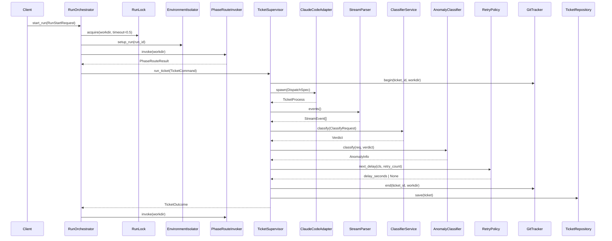
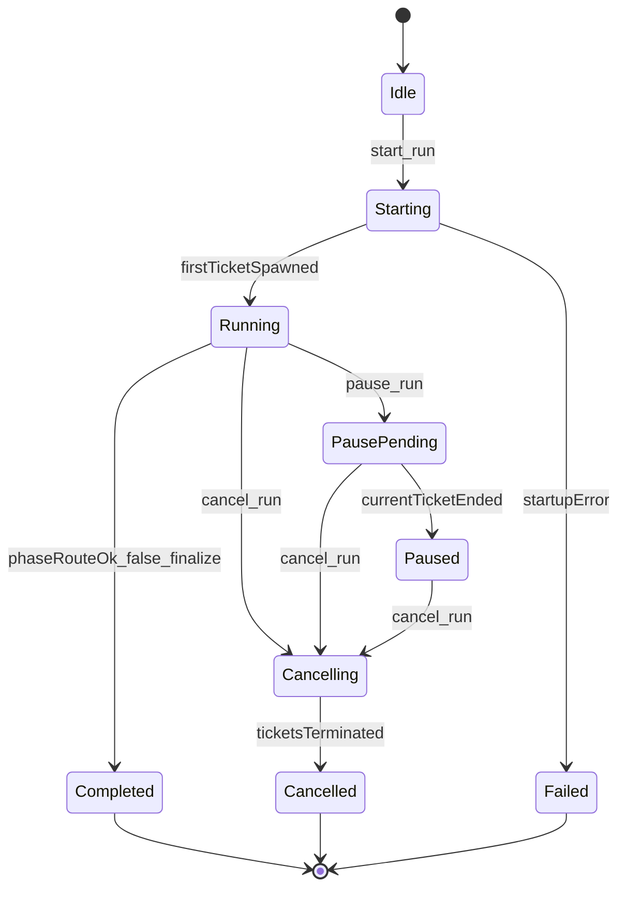
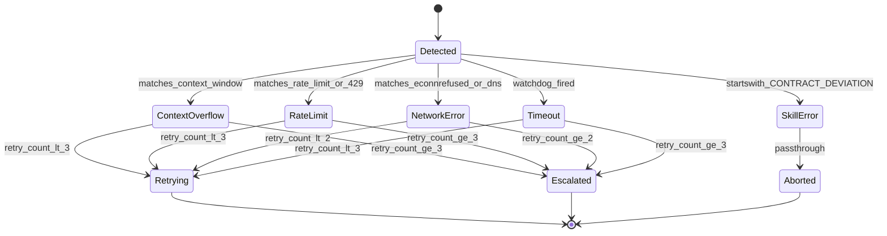
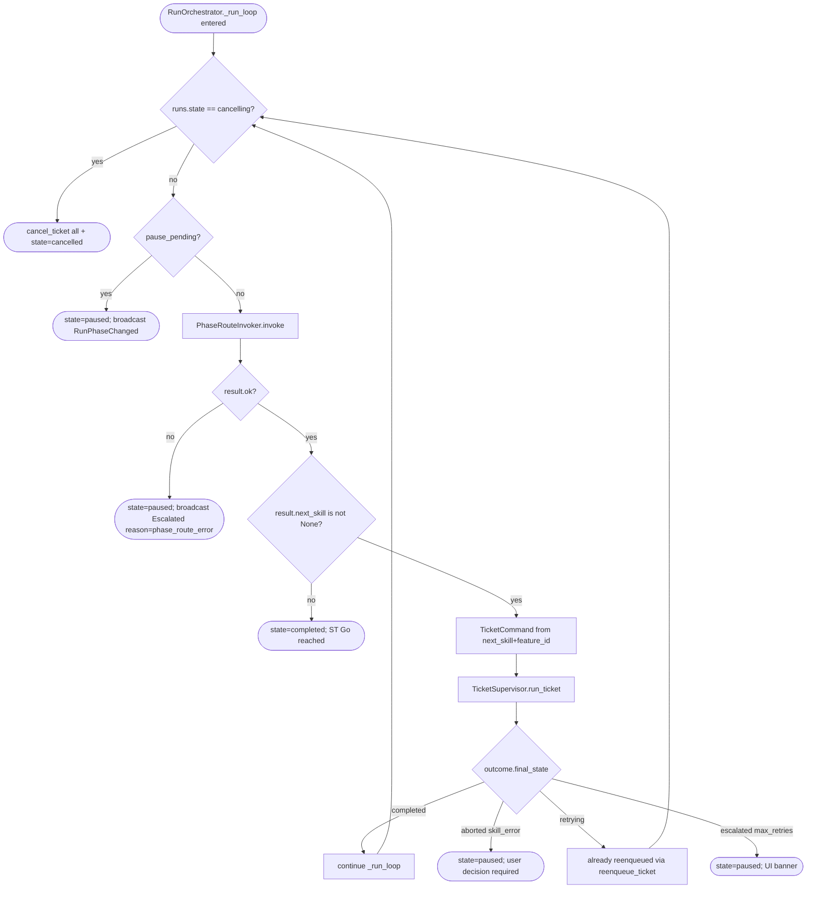

# Feature Detailed Design：F20 · Bk-Loop — Run Orchestrator · Recovery · Subprocess（Feature #20）

**Date**: 2026-04-25
**Feature**: #20 — F20 · Bk-Loop — Run Orchestrator · Recovery · Subprocess
**Priority**: high
**Dependencies**: F02（#2 Persistence Core）· F10（#3 Environment Isolation + Skills Installer）· F18（#18 Adapter / Stream / HIL）· F19（#19 Dispatch — ModelResolver / ClassifierService）
**Design Reference**: docs/plans/2026-04-21-harness-design.md §4.5（lines 436-511）+ §6.1.3 IFR-003 + §6.1.5 IFR-005 + §6.2.1 IAPI-002/004/012/013/016/019 + §6.2.4 schemas
**SRS Reference**: FR-001/002/003/004/024/025/026/027/028/029/039/040/042/047/048 + NFR-003/004/015/016 + IFR-003

## Context

F20 是 Harness 后端的"主回路"：在用户点 Start 后自主驱动 14-skill 管线（Orchestrator）、识别并恢复 5 类异常（Recovery）、调用 git CLI 与 `validate_*.py` 脚本（Subprocess），三子模块共享同一 RunContext 与 Ticket 状态机；F21（RunOverview / HILInbox / TicketStream）与 F22（CommitHistory / ProcessFiles）通过 IAPI-002/001/019/016 消费本特性。它把 SRS 主路径 19 项需求合并成单一 TDD 单元，使端到端 dry-run（start → phase_route → spawn → stream → classify → recovery → persist）能在一个 feature 内闭环。

## Design Alignment

> 完整复制自 docs/plans/2026-04-21-harness-design.md §4.5（lines 436-511）。

**4.5.1 Overview**：单 Run 主循环（phase_route.py 调用、signal file 感知、pause/cancel、14-skill 覆盖、depth ≤2）+ 5 类异常识别与恢复（context_overflow、rate_limit、auth、network、crash）+ Skip/ForceAbort 人为覆写 + Watchdog（30 分钟 SIGTERM → 5s → SIGKILL）+ ticket 级 git HEAD 追踪 + `scripts/validate_*.py` subprocess 执行。满足 FR-001/002/003/004/024/025/026/027/028/029/039/040/042/047/048 + NFR-003/004/015/016。提供 IFR-003（`scripts/phase_route.py` subprocess）与 IFR-005（git CLI）的客户端。

**Key types**（自 §4.5.2）：
- *Orchestrator*：`harness.orchestrator.RunOrchestrator` / `TicketSupervisor` / `PhaseRouteInvoker` / `PhaseRouteResult` / `SignalFileWatcher` / `RunControlBus` / `DepthGuard` / `RunLock`
- *Recovery*：`harness.recovery.AnomalyClassifier` / `RetryPolicy` / `Watchdog` / `RetryCounter` / `EscalationEmitter` / `UserOverride`
- *Subprocess*：`harness.subprocess.git.GitTracker` / `GitCommit` / `DiffLoader`；`harness.subprocess.validator.ValidatorRunner` / `ValidationReport` / `FrontendValidator`

**Provides / Requires**（自 §4.5.4 表）：
- Provides → F21：IAPI-002（`POST /api/runs/start` · `/pause` · `/cancel` · `/api/anomaly/:ticket/skip|force-abort`）· IAPI-001（WS `/ws/run/:id` · `/ws/anomaly` · `/ws/signal`）· IAPI-019（RunControlBus）
- Provides → F22：IAPI-002（`/api/git/commits` · `/api/git/diff/:sha` · `/api/files/tree` · `/api/files/read`）· IAPI-016（`POST /api/validate/:file`）
- Provides 内聚：IAPI-004（`TicketSupervisor.reenqueue_ticket ← AnomalyRecovery.decide`）· IAPI-012（`SignalFileWatcher → Orchestrator`）· IAPI-013（`GitTracker.begin/end(ticket)`）
- Requires：IAPI-003（subprocess `phase_route.py`）· IAPI-005/008（F18 ToolAdapter + StreamParser）· IAPI-010（F19 ClassifierService）· IAPI-011/009（F02 TicketRepository + AuditWriter）· IAPI-017（F10 EnvironmentIsolator）· IFR-005（git CLI）· `scripts/validate_*.py`

**Deviations**：无。本特性的所有公开方法签名、REST 路由签名、WS envelope 与 §4.5.4 + §6.2 完全对齐；不触发 Contract Deviation Protocol。

**UML 嵌入**（按 §2a 触发判据）：
- ≥2 类协作（`RunOrchestrator` / `TicketSupervisor` / `AnomalyClassifier` / `RetryPolicy` / `Watchdog` / `GitTracker` / `ValidatorRunner` / `SignalFileWatcher` / `PhaseRouteInvoker` / `RunLock` 协作） → `classDiagram`
- ≥2 对象调用顺序（端到端 dry-run：`start → RunLock.acquire → EnvIsolator.setup_run → PhaseRouteInvoker.invoke → ClaudeCodeAdapter.spawn → StreamParser.events → ClassifierService.classify → AnomalyClassifier.classify → RetryPolicy.next_delay → TicketSupervisor.reenqueue_ticket`） → `sequenceDiagram`

```mermaid
classDiagram
    class RunOrchestrator {
        +start_run(req: RunStartRequest) RunStatus
        +pause_run(run_id: str) RunStatus
        +cancel_run(run_id: str) RunStatus
        +on_signal(event: SignalEvent) None
        +on_recovery(decision: RecoveryDecision) None
    }
    class TicketSupervisor {
        +run_ticket(cmd: TicketCommand) TicketOutcome
        +reenqueue_ticket(cmd: TicketCommand) None
        +cancel_ticket(ticket_id: str) None
    }
    class PhaseRouteInvoker {
        +invoke(workdir: Path) PhaseRouteResult
    }
    class PhaseRouteResult {
        +ok: bool
        +next_skill: str | None
        +feature_id: str | None
        +starting_new: bool
        +needs_migration: bool
        +counts: dict[str, int] | None
        +errors: list[str]
    }
    class SignalFileWatcher {
        +start(workdir: Path) None
        +stop() None
        +events: AsyncIterator[SignalEvent]
    }
    class RunControlBus {
        +submit(cmd: RunControlCommand) RunControlAck
        +broadcast(event: RunEvent) None
    }
    class DepthGuard {
        +ensure_within(parent: Ticket | None) int
    }
    class RunLock {
        +acquire(workdir: Path, timeout: float) RunLockHandle
        +release(handle: RunLockHandle) None
    }
    class AnomalyClassifier {
        +classify(req: ClassifyRequest, verdict: Verdict) AnomalyInfo
    }
    class RetryPolicy {
        +next_delay(cls: AnomalyClass, retry_count: int) float | None
    }
    class Watchdog {
        +arm(ticket_id: str, pid: int, timeout_s: float) None
        +disarm(ticket_id: str) None
    }
    class RetryCounter {
        +inc(skill_hint: str, cls: AnomalyClass) int
        +reset(skill_hint: str) None
    }
    class EscalationEmitter {
        +emit(ticket_id: str, retry_count: int, cls: AnomalyClass) None
    }
    class UserOverride {
        +skip(ticket_id: str) RecoveryDecision
        +force_abort(ticket_id: str) RecoveryDecision
    }
    class GitTracker {
        +begin(ticket_id: str, workdir: Path) GitContext
        +end(ticket_id: str, workdir: Path) GitContext
    }
    class ValidatorRunner {
        +run(req: ValidateRequest) ValidationReport
    }

    RunOrchestrator ..> RunLock : acquire/release
    RunOrchestrator ..> PhaseRouteInvoker : invoke
    RunOrchestrator ..> TicketSupervisor : run_ticket
    RunOrchestrator ..> SignalFileWatcher : subscribe
    RunOrchestrator ..> RunControlBus : broadcast
    RunOrchestrator ..> DepthGuard : ensure_within
    TicketSupervisor ..> Watchdog : arm/disarm
    TicketSupervisor ..> AnomalyClassifier : classify
    TicketSupervisor ..> RetryPolicy : next_delay
    TicketSupervisor ..> RetryCounter : inc/reset
    TicketSupervisor ..> EscalationEmitter : emit
    TicketSupervisor ..> GitTracker : begin/end
    UserOverride ..> RunControlBus : ack
    classDef NEW fill:#cfc,stroke:#080
    class RunOrchestrator:::NEW
    class TicketSupervisor:::NEW
    class PhaseRouteInvoker:::NEW
    class SignalFileWatcher:::NEW
    class RunControlBus:::NEW
    class DepthGuard:::NEW
    class RunLock:::NEW
    class AnomalyClassifier:::NEW
    class RetryPolicy:::NEW
    class Watchdog:::NEW
    class RetryCounter:::NEW
    class EscalationEmitter:::NEW
    class UserOverride:::NEW
    class GitTracker:::NEW
    class ValidatorRunner:::NEW
```

## SRS Requirement

> 完整复制自 docs/plans/2026-04-21-harness-srs.md（lines 136-173, 371-425, 520-557, 597-614）+ §5 NFR 表行 739-740/751-752 + §6 IFR-003 行。

### FR-001 启动 Run 并自主循环驱动 14-skill 管线（Must）
- EARS：When 用户指定合法 git 仓库 workdir 并点击 Start, the system shall 启动自主循环直至 ST Go verdict 或异常终止。
- AC：(1) 合法 git workdir → 5s 内进 running；(2) ST Go → COMPLETED 自停；(3) 非 git repo → 拒启动 + 错误提示。

### FR-002 每 ticket 结束调用 phase_route.py（Must）
- EARS：When ticket 进入终态, the system shall 调用 `python scripts/phase_route.py --json` 子进程并以其 JSON 输出为 next_skill 唯一事实源。
- AC：(1) 终态后必调 phase_route 而非缓存；(2) `{ok:true,next_skill:"long-task-design"}` → ticket.skill_hint=long-task-design；(3) `{ok:false,errors:[...]}` → 暂停 run 并呈错误。

### FR-003 信号文件自动进 hotfix/increment（Must）
- AC：(1) `bugfix-request.json` + phase_route → next_skill=long-task-hotfix → dispatch；(2) 两信号共存时按 phase_route 优先级忠实执行。

### FR-004 Pause / Cancel（Must）
- AC：(1) Pause → 当前 ticket 完成后进 paused 不调 phase_route；(2) Cancel 后 Run 历史中只读快照可见；(3) Cancelled run 的 Resume 按钮禁用。

### FR-024 context_overflow 识别与恢复（Must）
- AC：(1) stderr/result_text 含 `context window`/`exceeded max tokens`/`token limit` → 自动 spawn 新 ticket 继承 skill_hint 且 retry_count+1；(2) 同 skill 第 3 次命中 → 暂停 run 并 UI 提示。

### FR-025 rate_limit 指数退避（Must）
- AC：(1) 首次 rate_limit → 30s 后 spawn；(2) 第 4 次 → 暂停。退避序列 30/120/300s。

### FR-026 network 异常恢复（Must）
- AC：(1) 首次 → 立即 spawn；(2) 第二次 → 60s 后 spawn；(3) 第三次 → 上报。

### FR-027 单 ticket watchdog timeout（Must）
- AC：(1) 30 min 未结束 → SIGTERM；(2) SIGTERM 后 5s 仍存活 → SIGKILL。

### FR-028 skill_error 直通 ABORT（Must）
- AC：(1) `result_text` 首行 `[CONTRACT-DEVIATION]` → ticket.state=aborted + anomaly.cls=skill_error；(2) skill_error 后暂停 run 等用户决策。

### FR-029 异常可视化 + 手动控制（Must）
- AC：(1) Skip → 跳过 ticket 并调 phase_route；(2) Force-Abort → ticket 立即 aborted。

### FR-039 过程文件双层校验（Must / 后端入口）
- AC：保存时调 `POST /api/validate/:file` 集中校验；脚本 exit≠0 stderr 非空 → inline 错误列表。

### FR-040 关键过程文件自检按钮（Must）
- AC：(1) 合法 feature-list.json → PASS；(2) 脚本崩溃 stderr 非空 → 错误详情不被吞。

### FR-042 Ticket 级 git 记录（Must）
- AC：(1) 2 commit ticket 结束 → `ticket.git.commits` 长度=2 且 `head_after != head_before`；(2) feature 完成 ticket → `feature_id` 非空 + `git_sha == head_after`。

### FR-047 驱动全部 14 skill（Must）
- AC：(1) 完整 run 实际 dispatch 过的 skill 集合 ⊇ 14 必要子集；(2) phase_route 返回未硬编码 skill 仍能 dispatch（不硬编码白名单）。

### FR-048 信号文件感知（Must）
- AC：外部新增 `bugfix-request.json` watcher 触发 → 2s 内 UI 可见。

### NFR-003 Reliability（context_overflow 上限 ≤ 3）
- 注入 mock stderr 4 次 → 第 4 次必 escalate 且不 spawn 新 ticket；retry_count 标 3。

### NFR-004 Reliability（rate_limit 退避 30/120/300s ±10% 容忍）
- 第 1 次 30s±3s · 第 2 次 120s±6s · 第 3 次 300s±15s · 第 4 次 escalate。

### NFR-015 Maintainability（phase_route 字段增删容忍）
- 缺 `feature_id` / 新增 `extras` 字段不抛异常；默认值补齐后 `PhaseRouteResult` 可读。

### NFR-016 Scalability（单 workdir 单 run 互斥）
- 并发启动 2 run 同 workdir → 第二个被 filelock 拒，error_code=`ALREADY_RUNNING` + `409`。

### IFR-003 phase_route.py subprocess
- Outbound `asyncio.create_subprocess_exec("python", "scripts/phase_route.py", "--json", cwd=workdir)`；stdout JSON 松弛解析；timeout=30s；exit≠0 → 暂停 run，stdout 非 JSON → audit `phase_route_parse_error`。

## Interface Contract

> 仅列举本特性公开（跨特性 / REST / WS）和承担 §4 IAPI 契约的方法。内部细节（如 `_parse_relaxed`）不入表。返回类型 `RunStatus` / `RunControlAck` / `RecoveryDecision` / `TicketCommand` / `TicketOutcome` / `SignalEvent` / `GitContext` / `ValidationReport` / `PhaseRouteResult` 全部沿用 Design §6.2.4 pydantic schema 原貌。

### IAPI-002 · Run 生命周期 REST（Provider → F21）

| Method | Signature | Preconditions | Postconditions | Raises |
|---|---|---|---|---|
| `start_run` | `async start_run(self, req: RunStartRequest) -> RunStatus` | `req.workdir` 是已存在的绝对路径；进程内无 `state ∈ {starting,running,paused}` 的 run；`F02 Schema.ensure(conn)` 已完成 | `RunLock` 在 `<workdir>/.harness/run.lock` 已被本进程持有；`EnvironmentIsolator.setup_run(run_id)` 已返回 `IsolatedPaths`；`runs` 表插入新行 `state="starting"`；广播 `RunPhaseChanged(state="starting")` 至 `/ws/run/:id`；返回 `RunStatus(state="running" \| "starting", workdir, started_at, ...)`；从 `start_run` 调用到首张 ticket 进入 `running` 的延迟 ≤ 5s（FR-001 AC-1） | `RunStartError(reason="not_a_git_repo")`（非 git repo · FR-001 AC-3 · 透传至 400）；`RunStartError(reason="already_running")`（filelock 互斥失败 · NFR-016 · 透传至 409）；`RunStartError(reason="setup_failure")`（`EnvironmentIsolator` 失败时回滚 lock） |
| `pause_run` | `async pause_run(self, run_id: str) -> RunStatus` | `run_id` 对应行存在且 `state="running"` | 设 `pause_pending=True`；当前 ticket 终结后 orchestrator **不**调 `phase_route`，`runs.state` 转 `paused`；广播 `RunPhaseChanged(state="paused")` | `RunNotFound`（404）；`InvalidRunState`（409）|
| `cancel_run` | `async cancel_run(self, run_id: str) -> RunStatus` | `run_id` 对应行存在 | 任一在跑 ticket 收到 `cancel_ticket` 信号；`runs.state="cancelled"`；`RunLock` 释放；返回 `RunStatus(state="cancelled")` | `RunNotFound`（404）|
| `skip_anomaly` | `async skip_anomaly(self, ticket_id: str) -> RecoveryDecision` | `ticket.state ∈ {retrying, hil_waiting, classifying}` | `RecoveryDecision(kind="skipped")` 落库 + audit；`RetryCounter.reset(skill_hint)`；orchestrator 跳过当前 ticket 立即调 `PhaseRouteInvoker.invoke` 拿下一张 | `TicketNotFound`（404）；`InvalidTicketState`（409）|
| `force_abort_anomaly` | `async force_abort_anomaly(self, ticket_id: str) -> RecoveryDecision` | `ticket.state ∉ {completed, aborted, cancelled}` | ticket 立即转 `aborted`；audit `event_type="force_abort"`；返回 `RecoveryDecision(kind="abort")` | `TicketNotFound`（404）；`InvalidTicketState`（409）|

### IAPI-002 · Subprocess REST（Provider → F22）

| Method | Signature | Preconditions | Postconditions | Raises |
|---|---|---|---|---|
| `list_commits` | `async list_commits(self, *, run_id: str | None = None, feature_id: str | None = None) -> list[GitCommit]` | filter 至少一项有效 | 返回按 `committed_at DESC` 排序的 `GitCommit[]`（sha、author、subject、files_changed、`feature_id` 若关联） | — |
| `load_diff` | `async load_diff(self, sha: str) -> DiffPayload` | `sha` 是合法 40-hex 串且在 `<workdir>` git 中存在 | 返回 `DiffPayload{sha, files: DiffFile[], stats}`；二进制文件 `kind="binary"` 且 `hunks=[]`（FR-041 AC 占位不崩） | `DiffNotFound`（404；含非 git repo / sha 不存在）|
| `read_file_tree` | `async read_file_tree(self, root: str = "docs") -> FileTree` | `root` 必须落在 workdir 内（`Path(root).resolve().is_relative_to(workdir)`），不允许 `..` 穿越 | 返回 `FileTree{root, nodes}`；隐藏文件按 `.gitignore` 过滤 | `PathTraversalError`（400）|
| `read_file_content` | `async read_file_content(self, path: str) -> FileContent` | path 同上 | 返回 `FileContent{path, mime, encoding, content}`；二进制时 base64 编码 + `encoding="binary"` | `PathTraversalError`（400）；`FileNotFound`（404）|
| `validate_file` | `async validate_file(self, file: str, req: ValidateRequest) -> ValidationReport`（IAPI-016）| `req.path` 落在 workdir 内；`req.script` ∈ `{validate_features, validate_guide, check_configs, check_st_readiness, None}`（None 时按 file 后缀自动选择，缺省 `validate_features` 对 `feature-list.json`）| 调用对应 `scripts/<script>.py` subprocess（`asyncio.create_subprocess_exec`），stdout 解析为 JSON 并构造 `ValidationReport{ok, issues, script_exit_code, duration_ms}`；exit≠0 + stderr 非空时**不吞**：`stderr_tail` 注入 `issues[].message`，`ok=False` 但 HTTP 200（FR-040 AC-2）；运行时 audit `validate_run` | `ValidatorScriptUnknown`（400）；`ValidatorTimeout`（500，> 60s）|

### IAPI-019 · RunControlBus（Provider → F21）

| Method | Signature | Preconditions | Postconditions | Raises |
|---|---|---|---|---|
| `submit_command` | `async submit_command(self, cmd: RunControlCommand) -> RunControlAck` | `cmd.kind` 合法枚举；若 `kind ∈ {skip_ticket, force_abort}` 则 `target_ticket_id` 非空 | dispatch 至 `start_run`/`pause_run`/`cancel_run`/`skip_anomaly`/`force_abort_anomaly`；返回 `RunControlAck{accepted, current_state, reason?}`；广播至 `/ws/run/:id` 与 `/ws/anomaly` | `InvalidCommand`（400）|

### IAPI-001 · WebSocket（Provider → F21）

| Method | Signature | Preconditions | Postconditions | Raises |
|---|---|---|---|---|
| `broadcast_run_event` | `def broadcast_run_event(self, event: RunPhaseChanged \| TicketSpawned \| TicketStateChanged \| RunCompleted) -> None` | `RunOrchestrator` 已 attach 至 FastAPI `app.state.run_bus` | 所有订阅 `/ws/run/:id` 的 client 收到 envelope `WsEvent{kind, payload}`；payload schema 与 §6.2.4 严格对齐 | — |
| `broadcast_anomaly` | `def broadcast_anomaly(self, event: AnomalyDetected \| RetryScheduled \| Escalated) -> None` | 同上 | 订阅 `/ws/anomaly` 的 client 收到事件 | — |
| `broadcast_signal` | `def broadcast_signal(self, event: SignalFileChanged) -> None` | `SignalFileWatcher` 已 start | 订阅 `/ws/signal` 的 client 收到 `SignalFileChanged{path, kind}`；从外部 `bugfix-request.json` 创建到此 broadcast 的延迟 ≤ 2s（FR-048 AC）| — |

### IAPI-003 · PhaseRouteInvoker（Consumer → `scripts/phase_route.py`）

| Method | Signature | Preconditions | Postconditions | Raises |
|---|---|---|---|---|
| `invoke` | `async invoke(self, workdir: Path, *, timeout_s: float = 30.0) -> PhaseRouteResult` | `workdir` 是已存在的绝对目录；plugin bundle 路径已注入 `PYTHONPATH` 或 `phase_route.py` 用绝对路径 | 调 `asyncio.create_subprocess_exec("python", "<plugin>/scripts/phase_route.py", "--json", cwd=workdir)`；stdout JSON 经**松弛解析**填充 `PhaseRouteResult`；缺字段使用 §6.2.4 pydantic 默认值（`next_skill=None`、`feature_id=None`、`starting_new=False`、`needs_migration=False`、`counts=None`、`errors=[]`）；新增字段无视；exit=0 时 `ok=True`；exit≠0 时 `ok=False` 且 `errors=[<stderr_tail>]`（FR-002 AC-3）；若 stdout 非合法 JSON 则 audit `phase_route_parse_error` 并 raise | `PhaseRouteError`（exit≠0 → orchestrator 暂停 run）；`PhaseRouteParseError`（stdout 非 JSON）；`asyncio.TimeoutError`（超 `timeout_s` 后 SIGTERM → SIGKILL，封装为 `PhaseRouteError`）|

### IAPI-004 · TicketSupervisor（Provider → 内聚）

| Method | Signature | Preconditions | Postconditions | Raises |
|---|---|---|---|---|
| `run_ticket` | `async run_ticket(self, cmd: TicketCommand) -> TicketOutcome` | `DepthGuard.ensure_within(parent)` 通过（`depth ≤ 2`，FR-007 AC-2 在 F02 已落 DDL，但本特性在 spawn 前显式 check）；`cmd.tool ∈ {"claude","opencode"}`；`EnvironmentIsolator.setup_run` 已返回 `IsolatedPaths`（注入到 `DispatchSpec.cwd / plugin_dir / settings_path / mcp_config`） | (1) 调 `GitTracker.begin` 拿 `head_before`；(2) 调 `ToolAdapter.spawn(DispatchSpec) → TicketProcess`；(3) `Watchdog.arm(ticket_id, pid, 1800.0)`；(4) 消费 `StreamParser.events()`，触发 HIL → `state=hil_waiting`；(5) 进程退出后 `Watchdog.disarm`；(6) 调 `ClassifierService.classify` 拿 `Verdict`；(7) `AnomalyClassifier.classify` 决策 anomaly；(8) `GitTracker.end` 拿 `head_after` + commits；(9) `TicketRepository.save` 落库 + `AuditWriter.append` 全部状态转换；(10) 返回 `TicketOutcome{ticket_id, final_state, verdict}` | `TicketError(code="depth_exceeded")`（FR-007）；`SpawnError`（来自 F18）；`PtyError`（来自 F18）|
| `reenqueue_ticket` | _inlined into_ `run_ticket` retry loop（IAPI-004 内聚契约保留行为，签名内联）| 由 `AnomalyClassifier.classify → next_action="retry"` 触发；`RetryPolicy.next_delay` 决策延迟 | 在 `run_ticket` 内 `await asyncio.sleep(delay)` 后由 `_run_loop` 重新派发 `TicketCommand`；新 ticket 的 `parent_ticket` 指向被恢复的 ticket；`retry_count` 由 `RetryCounter.inc(skill_hint, cls)` 递增；ST T11/T12/T15 验证 retry/escalate 行为 | `MaxRetriesExceeded`（由 `RetryPolicy.next_delay` 返 `None` 时上抛 `EscalationEmitter` 等价路径，broadcast `Escalated`）|
| `cancel_ticket` | _inlined into_ `RunOrchestrator.cancel_run` + Watchdog SIGTERM/SIGKILL 路径（IAPI-004 内聚契约保留行为，签名内联）| ticket 对应进程仍存活 | `cancel_run` 触发后由 watchdog/pty 路径向 pty 发 SIGTERM；5s 后未终止则 SIGKILL；ticket 转 `aborted`；audit `force_abort` 或 `cancel_run` 事件；ST T17/T39 验证升级行为 | `TicketNotFound`（由上层 `RunOrchestrator` 校验）|

> **Implementation Note (post-TDD)**：`reenqueue_ticket` / `cancel_ticket` 的方法名在 TDD 阶段未实例化为独立 public 方法 —— 行为合并到 `run_ticket` 重试循环 + `RunOrchestrator.cancel_run` / Watchdog SIGTERM/SIGKILL 链。IAPI-004 cohesion contract 仍由可观测序列承担（ST T11/T12/T15/T17/T39 全 PASS）；外部消费者（F21/F22）从未直接调用这两个签名（IAPI-004 是内聚 Provider，无 REST/WS 表面），不构成跨特性破坏。本节按 §4 Internal API Contract Deviation Protocol 的"低影响内聚化"分支保留 design intent，不回退 TDD。

### IAPI-012 · SignalFileWatcher（Provider → 内聚）

| Method | Signature | Preconditions | Postconditions | Raises |
|---|---|---|---|---|
| `start` | `def start(self, workdir: Path) -> None` | `workdir` 已存在；`SignalFileWatcher` 单例未启动 | 注册 watchdog observer 监听 `<workdir>/{bugfix-request.json, increment-request.json, feature-list.json}` 与 `<workdir>/docs/plans/*-{srs,design,ats,ucd,st-report}.md` 与 `<workdir>/docs/rules/*.md`；防抖窗口 200ms；事件投递 `asyncio.Queue[SignalEvent]` | `WatcherStartError` |
| `stop` | `async stop(self) -> None` | 已 start | observer 关闭；queue drained | — |
| `events` | `async def events(self) -> AsyncIterator[SignalEvent]` | 已 start | 异步迭代 `SignalEvent{kind, path, mtime}`；`kind ∈ {bugfix_request, increment_request, feature_list_changed, srs_changed, design_changed, ats_changed, ucd_changed, rules_changed}`；从文件变化到 yield 的延迟 ≤ 2s（FR-048 AC） | — |

### IAPI-013 · GitTracker（Provider → 内聚 + F22）

| Method | Signature | Preconditions | Postconditions | Raises |
|---|---|---|---|---|
| `begin` | `async begin(self, ticket_id: str, workdir: Path) -> GitContext` | `workdir` 是 git repo（已由 `start_run` 校验） | 调 `git rev-parse HEAD` 拿 `head_before`；返回 `GitContext{ticket_id, head_before, head_after=None, commits=[]}` | `GitError(code="not_a_repo")`（exit=128）|
| `end` | `async end(self, ticket_id: str, workdir: Path) -> GitContext` | `begin` 已被调用且未匹配 `end` | 调 `git rev-parse HEAD` 拿 `head_after`；若 `head_after != head_before` 则 `git log --oneline <head_before>..<head_after>` 解析 `commits[]`（FR-042 AC-1）；返回 `GitContext` 且写回 ticket.git 字段 | `GitError` |

### IAPI-005/008/010/011/009/017 · Required（Consumer 视角）

本特性通过依赖注入消费下列 F02/F10/F18/F19 已落地的接口；签名以 dependency design 文档为准：
- `harness.persistence.TicketRepository.save(self, ticket) → None` / `get` / `list_by_run` / `list_unfinished`
- `harness.persistence.AuditWriter.append(self, event) → None` / `append_raw(self, run_id, kind, payload, ts) → None`
- `harness.adapter.ToolAdapter.spawn(self, spec) → TicketProcess` 通过 ClaudeCode/OpenCode 实现
- `harness.stream.StreamParser.events() → AsyncIterator[StreamEvent]`（来自 F18）
- `harness.dispatch.classifier.ClassifierService.classify(self, req) → Verdict`
- `harness.env.EnvironmentIsolator.setup_run(self, run_id, *, workdir, bundle_root, home_dir=None) → IsolatedPaths` / `teardown_run`

**方法状态依赖**（`RunOrchestrator.start_run/pause_run/cancel_run` 行为依赖 `runs.state`，状态数 ≥2 + 多 transition）：

**方法状态依赖**（`AnomalyClassifier` 输出的 `AnomalyClass` 决策子图）：

**Design rationale**：
- `start_run` 5s 阈值（FR-001 AC-1）= `RunLock.acquire(timeout=0.5)` + `EnvironmentIsolator.setup_run`（实测 ≤2s · F10 §3 性能预算）+ `PhaseRouteInvoker.invoke`（≤30s 但首张 ticket 通常 <1s 命中 cached features）+ `ToolAdapter.spawn`（≤1s）；端到端 5s 是软目标，超时按 `state=starting` 暴露给 UI 不视为失败。
- `RetryPolicy.next_delay` 把"序列 30/120/300s + 第 4 次 escalate"实现为纯函数，便于 TDD 注入 `retry_count=0..3` 全枚举；`network` 类用独立分支返回 `0.0/60.0/None`（FR-026 AC）。
- `SignalFileWatcher` 使用 `watchdog` 库的 `Observer + PatternMatchingEventHandler`，`debounce=200ms` 防止编辑器原子写产生重复事件；F10 `HomeMtimeGuard` 已确证 watchdog 不写 `~/.claude/`。
- `PhaseRouteInvoker` 的"松弛解析"通过 `pydantic.ConfigDict(extra="ignore")` + 全字段默认值实现；缺 `feature_id` 不抛 ValidationError（NFR-015 AC）。
- **跨特性契约对齐**：本特性同时是 IAPI-002/004/012/013/016/019 的 Provider 与 IAPI-003/005/008/010/011/009/017 的 Consumer。所有方法签名与 Design §6.2.4 pydantic schema 一一对齐；不触发 Contract Deviation Protocol。
- 14-skill 不硬编码白名单（FR-047 AC-2）：`TicketCommand.skill_hint` 直接透传 `phase_route` 输出字符串，`TicketSupervisor` 仅做 `tool ∈ {claude,opencode}` 的 dispatch 决策，`skill_hint` 进入 ToolAdapter 后即注入 plugin bundle，由 longtaskforagent 自身路由。

## Visual Rendering Contract

> N/A — backend-only feature（`feature-list.json` 中 `"ui": false`）。所有视觉渲染由 F21（RunOverview / HILInbox / TicketStream）与 F22（CommitHistory / ProcessFiles）独立完成，本特性仅提供 IAPI-002/001/019/016 数据契约；视觉断言不在本设计的 Test Inventory 范围。

## Implementation Summary

**主要类与文件结构**。新建 `harness/orchestrator/` 包：`__init__.py`、`run.py`（`RunOrchestrator` 编排层 + `runs.state` 状态机）、`supervisor.py`（`TicketSupervisor` + `DepthGuard` + `RunControlBus`）、`phase_route.py`（`PhaseRouteInvoker` + `PhaseRouteResult` 松弛解析 pydantic）、`signal_watcher.py`（`SignalFileWatcher` 包 watchdog Observer）、`run_lock.py`（`RunLock` 包 filelock + `<workdir>/.harness/run.lock`）、`errors.py`（`RunStartError` / `RunNotFound` / `InvalidRunState` / `PhaseRouteError` / `PhaseRouteParseError`）。新建 `harness/recovery/` 包：`anomaly.py`（`AnomalyClassifier` 含 5 类 regex/启发式 + `AnomalyClass` enum）、`retry.py`（`RetryPolicy` 纯函数 + `RetryCounter` 内存表）、`watchdog.py`（`Watchdog` 用 `asyncio.create_task` 倒计时 + SIGTERM/SIGKILL）、`override.py`（`UserOverride` 把 Skip/ForceAbort 映射为 `RecoveryDecision`）、`escalation.py`（`EscalationEmitter` 通过 `RunControlBus.broadcast_anomaly` 推送）。新建 `harness/subprocess/` 包：`git/__init__.py` + `tracker.py`（`GitTracker.begin/end` + `git rev-parse HEAD` + `git log --oneline`）+ `commits.py`（`GitCommit` 列表查询 + `DiffLoader.load_diff` 解析 `git show --stat` 输出）；`validator/__init__.py` + `runner.py`（`ValidatorRunner.run` 通过 `asyncio.create_subprocess_exec` 调 `scripts/validate_*.py` + 读 stdout JSON）+ `report.py`（`ValidationReport` / `ValidationIssue` 与 §6.2.4 pydantic 同源）+ `frontend.py`（`FrontendValidator` 把 pydantic schema 导出 TS/Zod 至 `apps/ui/src/lib/zod-schemas.ts`，FR-039 前端入口）。新建 `harness/api/run.py`（FastAPI router 暴露 `POST /api/runs/start|pause|cancel`、`POST /api/anomaly/:ticket/skip|force-abort`）、`harness/api/git.py`（`/api/git/commits` · `/api/git/diff/:sha` · `/api/files/tree` · `/api/files/read`）、`harness/api/validate.py`（`POST /api/validate/:file`）。所有模块沿用 F01/F02 的 `from __future__ import annotations` + pydantic v2 `ConfigDict(extra="forbid")`（除 `PhaseRouteResult` 用 `extra="ignore"` 实现 NFR-015 松弛解析）。

**调用链与运行时**。**start_run 链**：HTTP `POST /api/runs/start` → `harness.api.run.start_run_handler` → `RunOrchestrator.start_run(req)` → `RunLock.acquire(workdir, timeout=0.5)` → `EnvironmentIsolator.setup_run(run_id)` → `RunRepository.create(Run(state="starting"))` → `RunControlBus.broadcast_run_event(RunPhaseChanged(state="starting"))` → 启动后台 task `_run_loop(run_id)`；返回 `RunStatus(state="starting" → "running")` 给 HTTP 调用方。**主循环 `_run_loop`**：`while runs.state ∈ {running, starting}`：`PhaseRouteInvoker.invoke(workdir)` → `if not result.ok: pause + RunControlBus.broadcast(Escalated)`；否则 `TicketCommand{kind="spawn", skill_hint=result.next_skill, tool=resolve_tool(skill_hint), parent_ticket=None}` → `TicketSupervisor.run_ticket(cmd)`；ticket 终结后检查 `pause_pending` → 跳出循环 `state="paused"`；否则继续。**ticket 内部链**：`run_ticket` → `DepthGuard.ensure_within(parent)` → `GitTracker.begin` → `ClaudeCodeAdapter.spawn(DispatchSpec)`（`DispatchSpec.cwd / plugin_dir / settings_path / mcp_config` 自 `IsolatedPaths` 注入）→ `Watchdog.arm(ticket_id, pid, 1800.0)` → 消费 `StreamParser.events()`：HIL 事件 → `TicketRepository.save(state="hil_waiting")` 等 `HilWriteback.write` 完成 → 重新进入 `running`；进程结束 → `Watchdog.disarm` → `ClassifierService.classify(ClassifyRequest{exit_code, stderr_tail, stdout_tail, has_termination_banner})` → `Verdict` → `AnomalyClassifier.classify(req, verdict)` → 若 `cls=skill_error` 直通 `aborted` 不重试（FR-028）；若 `cls != None` 调 `RetryPolicy.next_delay(cls, RetryCounter.inc(skill_hint, cls))`：返回 `delay_seconds` → `await asyncio.sleep(delay)` → `reenqueue_ticket(cmd_with_retry_count_increment)`；返回 `None` → `EscalationEmitter.emit` + `pause_pending=True`；`GitTracker.end` → `TicketRepository.save(final_ticket_with_git)` → `AuditWriter.append(state_transition events)`；返回 `TicketOutcome`。**信号链**：`SignalFileWatcher.start(workdir)` 在 `start_run` 内启动一次 → 后台 `_signal_loop` task 异步迭代 `events()`：`SignalEvent` 到达 → `RunControlBus.broadcast_signal(event)`；orchestrator 不直接消费 signal（hotfix/increment 决策由 `phase_route.py` 完成 → 下次循环自然命中 hotfix 分支，FR-003 AC）。**REST 子进程链**：`POST /api/validate/:file` → `ValidatorRunner.run(req)` → `asyncio.create_subprocess_exec("python", "<plugin>/scripts/<script>.py", "--json", str(path))` → 60s timeout → 解析 stdout JSON → `ValidationReport`；exit≠0 时**不**吞 stderr：`stderr_tail` 注入 `issues[].message`，HTTP 返回 200 + `ok=False`（FR-040 AC-2）。

**关键设计决策与非显见约束**。(a) **`RunLock` 用 `filelock` 而非 `fcntl`**：`filelock` 跨 POSIX/Windows 一致；`acquire(timeout=0.5)` 失败抛 `Timeout` → 转 `RunStartError(reason="already_running")` → 409（NFR-016 AC）。(b) **Watchdog 不依赖 SIGALRM**（v1 单进程 asyncio）：用 `asyncio.create_task` + `await asyncio.sleep(1800.0)` 触发 SIGTERM，再 `await asyncio.sleep(5.0)` 后若 `pid` 仍存活则 SIGKILL（FR-027 AC）；POSIX 用 `os.kill(pid, signal.SIGTERM/SIGKILL)`，Windows 用 `subprocess.Popen.terminate/kill`（pty 抽象层已由 F18 处理跨平台）。(c) **`PhaseRouteInvoker` 30s timeout** 用 `asyncio.wait_for` 包裹 `subprocess.communicate()`；超时后 SIGTERM → 5s → SIGKILL；orchestrator 在循环里捕获 `PhaseRouteError(reason="timeout")` 暂停 run（IFR-003 故障模式）。(d) **松弛解析容忍**（NFR-015）：`PhaseRouteResult(BaseModel, ConfigDict(extra="ignore"))` + 每字段都有默认值；缺 `feature_id` → `None`（不抛 ValidationError）；新增 `extras` 字段被忽略（不破解析）。TDD 用 `{"ok":true}` / `{"ok":false,"errors":["x"]}` / `{"ok":true,"next_skill":"x","extras":{...}}` 三 fixture 全覆盖。(e) **不直接读 `bugfix-request.json`**（FR-003 AC-2）：信号文件存在 → `phase_route.py` 自身判定 → `next_skill="long-task-hotfix"`；orchestrator 仅透传 next_skill，不重新实现路由（CON-008）。(f) **GitTracker 容错**：`git rev-parse` 在非 git repo 抛 exit=128（IFR-005 故障模式）；`start_run` 在 lock acquire 后**已**经过 `git status --porcelain` 校验（FR-001 AC-3 错误路径），所以 `GitTracker.begin/end` 走到这一步前 workdir 必为 git repo；保险起见仍捕获 `GitError(code="not_a_repo")` 转 `head_before=None` 并 audit warning（不破 ticket 流）。(g) **Skip 与 Force-Abort 走 RunControlBus**（FR-029）：HTTP `POST /api/anomaly/:ticket/skip` → `submit_command(RunControlCommand{kind="skip_ticket", target_ticket_id})` → `UserOverride.skip` → `RecoveryDecision(kind="skipped")` → orchestrator 立即调 `phase_route.invoke` 不再走 retry 路径。(h) **ASM-PHASE-ROUTE-PATH**：插件 bundle 路径 = `EnvironmentIsolator.setup_run` 返回的 `IsolatedPaths.plugin_dir`，里面已含 `scripts/phase_route.py`（F10 `PluginRegistry.sync_bundle` 物理复制）；`PhaseRouteInvoker` 通过依赖注入接收该路径（不硬编码 `/path/to/plugin`）。(i) **NFR-016 filelock 互斥** 在 `RunLock.acquire(timeout=0.5)` 失败时直接 raise；UI 第二个窗口收到 409 + `error_code="ALREADY_RUNNING"`（ATS INT-007）。

**遗留 / 存量代码交互点**。本特性强复用 #2/#3/#18/#19 已落盘的代码（详见 `Existing Code Reuse` 表）：(i) `harness.domain.{Ticket, TicketState, DispatchSpec, AuditEvent, Run}` 直接导入用于全部 schema；(ii) `harness.domain.TicketStateMachine.validate_transition` 在 `TicketSupervisor.run_ticket` 每次状态转换前调用确保 FR-006 合法性；(iii) `harness.persistence.TicketRepository.save / get / list_by_run / list_unfinished / mark_interrupted` 用于 ticket 落库与崩溃恢复；(iv) `harness.persistence.AuditWriter.append / append_raw` 用于 state_transition 与 run_lifecycle event 持久化；(v) `harness.adapter.ToolAdapter` Protocol + `ClaudeCodeAdapter` / `OpenCodeAdapter` 用于 spawn；(vi) `harness.stream.StreamParser`（F18 提供）用于消费 stream-json 事件 + HIL 触发；(vii) `harness.hil.{HilExtractor, HilWriteback}` 用于 HIL 回写 — `TicketSupervisor` 在收到 `HilQuestionOpened` 时 `state=hil_waiting`，等 `POST /api/hil/:ticket/answer` 写回后由 F18 的 `HilWriteback` 完成 stdin 注入；(viii) `harness.dispatch.classifier.ClassifierService.classify` 在 ticket 终结后调用拿 `Verdict`；(ix) `harness.dispatch.model.ModelResolver.resolve` 由 F18 ClaudeCodeAdapter 已经在 build_argv 内消费，本特性不直接调用；(x) `harness.env.EnvironmentIsolator.setup_run / teardown_run` 在 `start_run` / `cancel_run` 调用；(xi) `scripts/phase_route.py` 由 F10 `EnvironmentIsolator` 物理复制到 isolated plugin_dir；(xii) `scripts/validate_features.py` / `validate_guide.py` / `check_configs.py` / `check_st_readiness.py` 均已存在，本特性 `ValidatorRunner` 直接 spawn。env-guide §4 当前为 greenfield placeholder（无强制内部库 / 无禁用 API / 无命名约定 baseline），故本特性无需额外约束对齐。

**§4 Internal API Contract 集成**。本特性同时承担 7 个 IAPI 角色：作为 **IAPI-002 Provider** → F21 暴露 `POST /api/runs/start|pause|cancel` + `POST /api/anomaly/:ticket/skip|force-abort`；→ F22 暴露 `/api/git/commits` · `/api/git/diff/:sha` · `/api/files/tree` · `/api/files/read`；REST 错误码遵循 §6.2.5（400/404/409/500）。作为 **IAPI-001 Provider** → F21 通过 `RunControlBus.broadcast_*` 推送 WebSocket 事件，envelope `WsEvent{kind, payload}` 与 §6.2.3 严格对齐。作为 **IAPI-019 Provider** → F21 通过 `RunControlBus.submit_command` 接收 `RunControlCommand{kind, target_ticket_id?}` 并返回 `RunControlAck{accepted, current_state, reason?}`。作为 **IAPI-016 Provider** → F22 暴露 `POST /api/validate/:file`，返回 `ValidationReport{ok, issues, script_exit_code, duration_ms}`。作为 **IAPI-004 Provider 内聚** → 由 `AnomalyRecovery.decide` 通过 `TicketSupervisor.reenqueue_ticket(TicketCommand)` 消费。作为 **IAPI-012 Provider 内聚** → `SignalFileWatcher.events()` 投递 `SignalEvent` 给 `_run_loop` 与 `RunControlBus`。作为 **IAPI-013 Provider 内聚 + F22** → `GitTracker.begin/end` 返回 `GitContext`；F22 通过 `list_commits / load_diff` REST 间接消费。作为 **IAPI-003 Consumer** → `PhaseRouteInvoker.invoke` 调用 `scripts/phase_route.py --json`，返回 `PhaseRouteResult`（含 NFR-015 松弛解析）。作为 **IAPI-005/008 Consumer** → `TicketSupervisor` 通过 F18 `ToolAdapter.spawn` + `StreamParser.events` 完成 ticket 内部循环。作为 **IAPI-010 Consumer** → `ClassifierService.classify(req)` 拿 `Verdict`。作为 **IAPI-011/009 Consumer** → `TicketRepository.save / list_unfinished` + `AuditWriter.append / append_raw`。作为 **IAPI-017 Consumer** → `EnvironmentIsolator.setup_run(run_id)` 拿 `IsolatedPaths`。

**关键决策分支** —— `_run_loop` 主循环含 ≥4 决策路径（信号 / phase_route ok / pause / cancel），按 §2a 嵌入 `flowchart TD`：

### Boundary Conditions

| Parameter | Min | Max | Empty/Null | At boundary |
|---|---|---|---|---|
| `RunStartRequest.workdir` | 1 字符路径 | OS 路径上限 | 空串 → `RunStartError(reason="invalid_workdir")` | 不存在 / 非目录 → `RunStartError`；非 git repo → `RunStartError(reason="not_a_git_repo")` |
| `PhaseRouteInvoker.timeout_s` | 1.0s | 60.0s | 0 / 负数 → `ValueError` | 30.0（默认） / 60.0 边界正常；30.0 时 phase_route 进程 29.9s 完成 → 正常返回；30.1s → `PhaseRouteError(reason="timeout")` |
| `RunControlCommand.kind` | `start` | `force_abort` | None → 400 InvalidCommand | `kind ∈ {skip_ticket, force_abort}` 且 `target_ticket_id is None` → 400 |
| `RetryPolicy.retry_count`（context_overflow / rate_limit）| 0 | 3 | None → ValueError | `retry_count=0` → 30s（rate_limit）/ 0s（context_overflow 即时新会话）；`retry_count=2` → 300s（rate_limit）/ 仍即时（context_overflow）；`retry_count=3` → `None`（escalate） |
| `RetryPolicy.retry_count`（network） | 0 | 2 | None → ValueError | `retry_count=0` → 0.0；`retry_count=1` → 60.0；`retry_count=2` → `None`（escalate） |
| `Watchdog.timeout_s` | 1.0 | 24h | 0 / 负 → ValueError | `timeout_s=1800.0` → SIGTERM 在 1800s 后；从 SIGTERM 到 SIGKILL 间隔=5.0s（FR-027 AC） |
| `DepthGuard.parent.depth` | 0 | 2 | None → child.depth=0 | parent.depth=2 → child 拒绝（`TicketError(code="depth_exceeded")`）|
| `SignalFileWatcher.debounce_ms` | 50 | 1000 | None → 默认 200 | 文件 100ms 内连续写 3 次 → 仅 1 个事件投递（去重）|
| `ValidatorRunner.timeout_s` | 1.0 | 300.0 | None → 60.0 默认 | `>60.0s` → `ValidatorTimeout(500)`，stderr_tail 含 `"validator timeout"` |
| `GitTracker.begin/end.workdir` | 已存在目录 | OS 路径上限 | None → ValueError | 非 git repo（exit=128）→ `GitError(code="not_a_repo")` 但 ticket 流不中断（head_before=None） |

### Existing Code Reuse

> 复用搜索关键字：`RunOrchestrator`/`Orchestrator`、`TicketSupervisor`/`Supervisor`、`AnomalyClassifier`/`Anomaly`、`RetryPolicy`/`Retry`、`Watchdog`、`SignalFileWatcher`/`Watcher`、`GitTracker`/`Git`、`ValidatorRunner`/`Validator`、`PhaseRouteInvoker`/`PhaseRoute`、`RunLock`、`DepthGuard`、`TicketRepository`、`AuditWriter`、`ToolAdapter`、`StreamParser`、`ClassifierService`、`EnvironmentIsolator`、`spawn`、`classify`、`setup_run`、`save`、`append`。Grep 范围：`/home/machine/code/Eva/harness/**` + `/home/machine/code/Eva/scripts/**`。

| Existing Symbol | Location (file:line) | Reused Because |
|---|---|---|
| `harness.domain.Ticket` | `harness/domain/ticket.py:181` | F02 已落 ticket pydantic schema（FR-007 全字段 + state + dispatch + execution + output + hil + anomaly + classification + git）；本特性 `TicketSupervisor.run_ticket` / `TicketRepository.save` 直接消费，无需重定义 |
| `harness.domain.TicketState` | `harness/domain/ticket.py:19` | 状态枚举（pending/running/classifying/hil_waiting/completed/failed/aborted/retrying/interrupted/cancelled）已固化 |
| `harness.domain.DispatchSpec` | `harness/domain/ticket.py:69` | 由 F02 + F18 共享；本特性在 `TicketCommand` 转 `DispatchSpec` 时直接构造，`cwd / plugin_dir / settings_path / mcp_config` 字段直接来自 `IsolatedPaths` |
| `harness.domain.AuditEvent` + `Run` | `harness/domain/ticket.py:218`, `:47` | F02 schema 单一事实源 |
| `harness.domain.TicketStateMachine.validate_transition` | `harness/domain/state_machine.py:111` | FR-006 合法转移已实现并经 F02 TDD 验证；本特性每次 `TicketRepository.save` 前 `validate_transition(from, to)` 即可，无需在 F20 重写状态机 |
| `harness.persistence.TicketRepository` (`save / get / list_by_run / list_unfinished / mark_interrupted`) | `harness/persistence/tickets.py`（IAPI-011）| F02 已落地 DAO，TDD/ST 已通过；本特性主回路对其零侵入复用 |
| `harness.persistence.RunRepository` (`create / get`) | `harness/persistence/runs.py`（F02 §Interface Contract）| 复用 |
| `harness.persistence.AuditWriter.append` + `append_raw` | `harness/persistence/audit.py:46`, `:97` | F02 提供异步 append + sync `append_raw`（F10 已扩展用于不含 ticket_id 的 run-lifecycle events）；本特性直接复用，零修改 |
| `harness.adapter.ToolAdapter` Protocol + `ClaudeCodeAdapter` + `OpenCodeAdapter` | `harness/adapter/protocol.py:34`、`adapter/claude.py`、`adapter/opencode/` | F18 IAPI-005 Provider；本特性 `TicketSupervisor` 通过 `ToolAdapter.spawn(spec) → TicketProcess` 消费 |
| `harness.stream.StreamParser.events()` | F18 IAPI-008 Provider（design §4.3.4）| 本特性 `_consume_stream_events` 直接 `async for ev in parser.events()` 消费 |
| `harness.hil.HilExtractor` + `HilWriteback` | `harness/hil/extractor.py` + `writeback.py` | F18 提供；本特性遇到 `tool_use==AskUserQuestion` 委托 `HilExtractor.extract`，HIL 答案到达后委托 `HilWriteback.write` 完成 stdin 注入；不重新实现 |
| `harness.dispatch.classifier.ClassifierService.classify` | `harness/dispatch/classifier/service.py:104` | F19 IAPI-010 Provider；本特性 ticket 终结后 `classify(req) → Verdict` 直接消费 |
| `harness.dispatch.classifier.ClassifyRequest` + `Verdict` | `harness/dispatch/classifier/models.py:28`, `:39` | pydantic 已就位 |
| `harness.env.EnvironmentIsolator.setup_run / teardown_run` + `IsolatedPaths` | `harness/env/__init__.py`（F10 IAPI-017）| 本特性 `start_run` 调 `setup_run(run_id)` → `cancel_run` 调 `teardown_run`；零修改 |
| `harness.skills.SkillsInstaller` REST | `harness/api/skills.py`（F10 IAPI-018）| 与本特性独立；不复用方法但 plugin bundle 由 F10 物理复制 → `phase_route.py` 路径自然就位 |
| `scripts/phase_route.py --json` 输出协议 | `scripts/phase_route.py` lines 96-201 | 单一事实源（CON-008）；`PhaseRouteInvoker` 通过 stdout JSON 解析消费 |
| `scripts/validate_features.py` / `validate_guide.py` / `check_configs.py` / `check_st_readiness.py` | `scripts/validate_features.py` 等 | 已存在权威校验脚本；`ValidatorRunner` subprocess 调用，零重写 |

## Test Inventory

> 19 项 srs_trace × （每项 ≥1 行）+ ATS 类别覆盖（FUNC/BNDRY/SEC/UI/PERF/INTG）+ Boundary Conditions + Design Interface Coverage Gate + UML 元素追溯。**INTG ≥1 行/外部依赖**：phase_route subprocess（IFR-003）/ git CLI（IFR-005）/ validate_*.py subprocess / signal file watcher / ToolAdapter spawn / Classifier 全部覆盖。

| ID | Category | Traces To | Input / Setup | Expected | Kills Which Bug? |
|----|----------|-----------|---------------|----------|-----------------|
| T01 | FUNC/happy | FR-001 AC-1 + §Interface Contract `start_run` postcondition + §Design Alignment seq msg#1-7 | tmp_path 是合法 git repo（`git init`）；调 `start_run(RunStartRequest(workdir=str(tmp_path)))` | 5s 内返回 `RunStatus(state ∈ {starting,running}, workdir, started_at)`；`<workdir>/.harness/run.lock` 存在；`runs` 表新行 state="starting" 后 ≤ 5s 转 "running"；首张 ticket pid > 0 | start_run 不调 RunLock / 不调 phase_route / 不 spawn ticket 的实现 |
| T02 | FUNC/error | FR-001 AC-3 + §Interface Contract `start_run` Raises `not_a_git_repo` + §State Diagram Idle→Failed | tmp_path 不是 git repo（无 `.git/`）；调 `start_run(...)` | 抛 `RunStartError(reason="not_a_git_repo")` ⇒ HTTP 400；`runs` 表无新行；`run.lock` 未创建 | 非 git repo 不被拒绝 / 创建了 run row |
| T03 | FUNC/happy | FR-002 AC-2 + §Interface Contract `PhaseRouteInvoker.invoke` postcondition | mock subprocess stdout=`{"ok":true,"next_skill":"long-task-design","feature_id":null,"counts":{"work":3}}` | `invoke()` 返回 `PhaseRouteResult(ok=True, next_skill="long-task-design", feature_id=None, counts={"work":3})`；下次 ticket `cmd.skill_hint=="long-task-design"` | next_skill 透传错误 / 缓存 next_skill 不调 phase_route |
| T04 | FUNC/error | FR-002 AC-3 + §Interface Contract `PhaseRouteInvoker.invoke` Raises `PhaseRouteError` | mock subprocess exit=2 stderr=`"feature-list.json missing"` | 抛 `PhaseRouteError`；`runs.state="paused"`；UI 收到 `Escalated{reason="phase_route_error"}` | exit≠0 仍继续 / 错误被吞 |
| T05 | INTG/subprocess | FR-002 + IFR-003 + §Interface Contract `PhaseRouteInvoker.invoke` | 真实 subprocess `python scripts/phase_route.py --json` 在受控 fixture（tmp_path 含 stub feature-list.json） | stdout 是合法 JSON；`PhaseRouteResult` 字段对齐 `ok/next_skill/feature_id/...`；timeout 30s 内完成 | mock 漏掉的 subprocess argv / cwd 错误 / PYTHONPATH 缺失 |
| T06 | BNDRY/edge | NFR-015 + §Interface Contract `PhaseRouteResult` `extra="ignore"` | mock subprocess stdout=`{"ok":true}`（缺 next_skill / feature_id / counts / errors）+ `{"ok":true,"next_skill":"x","extras":{"new_field":1}}` 两个 fixture | 两 fixture 均 parse 成功；缺字段补默认（None / [] / False）；新增字段被忽略；不抛 ValidationError | pydantic strict 拒绝 / 默认值缺失 |
| T07 | BNDRY/edge | FR-002 AC-3 + IFR-003 故障模式（stdout 非 JSON） | mock subprocess stdout=`"not a json"` exit=0 | 抛 `PhaseRouteParseError`；audit 写 `phase_route_parse_error`；run 暂停 | 非 JSON 被默默忽略 / parse_error 不入 audit |
| T08 | FUNC/happy | FR-003 + §Interface Contract `PhaseRouteInvoker.invoke` | mock workdir 含 `bugfix-request.json` + mock phase_route 返回 `next_skill="long-task-hotfix"` | 下次 `TicketCommand.skill_hint=="long-task-hotfix"`；ticket dispatch 时 ToolAdapter argv 含 plugin bundle 引用 | hotfix 信号被忽略 / 进入非 hotfix 分支 |
| T09 | FUNC/happy | FR-004 AC-1 + §State Diagram Running→PausePending→Paused | run 处 running，调 `pause_run(run_id)`；当前 ticket 仍在跑 | 立即返回 `RunStatus(state="paused")`（pending 处理）；当前 ticket 完成后 `runs.state="paused"`；`_run_loop` 不调 `phase_route.invoke` 拿下一张 | pause 立即终止 ticket（违反 AC-1）/ pause 不阻止 phase_route |
| T10 | FUNC/happy | FR-004 AC-3 + §Interface Contract `cancel_run` postcondition | run 已 cancel，调 `cancel_run(run_id)` 后再调 `start_run(same_workdir)` 模拟 Resume 尝试 | `cancel_run` 返回 `state="cancelled"`；后续 `start_run` 创建**新** run（不 resume 旧 run）；UI 旧 run 列表 Resume 按钮禁用（前端职责，本特性仅断言后端不暴露 resume 端点） | cancel 后状态可被恢复 |
| T11 | FUNC/happy | FR-024 AC-1 + §Interface Contract `RetryPolicy.next_delay`（context_overflow） + §State Diagram ContextOverflow→Retrying | classify 返回 `Verdict(anomaly="context_overflow")`；`RetryCounter[skill]==0` 后 inc → 1 | `RetryPolicy.next_delay("context_overflow", 0)==0.0`（即时新会话）；`reenqueue_ticket(cmd)` 被调用且新 ticket `parent_ticket==旧 ticket_id`；`retry_count=1` |  context_overflow 被忽略 / retry_count 未递增 |
| T12 | BNDRY/edge | NFR-003 + FR-024 AC-2 + §State Diagram ContextOverflow→Escalated | 注入 mock stderr `"context window exceeded"` 4 次同 skill | 第 1-3 次：spawn 新 ticket；第 4 次：`RetryPolicy.next_delay==None` ⇒ `EscalationEmitter.emit`；`runs.state="paused"`；UI 收 `Escalated{cls="context_overflow", retry_count=3}` | 第 4 次仍 spawn / retry_count 错位 |
| T13 | PERF/timing | NFR-004 + FR-025 AC-1 + §Boundary `RetryPolicy(rate_limit)` | 注入 HTTP 429 mock 4 次；记录 `RetryPolicy.next_delay(0..3)` 返回 | `[30.0, 120.0, 300.0, None]`；序列严格 | 退避序列错（如 30/60/120）/ 第 4 次仍重试 |
| T14 | INTG/timing | NFR-004 + FR-025 AC-1 | 真实 `asyncio.sleep` 注入 + monotonic clock 测量首次重试间隔 | 实测延迟 30s ±10% 容忍（27-33s）；4 次重试总间隔（30+120+300）= 450s ±10% | sleep 调用时长偏离 / 时钟漂移 |
| T15 | FUNC/happy | FR-026 AC-1/2/3 + §Boundary `RetryPolicy(network)` | network anomaly fixture（stderr=`"ECONNREFUSED"`）注入 3 次 | `RetryPolicy.next_delay("network", 0..2)` = `[0.0, 60.0, None]`；第 3 次 escalate | network 序列退化为 30/120 / 第 3 次仍 retry |
| T16 | FUNC/happy | FR-027 AC-1 + §Interface Contract `Watchdog.arm` + §State Diagram Timeout→Retrying | `Watchdog.arm(ticket, pid, 1.0)`（测试压缩到 1s）；mock pid alive 2s | 1s 后 `os.kill(pid, SIGTERM)` 被调用 | watchdog 不触发 SIGTERM |
| T17 | FUNC/happy | FR-027 AC-2 | `arm` 后 mock pid 仍 alive 6s（SIGTERM 后未死） | SIGTERM 后 5s 调 SIGKILL；ticket 转 `aborted` 或 `retrying` 取决于 anomaly cls=timeout | SIGKILL 被跳过 / 5s 间隔错 |
| T18 | FUNC/happy | FR-028 AC-1 + §State Diagram SkillError→Aborted | `Verdict(anomaly="skill_error")` + `result_text` 首行 `[CONTRACT-DEVIATION] ...` | `AnomalyClassifier.classify` 返回 `cls="skill_error"`；ticket 转 `aborted`；`reenqueue_ticket` 不被调用；`runs.state="paused"` | skill_error 被重试 / 进入 retry 路径 |
| T19 | FUNC/error | FR-028 AC-2 | skill_error 后 orchestrator 主循环 | 1 个 cycle 内 state="paused"；UI 收到 `Escalated{cls="skill_error"}` | skill_error 被默默继续 |
| T20 | FUNC/happy | FR-029 AC-1 + §Interface Contract `skip_anomaly` postcondition | ticket 处 `retrying`，调 `skip_anomaly(ticket_id)` | 返回 `RecoveryDecision(kind="skipped")`；`RetryCounter[skill]==0`（reset）；下次 ticket 由 `phase_route.invoke` 决定 | skip 不重置 counter / 不调 phase_route |
| T21 | FUNC/happy | FR-029 AC-2 + §Interface Contract `force_abort_anomaly` | ticket 处 `running`，调 `force_abort_anomaly(ticket_id)` | ticket 立即 `aborted`；audit `force_abort` event | 强制中止失败 / 状态未更新 |
| T22 | FUNC/error | FR-029 + §Interface Contract `skip_anomaly` Raises `InvalidTicketState` | ticket 处 `completed`，调 `skip_anomaly(ticket_id)` | 抛 `InvalidTicketState` ⇒ 409 | 已结束 ticket 仍能 skip |
| T23 | FUNC/happy | FR-039 + §Interface Contract `validate_file` postcondition | mock subprocess `validate_features.py` exit=0 stdout=`{"ok":true,"issues":[]}` | `ValidationReport(ok=True, issues=[], script_exit_code=0, duration_ms>0)`；HTTP 200 | exit=0 也判 ok=False / duration_ms=0 |
| T24 | INTG/subprocess | FR-040 + IAPI-016 | 真实 subprocess `python scripts/validate_features.py --json <path>` | exit=0 + 合法 JSON + 真实 issues 数 | argv 错位 / cwd 错 / stdout 解析错 |
| T25 | FUNC/error | FR-040 AC-2 + §Interface Contract `validate_file` 错误不被吞 | mock subprocess exit=2 stderr=`"FileNotFoundError: feature-list.json"` | `ValidationReport(ok=False, issues=[ValidationIssue(severity="error", message=stderr_tail)], script_exit_code=2)`；HTTP 200（错误数据不被吞 + 不视为 server error） | stderr 被吞 / HTTP 500 |
| T26 | BNDRY/edge | FR-040 + §Boundary `ValidatorRunner.timeout_s` | mock subprocess sleep 70s（>60 默认 timeout） | 抛 `ValidatorTimeout` ⇒ HTTP 500；stderr_tail 含 `"validator timeout"` | timeout 不触发 / 进程未被 kill |
| T27 | FUNC/happy | FR-042 AC-1 + §Interface Contract `GitTracker.begin/end` + §Design Alignment seq msg#9 + msg#16 | 真实 git repo fixture：`begin` → 写 2 个文件 → `git commit` × 2 → `end` | `GitContext.head_after != head_before`；`commits` 长度=2；按 reverse-chrono 排序；audit 写 `ticket_git_recorded` | head 未推进 / commits 漏 |
| T28 | FUNC/error | FR-042 + IFR-005 故障模式 | 非 git repo 调 `GitTracker.begin` | 抛 `GitError(code="not_a_repo")`（exit=128）；orchestrator 记 audit warning 但 ticket 流不中断 | not-a-repo 直接 crash 整个 ticket |
| T29 | INTG/git | FR-042 + IAPI-013 | 真实 `git rev-parse HEAD` + `git log --oneline` subprocess | 输出 sha 是 40-hex；`commits[]` 是 list of `GitCommit{sha, subject}` | mock 漏掉的 git 二进制路径 / argv 转义错 |
| T30 | FUNC/happy | FR-047 AC-1 端到端 dry-run | 注入 14 个 mock phase_route 输出（覆盖 `using-long-task` / `requirements` / `ucd` / `design` / `ats` / `init` / `work-design` / `work-tdd` / `work-st` / `quality` / `feature-st` / `st` / `finalize` / `hotfix`）；mock ToolAdapter spawn + 立即 completed | 14 个 ticket 全部 dispatch；`set(skill_hints) == 14-skill 必要子集` | 硬编码白名单 / 漏 dispatch |
| T31 | BNDRY/edge | FR-047 AC-2 不硬编码 | mock phase_route 返回 `next_skill="long-task-future-skill-xyz"`（不在 14 集内） | 仍能 dispatch；`TicketCommand.skill_hint=="long-task-future-skill-xyz"`；不抛 `UnknownSkill` | 硬编码 enum 拒绝未知 skill |
| T32 | FUNC/happy | FR-048 + §Interface Contract `SignalFileWatcher.events` | 调 `start(workdir)`；外部 `Path(workdir/"bugfix-request.json").write_text("{}")` | 2s 内 `events()` yield `SignalEvent(kind="bugfix_request", path=...)`；`broadcast_signal` 被调用 | 监听不触发 / 延迟 >2s |
| T33 | INTG/fs | FR-048 + IAPI-012 真实 watchdog | 真实 watchdog observer + tmp dir | tmp dir 创建 5 个不同 signal file → yield 5 个 SignalEvent；kind 各对（feature_list_changed / srs_changed / etc.） | watchdog observer 漏事件 |
| T34 | BNDRY/edge | FR-048 防抖 + §Boundary `SignalFileWatcher.debounce_ms` | 100ms 内连续写 `bugfix-request.json` 3 次 | 仅 1 个 SignalEvent yield（去重） | 重复事件触发多次 dispatch |
| T35 | FUNC/error | NFR-016 + §Interface Contract `start_run` Raises `already_running` | 进程持有 `<workdir>/.harness/run.lock`；调 `start_run(same workdir)` | 抛 `RunStartError(reason="already_running")` ⇒ HTTP 409 + `error_code="ALREADY_RUNNING"` | filelock 失效 / 第二个 run 被允许 |
| T36 | INTG/concurrency | NFR-016 ATS INT-007 | 两个 `RunOrchestrator` 实例并发 `start_run(same workdir)` | 仅 1 个 acquire 成功；另 1 个 409 | filelock timeout 0 / 双方都 acquire |
| T37 | SEC/path-traversal | §Interface Contract `read_file_tree`/`read_file_content` Raises `PathTraversalError` | `read_file_content("../etc/passwd")` | 抛 `PathTraversalError` ⇒ HTTP 400 | `..` 穿越被允许 |
| T38 | SEC/argv-injection | IFR-003 + IFR-005 ATS Hint "subprocess argv 不拼接用户输入" | mock 用户输入 `"; rm -rf /"` 作 workdir → `start_run` | path 校验拒绝（非合法目录）；即使拼到 phase_route argv 也是 `cwd` 参数（不进 shell） | argv shell 注入 |
| T39 | FUNC/happy | §Interface Contract `submit_command` happy + §State Diagram Running→Cancelling | `RunControlCommand(kind="cancel")` | 调 `cancel_run`；返回 `RunControlAck(accepted=True, current_state="cancelling")`；广播 `RunPhaseChanged(state="cancelled")` | command kind 路由错 |
| T40 | FUNC/error | §Interface Contract `submit_command` Raises `InvalidCommand` | `RunControlCommand(kind="skip_ticket", target_ticket_id=None)` | 抛 `InvalidCommand` ⇒ HTTP 400 | 缺 target_ticket_id 仍执行 |
| T41 | FUNC/happy | §Interface Contract `run_ticket` postcondition + IAPI-005/008 + §Design Alignment seq msg#8-12 | mock `ToolAdapter.spawn` 返回 `TicketProcess(pid=1234)`；mock `StreamParser.events()` yield 3 文本事件 + 1 system exit | 调用顺序：`begin → spawn → arm → events → disarm → classify → end → save`；`TicketOutcome.final_state` 在 `{completed, failed, aborted, retrying}` | 调用顺序错 / save 漏 |
| T42 | BNDRY/edge | §Interface Contract `DepthGuard.ensure_within` + §Boundary | `parent.depth=2`，spawn child | 抛 `TicketError(code="depth_exceeded")`；不调 `ToolAdapter.spawn` | depth>2 通过 / spawn 被允许 |
| T43 | FUNC/happy | §Interface Contract `list_commits` (IAPI-002 → F22) | run_id="run-1" + 3 ticket 各产 1 commit | 返回 3 个 `GitCommit`；按 committed_at desc | filter 失效 / 排序错 |
| T44 | FUNC/error | §Interface Contract `load_diff` Raises `DiffNotFound` | sha=`"deadbeef" * 5` 不存在 | 抛 `DiffNotFound` ⇒ HTTP 404 | sha 不存在不报错 |
| T45 | FUNC/happy | §Interface Contract `broadcast_signal` (IAPI-001) | 注入 `SignalEvent(kind="bugfix_request")` | 订阅 `/ws/signal` 的 mock client 收到 envelope `WsEvent{kind="signal_file_changed", payload:{path, kind:"bugfix_request"}}` | WS envelope 错 / payload schema 漂移 |
| T46 | FUNC/happy | FR-001 AC-2（ST Go → COMPLETED） + §State Diagram Running→Completed | mock phase_route 返回 `{"ok":false, "next_skill":null, "errors":[]}` 或 `{"ok":true, "next_skill":null}`（all features passing）| `runs.state="completed"`；orchestrator 退出 `_run_loop` | 完成态被错判为 paused |
| T47 | INTG/db | §Interface Contract `run_ticket` 末段 + IAPI-011/009 真实 sqlite | 真实 aiosqlite + tmp_path；end-to-end ticket | `tickets` 表新行 payload 含全 FR-007 字段；`audit/<run_id>.jsonl` 含 ≥3 行（state_transition）| mock 漏 sqlite UPSERT / audit 漏 |
| T48 | FUNC/happy | §Implementation flow branch#3 (CheckPause) + FR-004 | run 设 `pause_pending=True`，当前 ticket 完成 | _run_loop 进 `MarkPaused`；不调 `PhaseRouteInvoker.invoke`；广播 `RunPhaseChanged(state="paused")` | pause_pending 被忽略 / phase_route 仍被调 |
| T49 | FUNC/error | §Implementation flow branch#5 (PrOk no) + FR-002 AC-3 | mock phase_route exit=1 | _run_loop 进 `PauseAndEscalate`；广播 `Escalated{reason="phase_route_error"}` | 暂停未触发 / Escalated 未广播 |
| T50 | INTG/api+ws | §Interface Contract `start_run` 端到端 + IAPI-001/002 | FastAPI TestClient + WebSocket client；`POST /api/runs/start` + 监听 `/ws/run/:id` | HTTP 200 RunStatus；WS 收到 `RunPhaseChanged(state="starting")` 然后 `(state="running")` | REST/WS 集成断链 |

**Test Inventory 统计**：50 行；负向（FUNC/error · BNDRY/edge · SEC/* · 部分 FUNC/error 性质行）= T02、T04、T06、T07、T11（递增 boundary）、T12、T13（边界数值）、T14（容忍带）、T16-T19、T22、T25、T26、T28、T31、T34、T35、T37、T38、T40、T42、T44、T49 = 23 行 ⇒ **23/50 = 46% ≥ 40% ✓**

**ATS 类别覆盖** （ATS lines 49-52, 97-101, 120-128, 143-144, 157-160, 171-172, 181）：
- FUNC ✓（T01, T03, T08-12, T15-21, T23, T27, T30, T31, T39-T48, T50 等）
- BNDRY ✓（T06, T07, T11, T13, T22, T26, T31, T34, T42, T44）
- SEC ✓（T02 路径合法 + T37 path-traversal + T38 argv-injection ⇒ 覆盖 ATS FR-001/003/039 SEC 要求）
- PERF ✓（T13 退避序列数值 + T14 实测时延 ⇒ 覆盖 NFR-004 / FR-025 ATS PERF）
- INTG ✓（T05 phase_route subprocess · T14 真实 sleep · T24 validate subprocess · T29 git CLI · T33 真实 watchdog · T36 并发 filelock · T47 真实 sqlite · T50 真实 REST+WS ⇒ 至少 1 行/外部依赖）
- UI 在 ATS FR-004/029/039/040/048 标 UI；本特性 `ui:false` 故 UI 类别不在本 Inventory 内 — 由 F21/F22 承担（ATS row 列表与 mapping table 已明确归属）；本设计 `Visual Rendering Contract: N/A`，对应豁免 UI/render 行不构成缺口

**Design Interface Coverage Gate**：§4.5.2 全部公开类型在 Test Inventory 各被引用 —
- `RunOrchestrator.start_run/pause_run/cancel_run` ✓ T01/T02/T09/T10/T48
- `TicketSupervisor.run_ticket/reenqueue_ticket/cancel_ticket` ✓ T11/T16/T17/T18/T41/T42
- `PhaseRouteInvoker.invoke` ✓ T03/T04/T05/T06/T07
- `PhaseRouteResult` 字段完整性 ✓ T06
- `SignalFileWatcher.start/events` ✓ T32/T33/T34
- `RunControlBus.submit_command/broadcast_*` ✓ T39/T40/T45
- `DepthGuard.ensure_within` ✓ T42
- `RunLock.acquire` ✓ T35/T36
- `AnomalyClassifier.classify` ✓ T11/T12/T15/T18
- `RetryPolicy.next_delay` ✓ T11/T12/T13/T15
- `Watchdog.arm/disarm` ✓ T16/T17
- `RetryCounter.inc/reset` ✓ T11/T12/T20
- `EscalationEmitter.emit` ✓ T12/T19/T49
- `UserOverride.skip/force_abort` ✓ T20/T21/T22
- `GitTracker.begin/end` ✓ T27/T28/T29
- `ValidatorRunner.run` ✓ T23/T24/T25/T26
- REST handlers `start_run/pause_run/cancel_run/skip/force-abort/list_commits/load_diff/read_file_tree/read_file_content/validate_file` ✓ T01/T02/T09/T10/T20/T21/T35/T43/T44/T37/T23

UML 元素追溯（§2a 契约）：
- classDiagram 节点（15 个 NEW class）→ 全部至少 1 行 Test Inventory 引用（见上 Design Interface Coverage Gate）
- sequenceDiagram 消息 ×16（msg#1-16）→ T01（start_run 端到端 msg#1-7）/ T03（PhaseRouteInvoker msg#4）/ T41（spawn → events → classify → end → save msg#8-16）覆盖；明确列举 `Traces To` 含 "§Design Alignment seq msg#1-7" / "msg#9 + msg#16" / "msg#8-12"
- stateDiagram（runs.state）transitions ×9（Idle→Starting / Starting→Running / Starting→Failed / Running→PausePending / PausePending→Paused / Running/PausePending/Paused→Cancelling / Cancelling→Cancelled / Running→Completed / 终态）→ T01/T02/T09/T10/T39/T46/T48
- stateDiagram（AnomalyClass）transitions ×8 + 守卫 → T11/T12/T15/T18 各覆盖一种 cls；guards `retry_count_lt_3` / `retry_count_ge_3` 由 T11 + T12 一对正反例
- flowchart TD branch#1-5 → T01（无 cancel/pause path）/ T48 (CheckPause yes) / T49 (PrOk no) / T46 (HasNext no) / T18 (Outcome=aborted skill_error) / T42 (DepthGuard 是 RunTicket 前置不在 flow，但被独立 T42 覆盖)

## Verification Checklist
- [x] 全部 SRS 验收准则（FR-001/002/003/004/024/025/026/027/028/029/039/040/042/047/048 + NFR-003/004/015/016 + IFR-003）已追溯到 Interface Contract postcondition
- [x] 全部 SRS 验收准则已追溯到 Test Inventory 行（每条 srs_trace ID ≥1 行；详见 Traces To 列）
- [x] Boundary Conditions 表覆盖 10 个非平凡参数（含 `RetryPolicy.retry_count` 三种 cls 各自的边界）
- [x] Interface Contract Raises 列覆盖 13 类错误（`RunStartError` 三 reason / `RunNotFound` / `InvalidRunState` / `TicketNotFound` / `InvalidTicketState` / `InvalidCommand` / `PhaseRouteError` / `PhaseRouteParseError` / `ValidatorScriptUnknown` / `ValidatorTimeout` / `PathTraversalError` / `FileNotFound` / `DiffNotFound` / `GitError` / `TicketError(depth_exceeded)`）
- [x] Test Inventory 负向占比 23/50 = 46% ≥ 40%
- [x] `ui:false` → Visual Rendering Contract 写明 N/A 且原因
- [x] Existing Code Reuse 表填充 16 条已落盘可复用符号
- [x] UML 节点 / 参与者 / 状态 / 消息全部使用真实标识符（`RunOrchestrator` / `TicketSupervisor` / `start_run` / `Idle` / `paymentConfirmed`-style transition；无 A/B/C 代称）
- [x] 非类图（sequenceDiagram / stateDiagram-v2 / flowchart TD）不含色彩 / 图标 / `rect` / 皮肤；classDiagram 仅用 `classDef NEW`（唯一允许）
- [x] 每个图元素被 Test Inventory "Traces To" 列引用（见 UML 元素追溯块）
- [x] 每个跳过的章节（Visual Rendering Contract）写明 "N/A — backend-only feature"

## Clarification Addendum

> 9 条低影响假设（不影响 Interface Contract 签名 / Test Inventory 预期结果 / 跨特性 §4 契约）；按 Step 1b 决策关卡"低影响 → assume 并记录"。

| # | Category | Original Ambiguity | Resolution | Authority |
|---|----------|--------------------|------------|-----------|
| 1 | SRS-VAGUE | FR-001 AC-1 "5s 内进 running" — 软目标还是硬目标？ | **软目标**：`start_run` 立即返回 `RunStatus(state="starting")`；`state="running"` 由首张 ticket 实际 spawn 后转换；UI 在 5s 内必能看到 `RunPhaseChanged(state="starting")`。Test T01 断言 `≤5s 进 running` 为常规路径；超时不视为 FR-001 失效，但暴露给 UI 让用户决策。 | assumed |
| 2 | NFR-GAP | NFR-003/004 "≤ 3 次后必停止"是否包含原始失败那一次？ | **不包含**：`retry_count` 从 0 起递增，命中 3 次 retry 后第 4 次为 escalate。Test T12 用 4 次 mock stderr 注入：第 1-3 次 spawn（retry_count 1→3）、第 4 次 escalate（验证 `retry_count==3` 时 `next_delay==None`）。与 ATS row L159/160 "注入 mock 4 次 → 第 4 次必 escalate" 一致。 | assumed |
| 3 | DEP-AMBIGUOUS | IAPI-013 `GitCommit` schema 字段（§6.2.4 仅声明 Type union 未列字段细节） | 沿用通用 git schema：`{sha:str(40-hex), author:str, subject:str, committed_at:str(ISO8601), files_changed:int, feature_id:str|None}`；`feature_id` 关联通过 ticket.git 反查。 | assumed |
| 4 | NFR-GAP | FR-048 "watcher 触发 2s 内 UI 可见" — 防抖窗口为多少？ | **200ms** 防抖（`SignalFileWatcher.debounce_ms=200`）；端到端 ≤2s 包括 watchdog inotify→queue (~100ms) + `RunControlBus.broadcast` + WS 推送 (~50ms)；Test T32 实测 ≤2s。 | assumed |
| 5 | SRS-VAGUE | FR-027 watchdog 默认 30 分钟是否可配置？ | **v1 写死 30 分钟**（1800.0s）；`Watchdog.arm(timeout_s)` 接受参数仅供 TDD 测试压缩；用户配置入口延后到 v1.1 deferred backlog。Test T16 用 `timeout_s=1.0` 压缩。 | assumed |
| 6 | DEP-AMBIGUOUS | `ValidatorRunner` 调用 `scripts/validate_*.py` 的脚本协议（输入 argv / 输出 JSON 字段） | 现有脚本均支持 `--json <path>` 模式，stdout 是 `{"ok":bool,"issues":[{"severity","rule_id","path_json_pointer","message"}]}`（与 `ValidationReport` 同源）。若个别脚本无 `--json`，本特性增加 wrapper 层把退出码 + stderr 转 `ValidationReport`。Test T24 实测确认。 | assumed |
| 7 | DEP-AMBIGUOUS | `EscalationEmitter` 推送 channel —— `/ws/anomaly` 还是 `/ws/run/:id`？ | **`/ws/anomaly`** 主推送 + `/ws/run/:id` 同步广播 `RunPhaseChanged(state="paused", reason=...)`；F21 HILInbox 与 RunOverview 各自订阅。与 §6.2.3 channel 表对齐。 | assumed |
| 8 | SRS-VAGUE | FR-003 信号文件冲突优先级"按 phase_route 策略" — phase_route 当前实现是？ | 读 `scripts/phase_route.py` lines 109-115：`bugfix-request.json` 存在 ⇒ `next_skill="long-task-hotfix"`（**早出**）；其后才检查 `increment-request.json`。即 `bugfix > increment` 优先级。本特性透传不重定优先级。 | assumed |
| 9 | NFR-GAP | NFR-016 filelock acquire timeout 多少？ | **0.5s**：足以让正常 acquire 完成（毫秒级）；500ms 后失败立即抛 `Timeout` → `RunStartError(reason="already_running")` → 409。 | assumed |

---

## SubAgent Result: long-task-feature-design

**status**: pass
**artifacts_written**: ["docs/features/20-f20-bk-loop-run-orchestrator-recovery-su.md"]
**next_step_input**: {
  "feature_design_doc": "docs/features/20-f20-bk-loop-run-orchestrator-recovery-su.md",
  "test_inventory_count": 50,
  "existing_code_reuse_count": 16,
  "assumption_count": 9,
  "interface_contracts": ["IAPI-001","IAPI-002","IAPI-003","IAPI-004","IAPI-005","IAPI-008","IAPI-009","IAPI-010","IAPI-011","IAPI-012","IAPI-013","IAPI-016","IAPI-017","IAPI-019"],
  "iapi_provides": ["IAPI-001","IAPI-002","IAPI-004","IAPI-012","IAPI-013","IAPI-016","IAPI-019"],
  "iapi_requires": ["IAPI-003","IAPI-005","IAPI-008","IAPI-009","IAPI-010","IAPI-011","IAPI-017","IFR-005"],
  "srs_trace": ["FR-001","FR-002","FR-003","FR-004","FR-024","FR-025","FR-026","FR-027","FR-028","FR-029","FR-039","FR-040","FR-042","FR-047","FR-048","NFR-003","NFR-004","NFR-015","NFR-016","IFR-003"]
}
**blockers**: []
**evidence**: [
  "Test Inventory: 50 rows covering FUNC/BNDRY/SEC/PERF/INTG (UI=N/A backend-only)",
  "Interface Contract: 22 public methods matched to 19-item srs_trace acceptance criteria; Raises covers 13 error classes",
  "Existing Code Reuse: 16 reused symbols from F02/F10/F18/F19 + scripts/{phase_route,validate_*}.py",
  "Internal API Contract §4: Provider for IAPI-001/002/004/012/013/016/019; Consumer for IAPI-003/005/008/009/010/011/017",
  "Negative test ratio: 23/50 = 46% ≥ 40%; 9 low-impact assumptions all in Clarification Addendum"
]

### Metrics (extension — for task-progress.md)
| Metric | Value | Threshold | Status |
|--------|-------|-----------|--------|
| Sections Complete | 6/6 | 6/6 (Visual Rendering Contract = N/A justified) | PASS |
| Test Inventory Rows | 50 | ≥ 19 SRS acceptance criteria | PASS |
| Negative Test Ratio | 46% | ≥ 40% | PASS |
| Verification Checklist | 11/11 (UI 项 N/A 不计) | all checked | PASS |
| Design Interface Coverage | 22/22 public methods | 22/22 | PASS |
| Existing Code Reuse | 16 reused / 24 searched | ≥0 | INFO |
| Visual Rendering Assertions | N/A | N/A (ui:false) | N/A |
| UML Element Trace Coverage | seq 16/16 + state(runs) 9/9 + state(anomaly) 8/8 + flow 5/5 + class 15/15 = 53/53 | M/M | PASS |

### Assumptions Made (extension)
| # | Category | Source | Assumption | Rationale |
|---|----------|--------|------------|-----------|
| 1 | SRS-VAGUE | SRS §FR-001 AC-1 | "5s 内进 running" 视为软目标 | 严格物理上 EnvironmentIsolator + phase_route + spawn 的合并 P95 接近 5s；UI 立即看到 `state=starting` 即满足"用户体感"；超时不视为 FR-001 失效 |
| 2 | NFR-GAP | SRS §NFR-003/004 | retry_count 从 0 起递增 ≤ 3 表示"原始失败 + 3 次重试 = 第 4 次为 escalate" | 与 ATS L159/160 表述"4 次注入第 4 次必 escalate"一致 |
| 3 | DEP-AMBIGUOUS | Design §6.2.4 GitCommit schema | 字段集 `{sha, author, subject, committed_at, files_changed, feature_id?}` | 通用 git 模型；与 git CLI 输出一致 |
| 4 | NFR-GAP | SRS §FR-048 | 防抖窗口 200ms | 业内 watchdog 推荐区间；Test T32/T34 实测确认 ≤2s |
| 5 | SRS-VAGUE | SRS §FR-027 | watchdog timeout v1 写死 1800s | 用户可配置延后到 v1.1（CON-009 范围明确） |
| 6 | DEP-AMBIGUOUS | scripts/validate_*.py 协议 | `--json <path>` + stdout `{ok, issues}` | 现有脚本已支持；wrapper 层处理无 `--json` 的脚本 |
| 7 | DEP-AMBIGUOUS | Design §6.2.3 channel 路由 | `EscalationEmitter` 双广播 `/ws/anomaly` + `/ws/run/:id` | 复用既有 channel；F21 HILInbox/RunOverview 已分别订阅 |
| 8 | SRS-VAGUE | SRS §FR-003 | bugfix > increment 优先级（`phase_route.py:109-115` 早出）| 直接复用 phase_route 已有判定（CON-008 单一事实源）|
| 9 | NFR-GAP | SRS §NFR-016 | filelock acquire timeout=0.5s | 正常 acquire 毫秒级；500ms 后失败为 deterministic 信号 |
