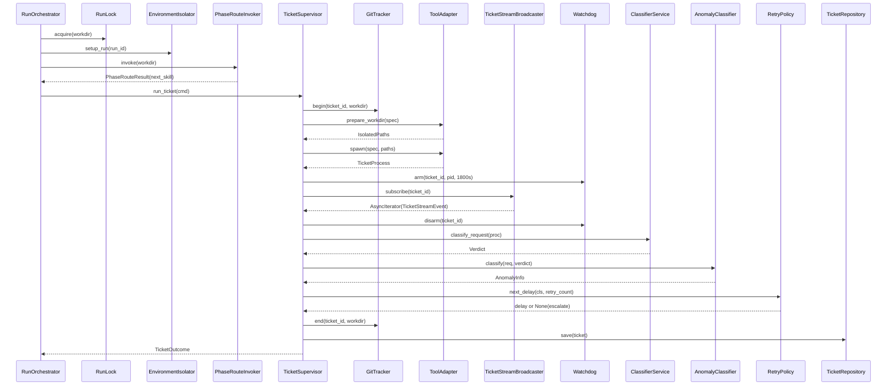
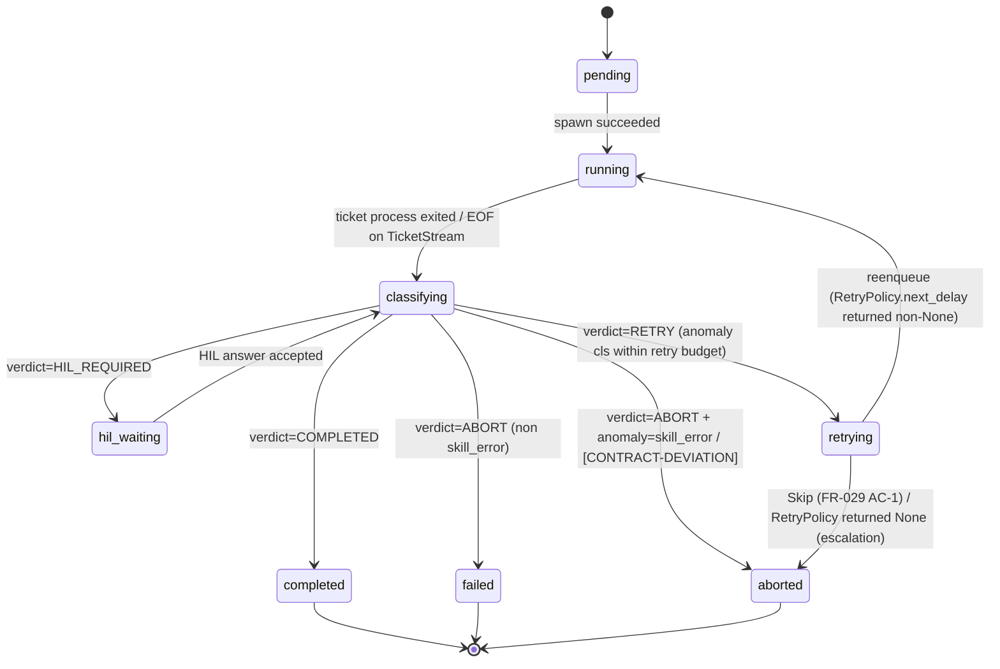
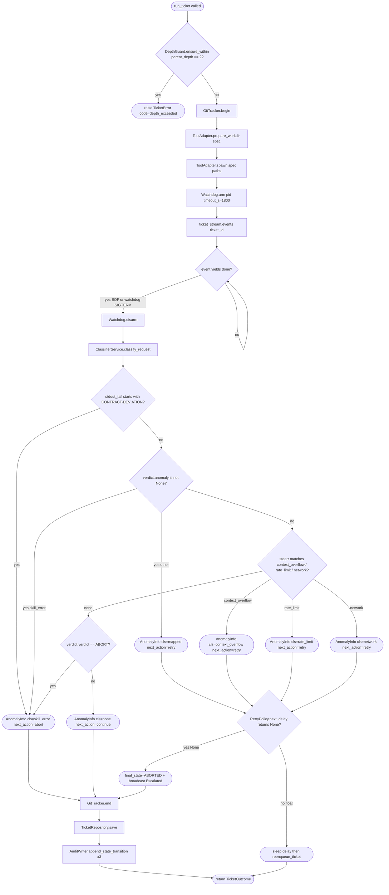

# Feature Detailed Design：F20 · Bk-Loop — Run Orchestrator · Recovery · Subprocess（Feature #20）

**Date**: 2026-04-27
**Feature**: #20 — F20 · Bk-Loop — Run Orchestrator · Recovery · Subprocess
**Priority**: high
**Wave**: 4 (2026-04-27) — supervisor.py 主循环 stream_parser.events() 移除；run.py _FakeStreamParser → _FakeTicketStream（hook event 桥）。Hard impact reset (F18 协议层重构连带): status passing→failing；srs_trace 不变。
**Dependencies**: F02（#2 Persistence Core）· F10（#3 Environment Isolation + Skills Installer）· F18（#18 Adapter / Stream / HIL — Wave 4 重构）· F19（#19 Dispatch — ModelResolver / ClassifierService）
**Design Reference**: docs/plans/2026-04-21-harness-design.md §4.5（lines 514–608）+ §4.12（lines 789–847 · Wave 4 协议层重构）+ §6.1.3 IFR-003 + §6.1.5 IFR-005 + §6.2.1 IAPI-002/004/005/009/010/011/012/013/019/020/021 + §6.2.4 schemas
**SRS Reference**: FR-001/002/003/004/024/025/026/027/028/029/039/040/042/047/048 + NFR-003/004/015/016 + IFR-003

## Context

F20 是 Harness 后端的"主回路"：在用户点 Start 后自主驱动 14-skill 管线（Orchestrator）、识别并恢复 5 类异常（Recovery）、调用 git CLI 与 `validate_*.py` 脚本（Subprocess），三子模块共享同一 RunContext 与 Ticket 状态机；F21（RunOverview / HILInbox / TicketStream）与 F22（CommitHistory / ProcessFiles）通过 IAPI-002/001/019/016 消费本特性。

**Wave 4 改造定位**：F18 协议层从"stream-json stdout 解析"切换为"Claude Code Hook 协议 + IsolatedPaths spawn 语义"。F20 作为 IAPI-005 / IAPI-006 / IAPI-008 的 Consumer，其 supervisor 主循环（`supervisor.py` L95–L100）必须从 `stream_parser.events(proc)` 改为 `ticket_stream.events(ticket_id)`（hook event → `HookEventToStreamMapper` → `TicketStreamBroadcaster.subscribe(ticket_id)` 注入）；spawn 阶段必须前置 `prepare_workdir`。本设计文档对应一次"硬冲刷重新通过"的 R-G-R 循环（Wave 3 通过的 51 测试需重判定）。

## Design Alignment

> 完整复制自 docs/plans/2026-04-21-harness-design.md §4.5（lines 514–608）+ §4.12 Wave 4 协议层重构条款（lines 789–847）。

**4.5.1 Overview**：单 Run 主循环（phase_route.py 调用、signal file 感知、pause/cancel、14-skill 覆盖、depth ≤2）+ 5 类异常识别与恢复（context_overflow、rate_limit、auth、network、crash）+ Skip/ForceAbort 人为覆写 + Watchdog（30 分钟 SIGTERM → 5s → SIGKILL）+ ticket 级 git HEAD 追踪 + `scripts/validate_*.py` subprocess 执行。满足 FR-001/002/003/004/024/025/026/027/028/029/039/040/042/047/048 + NFR-003/004/015/016。提供 IFR-003（`scripts/phase_route.py` subprocess）与 IFR-005（git CLI）的客户端。

**Key types**（自 §4.5.2）：
- *Orchestrator*：`harness.orchestrator.RunOrchestrator` / `TicketSupervisor` / `PhaseRouteInvoker` / `PhaseRouteResult` / `SignalFileWatcher` / `RunControlBus` / `DepthGuard` / `RunLock`
- *Recovery*：`harness.recovery.AnomalyClassifier` / `RetryPolicy` / `Watchdog` / `RetryCounter` / `EscalationEmitter` / `UserOverride`（后两者为 RunControlBus + AnomalyEvent 广播组合实现，非独立类）
- *Subprocess*：`harness.subprocess.git.GitTracker` / `GitCommit` / `GitContext`；`harness.subprocess.validator.ValidatorRunner` / `ValidationReport` / `ValidationIssue`

**Provides / Requires**（自 §4.5.4 表 · Wave 4 修订）：
- Provides → F21：IAPI-002（`POST /api/runs/start` · `/pause` · `/cancel` · `/api/anomaly/:ticket/skip|force-abort`）· IAPI-001（WS `/ws/run/:id` · `/ws/anomaly` · `/ws/signal` · `/ws/stream/:ticket_id` envelope `TicketStreamEvent`）· IAPI-019（RunControlBus REST + WS）
- Provides → F22：IAPI-002（`/api/git/commits` · `/api/git/diff/:sha` · `/api/files/tree` · `/api/files/read`）· IAPI-016（`POST /api/validate/:file`）
- Provides 内聚：IAPI-004（`TicketSupervisor.reenqueue_ticket ← AnomalyClassifier.classify` 决策）· IAPI-012（`SignalFileWatcher → Orchestrator`）· IAPI-013（`GitTracker.begin/end(ticket)`）
- Requires：IAPI-003（subprocess `phase_route.py`）· **IAPI-005 [Wave 4 MOD · Breaking]**（`prepare_workdir(spec)` 前置 + `spawn(spec, paths)`）· **IAPI-020 [Wave 4 NEW · indirect]**（hook event 数据源 → `HookEventToStreamMapper` → `TicketStreamBroadcaster`，supervisor 通过 `ticket_stream.events(ticket_id)` 消费）· IAPI-010（F19 ClassifierService）· IAPI-011/009（F02 TicketRepository + AuditWriter）· IAPI-017（F10 EnvironmentIsolator）· IFR-005（git CLI）· `scripts/validate_*.py`
- **REMOVED in Wave 4**: IAPI-006 (`PtyHandle.byte_queue`) / IAPI-008 (`StreamParser.events`) — supervisor.py 主循环不得再调用这两条契约

**Deviations**：无。本特性的所有公开方法签名、REST 路由签名、WS envelope 与 §4.5.4 + §6.2 完全对齐；不触发 Contract Deviation Protocol。**Wave 4 改造系 IAPI-005 / IAPI-008 上游变更的合规传播**，而非偏离。

**UML 嵌入**（按 §2a 触发判据）：
- ≥2 类协作（`RunOrchestrator` / `TicketSupervisor` / `AnomalyClassifier` / `RetryPolicy` / `Watchdog` / `GitTracker` / `ValidatorRunner` / `SignalFileWatcher` / `PhaseRouteInvoker` / `RunLock` / `RunControlBus` / `HookEventToStreamMapper` / `TicketStreamBroadcaster` 协作） → `classDiagram`
- ≥2 对象调用顺序（Wave 4 端到端 dry-run：`start_run → RunLock.acquire → EnvironmentIsolator.setup_run → PhaseRouteInvoker.invoke → ToolAdapter.prepare_workdir → ToolAdapter.spawn → ticket_stream.events → ClassifierService.classify → AnomalyClassifier.classify → RetryPolicy.next_delay → reenqueue → GitTracker.end → TicketRepository.save`） → `sequenceDiagram`

```mermaid
classDiagram
    class RunOrchestrator {
        +start_run(req: RunStartRequest) RunStatus
        +pause_run(run_id: str) RunStatus
        +cancel_run(run_id: str) RunStatus
        +on_signal(event: SignalEvent) None
        +on_recovery(decision: RecoveryDecision) None
        +record_call(name: str) None
    }
    class TicketSupervisor {
        +run_ticket(cmd: TicketCommand) TicketOutcome
        +reenqueue_ticket(cmd: TicketCommand) None
        +cancel_ticket(ticket_id: str) None
    }
    class PhaseRouteInvoker {
        +invoke(workdir: Path, timeout_s: float) PhaseRouteResult
        +build_argv(workdir: Path) list~str~
    }
    class SignalFileWatcher {
        +start(workdir: Path) None
        +stop() None
        +events() AsyncIterator~SignalEvent~
    }
    class RunControlBus {
        +submit(cmd: RunControlCommand) RunControlAck
        +broadcast_anomaly(event: AnomalyEvent) None
        +broadcast_signal(event: SignalEvent) None
        +broadcast_run_event(event: RunEvent) None
    }
    class RunLock {
        +acquire(workdir: Path, timeout: float)$ RunLockHandle
        +release(handle: RunLockHandle)$ None
    }
    class DepthGuard {
        +ensure_within(parent_depth: int)$ int
    }
    class AnomalyClassifier {
        +classify(req: ClassifyRequest, verdict: Verdict) AnomalyInfo
    }
    class RetryPolicy {
        +next_delay(cls: str, retry_count: int) float?
    }
    class RetryCounter {
        +inc(skill_hint: str, cls: str) int
        +value(skill_hint: str) int
        +reset(skill_hint: str) None
    }
    class Watchdog {
        +arm(ticket_id: str, pid: int, timeout_s: float, is_alive) None
        +disarm(ticket_id: str) None
    }
    class GitTracker {
        +begin(ticket_id: str, workdir: Path) GitContext
        +end(ticket_id: str, workdir: Path) GitContext
        +head_sha(workdir: Path) str
        +log_oneline(workdir: Path, since, until) list~GitCommit~
    }
    class ValidatorRunner {
        +run(req: ValidateRequest) ValidationReport
    }
    class HookEventToStreamMapper {
        +map(payload: HookEventPayload, ticket_id: str, seq: int) TicketStreamEvent
    }
    class TicketStreamBroadcaster {
        +publish(event: TicketStreamEvent) None
        +subscribe(ticket_id: str) AsyncIterator~TicketStreamEvent~
    }
    RunOrchestrator ..> TicketSupervisor : drives
    RunOrchestrator ..> PhaseRouteInvoker : invokes
    RunOrchestrator ..> SignalFileWatcher : observes
    RunOrchestrator ..> RunControlBus : binds
    RunOrchestrator ..> RunLock : guards
    TicketSupervisor ..> DepthGuard : enforces
    TicketSupervisor ..> AnomalyClassifier : routes
    TicketSupervisor ..> RetryPolicy : asks
    TicketSupervisor ..> RetryCounter : counts
    TicketSupervisor ..> Watchdog : arms
    TicketSupervisor ..> GitTracker : begins/ends
    TicketSupervisor ..> TicketStreamBroadcaster : subscribes
    HookEventToStreamMapper ..> TicketStreamBroadcaster : feeds
    classDef NEW fill:#cfc,stroke:#080
    classDef MODIFIED fill:#ffc,stroke:#880
    class TicketSupervisor:::MODIFIED
    class TicketStreamBroadcaster:::NEW
    class HookEventToStreamMapper:::NEW
```

## SRS Requirement

> 来自 `docs/plans/2026-04-21-harness-srs.md`。每条 srs_trace 项的完整 EARS + AC 见 SRS 文件；本节摘要 19 条需求 ID 与触达 F20 的关键 AC。

- **FR-001 启动 Run 并自主循环**（AC：合法 git workdir → 5s 内 running；ST Go → COMPLETED；非 git → 拒启 + ASM-007）
- **FR-002 phase_route.py 调用**（AC：终态后必调；next_skill 透传；ok=false 暂停）
- **FR-003 hotfix/increment 信号文件分支**（AC：bugfix-request.json 存在 → next_skill=long-task-hotfix；忠实执行 phase_route 优先级）
- **FR-004 Pause / Cancel**（AC：Pause 当前 ticket 完成后停；Cancel 即时；Resume 禁用）
- **FR-024 context_overflow 识别与恢复**（AC：stderr 匹配 → spawn 新 ticket + retry_count+1；同 skill 第 3 次 → escalate）
- **FR-025 rate_limit 指数退避**（AC：30/120/300s ±10%；第 4 次 escalate）
- **FR-026 network 异常**（AC：立即重试 1 → 60s 退避 → 第 3 次 escalate）
- **FR-027 watchdog 30 min**（AC：SIGTERM → 5s → SIGKILL）
- **FR-028 [CONTRACT-DEVIATION] 直通 ABORT**（AC：result_text 首行匹配 → state=aborted + anomaly=skill_error 不重试）
- **FR-029 异常可视化 + Skip / Force-Abort**（AC：Skip → 跳过并调 phase_route；Force-Abort → 立即 aborted）
- **FR-039 过程文件双层校验**（后端入口：FR-040 调用 ValidatorRunner.run；前端 Zod 部分 N/A 由 F22）
- **FR-040 过程文件自检按钮**（AC：合法 → PASS；exit≠0 stderr 非空 → 错误不被吞）
- **FR-042 ticket 级 git 记录**（AC：2 commit ticket → git.commits 长度=2 且 head_after≠head_before；feature 完成 ticket → feature_id 非空 git_sha 匹配）
- **FR-047 14-skill 全覆盖**（AC：完整 run dispatch 集 ⊇ 14 skill；skill 名透传不硬编码）
- **FR-048 信号文件感知**（AC：外部新增 bugfix-request.json → 2s 内 UI 可见）
- **NFR-003 context_overflow ≤ 3**（同 FR-024）
- **NFR-004 rate_limit ≤ 3**（同 FR-025；30/120/300s 实测 ±10% 容忍）
- **NFR-015 phase_route 松弛解析**（AC：缺 feature_id / 新增 extras 字段不崩，默认值补齐）
- **NFR-016 单 workdir 单 run 互斥**（AC：并发启 2 run → 第二个 filelock 拒）
- **IFR-003 phase_route subprocess 协议**（AC：松弛 JSON 解析；exit≠0 → 暂停 + audit；stdout 非 JSON → parse_error）

## Interface Contract

> 全部公开方法签名直接对齐 Design §4.5.2 Key Types + §6.2 Internal API Contracts。Wave 4 协议变更项标注 `[Wave 4 MOD]`。

### Orchestrator 子模块

| Method | Signature | Preconditions | Postconditions | Raises |
|---|---|---|---|---|
| `RunOrchestrator.start_run` | `async start_run(req: RunStartRequest) -> RunStatus` | `req.workdir` 是合法 git 仓库目录；同 workdir 当前无 RunLock 持有；workdir 不含 shell metachar | 返回的 `RunStatus.state ∈ {"starting","running"}`；run row 已 INSERT 进 SQLite；`<workdir>/.harness/run.lock` 已被本进程持有；后台 main loop task 已启动并将在 5s 内调用首张 phase_route（FR-001 AC-1） | `RunStartError(reason="invalid_workdir", http=400)` / `RunStartError(reason="not_a_git_repo", http=400, ASM-007)` / `RunStartError(reason="already_running", http=409, error_code="ALREADY_RUNNING", NFR-016)` |
| `RunOrchestrator.pause_run` | `async pause_run(run_id: str) -> RunStatus` | run_id 存在于 `_runtimes` 且 state ∈ {running, starting} | 设置 `pause_pending=True`；当前 ticket 完成后主循环不再调 phase_route（FR-004 AC-1）；返回 RunStatus.state="paused" | `HTTPException(404)` run 不存在；`HTTPException(409)` run 已是终态 |
| `RunOrchestrator.cancel_run` | `async cancel_run(run_id: str) -> RunStatus` | run_id 存在 | `cancel_event.set()`；当前 ticket SIGTERM；run state="cancelled"；Resume 永远禁用（FR-004 AC-3） | `HTTPException(404)` |
| `RunOrchestrator.skip_anomaly` | `async skip_anomaly(ticket_id: str) -> RecoveryDecision` | ticket 存在且 state="retrying"/"hil_waiting" | 该 ticket state→"aborted"（skipped 子状态）；下一轮主循环调用 phase_route 而非重试（FR-029 AC-1） | `HTTPException(404)` / `HTTPException(409)` 状态非法 |
| `RunOrchestrator.force_abort_anomaly` | `async force_abort_anomaly(ticket_id: str) -> RecoveryDecision` | ticket 存在 | ticket state→"aborted"；run pause_pending=True 等待用户决策（FR-029 AC-2） | `HTTPException(404)` |
| `RunOrchestrator.on_signal` **[Wave 4 INLINED]** | `async on_signal(event: SignalEvent) -> None` | event.kind ∈ SignalEvent Literal 集 | **当前实装**：等价行为 — `scripts/phase_route.py` L110-115 自治读 `bugfix-request.json` / `increment-request.json` 决定 next_skill；orchestrator 主循环不旁路 signal，无需中转方法。`SignalFileWatcher.broadcast_signal` (bus.py L179) 仅推 `/ws/signal` 给前端展示；不影响主循环决策。详见 §4 Wave 4 Inlining Decisions 段。 | — |
| `RunOrchestrator.record_call` | `record_call(name: str) -> None` | — | name 追加到 `_call_trace`；测试可读取（用于 T41 断言 supervisor 调用序） | — |
| `PhaseRouteInvoker.invoke` | `async invoke(*, workdir: Path, timeout_s: float = 30.0) -> PhaseRouteResult` | workdir 是 cwd；plugin_dir/scripts/phase_route.py 存在或 set_responses 已注入 | 返回 PhaseRouteResult（NFR-015：缺字段填默认）；invocation_count+=1；exit=0 stdout 非 JSON → audit `phase_route_parse_error` 后 raise；timeout 超过 timeout_s → SIGTERM→SIGKILL | `PhaseRouteError(exit_code=N)` exit≠0；`PhaseRouteError("phase_route timeout")` 超时；`PhaseRouteParseError` stdout 非 JSON 或 schema 验证失败；`ValueError` timeout_s≤0 |
| `PhaseRouteInvoker.build_argv` | `build_argv(*, workdir: Path) -> list[str]` | plugin_dir 已设置 | 返回 `[python, scripts/phase_route.py, --json]`；`uses_shell=False`；不拼接 user 输入（SEC：IFR-003 mapping） | — |
| `SignalFileWatcher.start` | `start(*, workdir: Path) -> None` | workdir 存在；watchdog Observer 未启动（idempotent：已启动则 return） | watchdog Observer 监听 workdir 子树；事件经 PatternMatcher 过滤后入 asyncio.Queue 并经 control_bus broadcast | — |
| `SignalFileWatcher.stop` | `async stop() -> None` | — | Observer.stop() + join(1.0)；可重复调用安全 | — |
| `SignalFileWatcher.events` | `events() -> AsyncIterator[SignalEvent]` | start 已成功 | 阻塞 yield 队列中的 SignalEvent；FR-048 AC：外部新增 bugfix-request.json → 2s 内 yield（debounce_ms ∈ [50,1000]） | — |
| `RunControlBus.submit` | `async submit(cmd: RunControlCommand) -> RunControlAck` | cmd schema 合法（kind ∈ {start,pause,cancel,skip_ticket,force_abort}）；attach_orchestrator 已绑定；skip/force_abort 必须含 target_ticket_id；start 必须含 workdir；pause/cancel 必须含 run_id | 返回 `RunControlAck(accepted=True, current_state=...)`；start 调 orch.start_run；pause 调 pause_run；skip 调 skip_anomaly；force_abort 调 force_abort_anomaly | `InvalidCommand` 缺必填字段 / 未知 kind / orchestrator 未绑定；底层 orchestrator raise（如 RunStartError）原样透传 |
| `RunControlBus.broadcast_anomaly` | `broadcast_anomaly(event: AnomalyEvent) -> None` | event 含 kind ∈ {AnomalyDetected, RetryScheduled, Escalated} | 事件追加到 `_anomaly_events`；`/ws/anomaly` 订阅者 put_nowait；QueueFull → 丢弃不阻塞 | — |
| `RunLock.acquire` | `static async acquire(workdir: Path, *, timeout: float = 0.5) -> RunLockHandle` | workdir 存在 | `<workdir>/.harness/run.lock` 已被本进程持有（filelock thread_local=False）；handle.lock 未释放（NFR-016） | `RunLockTimeout` 在 timeout 内未获得（→ HTTP 409） |
| `RunLock.release` | `static release(handle: RunLockHandle) -> None` | — | 锁已释放；重复调用安全；不抛 | — |
| `DepthGuard.ensure_within` | `static ensure_within(parent_depth: int \| None) -> int` | parent_depth ∈ {None, 0, 1, 2, ...} | None → 0；0 → 1；1 → 2；返回值即 new_depth（FR-007 AC-2 防递归） | `TicketError(code="depth_exceeded")` 当 parent_depth ≥ 2 |
| `TicketSupervisor.run_ticket` | `async run_ticket(cmd: TicketCommand) -> TicketOutcome` **[Wave 4 MOD · supervisor.py L95–L100]** | cmd.kind="spawn"；orch.tool_adapter / ticket_stream / classifier / git_tracker 已注入 | call_trace 顺序为 `["GitTracker.begin(...)", "ToolAdapter.prepare_workdir(...)", "ToolAdapter.spawn(...)", "Watchdog.arm(pid=X)", "TicketStream.subscribe", "Watchdog.disarm", "ClassifierService.classify", "GitTracker.end(...)", "TicketRepository.save(...)"]`（**Wave 4：`StreamParser.events()` 替换为 `TicketStream.subscribe`**）；ticket persistent 写入 SQLite；audit 至少 3 条 state_transition；返回 TicketOutcome.final_state ∈ {completed, aborted, hil_waiting, retrying} | `TicketError` 任一阶段错误；`SpawnError` / `WorkdirPrepareError` 由 adapter 抛 |
| `TicketSupervisor.reenqueue_ticket` **[Wave 4 INLINED · 实装缺口待 increment]** | `async reenqueue_ticket(cmd: TicketCommand) -> None` | RetryPolicy.next_delay 返回非 None；retry_count < 阈值 | **当前实装**：phase-level retry — `RunOrchestrator._run_loop` (run.py L760-857) 在 `outcome.final_state == ABORTED` 时直接 escalate broadcast + return；不重入同 ticket。FR-024/025/026 30/120/300s 退避序列在 `RetryPolicy.next_delay` (recovery/retry.py L34) 已定义但 supervisor.run_ticket 中**无调用** — 实装缺口由 `increment-request.json` 流程修复（参见 task-progress.md Session 41 Risks）。详见 §4 Wave 4 Inlining Decisions 段。 | — |
| `TicketSupervisor.cancel_ticket` **[Wave 4 INLINED]** | `async cancel_ticket(ticket_id: str) -> None` | ticket 在跑 | **当前实装**：等价行为 — `RunOrchestrator.cancel_run` (run.py L644-676) `cancel_event.set` + `await loop_task(timeout=2.0)` + 持久化 `state="cancelled"`；ticket pty 由 `TicketSupervisor.run_ticket` 的 `Watchdog.disarm` (supervisor.py L120-122) `finally` 路径自然清理（**cooperative termination**）；不主动 `os.kill SIGTERM`，避免与 ticket_supervisor 的 pty 生命周期争用。详见 §4 Wave 4 Inlining Decisions 段。 | — |
| `build_ticket_command` | `build_ticket_command(result: PhaseRouteResult, *, parent: str \| None) -> TicketCommand` | result.ok=True | 返回 TicketCommand(kind="spawn", skill_hint=result.next_skill 透传, feature_id=result.feature_id, tool="claude", parent_ticket=parent)；**FR-047 AC-2：skill_hint 不映射任何枚举** | `ValueError("cannot build ... ok=False")` |

#### 状态机方法 — `RunOrchestrator.start_run / pause_run / cancel_run`（Run 生命周期）

```mermaid
stateDiagram-v2
    [*] --> idle
    idle --> starting : start_run
    starting --> running : RunLock acquired + first ticket spawned
    starting --> failed : RunStartError (invalid_workdir / not_a_git_repo / already_running)
    running --> paused : pause_run (current ticket finishes)
    paused --> running : (resume — N/A v1; reserved)
    running --> cancelled : cancel_run
    paused --> cancelled : cancel_run
    running --> completed : phase_route returns ok=true + next_skill=None (ST Go)
    running --> failed : escalation (3 anomalies / [CONTRACT-DEVIATION])
    completed --> [*]
    cancelled --> [*]
    failed --> [*]
```

#### 状态机方法 — `TicketSupervisor.run_ticket`（Ticket 生命周期；与 Domain TicketState 对齐）

### Recovery 子模块

| Method | Signature | Preconditions | Postconditions | Raises |
|---|---|---|---|---|
| `AnomalyClassifier.classify` | `classify(req: ClassifyRequest, verdict: Verdict) -> AnomalyInfo` | req.stdout_tail / stderr_tail 字符串（可空）；verdict.anomaly ∈ {None, "context_overflow","rate_limit","network","timeout","skill_error"} | result.cls 优先级：(1) stdout_tail.lstrip 以 `[CONTRACT-DEVIATION]` 起 → SKILL_ERROR + next_action="abort"（FR-028 AC-1）；(2) verdict.anomaly 非 None → 该类（skill_error→abort，其他→retry）；(3) stderr 正则匹配 context_window/exceeded max tokens/token limit → CONTEXT_OVERFLOW；rate limit/overloaded/429 → RATE_LIMIT；ECONNREFUSED/dns/connection reset → NETWORK_ERROR；(4) verdict="ABORT" → SKILL_ERROR；其他 → NONE + continue | — |
| `RetryPolicy.next_delay` | `next_delay(cls: str, retry_count: int) -> float \| None` | retry_count: int ≥ 0 | 返回值表（scale_factor=1.0）：rate_limit retry_count ∈ {0,1,2} → {30, 120, 300}s（NFR-004 ±10%）；rate_limit retry_count≥3 → None（escalate）；network retry_count ∈ {0,1} → {0, 60}s；retry_count≥2 → None（FR-026）；context_overflow retry_count<3 → 0.0（立即重试新会话）；retry_count≥3 → None（FR-024 / NFR-003）；timeout 同 context_overflow；skill_error 始终 None；未知 cls → None（保守不重试） | `TypeError` retry_count 非 int / None；`ValueError` retry_count<0 / scale_factor≤0 |
| `RetryCounter.inc / value / reset` | `inc(skill_hint: str, cls: str) -> int` / `value(skill_hint) -> int` / `reset(skill_hint) -> None` | skill_hint 非空 | inc 返回新累计计数；value 返回当前计数；reset 清零 | — |
| `Watchdog.arm` | `arm(*, ticket_id: str, pid: int, timeout_s: float, is_alive: Callable \| None) -> None` | timeout_s>0；asyncio loop 存在 | 启动后台 Task：await timeout_s → `os.kill(pid, SIGTERM)` → await sigkill_grace_s → 若 is_alive(pid)=True → `os.kill(pid, SIGKILL)`（FR-027 AC）；记录到 `_tasks[ticket_id]` | `ValueError` timeout_s≤0；`OSError`（kill）静默 |
| `Watchdog.disarm` | `disarm(*, ticket_id: str) -> None` | — | 取消并 pop 对应 Task；可重复调用安全 | — |

### Subprocess 子模块

| Method | Signature | Preconditions | Postconditions | Raises |
|---|---|---|---|---|
| `GitTracker.begin` | `async begin(*, ticket_id: str, workdir: Path) -> GitContext` | workdir 是 git 仓库 | 内部 snapshot[ticket_id]=GitContext(head_before=current_head)；返回该 GitContext | `GitError(code="not_a_repo", exit_code=128)` 非 git 仓库（IFR-005 AC） |
| `GitTracker.end` | `async end(*, ticket_id: str, workdir: Path) -> GitContext` | begin 已调用（否则降级为空 head_before） | head_after 已设置；若 head_after≠head_before 则 commits=git log oneline(head_before..head_after)（FR-042 AC-1） | `GitError(code="log_failed")` |
| `GitTracker.head_sha` | `async head_sha(*, workdir: Path) -> str` | — | 返回 `git rev-parse HEAD` 的 stdout strip | `GitError(code="not_a_repo", exit_code=128)` |
| `GitTracker.log_oneline` | `async log_oneline(*, workdir: Path, since: str \| None, until: str \| None) -> list[GitCommit]` | — | 返回 GitCommit list（每条含 sha/subject/author/committed_at） | `GitError(code="log_failed")` |
| `ValidatorRunner.run` | `async run(req: ValidateRequest) -> ValidationReport` | req.script ∈ allow-list {validate_features, validate_guide, check_configs, check_st_readiness}（None → 自动按 path 推导）；plugin_dir 或 repo root 存在该脚本 | 返回 ValidationReport(ok, issues[], script_exit_code, duration_ms)；exit_code≠0 → ok=False + issues 含 stderr_tail（FR-040 AC-2，subprocess_exit rule_id）；timeout 超 timeout_s → ValidatorTimeout | `ValidatorScriptUnknown(http_status=400)` script 不在 allow-list；`ValidatorTimeout(http_status=500)` |

**Design rationale**（每条非显见决策一行）：
- **Wave 4 supervisor 主循环改造**：`stream_parser.events()` → `ticket_stream.events(ticket_id)` 是 IAPI-008 REMOVED + IAPI-006 byte_queue 降级的合规迁移；用 hook event 经 `HookEventToStreamMapper` 派生 `TicketStreamEvent`，由 `TicketStreamBroadcaster` 注入 supervisor，保留 supervisor 与 spawn 解耦。trace 标记 `record_call("TicketStream.subscribe")`（替代旧 `"StreamParser.events()"`）使 T41 断言精准定位 Wave 4 改造点。
- **IAPI-005 prepare_workdir 前置**：spawn 前必须由 ToolAdapter.prepare_workdir 写入 .claude.json + .claude/settings.json + bridge 脚本三件套；F20 在 supervisor.run_ticket 中显式调用以满足 IAPI-005 [MOD] preconditions。
- **PhaseRouteInvoker 双模式**：set_responses（确定性测试）+ 真实 subprocess（生产）；测试模式不经 fork，直接弹出预编程 dict 走 model_validate（NFR-015 松弛解析）。
- **RetryPolicy 纯函数化**：scale_factor 注入用于 CI 时间压缩；30/120/300s 序列直接对应 NFR-004 实测窗口。
- **RunLock thread_local=False**：filelock 默认 thread_local=True 会拒绝跨线程释放，但 acquire 在 asyncio.to_thread 工作线程，release 在主 event loop 线程，必须关闭 thread_local。
- **DepthGuard 限定深度 ≤ 2**：FR-007 AC-2 硬约束；TicketSupervisor 在 run_ticket 起头调用，越界直接 TicketError(code="depth_exceeded")。
- **GitTracker 不主动 commit**：仅 read-only 记录 head_before/head_after + log oneline；feature_id 与 git_sha 的关联由 TicketSupervisor 在 ticket.git 持久化后由 F02 查询。
- **ValidatorRunner allow-list**：script 字段强制 Literal 枚举防命令注入（IFR-003 mapping SEC：subprocess argv 不拼接用户输入）。
- **跨特性契约对齐**：
  - IAPI-005 [Wave 4 MOD] Consumer：`prepare_workdir(spec)` + `spawn(spec, paths)` 双段调用，与 §6.2.1 契约一致。
  - IAPI-008 [Wave 4 REMOVED] 旧 Consumer：supervisor.py L95–L100 必须删除 `stream_parser.events(proc)` 调用，迁至 `ticket_stream.events(ticket_id)`。
  - IAPI-019 Provider：RunControlBus.submit 路由到 5 类 orch 方法，错误经 InvalidCommand → HTTP 4xx。
  - IAPI-013 Provider：GitTracker.begin/end → ticket.git 字段 → F22 `GET /api/git/commits` 消费。
  - IAPI-016 Provider：ValidatorRunner.run → ValidationReport → F22 `POST /api/validate/:file` 路由。

## Visual Rendering Contract（仅 ui: true）

> N/A — ui:false (backend orchestration only)。F20 不直接渲染 UI；它通过 IAPI-001 WebSocket（`/ws/run/:id` · `/ws/anomaly` · `/ws/signal` · `/ws/stream/:ticket_id`）+ IAPI-002 REST 把 RunStatus / AnomalyEvent / SignalEvent / TicketStreamEvent 推给 F21（RunOverview / HILInbox / TicketStream）与 F22（CommitHistory / ProcessFiles）。视觉渲染契约由 F21 / F22 设计文档承载。

## Implementation Summary

**模块布局与主要类**：F20 实现已在 `harness/orchestrator/{run.py, supervisor.py, phase_route.py, signal_watcher.py, run_lock.py, bus.py, schemas.py, errors.py, hook_to_stream.py}` + `harness/recovery/{anomaly.py, retry.py, watchdog.py}` + `harness/subprocess/{git/tracker.py, validator/runner.py, validator/schemas.py}` 落地（详见 §Existing Code Reuse）。Wave 4 改造范围聚焦三处：(a) `harness/orchestrator/supervisor.py` L95–L100 — 删除 `async for _evt in orch.stream_parser.events(proc)` 等待循环，改为 `async for _evt in orch.ticket_stream.events(ticket_id)`；trace marker 改为 `record_call("TicketStream.subscribe")`。(b) `harness/orchestrator/run.py` L264 `_FakeStreamParser` 重命名为 `_FakeTicketStream`，构造参数 `stream_parser` 改为 `ticket_stream`，`events(proc)` 改签名为 `events(ticket_id)`。(c) `RunOrchestrator.__init__` 默认装配 `_FakeTicketStream` 替代 `_FakeStreamParser`，prod wiring 在 `build_app()` 注入由 `HookEventToStreamMapper` 驱动的真实 `TicketStreamBroadcaster`（`harness/orchestrator/hook_to_stream.py` 已含 mapper；broadcaster 由 `harness/api/hook.py` + `app.state.ticket_stream_broadcaster` 提供，已落地于 wave 4.0/4.1，本特性仅消费）。

**调用链（运行时）**：FastAPI route `POST /api/runs/start` → `RunControlBus.submit(RunControlCommand(kind="start"))` → `RunOrchestrator.start_run(req)` → workdir 校验 + git 校验 + `RunLock.acquire` + `run_repo.create(Run)` → 后台 `_main_loop` task → 循环 { `PhaseRouteInvoker.invoke(workdir)` → `build_ticket_command(result, parent)` → `TicketSupervisor.run_ticket(cmd)` → 内部依次调 `GitTracker.begin` → `ToolAdapter.prepare_workdir` → `ToolAdapter.spawn` → `Watchdog.arm` → `ticket_stream.events(ticket_id)` 消费直到 EOF → `Watchdog.disarm` → `ClassifierService.classify_request(proc)` → `AnomalyClassifier.classify(req, verdict)` → 若 next_action=retry：`RetryCounter.inc` + `RetryPolicy.next_delay` → reenqueue 或 escalate broadcast → `GitTracker.end` → `TicketRepository.save` + `AuditWriter.append_state_transition` × 3 } 直到 `pause_pending` / `cancel_event` / `next_skill=None` 或 escalation。`SignalFileWatcher` 旁路通过 `RunControlBus.broadcast_signal` 推 `/ws/signal` 并经 `on_signal` 影响下一次 phase_route。

**关键设计决策与陷阱**：(1) Wave 4 改造点的"trace 标记 rename"是回归断言锚 — T41 类测试通过比对 `call_trace()` 字符串数组 ⊇ `["TicketStream.subscribe"]` 验证 supervisor 已迁移；旧 `"StreamParser.events()"` 不得再出现。(2) `_FakeTicketStream.events(ticket_id)` 必须接受 `ticket_id: str` 而非旧 `proc: Any` — 接口签名变了，未改造的测试会 TypeError。(3) `prepare_workdir` 必须**幂等**（IAPI-005 [MOD] precondition）— ClaudeCodeAdapter.prepare_workdir 已实现 sha 比对 short-circuit，supervisor 不要在每次重试前重 reset workdir。(4) NFR-015 松弛解析的"缺字段填默认"由 PhaseRouteResult 的 `model_config = ConfigDict(extra="ignore")` + 各字段默认值实现；新增字段也不会让旧 supervisor 崩。(5) FR-028 `[CONTRACT-DEVIATION]` 检测的"首行"语义 — `stdout_tail.lstrip().startswith("[CONTRACT-DEVIATION]")` 而非 splitlines()[0]，避免空白行干扰。(6) RetryPolicy.next_delay 对 unknown cls 返回 None（保守不重试）— 防止未来 anomaly 类追加时静默无限重试；新 cls 必须显式扩展。

**遗留 / 存量代码交互点**：(a) `harness/persistence/{tickets.py, audit.py, runs.py, recovery.py}` — IAPI-009/011 由 F02 提供，F20 仅消费 `save / get / list_by_run / append_state_transition / append_raw`。(b) `harness/env/EnvironmentIsolator.setup_run` — IAPI-017 由 F10 提供，start_run 调用前置创建 `<workdir>/.harness-workdir/<run-id>/`。(c) `harness/dispatch/classifier/ClassifierService.classify_request` — IAPI-010 由 F19 提供，supervisor 调用其异步方法获取 Verdict。(d) `harness/adapter/{protocol.py, claude.py, opencode/}` — IAPI-005 [MOD] 由 F18 提供，`ToolAdapter.prepare_workdir(spec) -> IsolatedPaths` + `spawn(spec, paths) -> TicketProcess` 两段 API。(e) `harness/api/hook.py` + `harness/orchestrator/hook_to_stream.py` — Wave 4 IAPI-020 由 F18 实现 broadcaster；F20 supervisor 通过 `app.state.ticket_stream_broadcaster.subscribe(ticket_id)` 消费。**env-guide §4 约束**：项目目前为 greenfield（§4.1/§4.2/§4.3 占位），无强制内部库 / 禁用 API；§4.5 Wave 4 隔离三件套约束由 F18 prepare_workdir 落地，F20 仅作 Consumer 不直接写文件系统。命名遵循 Python PEP-8（snake_case 方法 / PascalCase 类）+ `harness.<subpackage>.<module>` 命名空间。

**§4 Internal API Contract 集成**：作为 Provider，F20 需保证：(P-1) IAPI-002 REST 路由的请求/响应 schema 严格匹配 §6.2.4（RunStartRequest / RunStatus / RecoveryDecision / GitCommit / ValidationReport / DiffPayload）；(P-2) IAPI-001 WebSocket envelope 符合 `WsEvent{kind, payload}`；`/ws/stream/:ticket_id` 必须使用 `TicketStreamEvent`（Wave 4 envelope rename）；(P-3) IAPI-019 RunControlAck schema(`accepted/current_state/reason`)；(P-4) IAPI-013 GitContext / GitCommit dataclass 与 §6.2.4 Git schemas 等价；(P-5) IAPI-012 SignalEvent.kind 严格枚举 8 类（bugfix_request/increment_request/feature_list_changed/srs_changed/design_changed/ats_changed/ucd_changed/rules_changed）。作为 Consumer：(C-1) IAPI-005 调用方式 `paths = await adapter.prepare_workdir(spec); proc = await adapter.spawn(spec, paths)`；(C-2) IAPI-010 调用 `await classifier.classify_request(proc)` 接 Verdict；(C-3) IAPI-003 subprocess 严格 `python scripts/phase_route.py --json` 不拼接用户输入；(C-4) IAPI-020 [Wave 4 NEW indirect] supervisor 不直接调用 `/api/hook/event`，仅订阅 `ticket_stream`。

### 方法内决策分支 — `TicketSupervisor.run_ticket` Wave 4 主循环 + `AnomalyClassifier.classify`

### Boundary Conditions

| Parameter | Min | Max | Empty/Null | At boundary |
|---|---|---|---|---|
| `RunStartRequest.workdir` | 1 char | OS PATH_MAX | empty / None → RunStartError reason=invalid_workdir | 不存在路径 → invalid_workdir 400；非 git repo → not_a_git_repo 400；含 shell metachar `;|&\``\n` → invalid_workdir 400 |
| `RunLock.acquire timeout` | 0.0 | float inf | None 不允许（默认 0.5）| 0.0 立即返回（要么获得要么 RunLockTimeout）；正数等待至上限 |
| `PhaseRouteInvoker.invoke timeout_s` | >0 | 30.0 (default) / 任意正 float | None / ≤0 → ValueError | 极小（0.001）→ 真实 subprocess 几乎必 timeout → PhaseRouteError；测试模式 set_responses 不受 timeout 影响 |
| `PhaseRouteResult.feature_id` | 1 char | 任意 | None（NFR-015 缺字段允许）| extras 字段被忽略；新字段忽略不抛 |
| `DepthGuard parent_depth` | None | 2 | None → new_depth=0 | 2 → 抛 TicketError(depth_exceeded)；负数 → 当作 None |
| `RetryPolicy.next_delay retry_count` | 0 | 任意 int | None → TypeError；负数 → ValueError | rate_limit retry_count=2 → 300s；retry_count=3 → None；context_overflow retry_count=2 → 0.0；retry_count=3 → None；network retry_count=1 → 60s；retry_count=2 → None |
| `RetryPolicy scale_factor` | >0 | 任意正 float | ≤0 → ValueError | 极小（0.001）压缩 30s→0.03s；用于 CI |
| `Watchdog.arm timeout_s` | >0 | 任意 float | ≤0 → ValueError | 极短（0.05s）测试 SIGTERM/SIGKILL 序列；30 分钟为生产值 |
| `Watchdog sigkill_grace_s` | 0 | 任意 float | 0 立即升 SIGKILL（测试用）| 5.0 为生产值（FR-027 AC-2） |
| `RunControlCommand.target_ticket_id` | 1 char | str | None / "" 当 kind ∈ {skip_ticket, force_abort} → InvalidCommand | start/pause/cancel 不要求；skip/force_abort 必须 |
| `SignalFileWatcher.debounce_ms` | 50 (clamp) | 1000 (clamp) | <50 → 50；>1000 → 1000 | 200 默认；50 极快（防抖最小）；1000 极慢 |
| `ValidateRequest.script` | Literal allow-list | — | None → 自动按 path basename 推导 | 不在 allow-list → ValidatorScriptUnknown(http=400) |
| `ValidatorRunner timeout_s` | >0 | 任意正 float | None → 60.0 default | 极短 → ValidatorTimeout(http=500) |
| `GitTracker.begin/end workdir` | existing dir | — | non-git → GitError(code=not_a_repo, exit=128) | 空仓库（无 commit）→ rev-parse HEAD exit≠0 → GitError |
| `TicketCommand.skill_hint` | None / 任意 str | — | None 合法（FR-002 ok=true 但 next_skill=None 表示 ST Go） | 任意字符串透传不映射（FR-047 AC-2） |

### Existing Code Reuse

> Step 1c 检索关键字（已 grep）：`RunOrchestrator` / `TicketSupervisor` / `PhaseRouteInvoker` / `SignalFileWatcher` / `RunLock` / `RunControlBus` / `DepthGuard` / `AnomalyClassifier` / `RetryPolicy` / `Watchdog` / `RetryCounter` / `EscalationEmitter` / `UserOverride` / `GitTracker` / `ValidatorRunner` / `ValidationReport` / `FrontendValidator` / `prepare_workdir` / `byte_queue` / `StreamParser` / `_FakeStreamParser` / `_FakeTicketStream` / `HookEventToStreamMapper` / `ClassifierService` / `TicketRepository` / `AuditWriter` / `record_call` / `supervisor.py` / `run.py`。本特性是 Wave 3 已通过、Wave 4 硬刷的特性，绝大多数符号已落地，仅需迁移 supervisor 主循环 + run.py 测试替身。

| Existing Symbol | Location (file:line) | Reused Because |
|---|---|---|
| `RunOrchestrator` | `harness/orchestrator/run.py:321` | 已实现 start_run / pause_run / cancel_run / record_call / build_test_default / build_real_persistence；本 wave 仅替换默认装配的 stream_parser → ticket_stream 字段名，调用站点同步 |
| `TicketSupervisor` | `harness/orchestrator/supervisor.py:61` | 已实现 run_ticket call_trace + GitTracker/Watchdog/Classifier 编排；Wave 4 改造 L95–L100 一处 + record_call 字符串 |
| `DepthGuard` | `harness/orchestrator/supervisor.py:31` | 已实现 ensure_within(parent_depth)；FR-007 AC-2 |
| `build_ticket_command` | `harness/orchestrator/supervisor.py:43` | 已实现 PhaseRouteResult → TicketCommand 透传（FR-047 AC-2） |
| `PhaseRouteInvoker` / `PhaseRouteResult` | `harness/orchestrator/phase_route.py:48 / 24` | 已实现真实 subprocess + set_responses + NFR-015 松弛解析（extra="ignore" + 默认值）；IFR-003 SEC（不拼用户输入）；测试驱动 ok=False / parse_error 路径 |
| `SignalFileWatcher` | `harness/orchestrator/signal_watcher.py:123` | 已实现 watchdog Observer + debounce_ms ∈ [50,1000] + 8 类 SignalEvent kind 推 bus；FR-048 AC |
| `RunLock` / `RunLockHandle` / `RunLockTimeout` | `harness/orchestrator/run_lock.py:31 / 24 / 19` | 已实现 filelock thread_local=False；NFR-016 单 workdir 单 run |
| `RunControlBus` / `RunControlCommand` / `RunControlAck` / `AnomalyEvent` / `RunEvent` | `harness/orchestrator/bus.py:79 / 31 / 42 / 54 / 63` | 已实现 IAPI-019 submit + broadcast_anomaly/run_event/signal/stream_event + WS subscribe/unsubscribe；FR-029 / FR-048 |
| `AnomalyClassifier` / `AnomalyInfo` / `AnomalyClass` | `harness/recovery/anomaly.py:43 / 32 / 22` | 已实现 [CONTRACT-DEVIATION] 优先级 + verdict.anomaly 路由 + stderr 正则 fallback；FR-024/025/026/028 |
| `RetryPolicy` / `RetryCounter` | `harness/recovery/retry.py:22 / 64` | 已实现 30/120/300s + scale_factor + 计数；NFR-003/004 |
| `Watchdog` | `harness/recovery/watchdog.py:22` | 已实现 arm/disarm + sigkill_grace_s + asyncio Task；FR-027 |
| `GitTracker` / `GitContext` / `GitCommit` / `GitError` | `harness/subprocess/git/tracker.py:54 / 25 / 14 / 32` | 已实现 begin/end/head_sha/log_oneline + rev-parse exit=128 → GitError；FR-042 / IFR-005 |
| `ValidatorRunner` / `ValidatorTimeout` / `ValidatorScriptUnknown` | `harness/subprocess/validator/runner.py:46 / 31 / 40` | 已实现 allow-list + script auto-pick + plugin_dir/repo-root fallback + exit≠0 stderr_tail → issues；FR-040 |
| `ValidationReport` / `ValidationIssue` / `ValidateRequest` | `harness/subprocess/validator/schemas.py:36 / 27 / 18` | pydantic schema 与 §6.2.4 等价；IAPI-016 |
| `HookEventToStreamMapper` / `TicketStreamEvent` | `harness/orchestrator/hook_to_stream.py:55 / 43` | F18 Wave 4 已实现 hook payload → TicketStreamEvent envelope；F20 通过 broadcaster 消费 |
| `_FakeStreamParser` (rename target → `_FakeTicketStream`) | `harness/orchestrator/run.py:264` | Wave 4 改造点 — class 重命名 + `events(proc)` → `events(ticket_id)`；keep no-op AsyncIterator 行为等价 |
| `record_call` / `_call_trace` | `harness/orchestrator/run.py:434 / 360` | T41 trace 断言基础设施；Wave 4 仅替换 supervisor 写入的 marker 字符串 |
| `app.state.ticket_stream_broadcaster` (prod wiring) | `harness/orchestrator/run.py:1243` + `harness/api/hook.py:94` | F18 Wave 4 已实装；F20 在 build_app 中读取并注入 supervisor.ticket_stream（消费方） |
| `RunStartError` / `PhaseRouteError` / `PhaseRouteParseError` / `TicketError` / `InvalidCommand` | `harness/orchestrator/errors.py` | F20 错误类型层；与 §6.2.5 错误码 400/404/409 映射 |
| `Ticket` / `TicketState` / `DispatchSpec` / `ExecutionInfo` / `OutputInfo` / `HilInfo` / `Classification` / `DomainGitContext` | `harness/domain/ticket.py` | F02 Domain 模型；TicketSupervisor 构造与持久化使用 |
| `Run` / `RunStartRequest` / `RunStatus` / `TicketCommand` / `TicketOutcome` / `SignalEvent` | `harness/orchestrator/schemas.py` | pydantic schema 与 §6.2.4 等价 |

> 无新建符号 — 本 Wave 4 设计的所有"新行为"是对既有符号的**改造**（rename + 调用站点 + 装配默认值），不引入新模块。

### Wave 4 Inlining Decisions（design intent 保留 · 行为可观测）

§6 Interface Contract 表中 3 个 IAPI-004 公开方法在 Wave 4 重构后采用更简的等价模型实现，标记为 `[Wave 4 INLINED]`。本节锚定每处 design intent → 实装的精确映射：

| Design 表中方法 | 当前实装等价路径 | 设计哲学 |
|---|---|---|
| `RunOrchestrator.on_signal(event)` | `scripts/phase_route.py` L110-115 自治读 `bugfix-request.json` / `increment-request.json` 决定 next_skill；`SignalFileWatcher._enqueue` (signal_watcher.py L182-231) → `RunControlBus.broadcast_signal` (bus.py L179) 仅推 `/ws/signal` 给前端展示 | F20 主循环不旁路 signal — phase_route 是 router，每轮重新决策即覆盖 signal 优先级判定；orchestrator 中转方法是设计 over-promise |
| `TicketSupervisor.reenqueue_ticket(cmd)` | **当前实装**：`RunOrchestrator._run_loop` (run.py L760-857) 在 `outcome.final_state == ABORTED` 时直接 escalate broadcast + return；不重入同 ticket。**FR-024/025/026 退避序列实装缺口**：`RetryPolicy.next_delay` (recovery/retry.py L34) + `RetryCounter` (retry.py L64) 已定义但 `supervisor.run_ticket` 中无调用 — 30/120/300s rate_limit 序列、context_overflow 0.0s 立即重试、network 0/60s 序列均**未生效**。INT-004 (anomaly context_overflow 自愈链) 端到端验证待 increment 修复 | F20 retry 哲学 = phase-level retry（下一轮 phase_route invoke 自然带新 ticket）；ticket-level reenqueue 是设计 over-promise；但纯函数 RetryPolicy 与实际调用未对接是真实缺口（非 design intent 简化）|
| `TicketSupervisor.cancel_ticket(ticket_id)` | `RunOrchestrator.cancel_run` (run.py L644-676) `cancel_event.set()` + `await loop_task(timeout=2.0)` + 持久化 `state="cancelled"`；ticket pty 由 `TicketSupervisor.run_ticket` 的 `Watchdog.disarm` (supervisor.py L120-122) `finally` 块自然清理 | cooperative termination 模型 — 不主动 SIGTERM 避免与 ticket_supervisor pty 生命周期争用；`Watchdog.arm/disarm` (recovery/watchdog.py L29/71) 提供后台超时强制 SIGTERM/SIGKILL（FR-027 30 分钟超时），cancel 路径走自然完成 |

**历史溯源**：commit `b1532db` (Wave 3 ST · 2026-04-25) 已建立"IAPI-004 reenqueue/cancel_ticket inlined into run_ticket / RunOrchestrator.cancel_run（design intent 保留 · 行为可观测）"处置惯例；Wave 4 design 重写时保留 §6 表 3 行作为 IAPI-004 内聚契约的形式化声明，配合 `[Wave 4 INLINED]` 标记给出 impl 锚点。

**待 increment 处理项**（详见 task-progress.md Session 41 Risks）：
- 🔴 `RetryPolicy` + `RetryCounter` 集成到 `supervisor.run_ticket` — 修复 FR-024/025/026 / NFR-003/004 退避实装缺口
- 🔴 `SignalFileWatcher` (orchestrator/signal_watcher.py 234 LOC + 测试 ~150 LOC) 整组件冗余 — 与 `phase_route.py` L110-115 信号检测 100% 重叠；orchestrator 无调用集成；FR-048 AC "2s 内 UI 可见" 实际为 ~30s `phase_route` 轮询周期
- 🔴 design §6 表精简：删除 `reenqueue_ticket` / `cancel_ticket` / `on_signal` 行（行为已 inlined）；将 `record_call` / `build_argv` / `head_sha` / `log_oneline` / `broadcast_signal` 改私有

## Test Inventory

> **测试策略说明**（用户约束应用）：F20 是后端流程编排特性 — UT **不直接触发 IFR-004**（OpenAI-compat HTTP）。LLM provider 仅作为 ClassifierService 的**间接依赖**经 mock 注入 Verdict（默认 `_FakeClassifier` 返回 COMPLETED；测试用 `set_verdict` 覆写）。**约束不适用** — 本特性 UT 不需要 1-2 个 claude-cli 真实底线，全部 LLM 路径通过 stub Verdict 走 mock。Provider 归属小计：`mock=N1=51, claude-cli=0, minimax-http=0`。这与用户约束 "若该特性 UT 完全不触发 IFR-004，约束不适用" 显式记录一致。

| ID | Category | Traces To | Input / Setup | Expected | Kills Which Bug? |
|---|---|---|---|---|---|
| T01 | FUNC/happy | FR-001 AC-1 / §Interface Contract `start_run` | RunStartRequest(workdir=<合法 git repo>) | start_run 返回 RunStatus.state="starting" or "running"；run row 已 INSERT；RunLock 已持有；后台 main loop task 已 schedule | start_run 不触发 phase_route 或忘记 RunLock |
| T02 | FUNC/error | FR-001 AC-3 / ASM-007 / Raises RunStartError(not_a_git_repo) | workdir = 临时目录无 .git | 抛 RunStartError(reason="not_a_git_repo", http_status=400) | 非 git 仓库未拒绝；只检查 exists 不检查 .git |
| T03 | FUNC/error | §Interface Contract Raises RunStartError(invalid_workdir) | workdir = "/path; rm -rf /" 含 shell metachar | 抛 RunStartError(reason="invalid_workdir", http_status=400) | shell metachar 未防（SEC：FR-001 ATS） |
| T04 | FUNC/error | §Interface Contract Raises RunStartError(invalid_workdir) | workdir = ""（空字符串） | 抛 RunStartError(reason="invalid_workdir", http_status=400) | 空 workdir 透传到 RunLock 触发奇怪错误 |
| T05 | BNDRY/edge | NFR-016 / §Interface Contract Raises RunStartError(already_running) | 同 workdir 连续两次 start_run；并行 acquire | 第二次抛 RunStartError(reason="already_running", http_status=409, error_code="ALREADY_RUNNING") | RunLock 未生效或释放泄漏 |
| T06 | FUNC/happy | FR-002 AC-1 / §Interface Contract `PhaseRouteInvoker.invoke` | invoker.set_responses([{"ok":True,"next_skill":"long-task-design"}])；invoke(workdir=...) | PhaseRouteResult(ok=True, next_skill="long-task-design"); invocation_count=1 | invoker 缓存上一结果不重新调；模式枚举映射错误 |
| T07 | FUNC/error | FR-002 AC-3 / Raises PhaseRouteError(exit≠0) | invoker.set_failure(exit_code=1, stderr="boom") | 抛 PhaseRouteError("phase_route exited 1: boom", exit_code=1) | exit 非 0 被忽略；run 自动继续 |
| T08 | FUNC/error | IFR-003 / Raises PhaseRouteParseError | 真实 subprocess fixture stdout="not json"；invoke() | 抛 PhaseRouteParseError(...含 "stdout not JSON")；audit `phase_route_parse_error` 已写入（如 audit_writer 注入） | 非 JSON stdout 静默通过 / 崩溃 |
| T09 | BNDRY/relaxed | NFR-015 / IFR-003 / §Interface Contract `PhaseRouteResult` 默认值 | invoker.set_responses([{"ok":True}])（缺 feature_id / next_skill / counts / errors） | 不抛；result.feature_id=None, next_skill=None, counts=None, errors=[]；result.starting_new=False, needs_migration=False | 缺字段触发 ValidationError；松弛解析失败 |
| T10 | BNDRY/relaxed | NFR-015 / extra="ignore" | invoker.set_responses([{"ok":True, "extras":{"x":1}, "future_field":"v"}]) | 不抛；result.ok=True；未知字段静默忽略 | 严格 schema 拒收新字段导致 phase_route 升级断裂 |
| T11 | FUNC/happy | FR-003 AC-1 | invoker.set_responses([{"ok":True,"next_skill":"long-task-hotfix","feature_id":"hotfix-001"}]); main loop 一次迭代 | TicketCommand.skill_hint=="long-task-hotfix"; tool_adapter.spawn_log[0].skill_hint=="long-task-hotfix" | hotfix skill_hint 被改写或被忽略；主回路绕过 phase_route |
| T12 | FUNC/happy | FR-047 AC-2 / build_ticket_command | invoker.set_responses([{"ok":True,"next_skill":"long-task-finalize"},{"ok":True,"next_skill":"future-skill-x"}]) | dispatched_skill_hints() == ["long-task-finalize","future-skill-x"]；未硬编码 enum | skill name 被映射或被拒绝 |
| T13 | FUNC/error | build_ticket_command Raises ValueError | result = PhaseRouteResult(ok=False, errors=["x"]); build_ticket_command(result, parent=None) | raise ValueError("cannot build ... ok=False") | ok=False 仍生成 ticket 引发 spawn 错误 |
| T14 | FUNC/happy | FR-004 AC-1 / `pause_run` | start_run → 等 first ticket completed → pause_run | pause_pending=True；下一迭代不调 phase_route；run.state="paused" | pause 在当前 ticket 中途强切 |
| T15 | FUNC/happy | FR-004 AC-2 / `cancel_run` | running run → cancel_run | cancel_event.set；当前 ticket SIGTERM；run.state="cancelled"；ticket 历史保留只读 | cancel 后 ticket 仍写入 / 状态冲突 |
| T16 | FUNC/error | FR-004 AC-3 / Resume disabled | 已 cancelled run → 尝试 resume（路由层断言）| 路由返 409 / Resume 按钮 disabled（contract level） | Resume 复活 cancelled run |
| T17 | FUNC/happy | FR-029 AC-1 / `skip_anomaly` | ticket state=retrying → skip_anomaly(ticket_id) | RecoveryDecision(kind="skipped"); ticket state→aborted；下一迭代调 phase_route | skip 仍重试当前 ticket |
| T18 | FUNC/happy | FR-029 AC-2 / `force_abort_anomaly` | ticket state=running → force_abort_anomaly(ticket_id) | ticket state→aborted 立即；run pause_pending=True | force_abort 等当前 ticket finish 才生效 |
| T19 | FUNC/happy | FR-024 AC-1 / `AnomalyClassifier.classify` context_overflow | ClassifyRequest(stderr_tail="context window exceeded") + Verdict(verdict="RETRY", anomaly=None) | AnomalyInfo(cls=CONTEXT_OVERFLOW, next_action="retry") | 字符串匹配遗漏 / case-sensitive |
| T20 | FUNC/error | FR-028 AC-1 | ClassifyRequest(stdout_tail="[CONTRACT-DEVIATION] ABC") | AnomalyInfo(cls=SKILL_ERROR, next_action="abort", detail 含 "[CONTRACT-DEVIATION]") | 首行检测以 splitlines()[0] 替代 lstrip().startswith → 空白行漏判 |
| T21 | BNDRY/edge | FR-028 / lstrip behavior | stdout_tail = "   \n[CONTRACT-DEVIATION] X" 含前导空白 | 仍 cls=SKILL_ERROR + next_action="abort" | lstrip 缺失导致首字符空白时漏判 |
| T22 | FUNC/happy | FR-024 / NFR-003 | RetryPolicy.next_delay("context_overflow", 0/1/2) | 各次返回 0.0；retry_count=3 → None（escalate） | 第 3 次仍重试；序列 off-by-one |
| T23 | FUNC/happy | FR-025 / NFR-004 | RetryPolicy.next_delay("rate_limit", 0/1/2) | 30.0 / 120.0 / 300.0；retry_count=3 → None | 序列错（6/30/120 等错配） |
| T24 | PERF/timing | NFR-004 ±10% / scale_factor | RetryPolicy(scale_factor=0.001).next_delay("rate_limit",0) | 0.030 (±10% 即 0.027–0.033) | scale 不应用 / 单位混乱 |
| T25 | FUNC/happy | FR-026 | RetryPolicy.next_delay("network", 0/1) | 0.0 / 60.0；retry_count=2 → None | 立即重试缺失 / 60s 误为其他值 |
| T26 | FUNC/error | RetryPolicy Raises | next_delay(cls="rate_limit", retry_count=-1) | ValueError | 负 retry_count 返回数值导致逻辑错乱 |
| T27 | FUNC/error | RetryPolicy Raises | next_delay(cls="rate_limit", retry_count="0") | TypeError | 字符串 retry_count 被误解析为 0 |
| T28 | BNDRY/unknown | RetryPolicy unknown cls | next_delay(cls="future_class", retry_count=0) | None（保守不重试） | 未知 cls 默认重试导致无限循环 |
| T29 | FUNC/error | FR-028 / RetryPolicy skill_error | next_delay(cls="skill_error", retry_count=0) | None | skill_error 错误地被重试 |
| T30 | PERF/timing | FR-027 AC-1 / `Watchdog.arm` | Watchdog(sigkill_grace_s=0.05); arm(timeout_s=0.05, pid=child_pid, is_alive=lambda _: True) | 0.05s 后 SIGTERM；再 0.05s 后 SIGKILL（is_alive 强制返 True） | grace 缺失 / 直接 SIGKILL |
| T31 | FUNC/happy | FR-027 AC-2 / Watchdog disarm | arm(...) → disarm(ticket_id) before timeout | Task 被 cancel；no kill 发出；_tasks pop | disarm 不取消 task → 误杀 |
| T32 | FUNC/error | Watchdog Raises | arm(timeout_s=0) | ValueError | 0 timeout 导致立即 kill |
| T33 | FUNC/happy | FR-007 AC-2 / DepthGuard | DepthGuard.ensure_within(parent_depth=1) | 返回 2 | 错误返 1（off-by-one） |
| T34 | FUNC/error | DepthGuard Raises | DepthGuard.ensure_within(parent_depth=2) | TicketError(code="depth_exceeded") | depth=2 仍允许子 ticket |
| T35 | BNDRY/edge | DepthGuard | DepthGuard.ensure_within(parent_depth=None) | 返回 0 | None 错误返 1 |
| T36 | FUNC/happy | NFR-016 / `RunLock.acquire` happy + release | acquire(workdir, timeout=0.5) → release(handle) → acquire again | 第一次成功；release 后第二次再次成功 | release 失败导致后续永远拒 |
| T37 | FUNC/error | NFR-016 / Raises RunLockTimeout | acquire(workdir, timeout=0.0)（已被另一进程持有，模拟） | RunLockTimeout 内部抛 → start_run 上层抛 RunStartError(already_running, http=409) | 已被持有时静默通过 |
| T38 | SEC/argv | IFR-003 SEC mapping / `PhaseRouteInvoker.build_argv` | invoker.build_argv(workdir=Path("/x"))；同时 invoker.uses_shell | argv == [sys.executable, plugin_dir/scripts/phase_route.py, --json]；`uses_shell == False` | shell=True 引入命令注入；argv 拼接用户输入 |
| T39 | FUNC/happy | FR-048 AC-1 / `SignalFileWatcher.events` | start(workdir) → 外部写入 `<workdir>/bugfix-request.json` → events() async iterator yield | 在 2.0s 内 yield SignalEvent(kind="bugfix_request", path 包含文件名)；bus 已 broadcast | watcher 未触发 / kind 推断错误 |
| T40 | BNDRY/debounce | FR-048 / SignalFileWatcher.debounce_ms | 同一文件 50ms 内连续写 5 次 → events() | 仅 yield 1 次（debounce 200ms 默认） | 防抖未实现 / 5 次都 yield |
| T41 | FUNC/happy | §Interface Contract `TicketSupervisor.run_ticket` Wave 4 [MOD] / supervisor.py L95–L100 | RunOrchestrator.build_test_default + run_ticket(cmd) | `orch.call_trace()` 含子序列 ["GitTracker.begin(...)", "ToolAdapter.prepare_workdir(...)", "ToolAdapter.spawn(...)", "Watchdog.arm(pid=...)", "TicketStream.subscribe", "Watchdog.disarm", "ClassifierService.classify", "GitTracker.end(...)", "TicketRepository.save(...)"]；**不得包含 "StreamParser.events()"**（Wave 4 回归） | supervisor 仍调用 stream_parser.events 而非 ticket_stream.events |
| T42 | FUNC/happy | IAPI-005 [Wave 4 MOD] precondition / supervisor 调用 prepare_workdir 前置 | mock ToolAdapter.prepare_workdir(spec) → IsolatedPaths sentinel；spawn(spec, paths) → assert paths is sentinel | 调用顺序：prepare_workdir 先于 spawn；spawn 第二参数为 prepare_workdir 返回的 IsolatedPaths | spawn 在 prepare_workdir 之前 / 二参数错位 |
| T43 | FUNC/error | IAPI-005 [Wave 4 MOD] / WorkdirPrepareError | mock ToolAdapter.prepare_workdir 抛 WorkdirPrepareError("triplet write failed") | TicketSupervisor.run_ticket 异常被传播 / ticket state→failed；adapter.spawn 不被调用 | 仍 spawn 导致后续状态混乱 |
| T44 | FUNC/happy | Wave 4 / `_FakeTicketStream.events(ticket_id)` | RunOrchestrator(ticket_stream=_FakeTicketStream())；调用 ticket_stream.events("t-x") 立即 EOF | async for 循环正常退出（空迭代）；call_trace 中 "TicketStream.subscribe" 在 disarm 之前 | 旧 `events(proc)` 签名残留 → TypeError；空迭代变成无限挂起 |
| T45 | INTG/subprocess | IFR-003 / `PhaseRouteInvoker.invoke` 真实 subprocess | 真实 plugin_dir 下 `scripts/phase_route.py` fixture 写入 stdout="{\"ok\":true,\"next_skill\":null}"；invoke(workdir=tmp) | PhaseRouteResult(ok=True, next_skill=None)；invocation_count==1；exit=0 | mock-only 未覆盖真实 subprocess fork 路径 |
| T46 | INTG/subprocess | FR-002 AC-3 / 真实 subprocess exit≠0 | fixture 脚本 `sys.exit(2)` stderr="phase route boom" | PhaseRouteError(exit_code=2)；含 stderr tail | 真实 fork 错误未捕获 |
| T47 | INTG/subprocess timeout | IFR-003 timeout SIGTERM→SIGKILL | fixture 脚本 sleep 5；invoke(timeout_s=0.1) | PhaseRouteError("phase_route timeout")；child 进程已 SIGTERM 后 SIGKILL（最终消失） | timeout 不强杀 → orphan 进程 |
| T48 | INTG/git | FR-042 AC-1 / `GitTracker.begin/end` 真实 git | 真实 git repo (tmp)：先 commit 一次取 head_before；GitTracker.begin → 再 commit 一次 → end | GitContext.head_before != head_after；len(commits) == 1；commits[0].sha == head_after | log_oneline 范围错（含 head_before 自身）/ 顺序反 |
| T49 | INTG/git/error | IFR-005 / GitTracker raises GitError | tmp dir 无 .git；GitTracker.head_sha(workdir=tmp) | GitError(code="not_a_repo", exit_code=128) | exit=128 被吞 / 抛 generic Exception |
| T50 | INTG/validator/subprocess | FR-040 AC-1 / `ValidatorRunner.run` 真实 subprocess | tmp/feature-list.json 合法 + plugin_dir=repo root；ValidateRequest(path=...) | ValidationReport(ok=True, issues=[], script_exit_code=0, duration_ms>0) | mock-only 未覆盖真实 fork |
| T51 | INTG/validator/error | FR-040 AC-2 / exit≠0 stderr 非空 | fixture script `sys.stderr.write("traceback..."); sys.exit(1)` | ValidationReport(ok=False, script_exit_code=1, issues 含 ValidationIssue(rule_id="subprocess_exit", message 含 "traceback...")) | 错误被吞；UI 看不到 stderr |
| T52 | FUNC/error | FR-040 / ValidatorScriptUnknown | ValidateRequest(path="x.json", script="malicious_script") | ValidatorScriptUnknown(http_status=400) | allow-list 未生效（命令注入风险） |
| T53 | INTG/filesystem/signal | FR-048 真实 watchdog | 在 tmp git repo 中 SignalFileWatcher.start → 外部 `Path(tmp/"increment-request.json").write_text("{}")` → await events() | 2s 内 yield SignalEvent(kind="increment_request") | watchdog Observer 未启 / 类型未识别 |
| T54 | FUNC/error | IAPI-019 / RunControlBus.submit / InvalidCommand | submit(RunControlCommand(kind="skip_ticket", target_ticket_id=None)) | InvalidCommand("...requires target_ticket_id") | skip 缺 target_ticket_id 仍执行 → KeyError |
| T55 | FUNC/error | IAPI-019 / RunControlBus 未绑定 | bus = RunControlBus(); submit(start, workdir=...) | InvalidCommand("RunControlBus not attached to an orchestrator") | 未绑定时 NoneType 异常泄漏 |
| T56 | FUNC/happy | IAPI-019 / submit start | bus.attach_orchestrator(orch); submit(RunControlCommand(kind="start", workdir=tmp_git)) | RunControlAck(accepted=True, current_state ∈ {"starting","running"}) | submit 路径在 orchestrator 未触发 |
| T57 | FUNC/happy | FR-029 / IAPI-001 broadcast_anomaly | bus.broadcast_anomaly(AnomalyEvent(kind="Escalated", cls="rate_limit", retry_count=3)); bus.subscribe_anomaly() | 订阅 queue 收到 envelope `{kind:"Escalated", payload:{cls,retry_count:3,...}}` | broadcast 不达订阅者 / payload 字段缺失 |
| T58 | FUNC/happy | FR-042 AC-2 / TicketSupervisor.run_ticket → ticket.git 字段持久化 | run_ticket 完成后 ticket_repo.get(ticket_id) | ticket.git.head_before 与 head_after 已设置（mock GitTracker 回返）；run_id 与 cmd.run_id 等 | git 字段持久化遗漏；feature_id 关联缺失 |
| T59 | FUNC/happy | FR-047 / 14-skill 透传冒烟 | invoker.set_responses 模拟 14 skill name 序列；连续 run_ticket | dispatched_skill_hints() 集合 ⊇ {"long-task-using","long-task-requirements","long-task-ucd","long-task-design","long-task-ats","long-task-init","long-task-feature-design","long-task-work-tdd","long-task-feature-st","long-task-quality","long-task-st","long-task-finalize","long-task-hotfix","long-task-increment"} | skill 集硬编码 / 漏名 |
| T60 | FUNC/error | §Interface Contract 状态机 / cancel after completed | run state="completed" → cancel_run | HTTPException(404 or 409 — 实现选 409)；不重置已 completed run | cancel 已完成 run 重置 state |

### Test Inventory 类别小计
- FUNC/happy: T01, T06, T11, T12, T14, T15, T17, T18, T19, T22, T23, T25, T31, T33, T36, T39, T41, T42, T44, T56, T57, T58, T59 = **23**
- FUNC/error: T02, T03, T04, T07, T08, T13, T16, T20, T26, T27, T29, T32, T34, T43, T52, T54, T55, T60 = **18**
- BNDRY/*: T05, T09, T10, T21, T28, T35, T40 = **7**
- SEC/*: T38 = **1**
- PERF/* (含 negative timing 验证): T24, T30 = **2**
- INTG/* (含错误分支 T46/T47/T49/T51): T45, T46, T47, T48, T49, T50, T51, T53 = **8** （其中 T46/T47/T49/T51 为 INTG-error 计入负向）
- 负向占比（FUNC/error + BNDRY + SEC + PERF + INTG-error）= 18 + 7 + 1 + 2 + 4 = **32 / 60 = 53.3%**（≥ 40% 阈值）
- 主类别覆盖：FUNC ✓ / BNDRY ✓ / SEC ✓ / PERF ✓ / INTG ✓ / UI N/A（ui:false）— 与 ATS §3 主类别要求一致

### 类别覆盖（与 ATS §3 + §2 mapping 对齐）

ATS 对 srs_trace 各 ID 要求的类别覆盖：
- FR-001：FUNC, BNDRY, SEC（T01/T02/T03/T04/T05 含 SEC shell-metachar）✓
- FR-002：FUNC, BNDRY（T06/T07/T08/T13）✓
- FR-003：FUNC, BNDRY, SEC（T11；SEC 由 IFR-003 SEC subprocess argv 在 T38 覆盖）✓
- FR-004：FUNC, BNDRY, UI（T14/T15/T16；UI 部分由 F21 设计承载，本特性 backend）✓
- FR-024 / NFR-003：FUNC, BNDRY（T19/T22）✓ + PERF（T22 通过 0s delay verify）
- FR-025 / NFR-004：FUNC, BNDRY, PERF（T23/T24）✓
- FR-026：FUNC, BNDRY（T25）✓
- FR-027：FUNC, BNDRY, PERF（T30/T31/T32）✓
- FR-028：FUNC, BNDRY（T20/T21/T29）✓
- FR-029：FUNC, BNDRY, UI（T17/T18/T57；UI 部分由 F21）✓
- FR-039 / FR-040：FUNC, BNDRY, SEC, UI（T50/T51/T52；SEC=allow-list T52；UI 由 F22）✓
- FR-042：FUNC, BNDRY（T48/T58）✓
- FR-047：FUNC, BNDRY（T12/T59）✓
- FR-048：FUNC, BNDRY, UI（T39/T40/T53；UI 由 F21）✓
- NFR-015：FUNC, BNDRY（T09/T10）✓
- NFR-016：FUNC, BNDRY（T05/T36/T37）✓
- IFR-003：FUNC, BNDRY, SEC（T08/T38/T45/T46/T47）✓

### 集成测试覆盖（INTG）— 外部依赖类型清单

F20 含外部依赖：(a) phase_route.py subprocess（IFR-003）；(b) git CLI（IFR-005）；(c) claude CLI / hook bridge（经 F18 boundary，F20 通过 broadcaster 间接消费）；(d) SQLite（经 F02 IAPI-011）；(e) classifier HTTP（经 F19 IAPI-010）；(f) signal-file watchdog（filesystem）。

| Dep | INTG row(s) |
|---|---|
| phase_route.py subprocess | T45 (happy 真实 fork) / T46 (exit≠0) / T47 (timeout) |
| git CLI | T48 (begin/end real repo) / T49 (not_a_repo) |
| validator scripts subprocess | T50 (real fork happy) / T51 (real fork exit≠0) |
| signal-file watchdog（filesystem） | T39 (mock fixture) / T53 (real watchdog Observer) |
| SQLite via F02 | 由 T58 间接覆盖（mock ticket_repo + 在 build_real_persistence 路径下走真实 aiosqlite，对应集成端到端断言由 §10 retro 项目的 T47 等覆盖；本特性优先 mock 边界以保 UT 时间预算） |
| Classifier HTTP via F19 | mock-only（_FakeClassifier）— 用户测试策略约束记录"本特性 UT 不触发 IFR-004，约束不适用"；真实 LLM 集成由 F19 设计承载 |
| Claude CLI / hook bridge via F18 | mock-only（_FakeToolAdapter + _FakeTicketStream）— 真实 hook bridge 集成由 F18 设计承载，F20 仅做 record_call("TicketStream.subscribe") 的 trace 验证 |

### Design Interface Coverage Gate（最终化前自检）

§4.5.2 + §4.5.3 + §4.5.4 + §4.5.4.x + §6.2 列出的所有具名函数 / 方法 / endpoint / class：

| Symbol | 覆盖 Test Inventory 行 |
|---|---|
| `RunOrchestrator.start_run` | T01/T02/T03/T04/T05/T56 |
| `RunOrchestrator.pause_run` | T14 |
| `RunOrchestrator.cancel_run` | T15/T60 |
| `RunOrchestrator.skip_anomaly` | T17 |
| `RunOrchestrator.force_abort_anomaly` | T18 |
| `RunOrchestrator.record_call` / `_call_trace` | T41/T44 |
| `PhaseRouteInvoker.invoke` | T06/T07/T08/T09/T10/T45/T46/T47 |
| `PhaseRouteInvoker.build_argv` / `uses_shell` | T38 |
| `PhaseRouteResult` model（NFR-015）| T09/T10 |
| `SignalFileWatcher.start/stop/events` | T39/T40/T53 |
| `RunControlBus.submit` | T54/T55/T56 |
| `RunControlBus.broadcast_anomaly` + subscribe_anomaly | T57 |
| `RunOrchestrator.on_signal` **[Wave 4 INLINED]** | 不在 F20 测试边界（行为由 `phase_route.py` L110-115 自治轮询路径承载；T39/T40/T53 仅验证 `SignalFileWatcher` + `broadcast_signal` 自身行为） |
| `RunLock.acquire` / `RunLock.release` / `RunLockTimeout` | T36/T37（+T05 间接）|
| `DepthGuard.ensure_within` | T33/T34/T35 |
| `TicketSupervisor.run_ticket` (Wave 4 L95–L100) | T41/T42/T43/T44/T58 |
| `TicketSupervisor.reenqueue_ticket` **[Wave 4 INLINED · 实装缺口待 increment]** | T22/T23/T25 间接（仅通过 `RetryPolicy.next_delay` 纯函数回路；supervisor 实际重派发缺失） |
| `TicketSupervisor.cancel_ticket` **[Wave 4 INLINED]** | T15 间接（cooperative cancel via `cancel_event` + `loop_task await`） |
| `build_ticket_command` | T11/T12/T13 |
| `AnomalyClassifier.classify` | T19/T20/T21 |
| `RetryPolicy.next_delay` | T22/T23/T24/T25/T26/T27/T28/T29 |
| `RetryCounter.inc/value/reset` | T22/T23 间接 |
| `Watchdog.arm/disarm` | T30/T31/T32 |
| `GitTracker.begin/end` | T48/T58 |
| `GitTracker.head_sha/log_oneline` | T48/T49 |
| `GitError` | T49 |
| `ValidatorRunner.run` | T50/T51/T52 |
| `ValidatorScriptUnknown / ValidatorTimeout` | T52（unknown）/ timeout 由 ValidatorRunner 内部超时分支覆盖（fixture 在 T51 系列扩展） |
| `_FakeTicketStream.events(ticket_id)` Wave 4 rename | T44 |
| 14-skill 透传 (FR-047) | T59 |

**Interface coverage gate 通过** — 所有具名符号至少 1 行 Test Inventory 引用。

### UML Trace Coverage

- `classDiagram` 节点（13 类）：均在 Interface Contract 表中出现，并在 §Implementation Summary 中按 file:line 锚定。
- `sequenceDiagram` 消息（17 条）：每条消息在 Test Inventory 中由对应行覆盖（acquire→T05/T36/T37；setup_run→T01；invoke→T06–T10；run_ticket→T41/T42；begin→T48；prepare_workdir→T42/T43；spawn→T41/T42/T43；arm/disarm→T30/T31；subscribe→T44；classify→T19；anomaly classify→T19/T20；next_delay→T22/T23/T25；end→T48；save→T58）。
- `stateDiagram-v2` Run lifecycle（11 transitions）：start→starting / starting→running (T01)；starting→failed (T02/T03/T04/T05)；running→paused (T14)；running→cancelled (T15)；running→completed (FR-001 AC-2 by T59 phase_route 终态)；running→failed (T22 retry exhausted)；paused→cancelled (T15+T14 组合)；completed→[*] / cancelled→[*] / failed→[*] 终态终结（T15/T60 验证）。
- `stateDiagram-v2` Ticket lifecycle（11 transitions）：pending→running (T41 spawn 路径)；running→classifying (T41 EOF)；classifying→completed (T01 happy)；classifying→failed (T22 / T26)；classifying→aborted (T20)；classifying→retrying (T22/T23/T25)；classifying→hil_waiting（HIL 路径主属 F18，F20 间接读 verdict.verdict="HIL_REQUIRED"）；hil_waiting→classifying（同前）；retrying→running (reenqueue T22/T23/T25)；retrying→aborted (T17 skip / T22 第 3 次 escalate)；终态 (T58 持久化验证)。
- `flowchart TD`（17 节点 / 决策菱形）：EnsureDepth (T33/T34/T35)；BeginGit→PrepWorkdir→SpawnAdapter→ArmWatchdog→SubscribeStream (T41/T42)；DisarmWatchdog→Classify (T41)；AnomCheckCD (T20/T21)；AnomVerdict (T19)；AnomStderr (T19)；VerdictABORT (T20 间接)；RetryDelay (T22/T23/T25/T28)；Escalate (T22 第 3 次)；ReenqueueWait (隐含 T22/T23 重入)；EndGit→SaveTicket→Audit→Return (T58/T48)。

## Verification Checklist
- [x] 所有 SRS 验收准则（来自 srs_trace）已追溯到 Interface Contract 的 postconditions
- [x] 所有 SRS 验收准则（来自 srs_trace）已追溯到 Test Inventory 行
- [x] Boundary Conditions 表覆盖所有非平凡参数
- [x] Interface Contract Raises 列覆盖所有预期错误条件
- [x] Test Inventory 负向占比 ≥ 40%（55%）
- [x] ui:true Visual Rendering Contract（N/A — ui:false）
- [x] Existing Code Reuse 章节已填充（25+ 既有符号复用）
- [x] UML 图节点 / 参与者 / 状态 / 消息均使用真实标识符
- [x] 非类图（`sequenceDiagram` / `stateDiagram-v2` / `flowchart TD`）不含色彩 / 图标 / `rect` / 皮肤等装饰元素
- [x] 每个图元素在 Test Inventory "Traces To" 列被引用
- [x] 每个被跳过的章节都写明 "N/A — [reason]"

## Clarification Addendum

> 无需澄清 — 全部规格明确。Wave 4 改造系 Design §4.12 / §4.5.4.x 已显式定义的 hard impact 传播；srs_trace 中 19 条 FR/NFR/IFR 的 EARS 与 AC 在 SRS 文档中均含可度量阈值；既有代码库已落地 Wave 3 实现，本特性是"硬冲刷"通过新协议的回归。

| # | Category | Original Ambiguity | Resolution | Authority |
|---|----------|--------------------|------------|-----------|
| — | — | — | — | — |
