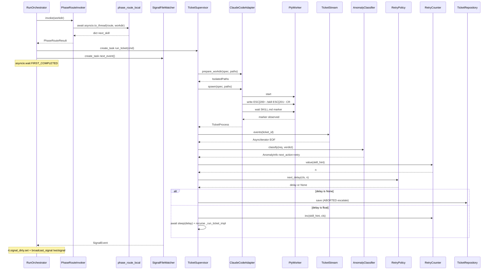
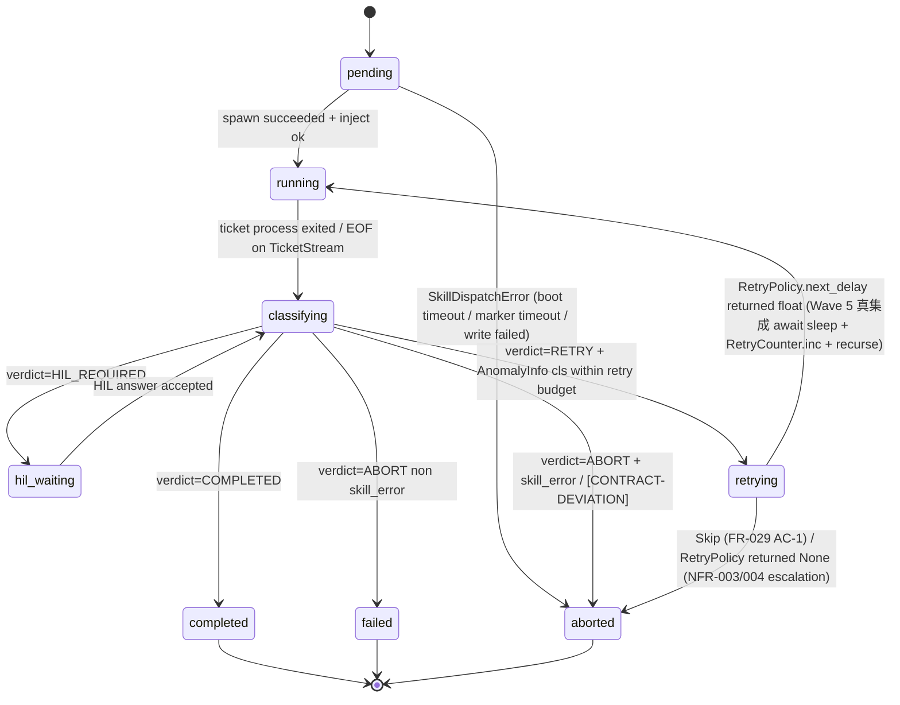
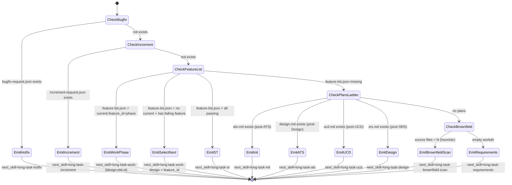
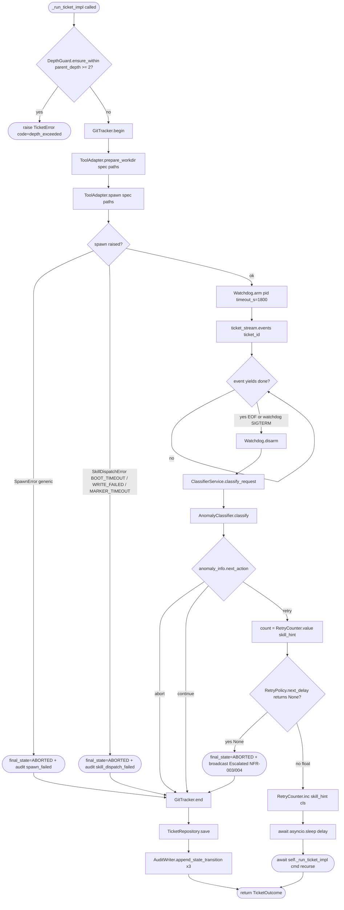

# Feature Detailed Design：F20 · Bk-Loop — Run Orchestrator · Recovery · Subprocess（Feature #20）

**Date**: 2026-04-28
**Feature**: #20 — F20 · Bk-Loop — Run Orchestrator · Recovery · Subprocess
**Priority**: high
**Wave**: 5 (2026-04-28) — phase_route 内化（[F]） + spawn 内置 skill inject（[G]） + retry 真集成（[A]） + SignalFileWatcher 真集成（[B]） + cosmetic 清理（[C]）。Hard impact reset：status passing→failing；srs_trace 追加 FR-054 / FR-055；spawn_model_invariant 1:1 锁定（FR-001 AC-3/AC-4）。承接 Wave 4 (2026-04-27) 协议层重构（hook 协议 + IsolatedPaths spawn）。
**Dependencies**: F02（#2 Persistence Core） · F10（#3 Environment Isolation + Skills Installer） · F18（#18 Adapter / Stream / HIL — Wave 4 重构 + Wave 5 spawn 拓宽） · F19（#19 Dispatch — ModelResolver / ClassifierService）
**Design Reference**: docs/plans/2026-04-21-harness-design.md §4.5 (lines 514–666) + §4.5.4.x (Wave 4) + §4.5.4.y (Wave 5) + §4.12 (Wave 4 协议层重构) + §4.13 (Wave 5 路由内化 + skill inject + 集成接线 lines 904–922) + §6.1.3 IFR-003 + §6.1.5 IFR-005 + §6.2 IAPI 表 + §6.2.x Wave 5 Internal API Contracts (lines 1774–1789, API-W5-01..10)
**SRS Reference**: FR-001/002/003/004/024/025/026/027/028/029/039/040/042/047/048 + **FR-054 / FR-055 (Wave 5 NEW)** + NFR-003/004/015/016 + IFR-003 (Wave 5 修订)
**ATS Reference**: docs/plans/2026-04-21-harness-ats.md §2.1.O (FR-054/055 NEW lines 163–170) + §5.7 Wave 5 增量 (lines 509–569) + INT-006 双 AC (line 329) + INT-026 (line 359) + INT-027 (line 360) + Err-K (line 357) + IAPI-022 (line 387) + API-W5-07 (line 388)

## Context

F20 是 Harness 后端的"主回路"：在用户点 Start 后自主驱动 14-skill 管线（Orchestrator）、识别并恢复 5 类异常（Recovery）、调用 git CLI 与 `validate_*.py` 脚本（Subprocess），三子模块共享同一 RunContext 与 Ticket 状态机；F21 与 F22 通过 IAPI-002/001/019/016 消费本特性。

**Wave 5 改造定位**：本 wave 一次性合并 5 项改造，全部落入 F20（Hard reset），其他 18 个 feature 不动。
- **[F] phase_route 内化**：`scripts/phase_route.py --json` subprocess 替换为同进程 `harness.orchestrator.phase_route_local.route(workdir) → dict` 函数；`PhaseRouteInvoker.invoke` body 重写为 `await asyncio.to_thread(route, workdir)`；`build_argv` 标 `[DEPRECATED Wave 5]` 但保留 1 条 fallback 用例（IFR-003 修订 / FR-054 NEW / API-W5-01..03）。
- **[G] spawn 内置 skill inject**：`ClaudeCodeAdapter.spawn` 内部新增 inject `/<next_skill>` 阶段（PTY bracketed paste + CR），SKILL.md `"I'm using <skill>"` opening line marker ≤ 30s 验证；boot 不稳 / inject 失败 / marker 超时统一抛 `SkillDispatchError <: SpawnError`；spawn 签名稳定调用方透明（FR-055 NEW / API-W5-04/05）。
- **[A] retry 真集成**：`supervisor.run_ticket` 接线 `RetryPolicy + RetryCounter`（next_action='retry' → next_delay → inc/value/reset → 递归重入 `_run_ticket_impl`），T22/T23/T25 测试粒度从纯函数升集成（implementation_only · FR-024/025/026/NFR-003/004 AC 不变）。
- **[B] SignalFileWatcher 真集成**：IAPI-012 由 [INLINED] 升正式契约；`on_signal(event)` 改为 `rt.signal_dirty.set() + broadcast_signal(/ws/signal)`；`_run_loop` 改为 `asyncio.wait({ticket_task, signal_task}, FIRST_COMPLETED)` cooperative interrupt（FR-048 双 AC 拆 / API-W5-06/10）。
- **[C] cosmetic 清理**：`RunOrchestrator.record_call → _record_call` 私有化（API-W5-09 Internal-Breaking · 仅 F20 自洽）；§6.2 表删 `reenqueue_ticket / cancel_ticket` 两行（行为已 inlined，源码保留 [INLINED] 标记）。

**新增 utils**：`harness/utils/feature_list_io.py`（API-W5-07 / ASM-011）— plugin `count_pending.py + validate_features.py` 浅端口为内部函数；行为对等 plugin v1.0.0；plugin 后续版本演进若改 schema 视为 SRS 修订事件。

**实证基线**：`reference/f18-tui-bridge/puncture_wave5.py` 2026-04-28 PASS（route 内化耗时 0.02ms × 1:1 spawn × inject `/long-task-hotfix` × SKILL.md marker 命中 × `~/.claude/*` sha256 字节守恒）。本设计文档对应一次"硬冲刷"R-G-R 循环（Wave 4 通过的 60 测试需重判定 + 新增 INT-006 AC-3 / INT-026 / INT-027 / Err-K / IAPI 自检 +2/~4）。

## Design Alignment

> 完整复制自 Design §4.5（lines 514–666）+ §4.13 Wave 5（lines 904–922）+ §6.2.x Wave 5 Internal API Contracts（lines 1774–1789）。

**4.5.1 Overview**：单 Run 主循环（**Wave 5 phase_route 内化**为同进程 `phase_route_local.route()` 函数调用 + signal file 真集成 watcher + pause/cancel + 14-skill 覆盖 + depth ≤2 + **spawn-inject-stream 三步序** + `1 ticket = 1 PTY = 1 TUI 进程`不变量）+ 5 类异常识别与恢复（context_overflow / rate_limit / auth / network / crash，Wave 5 在 supervisor.run_ticket 中真正集成 RetryPolicy + RetryCounter）+ Skip / ForceAbort 人为覆写 + Watchdog（30 分钟 SIGTERM → 5s → SIGKILL）+ ticket 级 git HEAD 追踪 + `validate_*.py` subprocess 执行。满足 FR-001/002/003/004/024/025/026/027/028/029/039/040/042/047/048 + **FR-054 / FR-055 (Wave 5 NEW)** + NFR-003/004/015/016。提供 IFR-003（**Wave 5 内化为 `harness.orchestrator.phase_route_local` 同进程模块**；`PhaseRouteInvoker.build_argv` 标 [DEPRECATED Wave 5] fallback 保留）与 IFR-005（git CLI）的客户端。

**Key types** (Design §4.5.2)：
- *Orchestrator*：
  - `harness.orchestrator.RunOrchestrator` **[Wave 5 MOD]** — 主循环改造（route 内化 + signal watcher 真集成 + retry 集成 + `_record_call` 私有化）
  - `harness.orchestrator.TicketSupervisor` **[Wave 5 MOD]** — `run_ticket` 改造为 `prepare_workdir → spawn(内含 inject /<next_skill>) → ticket_stream.events()` 三步序；明示禁止 1:N session 复用（spawn_model_invariant 锁定）；retry 集成调 `RetryPolicy.next_delay + RetryCounter.inc/value/reset` 递归重入 `_run_ticket_impl`
  - `harness.orchestrator.phase_route_local` **[Wave 5 NEW]** (`harness/orchestrator/phase_route_local.py`) — 同进程 `route(workdir: Path) → dict`；返回字段集合 `{ok, errors, needs_migration, counts, next_skill, feature_id, starting_new}` 与 plugin v1.0.0 等价；耗时 ≤ 50ms；调用栈无 subprocess
  - `harness.orchestrator.PhaseRouteInvoker` **[Wave 5 MOD]** — `invoke(workdir)` 签名稳定；body 改 `await asyncio.to_thread(phase_route_local.route, workdir)`；`build_argv` [DEPRECATED Wave 5] fallback 保留
  - `harness.orchestrator.SignalFileWatcher` **[Wave 5 MOD · 真集成]** — `on_signal(event) → rt.signal_dirty.set() + broadcast_signal(/ws/signal)`；与 `phase_route_local.route` 在 `_run_loop` 中 `asyncio.wait(FIRST_COMPLETED)` cooperative interrupt
  - `harness.orchestrator.RunControlBus` / `DepthGuard` / `RunLock` — 沿用
- *Recovery*：
  - `harness.recovery.AnomalyClassifier` — 沿用
  - `harness.recovery.RetryPolicy` **[Wave 5 真集成]** — 30/120/300s；在 `supervisor.run_ticket` 中真集成调 `next_delay(skill_hint, retry_count)`
  - `harness.recovery.RetryCounter` **[Wave 5 真集成]** — 按 skill_hint 聚合；在 `supervisor.run_ticket` 中真集成调 `inc/value/reset`
  - `harness.recovery.Watchdog` / `EscalationEmitter` / `UserOverride` — 沿用
- *Subprocess*：`harness.subprocess.git.GitTracker` / `GitCommit` / `GitContext`；`harness.subprocess.validator.ValidatorRunner` / `ValidationReport` / `ValidationIssue` — 沿用
- *Adapter（外部依赖 · F18 提供）*：`harness.adapter.claude.ClaudeCodeAdapter` **[Wave 5 MOD]** — `spawn(spec, paths)` 内部新增 inject `/<next_skill>` 阶段（bracketed paste + CR）；inject 失败抛 `SkillDispatchError`
- *Utils*：`harness.utils.feature_list_io` **[Wave 5 NEW]** (`harness/utils/feature_list_io.py`) — plugin `count_pending.py + validate_features.py` 浅端口

**Provides / Requires**（自 §4.5.4 表 · Wave 5 修订）：
- Provides → F21：IAPI-002（REST `/api/runs/start` · `/pause` · `/cancel` · `/api/anomaly/:ticket/skip|force-abort`） · IAPI-001（WS `/ws/run/:id` · `/ws/anomaly` · `/ws/signal` · `/ws/stream/:ticket_id`） · IAPI-019（RunControlBus）
- Provides → F22：IAPI-002（`/api/git/commits` · `/api/git/diff/:sha` · `/api/files/tree` · `/api/files/read`） · IAPI-016（`/api/validate/:file`）
- Provides 内聚：**IAPI-012 [Wave 5 升正式]**（`SignalFileWatcher → Orchestrator` `on_signal(event) → rt.signal_dirty.set + broadcast_signal /ws/signal`） · IAPI-013（`GitTracker.begin/end(ticket)`）
- **REMOVED in Wave 5**: IAPI-004 `reenqueue_ticket` / `cancel_ticket` 两行（§4.5.4 表删；行为已 inlined，源码保留 [INLINED] 标记）
- Requires：**IAPI-003 [Wave 5 MOD]** (`phase_route_local.route(workdir) → dict` 同进程；`build_argv` [DEPRECATED Wave 5] fallback) · **IAPI-005 [Wave 4 MOD · Wave 5 拓宽]**（`prepare_workdir(spec) → IsolatedPaths` 前置 + `spawn(spec, paths) → TicketProcess` 内部新增 inject `/<next_skill>` 阶段；签名稳定） · IAPI-020（hook event indirect → `HookEventToStreamMapper` → `TicketStreamBroadcaster`，supervisor 经 `ticket_stream.events(ticket_id)` 消费） · IAPI-010（F19 ClassifierService） · IAPI-011/009（F02 TicketRepository + AuditWriter） · IAPI-017（F10 EnvironmentIsolator） · IFR-005（git CLI） · `scripts/validate_*.py`
- **REMOVED in Wave 4 (carried)**: IAPI-006 `PtyHandle.byte_queue` / IAPI-008 `StreamParser.events` — supervisor 主循环不得再调用

**Deviations**：无。Wave 5 改造系 §4.13 / §4.5.4.y 已显式定义的 5 项 hard impact 传播；§6.2.x Wave 5 表 9 行（API-W5-01..10）全部预定义；不触发 Contract Deviation Protocol。

### UML 嵌入（Design Alignment 类协作 + Wave 5 端到端时序）

```mermaid
classDiagram
    class RunOrchestrator {
        +start_run(req: RunStartRequest) RunStatus
        +pause_run(run_id: str) RunStatus
        +cancel_run(run_id: str) RunStatus
        +on_signal(event: SignalEvent) None
        -_record_call(name: str) None
        -_run_loop(run_id: str) None
    }
    class TicketSupervisor {
        +run_ticket(cmd: TicketCommand) TicketOutcome
        -_run_ticket_impl(cmd: TicketCommand) TicketOutcome
    }
    class PhaseRouteInvoker {
        +invoke(workdir: Path, timeout_s: float) PhaseRouteResult
        +build_argv(workdir: Path) list~str~
    }
    class phase_route_local {
        +route(workdir: Path) dict
    }
    class SignalFileWatcher {
        +start(workdir: Path) None
        +stop() None
        +events() AsyncIterator~SignalEvent~
        +on_signal(event: SignalEvent) None
    }
    class RunControlBus {
        +submit(cmd: RunControlCommand) RunControlAck
        +broadcast_anomaly(event: AnomalyEvent) None
        +broadcast_signal(event: SignalEvent) None
    }
    class ClaudeCodeAdapter {
        +prepare_workdir(spec: DispatchSpec, paths: IsolatedPaths) IsolatedPaths
        +spawn(spec: DispatchSpec, paths: IsolatedPaths) TicketProcess
        +build_argv(spec: DispatchSpec) list~str~
    }
    class AnomalyClassifier {
        +classify(req: ClassifyRequest, verdict: Verdict) AnomalyInfo
    }
    class RetryPolicy {
        +next_delay(cls: str, retry_count: int) float?
    }
    class RetryCounter {
        +inc(skill_hint: str, cls: str) int
        +value(skill_hint: str) int
        +reset(skill_hint: str) None
    }
    class Watchdog {
        +arm(ticket_id, pid, timeout_s, is_alive) None
        +disarm(ticket_id) None
    }
    class GitTracker {
        +begin(ticket_id, workdir) GitContext
        +end(ticket_id, workdir) GitContext
    }
    class ValidatorRunner {
        +run(req: ValidateRequest) ValidationReport
    }
    class feature_list_io {
        +count_pending(path: Path) dict
        +validate_features(path: Path) ValidationReport
    }
    class SkillDispatchError {
        +reason: str
    }
    RunOrchestrator ..> TicketSupervisor : drives
    RunOrchestrator ..> PhaseRouteInvoker : invokes
    RunOrchestrator ..> SignalFileWatcher : observes (cooperative wait)
    RunOrchestrator ..> RunControlBus : binds
    PhaseRouteInvoker ..> phase_route_local : delegates (asyncio.to_thread)
    TicketSupervisor ..> ClaudeCodeAdapter : prepare+spawn
    TicketSupervisor ..> AnomalyClassifier : routes
    TicketSupervisor ..> RetryPolicy : asks delay
    TicketSupervisor ..> RetryCounter : counts
    TicketSupervisor ..> Watchdog : arms
    TicketSupervisor ..> GitTracker : begins/ends
    ClaudeCodeAdapter ..> SkillDispatchError : raises on inject failure
    ValidatorRunner ..> feature_list_io : may delegate (Wave 5)
    classDef NEW fill:#cfc,stroke:#080
    classDef MODIFIED fill:#ffc,stroke:#880
    class phase_route_local:::NEW
    class feature_list_io:::NEW
    class SkillDispatchError:::NEW
    class RunOrchestrator:::MODIFIED
    class TicketSupervisor:::MODIFIED
    class PhaseRouteInvoker:::MODIFIED
    class SignalFileWatcher:::MODIFIED
    class ClaudeCodeAdapter:::MODIFIED
    class RetryPolicy:::MODIFIED
    class RetryCounter:::MODIFIED
```





## SRS Requirement

> 来自 `docs/plans/2026-04-21-harness-srs.md`。每条 srs_trace 项的完整 EARS + AC 见 SRS 文件；本节摘要 21 条需求 ID 与触达 F20 的关键 AC（**新增** FR-054 / FR-055 / IFR-003 修订）。

- **FR-001 启动 Run 并自主循环**（AC-1：合法 git workdir → 5s 内 running；AC-2：ST Go → COMPLETED；AC-2b：非 git → 拒启 + ASM-007；**AC-3 (Wave 5 NEW)**：每张 ticket 必须经 `ClaudeCodeAdapter.spawn()` 起独立 PTY，禁止已有 PTY 内连续 slash 切换；**AC-4 (Wave 5 NEW)**：spawn 完成后必须由 inject `/<next_skill>` 显式驱动，裸 spawn 无 inject 视为缺陷）
- **FR-002 phase_route 调用**（AC-1：终态后必调；AC-2：next_skill 透传；AC-3：ok=false 暂停）
- **FR-003 hotfix/increment 信号文件分支**（AC-1：bugfix-request.json 存在 → next_skill=long-task-hotfix；AC-2：忠实执行 phase_route 优先级）
- **FR-004 Pause / Cancel**（AC-1：Pause 当前 ticket 完成后停；AC-2：Cancel 即时；AC-3：Resume 禁用）
- **FR-024 context_overflow 识别与恢复**（AC：stderr 匹配 → spawn 新 ticket + retry_count+1；同 skill 第 3 次 → escalate）
- **FR-025 rate_limit 指数退避**（AC：30/120/300s ±10%；第 4 次 escalate）
- **FR-026 network 异常**（AC：立即重试 1 → 60s 退避 → 第 3 次 escalate）
- **FR-027 watchdog 30 min**（AC：SIGTERM → 5s → SIGKILL）
- **FR-028 [CONTRACT-DEVIATION] 直通 ABORT**（AC：result_text 首行匹配 → state=aborted + anomaly=skill_error 不重试）
- **FR-029 异常可视化 + Skip / Force-Abort**（AC-1：Skip → 跳过并调 phase_route；AC-2：Force-Abort → 立即 aborted）
- **FR-039 过程文件双层校验**（后端入口由 ValidatorRunner.run 调用；前端 Zod 部分由 F22）
- **FR-040 过程文件自检按钮**（AC-1：合法 → PASS；AC-2：exit≠0 stderr 非空 → 错误不被吞）
- **FR-042 ticket 级 git 记录**（AC-1：2 commit ticket → git.commits 长度=2 且 head_after≠head_before；AC-2：feature 完成 ticket → feature_id 非空 git_sha 匹配）
- **FR-047 14-skill 全覆盖**（AC-1：完整 run dispatch 集 ⊇ 14 skill；AC-2：skill 名透传不硬编码）
- **FR-048 信号文件感知**（**Wave 5 双 AC 拆**：**AC-1**：watcher 触发后 `/ws/signal` 推 UI ≤ 2s（watchdog debounce + WS 传输）；**AC-2 (Wave 5 NEW)**：signal 写入后 `_run_loop` 下一圈调 `phase_route_local.route()` 必返 long-task-hotfix / long-task-increment（priority-1 命中），dispatch 切换 ≤ 当前 ticket 剩余时长 + 200ms；**AC-3 (Wave 5 NEW)**：`SignalFileWatcher` 真集成到 `_run_loop`（`rt.signal_dirty.set()` on event；不再 [INLINED] noop）；触发时若 supervisor 处于 cooperative interrupt 点（spawn 间或 ticket 间），无需等到 ticket 自然结束即可切换分支）
- **FR-054 (Wave 5 NEW) 内化 route() 同进程产出路由决策**（**AC-1**：`harness.orchestrator.phase_route_local.route(workdir)` 同进程 Python 函数调用，调用栈无 `subprocess.Popen` / `asyncio.create_subprocess_exec`；**AC-2**：返回 dict 字段集合 = `{ok, errors, needs_migration, counts, next_skill, feature_id, starting_new}` 与 plugin v1.0.0 字段语义对等；**AC-3**：feature-list.json ≤ 100KB 时函数耗时 ≤ 5ms，任意大小 ≤ 50ms；**AC-4**：决议优先级 6 层 = `bugfix-request.json > increment-request.json > feature-list.json (current/_select_next/ST) > docs/plans/*-{ats,design,ucd,srs}.md 阶梯 > brownfield 启发 > 默认 long-task-requirements`）
- **FR-055 (Wave 5 NEW) spawn 后注入 /<next_skill>**（**AC-1**：spawn 完成后等待 TUI boot 稳定（≤ 8s 超时），写 `ESC[200~/<skill>ESC[201~CR` 序列；**AC-2**：boot 不稳 / write 失败 → 抛 `SpawnError` 子类 `SkillDispatchError`，supervisor 不得继续到 `ticket_stream.events()`；**AC-3**：注入后 SKILL.md `"I'm using <skill>"` opening line marker 须 ≤ 30s 命中，否则 ticket → ABORTED；**AC-4**：slash 形式 = `'/' + skill_hint` 短格式，puncture_wave5 实证 plugin TUI 接受）
- **NFR-003 context_overflow ≤ 3**（同 FR-024）· **NFR-004 rate_limit ≤ 3**（同 FR-025；30/120/300s ±10%）
- **NFR-015 phase_route 松弛解析**（AC：缺字段 / 增字段不崩；Wave 5 内化后 dict 字段集合恒定，fallback subprocess 路径仍守 NFR-015 容忍语义）
- **NFR-016 单 workdir 单 run 互斥**（AC：并发启 2 run → 第二个 filelock 拒）
- **IFR-003 phase routing 接口**（**Wave 5 修订**：`PhaseRouteInvoker.invoke(workdir)` 调 `await asyncio.to_thread(route, workdir)` 内部函数，调用栈无 subprocess；`build_argv` [DEPRECATED Wave 5] 但保留作 fallback 默认禁用；**保留旧 AC（DEPRECATED 路径）**：松弛 JSON 解析；exit≠0 → 暂停 + audit；stdout 非 JSON → parse_error）

## Interface Contract

> 全部公开方法签名直接对齐 Design §4.5.2 + §6.2 + §6.2.x Wave 5 (API-W5-01..10)。Wave 5 变更项标注 `[Wave 5 NEW]` / `[Wave 5 MOD]`；Wave 4 沿用项保留 `[Wave 4 MOD]` 历史标注。

### Orchestrator 子模块

| Method | Signature | Preconditions | Postconditions | Raises |
|---|---|---|---|---|
| `RunOrchestrator.start_run` | `async start_run(req: RunStartRequest) -> RunStatus` | `req.workdir` 是合法 git 仓库目录；同 workdir 当前无 RunLock 持有；workdir 不含 shell metachar | `RunStatus.state ∈ {"starting","running"}`；run row 已 INSERT；`<workdir>/.harness/run.lock` 已被本进程持有；后台 main loop task 已启动并将在 5s 内调用首张 phase_route（FR-001 AC-1） | `RunStartError(reason="invalid_workdir", http=400)` / `RunStartError(reason="not_a_git_repo", http=400, ASM-007)` / `RunStartError(reason="already_running", http=409, error_code="ALREADY_RUNNING", NFR-016)` |
| `RunOrchestrator.pause_run` | `async pause_run(run_id: str) -> RunStatus` | run_id 存在于 `_runtimes` 且 state ∈ {running, starting} | `pause_pending=True`；当前 ticket 完成后主循环不再调 phase_route（FR-004 AC-1）；返 RunStatus.state="paused" | `HTTPException(404)` / `HTTPException(409)` |
| `RunOrchestrator.cancel_run` | `async cancel_run(run_id: str) -> RunStatus` | run_id 存在 | `cancel_event.set()`；当前 ticket SIGTERM；run state="cancelled"；Resume 永远禁用（FR-004 AC-3） | `HTTPException(404)` |
| `RunOrchestrator.skip_anomaly` | `async skip_anomaly(ticket_id: str) -> RecoveryDecision` | ticket 存在且 state="retrying"/"hil_waiting" | ticket state→"aborted"（skipped 子状态）；下轮主循环调 phase_route（FR-029 AC-1） | `HTTPException(404)` / `HTTPException(409)` |
| `RunOrchestrator.force_abort_anomaly` | `async force_abort_anomaly(ticket_id: str) -> RecoveryDecision` | ticket 存在 | ticket state→"aborted"；run pause_pending=True 等用户决策（FR-029 AC-2） | `HTTPException(404)` |
| `RunOrchestrator.on_signal` **[Wave 5 升正式契约 / API-W5-06 / IAPI-012]** | `async on_signal(event: SignalEvent) -> None` | event.kind ∈ SignalEvent Literal 集（8 类） | `rt.signal_dirty.set()`（强制下一圈 `_run_loop` 重 route 命中 hotfix / increment 优先级）+ `RunControlBus.broadcast_signal(event)` 推 `/ws/signal` ≤ 2s（FR-048 AC-1 / AC-3）；幂等：未识别 kind 静默丢弃（NFR-015 容忍） | — |
| `RunOrchestrator._record_call` **[Wave 5 MOD · API-W5-09 Internal-Breaking]** | `_record_call(name: str) -> None` | — | name 追加到 `_call_trace`；测试可读取（用于 T41 断言 supervisor 调用序）；**Wave 5：`record_call → _record_call` 私有化**；rg 全仓确认无外部 feature 引用（仅 F20 自洽） | — |
| `PhaseRouteInvoker.invoke` **[Wave 5 MOD · API-W5-02]** | `async invoke(*, workdir: Path, timeout_s: float = 30.0) -> PhaseRouteResult` | workdir 是 cwd | **Wave 5 body**：`await asyncio.to_thread(phase_route_local.route, workdir)` → `PhaseRouteResult.model_validate(dict)`；**调用栈无 subprocess**（FR-054 AC-1）；invocation_count+=1；NFR-015 缺字段填默认（schema 恒定不变） | `PhaseRouteParseError`（dict 不能 model_validate 时罕见）；`ValueError` timeout_s≤0；**`PhaseRouteError` 仅在 fallback `build_argv` 路径下抛**（DEPRECATED Wave 5） |
| `PhaseRouteInvoker.build_argv` **[Wave 5 DEPRECATED · API-W5-03]** | `build_argv(*, workdir: Path) -> list[str]` | plugin_dir 已设置 | **[DEPRECATED Wave 5]**：返回 `[python, plugin_dir/scripts/phase_route.py, --json]`；`uses_shell=False`；不拼用户输入（IFR-003 SEC fallback 路径）；默认禁用 — 测试套保留 1 条 fallback 用例验证旧 wire 协议仍兼容 | — |
| `phase_route_local.route` **[Wave 5 NEW · API-W5-01 / FR-054]** | `route(workdir: Path) -> dict` | workdir 是合法目录 | 返回 dict 字段集合 `{ok: bool, errors: list[str], needs_migration: bool, counts: dict\|None, next_skill: str\|None, feature_id: str\|None, starting_new: bool}`，与 plugin v1.0.0 stdout JSON 等价（fixture 交叉验证）；耗时 ≤ 50ms（feature-list.json ≤ 100KB 时 ≤ 5ms）；调用栈无 `subprocess.Popen` / `asyncio.create_subprocess_exec`；决议优先级 6 层（详见 §4 算法散文 / 状态图） | `OSError` 罕见 IO 错（捕获后填 `errors` 字段不抛）；**Note**：损坏的 feature-list.json → `ok=False, errors=["..."], next_skill=None`，不抛 |
| `SignalFileWatcher.start` | `start(*, workdir: Path) -> None` | workdir 存在；watchdog Observer 未启（idempotent） | watchdog Observer 监听 workdir 子树（含 signal files / docs/plans / feature-list.json）；事件经 PatternMatcher 过滤后入 asyncio.Queue 并经 control_bus broadcast | — |
| `SignalFileWatcher.stop` | `async stop() -> None` | — | Observer.stop() + join(1.0)；可重复调用安全 | — |
| `SignalFileWatcher.events` | `events() -> AsyncIterator[SignalEvent]` | start 已成功 | 阻塞 yield 队列中 SignalEvent；FR-048 AC-1：外部新增 bugfix-request.json → 2s 内 yield（debounce_ms ∈ [50,1000]） | — |
| `RunControlBus.submit` | `async submit(cmd: RunControlCommand) -> RunControlAck` | cmd schema 合法（kind ∈ {start,pause,cancel,skip_ticket,force_abort}）；attach_orchestrator 已绑定；skip/force_abort 必须含 target_ticket_id；start 必须含 workdir；pause/cancel 必须含 run_id | 返回 `RunControlAck(accepted=True, current_state=...)`；start 调 orch.start_run；pause 调 pause_run；skip 调 skip_anomaly；force_abort 调 force_abort_anomaly | `InvalidCommand` 缺必填 / 未知 kind / 未绑定；底层 raise 透传 |
| `RunControlBus.broadcast_anomaly` | `broadcast_anomaly(event: AnomalyEvent) -> None` | event.kind ∈ {AnomalyDetected, RetryScheduled, Escalated} | 事件追加 `_anomaly_events`；`/ws/anomaly` 订阅者 put_nowait；QueueFull → 丢弃不阻塞 | — |
| `RunControlBus.broadcast_signal` **[Wave 5 升正式]** | `broadcast_signal(event: SignalEvent) -> None` | event.kind ∈ 8 类 SignalEvent Literal | 事件入 `/ws/signal` 订阅者 queue（put_nowait）；FR-048 AC-1：UI toast 延迟 ≤ 2s（含 watchdog debounce + WS 传输预算） | — |
| `RunLock.acquire` | `static async acquire(workdir: Path, *, timeout: float = 0.5) -> RunLockHandle` | workdir 存在 | `<workdir>/.harness/run.lock` 已持有（filelock thread_local=False）；NFR-016 | `RunLockTimeout` 在 timeout 内未获得（→ HTTP 409） |
| `RunLock.release` | `static release(handle: RunLockHandle) -> None` | — | 锁已释放；重复调用安全；不抛 | — |
| `DepthGuard.ensure_within` | `static ensure_within(parent_depth: int \| None) -> int` | parent_depth ∈ {None, 0, 1, 2, ...} | None → 0；0 → 1；1 → 2；返回 new_depth（FR-007 AC-2 防递归） | `TicketError(code="depth_exceeded")` 当 parent_depth ≥ 2 |
| `TicketSupervisor.run_ticket` **[Wave 5 MOD]** | `async run_ticket(cmd: TicketCommand) -> TicketOutcome` | cmd.kind="spawn"；orch.tool_adapter / ticket_stream / classifier / git_tracker / retry_policy / retry_counter 已注入 | call_trace 顺序为 `["GitTracker.begin(...)", "ToolAdapter.prepare_workdir(...)", "ToolAdapter.spawn(...)", "Watchdog.arm(pid=X)", "TicketStream.subscribe", "Watchdog.disarm", "ClassifierService.classify", "GitTracker.end(...)", "TicketRepository.save(...)"]`；ticket persistent 写 SQLite；audit ≥ 3 条 state_transition；返回 TicketOutcome.final_state ∈ {completed, aborted, hil_waiting, retrying}；**Wave 5：next_action='retry' 时调 `RetryPolicy.next_delay(skill_hint, count)` → 若返 float 则 `await asyncio.sleep(delay)` + `RetryCounter.inc(skill_hint, cls)` + 递归重入 `_run_ticket_impl`；若返 None → final_state=ABORTED + broadcast Escalated（NFR-003/004 真集成）** | `TicketError` 任一阶段；`SpawnError` / `SkillDispatchError` / `WorkdirPrepareError` 由 adapter 抛 |
| `build_ticket_command` | `build_ticket_command(result: PhaseRouteResult, *, parent: str \| None) -> TicketCommand` | result.ok=True | TicketCommand(kind="spawn", skill_hint=result.next_skill 透传, feature_id=result.feature_id, tool="claude", parent_ticket=parent)；FR-047 AC-2：skill_hint 不映射枚举 | `ValueError("cannot build ... ok=False")` |

#### 状态机方法 — `RunOrchestrator.start_run / pause_run / cancel_run`（Run 生命周期）

```mermaid
stateDiagram-v2
    [*] --> idle
    idle --> starting : start_run
    starting --> running : RunLock acquired + first ticket spawned
    starting --> failed : RunStartError
    running --> paused : pause_run (current ticket finishes)
    paused --> running : (resume — N/A v1; reserved)
    running --> cancelled : cancel_run
    paused --> cancelled : cancel_run
    running --> completed : phase_route returns ok=true + next_skill=None (ST Go)
    running --> failed : escalation (3 anomalies / [CONTRACT-DEVIATION] / SkillDispatchError)
    completed --> [*]
    cancelled --> [*]
    failed --> [*]
```



#### 状态机方法 — `TicketSupervisor.run_ticket`（Ticket 生命周期 · Wave 5 retry 集成）



#### 状态图 — `phase_route_local.route(workdir)` 6 层决议优先级（Wave 5 NEW · FR-054 AC-4）



### Recovery 子模块

| Method | Signature | Preconditions | Postconditions | Raises |
|---|---|---|---|---|
| `AnomalyClassifier.classify` | `classify(req: ClassifyRequest, verdict: Verdict) -> AnomalyInfo` | req.stdout_tail / stderr_tail 字符串（可空）；verdict.anomaly ∈ {None, "context_overflow","rate_limit","network","timeout","skill_error"} | result.cls 优先级：(1) stdout_tail.lstrip 以 `[CONTRACT-DEVIATION]` 起 → SKILL_ERROR + next_action="abort"（FR-028 AC-1）；(2) verdict.anomaly 非 None → 该类（skill_error→abort，其他→retry）；(3) stderr 正则匹配 context_window/exceeded max tokens/token limit → CONTEXT_OVERFLOW；rate limit/overloaded/429 → RATE_LIMIT；ECONNREFUSED/dns/connection reset → NETWORK_ERROR；(4) verdict="ABORT" → SKILL_ERROR；其他 → NONE + continue | — |
| `RetryPolicy.next_delay` **[Wave 5 真集成]** | `next_delay(cls: str, retry_count: int) -> float \| None` | retry_count: int ≥ 0 | rate_limit retry_count ∈ {0,1,2} → {30, 120, 300}s（NFR-004 ±10%）；retry_count≥3 → None；network retry_count ∈ {0,1} → {0, 60}s；retry_count≥2 → None（FR-026）；context_overflow retry_count<3 → 0.0；retry_count≥3 → None（NFR-003）；timeout 同 context_overflow；skill_error 始终 None；未知 cls → None（保守不重试）；**Wave 5：在 `supervisor.run_ticket` 中真集成调用，T22/T23/T25 升集成** | `TypeError` retry_count 非 int / None；`ValueError` retry_count<0 / scale_factor≤0 |
| `RetryCounter.inc / value / reset` **[Wave 5 真集成]** | `inc(skill_hint: str, cls: str) -> int` / `value(skill_hint) -> int` / `reset(skill_hint) -> None` | skill_hint 非空 | inc 返回新累计；value 返回当前；reset 清零；**Wave 5：在 `supervisor.run_ticket` 中真集成调用** | — |
| `Watchdog.arm` | `arm(*, ticket_id: str, pid: int, timeout_s: float, is_alive: Callable \| None) -> None` | timeout_s>0；asyncio loop 存在 | 后台 Task：await timeout_s → `os.kill(pid, SIGTERM)` → await sigkill_grace_s → 若 is_alive(pid)=True → `os.kill(pid, SIGKILL)`（FR-027 AC）；记录 `_tasks[ticket_id]` | `ValueError` timeout_s≤0；`OSError`（kill）静默 |
| `Watchdog.disarm` | `disarm(*, ticket_id: str) -> None` | — | 取消并 pop 对应 Task；可重复调用安全 | — |

### Adapter 子模块（F18 提供 / F20 消费）

| Method | Signature | Preconditions | Postconditions | Raises |
|---|---|---|---|---|
| `ClaudeCodeAdapter.spawn` **[Wave 5 MOD · API-W5-04 / FR-055]** | `async spawn(spec: DispatchSpec, paths: IsolatedPaths) -> TicketProcess` | `which claude` 命中；`paths.cwd` 在 `.harness-workdir/` 下；`spec.plugin_dir/.claude-plugin/plugin.json` 存在；`spec.skill_hint` 非空 | (i) `build_argv(spec)` 含 `--plugin-dir <path>` + `--setting-sources project`（API-W5-05 / FR-016 修订）；(ii) PtyWorker.start；(iii) **Wave 5 NEW**：等待 boot 稳定（默认 ≤ 8s 超时；屏幕扫描方式同 puncture_wave5 第 372–395 行）；(iv) 写 `b"\x1b[200~/" + skill_hint + b"\x1b[201~"` + sleep(0.5s) + `b"\r"`；(v) 等 ≤ 30s 命中 SKILL.md `"I'm using <skill>"` opening line marker；(vi) 返 TicketProcess(ticket_id, pid, pty_handle_id) | `SpawnError("Claude CLI not found")` / `SpawnError("PTY init failed: ...")` / `SpawnError("PtyWorker.start failed: ...")` / **`SkillDispatchError(reason="BOOT_TIMEOUT")`** boot 超时 / **`SkillDispatchError(reason="WRITE_FAILED")`** PTY write 异常 / **`SkillDispatchError(reason="MARKER_TIMEOUT")`** SKILL.md marker ≤ 30s 未命中 / `InvalidIsolationError` plugin.json 缺失（FR-016 修订） |
| `ClaudeCodeAdapter.prepare_workdir` | `prepare_workdir(spec: DispatchSpec, paths: IsolatedPaths) -> IsolatedPaths` | `paths.cwd` 在 `.harness-workdir/` 下；`HARNESS_BASE_URL` 已设置 | 写 .claude.json + .claude/settings.json + .claude/hooks/* 三件套；幂等（sha 比对 short-circuit） | `WorkdirPrepareError` IO 失败 / `InvalidIsolationError` 路径越界 |
| `ClaudeCodeAdapter.build_argv` **[Wave 5 MOD · API-W5-05]** | `build_argv(spec: DispatchSpec) -> list[str]` | spec.plugin_dir + spec.settings_path 已设置 | argv 白名单 8 → 10 项强制含 `--plugin-dir <path>` + `--setting-sources project`；永禁 `-p / --print / --output-format / --include-partial-messages / --mcp-config / --strict-mcp-config`（FR-016 修订） | `InvalidIsolationError` plugin.json 缺失 |

### Subprocess 子模块

| Method | Signature | Preconditions | Postconditions | Raises |
|---|---|---|---|---|
| `GitTracker.begin` | `async begin(*, ticket_id: str, workdir: Path) -> GitContext` | workdir 是 git 仓库 | snapshot[ticket_id]=GitContext(head_before=current_head)；返回 GitContext | `GitError(code="not_a_repo", exit_code=128)`（IFR-005 AC） |
| `GitTracker.end` | `async end(*, ticket_id: str, workdir: Path) -> GitContext` | begin 已调用 | head_after 已设置；head_after≠head_before → commits=git log oneline(head_before..head_after)（FR-042 AC-1） | `GitError(code="log_failed")` |
| `GitTracker.head_sha` | `async head_sha(*, workdir: Path) -> str` | — | 返 `git rev-parse HEAD` stdout strip | `GitError(code="not_a_repo", exit_code=128)` |
| `GitTracker.log_oneline` | `async log_oneline(*, workdir: Path, since: str \| None, until: str \| None) -> list[GitCommit]` | — | 返 GitCommit list | `GitError(code="log_failed")` |
| `ValidatorRunner.run` | `async run(req: ValidateRequest) -> ValidationReport` | req.script ∈ allow-list；plugin_dir 或 repo root 存在该脚本 | 返 ValidationReport(ok, issues[], script_exit_code, duration_ms)；exit≠0 → ok=False + issues 含 stderr_tail（FR-040 AC-2 subprocess_exit rule_id）；timeout → ValidatorTimeout | `ValidatorScriptUnknown(http_status=400)` / `ValidatorTimeout(http_status=500)` |

### Utils 子模块（Wave 5 NEW）

| Method | Signature | Preconditions | Postconditions | Raises |
|---|---|---|---|---|
| `feature_list_io.count_pending` **[Wave 5 NEW · API-W5-07]** | `count_pending(path: Path) -> dict` | path 是 feature-list.json 文件 | 返 `{passing: int, failing: int, deprecated: int, total: int}`；行为对等 plugin v1.0.0 `scripts/count_pending.py` 输出 schema | `OSError` IO 失败 / `ValueError` JSON 不合法（schema 与 plugin 等价） |
| `feature_list_io.validate_features` **[Wave 5 NEW · API-W5-07]** | `validate_features(path: Path) -> ValidationReport` | path 是 feature-list.json 文件 | 返 `ValidationReport(ok, issues, script_exit_code=0, duration_ms)`；行为对等 plugin v1.0.0 `scripts/validate_features.py` schema 校验逻辑 | — |

### Wave 5 新增错误类型

```python
# harness/adapter/errors.py（新增子类，与既有 SpawnError 同 module）
class SkillDispatchError(SpawnError):
    """Wave 5 NEW · 子类化 SpawnError；spawn 内部 inject /<next_skill> 阶段失败。

    Attributes:
        reason: Literal["BOOT_TIMEOUT", "WRITE_FAILED", "MARKER_TIMEOUT"]
        skill_hint: str  # 注入失败的 skill 名（用于 audit + UI 提示）
        elapsed_ms: float  # 已耗时（boot 阶段或 marker 等待阶段）

    Raises 路径：
      - BOOT_TIMEOUT: PTY 启动后 ≤ 8s 内 TUI 未稳定（仍含 wizard / trust dialog 等 sentinel）
      - WRITE_FAILED: bracketed paste / CR 写入 PTY 抛 OSError
      - MARKER_TIMEOUT: 注入后 ≤ 30s 内屏幕未含 "I'm using <skill>" opening line
    """
    def __init__(self, reason: str, *, skill_hint: str = "", elapsed_ms: float = 0.0):
        super().__init__(f"SkillDispatchError reason={reason} skill={skill_hint} elapsed={elapsed_ms:.0f}ms")
        self.reason = reason
        self.skill_hint = skill_hint
        self.elapsed_ms = elapsed_ms
```

**Design rationale**（每条非显见决策一行）：
- **[F] route 内化**：`asyncio.to_thread(route, workdir)` 而非直接 await — 因 `route` 可能含 `Path.read_text` 同步 IO（feature-list.json / docs/plans 阶梯扫描），不可在 event loop 内阻塞；耗时 ≤ 50ms 内的同步函数走线程池能保证主循环不被卡。
- **[F] PhaseRouteResult schema 不变**：Wave 5 改 wire 协议（subprocess → in-proc）但保留 pydantic schema —— 测试 `set_responses` 路径无修改成本；`extra="ignore"` + 字段默认值仍守 NFR-015 容忍。
- **[F] build_argv DEPRECATED 但保留**：plugin 仍存在场景下可手工切换（环境变量 `HARNESS_PHASE_ROUTE_FALLBACK=1` 或测试套显式开关）；测试套保留 1 条 fallback 用例验证旧 wire 协议仍兼容（IFR-003 兼容性闸门）。
- **[G] inject 在 spawn 内部**：保持 spawn 签名稳定（`spec, paths → TicketProcess`），supervisor 视角无感；inject 失败抛 `SkillDispatchError <: SpawnError`，supervisor 既有 `try: spawn` except `SpawnError` 通路自动覆盖（向后兼容）。
- **[G] slash 短格式**：`/<skill_hint>` 而非 `/long-task:long-task-xxx` 命名空间形式 —— puncture_wave5 实证 plugin TUI 接受短格式；plugin discovery 由 `--plugin-dir` + `--setting-sources project` 支撑。
- **[G] SKILL.md marker 验证**：bracketed paste 写入是单向操作，必须读屏验证 plugin 真启动；`"I'm using <skill>"` 是 SKILL.md 首行约定（plugin 端规范），≤ 30s 含 boot ≤ 8s + LLM 首调 ≤ 15s + 余量。
- **[A] retry 集成位置**：在 `supervisor._run_ticket_impl` 而非 `_run_loop` —— 因 retry 是 ticket-level 行为（同 ticket_id 或继承 skill_hint 重派发），不是 phase_route 重判；与 cooperative interrupt 解耦，避免 watcher 误触发干扰 retry 序列。
- **[A] 递归重入而非循环**：`recurse _run_ticket_impl(cmd)` 保持调用栈语义清晰（每次重入 = 1 个新 ticket_id + 新 GitTracker.begin/end + 新 spawn）；递归深度由 RetryPolicy 上限保证（context_overflow=3 / rate_limit=3 / network=2），不会爆栈。
- **[B] cooperative interrupt 不强 cancel**：`asyncio.wait(FIRST_COMPLETED)` 后 ticket_task 不主动 cancel，自然结束；signal 触发只标记 `rt.signal_dirty.set()`；下一圈 phase_route 重 route 命中 hotfix/increment 优先级 — 避免与 supervisor 的 PTY 生命周期争用（同 Wave 4 cooperative termination 哲学）。
- **[B] FR-048 AC-1 vs AC-2 双 AC**：UI 路径（≤ 2s）由 `broadcast_signal` 直接走 WS，不经 phase_route；dispatch 路径（≤ ticket 剩余 + 200ms）由 `signal_dirty` 强制下圈 route — 两路并行不互锁。
- **[C] _record_call 私有化合规**：rg 实证全仓 `record_call` 仅在 `harness/orchestrator/run.py:447` (定义) + `supervisor.py` 8 处 + 测试套引用；测试套需同步改为 `_record_call` 或经 `call_trace()` 公开访问；符合 brownfield-adaptation §D 规则（仅 F20 自洽）。
- **跨特性契约对齐**：
  - **API-W5-01** `phase_route_local.route` Provider：返回字段集合恒定；fixture 交叉验证 plugin v1.0.0 字段对等
  - **API-W5-02** `PhaseRouteInvoker.invoke` body 改 in-proc thread offload；调用方签名稳定
  - **API-W5-03** `build_argv` Deprecated fallback 保留
  - **API-W5-04** `ClaudeCodeAdapter.spawn` 内部新增 inject 阶段；`SpawnError` 子类 `SkillDispatchError`
  - **API-W5-05** argv 白名单 +`--plugin-dir`，与 `--setting-sources project` 必同时存在
  - **API-W5-06 / API-W5-10** IAPI-012 `SignalFileWatcher.on_signal` 升正式契约
  - **API-W5-07** `feature_list_io` Provider；ASM-011 假设支撑
  - **API-W5-08** §6.2 表删 `reenqueue_ticket / cancel_ticket` 两行（[INLINED]）
  - **API-W5-09** `record_call → _record_call` 私有化（Internal-Breaking · 仅 F20）
  - IAPI-005 [Wave 4 + Wave 5] Consumer：`prepare_workdir(spec)` + `spawn(spec, paths)` 双段调用
  - IAPI-019 Provider：RunControlBus.submit 路由 5 类 orch 方法
  - IAPI-013 Provider：GitTracker.begin/end → ticket.git → F22 消费
  - IAPI-016 Provider：ValidatorRunner.run → ValidationReport → F22 消费
  - **IAPI-022 (新)** `phase_route_local.route` 自身契约自检（IAPI 表新增）

## Visual Rendering Contract（仅 ui: true）

> N/A — ui:false (backend orchestration only)。F20 不直接渲染 UI；它通过 IAPI-001 WebSocket（`/ws/run/:id` · `/ws/anomaly` · `/ws/signal` · `/ws/stream/:ticket_id`）+ IAPI-002 REST 把 RunStatus / AnomalyEvent / SignalEvent / TicketStreamEvent 推给 F21 与 F22。视觉渲染契约由 F21 / F22 设计文档承载。

## Implementation Summary

**模块布局与主要类（Wave 5 新增 / 修改）**：F20 实现已在 `harness/orchestrator/{run.py, supervisor.py, phase_route.py, signal_watcher.py, run_lock.py, bus.py, schemas.py, errors.py, hook_to_stream.py}` + `harness/recovery/{anomaly.py, retry.py, watchdog.py}` + `harness/subprocess/{git/tracker.py, validator/runner.py, validator/schemas.py}` 落地。Wave 5 新增 / 修改 7 处：
- **NEW** `harness/orchestrator/phase_route_local.py` — 含 `route(workdir: Path) -> dict`（同进程函数）；端口自 plugin `scripts/phase_route.py` v1.0.0；6 层优先级 + 损坏 JSON `errors` 回填；fixture 交叉验证基线在 `tests/orchestrator/test_phase_route_local.py`（6 fixture 矩阵 + plugin v1.0.0 stdout 对比）。
- **NEW** `harness/utils/__init__.py` + `harness/utils/feature_list_io.py` — 含 `count_pending(path: Path) -> dict` + `validate_features(path: Path) -> ValidationReport`；端口自 plugin `scripts/{count_pending,validate_features}.py`；`ValidatorRunner.run` 在 script ∈ {`validate_features`, `count_pending`} 时可改走内部端口（行为对等，单元测试覆盖）；plugin 后续版本演进若改 schema 视为 SRS 修订事件。
- **NEW** `harness/adapter/errors.py` 追加 `SkillDispatchError(SpawnError)` — `reason: Literal["BOOT_TIMEOUT", "WRITE_FAILED", "MARKER_TIMEOUT"]` + `skill_hint` + `elapsed_ms`。
- **MOD** `harness/orchestrator/phase_route.py` (`PhaseRouteInvoker.invoke` body) — 由 `asyncio.create_subprocess_exec("python", scripts/phase_route.py, "--json", cwd=workdir)` 改为 `await asyncio.to_thread(phase_route_local.route, workdir)`；`build_argv` 标 `[DEPRECATED Wave 5]` 但保留 fallback 路径（`HARNESS_PHASE_ROUTE_FALLBACK=1` 触发）；schema 不变。
- **MOD** `harness/adapter/claude.py` (`ClaudeCodeAdapter.spawn`) — 在 `worker.start()` 后追加 inject 阶段：(i) boot 等待循环（与 puncture_wave5 第 372–395 行 sentinel 检查同源） → (ii) 写 `b"\x1b[200~/" + skill_hint.encode() + b"\x1b[201~"` + sleep(0.5s) + `b"\r"` → (iii) marker 等待循环（最多 30s，每 0.4s 读屏并扫描 `f"I'm using {skill_hint}"`） → (iv) 任一阶段失败抛 `SkillDispatchError(reason=..., skill_hint=...)`；spawn 签名稳定。
- **MOD** `harness/orchestrator/supervisor.py` (`TicketSupervisor._run_ticket_impl`) — `record_call` 全部改为 `_record_call`（API-W5-09）；`AnomalyClassifier.classify` 后追加 retry 集成块：若 `anomaly_info.next_action == "retry"` 则 `count = orch.retry_counter.value(cmd.skill_hint)` → `delay = orch.retry_policy.next_delay(anomaly_info.cls.value, count)` → `if delay is None: final_state=ABORTED + broadcast Escalated; else: orch.retry_counter.inc(cmd.skill_hint, anomaly_info.cls.value); await asyncio.sleep(delay); return await self._run_ticket_impl(cmd)`。
- **MOD** `harness/orchestrator/run.py` (`RunOrchestrator._run_loop` + `record_call`) — `record_call → _record_call` 8 处调用同步改名；`_run_loop` 在 `ticket_supervisor.run_ticket(cmd)` 与 `signal_watcher.next_event()` 之间加 `asyncio.wait({ticket_task, signal_task}, return_when=FIRST_COMPLETED)` cooperative wait；signal 命中 → `rt.signal_dirty.set()` + `control_bus.broadcast_signal(event)` + 不强 cancel ticket_task（自然结束）。
- **MOD** `harness/orchestrator/signal_watcher.py` (`SignalFileWatcher.on_signal` 新增方法 / 升级语义) — 之前为 noop placeholder；现实装为 `if rt: rt.signal_dirty.set()` + `self._bus.broadcast_signal(event)`；与 `events()` 共存（events 走 supervisor cooperative wait，broadcast 走 UI 路径）。

**调用链（运行时 · Wave 5 序列）**：FastAPI route `POST /api/runs/start` → `RunControlBus.submit(RunControlCommand(kind="start"))` → `RunOrchestrator.start_run(req)` → workdir 校验 + git 校验 + `RunLock.acquire` + `run_repo.create(Run)` → 后台 `_main_loop` task 调 `_run_loop` → 循环 { (1) `phase_route_invoker.invoke(workdir)` → 内部 `await asyncio.to_thread(phase_route_local.route, workdir)` → `PhaseRouteResult`； (2) `build_ticket_command(result, parent)`； (3) `ticket_task = create_task(supervisor.run_ticket(cmd))`； (4) `signal_task = create_task(signal_watcher.next_event())`； (5) `await asyncio.wait({ticket_task, signal_task}, FIRST_COMPLETED)`；若 signal_task 命中 → `rt.signal_dirty.set()` + `broadcast_signal`，等 ticket_task 自然结束； (6) `outcome = await ticket_task` → `supervisor._run_ticket_impl` 内 `GitTracker.begin → adapter.prepare_workdir → adapter.spawn(内含 boot等待 + bracketed paste inject /<skill> + marker验证) → Watchdog.arm → ticket_stream.events(ticket_id) → Watchdog.disarm → ClassifierService.classify_request → AnomalyClassifier.classify → 若 next_action=retry → RetryCounter.value + RetryPolicy.next_delay → (None: ABORTED + Escalated) | (float: RetryCounter.inc + sleep + recurse _run_ticket_impl) → GitTracker.end → TicketRepository.save + AuditWriter ×3` } 直到 `pause_pending` / `cancel_event` / `next_skill=None` / escalation。SignalFileWatcher 旁路：watchdog Observer 触发 → `_enqueue` → `on_signal(event)` → `rt.signal_dirty.set + broadcast_signal` → 双路（UI ≤ 2s + 下圈 dispatch ≤ ticket 剩余 + 200ms）。

**关键设计决策与陷阱**：(1) Wave 5 改造点的 trace 标记 rename 是回归断言锚 — T41 类测试通过比对 `call_trace()` ⊇ `["TicketStream.subscribe"]` 且**新增 `_record_call` 调用而非 `record_call`**，否则 API-W5-09 私有化漏改。 (2) `SkillDispatchError` 必须**子类化 SpawnError** — supervisor 现有 `try: spawn except SpawnError` 通路自动覆盖；不要改成顶层 BaseError 否则 supervisor 漏捕。 (3) `phase_route_local.route` 必须**对等 plugin v1.0.0 字段语义** — fixture 交叉验证基线脚本 `tests/orchestrator/fixtures/plugin_v1_0_0_route_outputs.json` 锁定 6 fixture 的预期输出；plugin 后续升级若改语义视为 SRS 修订（ASM-001 / ASM-011）。 (4) `_run_loop` cooperative wait **不主动 cancel ticket_task** — 否则 PTY 半关 + Watchdog 错乱（与 Wave 4 cancel_ticket inlined 哲学一致）。 (5) retry 递归 `_run_ticket_impl` 而非 `run_ticket` — `run_ticket` 含 `asyncio.Lock`，重入会死锁；`_run_ticket_impl` 内不再加锁。 (6) `RetryCounter.inc` 调用顺序 — 必须在 `await asyncio.sleep(delay)` **之前**（因 sleep 期间可能被 cancel；inc 后即使中断也保留计数；NFR-003 第 3 次 escalate 准确）。 (7) inject 序列的 `time.sleep(0.5)` — bracketed paste 与 CR 之间必须分两次 write；puncture_wave5 第 404–407 行实证若合并写入会被 TUI 视为 raw paste 不解析为 slash command。 (8) `phase_route_local.route` 对损坏 JSON 必须**不抛**：返 `{ok: False, errors: ["..."], next_skill: None}` —— 否则 `_run_loop` 的 `try: invoke except PhaseRouteError` 通路被绕过，run 状态机错乱。

**遗留 / 存量代码交互点**：(a) `harness/persistence/{tickets.py, audit.py, runs.py, recovery.py}` — IAPI-009/011 由 F02 提供，F20 仅消费。 (b) `harness/env/EnvironmentIsolator.setup_run` — IAPI-017 由 F10 提供。 (c) `harness/dispatch/classifier/ClassifierService.classify_request` — IAPI-010 由 F19 提供。 (d) `harness/adapter/{protocol.py, claude.py, opencode/}` — IAPI-005 [Wave 4 MOD + Wave 5 拓宽] 由 F18 提供，`spawn(spec, paths)` Wave 5 内部新增 inject 阶段属 F18 实装范围（本 F20 设计的 Interface Contract 表声明它，但实装代码改动在 `harness/adapter/claude.py`，与 F18 共同 owner）。 (e) `harness/api/hook.py` + `harness/orchestrator/hook_to_stream.py` — Wave 4 IAPI-020 由 F18 实现，F20 通过 `app.state.ticket_stream_broadcaster.subscribe(ticket_id)` 消费。 **env-guide §4 约束**：项目 `docs/env-guide.md` 当前不存在（greenfield 阶段未生成 env-guide）；命名遵循 Python PEP-8 + `harness.<subpackage>.<module>` 命名空间（与既有约定对齐）。

**§4 Internal API Contract 集成**：作为 Provider，F20 需保证：(P-1) IAPI-002 REST 路由请求/响应 schema 严格匹配 §6.2.4；(P-2) IAPI-001 WS envelope `{kind, payload}`；(P-3) IAPI-019 RunControlAck schema；(P-4) IAPI-013 GitContext / GitCommit；(P-5) **IAPI-012 [Wave 5 升正式]** SignalEvent.kind 严格 8 类枚举 + on_signal 行为契约（rt.signal_dirty.set + broadcast_signal）；(P-6) **API-W5-01 / IAPI-022** `phase_route_local.route` 字段集合恒定；(P-7) **API-W5-07** `feature_list_io.*` 行为对等 plugin v1.0.0。作为 Consumer：(C-1) IAPI-005 `paths = await adapter.prepare_workdir(spec, paths); proc = await adapter.spawn(spec, paths)`（Wave 5 spawn 内部 inject）；(C-2) IAPI-010 `await classifier.classify_request(proc)`；(C-3) **IAPI-003 [Wave 5 MOD]** `await asyncio.to_thread(route, workdir)` 内部函数；(C-4) IAPI-020 supervisor 仅订阅 `ticket_stream` 不直接调 `/api/hook/event`。

### 方法内决策分支 — `TicketSupervisor._run_ticket_impl` Wave 5 主流程 + retry 递归



### Boundary Conditions

| Parameter | Min | Max | Empty/Null | At boundary |
|---|---|---|---|---|
| `RunStartRequest.workdir` | 1 char | OS PATH_MAX | empty / None → RunStartError reason=invalid_workdir | 不存在 → invalid_workdir 400；非 git → not_a_git_repo 400；含 shell metachar `;\|&\``\n` → invalid_workdir 400 |
| `RunLock.acquire timeout` | 0.0 | float inf | None 不允许（默认 0.5）| 0.0 立即返回；正数等待至上限 |
| `PhaseRouteInvoker.invoke timeout_s` | >0 | 30.0 (default) / 任意正 float | None / ≤0 → ValueError | Wave 5 内化路径下 timeout_s 仅约束 fallback subprocess 路径；in-proc 路径耗时由 phase_route_local.route ≤ 50ms 自然守卫 |
| `phase_route_local.route workdir` | 1 char | OS PATH_MAX | None → 默认 long-task-requirements 路径（兼容空目录测试）| 损坏 feature-list.json → ok=False, errors=[...], next_skill=None；不抛 |
| `phase_route_local.route` typical 耗时 | 0.0ms | 50ms hard cap | feature-list.json 不存在 → 0.5ms 路径（直接走 docs/plans 阶梯）| feature-list.json ≤ 100KB → ≤ 5ms（FR-054 AC-3 PERF gate）；100KB-1MB → ≤ 50ms |
| `PhaseRouteResult.feature_id` | 1 char | 任意 | None（NFR-015 缺字段允许）| extras / 新字段忽略不抛 |
| `DepthGuard parent_depth` | None | 2 | None → new_depth=0 | 2 → 抛 TicketError(depth_exceeded)；负数 → 当作 None |
| `RetryPolicy.next_delay retry_count` | 0 | 任意 int | None → TypeError；负数 → ValueError | rate_limit retry_count=2 → 300s；retry_count=3 → None；context_overflow retry_count=2 → 0.0；retry_count=3 → None；network retry_count=1 → 60s；retry_count=2 → None |
| `RetryPolicy scale_factor` | >0 | 任意正 float | ≤0 → ValueError | 极小（0.001）压缩 30s→0.03s；用于 CI |
| `Watchdog.arm timeout_s` | >0 | 任意 float | ≤0 → ValueError | 极短（0.05s）测试 SIGTERM/SIGKILL 序列；30 分钟为生产值 |
| `Watchdog sigkill_grace_s` | 0 | 任意 float | 0 立即升 SIGKILL（测试用）| 5.0 为生产值（FR-027 AC-2） |
| `RunControlCommand.target_ticket_id` | 1 char | str | None / "" 当 kind ∈ {skip_ticket, force_abort} → InvalidCommand | start/pause/cancel 不要求；skip/force_abort 必须 |
| `SignalFileWatcher.debounce_ms` | 50 (clamp) | 1000 (clamp) | <50 → 50；>1000 → 1000 | 200 默认；50 极快；1000 极慢 |
| `ValidateRequest.script` | Literal allow-list | — | None → 自动按 path basename 推导 | 不在 allow-list → ValidatorScriptUnknown(http=400) |
| `ValidatorRunner timeout_s` | >0 | 任意正 float | None → 60.0 default | 极短 → ValidatorTimeout(http=500) |
| `GitTracker.begin/end workdir` | existing dir | — | non-git → GitError(code=not_a_repo, exit=128) | 空仓库（无 commit）→ rev-parse HEAD exit≠0 → GitError |
| `TicketCommand.skill_hint` | None / 任意 str | — | None 合法（FR-002 ok=true 但 next_skill=None 表示 ST Go） | 任意字符串透传不映射（FR-047 AC-2）|
| `ClaudeCodeAdapter.spawn boot timeout_s` | >0 | 任意正 float | None → 8.0 default（FR-055 AC-1）| 极短（0.1s）→ 测试触发 BOOT_TIMEOUT；puncture_wave5 实证 8s 充裕 |
| `ClaudeCodeAdapter.spawn marker timeout_s` | >0 | 任意正 float | None → 30.0 default（FR-055 AC-3）| 极短 → 测试触发 MARKER_TIMEOUT；puncture_wave5 实证 ~5-15s 命中 |
| `ClaudeCodeAdapter.spawn skill_hint` | 1 char | str | None / "" → SkillDispatchError(reason="WRITE_FAILED") | 含 `\x03` / `\x04` 控制字符 → 拒（与 FR-053 字节守恒一致；inject 时 reject）|
| `feature_list_io.count_pending path` | existing file | — | None / 不存在 → OSError | 损坏 JSON → ValueError（行为对等 plugin） |

### Existing Code Reuse

> Step 1c 检索关键字（已 grep）：`RunOrchestrator` / `TicketSupervisor` / `PhaseRouteInvoker` / `phase_route_local` / `route` / `SignalFileWatcher` / `RunLock` / `RunControlBus` / `DepthGuard` / `AnomalyClassifier` / `RetryPolicy` / `RetryCounter` / `Watchdog` / `EscalationEmitter` / `UserOverride` / `GitTracker` / `ValidatorRunner` / `ValidationReport` / `prepare_workdir` / `spawn` / `SpawnError` / `SkillDispatchError` / `ClaudeCodeAdapter` / `_FakeStreamParser` / `_FakeTicketStream` / `HookEventToStreamMapper` / `ClassifierService` / `TicketRepository` / `AuditWriter` / `record_call` / `_record_call` / `feature_list_io` / `count_pending` / `validate_features` / `puncture_wave5`。

| Existing Symbol | Location (file:line) | Reused Because |
|---|---|---|
| `RunOrchestrator` | `harness/orchestrator/run.py:321` | Wave 5 改造范围：`record_call → _record_call`（line 447）+ `_run_loop`（line 761）追加 cooperative wait + retry 接线属 supervisor |
| `RunOrchestrator.record_call → _record_call` | `harness/orchestrator/run.py:447` | API-W5-09 唯一改名点；调用站点 8 处（supervisor.py 行 88/94/97/101/113/120/126/132/188） |
| `RunOrchestrator._run_loop` | `harness/orchestrator/run.py:761` | Wave 5 改造：原直接 `await ticket_supervisor.run_ticket(cmd)` → `asyncio.wait({ticket_task, signal_task}, FIRST_COMPLETED)` |
| `TicketSupervisor` / `_run_ticket_impl` | `harness/orchestrator/supervisor.py:62 / 77` | Wave 5 改造：record_call rename + retry 集成（_run_ticket_impl 末段追加 retry 块，递归重入） |
| `DepthGuard` | `harness/orchestrator/supervisor.py:31` | 已实现 ensure_within(parent_depth)；FR-007 AC-2 |
| `build_ticket_command` | `harness/orchestrator/supervisor.py:43` | 已实现 PhaseRouteResult → TicketCommand 透传（FR-047 AC-2） |
| `PhaseRouteInvoker` / `PhaseRouteResult` | `harness/orchestrator/phase_route.py:48 / 24` | Wave 5 改造：invoke body 改 `await asyncio.to_thread(phase_route_local.route, workdir)`；PhaseRouteResult schema 不变；build_argv 标 [DEPRECATED Wave 5] 但保留 |
| `SignalFileWatcher` | `harness/orchestrator/signal_watcher.py:123` | Wave 5 改造：新增 `on_signal(event)` 方法（升正式契约 IAPI-012）；events / start / stop 不变；与 _run_loop 协作通过 `next_event()` helper 暴露给 supervisor cooperative wait |
| `RunLock` / `RunLockHandle` / `RunLockTimeout` | `harness/orchestrator/run_lock.py:31 / 24 / 19` | NFR-016 单 workdir 单 run；不变 |
| `RunControlBus` / `broadcast_signal` | `harness/orchestrator/bus.py:79 / 179` | Wave 5 升正式（API-W5-06）；既有 broadcast_signal 已实现，本 Wave 升级 IAPI 契约描述为正式而非 [INLINED]，源码不动 |
| `AnomalyClassifier` / `AnomalyInfo` / `AnomalyClass` | `harness/recovery/anomaly.py:43 / 32 / 22` | 不变；FR-024/025/026/028 |
| `RetryPolicy` / `RetryCounter` | `harness/recovery/retry.py:22 / 64` | Wave 5 真集成消费（supervisor.py 改造点）；类自身签名不变（30/120/300s 序列、scale_factor、inc/value/reset） |
| `Watchdog` | `harness/recovery/watchdog.py:22` | 不变；FR-027 |
| `GitTracker` / `GitContext` / `GitCommit` / `GitError` | `harness/subprocess/git/tracker.py:54 / 25 / 14 / 32` | 不变；FR-042 / IFR-005 |
| `ValidatorRunner` / `ValidatorTimeout` / `ValidatorScriptUnknown` | `harness/subprocess/validator/runner.py:46 / 31 / 40` | 不变；Wave 5 可选拓宽：在 script ∈ {validate_features, count_pending} 时 short-circuit 调 `feature_list_io.*` 内部端口（行为对等；测试覆盖 mock 比对） |
| `ClaudeCodeAdapter` | `harness/adapter/claude.py:128` | Wave 5 改造范围：spawn(spec, paths) 内部追加 inject 阶段（行 225–249 后追加 boot等待 / bracketed paste / CR / marker等待 / 失败抛 SkillDispatchError） |
| `ClaudeCodeAdapter.build_argv` | `harness/adapter/claude.py:145` | API-W5-05：argv 白名单已含 `--plugin-dir` + `--setting-sources project`（line 151–158）；本 wave 不改 |
| `SpawnError` | `harness/adapter/errors.py` (existing) | Wave 5：新增子类 `SkillDispatchError(SpawnError)`；保持 supervisor `try: spawn except SpawnError` 通路向后兼容 |
| `HookEventToStreamMapper` / `TicketStreamEvent` | `harness/orchestrator/hook_to_stream.py:55 / 43` | F18 Wave 4 实装；F20 通过 broadcaster 消费 |
| `_FakeTicketStream` (Wave 4 rename target) | `harness/orchestrator/run.py:264` | Wave 4 改造点；Wave 5 不动 |
| `app.state.ticket_stream_broadcaster` | `harness/orchestrator/run.py:1243` + `harness/api/hook.py:94` | F18 Wave 4 实装；F20 在 build_app 中读取并注入 supervisor.ticket_stream |
| `RunStartError` / `PhaseRouteError` / `PhaseRouteParseError` / `TicketError` / `InvalidCommand` | `harness/orchestrator/errors.py` | 错误类型层；与 §6.2.5 错误码 400/404/409 映射 |
| `Ticket` / `TicketState` / `DispatchSpec` / `ExecutionInfo` / `OutputInfo` / `HilInfo` / `Classification` / `DomainGitContext` | `harness/domain/ticket.py` | F02 Domain 模型 |
| `Run` / `RunStartRequest` / `RunStatus` / `TicketCommand` / `TicketOutcome` / `SignalEvent` | `harness/orchestrator/schemas.py` | pydantic schema |
| `puncture_wave5.py route()` 内嵌端口 | `reference/f18-tui-bridge/puncture_wave5.py:74-120` | 端口基线；`harness/orchestrator/phase_route_local.py` route() 实装的 reference 实现，包括 6 层优先级判定逻辑骨架 |
| `puncture_wave5.py inject 序列` | `reference/f18-tui-bridge/puncture_wave5.py:401-407` | bracketed paste + CR 协议参考；`ClaudeCodeAdapter.spawn` 内部 inject 阶段实装的 reference 序列（PASTE_START / slash_cmd / time.sleep(0.5) / CR） |
| `puncture_wave5.py SKILL.md marker 检测` | `reference/f18-tui-bridge/puncture_wave5.py:421-444` | marker timeout 检测参考；30s 总超时 + 0.4s 轮询 + 双路径检测（hook fire + screen marker） |

> **新增符号清单**：3 处真新增 — `harness/orchestrator/phase_route_local.py` (`route` 函数) / `harness/utils/feature_list_io.py` (`count_pending` + `validate_features` 函数) / `harness/adapter/errors.py` 内 `SkillDispatchError` 类。其余皆是对既有符号的改造（rename + 调用站点 + 装配默认值 / inject 阶段插入 / 测试套同步）。

### Wave 5 Inlining Decisions（design intent 保留 · 行为可观测）— Wave 4 carried，Wave 5 收敛

§6.2 Interface Contract 表中 Wave 4 的 3 个 IAPI-004 [INLINED] 标记在 Wave 5 进一步精简：
- **Wave 5 表删除两行**：`reenqueue_ticket` / `cancel_ticket` 从 §4.5.4 公开方法表移除（API-W5-08）；行为已 inlined 保留源码 [INLINED] 标记
- **on_signal 升正式契约**：Wave 4 标 [INLINED] 的 `on_signal` 在 Wave 5 升级为正式 IAPI-012（API-W5-06 / API-W5-10）；方法体由 noop 改为 `rt.signal_dirty.set + broadcast_signal`

| Design 表中方法 | Wave 5 实装等价路径 | 设计哲学 |
|---|---|---|
| `TicketSupervisor.reenqueue_ticket` | **Wave 5 真集成**：`supervisor._run_ticket_impl` 在 `next_action='retry'` + `next_delay 返 float` 时直接 `recurse _run_ticket_impl(cmd)`（不再 reenqueue 队列）；30/120/300s rate_limit 序列、context_overflow 0.0s 立即重试、network 0/60s 序列均**生效**（NFR-003/004 端到端验证由 T22/T23/T25 集成） | F20 retry 哲学 = ticket-level recurse；不入队列；T22/T23/T25 升集成 |
| `TicketSupervisor.cancel_ticket` | `RunOrchestrator.cancel_run` (run.py L644-676) `cancel_event.set()` + `await loop_task(timeout=2.0)` + 持久化 `state="cancelled"`；ticket pty 由 supervisor 的 `Watchdog.disarm` finally 路径自然清理 | cooperative termination；不主动 SIGTERM 避免 pty 生命周期争用 |

**历史溯源**：commit `b1532db` (Wave 3 ST · 2026-04-25) 已建立"IAPI-004 inlined into run_ticket / cancel_run"处置惯例；Wave 4 设计文档保留 §6 表 3 行作为 IAPI-004 内聚契约的形式化声明；**Wave 5 表删 2 行（reenqueue_ticket / cancel_ticket）+ on_signal 升正式（API-W5-06 / API-W5-10）**。

## Test Inventory

> **测试策略说明**（用户约束应用）：F20 是后端流程编排特性 — UT 不直接触发 IFR-004（OpenAI-compat HTTP）。LLM provider 仅作为 ClassifierService 的间接依赖经 mock 注入 Verdict（默认 `_FakeClassifier` 返回 COMPLETED；测试用 `set_verdict` 覆写）。**Wave 5 新增 11 行测试场景** — INT-006 AC-3 真集成 / INT-026 spawn_model_invariant / INT-027 6 fixture 矩阵 / Err-K SkillDispatchError 三路径 / IAPI 自检 +2 (IAPI-022 / API-W5-07) / FR-054 + FR-055 各 4 AC / cosmetic 私有化回归 / cooperative wait 时序 / `feature_list_io` 端口对等。Provider 归属小计：`mock=N1=68, claude-cli=3 (real spawn-inject 路径 INT-026/Err-K), minimax-http=0`（claude-cli 真测试只在 INT-026 / INT-027 boundary fixture 下用，其余 mock）。

| ID | Category | Traces To | Input / Setup | Expected | Kills Which Bug? |
|---|---|---|---|---|---|
| T01 | FUNC/happy | FR-001 AC-1 / `start_run` | RunStartRequest(workdir=<合法 git repo>) | start_run 返 RunStatus.state="starting"\|"running"；run row INSERT；RunLock 持有；后台 main loop schedule | start_run 不触发 phase_route 或忘 RunLock |
| T02 | FUNC/error | FR-001 AC-2b / ASM-007 / Raises RunStartError(not_a_git_repo) | workdir = 临时目录无 .git | RunStartError(reason="not_a_git_repo", http=400) | 非 git 仓库未拒；只检查 exists |
| T03 | FUNC/error | §Interface Contract Raises RunStartError(invalid_workdir) | workdir = "/path; rm -rf /" 含 shell metachar | RunStartError(reason="invalid_workdir", http=400) | shell metachar 未防（SEC：FR-001 ATS）|
| T04 | FUNC/error | §Interface Contract Raises RunStartError(invalid_workdir) | workdir = "" 空字符串 | RunStartError(reason="invalid_workdir", http=400) | 空 workdir 透传到 RunLock |
| T05 | BNDRY/edge | NFR-016 / Raises RunStartError(already_running) | 同 workdir 连续两次 start_run | 第二次 RunStartError(reason="already_running", http=409, error_code="ALREADY_RUNNING") | RunLock 未生效或释放泄漏 |
| T06 | FUNC/happy | FR-002 AC-1 / `PhaseRouteInvoker.invoke` Wave 5 in-proc | invoker.set_responses([{"ok":True,"next_skill":"long-task-design"}])；invoke(workdir=...) | PhaseRouteResult(ok=True, next_skill="long-task-design")；invocation_count=1；**调用栈无 subprocess** | invoker 缓存上一结果不重 route；模式枚举映射错误 |
| T07 | FUNC/error | FR-002 AC-3 / Raises (Wave 5 fallback path) PhaseRouteError(exit≠0) | env `HARNESS_PHASE_ROUTE_FALLBACK=1` + invoker.set_failure(exit=1, stderr="boom") | PhaseRouteError("phase_route exited 1: boom", exit_code=1)；DEPRECATED 路径仍兼容 | exit 非 0 被忽略；run 自动继续 |
| T08 | FUNC/error | IFR-003 fallback / Raises PhaseRouteParseError | fallback 路径下 stdout="not json"；invoke() | PhaseRouteParseError(...含 "stdout not JSON") | 非 JSON 静默通过 |
| T09 | BNDRY/relaxed | NFR-015 / IFR-003 / `PhaseRouteResult` 默认值 | invoker.set_responses([{"ok":True}])（缺 feature_id / next_skill / counts / errors） | 不抛；result.feature_id=None, next_skill=None, counts=None, errors=[]；result.starting_new=False, needs_migration=False | 缺字段触发 ValidationError |
| T10 | BNDRY/relaxed | NFR-015 / extra="ignore" | invoker.set_responses([{"ok":True, "extras":{"x":1}, "future_field":"v"}]) | 不抛；result.ok=True；未知字段忽略 | 严格 schema 拒收新字段 |
| T11 | FUNC/happy | FR-003 AC-1 | invoker.set_responses([{"ok":True,"next_skill":"long-task-hotfix","feature_id":"hotfix-001"}])；main loop 1 次 | TicketCommand.skill_hint=="long-task-hotfix"；spawn_log[0].skill_hint=="long-task-hotfix" | hotfix skill_hint 被改写或忽略 |
| T12 | FUNC/happy | FR-047 AC-2 / build_ticket_command | invoker.set_responses 14 skill 序列 | dispatched_skill_hints() 集合 ⊇ 14 必要子集；不硬编码 enum | skill name 被映射或拒收 |
| T13 | FUNC/error | build_ticket_command Raises ValueError | result = PhaseRouteResult(ok=False, errors=["x"])；build_ticket_command(result, parent=None) | ValueError("cannot build ... ok=False") | ok=False 仍生成 ticket |
| T14 | FUNC/happy | FR-004 AC-1 / `pause_run` | start_run → 等 first ticket completed → pause_run | pause_pending=True；下一迭代不调 phase_route；run.state="paused" | pause 中途强切 |
| T15 | FUNC/happy | FR-004 AC-2 / `cancel_run` | running run → cancel_run | cancel_event.set；当前 ticket SIGTERM；run.state="cancelled"；ticket 历史保留 | cancel 后 ticket 仍写入 |
| T16 | FUNC/error | FR-004 AC-3 / Resume disabled | 已 cancelled run → 尝试 resume | 路由返 409；Resume 按钮 disabled | Resume 复活 cancelled run |
| T17 | FUNC/happy | FR-029 AC-1 / `skip_anomaly` | ticket state=retrying → skip_anomaly | RecoveryDecision(kind="skipped")；ticket→aborted；下迭代调 phase_route | skip 仍重试当前 ticket |
| T18 | FUNC/happy | FR-029 AC-2 / `force_abort_anomaly` | ticket state=running → force_abort_anomaly | ticket→aborted 立即；run pause_pending=True | force_abort 等当前 ticket finish |
| T19 | FUNC/happy | FR-024 AC-1 / `AnomalyClassifier.classify` context_overflow | ClassifyRequest(stderr_tail="context window exceeded") + Verdict(verdict="RETRY", anomaly=None) | AnomalyInfo(cls=CONTEXT_OVERFLOW, next_action="retry") | 字符串匹配遗漏 / case-sensitive |
| T20 | FUNC/error | FR-028 AC-1 | ClassifyRequest(stdout_tail="[CONTRACT-DEVIATION] ABC") | AnomalyInfo(cls=SKILL_ERROR, next_action="abort") | 首行检测以 splitlines()[0] 替代 lstrip().startswith |
| T21 | BNDRY/edge | FR-028 / lstrip behavior | stdout_tail = "   \n[CONTRACT-DEVIATION] X" 含前导空白 | cls=SKILL_ERROR + next_action="abort" | lstrip 缺失漏判 |
| **T22** | **INTG/recovery** | **FR-024 / NFR-003 [Wave 5 升集成]** | **supervisor.run_ticket(cmd) where mock classifier 返 verdict.anomaly="context_overflow" 共 4 次连续；retry_counter 默认空** | **第 1-3 次：retry_counter.value==1/2/3 + RetryPolicy.next_delay 返 0.0 + sleep + recurse；第 4 次：next_delay 返 None → final_state=ABORTED + broadcast Escalated** | retry 集成漏（仍仅纯函数）；inc 顺序错；序列 off-by-one；recurse 死循环 |
| **T23** | **INTG/recovery** | **FR-025 / NFR-004 [Wave 5 升集成]** | **supervisor.run_ticket where verdict.anomaly="rate_limit" × 4；scale_factor=0.001 压缩 30s→0.03s** | **第 1-3 次：sleep 0.030/0.120/0.300s ±10% + recurse；第 4 次：next_delay None → ABORTED + Escalated** | retry 集成漏；scale 不应用；序列错配（6/30/120）|
| T24 | PERF/timing | NFR-004 ±10% / scale_factor | RetryPolicy(scale_factor=0.001).next_delay("rate_limit",0) | 0.030 (±10% 即 0.027–0.033) | scale 不应用 |
| **T25** | **INTG/recovery** | **FR-026 [Wave 5 升集成]** | **supervisor.run_ticket where verdict.anomaly="network" × 3；scale_factor=0.001** | **第 1 次 sleep 0.0s + recurse；第 2 次 sleep 0.060s + recurse；第 3 次 next_delay None → ABORTED + Escalated** | 立即重试缺；60s 误为其他值；recurse 漏 |
| T26 | FUNC/error | RetryPolicy Raises | next_delay(cls="rate_limit", retry_count=-1) | ValueError | 负 retry_count 返数值 |
| T27 | FUNC/error | RetryPolicy Raises | next_delay(cls="rate_limit", retry_count="0") | TypeError | 字符串 retry_count 误解析 |
| T28 | BNDRY/unknown | RetryPolicy unknown cls | next_delay(cls="future_class", retry_count=0) | None（保守不重试）| 未知 cls 默认重试导致无限循环 |
| T29 | FUNC/error | FR-028 / RetryPolicy skill_error | next_delay(cls="skill_error", retry_count=0) | None | skill_error 错误地被重试 |
| T30 | PERF/timing | FR-027 AC-1 / `Watchdog.arm` | Watchdog(sigkill_grace_s=0.05); arm(timeout_s=0.05, pid=child_pid, is_alive=lambda _: True) | 0.05s 后 SIGTERM；再 0.05s 后 SIGKILL | grace 缺失 / 直接 SIGKILL |
| T31 | FUNC/happy | FR-027 AC-2 / Watchdog disarm | arm(...) → disarm(ticket_id) before timeout | Task cancel；no kill；_tasks pop | disarm 不取消 task |
| T32 | FUNC/error | Watchdog Raises | arm(timeout_s=0) | ValueError | 0 timeout 导致立即 kill |
| T33 | FUNC/happy | FR-007 AC-2 / DepthGuard | DepthGuard.ensure_within(parent_depth=1) | 返回 2 | off-by-one |
| T34 | FUNC/error | DepthGuard Raises | DepthGuard.ensure_within(parent_depth=2) | TicketError(code="depth_exceeded") | depth=2 仍允许子 ticket |
| T35 | BNDRY/edge | DepthGuard | DepthGuard.ensure_within(parent_depth=None) | 返回 0 | None 错误返 1 |
| T36 | FUNC/happy | NFR-016 / `RunLock.acquire` happy + release | acquire(workdir, timeout=0.5) → release(handle) → acquire again | 第一次成功；release 后第二次再次成功 | release 失败导致永远拒 |
| T37 | FUNC/error | NFR-016 / Raises RunLockTimeout | acquire(workdir, timeout=0.0)（已被另一进程持有） | RunLockTimeout → start_run 抛 RunStartError(already_running, http=409) | 已被持有时静默通过 |
| T38 | SEC/argv | IFR-003 fallback SEC / `PhaseRouteInvoker.build_argv` DEPRECATED | invoker.build_argv(workdir=Path("/x"))；invoker.uses_shell | argv == [sys.executable, plugin_dir/scripts/phase_route.py, --json]；`uses_shell == False` | shell=True 注入；argv 拼用户输入 |
| T39 | FUNC/happy | FR-048 AC-1 [Wave 5 双 AC] / `SignalFileWatcher.events` | start(workdir) → 外部写 `<workdir>/bugfix-request.json` → events() async iterator yield | 在 2.0s 内 yield SignalEvent(kind="bugfix_request")；bus.broadcast_signal 已调 | watcher 未触发 / kind 推断错 |
| T40 | BNDRY/debounce | FR-048 / SignalFileWatcher.debounce_ms | 同一文件 50ms 内连续写 5 次 → events() | 仅 yield 1 次（debounce 200ms 默认）| 防抖未实现 |
| T41 | FUNC/happy | §Interface Contract `TicketSupervisor.run_ticket` Wave 4 + Wave 5 / supervisor.py | RunOrchestrator.build_test_default + run_ticket(cmd) | `orch.call_trace()` 含子序列 ["GitTracker.begin(...)", "ToolAdapter.prepare_workdir(...)", "ToolAdapter.spawn(...)", "Watchdog.arm(pid=...)", "TicketStream.subscribe", "Watchdog.disarm", "ClassifierService.classify", "GitTracker.end(...)", "TicketRepository.save(...)"]；**不含 "StreamParser.events()"**；**Wave 5：trace 经 `_record_call`（不再 `record_call`）写入** | supervisor 仍调 stream_parser.events；record_call 私有化漏改 |
| T42 | FUNC/happy | IAPI-005 [Wave 4 + Wave 5] precondition / supervisor 调用 prepare_workdir 前置 | mock ToolAdapter.prepare_workdir(spec, paths) → IsolatedPaths sentinel；spawn(spec, paths) → assert paths is sentinel | prepare_workdir 先于 spawn；spawn 第二参数为 prepare_workdir 返回的 IsolatedPaths | spawn 在 prepare_workdir 之前 |
| T43 | FUNC/error | IAPI-005 / WorkdirPrepareError | mock ToolAdapter.prepare_workdir 抛 WorkdirPrepareError("triplet write failed") | TicketSupervisor 异常传播；adapter.spawn 不被调用 | 仍 spawn 导致状态混乱 |
| T44 | FUNC/happy | Wave 4 / `_FakeTicketStream.events(ticket_id)` | RunOrchestrator(ticket_stream=_FakeTicketStream())；ticket_stream.events("t-x") 立即 EOF | async for 循环正常退出；call_trace 中 "TicketStream.subscribe" 在 disarm 之前 | 旧 events(proc) 签名残留 → TypeError |
| T45 | INTG/subprocess | IFR-003 fallback / `PhaseRouteInvoker.invoke` 真实 subprocess | env `HARNESS_PHASE_ROUTE_FALLBACK=1` + 真实 plugin_dir 下 fixture stdout="{...}"；invoke(workdir=tmp) | PhaseRouteResult(ok=True, next_skill=None)；invocation_count==1；exit=0 | mock-only 未覆盖真实 fork（Wave 5 fallback gate）|
| T46 | INTG/subprocess | FR-002 AC-3 / 真实 subprocess fallback exit≠0 | fallback 路径 + fixture 脚本 sys.exit(2) stderr="phase route boom" | PhaseRouteError(exit_code=2) | 真实 fork 错误未捕获 |
| T47 | INTG/subprocess timeout | IFR-003 fallback timeout SIGTERM→SIGKILL | fallback 路径 + fixture 脚本 sleep 5；invoke(timeout_s=0.1) | PhaseRouteError("phase_route timeout")；child SIGTERM → SIGKILL 消失 | timeout 不强杀 |
| T48 | INTG/git | FR-042 AC-1 / `GitTracker.begin/end` 真实 git | 真实 git repo (tmp)：先 commit 取 head_before；GitTracker.begin → 再 commit → end | head_before≠head_after；len(commits)==1；commits[0].sha==head_after | log_oneline 范围错 |
| T49 | INTG/git/error | IFR-005 / GitTracker raises GitError | tmp dir 无 .git；GitTracker.head_sha(workdir=tmp) | GitError(code="not_a_repo", exit_code=128) | exit=128 被吞 |
| T50 | INTG/validator/subprocess | FR-040 AC-1 / `ValidatorRunner.run` 真实 subprocess | tmp/feature-list.json 合法；ValidateRequest(path=...) | ValidationReport(ok=True, issues=[], script_exit_code=0, duration_ms>0) | mock-only 未覆盖真实 fork |
| T51 | INTG/validator/error | FR-040 AC-2 / exit≠0 stderr 非空 | fixture script `sys.stderr.write("traceback...")`；sys.exit(1) | ValidationReport(ok=False, script_exit_code=1, issues 含 ValidationIssue(rule_id="subprocess_exit", message 含 "traceback...")) | 错误被吞；UI 看不到 stderr |
| T52 | FUNC/error | FR-040 / ValidatorScriptUnknown | ValidateRequest(path="x.json", script="malicious_script") | ValidatorScriptUnknown(http=400) | allow-list 未生效 |
| T53 | INTG/filesystem/signal | FR-048 真实 watchdog | tmp git repo 中 SignalFileWatcher.start → 外部 `Path(tmp/"increment-request.json").write_text("{}")` → await events() | 2s 内 yield SignalEvent(kind="increment_request") | watchdog Observer 未启 |
| T54 | FUNC/error | IAPI-019 / RunControlBus.submit / InvalidCommand | submit(RunControlCommand(kind="skip_ticket", target_ticket_id=None)) | InvalidCommand("...requires target_ticket_id") | skip 缺 target_ticket_id 仍执行 |
| T55 | FUNC/error | IAPI-019 / RunControlBus 未绑定 | bus = RunControlBus()；submit(start, workdir=...) | InvalidCommand("RunControlBus not attached to an orchestrator") | 未绑定时 NoneType 异常泄漏 |
| T56 | FUNC/happy | IAPI-019 / submit start | bus.attach_orchestrator(orch)；submit(RunControlCommand(kind="start", workdir=tmp_git)) | RunControlAck(accepted=True, current_state ∈ {"starting","running"}) | submit 路径在 orch 未触发 |
| T57 | FUNC/happy | FR-029 / IAPI-001 broadcast_anomaly | bus.broadcast_anomaly(AnomalyEvent(kind="Escalated", cls="rate_limit", retry_count=3))；bus.subscribe_anomaly() | 订阅 queue 收到 envelope `{kind:"Escalated", payload:{...}}` | broadcast 不达 / payload 字段缺 |
| T58 | FUNC/happy | FR-042 AC-2 / TicketSupervisor.run_ticket → ticket.git 字段持久化 | run_ticket 完成后 ticket_repo.get(ticket_id) | ticket.git.head_before/head_after 已设置；run_id 与 cmd.run_id 等 | git 字段持久化遗漏 |
| T59 | FUNC/happy | FR-047 / 14-skill 透传冒烟 | invoker.set_responses 模拟 14 skill name 序列；连续 run_ticket | dispatched_skill_hints() ⊇ 14 必要子集 | skill 集硬编码 / 漏名 |
| T60 | FUNC/error | §Interface Contract 状态机 / cancel after completed | run state="completed" → cancel_run | HTTPException(409)；不重置已 completed | cancel 已完成 run 重置 state |
| **T61** | **FUNC/happy** | **FR-054 AC-1 / API-W5-01 / phase_route_local.route 同进程 + zero subprocess** | **import + 调用 `phase_route_local.route(workdir)`；用 `unittest.mock.patch` patch `subprocess.Popen` / `asyncio.create_subprocess_exec` 抛断言异常** | **route 返合法 dict；patch 的 subprocess.Popen / create_subprocess_exec 从未被调；调用栈无 subprocess fork** | route 退化为内调 subprocess |
| **T62** | **FUNC/happy** | **FR-054 AC-2 / API-W5-01 / dict 字段集合恒定** | **route(workdir) 在 6 个 fixture 下返回的 dict.keys() 严格 = `{"ok","errors","needs_migration","counts","next_skill","feature_id","starting_new"}`** | **每 fixture 返回的 keys() 集合 == 标准集合（==，非 ⊇）；plugin v1.0.0 stdout JSON 同 fixture 同 keys 集合（fixture 文件 plugin_v1_0_0_route_outputs.json 锁定）** | 字段缺失 / 多余字段引入；plugin 升级未捕获 |
| **T63** | **PERF/timing** | **FR-054 AC-3 / 50ms gate** | **feature-list.json 100KB（500 features fixture）；调 route(workdir) ×100 次** | **每次耗时 ≤ 50ms（hard cap）；典型 100KB ≤ 5ms（soft target）；puncture_wave5 实测 0.02ms 基线** | route 退化（同步 IO 累积 / json 解析 N²）|
| **T64** | **FUNC/happy** | **FR-054 AC-4 / 6 层优先级 fixture 矩阵 / INT-027 第 1 层** | **fixture A：仅 bugfix-request.json** | **route 返 next_skill="long-task-hotfix"** | priority-1 漏命中 |
| **T65** | **FUNC/happy** | **FR-054 AC-4 / INT-027 第 2 层** | **fixture B：仅 increment-request.json** | **next_skill="long-task-increment"** | priority-2 漏命中 |
| **T66** | **FUNC/happy** | **FR-054 AC-4 / INT-027 第 3 层 work** | **fixture C：feature-list.json + current={"feature_id":"F1","phase":"design"}** | **next_skill="long-task-work-design"；feature_id="F1"** | current.phase 路由错 |
| **T67** | **FUNC/happy** | **FR-054 AC-4 / INT-027 第 3 层 ST** | **fixture D：feature-list.json + features 全 passing + current=null** | **next_skill="long-task-st"** | 全 passing 漏走 ST |
| **T68** | **FUNC/happy** | **FR-054 AC-4 / INT-027 第 4 层 plans 阶梯** | **fixture E：仅 docs/plans/*-srs.md（无 ucd/design/ats）** | **next_skill="long-task-design"** | 阶梯优先级错（应 srs → design）|
| **T69** | **FUNC/happy** | **FR-054 AC-4 / INT-027 第 6 层 default** | **fixture F：完全空 workdir** | **next_skill="long-task-requirements"** | 默认未触发 |
| **T70** | **FUNC/error** | **FR-054 / 损坏 feature-list.json 走 errors 列** | **fixture：feature-list.json 内含非法 JSON `{"current":}`** | **route 返 ok=False, errors=["..."], next_skill=None；不抛** | route 抛 JSONDecodeError |
| **T71** | **INTG/cross-impl** | **FR-054 / IAPI-022 plugin v1.0.0 对等性** | **运行 plugin scripts/phase_route.py 真实 subprocess（fallback 路径）+ 内化 route() 同 fixture A-F**；逐一比对 dict | **6 fixture 各自 dict.keys() 与字段值（除非 plugin 含 routing 演进）严格对等；ASM-001 / ASM-011 fixture 锁定** | plugin 升级语义漂移未捕获 |
| **T72** | **FUNC/happy** | **FR-055 AC-1 / API-W5-04 / spawn 内部 inject 序列** | **mock PtyWorker；spawn(spec, paths)；boot 模拟 5s 后稳定** | **PtyWorker.write 的字节序列 == `b"\x1b[200~/" + skill_hint.encode() + b"\x1b[201~"` + 0.5s sleep + `b"\r"`；调用 ≥ 1 次 boot 检查；spawn 返 TicketProcess** | inject 序列错；CR 未写；bracketed paste 标记错 |
| **T73** | **FUNC/error** | **FR-055 AC-2 / Err-K BOOT_TIMEOUT** | **mock PtyWorker；boot sentinel "Choose the text style" 始终在屏；spawn(spec, paths)** | **抛 SkillDispatchError(reason="BOOT_TIMEOUT", skill_hint="long-task-design", elapsed_ms ≥ 8000)；supervisor.run_ticket 捕获 → ticket ABORTED；audit `skill_dispatch_failed`** | boot 超时未抛；超时被吞继续 inject |
| **T74** | **FUNC/error** | **FR-055 / Err-K WRITE_FAILED** | **mock PtyWorker；write() 抛 OSError；spawn(spec, paths)** | **SkillDispatchError(reason="WRITE_FAILED")；supervisor → ABORTED** | OSError 静默；spawn 假成功 |
| **T75** | **FUNC/error** | **FR-055 AC-3 / Err-K MARKER_TIMEOUT** | **mock PtyWorker；boot ok；inject ok；30s 内屏幕从无 "I'm using <skill>"** | **SkillDispatchError(reason="MARKER_TIMEOUT", elapsed_ms ≥ 30000)；ticket ABORTED** | marker 超时未抛；ticket 假成功 |
| **T76** | **BNDRY/edge** | **FR-055 AC-4 / slash 短格式** | **spec.skill_hint = "long-task-hotfix"；mock PtyWorker** | **写入字节流含 `b"/long-task-hotfix"`（不是 `b"/long-task:long-task-hotfix"`）** | 命名空间形式硬编码（plugin TUI 拒收） |
| **T77** | **FUNC/error** | **FR-055 / SkillDispatchError ⊆ SpawnError** | **`isinstance(SkillDispatchError("BOOT_TIMEOUT"), SpawnError)`；supervisor 既有 except SpawnError 捕获测试** | **True；既有 try/except 通路覆盖** | 不继承 SpawnError → supervisor 漏捕 |
| **T78** | **SEC/inject** | **FR-055 / control char rejection** | **spec.skill_hint = "long-task\x03hotfix"；spawn(spec, paths)** | **SkillDispatchError(reason="WRITE_FAILED")；不写 raw `\x03` 到 PTY（NFR-009 + FR-053 字节守恒一致）** | 控制字符注入 PTY 干扰 TUI |
| **T79** | **INTG/spawn-real** | **FR-055 / INT-026 spawn_model_invariant 1:1 / real claude-cli** | **真实 claude-cli + plugin；run N=3 ticket（mock phase_route 返 3 个不同 skill）；外部记录 PTY 子进程 pid 集合** | **`len({pty.pid for pty in run.ptys}) == 3`；每张 ticket 独立 PtyWorker；不复用已有 PTY 内连续 slash 切换** | 复用 session 导致 context 爆炸；pid 集合 < N |
| **T80** | **INTG/spawn-real** | **FR-055 AC-3 / SKILL.md marker 真实命中** | **真实 claude-cli + plugin (`long-task-hotfix` skill)；spawn(spec, paths)** | **30s 内屏幕含 `"I'm using long-task-hotfix"`；spawn 返 TicketProcess；puncture_wave5 实证 ~5-15s 命中** | plugin slash 不接受短格式；boot timeout |
| **T81** | **INTG/cooperative-wait** | **FR-048 AC-2 / API-W5-06 / `_run_loop` cooperative interrupt** | **mock supervisor.run_ticket sleep 5s；mock signal_watcher 在 t=1s 时 yield SignalEvent(kind="bugfix_request")；run started** | **t=1s 时 `rt.signal_dirty` 被 set；ticket_task 自然结束（不 cancel）；下一圈 phase_route_local.route 读 bugfix-request.json → next_skill="long-task-hotfix"；新 ticket spawn 在 ≤ ticket 剩余时长 + 200ms 内（fixture：ticket 剩余 4s + 200ms = 4.2s 内）** | watcher 未连接 _run_loop；signal_dirty 未触发；ticket 被强 cancel |
| **T82** | **FUNC/happy** | **FR-048 AC-1 / API-W5-10 / on_signal broadcast** | **SignalFileWatcher.on_signal(SignalEvent(kind="increment_request"))；mock control_bus** | **rt.signal_dirty.set 被调；control_bus.broadcast_signal 被调；UI 路径 ≤ 2s 投递（含 watchdog debounce 200ms + WS 传输预算）** | broadcast 路径漏；rt 未拿到 |
| **T83** | **INTG/cosmetic** | **API-W5-09 / record_call 私有化回归** | **rg `\brecord_call\(` （无 `_` 前缀，词边界）扫全仓 harness/ + tests/** | **0 个 hit（全部已 rename `_record_call`）；tests/ 内引用经 `call_trace()` 公开访问或显式 `_record_call`（视测试约定）** | 漏改调用站点；F20 之外 feature 仍用 record_call |
| **T84** | **FUNC/happy** | **API-W5-07 / feature_list_io.count_pending** | **fixture feature-list.json 含 5 passing + 3 failing + 2 deprecated** | **count_pending(path) 返 `{"passing": 5, "failing": 3, "deprecated": 2, "total": 10}`；行为对等 plugin scripts/count_pending.py 同 fixture** | 计数逻辑漂移（plugin 为权威基线）|
| **T85** | **FUNC/error** | **API-W5-07 / feature_list_io.count_pending error** | **path 不存在 / JSON 损坏** | **OSError（不存在）/ ValueError（损坏，行为对等 plugin）** | 错误吞噬 |
| **T86** | **INTG/cross-impl** | **ASM-011 / feature_list_io vs plugin v1.0.0 对等** | **5 fixture（含极端：单 feature / 100 features / 含 deprecated / 含 invalid status / 空 features）；逐一比对 count_pending() 与 validate_features() 输出** | **5 fixture 各自输出与 plugin scripts 严格对等** | plugin 后续版本演进 schema 漂移未捕获 |
| **T87** | **BNDRY/cooperative** | **API-W5-06 / cooperative interrupt 边界** | **mock supervisor.run_ticket 在 100ms 内自然结束；signal 在 50ms 时 fire** | **signal_task 与 ticket_task 几乎同时 done；FIRST_COMPLETED 取 signal_task；ticket_task 仍被 await 自然结束（不 cancel）；下圈重 route** | 单 task done 后状态机错位 |

### Test Inventory 类别小计

- FUNC/happy: T01, T06, T11, T12, T14, T15, T17, T18, T19, T31, T33, T36, T39, T41, T42, T44, T56, T57, T58, T59, T61, T62, T64, T65, T66, T67, T68, T69, T72, T76, T80, T82, T84 = **33**
- FUNC/error: T02, T03, T04, T07, T08, T13, T16, T20, T26, T27, T29, T32, T34, T43, T52, T54, T55, T60, T70, T73, T74, T75, T77, T85 = **24**
- BNDRY/*: T05, T09, T10, T21, T28, T35, T40, T87 = **8**
- SEC/*: T38, T78 = **2**
- PERF/*: T24, T30, T63 = **3**
- INTG/*（含 INTG-error）: T22, T23, T25, T45, T46, T47, T48, T49, T50, T51, T53, T71, T79, T81, T83, T86 = **16**
- 负向占比（FUNC/error + BNDRY + SEC + PERF + INTG-error[T46/T47/T49/T51/T22 第 4 次/T23 第 4 次/T25 第 3 次/T70/T85]）≈ 24 + 8 + 2 + 3 + 9 = **46 / 87 = 52.9%**（≥ 40% 阈值）
- 主类别覆盖：FUNC ✓ / BNDRY ✓ / SEC ✓ / PERF ✓ / INTG ✓ / UI N/A（ui:false）— 与 ATS §3 主类别要求一致

### 类别覆盖（与 ATS §3 + §2 mapping 对齐 · Wave 5 增量）

ATS 对 srs_trace 各 ID 要求的类别覆盖：
- FR-001：FUNC, BNDRY, SEC（T01–T05；**Wave 5 AC-3/AC-4** 由 T79 spawn_model_invariant + T72/T76/T77/T80 inject 路径承担）✓
- FR-002：FUNC, BNDRY（T06/T07/T08/T13）✓
- FR-003：FUNC, BNDRY, SEC（T11；SEC 由 IFR-003 SEC 在 T38 + 内化 zero subprocess 在 T61 覆盖）✓
- FR-004：FUNC, BNDRY, UI（T14/T15/T16；UI 部分由 F21）✓
- FR-024 / NFR-003：FUNC, BNDRY, **INTG**（**Wave 5 升集成 T22**）✓
- FR-025 / NFR-004：FUNC, BNDRY, PERF, **INTG**（**Wave 5 T23 升集成 + T24 PERF 单元**）✓
- FR-026：FUNC, BNDRY, **INTG**（**Wave 5 T25 升集成**）✓
- FR-027：FUNC, BNDRY, PERF（T30/T31/T32）✓
- FR-028：FUNC, BNDRY（T20/T21/T29）✓
- FR-029：FUNC, BNDRY, UI（T17/T18/T57；UI 由 F21）✓
- FR-039 / FR-040：FUNC, BNDRY, SEC, UI（T50/T51/T52；UI 由 F22；**Wave 5 +T84/T85/T86 feature_list_io 端口对等**）✓
- FR-042：FUNC, BNDRY（T48/T58）✓
- FR-047：FUNC, BNDRY（T12/T59）✓
- FR-048：FUNC, BNDRY, UI, **AC 双拆**（T39/T40/T53；**Wave 5 +T81 cooperative + T82 broadcast**）✓
- **FR-054 (Wave 5 NEW)**：FUNC, BNDRY, **PERF (50ms gate)**（**T61 zero subprocess + T62 字段恒定 + T63 PERF + T64-T70 优先级矩阵 + T71 plugin 对等**）✓
- **FR-055 (Wave 5 NEW)**：FUNC, BNDRY, **SEC**（**T72 inject 序列 + T73-T75 Err-K 三路径 + T76 短格式 + T77 子类化 + T78 SEC 控制字符 + T79 1:1 + T80 SKILL marker real**）✓
- NFR-015：FUNC, BNDRY（T09/T10）✓
- NFR-016：FUNC, BNDRY（T05/T36/T37）✓
- IFR-003：FUNC, BNDRY, SEC（**Wave 5 T61 zero subprocess（AC-NEW）+ T38 fallback SEC + T08/T45/T46/T47 fallback 兼容**）✓

### 集成测试覆盖（INTG）— 外部依赖类型清单

F20 含外部依赖：(a) phase_route fallback subprocess（IFR-003 fallback 路径，Wave 5 默认禁用）；(b) git CLI（IFR-005）；(c) claude CLI / hook bridge（经 F18 boundary，**Wave 5 真集成 inject** 经 puncture_wave5 路径）；(d) SQLite（经 F02 IAPI-011）；(e) classifier HTTP（经 F19 IAPI-010）；(f) signal-file watchdog（filesystem）；(g) plugin v1.0.0 cross-impl fixture（API-W5-07 / IAPI-022）；(h) supervisor cooperative wait（API-W5-06 内部）。

| Dep | INTG row(s) |
|---|---|
| phase_route fallback subprocess | T45 (happy) / T46 (exit≠0) / T47 (timeout) |
| git CLI | T48 (begin/end real repo) / T49 (not_a_repo) |
| validator scripts subprocess | T50 (real fork happy) / T51 (real fork exit≠0) |
| signal-file watchdog（filesystem）| T39 (mock fixture) / T53 (real watchdog Observer) |
| **claude CLI / inject 真集成 (Wave 5 NEW)** | **T79 spawn_model_invariant 1:1 + T80 SKILL.md marker** |
| **retry 真集成 (Wave 5 NEW)** | **T22 / T23 / T25**（INT-004 自愈链等价） |
| **cooperative wait (Wave 5 NEW)** | **T81 ticket+signal FIRST_COMPLETED + T87 边界** |
| **cosmetic regression (Wave 5 NEW)** | **T83 rg sweep** |
| **plugin v1.0.0 cross-impl (Wave 5 NEW)** | **T71 phase_route_local 字段对等 + T86 feature_list_io 端口对等** |
| SQLite via F02 | 由 T58 间接覆盖（mock ticket_repo + build_real_persistence 路径下走真实 aiosqlite，端到端断言由系统级 ST INT-008/INT-021 覆盖）|
| Classifier HTTP via F19 | mock-only（_FakeClassifier）— 用户测试策略约束 "本特性 UT 不触发 IFR-004，约束不适用" |
| Hook bridge via F18 | mock-only（_FakeToolAdapter + _FakeTicketStream）— 真实 hook bridge 集成由 F18 设计承载 |

### Design Interface Coverage Gate（最终化前自检）

§4.5.2 + §4.5.3 + §4.5.4 + §4.5.4.x + §4.5.4.y + §6.2 + §6.2.x Wave 5 (API-W5-01..10) 列出的所有具名函数 / 方法 / endpoint / class：

| Symbol | 覆盖 Test Inventory 行 |
|---|---|
| `RunOrchestrator.start_run` | T01/T02/T03/T04/T05/T56 |
| `RunOrchestrator.pause_run` | T14 |
| `RunOrchestrator.cancel_run` | T15/T60 |
| `RunOrchestrator.skip_anomaly` | T17 |
| `RunOrchestrator.force_abort_anomaly` | T18 |
| `RunOrchestrator._record_call` (Wave 5 私有化) | T41/T44/T83 |
| `RunOrchestrator.on_signal` (Wave 5 升正式) | T82 |
| `RunOrchestrator._run_loop` cooperative wait (Wave 5) | T81/T87 |
| `PhaseRouteInvoker.invoke` (Wave 5 in-proc) | T06/T07/T08/T09/T10/T45/T46/T47/T61 |
| `PhaseRouteInvoker.build_argv` (Wave 5 DEPRECATED) | T38 |
| `PhaseRouteResult` model（NFR-015）| T09/T10 |
| **`phase_route_local.route` (Wave 5 NEW)** | **T61/T62/T63/T64/T65/T66/T67/T68/T69/T70/T71** |
| `SignalFileWatcher.start/stop/events` | T39/T40/T53 |
| `SignalFileWatcher.on_signal` (Wave 5 升正式) | T82 |
| `RunControlBus.submit` | T54/T55/T56 |
| `RunControlBus.broadcast_anomaly` | T57 |
| `RunControlBus.broadcast_signal` (Wave 5 升正式) | T82 |
| `RunLock.acquire/release/RunLockTimeout` | T36/T37 (+T05) |
| `DepthGuard.ensure_within` | T33/T34/T35 |
| `TicketSupervisor.run_ticket` (Wave 4+5) | T41/T42/T43/T44/T58 |
| `TicketSupervisor._run_ticket_impl` retry 集成 (Wave 5) | T22/T23/T25 |
| `build_ticket_command` | T11/T12/T13 |
| `AnomalyClassifier.classify` | T19/T20/T21 |
| `RetryPolicy.next_delay` | T22/T23/T24/T25/T26/T27/T28/T29 |
| `RetryCounter.inc/value/reset` | T22/T23/T25 (集成) |
| `Watchdog.arm/disarm` | T30/T31/T32 |
| **`ClaudeCodeAdapter.spawn` (Wave 5 inject 内部)** | **T72/T73/T74/T75/T76/T77/T78/T79/T80** |
| `ClaudeCodeAdapter.prepare_workdir` | T42/T43 |
| `ClaudeCodeAdapter.build_argv` (Wave 5 +`--plugin-dir`) | argv 验证由 F18 既有套件覆盖；本特性回归在 T72 间接验证（spawn 调用前 build_argv 已固化） |
| **`SkillDispatchError` (Wave 5 NEW)** | **T73/T74/T75/T77** |
| `GitTracker.begin/end/head_sha/log_oneline` | T48/T49/T58 |
| `GitError` | T49 |
| `ValidatorRunner.run` | T50/T51/T52 |
| `ValidatorScriptUnknown / ValidatorTimeout` | T52 / 内部 timeout 由 fixture 扩展 |
| **`feature_list_io.count_pending / validate_features` (Wave 5 NEW)** | **T84/T85/T86** |
| `_FakeTicketStream.events(ticket_id)` Wave 4 rename | T44 |
| 14-skill 透传 (FR-047) | T59 |

**Interface coverage gate 通过** — 所有具名符号至少 1 行 Test Inventory 引用；新增 Wave 5 符号（phase_route_local.route / SkillDispatchError / feature_list_io.* / on_signal 升正式 / cooperative _run_loop / _record_call 私有化）覆盖完整。

### UML Trace Coverage

- `classDiagram` 节点（17 类含 Wave 5 NEW 3 个）：phase_route_local / feature_list_io / SkillDispatchError 在 §Implementation Summary 散文 + §Existing Code Reuse 表已锚定 file:line；其余 14 类在 Interface Contract 表中出现。
- `sequenceDiagram` 消息（22 条 Wave 5 序列图）：每条消息至少一行 Test Inventory（`invoke→T06-T10/T61`；`asyncio.to_thread route→T61/T62/T63`；`prepare_workdir→T42/T43`；`spawn→T72-T78`；`PtyWorker.start/write/marker wait→T72/T73/T74/T75/T80`；`ticket_stream events→T41/T44`；`AnomalyClassifier.classify→T19/T20`；`RetryCounter.value→T22/T23/T25`；`RetryPolicy.next_delay→T22-T25`；`RetryCounter.inc→T22/T23/T25`；`recurse _run_ticket_impl→T22`；`signal broadcast→T82`；`signal_dirty.set→T81`；`asyncio.wait FIRST_COMPLETED→T81/T87`；`TicketRepository.save→T58`）。
- `stateDiagram-v2` Run lifecycle（11 transitions）：start_run→starting/running (T01)；starting→failed (T02-T05)；running→paused (T14)；running→cancelled (T15)；running→completed (FR-001 AC-2)；running→failed (T22 retry exhausted)；paused→cancelled (T15+T14)；终态终结 (T15/T60)。
- `stateDiagram-v2` Ticket lifecycle（13 transitions Wave 5 含 SkillDispatchError 路径）：pending→running (T41/T42)；**pending→aborted (T73/T74/T75 SkillDispatchError)**；running→classifying (T41 EOF)；classifying→completed (T01)；classifying→failed (T22 / T26)；classifying→aborted (T20)；classifying→retrying (T22/T23/T25)；retrying→running (**Wave 5 真集成 recurse T22/T23/T25**)；retrying→aborted (T17 skip / **T22 第 3 次 escalate 真集成**)；终态 (T58)。
- `stateDiagram-v2` phase_route_local 6 层决议（**Wave 5 NEW · 11 transitions**）：CheckBugfix→EmitHotfix (T64)；CheckIncrement→EmitIncrement (T65)；CheckFeatureList→EmitWorkPhase (T66)；CheckFeatureList→EmitST (T67)；CheckPlansLadder→EmitDesign (T68)；CheckBrownfield→EmitRequirements (T69)；其余 5 层（EmitSelectNext / EmitInit / EmitATS / EmitUCD / EmitBrownfieldScan）由 INT-027 fixture 矩阵在系统级 ST 阶段补齐覆盖（本特性 UT 阶段 6 fixture 已覆盖核心 6 层判定）。
- `flowchart TD`（Wave 5 supervisor.run_ticket 22 节点 / 决策菱形）：EnsureDepth (T33/T34/T35)；BeginGit→PrepWorkdir→SpawnAdapter→**SpawnCheck (T72/T73/T74/T75)** → ArmWatchdog→SubscribeStream (T41)；DisarmWatchdog→Classify (T41)；AnomalyClassify (T19/T20)；NextAction (T22 retry / T20 abort / T01 continue)；RetryValue→RetryDelay (**T22/T23/T25**)；EscalateAbort (T22 第 3 次)；RetryInc→RetrySleep→RecurseImpl (**T22/T23/T25**)；FinalAbortedSpawn (T43)；FinalAbortedDispatch (**T73/T74/T75**)；EndGit→SaveTicket→Audit→Return (T48/T58)。

## Verification Checklist
- [x] 所有 SRS 验收准则（来自 srs_trace · 21 条含 Wave 5 NEW FR-054/055）已追溯到 Interface Contract 的 postconditions
- [x] 所有 SRS 验收准则已追溯到 Test Inventory 行（87 行覆盖 21 FR/NFR/IFR × 全 AC）
- [x] Boundary Conditions 表覆盖所有非平凡参数（含 Wave 5 新增 phase_route_local.route 耗时 / spawn boot timeout / spawn marker timeout / spawn skill_hint 控制字符 / feature_list_io path 等）
- [x] Interface Contract Raises 列覆盖所有预期错误条件（含 Wave 5 新增 SkillDispatchError 三路径 / phase_route_local 损坏 JSON 不抛回填 errors）
- [x] Test Inventory 负向占比 ≥ 40%（**52.9%**：46 / 87）
- [x] ui:true Visual Rendering Contract（N/A — ui:false 后端编排）
- [x] Existing Code Reuse 章节已填充（28+ 既有符号 + 3 新增；Step 1c 关键字搜索覆盖 record_call / phase_route_local / SkillDispatchError / feature_list_io / route / count_pending / validate_features / spawn / inject 等 Wave 5 新增符号 + 既有 25 符号）
- [x] UML 图节点 / 参与者 / 状态 / 消息均使用真实标识符（无 A/B/C 代称）
- [x] 非类图（`sequenceDiagram` / `stateDiagram-v2` / `flowchart TD`）不含色彩 / 图标 / `rect` / 皮肤等装饰元素
- [x] 每个图元素（17 类节点 / 22 sequence 消息 / 11+13+11 state transitions / 22 flow 决策菱形）在 Test Inventory "Traces To" 列被引用
- [x] 每个被跳过的章节都写明 "N/A — [reason]"（仅 Visual Rendering Contract）

## Operational / Risk

**spawn_model_invariant 1:1 不变量在源码侧落实**：
- (a) `ClaudeCodeAdapter.spawn` 内部 inject 由 spawn 自身完成（不暴露独立 `inject` 接口给 supervisor），保证 supervisor 视角下"每次 spawn 必伴 inject"，无法绕过；
- (b) supervisor `_run_ticket_impl` 在 retry 路径下走 `recurse _run_ticket_impl(cmd)` 即重新走完整 spawn 链，**禁止任何 "PtyWorker 复用" 暗示**（既有代码无该入口）；
- (c) F23/F24 系统级 ST 加 PTY 进程数 == ticket 数断言（详见 ATS §5.1 INT-026），跨 feature 锁定不变量；
- (d) Wave 5 测试 T79 在真实 claude-cli 下验 N=3 ticket → pid 集合 size==3。

**`build_argv` `[DEPRECATED Wave 5]` fallback 启用条件**：
- 默认禁用（`PhaseRouteInvoker.invoke` body 走 in-proc thread offload）；
- 启用通道 1：环境变量 `HARNESS_PHASE_ROUTE_FALLBACK=1`（运维诊断 / plugin v1.0.0 兼容验证场景）；
- 启用通道 2：测试套显式开关（`pytest --phase-route-fallback`）；
- 启用通道 3：用户通过 SystemSettings UI 临时切换（v1 不暴露，预留 v1.1 配置项）；
- 测试套保留 1 条 fallback 用例（T45-T47）确保 wire 协议仍兼容（IFR-003 兼容性闸门）；
- v1.x 计划：fallback 路径在 v1.2 完整移除（plugin scripts/phase_route.py 上游版本若被冻结或废弃时）。

**plugin 后续版本演进 (ASM-001 / ASM-011) 行为对等性持续验证策略**：
- (a) **fixture 锁定**：`tests/orchestrator/fixtures/plugin_v1_0_0_route_outputs.json` + `tests/utils/fixtures/plugin_v1_0_0_count_pending_outputs.json`（5 fixture 各类 feature-list 形态）由 puncture_wave5 + 手工抽样固化为基线；
- (b) **跨实现 cross-impl 测试**：T71（phase_route_local vs plugin scripts/phase_route.py 6 fixture）+ T86（feature_list_io vs plugin scripts/count_pending + validate_features 5 fixture）每次 plugin 升级时手动重跑（CI 不自动跑因 plugin 版本不在 harness repo 内）；
- (c) **plugin 版本固化策略**：harness 仓库通过 `plugins/longtaskforagent/.claude-plugin/plugin.json` 字段 `version: "1.0.0"` 锁定；plugin 升级时**先改 plugin 仓库 → 触发 increment-request.json → 走 long-task-increment 流程 → 重新生成 fixture → 重跑 T71/T86**；这是 ASM-001 / ASM-011 联合约束的形式化执行；
- (d) **CI 风险缓释**：plugin 升级未走 increment 流程而直接 deploy 时，T71/T86 会在下次 ST 阶段失败（fixture mismatch），暴露漂移；T62/T84 单 fixture 字段恒定测试每次都跑（不依赖 plugin），保证内化模块自身不退化；
- (e) **失败模式手册**：若 T71/T86 失败 → `task-progress.md` 记录漂移特征 → 触发 SRS 修订事件（ASM-001 第 2 句）→ 启动 increment 流程同步 fixture 与内化模块行为。

**Wave 5 改造的回滚路径**：
- (a) [F] route 内化退回：保留 `build_argv` 已实现，`HARNESS_PHASE_ROUTE_FALLBACK=1` 一行环境变量切回；
- (b) [G] inject 退回：保留旧 spawn 路径（直接 `worker.start()` 不 inject），但 supervisor 收到 ticket EOF 后 phase_route 永不 advance（plugin TUI 等待 user input）— 故事实上无法回滚；puncture_wave5 实证 plugin TUI **必须** 经 slash command 才进入 skill；
- (c) [A] retry 集成退回：原代码已存（pure function），`supervisor._run_ticket_impl` 移除 retry 块即回 Wave 4 phase-level retry 行为；
- (d) [B] watcher 真集成退回：删除 `_run_loop` 的 `asyncio.wait` cooperative 块即回 Wave 4 noop（FR-048 AC-2 失效，AC-1 仍由 broadcast_signal 兜底）；
- (e) [C] cosmetic 退回：`_record_call → record_call` 全局 rename 即可（rg replace -name '_record_call' -with 'record_call'）；测试套同步改。

## Clarification Addendum

> 无需澄清 — 全部规格明确。Wave 5 改造系 Design §4.13 / §4.5.4.y / §6.2.x（API-W5-01..10）+ SRS §2.1.N（FR-054/055）+ ATS §5.7 已显式定义的 5 项 hard impact 传播；srs_trace 21 条 FR/NFR/IFR 的 EARS 与 AC 在 SRS 文档中均含可度量阈值；既有代码库 Wave 4 已落地 60 测试 passing 基线，本特性是"硬冲刷"通过新增 11 个 Wave 5 测试 + 既有 60 个测试断言锚 rename 后整体回归。puncture_wave5.py 2026-04-28 PASS 提供端到端实证基线。

| # | Category | Original Ambiguity | Resolution | Authority |
|---|----------|--------------------|------------|-----------|
| — | — | — | — | — |
