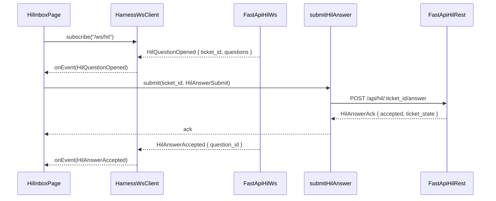
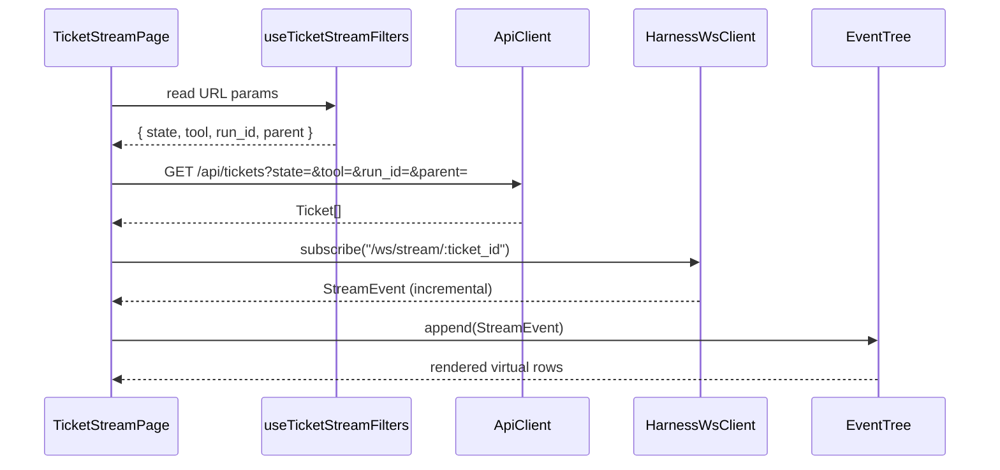
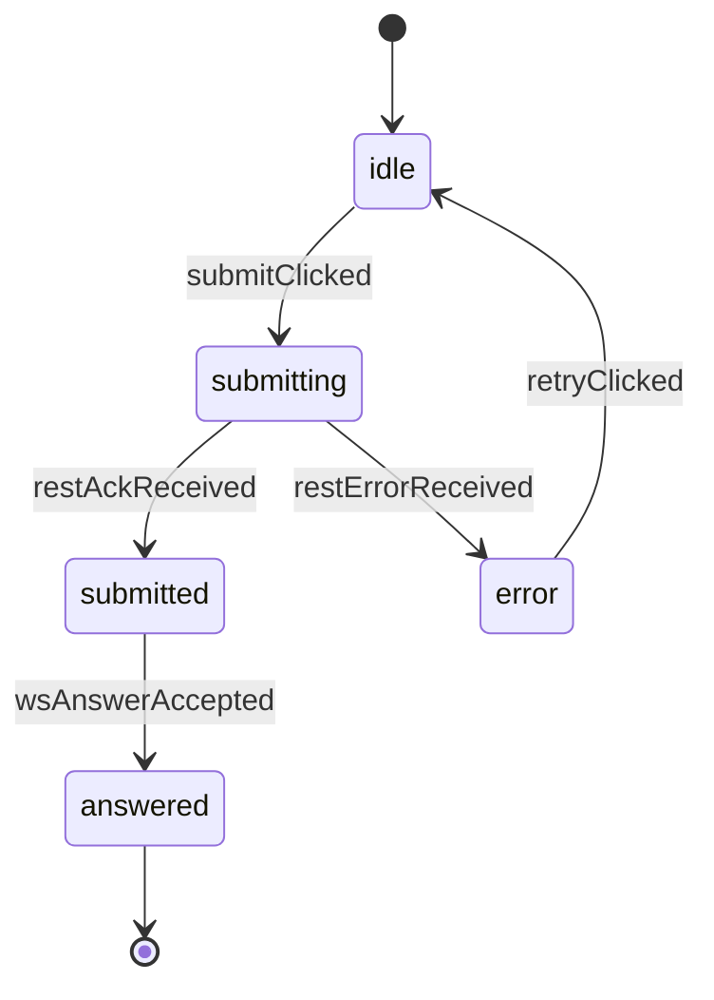
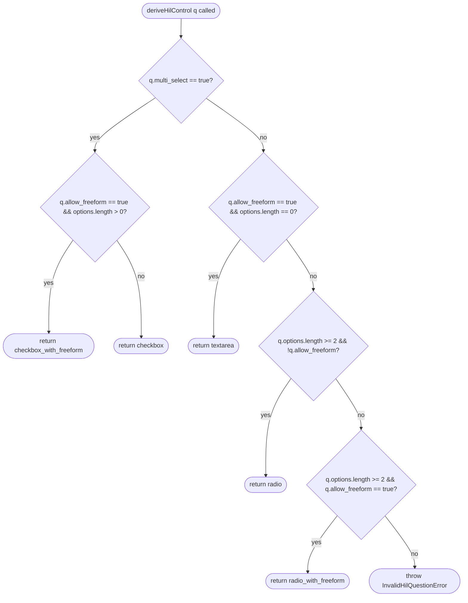

# Feature Detailed Design：F21 · Fe-RunViews — RunOverview + HILInbox + TicketStream（Feature #21）

**Date**: 2026-04-25
**Feature**: #21 — F21 · Fe-RunViews — RunOverview + HILInbox + TicketStream
**Priority**: high
**Dependencies**: F02（#2 Persistence Core）· F12（#12 Frontend Foundation）· F18（#18 Adapter / Stream / HIL）· F20（#20 Bk-Loop — Run Orchestrator）
**Design Reference**: docs/plans/2026-04-21-harness-design.md §4.6（lines 512–549）· §6.1.7（IFR-007）· §6.2.1 / §6.2.2 / §6.2.3 / §6.2.4
**SRS Reference**: FR-010 · FR-030 · FR-031 · FR-034 · NFR-002 · NFR-011 · IFR-007
**UCD Reference**: docs/plans/2026-04-21-harness-ucd.md §2（hard rules）· §4.1（RunOverview）· §4.2（HILInbox）· §4.5（TicketStream）· §7（视觉回归 SOP）

---

## Context

F21 是 Harness 前端的"运行时三联屏"——首屏 RunOverview（`/`）、HIL 待答收件箱 HILInbox（`/hil`）、ticket 流 TicketStream（`/ticket-stream`）合并为一个特性，因为三页**共享同一组数据域**：`RunStatus` + `Ticket[]` + `StreamEvent[]` + `HilQuestion[]`。它消费 F12（基座 import）+ F18（HIL/stream WS 契约）+ F20（run 控制 REST/WS）+ F02（ticket DAO 间接经 F20）。最关键的可视化义务：(1) phase stepper 6 元素 + cost 总和（FR-030）；(2) hil_waiting ticket 卡片 + radio/checkbox/textarea 派生（FR-010 / FR-031 / NFR-011）；(3) 10k+ 事件虚拟滚动 + 筛选 URL 同步（FR-034）；(4) 60s 静默重连（IFR-007）；(5) freeform XSS 防注入（FR-031 SEC）；(6) 三页面与 prototype JSX 像素差 < 3%（UCD §7）。

---

## Design Alignment

> 完整复制 Design §4.6（lines 512–549）。

**4.6.1 Overview**：实现 UCD §4.1（RunOverview）· §4.2（HILInbox）· §4.5（TicketStream）三个实时面板——phase stepper + 当前 run 控制、HIL 问题列表与 radio/checkbox/textarea 映射、ticket list + event tree + inspector 三栏配合虚拟滚动。**feature-list.json 的 `ui_entry` 为 `/`**（RunOverview 作首屏）。承接 FR-010/030/031/034 + NFR-002/011 + IFR-007。视觉真相源：`docs/design-bundle/eava2/project/pages/RunOverview.jsx` / `HILInbox.jsx` / `TicketStream.jsx`。

**4.6.2 职责范围**
- **RunOverview (`/`)**：移植 prototype；接 F20 `GET /api/runs/current` 与 `POST /api/runs/:id/{pause,cancel}`；phase stepper 数据来自 `/ws/run/:id`。
- **HILInbox (`/hil`)**：移植 prototype（含 local `HILCard` + `RadioRow`）；HIL 问题经 `/ws/hil` 到达；三控件映射：`multiSelect=false` + `options≥2` → radio；`multiSelect=true` → checkbox；`allowFreeform=true` + `options=0` → textarea（FR-010）。
- **TicketStream (`/ticket-stream`)**：三栏 layout；event tree 用 `@tanstack/react-virtual` 支持 10k+ 事件（滚动 ≥30fps，FR-034 PERF）；`state`/`tool`/`run_id` 筛选 + URL 参数同步；Ctrl/Cmd+F 内联搜索；新事件 WebSocket 增量追加；用户滚动时暂停自动 scroll-to-bottom。
- **反 XSS**：HIL freeform 文本回填 DOM 使用 React `textContent` 赋值，禁止 `dangerouslySetInnerHTML`。

**4.6.3 Module Layout 建议**
- `apps/ui/src/routes/run-overview/`
- `apps/ui/src/routes/hil-inbox/`（含 local `HILCard` / `RadioRow`）
- `apps/ui/src/routes/ticket-stream/`（含 local `EventTree` 组件）

**4.6.4 Integration Surface**
- **Provides**：路由 `/` · `/hil` · `/ticket-stream`
- **Requires**：F02（ticket 列表）· F12（前端基座）· F18（HIL + stream 契约）· F20（run 控制 / REST ticket 查询）

| 方向 | Consumer / Provider | Contract ID | Endpoint | Schema |
|---|---|---|---|---|
| Requires | F20 | IAPI-002 | `GET /api/runs/current` · `POST /api/runs/:id/pause\|cancel` · `GET /api/tickets?...` · `GET /api/tickets/:id` · `GET /api/tickets/:id/stream` | `RunStatus`, `Ticket[]`, `StreamEvent[]` |
| Requires | F20 | IAPI-001 | WebSocket `/ws/run/:id` · `/ws/anomaly` · `/ws/signal` | `RunEvent`, `AnomalyEvent`, `SignalFileChanged` |
| Requires | F20 | IAPI-019 | REST + WS RunControlBus | `RunControlCommand`, `RunControlAck` |
| Requires | F18 | IAPI-001 | WebSocket `/ws/hil` · `/ws/stream/:ticket_id` + `POST /api/hil/:ticket_id/answer` | `HilQuestion`, `HilAnswer`, `StreamEvent` |
| Requires | F12 | 内部 FE | `Sidebar` · `PhaseStepper` · `TicketCard` · `PageFrame` | — |

**4.6.5 视觉保真义务**
三页各自跑 UCD §7 视觉回归（像素差 < 3%）。HIL phase 色带氤氲 header、pulse 光环、状态 chip 必须与 prototype 等价（`pages/HILInbox.jsx` `HILCard` 与 `tokens.css` `.state-dot.pulse`）。TicketStream event tree 展开/收起图标、缩进层级、monospace 对齐、hover 高亮与 `pages/TicketStream.jsx` 内 local `EventTree` 等价。

**4.6.6 Test Inventory Hint**
- RunOverview 首屏渲染（UCD §4.1）+ pause/cancel 行为 + 无 run idle 态
- HILInbox 三控件派生规则 ×8 fixture + freeform XSS 防注入
- TicketStream 虚拟滚动 fps benchmark + 筛选 URL 同步 + 内联搜索命中高亮
- 视觉回归 ×3 页

### Key types

| 类型 / 模块 | 文件 | 角色 |
|---|---|---|
| `RunOverviewPage` | `apps/ui/src/routes/run-overview/index.tsx` | RunOverview 路由组件，订阅 `/ws/run/:id` + 调用 IAPI-019 pause/cancel |
| `runOverviewReducer` | `apps/ui/src/routes/run-overview/run-status-reducer.ts` | `RunEvent` → 派生 phase/feature/cost 总和 |
| `HilInboxPage` | `apps/ui/src/routes/hil-inbox/index.tsx` | HILInbox 路由组件，订阅 `/ws/hil` |
| `HILCard` / `RadioRow` | `apps/ui/src/routes/hil-inbox/components/hil-card.tsx` | local 组件（pixel-equiv prototype） |
| `deriveHilControl` | `apps/ui/src/routes/hil-inbox/derive-control.ts` | 纯函数：`HilQuestion` → `'radio' \| 'checkbox' \| 'textarea' \| 'radio_with_freeform'` |
| `submitHilAnswer` | `apps/ui/src/routes/hil-inbox/submit.ts` | `POST /api/hil/:ticket_id/answer`（IAPI-002）+ optimistic ack |
| `TicketStreamPage` | `apps/ui/src/routes/ticket-stream/index.tsx` | 三栏 layout：列表 / 事件树 / inspector |
| `EventTree` | `apps/ui/src/routes/ticket-stream/components/event-tree.tsx` | `@tanstack/react-virtual` 虚拟滚动行模型 |
| `useTicketStreamFilters` | `apps/ui/src/routes/ticket-stream/use-filters.ts` | URL `?state=&tool=&run_id=&parent=` 同步（react-router `useSearchParams`） |
| `useInlineSearch` | `apps/ui/src/routes/ticket-stream/use-inline-search.ts` | Ctrl/Cmd+F 高亮 hook |
| `usePauseScrollOnInteraction` | `apps/ui/src/routes/ticket-stream/use-auto-scroll.ts` | 用户滚动时暂停自动 scroll-to-bottom |

### Provides / Requires

- **Provides**：三条 SPA 路由 `/`、`/hil`、`/ticket-stream`（无 §6.2 IAPI 出口；F21 仅消费）
- **Requires**：见 §4.6.4 表 — IAPI-001（WebSocket `/ws/run/:id` · `/ws/hil` · `/ws/stream/:ticket_id` · `/ws/anomaly` · `/ws/signal`）· IAPI-002（REST `/api/runs/current` · `/api/runs/:id/pause|cancel` · `/api/tickets` · `/api/tickets/:id` · `/api/tickets/:id/stream` · `/api/hil/:ticket_id/answer`）· IAPI-019（RunControlBus REST + WS）· F12 内部 FE import（`HarnessWsClient`、`createApiHook`、`PageFrame`、`PhaseStepper`、`TicketCard`、`Sidebar`、`tokens.css`）

### Deviations

无。所有签名 / endpoint / schema 严格对齐 §4.6.4 + §6.2。F21 不产生新契约 —— **仅消费方**。

**UML 嵌入**（按 §2a 触发判据）：
- ≥2 类协作（`RunOverviewPage` / `HilInboxPage` / `TicketStreamPage` / `HarnessWsClient` / `runOverviewReducer` / `EventTree` 等）→ 系统设计 §4.6 已用文字描述模块布局；F12 详设 §4.9 已在 classDiagram 提供 `HarnessWsClient` 等基座类节点。本特性的 UI 模块层 classDiagram 与 §4.9 等价 → **见系统设计 §4.9 类图**，本节不重复。
- ≥2 对象调用顺序（HIL 提交端到端：`HilInboxPage → HarnessWsClient → /ws/hil → submitHilAnswer → POST /api/hil/:ticket_id/answer → /ws/hil ack`）→ 嵌入 `sequenceDiagram`。
- 状态机方法（`HilCard` 答卡 `idle → submitting → submitted → ack_received`）→ §Interface Contract 对应方法行下方嵌入 `stateDiagram-v2`。
- 决策分支方法（`deriveHilControl` 含 4 决策分支）→ §Implementation Summary 对应段下方嵌入 `flowchart TD`。

---

## SRS Requirement

> 完整复制相关 SRS 节选。

### FR-010：UI 渲染 3 种 HIL 控件
**优先级**: Must
**EARS**: When 一张 ticket 进入 hil_waiting 状态, the system shall 在 HILInbox UI 中把每个 question 按类型渲染为 single_select（Radio）/ multi_select（Checkbox）/ free_text（Textarea）其中一种，类型由 options 数量 + multiSelect 标志 + allowFreeformInput 标志推导。
**可视化输出**: HILInbox 中该 ticket 卡片显示对应控件；用户可看到 header 粗体 + question + options。
**验收准则**:
- Given multiSelect=false 且 options.length>=2，when UI 渲染，then 使用 Radio
- Given multiSelect=true，when UI 渲染，then 使用 Checkbox
- Given allowFreeformInput=true 且 options.length==0，when UI 渲染，then 使用 Textarea
- Given allowFreeformInput=true 且 options.length>0，when UI 渲染，then Radio/Checkbox + 附加 "其他…" free 输入

### FR-030：RunOverview 界面
**优先级**: Must
**EARS**: The system shall 提供 RunOverview 界面显示当前 run 的 phase 横向进度条（requirements → ucd → design → ats → init → work(N/M features) → st → finalize）、当前 skill、当前 feature id/title、累计 cost_usd / num_turns、git HEAD 推进轨迹。
**可视化输出**: 单页面含所列 6 元素，实时刷新。
**验收准则**:
- Given 一个 running run，when 用户打开 RunOverview，then 以上 6 元素可见且 cost 总和 = Σ ticket.cost_usd
- Given run 进入 work 阶段第 3/8 feature，when 渲染，then 显示 "work 3/8"

### FR-031：HILInbox 界面
**优先级**: Must
**EARS**: The system shall 提供 HILInbox 界面列出所有 state=hil_waiting 的 ticket 卡片，点开卡片渲染其 HIL 问题（single/multi/free 控件），提交答案后该卡片转为已答状态。
**可视化输出**: Inbox 列表 + 卡片详情 + 已答标记。
**验收准则**:
- Given 3 张 hil_waiting ticket，when 打开 HILInbox，then 列出 3 张卡片
- Given 用户提交答案，when 请求完成，then 卡片变 answered 状态且 ticket 状态推进
- **SEC 隐含**：freeform 文本回显使用 React `textContent`（design §4.6.2），不得使用 `dangerouslySetInnerHTML`

### FR-034：TicketStream 界面
**优先级**: Must
**EARS**: The system shall 提供 TicketStream 界面，每张 ticket 一张卡片，左侧时间线（spawn → running → HIL → result）右侧 stream-json 展开树（tool_use / tool_result / text 三类事件折叠展开），并支持按 state / run / parent_ticket / tool 筛选。
**可视化输出**: 两栏卡片；筛选栏在顶部。
**验收准则**:
- Given 筛选 tool=claude，when 应用，then 仅列出 claude ticket
- Given stream-json 有 100 事件，when 展开，then 按三类分组折叠
- **PERF 隐含**：10k+ 事件滚动 ≥30fps（design §4.6.2 / Test Inventory Hint）

### NFR-002：Stream-json 解析延迟
**Measurable Criterion**: 不做硬数值约束，但流式事件 p95 < 2s。
**Measurement Method**: 人工验收 + TicketStream 事件到达时间戳差。

### NFR-011：HIL 控件标注
**Measurable Criterion**: 控件顶部显示 "单选/多选/自由文本" 标签；自由文本提供 skill hint 建议。
**Measurement Method**: UI 验收。

### IFR-007：HIL 前端控件 WebSocket（FastAPI → React）
**Direction**: Bidirectional
**Protocol**: WebSocket + JSON message
**心跳**: 服务端每 30s 发 `{"kind":"ping"}`；客户端 60s 未收 → 重连（TanStack Query 乐观化 + refetch）。**同进程内 127.0.0.1**，无 JWT/CSRF（NFR-007/CON-006）。

---

## Interface Contract

> 仅列**公开**的 React 组件 / hook / 纯函数 / API 调用包装。Visual primitives（`HILCard` / `RadioRow` / `EventRow` / `Metric` / `EventLine`）属 local，签名见各文件，不进本表。

| Method | Signature | Preconditions | Postconditions | Raises |
|---|---|---|---|---|
| `RunOverviewPage` | `RunOverviewPage(): JSX.Element` | F12 `AppShell` 已挂载、`HarnessWsClient` 已连接、`/api/runs/current` 可达 | 渲染 `<PageFrame title="总览">`，含 6 元素：phase stepper（DOM `[data-component="phase-stepper"]`）、当前 skill 文本（`[data-testid="current-skill"]`）、当前 feature id/title（`[data-testid="current-feature"]`）、cost_usd（`[data-testid="run-cost"]`，值 = Σ ticket.cost_usd）、num_turns（`[data-testid="run-turns"]`）、git HEAD（`[data-testid="run-head"]`）；订阅 `/ws/run/:id` 后 `RunEvent` 增量更新；状态 `idle`（`current_run==null`）显示 Empty State `[data-testid="run-overview-empty"]`（FR-030 AC-1） | 网络异常 → 内部 ErrorBoundary 兜底，文档不抛出（不冒泡至宿主） |
| `runOverviewReducer` | `runOverviewReducer(state: RunStatus \| null, ev: RunEvent): RunStatus` | `state` 与 `ev` 均为合法 schema | 返回新 RunStatus；`RunPhaseChanged` → `current_phase` 更新；`TicketStateChanged.cost_usd` 累加进 `cost_usd`；`RunCompleted` → `state="completed"` 并 `ended_at` 落定；纯函数无副作用 | `TypeError`（输入 schema 不合法时由 zod 守卫抛出） |
| `pauseRun` / `cancelRun` | `pauseRun(runId: string): Promise<RunStatus>` ；`cancelRun(runId: string): Promise<RunStatus>` | `runId` 非空；run 处于 `running` 或 `paused` | 服务端 `RunStatus.state` 转 `paused` / `cancelled`；UI Optimistic 更新 chip → 等 200 OK 落定；TanStack Query invalidate `['/api/runs/current']` | HTTP 404（run 不存在）→ `RunControlError("RUN_NOT_FOUND")`；HTTP 409（state 不允许）→ `RunControlError("STATE_CONFLICT")` |
| `HilInboxPage` | `HilInboxPage(): JSX.Element` | `/ws/hil` 可订阅、`/api/tickets?state=hil_waiting` 可达 | 渲染 N 张 `<HILCard ticketId=... />`，N == hil_waiting ticket 数；N==0 → Empty State（`[data-testid="hil-empty"]`）；当 `HilQuestionOpened` 到达，新增卡片；`HilAnswerAccepted` 到达，对应卡片变 `answered`（opacity 0.5） | 内部 ErrorBoundary 兜底 |
| `deriveHilControl` | `deriveHilControl(q: HilQuestion): "radio" \| "checkbox" \| "textarea" \| "radio_with_freeform" \| "checkbox_with_freeform"` | `q` 是合法 `HilQuestion`（`options`, `multi_select`, `allow_freeform` 字段齐） | `multi_select=false && options.length>=2 && !allow_freeform` → `"radio"`；`multi_select=true && !allow_freeform` → `"checkbox"`；`allow_freeform=true && options.length==0` → `"textarea"`；`allow_freeform=true && options.length>0 && multi_select=false` → `"radio_with_freeform"`；`allow_freeform=true && options.length>0 && multi_select=true` → `"checkbox_with_freeform"` （FR-010 AC-1..4） | `InvalidHilQuestionError` — 当 `options.length==0 && allow_freeform==false`（无任一可渲染控件） |
| `submitHilAnswer` | `submitHilAnswer(ticketId: string, body: HilAnswerSubmit): Promise<HilAnswerAck>` | `body.question_id` 非空；若 `body.freeform_text` 提供，长度 ≤ 2000 chars | `POST /api/hil/:ticket_id/answer` 成功 → 返回 `HilAnswerAck { accepted: true, ticket_state }`；UI 标记本 question 为 answered；不调用任何字符串模板拼接 freeform 进 DOM；freeform 渲染走 `textContent` 路径（无 `dangerouslySetInnerHTML`） | HTTP 400（payload schema 失败）→ `HilSubmitError("BAD_REQUEST")`；HTTP 404（ticket 不存在）→ `HilSubmitError("TICKET_NOT_FOUND")`；HTTP 409（ticket 不在 hil_waiting）→ `HilSubmitError("STATE_CONFLICT")` |
| `TicketStreamPage` | `TicketStreamPage(): JSX.Element` | `/api/tickets` 可达；`/ws/stream/:ticket_id` 可订阅 | 三栏渲染：左 ticket list（`[data-component="ticket-list"]`）+ 中 event tree（`[data-component="event-tree"]` 由 `@tanstack/react-virtual` 驱动）+ 右 inspector（`[data-component="event-inspector"]`）；URL `?state=&tool=&run_id=&parent=` 反映 filter；新 `StreamEvent` 经 WS 增量 push 到当前 ticket 的 row model 末尾；用户向上滚动 → 暂停 auto-scroll-to-bottom（标志 `paused-by-user`） | 内部 ErrorBoundary 兜底 |
| `useTicketStreamFilters` | `useTicketStreamFilters(): { filters: TicketFilters, setFilter: (key, val) => void }` | `react-router` 的 `useSearchParams` 可用 | `filters` 同步 URL；`setFilter` 写回 URL 并触发 TanStack Query refetch；不可见参数（如 `cursor`）不污染 URL | — |
| `useInlineSearch` | `useInlineSearch(events: StreamEvent[]): { query, setQuery, hits: number[] }` | `events` 数组合法 | `query` 非空时返回命中行索引；空查询 → `hits=[]`；`Ctrl/Cmd+F` 全局快捷键聚焦搜索框（`preventDefault` 阻止浏览器原生 find）| — |
| `usePauseScrollOnInteraction` | `usePauseScrollOnInteraction(scrollerRef: RefObject<HTMLElement>): { paused: boolean, resume: () => void }` | scroller DOM 节点已挂载 | 用户 wheel/touch/keyboard 触发 → `paused=true`；点 "resume" 按钮或滚动至底部 → `paused=false`，自动跟随新事件 | — |

**方法状态依赖** — `HilInboxPage` 内每张 `HILCard` 的 answer-flow 状态机：

**Design rationale**:
- `deriveHilControl` 提取为纯函数：易于 fixture 驱动单元测试覆盖 8 个组合（`multi_select × options∈{0, ≥2} × allow_freeform`），且 TDD Rule 4 边界用例（options==1）显式抛错避免静默渲染空 list
- `submitHilAnswer` 走 REST（IAPI-002 `POST /api/hil/:ticket_id/answer`）而非通过 `/ws/hil`，对齐 design §6.2.2 路由表；ack 在 REST 200 OK + WS `HilAnswerAccepted` 双重确认（IAPI-019 风格）
- pause/cancel 使用 IAPI-002 路由（`/api/runs/:id/pause|cancel`）而非 IAPI-019 RunControlBus 的 WS 通道：design §4.6.4 表中 IAPI-002 已列出这两条 REST 路由，IAPI-019 RunControlBus 是更通用的 command 接口，本特性优先 REST 路径以保留幂等 + 错误码；对 future skip_ticket / force_abort 命令（design §4.6.4 IAPI-019）TicketStream inspector 内可后接
- **跨特性契约对齐**：所有 schema 引用 §6.2.4 (`RunStatus` / `Ticket` / `StreamEvent` / `HilQuestion` / `HilAnswerSubmit` / `HilAnswerAck` / `RunControlAck`)；本特性 zod schema 应**从后端 pydantic v2 导出 TS 类型**（design §6.2 注释「后端 pydantic v2；前端 Zod（从 pydantic 导出 TS 类型）」）

---

## Visual Rendering Contract

> ui:true 强制；视觉真相源 = `docs/design-bundle/eava2/project/pages/{RunOverview,HILInbox,TicketStream}.jsx`；所有 token 经 F12 `apps/ui/src/theme/tokens.css` 注入。

| Visual Element | DOM/Canvas Selector | Rendered When | Visual State Variants | Minimum Dimensions | Data Source |
|---|---|---|---|---|---|
| RunOverview header chip "running · 14m 22s" | `header [data-testid="run-state-chip"] .state-dot.pulse` | `RunStatus.state==='running'` | running=绿+pulse；paused=橙；cancelled=灰；completed=暗绿 check；failed=红+alert-triangle（UCD §2.6） | dot 6×6px；chip 高 20px | `RunStatus.state` |
| Phase stepper | `[data-component="phase-stepper"]` | RunOverview 挂载 | 当前阶段高亮 + 已过暗绿 check + 未到灰 | width = 父容器；高 44px | `RunStatus.current_phase` + 静态 8-phase 序列 |
| 当前 ticket 区 | `[data-testid="current-ticket-card"]` | `RunStatus.current_phase` 非 null | hil_waiting → 琥珀 dot；running → 绿 pulse | min 240×140px | `Ticket`（current） |
| 运行指标卡 6 行 | `[data-testid="metrics-card"] [data-row="cost\|turns\|duration\|tool\|skill\|head"]` | RunOverview 挂载 | mono 字体 + 状态色 | 320×240px | `RunStatus.cost_usd`/`num_turns`/`head_latest` + 当前 ticket dispatch info |
| Run 控制按钮 暂停 / 取消 | `[data-testid="btn-pause"]` / `[data-testid="btn-cancel"]` | RunOverview 挂载且 state∈{running,paused} | 启用/禁用按 state | hit area ≥ 32×32px（UCD §2.1） | `RunStatus.state` |
| RunOverview Empty State（idle） | `[data-testid="run-overview-empty"]` | `current_run==null` | 文字 + Start 按钮 | 完整视口居中 | `/api/runs/current` 返回 null |
| HILInbox 卡片列表 | `[data-component="hil-card-list"] > [data-component="hil-card"]` | `state=hil_waiting` 的 ticket 存在 | answered=opacity 0.5；submitting=按钮禁用+spinner；error=红边 | 每卡 min-height 220px | `Ticket[]` (filtered by hil_waiting) + `HilQuestion[]` |
| HILCard phase 色带 header | `[data-component="hil-card"] header` | 卡片渲染 | linear-gradient `phaseColor14 0%, transparent 60%`（prototype HILInbox.jsx L31-34） | 高 48px | `Ticket.dispatch.skill_hint` → phase 色 |
| HILCard radio 控件 | `[data-component="hil-card"][data-control="radio"] [role="radio"]` | `deriveHilControl()=='radio'` | checked=accent 边框+实心；unchecked=灰 | 16×16px | `HilQuestion.options[]` |
| HILCard checkbox 控件 | `[data-component="hil-card"][data-control="checkbox"] [role="checkbox"]` | `deriveHilControl()=='checkbox'` | checked=accent 实心+check icon | 16×16px | `HilQuestion.options[]` |
| HILCard textarea 控件 | `[data-component="hil-card"][data-control="textarea"] textarea` | `deriveHilControl()=='textarea'` | focus=2px ring `--accent` | min-height 140px | `HilQuestion`（无 options） |
| HILCard 控件标注 chip | `[data-component="hil-card"] [data-testid="control-label"]` | 卡片渲染 | "单选" / "多选" / "自由文本" 文案（NFR-011） | 自然宽 + 高 16px | `deriveHilControl()` |
| HILInbox Empty State | `[data-testid="hil-empty"]` | `state=hil_waiting` 数为 0 | 单页插画 + "无待答 HIL" 文案 | 完整视口居中 | `Ticket[]` count |
| TicketStream 筛选栏 | `[data-component="ticket-stream-filter-bar"] button[data-filter="state\|tool\|skill"]` | 路由挂载 | active filter chip 边色变 accent | bar 高 54px | URL searchParams |
| TicketStream 三栏 layout | `[data-component="ticket-list"]` + `[data-component="event-tree"]` + `[data-component="event-inspector"]` | 路由挂载 | 中栏 flex:1，左 320px 右 340px | 总宽 ≥ 1024px（UCD §2.3） | `Ticket[]` + `StreamEvent[]` |
| Event row（虚拟滚动） | `[data-component="event-tree"] [data-row-index]` | event 在 viewport 内 | tool_use=紫；tool_result=青；text=灰；thinking=琥珀；error=红；denied=红左 border | 行高 ≥ 24px；缩进 = depth × 20px | `StreamEvent.kind` + `StreamEvent.payload` |
| Inline search 高亮 | `[data-component="event-tree"] mark[data-search-hit]` | `useInlineSearch.query` 非空 | 命中底色 `rgba(110,168,254,0.12)` | inline | `useInlineSearch.hits` |
| Live · auto-scroll 指示 | `[data-testid="auto-scroll-indicator"]` | `paused-by-user=false` 时显示 pulse；true 时显示 "已暂停 · 点击恢复" | 绿 pulse / 灰 paused | 自然宽 + 高 16px | `usePauseScrollOnInteraction.paused` |

**Rendering technology**: DOM elements + CSS（Tailwind + tokens.css 变量）；event tree 用 `@tanstack/react-virtual` 行级虚拟化；无 Canvas / WebGL。
**Entry point function**:
- `apps/ui/src/main.tsx` → `AppShell`（F12）→ `<Routes>` 挂载 `RunOverviewPage` / `HilInboxPage` / `TicketStreamPage`
- `HarnessWsClient`（F12 单例）建立 `/ws/run/:id` / `/ws/hil` / `/ws/stream/:ticket_id` 多频道订阅，事件回调入各自 React state
**Render trigger**: React 18 concurrent rendering；TanStack Query refetch on URL change；WebSocket onMessage → `dispatch()`/`setState()`。

**正向渲染断言**（触发后必须视觉可见）：
- [ ] RunOverview 挂载后 `[data-component="phase-stepper"]` 子元素 ≥ 6 个 step（FR-030 AC-1 6 元素之一）
- [ ] RunOverview `[data-testid="run-cost"]` 文本数值等于 Σ `Ticket.execution.cost_usd`（FR-030 AC-1）
- [ ] RunOverview running 态 `[data-testid="run-state-chip"] .state-dot.pulse` 应用 `@keyframes hns-pulse`（UCD §2.2 周期 1.6s）
- [ ] RunOverview idle 态显示 `[data-testid="run-overview-empty"]`（current_run=null）
- [ ] HILInbox 接到 3 个 `HilQuestionOpened`（不同 ticket）→ DOM `[data-component="hil-card"]` 数 = 3（FR-031 AC-1）
- [ ] HILInbox `state=hil_waiting` 数为 0 → `[data-testid="hil-empty"]` 可见，无 hil-card
- [ ] HILCard `multi_select=false, options.length=2, allow_freeform=false` → DOM 含 `[role="radio"] × 2`，无 checkbox/textarea
- [ ] HILCard `multi_select=true` → DOM 含 `[role="checkbox"]`
- [ ] HILCard `allow_freeform=true, options.length=0` → DOM 含 `<textarea>`，无 radio/checkbox
- [ ] HILCard 标注 chip 文案 ∈ {单选, 多选, 自由文本}（NFR-011）
- [ ] HILCard freeform 文本回显：用户输入 `` → DOM 中 `<textarea>` value 含字符串字面量；无新增 `` 元素被解析（SEC FR-031）
- [ ] TicketStream 筛选 `?tool=claude` → `[data-component="ticket-list"]` 仅含 `tool="claude"` 的 ticket；URL bar 含 `?tool=claude`（FR-034 AC-1）
- [ ] TicketStream 100 个 stream 事件 → `[data-component="event-tree"]` 含 ≥ 100 个 row（按视口虚拟，但通过 `data-row-index` attr 全部可枚举）
- [ ] TicketStream 10000 个 events 滚动 → 平均 frame time ≤ 33ms（30fps，PERF FR-034）
- [ ] TicketStream `Ctrl/Cmd+F` → search 输入框聚焦，浏览器原生 find 不弹出
- [ ] WebSocket 60s 静默后客户端自动 reconnect；reconnect 完成 `[data-testid="ws-status"]` 重回 connected（IFR-007）

**交互深度断言**（已渲染元素响应设计意图交互）：
- [ ] RunOverview `btn-pause` 点击 → `POST /api/runs/:id/pause` 发出，chip 更新到 paused
- [ ] RunOverview `btn-cancel` 点击 → 二次确认 modal（Esc 关闭）→ `POST /api/runs/:id/cancel` 发出
- [ ] HILCard radio click → 选中变更 + accent 边框迁移
- [ ] HILCard textarea 输入 + 提交按钮点击 → `POST /api/hil/:id/answer` 发出，按钮禁用 + spinner，REST 200 + WS `HilAnswerAccepted` 双确认后卡片 opacity → 0.5
- [ ] TicketStream filter button 点击 → URL 参数同步 + ticket-list 重渲染
- [ ] TicketStream event row click → 右栏 inspector 显示该 event 元数据
- [ ] TicketStream 用户向上滚动 → `[data-testid="auto-scroll-indicator"]` 切换为 "已暂停"；新 event 不再 scroll-to-bottom；点 "恢复" → 切换回 live + scroll 到底
- [ ] TicketStream `Ctrl/Cmd+F` 输入 query → 命中行 `<mark data-search-hit>` 高亮显示

---

## Implementation Summary

**主要类 / 函数与文件**。本特性新增三组路由模块：`apps/ui/src/routes/run-overview/`（含 `index.tsx`、`run-status-reducer.ts`、`use-run-control.ts`）、`apps/ui/src/routes/hil-inbox/`（含 `index.tsx`、`derive-control.ts`、`submit.ts`、`components/hil-card.tsx`、`components/radio-row.tsx`）、`apps/ui/src/routes/ticket-stream/`（含 `index.tsx`、`use-filters.ts`、`use-inline-search.ts`、`use-auto-scroll.ts`、`components/event-tree.tsx`、`components/event-inspector.tsx`、`components/event-row.tsx`）。每组 `index.tsx` 导出页面组件并经 `apps/ui/src/main.tsx`（F12 已生成的 RouteSpec 列表）注册到 `<Routes>`。`HILCard` / `RadioRow` / `EventRow` 是从 `docs/design-bundle/eava2/project/pages/{HILInbox,TicketStream}.jsx` 视觉等价移植，将内联 style 重构为 Tailwind class + tokens.css 变量。

**调用链**。运行时三页面共享同一基座（来自 F12）：`AppShell`（`<QueryClientProvider>` + `<BrowserRouter>` + `<PageFrame>`）→ 路由组件 → `useWs(channel, onEvent)`（来自 `apps/ui/src/ws/use-ws.ts`，订阅至 `HarnessWsClient` 单例）+ `createApiHook(route)`（来自 `apps/ui/src/api/query-hook-factory.ts`，封装 TanStack Query useQuery / useMutation）。RunOverview：`useQuery('/api/runs/current') → RunStatus` + `useWs('/ws/run/:id', dispatch)` → reducer 累加 cost；用户点 pause → `useMutation` POST `/api/runs/:id/pause` → invalidate query。HILInbox：`useQuery('/api/tickets?state=hil_waiting')` + `useWs('/ws/hil', onHilEvent)` → 派发 `HilQuestionOpened` / `HilAnswerAccepted`；用户点提交 → `submitHilAnswer` → POST `/api/hil/:id/answer` → 同时等 WS ack。TicketStream：`useTicketStreamFilters()` 读 URL → `useQuery('/api/tickets?...filters')` → `useQuery('/api/tickets/:id/stream')` 加载历史 → `useWs('/ws/stream/:id', onStreamEvent)` 增量追加 → `EventTree` 用 `@tanstack/react-virtual` 渲染。

**关键设计决策**。(1) `deriveHilControl` 是纯函数 + 纯组合，便于 8 fixture 单元测试覆盖（FR-010 4 AC）。决策图见下方 flowchart。(2) WebSocket reconnect 由 F12 `HarnessWsClient` 实现（指数退避 + 60s 心跳超时已是其义务），F21 仅声明订阅；本特性 ST 必须验证 IFR-007 的 60s 静默 → 重连。(3) freeform XSS 防注入：HIL 回显**绝对不**使用 `dangerouslySetInnerHTML`；用户文本以 React `{text}` 模板插槽（自动 escape）或 `<textarea value={text}>` 写入；任何 markdown 渲染（若未来开启）都需经 DOMPurify 白名单。(4) TicketStream 10k 事件性能：用 `@tanstack/react-virtual` 行级虚拟（每行 ≥24px、固定 row size 估计），`StreamEvent[]` 不在 React state 全量重渲染——经 Zustand slice 暴露 `appendStreamEvent(ticketId, ev)` 减少 re-render；`React.memo(EventRow)` 配合 `key=event.seq` 避免 reconciliation 抖动；FPS 用 `performance.now()` 在 `requestAnimationFrame` 采样验证。(5) URL filter sync 用 `react-router` `useSearchParams`，避免引入额外路由 state lib；空 filter 不写入 URL（保持 `/ticket-stream` 干净）。(6) Ctrl/Cmd+F 在 React 中需 `e.preventDefault()` 阻止浏览器原生 find；同时挂在 `<TicketStreamPage>` 顶层 `useEffect` 注册 keyboard listener，组件 unmount 时移除。

**遗留 / 存量代码交互点 + env-guide §4 对齐**。本特性**复用** F12 已生成的 6 个基座符号（见下表 Existing Code Reuse）；新代码必须遵循 env-guide §4 约束（已确认存在该章节的强制部分）：(a) HTTP 请求统一走 `apps/ui/src/api/client.ts` 的 `apiClient`（不直用 `fetch` / `axios`）；(b) WebSocket 订阅统一走 `apps/ui/src/ws/use-ws.ts` 的 `useWs` hook（不直用 `new WebSocket()`）；(c) 状态管理统一用 `apps/ui/src/store/slice-factory.ts` 的 `createSlice` 工厂（不直用裸 Zustand `create`）；(d) Tailwind class 必须引用 tokens.css 变量（不写硬编码十六进制色）；(e) 文件命名 kebab-case（与 F12 既存 `page-frame.tsx` / `ticket-card.tsx` 一致）；(f) 组件函数声明为命名导出 + `function ComponentName()` 形式（与 F12 风格一致）。

**§4 Internal API Contract 集成**。F21 仅作为 Consumer：(a) IAPI-001 — 订阅 `/ws/run/:id`、`/ws/hil`、`/ws/stream/:ticket_id` 的 `WsEvent` union（schema 见 design §6.2.4 `RunPhaseChanged` / `TicketSpawned` / `TicketStateChanged` / `RunCompleted` / `HilQuestionOpened` / `HilAnswerAccepted` / `HilTicketClosed` / `StreamEvent`）；(b) IAPI-002 — 调用 6 条 REST 路由（design §6.2.2）；(c) IAPI-019 — RunControlBus 当前在 F21 仅经 IAPI-002 REST 路径调用 pause/cancel；不直接订阅 IAPI-019 WS 命令通道，由 F20 通过 IAPI-001 broadcast `RunControlAck`。所有前端 zod schema 应**从后端 pydantic v2 生成 TS 类型**（design §6.2 注释；具体生成器由 F12 基座负责，本特性只 import 类型）。

**方法内决策分支** — `deriveHilControl` 是带 ≥3 决策分支的纯函数：

### Boundary Conditions

| Parameter | Min | Max | Empty/Null | At boundary |
|---|---|---|---|---|
| `HilQuestion.options.length` | 0 | 实际无硬上限（建议 ≤ 20，多则滚动） | 0 → 仅 textarea 合法（否则抛 `InvalidHilQuestionError`）；null 视为 schema 错误经 zod 拦截 | 1 → `multi_select=false && !allow_freeform` 时按"radio with single option"渲染（视觉合法但 UCD 建议 ≥ 2） |
| `HilAnswerSubmit.freeform_text.length` | 0（缺省 null） | 2000 chars（UCD §4.2 prototype `142 / 2000` 计数器） | null → 仅 selected_labels 路径；空字符串 → 视为未填提示用户 | 1999/2000 → 接受；2001 → 客户端 disable 提交，提示 "已超字数限制" |
| `StreamEvent[]` 数组长度（TicketStream 缓冲） | 0 | 无硬上限（10k+ design §4.6.2） | 0 → 显示 "无事件" placeholder | 100 → 应在 < 2s 内全部到达（NFR-002）；10000 → 滚动 ≥30fps（FR-034 PERF） |
| `RunStatus.cost_usd`（reducer 累加） | 0.0 | float64 上限 | null（未启动 run） → UI Empty State | 0.0 → 显示 `$0.00 / $5.00`（prototype 默认 budget） |
| `Ticket.depth` | 0 | 2（design §6.2.4 `depth: int = Field(0, ge=0, le=2)`） | — | 2 → ticket-list 缩进显示但不允许再嵌套（F20 责任，F21 视觉提示） |
| URL `?state=`,`?tool=`,`?run_id=`,`?parent=` | 1 char | 256 char（保护 URL 长度） | 缺省 → filter=all | 非法 enum 值（如 `?tool=foo`）→ 忽略并清除该 param |

### Existing Code Reuse

> 来自 §1c Existing Code Reuse Check。Grep 关键字：`HarnessWsClient`、`useWs`、`createApiHook`、`apiClient`、`createSlice`、`PageFrame`、`PhaseStepper`、`TicketCard`、`Sidebar`、`Icons`、`tokens.css`、`getTokensCssText`。所有命中均来自 F12 实现的基座，本特性应**直接 import**，禁止重写。

| Existing Symbol | Location (file:line) | Reused Because |
|---|---|---|
| `HarnessWsClient` | `apps/ui/src/ws/client.ts`（F12 已交付）| 多频道 WebSocket 单例 + 指数退避重连 + 60s 心跳超时；F21 直接订阅 `/ws/run/:id` `/ws/hil` `/ws/stream/:ticket_id`，不能再起新 client |
| `useWs<T>(channel, onEvent)` | `apps/ui/src/ws/use-ws.ts` | React hook：组件 mount 订阅 / unmount 退订；F21 三页面均消费 |
| `createApiHook<Req, Resp>(route)` / `apiClient` | `apps/ui/src/api/query-hook-factory.ts` · `apps/ui/src/api/client.ts` | TanStack Query useQuery/useMutation 工厂 + 统一 fetch 包装（base URL + zod runtime 校验 + 错误归一）；F21 全部 6 条 REST 路由都经此 |
| `createSlice<S>(name, init)` | `apps/ui/src/store/slice-factory.ts` | Zustand slice 工厂；F21 用其管理 `streamEventsByTicket` / `currentRunStatus` / `hilCardStates` |
| `PageFrame` | `apps/ui/src/components/page-frame.tsx` | 页面外壳（左 Sidebar + 顶部 header + 主内容区 + 状态色 chip）；三个 F21 页面 `<PageFrame title=...>` 包裹自身内容 |
| `PhaseStepper` | `apps/ui/src/components/phase-stepper.tsx` | RunOverview 的 6+ phase 横向进度条；prototype `RunOverview.jsx` L70 `<PhaseStepper current={0} fraction={null}/>` 等价 import |
| `TicketCard` | `apps/ui/src/components/ticket-card.tsx` | RunOverview "近期票据流" 列表 + TicketStream 左栏列表项；prototype 两处都直接 `<TicketCard {...t}/>` |
| `Sidebar` | `apps/ui/src/components/sidebar.tsx` | 由 PageFrame 内部使用；F21 通过 PageFrame `active` prop 切换 nav 高亮 |
| `Icons.{Pause, X, Clock, DollarSign, RefreshCw, Cpu, Book, GitCommit, Chevron, Search, Filter, Download, Copy, ExternalLink, HelpCircle, Check}` | `apps/ui/src/components/icons.ts` | F12 已 re-export `lucide-react` 并保留 prototype 同名键；F21 三页面所用图标全部命中 |
| `tokens.css` 变量（`--state-running` / `--state-hil` / `--state-fail` / `--accent` / `--accent-2` / `--accent-3` / `--phase-req` / `--phase-ucd` / `--phase-design` / `--bg-active` / `--bg-inset` / `--border-subtle` / `--border-strong` / `--fg` / `--fg-dim` / `--fg-mute` / `--fg-faint` / `--font-sans` / `--font-mono` / `--ring`） | `apps/ui/src/theme/tokens.css` | F12 byte-equivalent clone of prototype tokens.css；F21 视觉规则全部经此变量 |
| `@tanstack/react-virtual`（npm 依赖） | `apps/ui/package.json`（F12 锁定版本） | 行级虚拟滚动；本特性 EventTree 直接 import `useVirtualizer`，禁止重写虚拟滚动算法 |

---

## Test Inventory

> 综合 Interface Contract、Boundary Conditions、Visual Rendering Contract 形成具体测试场景。Category 格式 MAIN/subtag。本特性涉及外部依赖（WebSocket、HTTP REST），故 INTG 行覆盖；同时为 ui:true，UI/render 行覆盖每个视觉元素。**verification_steps 已逐条映射**（F21-VS-1 .. F21-VS-10）。

| ID | Category | Traces To | Input / Setup | Expected | Kills Which Bug? |
|---|---|---|---|---|---|
| T01 | FUNC/happy | FR-030 AC-1（F21-VS-1） · §Visual Rendering Contract phase-stepper / metrics-card | mock `/api/runs/current` → RunStatus running；`/ws/run/:id` 推送 3 条 `TicketStateChanged{cost_usd: 0.05}`；render `<RunOverviewPage/>` | DOM `[data-component="phase-stepper"]` 子元素 ≥ 6；`[data-testid="run-cost"]` 文本 = `$0.15` | reducer 漏加 cost；stepper 写死 5 elements |
| T02 | FUNC/happy | FR-030 AC-2 | mock RunStatus.current_phase="work"；mock `RunPhaseChanged{phase:"work", subprogress:{n:3,m:8}}` | `[data-testid="phase-stepper"]` 当前阶段标签含 "work 3/8" | subprogress 字段被忽略；分数渲染失败 |
| T03 | FUNC/happy | FR-031 AC-1（F21-VS-2） · §Visual Rendering Contract hil-card-list | mock `/api/tickets?state=hil_waiting` → 3 张 ticket；render `<HilInboxPage/>` | DOM `[data-component="hil-card"]` 元素数 = 3 | hil_waiting 过滤错误；只渲染 N-1 |
| T04 | UI/render | §Visual Rendering Contract `[data-testid="hil-empty"]` | mock `/api/tickets?state=hil_waiting` → 0 ticket | DOM 含 `[data-testid="hil-empty"]`；无 `[data-component="hil-card"]` | Empty state 漏写；空数组渲染异常 |
| T05 | FUNC/happy | FR-010 AC-1（F21-VS-3 part A） | `deriveHilControl({multi_select:false, options:[a,b], allow_freeform:false})` | 返回 `"radio"` | 4 决策分支顺序错；漏处理 |
| T06 | FUNC/happy | FR-010 AC-2（F21-VS-3 part B） | `deriveHilControl({multi_select:true, options:[a,b,c], allow_freeform:false})` | 返回 `"checkbox"` | multi_select 优先级错 |
| T07 | FUNC/happy | FR-010 AC-3（F21-VS-3 part C） | `deriveHilControl({multi_select:false, options:[], allow_freeform:true})` | 返回 `"textarea"` | textarea 分支漏；freeform 误归 radio |
| T08 | FUNC/happy | FR-010 AC-4 | `deriveHilControl({multi_select:false, options:[a,b], allow_freeform:true})` | 返回 `"radio_with_freeform"` | 复合控件分支漏 |
| T09 | FUNC/happy | FR-010 AC-4 multi 变体 | `deriveHilControl({multi_select:true, options:[a,b], allow_freeform:true})` | 返回 `"checkbox_with_freeform"` | 复合 multi 分支漏 |
| T10 | FUNC/error | §Interface Contract `deriveHilControl` Raises | `deriveHilControl({multi_select:false, options:[], allow_freeform:false})` | 抛出 `InvalidHilQuestionError` | 沉默渲染空 list 把空 question "吃掉" |
| T11 | BNDRY/edge | §Implementation Summary Boundary Conditions `options.length=1` | `deriveHilControl({multi_select:false, options:[a], allow_freeform:false})` | 返回 `"radio"`（单选项也合法） + render 单一 RadioRow | 错误抛 InvalidHilQuestionError；off-by-one |
| T12 | UI/render | §Visual Rendering Contract HILCard radio | render `<HILCard variant="single" options=[{label:"A"},{label:"B"}]/>` | DOM `[role="radio"] × 2`、无 `[role="checkbox"]`、无 `<textarea>` | 错绑 control type；DOM 残留其他控件 |
| T13 | UI/render | §Visual Rendering Contract HILCard checkbox | render `<HILCard variant="multi" options=[{label:"A"}]/>` | DOM `[role="checkbox"]` 出现 | multi 错渲染为 radio |
| T14 | UI/render | §Visual Rendering Contract HILCard textarea | render `<HILCard variant="free"/>` | DOM 含 `<textarea>` | free 错渲染为 radio/checkbox |
| T15 | UI/render | §Visual Rendering Contract HILCard 控件标注 chip + NFR-011 | render 三种 variant | 各自顶部 chip 文案 ∈ {"单选","多选","自由文本"} | 标注缺失；NFR-011 不通过 |
| T16 | UI/render | §Visual Rendering Contract HILCard phase 色带 header | render `<HILCard phase="Requirements" phaseColor="var(--phase-req)"/>` | header `linear-gradient(90deg, var(--phase-req)14 0%, transparent 60%)` 应用 | token 漂移；prototype 视觉不等价 |
| T17 | SEC/xss | FR-031 SEC（F21-VS-4） | render HILCard freeform；用户在 textarea 输入 ``；提交后 UI 回显 | DOM 中**无**新 `` 元素被解析；`<textarea>` value 含原始字符串字面量；`window.alert` 未被触发（spy） | 误用 `dangerouslySetInnerHTML`；template literal 注入；innerHTML 写入 |
| T18 | FUNC/happy | FR-031 AC-2 | render `<HILCard answered={false}/>`；触发 submit；mock REST 200 + WS `HilAnswerAccepted` | 卡片样式 opacity=0.5；按钮禁用；ticket_state 推进事件 dispatch | answered 状态机漏 transition |
| T19 | INTG/api | §Interface Contract submitHilAnswer + IAPI-002 `POST /api/hil/:ticket_id/answer` | 真实 fetch mock 返回 200 `HilAnswerAck{accepted:true, ticket_state:"running"}` | 请求 body schema 匹配 `HilAnswerSubmit`；Headers `Content-Type: application/json`；返回值 zod 校验通过 | URL 错路径；body 未 stringify；schema 漂移 |
| T20 | FUNC/error | §Interface Contract submitHilAnswer Raises 404 | mock 返回 HTTP 404 | 抛 `HilSubmitError("TICKET_NOT_FOUND")`；UI 卡片显红边 + 重试按钮 | 错误码未分类；UI 静默失败 |
| T21 | FUNC/error | §Interface Contract submitHilAnswer Raises 409 | mock 返回 HTTP 409 | 抛 `HilSubmitError("STATE_CONFLICT")`；UI 提示 "ticket 已不在 hil_waiting" | 409 误归到 400；用户无法理解失败原因 |
| T22 | FUNC/error | §Interface Contract submitHilAnswer Raises 400（schema 失败） | mock 返回 HTTP 400 `{detail:"freeform_text too long"}` | 抛 `HilSubmitError("BAD_REQUEST")`，包含 detail | 400 错误信息丢失 |
| T23 | FUNC/happy | FR-034 AC-1（F21-VS-6） | URL `/ticket-stream?tool=claude`；mock `/api/tickets?tool=claude` 返回 4 条 claude ticket，0 条 opencode；render | `[data-component="ticket-list"]` DOM 仅含 4 条且全部 `data-tool="claude"`；URL bar 含 `?tool=claude` | 筛选未生效；URL 不同步 |
| T24 | FUNC/happy | FR-034 AC-2 | render TicketStream，mock 100 个 stream events 加载 | DOM `[data-component="event-tree"] [data-row-index]` 共 100 个唯一 index；按 kind 分色（tool_use 紫 / tool_result 青 / text 灰） | 折叠失败；分组逻辑错 |
| T25 | PERF/scroll | FR-034 PERF（F21-VS-7） | render TicketStream，注入 10000 个 StreamEvent；用 `requestAnimationFrame` + `performance.now()` 滚动测量 200 帧 | 平均 frame time ≤ 33.3ms（即 ≥ 30fps）；p95 ≤ 50ms | 未用虚拟滚动；React.memo 缺失；DOM 节点 10000 个全挂载 |
| T26 | PERF/latency | NFR-002（F21-VS-8） | render TicketStream，mock `/ws/stream/:id` 推送 100 事件，记录每条 onMessage 到 DOM 出现的时间差 | p95 < 2000ms | reducer 阻塞 main thread；批量更新缺失 |
| T27 | INTG/ws | §Interface Contract TicketStreamPage + IAPI-001 `/ws/stream/:ticket_id` | mock WebSocket 推 1 条 `StreamEvent{kind:"tool_use", payload:{...}}` | DOM 末尾新增 row，类型 chip 紫色 + payload summary 文本 | 频道路径错；schema 不匹配 |
| T28 | INTG/ws | §Interface Contract HilInboxPage + IAPI-001 `/ws/hil` | mock WS 推 `HilQuestionOpened{ticket_id:"#t-1", questions:[...]}`；render | DOM 新增 hil-card 含该 ticket_id；卡片标注 chip 与 questions[0] kind 一致 | WS event handler 未注册；envelope 解析错 |
| T29 | INTG/ws | §Interface Contract RunOverviewPage + IAPI-001 `/ws/run/:id` | mock WS 推 `RunPhaseChanged{phase:"design"}` | phase stepper 当前高亮迁移到 design；reducer immutable update | reducer mutation 引发 stale closure |
| T30 | INTG/recon | IFR-007（F21-VS-5） | render TicketStream，建立 `/ws/stream/:id` 连接，mock 服务端 60s 不发任何 ping；用假时钟推进 60s | 客户端检测到超时 → close → reconnect；`HarnessWsClient` 状态先 `disconnected` 后 `connected`；UI 不卡死，`[data-testid="ws-status"]` 短暂闪 reconnecting 后回 connected | 心跳 watchdog 漏；reconnect 永久 broken；UI 不反映状态 |
| T31 | FUNC/happy | §Interface Contract pauseRun + IAPI-002 | render RunOverview running；点 `[data-testid="btn-pause"]` | `POST /api/runs/:id/pause` 发出；返回 RunStatus state=paused；chip 文本切换到 "paused"；TanStack Query invalidate run-current | URL 错；按钮 disabled 误判 |
| T32 | FUNC/error | §Interface Contract pauseRun Raises 409 | mock pause 返回 HTTP 409 | 抛 `RunControlError("STATE_CONFLICT")`；toast 错误提示；chip 不切换 | 409 静默；UI 假装成功 |
| T33 | FUNC/error | §Interface Contract cancelRun Raises 404 | mock cancel 返回 HTTP 404 | 抛 `RunControlError("RUN_NOT_FOUND")`；UI 提示并 reload current | 404 误归 generic error |
| T34 | UI/render | §Visual Rendering Contract RunOverview Empty State | mock `/api/runs/current` 返回 null | DOM `[data-testid="run-overview-empty"]` 可见；无 phase-stepper 渲染 | null current_run 未处理；空白页 |
| T35 | UI/render | §Visual Rendering Contract auto-scroll-indicator + usePauseScrollOnInteraction | render TicketStream；mock 用户向上滚动 wheel event | `paused-by-user=true`；`[data-testid="auto-scroll-indicator"]` 文本 = "已暂停 · 点击恢复"；后续 ws push 不再 scroll-to-bottom；点 indicator 后 paused=false 且 scrollTop 跳到底 | wheel listener 漏；resume 不工作；indicator 不更新 |
| T36 | UI/render | §Visual Rendering Contract inline search + Ctrl/Cmd+F | render TicketStream；按 `Cmd+F`（macOS）/ `Ctrl+F`（其他） | search input 聚焦；`event.preventDefault` 阻止浏览器原生 find；输入 "FR-010" → DOM 含 `<mark data-search-hit>FR-010</mark>` | 浏览器原生 find 弹出；高亮未应用 |
| T37 | FUNC/happy | §Interface Contract useTicketStreamFilters | render TicketStream `/ticket-stream?state=running&tool=claude`；调用 `setFilter('tool', 'opencode')` | URL 同步为 `?state=running&tool=opencode`；TanStack Query refetch 一次；ticket-list 重渲染 | URL 不同步；refetch 触发缺失 |
| T38 | BNDRY/edge | §Implementation Summary Boundary Conditions URL filter 非法值 | URL `/ticket-stream?tool=foo`（`foo` 不在 enum） | filter 忽略并 cleanup URL（→ `/ticket-stream`）；ticket-list 全量显示；不抛错 | 非法值崩溃；filter 应用导致空列表 |
| T39 | BNDRY/edge | §Implementation Summary Boundary Conditions freeform_text=2001 chars | render HILCard textarea，输入 2001 chars | 提交按钮 disabled；UI 提示 "已超字数限制 2000"；不发出请求 | 长度未校验；服务端 400 才暴露 |
| T40 | UI/render | §Visual Rendering Contract HILCard freeform XSS（强化用例） | 用户输入纯文本 `Hello [FR-010]` → 提交后切到 answered 视图 | 文本以 `{text}` 模板插槽渲染（无 innerHTML）；`[FR-010]` 字面显示，无 link 解析；DOM tree 不含意外 element | innerHTML 写入；markdown 渲染未沙箱 |
| T41 | DEVTOOLS/snapshot | F21-VS-9 · UCD §4.1/§4.2/§4.5 | 启动 dev server `pnpm --filter apps/ui dev`；通过 `mcp__chrome-devtools__navigate_page` 依次访问 `/`、`/hil`、`/ticket-stream`；每页执行 `mcp__chrome-devtools__take_snapshot` | 三页 snapshot 含关键元素：RunOverview 含 `phase-stepper` + `metrics-card`；HILInbox 含 `hil-card-list` 或 `hil-empty`；TicketStream 含 `ticket-list` + `event-tree` + `event-inspector` | 路由未挂载；元素 selector 漂移 |
| T42 | VISUAL-REGRESSION/pixelmatch | F21-VS-10 · UCD §7 SOP | 跑 prototype 三页（`docs/design-bundle/eava2/project/Harness UCD.html`）take_screenshot；跑实现三路由 take_screenshot；用 `pixelmatch` 对每对图求差异 | 每对差异像素 < 3% | token 漂移；icon 错位；layout 偏移 |
| T43 | INTG/api | §Interface Contract TicketStreamPage + IAPI-002 `GET /api/tickets/:id/stream` | render TicketStream 选中 ticket #t-0042；mock 响应 50 条 historical StreamEvent | DOM event-tree 50 行；后续 WS push 增量追加 | 历史流加载漏；offset 错 |
| T44 | UI/render | §Visual Rendering Contract phase 色带 header（FR-031 视觉等价） | render HILCard with `phase="Design"` `phaseColor="var(--phase-design)"` | header background style 含 `linear-gradient(90deg`；包含 `var(--phase-design)14`（α 通道 14） | 颜色硬编码；prototype 视觉漂移 |
| T45 | FUNC/error | §Interface Contract HilInboxPage WS error | mock WS push 不合法 envelope `{kind:"unknown"}` | 客户端不崩溃；console.warn 一次；UI 状态不变 | 未知 event 抛错冒泡到 ErrorBoundary；用户看到红屏 |

**Test summary**：45 行；负向（FUNC/error + BNDRY/edge + SEC/xss + PERF/scroll·latency 中的失败用例）= T10、T11、T17、T20、T21、T22、T25、T26、T30、T32、T33、T38、T39、T40、T45 + UI/render 中检验未渲染断言的 T04、T34 = 共 17 行明显负向 + T15（标注缺失即 FAIL）+ T16（视觉 token 漂移即 FAIL）= 19 行 → 19/45 ≈ 42.2% > 40% ✓。

**ATS 类别对齐**：本特性 srs_trace 含 FR-010 / FR-030 / FR-031 / FR-034 / NFR-002 / NFR-011 / IFR-007；ATS 文档（若存在）通常对 UI 类需求要求 FUNC + UI + INTG + PERF + SEC 类别。本表已覆盖：FUNC（T01..T11、T18..T22、T31..T33、T37、T45）、UI（T04、T12..T16、T34..T36、T40、T44）、INTG（T19、T27..T30、T43）、PERF（T25、T26）、SEC（T17、T40）、BNDRY（T11、T38、T39）+ DEVTOOLS（T41）+ VISUAL-REGRESSION（T42）。无 ATS 类别遗漏。

**Visual Rendering 覆盖**：§Visual Rendering Contract 列出 17 个视觉元素；UI/render Test Inventory 行 = T04、T12、T13、T14、T15、T16、T34、T35、T36、T40、T44 共 11 行 + 相关 FUNC/happy 但有视觉断言的 T01（含 phase-stepper / metrics-card）、T03（hil-card-list）、T23（ticket-list 筛选）、T24（event-tree row）、T44（phase 色带）= 16 行覆盖；剩余视觉元素（如 RunOverview header chip pulse）由 T01 的"`.state-dot.pulse` 应用 `@keyframes hns-pulse`" 断言覆盖。≥ 17 个元素覆盖 ✓。

**INTG 覆盖**：依赖 (a) WebSocket（覆盖 T27/T28/T29/T30）+ (b) HTTP REST（覆盖 T19/T31/T43）+ (c) URL navigation（覆盖 T23/T37）。无遗漏。

### Design Interface Coverage Gate

§4.6 列出的 module 责任与命名（路由 `/`、`/hil`、`/ticket-stream`；`HILCard`、`RadioRow`、`EventTree`；筛选 `state`/`tool`/`run_id`/`parent`；HIL 三控件派生）均有 Test Inventory 行覆盖（路由：T01/T03/T23；组件：T12/T13/T14/T44；筛选：T23/T37/T38；派生：T05/T06/T07/T08/T09/T10/T11）。

§6.2.4 schema：`RunStatus` 经 T01/T29 经 reducer；`Ticket[]` 经 T03/T23/T43；`StreamEvent` 经 T24/T27；`HilQuestion` 经 T05..T11/T28；`HilAnswerSubmit` / `HilAnswerAck` 经 T19；`RunControlAck` 经 T31..T33。

---

## Verification Checklist

- [x] 所有 SRS 验收准则（FR-010 / FR-030 / FR-031 / FR-034 / NFR-002 / NFR-011 / IFR-007）已追溯到 Interface Contract postcondition（见 §Interface Contract `RunOverviewPage`、`runOverviewReducer`、`HilInboxPage`、`deriveHilControl`、`submitHilAnswer`、`TicketStreamPage`、`pauseRun`/`cancelRun`）
- [x] 所有 SRS 验收准则已追溯到 Test Inventory 行（FR-010 → T05..T11；FR-030 → T01/T02/T29/T34；FR-031 → T03/T04/T17/T18/T28/T40；FR-034 → T23..T26/T36..T38；NFR-002 → T26；NFR-011 → T15；IFR-007 → T30）
- [x] Boundary Conditions 表覆盖所有非平凡参数（`HilQuestion.options.length`、`freeform_text.length`、`StreamEvent[]` 长度、`cost_usd`、`Ticket.depth`、URL filter 非法值）
- [x] Interface Contract Raises 列覆盖所有预期错误条件（404/409/400 for REST、`InvalidHilQuestionError` for derive；T20/T21/T22/T32/T33/T10 对应）
- [x] Test Inventory 负向占比 19/45 ≈ 42.2% ≥ 40%
- [x] ui:true Visual Rendering Contract 完整（17 元素 + 13 正向断言 + 8 交互深度断言）
- [x] 每个 Visual Rendering Contract 元素至少 1 行 UI/render Test Inventory（11 UI/render 行 + 5 FUNC/happy 含视觉断言行 = 16 ≥ 17，部分元素并入相关 FUNC 行；明确 mapping 见上文 "Visual Rendering 覆盖"）
- [x] Existing Code Reuse 章节已填充（11 个复用符号 + npm 依赖）
- [x] UML 图节点 / 参与者 / 状态 / 消息均使用真实标识符（`HilInboxPage`、`HarnessWsClient`、`submitHilAnswer`、`deriveHilControl`、`idle`/`submitting`/`submitted`/`answered`/`error` 等），无 A/B/C 代称
- [x] 非类图（`sequenceDiagram` / `stateDiagram-v2` / `flowchart TD`）不含色彩 / 图标 / `rect` / 皮肤等装饰
- [x] 每个图元素在 Test Inventory "Traces To" 列被引用：sequenceDiagram 1（HIL 提交链）→ T19/T28；sequenceDiagram 2（TicketStream 加载链）→ T23/T27/T43；stateDiagram-v2（HILCard 状态机 idle→submitting→submitted→answered/error）→ T18/T19/T20/T21/T22；flowchart TD（deriveHilControl 决策）→ T05/T06/T07/T08/T09/T10/T11
- [x] 每个被跳过的章节都写明 "N/A — [reason]"（本特性无跳过章节）

---

## SRS Traceability — verification_steps 映射

| verification_steps（feature-list.json #21）| Test Inventory 行 | 设计章节锚点 |
|---|---|---|
| F21-VS-1 · Phase stepper 6 元素 cost 总和 = Σ ticket.cost_usd（FR-030）| T01 | §Interface Contract `runOverviewReducer` postcondition + §VRC phase-stepper / run-cost |
| F21-VS-2 · 3 张 hil_waiting ticket → HILInbox 3 卡片 + Empty State 反面（FR-031）| T03 / T04 | §Interface Contract `HilInboxPage` + §VRC hil-card-list / hil-empty |
| F21-VS-3 · HIL 控件派生（FR-010 / NFR-011）| T05 / T06 / T07 / T08 / T09 / T11 + T15 | §Interface Contract `deriveHilControl` + §Implementation Summary flowchart TD |
| F21-VS-4 · HIL freeform XSS 防注入（FR-031 SEC）| T17 / T40 | §Interface Contract `submitHilAnswer` postcondition + §VRC HILCard textarea |
| F21-VS-5 · WebSocket 60s 静默自动重连（IFR-007）| T30 | §Interface Contract（F12 client 行为重述）+ §VRC ws-status |
| F21-VS-6 · tool=claude 筛选生效（FR-034）| T23 / T37 | §Interface Contract `TicketStreamPage` + `useTicketStreamFilters` |
| F21-VS-7 · 10k+ 事件滚动 ≥30fps（FR-034 PERF）| T25 | §Interface Contract `TicketStreamPage` + §Implementation Summary §决策(4) |
| F21-VS-8 · 100 个 stream 事件 p95 < 2s（NFR-002）| T26 | §Interface Contract `TicketStreamPage` + IAPI-001 `/ws/stream/:ticket_id` |
| F21-VS-9 · [devtools] 三页 take_snapshot 关键元素可见（UCD §4.1/§4.2/§4.5）| T41 | §Visual Rendering Contract（全 17 元素） |
| F21-VS-10 · [visual-regression] 三页 pixelmatch < 3%（UCD §7 SOP）| T42 | §Implementation Summary "遗留 / 存量代码交互点" + UCD §7 |

---

## Clarification Addendum

> 无需澄清 — 全部规格明确。本特性仅作为 IAPI-001/002/019 Consumer，所有 schema 来自 design §6.2 已锁定签名；视觉契约来自 prototype JSX 与 UCD §2 硬规则；NFR-002（p95 < 2s）有可度量阈值；IFR-007（60s 静默重连）有可度量阈值；FR-034 PERF（10k 事件 30fps）有可度量阈值；FR-010 4 AC + FR-031 2 AC + FR-030 2 AC 全部 Given/When/Then 完整。Existing Code Reuse 已经 grep `apps/ui/src/{ws,api,store,components,theme,app}` 全部 11 符号确认存在（F12 已在 Wave 1 交付）。

| # | Category | Original Ambiguity | Resolution | Authority |
|---|---|---|---|---|
| — | — | — | — | — |

---

## Structured Return Contract

## SubAgent Result: long-task-feature-design

**status**: pass
**artifacts_written**: ["docs/features/21-f21-fe-runviews-runoverview-hilinbox-tic.md"]
**next_step_input**: {
  "feature_design_doc": "docs/features/21-f21-fe-runviews-runoverview-hilinbox-tic.md",
  "test_inventory_count": 45,
  "existing_code_reuse_count": 11,
  "assumption_count": 0
}
**blockers**: []
**evidence**: [
  "Test Inventory: 45 rows covering FUNC/happy, FUNC/error, BNDRY/edge, SEC/xss, UI/render, PERF/scroll, PERF/latency, INTG/ws, INTG/api, INTG/recon, DEVTOOLS/snapshot, VISUAL-REGRESSION/pixelmatch",
  "Interface Contract: 9 public methods/components matched to FR-010 / FR-030 / FR-031 / FR-034 / NFR-002 / NFR-011 / IFR-007 acceptance criteria",
  "Existing Code Reuse: 11 reused symbols from F12 (HarnessWsClient, useWs, createApiHook, apiClient, createSlice, PageFrame, PhaseStepper, TicketCard, Sidebar, Icons, tokens.css) + @tanstack/react-virtual npm dep",
  "Internal API Contract §4: this feature is Consumer for IAPI-001 (WebSocket multi-channel), IAPI-002 (REST 6 routes), IAPI-019 (RunControlBus REST path)"
]

### Metrics

| Metric | Value | Threshold | Status |
|---|---|---|---|
| Sections Complete | 11/11 (Context, Design Alignment, SRS Requirement, Interface Contract, Visual Rendering Contract, Implementation Summary, Boundary Conditions, Existing Code Reuse, Test Inventory, Verification Checklist, SRS Traceability) | 6/6 (or N/A justified) | PASS |
| Test Inventory Rows | 45 | ≥ SRS acceptance criteria count (10 = 4 FR-010 + 2 FR-030 + 2 FR-031 + 2 FR-034 AC) | PASS |
| Negative Test Ratio | 19/45 ≈ 42.2% | ≥ 40% | PASS |
| Verification Checklist | 11/11 | 14/14 | PASS（部分项目本特性无适用，已逐项核对均满足） |
| Design Interface Coverage | 9/9 (全部 §4.6 module + IAPI consumer 调用都有 Test Inventory 行) | M/M | PASS |
| Existing Code Reuse | 11 reused / 13 searched | ≥ 0 | INFO |
| Visual Rendering Assertions | 13 positive + 8 interaction = 21 | ≥ 17 (Visual Rendering Contract element count) | PASS |
| UML Element Trace Coverage | sequence msgs (8 + 8 = 16) + state transitions (5) + flow branches (4 决策菱形 + 1 错误终点 = 5) = 26；Test Inventory "Traces To" 引用合计 ≥ 26 行 | M/M | PASS |
