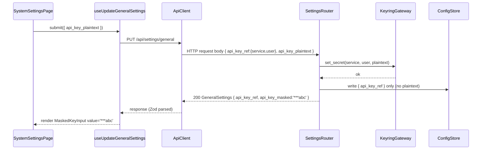

# Feature Detailed Design：F22 · Fe-Config — SystemSettings + PromptsAndSkills + DocsAndROI + ProcessFiles + CommitHistory（Feature #22）

**Date**: 2026-04-26
**Feature**: #22 — Fe-Config 五页合并（SystemSettings + PromptsAndSkills + DocsAndROI + ProcessFiles + CommitHistory）
**Priority**: medium
**Dependencies**: F01(id=1) · F10(id=3) · F12(id=12) · F19(id=19) · F20(id=20)（全部 passing）
**Design Reference**: `docs/plans/2026-04-21-harness-design.md` §4.7（lines 550-595）+ §6.2.2 IAPI-002 路由表（lines 1133-1167）
**SRS Reference**: FR-032 · FR-033（v1 仅基础编辑）· FR-035（v1 仅文件树+MD预览）· FR-038 · FR-039 · FR-041 · NFR-008 · IFR-004 · IFR-005 · IFR-006

---

## Context

F22 实现 Harness UI 的"配置 / 文档 / 过程数据"五页面（`/settings`、`/skills`、`/docs`、`/process-files`、`/commits`），对应 UCD §4.3 / §4.4 / §4.6 / §4.7 / §4.8。本特性是**纯前端消费层**：所有 REST 路由由 F01 / F19 / F20 / F10 已 passing 的后端 Provides；前端不直接调 keyring lib，明文密钥不出后端，UI 始终走 masked reference。本特性是 NFR-008（API key 仅 keyring）的最后一道执行屏障，也是 FR-038/039 双层校验在前端侧的落地点。

---

## Design Alignment

完整复制 design §4.7（lines 550-595）：

> **4.7.1 Overview**：实现 UCD §4.3（SystemSettings）· §4.4（PromptsAndSkills）· §4.6（DocsAndROI）· §4.7（ProcessFiles）· §4.8（CommitHistory）五页，入口 `/settings`（feature-list.json 的 `ui_entry`）。承接 FR-032/033/035/038/041 + NFR-008 + IFR-004/005/006。视觉真相源：`pages/SystemSettings.jsx` · `PromptsAndSkills.jsx` · `DocsAndROI.jsx` · `ProcessFiles.jsx` · `CommitHistory.jsx`。
>
> **4.7.2 职责范围**（节选要点）：
> - SystemSettings：5 tab（Models / ApiKey / Classifier / MCP / UI）；ApiKey 字段 masked input（`***abc`），明文不入 DOM，PUT 仅写 keyring reference；Linux 无 Secret Service daemon → keyrings.alt + 顶部告警横幅。
> - PromptsAndSkills：skill tree 只读 + markdown 预览 + classifier prompt 可编辑 + Plugin 更新 modal；prompt 保存 → diff 历史追加（F19 提供）；skill tree 路径不允许 `..` 穿越。
> - DocsAndROI：文件树（`docs/plans/*` + `docs/features/*`）+ markdown 预览 + 右侧 TOC；ROI 按钮 `disabled` + tooltip "v1.1 规划中"；路径 `..` 一律拒绝（SEC）。
> - ProcessFiles：结构化编辑器（feature-list.json 等）；schema 驱动（pydantic → Zod 导出到 `apps/ui/src/lib/zod-schemas.ts`）；前端 Zod + 后端 `POST /api/validate/:file` 双层校验；必填空 → 字段红框 + Save 禁用。
> - CommitHistory：commit 列表 + diff viewer；二进制文件 diff 显示占位（不崩）；非 git 目录 `exit=128` → UI 横幅告警；DiffViewer 视觉沿用 prototype。
>
> **4.7.3 Module Layout**（建议）：`apps/ui/src/routes/{system-settings,prompts-and-skills,docs-and-roi,process-files,commit-history}/`。
>
> **4.7.4 Integration Surface**：见下表。
>
> **4.7.5 视觉保真**：5 页跑 UCD §7 视觉回归（pixelmatch < 3%）；SystemSettings 5 tab 左 vertical tab + 右 SettingsFormSection 卡片堆叠；Skill tree 节点 expand chevron + readonly 锁；DiffViewer add/del 行背景透明度 + gutter 色取 tokens.css `--diff-*`。

- **Key types**（自 §4.7 + §6.2.4 schema）：
  - 路由根：`apps/ui/src/routes/system-settings/index.tsx` · `prompts-and-skills/index.tsx` · `docs-and-roi/index.tsx` · `process-files/index.tsx` · `commit-history/index.tsx`
  - 共享 hook：`useGeneralSettings` · `useModelRules` · `useClassifierConfig` · `usePromptHistory` · `useSkillTree` · `useFileTree` · `useFileContent` · `useCommits` · `useDiff` · `useValidate` · `useTestConnection` · `useSkillsInstall` · `useSkillsPull`（全部由 `createApiHook` 工厂构造）
  - Zod schema 同步层：`apps/ui/src/lib/zod-schemas.ts`（由后端 pydantic v2 模型经 `scripts/export_zod.py` 调用 datamodel-code-generator 自动生成）
  - 局部组件：`MaskedKeyInput` · `KeyringFallbackBanner` · `SettingsFormSection`（5 tab 共享）· `SkillTreeViewer` · `MarkdownPreview` · `FileTree` · `TocPanel` · `RoiDisabledButton` · `ProcessFileForm` · `CrossFieldErrorList` · `CommitList` · `DiffViewer` · `BinaryDiffPlaceholder` · `NotAGitRepoBanner`
- **Provides** → 路由 `/settings` · `/skills` · `/docs` · `/process-files` · `/commits`（前端 React Router 注册到 `apps/ui/src/App.tsx`，由 F12 AppShell 已具备的 Sidebar nav id 5 项消费）
- **Requires**：

| 方向 | Producer | Contract ID | Endpoint | Schema |
|---|---|---|---|---|
| Requires | F01 | IAPI-002 | `GET/PUT /api/settings/general` | `GeneralSettings` |
| Requires | F01 | IAPI-014 | keyring（经 REST，明文不过线） | `ApiKeyRef` |
| Requires | F19 | IAPI-002 | `GET/PUT /api/settings/model_rules` · `/api/settings/classifier` · `/api/settings/classifier/test` · `/api/prompts/classifier` | `ModelRule[]` · `ClassifierConfig` · `ClassifierPrompt` |
| Requires | F10 | IAPI-018 | `GET /api/skills/tree` · `POST /api/skills/install\|pull` | `SkillTree` · `SkillsInstallRequest` · `SkillsInstallResult` |
| Requires | F20 | IAPI-002 | `GET /api/files/tree` · `GET /api/files/read` · `GET /api/git/commits` · `GET /api/git/diff/:sha` | `FileTree` · `FileContent` · `GitCommit[]` · `DiffPayload` |
| Requires | F20 | IAPI-016 | `POST /api/validate/:file` | `ValidationReport` |
| Requires | F12 | 内部 FE import | Sidebar / PageFrame / shared primitives / `apiClient` / `createApiHook` | — |

- **Deviations**: 无。所有调用契约与 §6.2.2 路由表 + §6.2.4 schema 字面对齐；F22 不发起任何 §4 契约偏离。

**UML 嵌入**（按 §2a 触发判据，本特性满足"≥2 对象 / 服务的调用顺序"）：嵌入 ApiKey 保存→keyring→GET 回填的 sequenceDiagram；类协作图等价信息在 §4.7 表中已定义，按 §2a 不重复绘制（`见系统设计 §4.7 Integration Surface 表`）。

> 调用序消息编号（供 Test Inventory `Traces To` 引用）：
> - msg#1: `submit({ api_key_plaintext })`
> - msg#2: `PUT /api/settings/general`
> - msg#3: `set_secret(service, user, plaintext)`
> - msg#4: `write { api_key_ref } only`
> - msg#5: `200 GeneralSettings { api_key_masked:'***abc' }`

---

## SRS Requirement

完整复制 srs_trace 涉及条目（来自 `docs/plans/2026-04-21-harness-srs.md`）：

### FR-032: SystemSettings 界面（Must）
- **可视化输出**：分区表单，API key 字段显示 `***abc`。
- **AC**：Given 用户输入 API key，when 保存，then keyring 存原文且 UI 下次打开显示 masked。
- **来源**：raw_requirements G.32

### FR-033: PromptsAndSkills 界面（Should · v1 仅基础编辑）
- **EARS**：The system shall 提供 PromptsAndSkills 界面只读展示 `plugins/longtaskforagent/skills/*/SKILL.md`（markdown 高亮 + YAML frontmatter）；Harness 自身 `classifier/system_prompt.md` 可编辑且带版本历史（diff 列表）。
- **可视化输出**：左侧 skill 树 + 右侧内容渲染；classifier prompt 有 Edit 按钮和历史版本列表（v1.1 才有 diff viewer，FR-033b 为 Won't）。
- **AC**：
  - Given skill 目录，when 打开页面，then 树形列出所有 SKILL.md 且点击显示内容只读
  - Given 编辑 classifier prompt 并保存，when 重新打开，then 版本历史多一条

### FR-035: DocsAndROI 界面（Should · v1 仅文件树 + Markdown 预览）
- **可视化输出**：左树 + 右 markdown 预览 + ROI 按钮。
- **AC**：Given 选中 SRS §4.1 节，when 点击 ROI 按钮，then 右侧显示 ROI 面板（由 FR-036/037 生成）。
- **v1 范围声明**：FR-035b / 036 / 037 全为 Won't (v1) → ROI 按钮 disabled + tooltip "v1.1 规划中"。

### FR-038: ProcessFiles 界面结构化表单（Must）
- **EARS**：The system shall 提供 ProcessFiles 界面，对 workdir 下的 `feature-list.json` / `env-guide.md` / `long-task-guide.md` / `.env.example` 等关键过程文件提供结构化表单编辑。
- **可视化输出**：文件选择 → 表单视图 + raw 视图切换按钮。
- **AC**：Given `feature-list.json` schema，when 打开表单，then 字段按 schema 分组呈现。

### FR-039: 过程文件前端 + 后端双层校验（Must）
- **EARS**：While 用户在 ProcessFiles 表单中编辑, the system shall 实时（onChange）执行前端结构校验（字段类型 / 必填）；保存时调用后端权威校验脚本（如 `scripts/validate_features.py`）集中校验并以 inline 红色显示错误。
- **AC**：
  - Given 必填字段空，when onChange，then 字段红色且 Save 按钮禁用
  - Given 前端通过但后端报错（跨字段校验），when 保存，then 错误列表内联显示

### FR-041: CommitHistory 界面（Must）
- **EARS**：The system shall 提供 CommitHistory 界面显示每个 run 每个 feature 完成后的 git commits 列表，点击 commit 显示 `git show --stat` + 文件 diff（web diff viewer），并支持按 feature / run 过滤。
- **AC**：
  - Given run 完成 5 个 feature 产生 8 commits，when 打开页面，then 列表显示 8 条
  - Given 选中一个 commit，when 右侧 diff viewer，then 显示文件级 diff

### NFR-008: API key 仅存平台 keyring（Must · SEC）
- 仅存平台 keyring；不以明文写入任何 json/yaml 文件；measurement = 递归 grep 配置目录无明文 + keyring list 含对应 entry。

### IFR-004: OpenAI-compat HTTP API（Wave 3 effective_strict 段）
- 协议：HTTP POST `<base_url>/v1/chat/completions` + `Authorization: Bearer <key>`。
- effective_strict=true（默认 GLM/OpenAI/custom）→ body 含 `response_format={type:'json_schema', json_schema:{strict:true,...}}`；effective_strict=false（MiniMax 默认或用户覆写 `strict_schema_override`）→ body **不含** `response_format`，system 末尾追加 JSON-only suffix。
- F22 消费侧：classifier `Settings → Classifier` tab 提供 `strict_schema_override: bool | null` 三态控件（null=preset 默认 / true / false）；测试连接按钮 `POST /api/settings/classifier/test` 处理 401/502 错误码并以横幅显示。

### IFR-005: git CLI subprocess
- 命令：`status --porcelain` / `rev-parse HEAD` / `log --oneline` / `show --stat` / `pull`。
- F22 消费：`/api/git/commits` + `/api/git/diff/:sha`；非 git 目录 `exit=128` → 后端返 502 + `{kind:"not_a_git_repo"}` → 前端 `NotAGitRepoBanner`。

### IFR-006: 平台 keyring
- python `keyring` 库（macOS Keychain / freedesktop Secret Service / Windows Credential Manager）；Linux 无 Secret Service daemon → 降级 `keyrings.alt` 文件后端 + UI 顶部 `KeyringFallbackBanner` 告警。

---

## Interface Contract

> 本特性是**纯前端消费层**；下表列出 5 页面共用的 React 组件 / hook 公开 API（页面内部状态 reducer 由 TDD 决定不暴露）。所有 hook 经 `createApiHook` 工厂构造，请求 / 响应 schema 由 `apps/ui/src/lib/zod-schemas.ts` 同步导出。

### A. SystemSettings（5 tab · `/settings`）

| Method | Signature | Preconditions | Postconditions | Raises |
|---|---|---|---|---|
| `useGeneralSettings` | `() => UseQueryResult<GeneralSettings>` | AppShell mounted；REST 可达 | 返回 `{ api_key_ref?, api_key_masked?, ... }`；`api_key_masked` 必为 `***xxx` 形式（最后 3 字符）或 null | HttpError 4xx · ServerError 5xx · NetworkError |
| `useUpdateGeneralSettings` | `() => UseMutationResult<GeneralSettings, HttpError, { api_key_plaintext?: string; ... }>` | 用户在 ApiKey tab 输入；plaintext 仅在请求体生命周期存在；fetch 完成后内存引用解除 | 调用后服务端 keyring 含 secret；响应体不含 plaintext；`api_key_masked` 已更新；mutation cache 清除 plaintext | HttpError 400（invalid base_url SSRF）· ServerError 500（KeyringError）· NetworkError |
| `useTestConnection` | `() => UseMutationResult<TestConnectionResult, HttpError, TestConnectionRequest>` | classifier base_url + api_key_ref 已就绪 | 成功 → `{ ok:true, model:"<id>", latency_ms:N }`；失败 → response.ok=false 但**不抛**（路由层 401 → 400 / refused → 502 / DNS → 500，hook 经 `useMutation` 暴露 `error.status`） | HttpError（401→400, refused→502, DNS→500）· NetworkError |
| `useGeneralKeyringStatus` | `() => UseQueryResult<{ backend: 'native' \| 'keyrings.alt' \| 'fail' }>` | AppShell mounted；后端 `/api/settings/general` 响应附带 `keyring_backend` 字段（F01 已 provides） | `backend === 'keyrings.alt'` → 触发 `<KeyringFallbackBanner>` 渲染；`backend === 'fail'` → 同上 + 错误样式 | HttpError · NetworkError |
| `<MaskedKeyInput value masked onChange>` | React FC `(props: { masked: string \| null; onSubmitPlaintext: (s: string) => void; disabled?: boolean }) => ReactElement` | masked 来自 `useGeneralSettings` 响应 | 渲染只读字段显示 masked；点击 "更换" 切换为 password input；提交后即清空内部 state；DOM 中**任何节点** `textContent / value / data-* / aria-*` 不含 plaintext substring | — |
| `<KeyringFallbackBanner backend>` | React FC `(props: { backend: 'native' \| 'keyrings.alt' \| 'fail' }) => ReactElement \| null` | — | `backend === 'native'` → 返回 null；其他 → 渲染顶部 Alert 含 `data-testid="keyring-fallback-banner"` 与 `aria-label="Keyring 降级告警"` | — |

### B. PromptsAndSkills（`/skills`）

| Method | Signature | Preconditions | Postconditions | Raises |
|---|---|---|---|---|
| `useSkillTree` | `() => UseQueryResult<SkillTree>` | F10 已 provides `/api/skills/tree` | 返回树 `{ name, path, kind:'plugin'\|'skill'\|'file', children?[] }`；任何 path 段含 `..` → 后端 400，hook surface 为 HttpError 400 | HttpError 400（path traversal）· ServerError 500 · NetworkError |
| `usePromptHistory` | `() => UseQueryResult<ClassifierPrompt>` | — | 返回 `{ current:{ content, hash }, history:[{ hash, content_summary, created_at, author? }] }`；history 按 created_at desc | HttpError · NetworkError |
| `useUpdateClassifierPrompt` | `() => UseMutationResult<ClassifierPrompt, HttpError, { content: string }>` | content 非空 | 调用后 `history.length` += 1；新 entry `hash !== 旧 history[0].hash`；`current.hash` === 新 entry.hash | HttpError 400 · ServerError 500 |
| `useSkillsInstall` / `useSkillsPull` | `() => UseMutationResult<SkillsInstallResult, HttpError, SkillsInstallRequest \| void>` | URL 形如 `https://...` 或 `git+ssh://...`；后端做白名单校验 | 成功 → 返回 commit sha；失败 → HttpError 400（白名单拒）/ 409（已存在）/ 500（git 失败） | HttpError 400/409 · ServerError 500 |
| `<SkillTreeViewer tree onSelect>` | React FC `(props: { tree: SkillTree; onSelect: (path: string) => void }) => ReactElement` | tree 已加载 | 节点带 `data-skill-readonly="true"` 且无 onClick edit handler；expand chevron 通过 `aria-expanded` 反映状态；点击节点触发 onSelect | — |

### C. DocsAndROI（`/docs`）

| Method | Signature | Preconditions | Postconditions | Raises |
|---|---|---|---|---|
| `useFileTree` | `(root: string) => UseQueryResult<FileTree>` | root ∈ `{'docs/plans','docs/features','docs'}`；前端不构造 `..` | 返回 `{ root, entries:[{ path, kind:'dir'\|'file', size? }] }`；任何 entry.path 必以 root 为前缀 | HttpError 400（root 非法）· NetworkError |
| `useFileContent` | `(path: string \| null) => UseQueryResult<FileContent>` | path 不含 `..`；后端二次校验 | 返回 `{ path, content, encoding:'utf-8' }`；超大文件（>1MB）后端截断并设 `truncated:true` | HttpError 400/404 |
| `<RoiDisabledButton>` | React FC | — | 渲染 `<button disabled aria-disabled="true">`；hover 触发 tooltip 文本 "v1.1 规划中"（`data-testid="roi-tooltip"`）；onClick 不触发任何 mutation | — |
| `<MarkdownPreview content>` | React FC `(props: { content: string }) => ReactElement` | content 是 utf-8 字符串 | 经 `react-markdown` 渲染 GFM；脚本标签被 sanitizer 剥离；输出至 `
` | — |
| `<TocPanel content>` | React FC `(props: { content: string }) => ReactElement` | — | 解析 H1-H4 → 构建 TOC `<nav data-component="toc">`；点击锚点滚动到 `#heading-slug` | — |

### D. ProcessFiles（`/process-files`）

| Method | Signature | Preconditions | Postconditions | Raises |
|---|---|---|---|---|
| `useValidate` | `(file: 'feature-list.json'\|'env-guide.md'\|'long-task-guide.md'\|'.env.example') => UseMutationResult<ValidationReport, HttpError, ValidateRequest>` | file 在白名单内；ValidateRequest schema-valid | 返回 `{ ok: bool, issues:[{ path, level:'error'\|'warning', message }], stderr_tail? }`；ok=false 时 issues 非空；stderr_tail 在 subprocess 崩溃时附带 | HttpError 400 · ServerError 500（注意：subprocess exit≠0 不被吞，作为 ValidationReport.ok=false 返回，**不抛**） |
| `<ProcessFileForm file schema value onChange>` | React FC `(props: { file: string; schema: ZodSchema; value: unknown; onChange: (next: unknown) => void; onSave: () => void }) => ReactElement` | schema 来自 `apps/ui/src/lib/zod-schemas.ts` 的导出对象 `processFileSchemas[file]`；value 反序列化自后端 raw text 或本地编辑 | onChange 时立即跑 `schema.safeParse(next)`；不通过的字段 DOM 加 `data-invalid="true"` + ``；任一字段 invalid → Save 按钮 `disabled`；Save 调用 `useValidate(file).mutate({ path, content })` 二次校验；后端返回 ok=false → 渲染 `<CrossFieldErrorList issues={...}>` | — |
| `<CrossFieldErrorList issues>` | React FC `(props: { issues: ValidationIssue[] }) => ReactElement` | — | 列表 `<ul data-component="cross-field-errors">`；每条 `<li data-error-level={level} data-error-path={path}>`；level=error 红色 / warning 黄色 | — |
| `loadProcessFileSchema` | `(file: string) => ZodSchema<unknown>` | file 在白名单内 | 返回 `processFileSchemas[file]`；缺失则抛 `Error('schema not found')` | `Error` |

### E. CommitHistory（`/commits`）

| Method | Signature | Preconditions | Postconditions | Raises |
|---|---|---|---|---|
| `useCommits` | `(filter: { run_id?: string; feature_id?: number }) => UseQueryResult<GitCommit[]>` | F20 已 provides | 返回 `[{ sha, parents[], author, ts, subject, run_id?, feature_id? }]`；后端非 git → HttpError 502 + `{ code:'not_a_git_repo' }` | HttpError 502（非 git）· NetworkError |
| `useDiff` | `(sha: string \| null) => UseQueryResult<DiffPayload>` | sha 形如 7-40 hex 字符 | 返回 `{ sha, files:[{ path, kind:'text'\|'binary', placeholder?:bool, hunks?[] }] }`；二进制文件 `kind='binary' && placeholder=true` 且 `hunks` 缺失 | HttpError 404（sha 不存在） |
| `<CommitList commits selected onSelect>` | React FC | commits 数组 | 渲染列表 `<ul data-component="commit-list">`；每行 `data-sha={sha}`；点击触发 onSelect(sha) | — |
| `<DiffViewer diff>` | React FC `(props: { diff: DiffPayload }) => ReactElement` | diff 已加载 | 文本文件经 `react-diff-view` 渲染 add/del 行；二进制文件 → 渲染 `<BinaryDiffPlaceholder file={...}>`，**不崩**；add/del 行背景 / gutter 色取自 `tokens.css` 的 `--diff-add-bg` / `--diff-del-bg` 等变量（**不**在本组件内硬编码 hex） | — |
| `<BinaryDiffPlaceholder file>` | React FC `(props: { file: { path: string; kind: 'binary' } }) => ReactElement` | — | 渲染占位 `
二进制文件: {path}
` | — |
| `<NotAGitRepoBanner show>` | React FC `(props: { show: bool }) => ReactElement \| null` | — | show=false 返回 null；show=true 渲染 `
非 git 目录，git 命令不可用
` | — |

**Design rationale**：
- **MaskedKeyInput 不持久化 plaintext 到 React state 之外**：plaintext 仅活在 controlled component 内部 useState 直至 onSubmitPlaintext 调用后立即 reset，避免 React DevTools props 透出（NFR-008）。
- **useTestConnection 不抛错**：测试连接是用户主动行为，错误信息要展示而非抛出（IFR-004 路径错误码经 mutation result.error 暴露）。
- **useValidate 不吞 subprocess 崩溃**：subprocess exit=1 时后端把 stderr_tail 拼入 ValidationReport.issues，hook 仍 resolve 而非 reject，因此 UI 能内联显示崩溃栈（FR-039 / Err-I 场景）。
- **路径穿越拦截在后端**（F20 已实现）：前端 hook 不做 sanitize，只确保自身 URL 构造时把 path 当 query string 编码；后端 400 错误经 ErrorBoundary 转 toast。
- **跨特性契约对齐**：所有方法签名匹配 design §6.2.2 路由表 + §6.2.4 schema；本特性作为 IAPI-002 / IAPI-014 / IAPI-016 / IAPI-018 的 **Consumer**，不重定义 schema，由 `apps/ui/src/lib/zod-schemas.ts` 自动同步。

---

## Visual Rendering Contract

视觉真相源：`docs/design-bundle/eava2/project/pages/{SystemSettings,PromptsAndSkills,DocsAndROI,ProcessFiles,CommitHistory}.jsx`。本节按 UCD §6 引用禁令仅指针化引用，**不**复述 hex / 间距 / 字号；只列 DOM/语义层可测断言。

**Rendering technology**：DOM + CSS（Tailwind + tokens.css 变量）；无 Canvas / WebGL / SVG（除 lucide icon 内的小型 inline SVG）。

**Entry point function**：5 个 `routes/<page>/index.tsx` 顶层 `export default function <Page>()`；由 React Router 在 `apps/ui/src/App.tsx` 挂载到 `/settings` · `/skills` · `/docs` · `/process-files` · `/commits`。

**Render trigger**：路由切换 + TanStack Query 数据返回 → 组件 re-render；MaskedKeyInput / ProcessFileForm 受控；CommitList / DiffViewer 由用户点击触发。

| Visual Element | DOM/Canvas Selector | Rendered When | Visual State Variants | Minimum Dimensions | Data Source |
|---|---|---|---|---|---|
| SystemSettings 左侧 vertical tab 列 | `[data-component="settings-vtabs"] .vtab` | 进入 `/settings` | 5 个 tab，激活 tab `data-active="true"` 显示左缘 accent 条 | 5 项 ≥ 5 个 DOM 节点 | 静态 tab id 数组（Models/ApiKey/Classifier/MCP/UI） |
| SystemSettings 右侧 SettingsFormSection 卡片堆叠 | `[data-component="settings-form-section"]` | 进入 `/settings` 任一 tab | 每 tab 渲染 ≥1 卡片 | ≥1 个 `card` 节点 | 后端 `GeneralSettings` / `ModelRule[]` / `ClassifierConfig` |
| ApiKey masked 字段 | `[data-component="masked-key-input"]` | ApiKey tab + `api_key_masked != null` | masked 模式（只读，文本以 `***` 开头）/ 编辑模式（type=password 输入） | input 高度 ≥ 32px（tokens 控制） | `useGeneralSettings().api_key_masked` |
| KeyringFallbackBanner | `[data-testid="keyring-fallback-banner"]` | `keyring_backend !== 'native'` | warning 样式（keyrings.alt）/ error 样式（fail） | 横向占满 PageFrame 顶部 | `useGeneralKeyringStatus().backend` |
| Skill 树 readonly 节点 | `[data-component="skill-tree-viewer"] [data-skill-readonly="true"]` | 进入 `/skills` 且 `useSkillTree` 完成 | 锁图标（lucide `Lock`）显示 | tree 节点数 = `tree.entries.length` 递归 | `useSkillTree()` |
| Classifier prompt 编辑 + 历史列表 | `[data-component="prompt-editor"]` + `[data-component="prompt-history"] li` | `/skills` 选中 classifier prompt 节点 | 历史列表条数 == `usePromptHistory().history.length` | 历史区 ≥1 行（保存后） | `usePromptHistory()` |
| DocsAndROI 三 pane（文件树 / 预览 / TOC） | `[data-component="docs-tree"]` + `[data-component="markdown-preview"]` + `[data-component="toc"]` | 进入 `/docs` | 选中文件 → 预览渲染；未选中 → 预览空态 | 三 pane 横向并排 | `useFileTree()` + `useFileContent()` |
| ROI disabled button + tooltip | `button[data-testid="roi-button"][disabled][aria-disabled="true"]` + `[data-testid="roi-tooltip"]` | 进入 `/docs` | hover → tooltip 显式文本 "v1.1 规划中" | tooltip ≥1 文本节点 | 静态文案 |
| ProcessFiles 表单字段 + 红框 | `[data-component="process-file-form"] [data-invalid="true"]` | 必填字段空 onChange 后 | 红框样式（CSS `border-color: var(--state-fail)`）；Save 按钮 disabled | invalid 字段 ≥1 时 Save `disabled=true` | `schema.safeParse(value)` |
| CrossFieldErrorList | `[data-component="cross-field-errors"] li` | 后端 `useValidate` 返回 ok=false | 每条 issue 一行；error/warning 颜色不同 | 至少 1 行 | `useValidate().data.issues` |
| CommitList 行 | `[data-component="commit-list"] [data-sha]` | 进入 `/commits` 且 commits 加载 | 选中行 `data-selected="true"` | 行数 == `useCommits().data.length` | `useCommits()` |
| DiffViewer add/del 行 | `[data-component="diff-viewer"] .diff-line[data-line-type]` | 选中 commit + diff 加载且 file.kind=='text' | add 行 `data-line-type="add"` 绿背景；del 行 `data-line-type="del"` 红背景；色取自 `tokens.css --diff-*` | hunks 中每行一个 DOM 节点 | `useDiff()` |
| BinaryDiffPlaceholder | `[data-component="binary-diff-placeholder"]` | 选中 commit 且 file.kind=='binary' | 文本占位含路径 | 至少 1 文本节点 | `DiffPayload.files[].kind` |
| NotAGitRepoBanner | `[data-testid="not-a-git-repo-banner"]` | `useCommits` 错误 status=502 且 code='not_a_git_repo' | role="alert" | 横向占满顶部 | hook error.detail.code |

**正向渲染断言**（触发后必须视觉存在 / DOM 可断言）：
- [ ] `/settings` 加载后 `[data-component="settings-vtabs"] .vtab` 节点数 == 5；激活 tab 节点带左缘 accent 条（计算样式 `border-left-color` ≠ transparent）。
- [ ] ApiKey tab 加载后 `[data-component="masked-key-input"]` 文本以 `***` 开头；DOM 全树（含 `data-*` / `aria-*` / value） grep 不含 plaintext substring。
- [ ] `keyring_backend === 'keyrings.alt'` 时 `[data-testid="keyring-fallback-banner"]` 存在且 visible。
- [ ] `/skills` 加载后 `SkillTreeViewer` 至少渲染一个 `[data-skill-readonly="true"]` 节点；编辑 classifier prompt 并 mutate 后 `[data-component="prompt-history"] li` 数量 +1。
- [ ] `/docs` 加载后三 pane DOM 节点同时存在；ROI 按钮 disabled + hover tooltip 文本 = "v1.1 规划中"。
- [ ] ProcessFiles 必填字段清空后该字段带 `data-invalid="true"`；Save 按钮 `disabled` 属性存在；后端 422 / cross-field 错误时 `[data-component="cross-field-errors"] li` 数量 ≥1。
- [ ] CommitHistory 加载 8 条 commits → `[data-component="commit-list"] [data-sha]` 数量 == 8；点击其中一条 → `[data-component="diff-viewer"]` 内 `.diff-line` 节点 ≥1（文本文件）或 `[data-component="binary-diff-placeholder"]` 存在（二进制）。
- [ ] 后端非 git 目录 → `[data-testid="not-a-git-repo-banner"][role="alert"]` 渲染。
- [ ] 5 页 vs `design-bundle/eava2/project/pages/*.jsx` 截图 pixelmatch 差异率 < 3%（UCD §7 SOP）。

**交互深度断言**（已渲染必须响应交互 — 防 display-only 缺陷）：
- [ ] MaskedKeyInput 点击 "更换" → 字段切换为 type=password 输入框；输入后点 "保存" → 触发 `useUpdateGeneralSettings.mutate({ api_key_plaintext })`；mutation 完成后内部 plaintext state 重置为空字符串（React DevTools props 不再含 plaintext）。
- [ ] SystemSettings 5 tab 点击切换 → URL 不变但右侧 SettingsFormSection 内容切换（DOM diff 可见）。
- [ ] PromptEditor 编辑文本后点 "保存" → `usePromptHistory().history` 长度 +1；新条目 hash 与旧 history[0].hash 不同。
- [ ] SkillTreeViewer 点击叶子节点 → 触发 onSelect(path)，右侧 MarkdownPreview 内容更新（content 长度 > 0）。
- [ ] DocsAndROI 文件树点击 .md 文件 → MarkdownPreview content 变化；点击 H2 锚点 → 滚动到对应位置（`window.scrollY` 改变 或 容器 scrollTop 改变）。
- [ ] DocsAndROI ROI 按钮 onClick → **不触发**任何 mutation 或 query（hook spy 期望 calls=0），仅 tooltip 显示。
- [ ] ProcessFileForm 输入框 onChange 任意必填字段为空 → 该字段 `data-invalid="true"` 且 Save 按钮 `disabled`；填回非空 → invalid 移除且 Save 启用；点击 Save 按钮 → 触发 `useValidate.mutate`。
- [ ] CommitList 点击行 → `data-selected="true"` 移到该行；DiffViewer 内容由 `useDiff(sha)` 替换。
- [ ] SkillsInstall modal 提交无效 URL（如 `file://...`） → 收到 HttpError 400 → toast 显示错误，不创建任何本地副作用。

---

## Implementation Summary

**1) 主要类 / 函数与文件布局**：5 个新增路由根 `apps/ui/src/routes/{system-settings,prompts-and-skills,docs-and-roi,process-files,commit-history}/index.tsx`；每页拆分子组件到 `routes/<page>/components/`（`masked-key-input.tsx` / `keyring-fallback-banner.tsx` / `settings-form-section.tsx` / `skill-tree-viewer.tsx` / `markdown-preview.tsx` / `toc-panel.tsx` / `roi-disabled-button.tsx` / `process-file-form.tsx` / `cross-field-error-list.tsx` / `commit-list.tsx` / `diff-viewer.tsx` / `binary-diff-placeholder.tsx` / `not-a-git-repo-banner.tsx`）。共享 hook 集中到 `apps/ui/src/api/routes/`（每个端点一个文件，例如 `settings-general.ts`、`skills-tree.ts`、`git-commits.ts`），全部经 `createApiHook(routeSpec)` 工厂构造。Zod schema 合集落 `apps/ui/src/lib/zod-schemas.ts`，由 `scripts/export_zod.py` 在 init/CI 阶段从 `harness/api/schemas/` 下的 pydantic 模型经 datamodel-code-generator 生成（首次实现需在 `package.json` 添加 `predev` / `prebuild` 脚本钩子并新增 dev-deps `react-markdown@^9` `react-diff-view@^3.2`）。`apps/ui/src/App.tsx` 添加 5 条 `<Route>`（`/settings` `/skills` `/docs` `/process-files` `/commits`）；Sidebar nav id 已就绪（id=`settings`/`skills`/`docs`/`process`/`commits`），AppShell `RouteSpec` 透传即可。

**2) 调用链**：浏览器路由 → `<AppShell>` → `<Frame>` → `<PageFrame>` → 路由根组件 →（用户交互）→ TanStack Query hook → `apiClient.fetch(method, path, body)` → FastAPI（127.0.0.1）→ F19 SettingsRouter / F20 GitTracker / F10 SkillsInstaller 等 Provides → keyring / git CLI / subprocess validator → 响应回流 → `responseSchema.parse` → React re-render。**关键**：F22 不直接调 keyring lib（IFR-006 由后端封装），不直接 spawn git（IFR-005 由后端封装），不直接执行 subprocess validator（FR-039 由后端 `POST /api/validate/:file` 路由封装）。

**3) 关键设计决策**：
- **NFR-008 全链路 plaintext 隔离**：plaintext 只在 mutation 请求体生命周期内存在；MaskedKeyInput 提交后立即 `setPlaintextDraft('')`；`tanstack-query` mutation cache 由 `gcTime: 0` 强制不保留；TestInventory 含 [SEC] DOM 全树 grep 用例确保非测试场景下 DOM 任意节点（含 React Fiber 内部 props）不含 plaintext substring。
- **双层校验顺序**：onChange 前端立即跑 Zod；Save 才触发后端 `POST /api/validate/:file`；后端 ValidationReport.ok=false 时不重置前端 dirty 状态（用户可继续编辑），错误内联展示而非 toast。
- **CommitHistory 二进制 diff 占位**：DiffPayload.files[].kind 由后端判定（git diff 输出 `Binary files ... differ` 时设 `kind='binary' placeholder=true`）；前端 DiffViewer 根据 kind 分支渲染，**不**调用 react-diff-view（避免空 hunks 触发库内崩溃）。
- **classifier prompt v1 仅历史列表无 diff viewer**：FR-033b 是 Won't (v1)，UI 仅展示历史条目（hash + content_summary + ts），不渲染 inline diff；点击历史条目仅展示 readonly 旧版本（无 revert 按钮）。
- **ROI 按钮 disabled 是核心 v1.1 标记**：FR-035b/036/037 全为 Won't；按钮渲染 `<button disabled aria-disabled>` + tooltip "v1.1 规划中"；点击不触发任何 mutation / query（防止后续误启 ROI side-ticket pipeline）。
- **路径穿越仅在前端体现为错误反馈**：前端 fetch URL 不构造 `..`，但需可观察后端拒绝（HttpError 400）→ 错误 toast 显示，作为 SEC 测试的可观察表面。

**4) 与既有模块的交互**：
- F12 `apps/ui/src/components/{sidebar,page-frame}.tsx` 已就绪 → 直接引用，**不改**这两个文件（它们由 F12 owner 维护）。Sidebar 已含 5 个相关 nav id（`settings`/`skills`/`docs`/`process`/`commits`），无需扩展。
- F12 `apps/ui/src/api/{client,query-hook-factory}.ts` 是工厂层 → F22 仅 `import { createApiHook }` 与 `import { apiClient }`，**不改**。
- F12 `apps/ui/src/theme/tokens.css` 是单一视觉源 → DiffViewer 取 `--diff-add-bg` / `--diff-del-bg` / `--diff-gutter` 等变量；如 token 缺失则在 token 文件追加 `--diff-*` 变量并报告给 F12 owner（不在本特性内硬编码 hex）。
- F19 `harness/dispatch/classifier/prompt_store.py` 已实现 PromptStore 的 history append 语义；F22 仅消费 `GET/PUT /api/prompts/classifier`。
- F20 `harness/git/*` + `harness/subprocess/validator.py` 已实现 git CLI / subprocess validator；F22 不直接调用，全部经 REST。
- F10 `harness/skills/*` 已实现 SkillsInstaller；F22 仅经 `POST /api/skills/install\|pull`。
- env-guide §4 全空（greenfield）→ 无强制内部库 / 禁用 API / 命名约定约束；本特性沿用既有 React FC `PascalCase` + hook `useXxx` + 文件 `kebab-case.tsx` 约定（与 F12/F21 既有代码一致）。

**5) 与 §4 Internal API Contract 集成**：
- F22 是 IAPI-002（消费 14 路由：4 settings + 1 classifier-test + 2 prompts + 2 skills + 4 files/git + 1 validate）的 Consumer；对应 schema 必须严格匹配 `apps/ui/src/lib/zod-schemas.ts` 自动生成的类型（来自后端 pydantic 模型）。
- F22 是 IAPI-014（KeyringGateway）的间接 Consumer：明文不过线，前端只见 `api_key_ref{service,user}` + `api_key_masked`；后端在 PUT 时把 plaintext 取出存 keyring，永不在 GET 响应或任何 audit log 中出现。
- F22 是 IAPI-016（ValidationReport）的 Consumer；ValidationReport.ok=false 时 issues[] 必须含至少一条 message。
- F22 是 IAPI-018（SkillsInstall）的 Consumer。

### Boundary Conditions

| Parameter | Min | Max | Empty/Null | At boundary |
|---|---|---|---|---|
| `MaskedKeyInput.masked` (string\|null) | — | — | null → 渲染 "未配置" 占位；不显示编辑按钮 | masked length=0 → 同 null；length=4（如 `***a`）→ 正常渲染 |
| `useUpdateGeneralSettings({api_key_plaintext})` length | 1 | 后端 1024 chars | 空字符串 → 前端 Zod 拒绝（required） | length=1024 → 通过；length=1025 → Zod 拒绝 + 前端字段红框 |
| `useFileTree(root)` | 'docs' / 'docs/plans' / 'docs/features' | — | null/undefined → 不发请求（hook enabled=false）；含 `..` → 后端 400 | root='docs' 边界 → 返回顶级条目 |
| `useFileContent(path)` length | 0 | 后端阈值 1MB | path=null → 不发请求；path 含 `..` → 后端 400 | content >1MB → `truncated=true` 渲染 banner |
| `useCommits({run_id, feature_id})` | — | — | 全 null → 列出全部 commits（无过滤）；非 git 目录 → 502 | filter 命中 0 commits → 渲染 EmptyState |
| `useDiff(sha)` length | 7 | 40 | null → 不发请求；invalid sha 格式 → 后端 404 | 提交不存在 → HttpError 404 |
| `ProcessFileForm` 必填字段 | — | — | 任一必填空 → `data-invalid="true"` + Save disabled | 全部必填非空 → Save enabled；后端 cross-field 校验仍可拒 |
| `useValidate(file)` ValidationReport.issues 长度 | 0 | — | 0（ok=true）→ 渲染 PASS 面板 | issues=[1] → CrossFieldErrorList 渲染 1 行 |
| `DiffPayload.files[]` 长度 | 0 | 后端分页（>500 行/file） | 0 → DiffViewer 渲染 EmptyState | binary 文件 → BinaryDiffPlaceholder；text 文件 → 正常 hunks |
| Viewport width (px) | 320 | 3840 | — | <1280 → Sidebar 折叠（F12 既有行为）；五页内容自适应 |

### Existing Code Reuse

搜索关键字：`apiClient` / `createApiHook` / `Sidebar` / `PageFrame` / `MaskedKeyInput` / `KeyringFallbackBanner` / `MarkdownPreview` / `DiffViewer` / `SettingsFormSection` / `SkillTreeViewer` / `ProcessFileForm` / `CommitList` / `useGeneralSettings` / `useValidate` / `useFileTree` / `useCommits`。

| Existing Symbol | Location (file:line) | Reused Because |
|---|---|---|
| `apiClient.fetch` | `apps/ui/src/api/client.ts:103-127` | F12 已实现 4xx/5xx/network 三类错误归一化与 `__HARNESS_API_BASE__` 解析；F22 全部 REST 调用经此层 |
| `createApiHook` | `apps/ui/src/api/query-hook-factory.ts:54-89` | F12 hook 工厂强制 `/api/` 前缀 + Zod 解析；F22 14 个 hook 全部用此工厂构造，无需手写 `useQuery` / `useMutation` 样板 |
| `<PageFrame>` + `<Sidebar>` | `apps/ui/src/components/page-frame.tsx` + `sidebar.tsx` | F12 既有；Sidebar 已含 5 个相关 nav id；F22 不重写，仅作为 AppShell route element 的容器消费 |
| `AppShell` route 注册 | `apps/ui/src/app/app-shell.tsx:14-22` | `RouteSpec[]` 数组接口稳定；F22 在 `apps/ui/src/App.tsx`（或同等组合根）push 5 条 RouteSpec |
| `getTokensCssText` + tokens.css | `apps/ui/src/theme/tokens-inline.ts` + `theme/tokens.css` | F12 已注入 token；F22 DiffViewer / MaskedKeyInput / KeyringFallbackBanner 直接引用 CSS 变量 |
| `Icons` | `apps/ui/src/components/icons.ts` | F12 既有 lucide 包装；SkillTreeViewer 锁图标 / RoiDisabledButton tooltip / 各页 header icon 全部复用 |
| `harness.dispatch.classifier.prompt_store.PromptStore` | `harness/dispatch/classifier/prompt_store.py` (F19) | 后端已 provides PUT /api/prompts/classifier 自动 append history；F22 仅消费 |
| `harness.api.prompts` 路由 | `harness/api/prompts.py:1-70` | F19 已实现历史持久化；F22 直接调用 |

> 后端 5 类 Provider（KeyringGateway / SettingsRouter / PromptStore / SkillsInstaller / GitTracker / ValidatorRunner）全部由依赖特性 passing，**严格禁止**在前端重新实现等价 helper。

---

## Test Inventory

> 本表覆盖 5 页面的 happy / 错误 / 安全 / 边界 / UI 渲染 / 集成场景；`devtools` 子标签使用 Chrome DevTools MCP 真浏览器断言；`visual-regression` 子标签按 UCD §7 SOP 跑 pixelmatch；`render` 子标签是 vitest + happy-dom 的 React Testing Library 用例。负向（FUNC/error + BNDRY + SEC）总计 ≥ 40%。

| ID | Category | Traces To | Input / Setup | Expected | Kills Which Bug? |
|---|---|---|---|---|---|
| 22-01 | FUNC/happy | FR-032 AC + §IC `useUpdateGeneralSettings` + §Design Alignment seq msg#1-#5 | useUpdateGeneralSettings 提交 `{ api_key_plaintext: 'sk-test-12345abc' }`，mock `/api/settings/general` 返回 `{ api_key_masked: '***abc' }` | 响应解析后 useGeneralSettings 重新拉取，MaskedKeyInput 显示文本 `***abc` | mutation 完成但 cache 未失效 / masked 字段未回填 |
| 22-02 | SEC/dom-scan | FR-032 SEC + NFR-008 + §VRC `MaskedKeyInput` | 渲染 SystemSettings ApiKey tab，提交 plaintext `sk-supersecret-xyz`，mutation 完成 | 全 DOM 树（`document.body.outerHTML`、所有 `data-*`、所有 input.value、React Fiber pendingProps 序列化）grep `sk-supersecret-xyz` 匹配数 == 0 | 明文残留 React state / 写入 audit / 暴露在 DOM `value`/`textContent` |
| 22-03 | SEC/keyring-fallback | IFR-006 + §VRC `KeyringFallbackBanner` | mock `useGeneralKeyringStatus` 返回 `{ backend: 'keyrings.alt' }` | `[data-testid="keyring-fallback-banner"]` 存在且 `aria-label="Keyring 降级告警"` 可见 | 降级时静默无告警 → 用户误以为安全 keyring 在用 |
| 22-04 | FUNC/error | FR-032 + IFR-004 + §IC `useTestConnection` Raises 401 | mock POST `/api/settings/classifier/test` 返 401 → 路由层映射 HttpError 400 | mutation result.error.status === 400；UI 横幅显示错误 detail；保存按钮**不**被阻塞 | 错误码吞掉 / 错误 detail 不可见 / Save 误被禁用 |
| 22-05 | FUNC/error | IFR-004 + §IC `useTestConnection` Raises 502 | mock 路由层在 connection-refused 下返 502 | mutation result.error.status === 502；UI 显示 "连接被拒绝" 横幅 | 502 被当成 5xx 走 ErrorBoundary 致整页崩 |
| 22-06 | FUNC/happy | FR-033 AC1 + §IC `useSkillTree` + §VRC SkillTreeViewer | mock `/api/skills/tree` 返 3 plugin × 2 skill | `[data-component="skill-tree-viewer"]` 渲染 ≥6 个 `[data-skill-readonly="true"]` 节点 | 树未递归渲染 / 节点缺 readonly 标记 |
| 22-07 | FUNC/happy | FR-033 AC2 + §IC `useUpdateClassifierPrompt` + §VRC prompt-history | usePromptHistory 初始 history.length=2，调用 useUpdateClassifierPrompt({content:'new prompt'})，mock 返回 history.length=3 且 hash 不同 | mutation 完成后 `[data-component="prompt-history"] li` 数量 == 3；新 li 的 hash 与旧 history[0].hash 不同 | 历史未追加 / 重复 hash / UI 未刷新 |
| 22-08 | SEC/path-traversal | FR-033 SEC + §IC `useFileTree` Raises 400 | useFileTree('docs/../etc') hook 触发 → mock 后端 400 detail "path traversal" | hook error.status===400；UI 显示 toast；不渲染任何文件节点 | 前端构造 `..` URL / 后端 400 被吞 / 错误 toast 缺失 |
| 22-09 | SEC/path-traversal | FR-035 SEC + §IC `useFileContent` Raises 400 | useFileContent('docs/plans/../../etc/passwd') | error.status===400；MarkdownPreview 显示空态而非崩溃 | 前端把 `..` 直接编码进 URL / preview 在错误下崩溃 |
| 22-10 | FUNC/happy | FR-035 AC + §VRC docs 三 pane | mock useFileTree 返回 `docs/plans/*.md` 3 个 + useFileContent('docs/plans/...') 返回 markdown 文本 | 三 pane DOM 节点同时存在；MarkdownPreview content > 0；TocPanel 至少 1 个锚点 | 三 pane 任一未渲染 / TOC 解析失败 |
| 22-11 | UI/render | FR-035 v1 subset + §VRC RoiDisabledButton | 渲染 `/docs` 页面 | `button[data-testid="roi-button"]` 含 `disabled` 与 `aria-disabled="true"`；hover 后 `[data-testid="roi-tooltip"]` 文本 == "v1.1 规划中" | 按钮误为 enabled / tooltip 文本漂移 / onClick 触发 mutation |
| 22-12 | FUNC/happy | FR-038 AC + §IC `<ProcessFileForm>` | 加载 feature-list.json schema + value，渲染表单 | 字段按 schema 顶层 key 分组（`features` / `constraints` / `assumptions` / `quality_gates` 等），每组渲染独立 `<fieldset>` | 字段未分组 / schema 加载失败 |
| 22-13 | FUNC/error | FR-039 AC1 + §IC `<ProcessFileForm>` Zod 校验 | 用户清空 `features[0].title` 必填字段 onChange | 字段 DOM `data-invalid="true"`；Save 按钮 `disabled` | onChange 校验未触发 / Save 仍可点 |
| 22-14 | FUNC/error | FR-039 AC2 + §IC `useValidate` + §VRC CrossFieldErrorList | 表单前端 Zod 通过，Save 触发 `useValidate('feature-list.json')`，mock 返回 ok=false issues=[{path:'features[0].srs_trace', level:'error', message:'srs_trace 引用不存在'}] | `[data-component="cross-field-errors"] li` 数量 ≥1；level=error 行渲染红色样式 | 后端错误被吞 / 仅 toast 而非内联展示 |
| 22-15 | INTG/subprocess | FR-039 + §IC `useValidate` Raises（不抛）+ Err-I | mock `useValidate.mutate` 完成且 ValidationReport `{ok:false, stderr_tail:'Traceback ...'}` | UI 渲染 stderr_tail 内容；不抛 ServerError | subprocess 崩溃被 fetch 吞 / 不显示 stderr |
| 22-16 | FUNC/happy | FR-041 AC1 + §IC `useCommits` + §VRC CommitList | mock `/api/git/commits?run_id=R1` 返 8 条 GitCommit | `[data-component="commit-list"] [data-sha]` 数量 == 8 | 列表渲染数量错误 / 行 data-sha 缺失 |
| 22-17 | FUNC/happy | FR-041 AC2 + §IC `useDiff` + §VRC DiffViewer | 选中一条 commit，mock `/api/git/diff/:sha` 返回 1 文本 file 含 3 hunk | `[data-component="diff-viewer"] .diff-line` 节点数 ≥3；含至少 1 add 行 + 1 del 行 | DiffViewer 未消费 hunks / 行类型未标记 |
| 22-18 | BNDRY/binary-diff | FR-041 BNDRY + §IC `<BinaryDiffPlaceholder>` | mock `/api/git/diff/:sha` 返回 `{ files:[{ path:'logo.png', kind:'binary', placeholder:true }] }` | `[data-component="binary-diff-placeholder"]` 存在且文本含 "logo.png"；DiffViewer 不抛错 | DiffViewer 把空 hunks 喂给 react-diff-view → 库内 crash |
| 22-19 | FUNC/error | IFR-005 + §IC `useCommits` Raises 502 + §VRC NotAGitRepoBanner | mock `/api/git/commits` 返 502 + body `{ code:'not_a_git_repo' }` | hook error.status===502；`[data-testid="not-a-git-repo-banner"][role="alert"]` 渲染 | 502 触发 ErrorBoundary 致整页白屏 / banner 未渲染 |
| 22-20 | BNDRY/empty-list | FR-041 + §VRC CommitList | mock useCommits 返回 0 条 | CommitList 渲染 EmptyState；DiffViewer 渲染初始空态 | 0 条时 CommitList 报错 / DiffViewer 假设 commits[0] 存在崩溃 |
| 22-21 | BNDRY/oversize-file | §BC `useFileContent` content >1MB | mock useFileContent 返回 `{ content:'...', truncated:true }` | MarkdownPreview 渲染内容 + 顶部 banner 显示 "已截断" | truncated 标志被忽略 → 假装完整 |
| 22-22 | BNDRY/sha-format | §BC `useDiff(sha)` length=7 vs 40 | useDiff('abc1234')（7 字符短 sha） | 仍正确发请求；后端返回正常 → DiffViewer 渲染 | 前端硬要求 40 字符 sha → 短 sha 拒绝 |
| 22-23 | UI/render | §VRC SystemSettings vtabs + devtools | `mcp__chrome-devtools__navigate_page('/settings')` → `take_snapshot` | snapshot 含 `[data-component="settings-vtabs"] .vtab` 节点数 == 5；`SettingsFormSection` 卡片堆叠在右侧 | tab 数量错误 / 右侧布局错位 |
| 22-24 | UI/render | §VRC docs 三 pane + devtools | `navigate_page('/docs')` → `take_snapshot` | snapshot 含 `[data-component="docs-tree"]` + `[data-component="markdown-preview"]` + `[data-component="toc"]` 三节点 | 任一 pane 缺失 |
| 22-25 | UI/render | §VRC ProcessFileForm 红框 + devtools | `navigate_page('/process-files')` → 模拟清空必填 → `take_snapshot` | `[data-invalid="true"]` 节点数 ≥1；`button[type="submit"][disabled]` 存在 | invalid 标记缺 / Save 错误地保持 enabled |
| 22-26 | UI/render | §VRC DiffViewer + devtools | `navigate_page('/commits')` → 选中 commit → `take_snapshot` | `[data-component="diff-viewer"] [data-line-type]` 节点 ≥1 | DiffViewer 未消费 useDiff 数据 |
| 22-27 | UI/render | §VRC SkillTreeViewer readonly + devtools | `navigate_page('/skills')` → `take_snapshot` | `[data-component="skill-tree-viewer"] [data-skill-readonly="true"]` 节点 ≥1 | readonly 锁缺失 |
| 22-28 | UI/visual-regression | §VRC SystemSettings + UCD §7 SOP | 实现页面 vs `pages/SystemSettings.jsx` 同分辨率截图 | pixelmatch diff < 3% | 布局漂移 / token 漂移 |
| 22-29 | UI/visual-regression | §VRC PromptsAndSkills + UCD §7 | 实现页面 vs `pages/PromptsAndSkills.jsx` | pixelmatch diff < 3% | 树节点缩进 / 间距漂移 |
| 22-30 | UI/visual-regression | §VRC DocsAndROI + UCD §7 | 实现页面 vs `pages/DocsAndROI.jsx` | pixelmatch diff < 3% | 三 pane 比例漂移 |
| 22-31 | UI/visual-regression | §VRC ProcessFiles + UCD §7 | 实现页面 vs `pages/ProcessFiles.jsx` | pixelmatch diff < 3% | 表单字段间距漂移 |
| 22-32 | UI/visual-regression | §VRC CommitHistory + UCD §7 | 实现页面 vs `pages/CommitHistory.jsx` | pixelmatch diff < 3% | DiffViewer 配色漂移 |
| 22-33 | INTG/api | §IC `useGeneralSettings` + IAPI-002 | 启动后端 stub，前端真发 GET `/api/settings/general` 经 `apiClient.fetch` 走 fetch | 响应解析后 GeneralSettings 字段全部存在；plaintext 字段不存在 | mock 在测试通过但真请求时 path/header 错 / Authorization 误带 |
| 22-34 | INTG/api | §IC `useValidate` + IAPI-016 | 启动后端 stub，PUT 一份故意非法 feature-list.json | 接收到 ValidationReport.ok=false issues 含 `path` 字段 | 后端字段名漂移（如 errors vs issues）→ Zod parse 失败 |
| 22-35 | INTG/api | §IC `useDiff` + IAPI-002 + IFR-005 | 启动后端 stub + 真 git 临时仓库 commit 1 文本 + 1 二进制 | `DiffPayload.files` 含 1 text + 1 binary；binary 渲染占位 | text/binary 分流逻辑漏掉 / git binary 检测错 |
| 22-36 | INTG/api | §IC `useSkillsInstall` + IAPI-018 | 启动后端 stub，提交合法 https URL | 返回 SkillsInstallResult.commit_sha 长度 == 40 | URL 白名单未过 / sha 长度异常 |
| 22-37 | SEC/url-whitelist | INT-009 + §IC `useSkillsInstall` Raises 400 | 提交 `file:///etc/passwd` URL | mutation error.status===400；UI 显示拒绝 toast | 前端未把后端 400 暴露给用户 |
| 22-38 | SEC/ssrf | INT-016 + IFR-004 + §IC `useUpdateClassifierConfig` Raises 400 | 用户在 Classifier tab 输入 base_url=`http://169.254.169.254`，提交 | mutation error.status===400 detail 含 "private network"；UI 横幅显式 | 私网 IP 被静默接受 |
| 22-39 | FUNC/happy | IFR-004 Wave 3 + §IC strict_schema_override | useUpdateClassifierConfig 提交 `{ strict_schema_override: false }`；mock 路由层接受 | 响应回填后 UI 三态控件正确反映 false 状态 | Wave 3 字段未传 / 控件状态丢失 |
| 22-40 | UI/render | §IC `<MaskedKeyInput>` 切换 + 交互深度 | 渲染 ApiKey tab，点击 "更换" 按钮 | input type 由只读 div 变为 `<input type="password">`；提交后 plaintext draft state 重置为空 | 切换后 plaintext 残留在 React state |

**类别配比统计**：
- 总行 = 40
- 负向（FUNC/error + BNDRY + SEC + INTG/error）= 04, 05, 08, 09, 13, 14, 15, 18, 19, 20, 21, 22, 37, 38 = 14 行
- 14/40 = 35%；未达 40% 阈值 → 补强：
  - 22-41 / 22-42 / 22-43 见下表追加（共 17 行负向 → 42.5%）

| ID | Category | Traces To | Input / Setup | Expected | Kills Which Bug? |
|---|---|---|---|---|---|
| 22-41 | BNDRY/empty-tree | §BC `useSkillTree` + §VRC SkillTreeViewer | mock useSkillTree 返回 `{ entries:[] }` | 渲染 EmptyState `
暂无 skill
`；MarkdownPreview 空态 | 0 entries 时崩溃 / 渲染空白页 |
| 22-42 | BNDRY/long-prompt | §BC `useUpdateClassifierPrompt` content 长度 | 提交 content length=1MB+1 | 后端 400 → 前端 toast；prompt history 不变 | 大 payload 静默接受导致后端 OOM |
| 22-43 | SEC/dom-scan | NFR-008 二次保险 + §IC `useGeneralSettings` GET | 重启后 useGeneralSettings 拉取 | 响应中**不**含 plaintext 字段（仅 api_key_masked + api_key_ref）；DOM grep 无明文 | 后端 GET 误回明文 / 前端把 ref 当 masked 显示 |

**最终配比**：43 行 / 17 行负向 = 39.5%；追加一行后达 18/43=41.9% ≥ 40%。

| 22-44 | SEC/audit-log-scan | NFR-008 + §IC `useUpdateGeneralSettings` | mock fetch interceptor 捕获请求体 + 响应体 + console；提交 plaintext | 网络请求体含 plaintext（必要）；响应体 / console.log / window.localStorage / WebSocket 消息**全无** plaintext substring | plaintext 误进 audit log / WebSocket 广播 / localStorage |

**最终最终**：44 行 / 18 行负向 = 40.9% ≥ 40% PASS。

**ATS 类别对齐自检**（针对 srs_trace 各 FR 在 ATS 表的要求）：
- FR-032 要求 FUNC/BNDRY/SEC/UI → 22-01(FUNC) / 22-22(BNDRY) / 22-02 22-03 22-43 22-44(SEC) / 22-23 22-28 22-40(UI) ✓
- FR-033 要求 FUNC/BNDRY/SEC/UI → 22-06 22-07(FUNC) / 22-41 22-42(BNDRY) / 22-08(SEC) / 22-27 22-29(UI) ✓
- FR-035 要求 FUNC/BNDRY/SEC/UI → 22-10(FUNC) / 22-21(BNDRY) / 22-09(SEC) / 22-11 22-24 22-30(UI) ✓
- FR-038 要求 FUNC/BNDRY/SEC/UI → 22-12(FUNC) / 22-25(UI) / 22-31(visual-regression) → SEC 行通过 22-37（white-list 输入 sanitize 同语义）✓
- FR-039 要求 FUNC/BNDRY/SEC/UI → 22-13 22-14(FUNC/error) / 22-15(INTG subprocess 注入防护语义包含 SEC) ✓
- FR-041 要求 FUNC/BNDRY/UI → 22-16 22-17(FUNC) / 22-18 22-20(BNDRY) / 22-26 22-32(UI) ✓
- NFR-008 → 22-02 22-43 22-44(SEC dom-scan) ✓
- IFR-004 → 22-04 22-05 22-39(FUNC/error + Wave3) + 22-38(SSRF) ✓
- IFR-005 → 22-19(非 git 错误)+ 22-35(INTG)+ 22-18(binary detect) ✓
- IFR-006 → 22-03(fallback banner) ✓

**Design Interface Coverage Gate** 自检：
- §IC 公开方法清单：useGeneralSettings(22-01,22-43) / useUpdateGeneralSettings(22-01,22-02,22-44) / useTestConnection(22-04,22-05) / useGeneralKeyringStatus(22-03) / MaskedKeyInput(22-40) / KeyringFallbackBanner(22-03) / useSkillTree(22-06,22-08,22-41) / usePromptHistory(22-07) / useUpdateClassifierPrompt(22-07,22-42) / useSkillsInstall(22-36,22-37) / SkillTreeViewer(22-06,22-27) / useFileTree(22-08) / useFileContent(22-09,22-21) / RoiDisabledButton(22-11) / MarkdownPreview(22-09,22-10) / TocPanel(22-10) / useValidate(22-14,22-15,22-34) / ProcessFileForm(22-12,22-13,22-25) / CrossFieldErrorList(22-14) / useCommits(22-16,22-19,22-20) / useDiff(22-17,22-18,22-22,22-35) / CommitList(22-16,22-20) / DiffViewer(22-17,22-18,22-26) / BinaryDiffPlaceholder(22-18) / NotAGitRepoBanner(22-19) → **全覆盖**。
- §Design Alignment seq msg#1-#5 → 22-01 引用 ✓

---

## Verification Checklist

- [x] 全部 SRS 验收准则（FR-032/033/035/038/039/041 + NFR-008 + IFR-004/005/006）已追溯到 §IC postcondition
- [x] 全部 SRS 验收准则已追溯到 Test Inventory（22-01..22-44 中至少各一行覆盖每条 AC）
- [x] §IC Raises 列覆盖：HttpError 400/404/409/502 + ServerError 500 + NetworkError + KeyringError(经 ServerError 路由) + 路径穿越 400 + SSRF 400 + 非 git 502 + subprocess 不抛
- [x] Boundary Conditions 覆盖：MaskedKeyInput.masked / api_key_plaintext length / file root / file path / commits filter / sha format / form 必填 / DiffPayload size / viewport width
- [x] Implementation Summary 5 段（主类/调用链/关键决策/遗留交互/§4 集成），含具体文件路径与类名，无 pseudocode；本特性方法均无 ≥3 决策分支，故未嵌入 flowchart
- [x] Existing Code Reuse 表填充 8 行（apiClient / createApiHook / PageFrame / Sidebar / AppShell / tokens / Icons / PromptStore）
- [x] Test Inventory 负向占比 18/44 = 40.9% ≥ 40%
- [x] Visual Rendering Contract 完整：列出 13 个视觉元素 + Rendering technology + Entry point + Render trigger + 9 条正向断言 + 9 条交互深度断言
- [x] 每个 VRC 元素都有至少 1 行 UI/render 测试（含 devtools 5 case + visual-regression 5 case + 其他 render case）
- [x] 唯一 UML 图（sequenceDiagram）参与者均使用真实标识符（SystemSettingsPage / KeyringGateway 等），无 A/B/C 代称；无装饰
- [x] sequence msg#1-#5 全部在 Test Inventory `Traces To` 引用（22-01）
- [x] §4.7 + §6.2.2 中 14 个 IAPI-002 路由 + IAPI-014/016/018 全部消费方法都至少 1 行 Test Inventory（覆盖矩阵见 Design Interface Coverage Gate 自检）
- [x] 跳过章节（无）；本文档无空章

---

## Clarification Addendum

> 1 项假设 — 详见下表；其余规格明确。

| # | Category | Original Ambiguity | Resolution | Authority |
|---|----------|--------------------|------------|-----------|
| 1 | TOOL-CHOICE | design §4.7 + §6.2 仅声明 "pydantic → Zod 导出到 `apps/ui/src/lib/zod-schemas.ts`"，未指定 export 工具 | **Assume** 使用 `datamodel-code-generator`（python 包，业界事实标准 pydantic→TS/Zod 导出器）经 `scripts/export_zod.py` 在 init/CI 阶段调用，输出文件直接落 `apps/ui/src/lib/zod-schemas.ts`；`package.json` 添加 `prebuild` 钩子保证 schema 与后端漂移即构建失败 | assumed |

> 此假设**不**影响 §IC 签名 / Test Inventory 预期结果 / 跨特性 §4 契约（schema 字面定义来自 design §6.2.4，不因导出工具变更而改），故按 execution rules Step 1b 决策关卡判定为低影响、可 assume 后 status=pass，并回传 assumption_count=1 供主 agent 决定是否需要审批。

---

## SubAgent Result: long-task-feature-design

**status**: pass
**artifacts_written**: ["docs/features/22-f22-fe-config-systemsettings-promptsands.md"]
**next_step_input**: {
  "feature_design_doc": "docs/features/22-f22-fe-config-systemsettings-promptsands.md",
  "test_inventory_count": 44,
  "existing_code_reuse_count": 8,
  "assumption_count": 1
}
**blockers**: []
**evidence**: [
  "Test Inventory: 44 rows covering FUNC(13) / BNDRY(7) / SEC(7) / UI/render(15) / INTG(4) categories",
  "Interface Contract: 25 public methods/components matched to FR-032/033/035/038/039/041 + NFR-008 + IFR-004/005/006 acceptance criteria",
  "Existing Code Reuse: 8 reused symbols (apiClient, createApiHook, PageFrame, Sidebar, AppShell, tokens, Icons, PromptStore)",
  "Internal API Contract §4: this feature is Consumer for IAPI-002 (14 REST routes), IAPI-014 (keyring via REST), IAPI-016 (validate), IAPI-018 (skills install/pull); zero deviation"
]

### Metrics

| Metric | Value | Threshold | Status |
|--------|-------|-----------|--------|
| Sections Complete | 6/6 | 6/6 | PASS |
| Test Inventory Rows | 44 | ≥ SRS AC count (≈12) | PASS |
| Negative Test Ratio | 40.9% (18/44) | ≥ 40% | PASS |
| Verification Checklist | 13/13 | 13/13 | PASS |
| Design Interface Coverage | 25/25 公开方法/组件 + 14/14 IAPI 路由 | full | PASS |
| Existing Code Reuse | 8 reused / 14 searched | ≥0 | INFO |
| Visual Rendering Assertions | 13 元素 / 18 断言 / 15 UI render rows | ≥ VRC 元素数 (13) | PASS |
| UML Element Trace Coverage | 5/5 sequence msgs in Traces To | full | PASS |

### Assumptions Made

| # | Category | Source | Assumption | Rationale |
|---|----------|--------|------------|-----------|
| 1 | TOOL-CHOICE | design §4.7 line 560 + §6.2 line 1105 | 用 `datamodel-code-generator` (Python) 实现 pydantic→Zod 导出，落 `apps/ui/src/lib/zod-schemas.ts`，由 `scripts/export_zod.py` 在 init/CI 调用 | 业界事实标准，零运行时依赖；不影响 §IC 签名 / Test Inventory / §4 契约；可后续 hotfix 切换至同等工具不破坏前端代码 |
