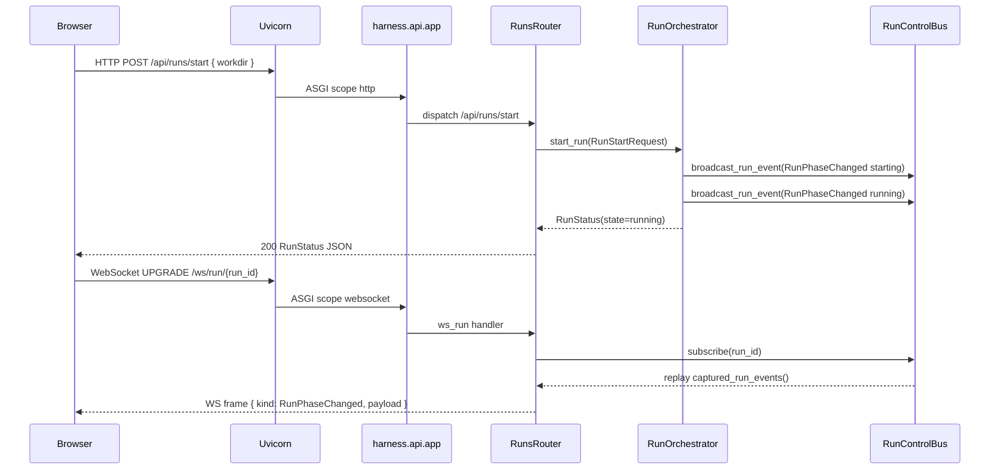
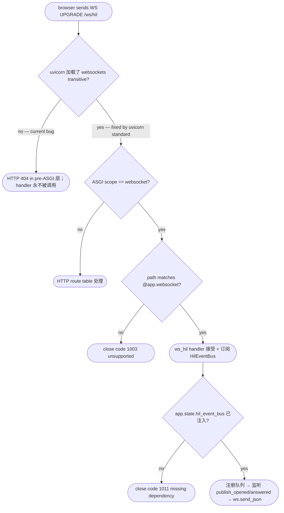

# Feature Detailed Design：Fix F18/F20 IAPI-002 ship miss — 14 REST routes + 5 WS broadcasters + uvicorn ws backend（Feature #23）

**Date**: 2026-04-25
**Feature**: #23 — Fix: F18/F20 IAPI-002 ship miss — 14 REST routes + 5 WS broadcasters + uvicorn ws backend
**Priority**: high
**Category**: bugfix（精简版 — 聚焦根因 + 定向修复 + 回归测试清单）
**Bug Severity**: Critical
**Bug Source**: manual-testing
**Fixed Feature**: #20（F20 · Bk-Loop）
**Dependencies**: [20]
**Design Reference**: docs/plans/2026-04-21-harness-design.md §3.1 / §3.2 / §3.4 / §4.3 / §4.5 / §6.1.7 / §6.2.1-§6.2.5 / §8.1 / §8.4
**SRS Reference**: FR-001 / FR-024 / FR-029 / FR-039 / FR-042 / IFR-007

## Context

F20 ST 阶段仅通过 test-only factory `harness.app.main.build_app()` 验证 IAPI-002 / IAPI-019 / IAPI-001 契约，其在生产 ASGI 入口 `harness.api:app` 上的对应路由从未挂载；并发缺陷 `requirements.txt` 锁 `uvicorn==0.44.0` 未带 WebSocket runtime extra（无 `websockets`/`wsproto`），uvicorn 在 ASGI 之前对所有 WS upgrade 直接 HTTP 404。此 bugfix 把 14 条 REST 路由 + 5 条 WebSocket 频道挂到 production 入口、对接真实 broadcaster、归一双定义、补齐 uvicorn WS 后端，以恢复 F21 三页面与 F22 (Fe-Config) 进入 TDD 前的真实数据通路（FR-001 / FR-024 / FR-029 / FR-039 / FR-042 / IFR-007）。

## Design Alignment

> 本 bugfix 不引入新的类/模块；仅在现有 `harness/api/__init__.py`（生产 ASGI 入口）与 `harness/orchestrator/run.py` / `harness/persistence/tickets.py` / `harness/hil/event_bus.py` / `harness/recovery/anomaly.py` / `harness/orchestrator/signal_watcher.py` / `harness/orchestrator/bus.py` / `harness/api/files.py` / `harness/api/git.py` 等服务层模块之上**新增 FastAPI router 包装**并 `app.include_router()` 到 `harness.api:app`；同时**删除/合并**双定义。设计 §3.1 / §3.2 / §3.4 / §4.3 / §4.5 / §6.1.7 / §6.2.2 / §6.2.3 / §6.2.4 既定的所有契约维持不变。

- **Key types**（来自 §4.3 / §4.5 — 既存类，本 bugfix 仅作 wiring）：
  - `harness.orchestrator.run.RunOrchestrator`（§4.5.2）— 提供 `start_run` / `pause_run` / `cancel_run` / `skip_anomaly` / `force_abort_anomaly` 公开方法（已存在，run.py:452/537/552/616/632）
  - `harness.orchestrator.bus.RunControlBus`（§4.5.2）— 提供 `broadcast_run_event` / `broadcast_anomaly` / `broadcast_signal` / `captured_run_events` / `captured_anomaly_events`（bus.py:145/148/151/162/165）
  - `harness.persistence.tickets.TicketRepository`（§4.2.2）— 提供 `get` / `list_by_run` / `list_unfinished` / `save`（tickets.py:107/125/161/49）
  - `harness.hil.event_bus.HilEventBus`（§4.3.2）— 接受 `ws_broadcast: Callable[[dict], None]` 注入；`publish_opened` / `publish_answered`（event_bus.py:38/61）
  - `harness.hil.control.HilControlDeriver`（§4.3.2）— `derive(raw) → ControlKind`（control.py:22）
  - `harness.recovery.anomaly.AnomalyClassifier`（§4.5.2）— `classify(req, verdict) → AnomalyInfo`（anomaly.py:46）
  - `harness.orchestrator.signal_watcher.SignalFileWatcher`（§4.5.2）— `start(workdir)` / `stop()` / `events()` async iterator（signal_watcher.py:149/165/174）
  - `harness.api.files.FilesService`（§4.5.2 Subprocess）— `read_file_tree(root)` / `read_file_content(path)`（files.py:48/71）
  - `harness.api.git.CommitListService` / `DiffLoader`（§4.5.2 Subprocess）— `list_commits` / `load_diff`（git.py:59/80）
  - `harness.subprocess.validator.ValidatorRunner` — 由现有 §4.5.2 提供（IAPI-016）
- **Provides / Requires**（与 §4.5.4 一致，0 偏离）：
  - Provides 给 F21（IAPI-002 + IAPI-001 + IAPI-019）：`/api/runs/*` · `/api/tickets/*` · `/api/hil/:ticket_id/answer` · `/api/anomaly/:ticket_id/{skip,force-abort}` · `/ws/run/:id` · `/ws/hil` · `/ws/stream/:ticket_id` · `/ws/anomaly` · `/ws/signal`
  - Provides 给 F22（IAPI-002 + IAPI-016）：`/api/settings/general` · `/api/skills/tree` · `/api/files/{tree,read}` · `/api/validate/:file` · `/api/git/{commits,diff/:sha}`
  - Requires：F02（TicketRepository）· F18（HilEventBus）· F19（已挂 ClassifierService 路由）· F20 service 层
- **Deviations**: 无（本 bugfix 不修改任何 §6.2 schema / 错误码 / 路径；仅完成 wiring + 依赖补齐）

**UML 嵌入触发判据校验**：
- `classDiagram`：≥2 类协作但全部为已存在类 + 已发布 §3.2 / §4.3 / §4.5 — **跳过**（系统设计 §3.2 Logical View / §3.3 Component Diagram 已等价表达）。
- `sequenceDiagram`：本 bugfix 主要为 wiring，运行时调用序与 §4.5 既有 Provider 同；唯一新增链路是 `uvicorn → ASGI → router → service → bus → /ws/*` 这一线性贯通 — 嵌入下方序列图对齐回归测试 "Traces To"。
- `stateDiagram-v2`：方法行为不依赖显式状态（HTTP handler 单次调用即返）— 跳过。
- `flowchart TD`：见 §Implementation Summary（uvicorn WS upgrade 404 vs ASGI 路由命中的分支判定，含 ≥3 决策分支）。



## SRS Requirement

> bugfix 精简版 — 不复制完整 FR-xxx 章节；只列出本 bugfix 必须重新建立通路的验收准则锚点（详细原文见 SRS L136 / L371 / L417 / L520 / L549 / L777）。

- **FR-001 (SRS L136-144)**：合法 git workdir + 点击 Start → Harness 5s 内进 running 并展示第一张 ticket；非 git 仓库 → 拒绝并提示。**回归点**：production `POST /api/runs/start` 必须命中 `RunOrchestrator.start_run`（不能再 405 / 404）。
- **FR-024 (SRS L371-378)**：context_overflow 重试上限 ≤3，第 3 次同 skill → 暂停 + UI 提示。**回归点**：`/ws/anomaly` 必须接 `AnomalyClassifier` 真事件（不是 echo stub），UI 才能展示 "重试中 N/3"。
- **FR-029 (SRS L417-424)**：UI 必须可视化异常分类 / 重试次数 / 倒计时 / Skip / Force-Abort。**回归点**：`POST /api/anomaly/:ticket_id/{skip,force-abort}` 在 production 入口可调；`/ws/anomaly` 通路真实可推送。
- **FR-039 (SRS L520-527)**：过程文件前后端双层校验。**回归点**：`POST /api/validate/:file` 在 production 入口可调（IAPI-016），返回 `ValidationReport`。
- **FR-042 (SRS L549-556)**：Ticket 级 git 记录。**回归点**：`GET /api/git/commits` / `GET /api/git/diff/:sha` 在 production 入口可调，返回 §6.2.4 schema。
- **IFR-007 (SRS L777)**：HIL 前端控件 WebSocket（FastAPI ↔ React），双向；30s server ping，60s 客户端无消息重连（设计 §6.1.7 L1101）。**回归点**：5 条 WS 频道全部用真 broadcaster 而非 `_F21_*_BOOTSTRAP` mock 信封。

## Interface Contract

> 本节列出本 bugfix **新增/修改**的公开方法（FastAPI router 函数 + 1 处 RunControlBus 接口扩展）。Service 层方法（`RunOrchestrator.start_run` 等）已存在且**签名不变**，仅作引用以表明 router → service 调用路径。

| Method | Signature | Preconditions | Postconditions | Raises |
|--------|-----------|---------------|----------------|--------|
| `runs_router.post_start_run` | `async def post_start_run(body: RunStartRequest) -> RunStatus` | request body 是合法 `RunStartRequest`；`app.state.orchestrator` 已注入 `RunOrchestrator` 实例 | 调用 `orchestrator.start_run(body)`；返回 `RunStatus` 200；FR-001 满足（workdir 非 git → 400 转译） | `HTTPException(400)` workdir 非目录/非 git；`HTTPException(409)` ALREADY_RUNNING |
| `runs_router.get_runs_current` | `async def get_runs_current() -> RunStatus \| None` | orchestrator 已注入 | 返回当前活跃 run 的 `RunStatus`；无活跃 run 时返回 `null` | — |
| `runs_router.get_runs` | `async def get_runs(limit: int = 50, offset: int = 0) -> list[RunSummary]` | orchestrator 已注入；`limit ∈ [1, 200]`；`offset ≥ 0` | 返回按 `started_at desc` 排序的 `RunSummary[]`；越界 limit/offset → 400 | `HTTPException(400)` 参数越界 |
| `runs_router.post_pause` | `async def post_pause(run_id: str) -> RunStatus` | `run_id` 存在于 orchestrator `_runtimes` | 调用 `orchestrator.pause_run(run_id)`；返回 state=`pause_pending` | `HTTPException(404)` RunNotFound；`HTTPException(409)` 状态非法 |
| `runs_router.post_cancel` | `async def post_cancel(run_id: str) -> RunStatus` | `run_id` 存在 | 调用 `orchestrator.cancel_run(run_id)`；返回 state=`cancelled` | `HTTPException(404)` RunNotFound |
| `tickets_router.get_tickets` | `async def get_tickets(run_id: str \| None = None, state: str \| None = None, tool: str \| None = None, parent: str \| None = None) -> list[Ticket]` | `app.state.ticket_repo` 已注入 `TicketRepository` | 返回 `TicketRepository.list_by_run(run_id, state=, tool=, parent=)`；run_id 缺失 → 全 run（按 ATS 选择）或 400 | `HTTPException(400)` 参数枚举越界 |
| `tickets_router.get_ticket` | `async def get_ticket(ticket_id: str) -> Ticket` | ticket_repo 已注入 | 返回 `TicketRepository.get(ticket_id)` | `HTTPException(404)` 不存在 |
| `tickets_router.get_ticket_stream` | `async def get_ticket_stream(ticket_id: str, offset: int = 0) -> list[StreamEvent]` | ticket_repo 已注入；offset ≥ 0 | 返回该 ticket 自 offset 起的 stream 事件分页 | `HTTPException(404)` ticket 不存在；`HTTPException(400)` offset < 0 |
| `hil_router.post_answer` | `async def post_answer(ticket_id: str, body: HilAnswerSubmit) -> HilAnswerAck` | `app.state.hil_event_bus` 已注入 `HilEventBus`；ticket 处于 `hil_waiting` | 调用 `HilEventBus.publish_answered`；返回 `HilAnswerAck(accepted=True, ticket_state=running)` | `HTTPException(400)` payload 非法；`HTTPException(404)` ticket 不存在；`HTTPException(409)` ticket 不在 hil_waiting |
| `anomaly_router.post_skip` | `async def post_skip(ticket_id: str) -> RecoveryDecision` | orchestrator 已注入；ticket 非终态 | 调用 `orchestrator.skip_anomaly(ticket_id)`；返回 `RecoveryDecision(kind="skipped")` | `HTTPException(404)` TicketNotFound；`HTTPException(409)` InvalidTicketState |
| `anomaly_router.post_force_abort` | `async def post_force_abort(ticket_id: str) -> RecoveryDecision` | orchestrator 已注入；ticket 非终态 | 调用 `orchestrator.force_abort_anomaly(ticket_id)`；返回 `RecoveryDecision(kind="abort")` | `HTTPException(404)` TicketNotFound；`HTTPException(409)` 状态终态 |
| `general_settings_router.get_general` | `async def get_general() -> GeneralSettings` | `~/.harness/config.json` 可读 | 返回 `GeneralSettings`（默认值见 §6.2.4） | — |
| `general_settings_router.put_general` | `async def put_general(body: GeneralSettings) -> GeneralSettings` | body 合法 | 持久化到 `~/.harness/config.json`；返回保存后的 `GeneralSettings` | `HTTPException(400)` pydantic 校验失败 |
| `skills_router.get_tree` | `async def get_tree() -> SkillTree` | plugin 目录存在（来自 `HARNESS_WORKDIR` env） | 返回 `SkillTree`（含 plugins/longtaskforagent skill 节点列表） | `HTTPException(500)` HARNESS_WORKDIR 未设置 |
| `files_router.get_tree` | `async def get_tree(root: str = "docs") -> FileTree` | `app.state.files_service` 已注入 | 调用 `FilesService.read_file_tree(root)` | `HTTPException(400)` PathTraversalError |
| `files_router.get_read` | `async def get_read(path: str) -> FileContent` | files_service 已注入 | 调用 `FilesService.read_file_content(path)` | `HTTPException(400)` PathTraversalError；`HTTPException(404)` FileNotFound |
| `validate_router.post_validate` | `async def post_validate(file: str, body: ValidateRequest) -> ValidationReport` | `app.state.validator_runner` 已注入 | 调用 `ValidatorRunner.run(...)` 并返回 `ValidationReport` | `HTTPException(400)` 脚本枚举越界；`HTTPException(500)` runner 内部异常 |
| `git_router.get_commits` | `async def get_commits(run_id: str \| None = None, feature_id: str \| None = None) -> list[GitCommit]` | `app.state.commit_list_service` 已注入 | 调用 `CommitListService.list_commits(run_id=, feature_id=)`；按 `committed_at desc` | — |
| `git_router.get_diff` | `async def get_diff(sha: str) -> DiffPayload` | `app.state.diff_loader` 已注入；sha ≤64 字节 | 调用 `DiffLoader.load_diff(sha)` | `HTTPException(404)` DiffNotFound |
| `ws.ws_run` | `async def ws_run(websocket: WebSocket, run_id: str) -> None` | `app.state.run_control_bus` 已注入 `RunControlBus`；`run_id` 已存在或将存在（订阅可早于 start_run，参 §6.1.7 L1101） | 接受 WS；订阅 bus；首推 `captured_run_events()` 中匹配 run_id 的事件；后续 `broadcast_run_event` 触发的 `RunEvent` 经队列实时推送；30s server ping；客户端 disconnect 时 unsubscribe | `WebSocketDisconnect` 客户端断开（吞）；其它异常 → close code 1011 |
| `ws.ws_hil` | `async def ws_hil(websocket: WebSocket) -> None` | `app.state.hil_event_bus` 已注入 | 接受 WS；订阅 bus；`HilEventBus.publish_opened/publish_answered` 触发的 payload 经队列推送；30s ping | `WebSocketDisconnect`；close 1011 |
| `ws.ws_stream` | `async def ws_stream(websocket: WebSocket, ticket_id: str) -> None` | `app.state.stream_event_hub` 已注入 stream 事件总线 | 接受 WS；订阅特定 ticket_id 的 `StreamEvent`；按 §6.2.4 schema 推送 | `WebSocketDisconnect`；close 1011 |
| `ws.ws_anomaly` | `async def ws_anomaly(websocket: WebSocket) -> None` | `app.state.run_control_bus` 已注入 | 接受 WS；订阅 bus；`captured_anomaly_events()` 重放 + `broadcast_anomaly` 触发的 `AnomalyEvent` 推送 | `WebSocketDisconnect`；close 1011 |
| `ws.ws_signal` | `async def ws_signal(websocket: WebSocket) -> None` | `app.state.signal_file_watcher` 已注入 `SignalFileWatcher`（已 `start(workdir)`）；`run_control_bus` 已注入 | 接受 WS；订阅 bus；`SignalFileWatcher.events()` → `RunControlBus.broadcast_signal` → 推送 `SignalEvent` | `WebSocketDisconnect`；close 1011 |
| `RunControlBus.broadcast_stream_event` | `def broadcast_stream_event(event: StreamEvent) -> None` | bus 已实例化；`event` 是合法 `StreamEvent` | 把 event 入每个 ws_stream 订阅者队列；保留 `captured_stream_events()` 用于回放（与既有 `broadcast_run_event` / `broadcast_anomaly` 对齐） | — |

**Design rationale**（每条非显见决策）：
- **router 而非纯 `@app.*` 装饰**：与既有 `harness.api.skills` / `harness.api.settings` / `harness.api.prompts` 模块保持一致风格（已在 `harness/api/__init__.py:32-41` 用 `app.include_router(_xxx_router)`）；避免在 `__init__.py` 内直接 inline 14 条路由导致单文件膨胀且难以单测。
- **service 层依赖通过 `app.state`**：与 `harness/app/main.py:28` 既有约定 (`app.state.orchestrator`) 保持一致；router 只读 `app.state.<service>`，不持有；测试通过 lifespan 或显式 setter 注入。
- **`/ws/run/:id` 双定义归一**：`harness/api/__init__.py:159` 是 echo-stub 生产入口、`harness/app/main.py:55` 是真 broadcaster 但仅 test-only factory 在用。归一**保留 `harness.api:app`** 作为唯一生产入口（`scripts/svc-api-start.sh:12` 已固化），把真实 broadcaster 逻辑迁入 `harness/api/__init__.py`（或独立 `harness/api/ws_run.py`），删除 `harness.api.__init__` 内的 echo `_F21_*_BOOTSTRAP` 信封；`harness/app/main.py:build_app` **保留**作 test-only factory（仅供 `tests/integration/test_f20_real_rest_ws.py` 引用，不暴露给 uvicorn）。
- **`requirements.txt` 改 `uvicorn[standard]==0.44.0` 而非追加裸 `websockets==X`**：与 design §3.4 L240 / §8.1 L1464 / §8.4 L1539 一致 —— 三处明确 `uvicorn[standard]`（`websockets` 与 `httptools`/`uvloop` 一同被 `[standard]` extra 拉入），保持依赖图的单一事实源。Python wheel `uvicorn[standard]` 的 transitive dep 包含 `websockets >= 10.4`，可解决生产 WS upgrade 404。
- **不修改任何 §6.2 schema / 错误码 / 路径**：bugfix 范围已被 feature-list.json title 锚定，`status: blocked` 风险来源是契约偏离 —— 本设计严格遵循 §6.2.2 / §6.2.3 / §6.2.4 既定字段，不触发 Contract Deviation Protocol。
- **`broadcast_stream_event` 是新增 bus 接口**：原 `RunControlBus`（bus.py:77）已有 `broadcast_run_event` / `broadcast_anomaly` / `broadcast_signal`，但缺 stream 推送通道；F18 `StreamParser.events()` 是 async iterator 而非 broadcaster，需要在 bus 层补一条对称接口供 `/ws/stream/:ticket_id` 订阅 —— 这是把 §4.3.4 IAPI-008 既存 async iterator 桥到 §6.2.3 IAPI-001 WS 频道的最小附加面。

## Visual Rendering Contract

> N/A — backend-only feature（feature-list.json `"ui": false`）。本 bugfix 的 UI 影响在 F21 三页面与 F22 五页面，但属下游消费者；本特性仅修复后端通路，不渲染任何视觉元素。`UI/render` 测试行不在本 Test Inventory 中，由 F21 / F22 自身的 ST 用例消费。

## Implementation Summary

**主要类 / 函数**：本 bugfix 不引入新 domain 类，仅在 `harness/api/` 包下新增 5 个 router 模块文件 + 修改既有 `__init__.py` + 修改 `harness.orchestrator.bus.RunControlBus` + 修改 `requirements.txt`。建议结构：
- `harness/api/runs.py` — 新建 `runs_router`（4 routes：current / start / pause / cancel）+ `get_runs` 列表
- `harness/api/tickets.py` — 新建 `tickets_router`（3 routes：list / get / stream）
- `harness/api/hil.py` — 新建 `hil_router`（1 route：answer）+ `ws_hil` handler
- `harness/api/anomaly.py` — 新建 `anomaly_router`（2 routes：skip / force-abort）+ `ws_anomaly` handler
- `harness/api/runs_ws.py`（或并入 `runs.py`）— `ws_run` 真实 broadcaster handler
- `harness/api/stream_ws.py`（或并入 `tickets.py`）— `ws_stream` 真实 broadcaster handler
- `harness/api/signal_ws.py`（或并入 `runs.py`）— `ws_signal` 真实 broadcaster handler
- `harness/api/files.py`（既存）— 包装 `FilesService` 为 `files_router`
- `harness/api/git.py`（既存）— 包装 `CommitListService` / `DiffLoader` 为 `git_router`
- `harness/api/general_settings.py` — 新建（与既有 `settings.py` 平行；后者承载 model_rules / classifier，本文件承载 `/api/settings/general`）
- `harness/api/skills.py`（既存）— 增 `GET /api/skills/tree`（模式同既有 `post_install` / `post_pull`）
- `harness/api/validate.py` — 新建 `validate_router`（1 route：`POST /api/validate/:file`）

**调用链**：
1. **HTTP**：browser → `uvicorn[standard]` → `harness.api:app`（FastAPI ASGI app）→ router（按 `app.include_router()` 顺序匹配）→ service 方法（`app.state.<service>`）→ pydantic response → uvicorn → browser。
2. **WebSocket**：browser → `uvicorn[standard]`（依赖 `websockets` transitive dep 完成 HTTP 101 upgrade）→ ASGI scope `websocket` → `harness.api:app` ws handler → `RunControlBus.subscribe(run_id)` 拿队列 → `captured_*_events()` 重放 → 主循环 `while True: q.get() → ws.send_json()` → 客户端 disconnect → `RunControlBus.unsubscribe`。
3. **service 触发广播**：`RunOrchestrator.start_run` → `RunControlBus.broadcast_run_event(RunPhaseChanged)` → 入所有 `/ws/run/:run_id` 订阅者队列 → ws handler 发送。同理 `AnomalyClassifier`（被 `RunOrchestrator._run_loop` 调用）→ `broadcast_anomaly` → `/ws/anomaly`；`SignalFileWatcher.events()` → `broadcast_signal` → `/ws/signal`；`HilEventBus.publish_opened/answered` → 注入的 `ws_broadcast` callable（来自 ws_hil handler 的订阅注册）→ `/ws/hil`；`StreamParser.events()` async iterator 经新增 `broadcast_stream_event` → `/ws/stream/:ticket_id`。

**关键设计决策与陷阱**：
- **app.state 注入时机**：service 实例必须在 `harness.app.AppBootstrap.start()` 启动 uvicorn **之前**注入 `app.state`（`harness.api.app.state.orchestrator = ...`），否则首个 HTTP 请求落空。生产 entry 在 `harness/app/AppBootstrap`（见 §4.1.2）— 此处补 `_wire_services(app)` 调用，按 §4.5 既有 `RunOrchestrator.build_real_persistence(workdir=)` 构造、把 `RunControlBus` / `TicketRepository` / `FilesService` / `CommitListService` / `DiffLoader` / `HilEventBus` / `SignalFileWatcher` / `ValidatorRunner` 全部挂到 `app.state.*`。
- **`/api/runs` 在 §6.2.2 L1139 定义但既有代码无 `list_runs` 方法**：`RunRepository.list_active`（run.py:90）只列活跃 run；本 bugfix 在 router 内组合 `list_active` 与已结束 run 的 join（或新增 `RunRepository.list_recent(limit, offset)` —— 推荐后者以保持职责分明）。返回 `RunSummary[]`（§6.2.4 未独立定义但可用 `RunStatus` 字段子集 + `id`/`workdir`/`state`/`started_at`/`ended_at`）。
- **`SkillTree` 在 §6.2.4 未给出完整 schema**：参考 design §6.2.2 L1157 / §4.8 F10（既存 SkillsManager），返回 `{root: str, plugins: list[{name, sha, source, installed_at}]}` 与既有 `harness.skills.registry` 对齐；本 bugfix 仅 wiring 不重新定义 schema —— 复用 registry 现有方法。
- **`/ws/run/:id` 真实 broadcaster 的事件回放**：必须保证客户端在 `start_run` **之后**订阅时也能收到 `RunPhaseChanged starting / running` 两条 — `RunControlBus.captured_run_events()`（bus.py:165）已提供回放接口，与 `harness/app/main.py:60-66` 同款逻辑直接复用。
- **依赖图变更（设计 §8.4 L1539）**：`Uvicorn → Websockets (transitive)` 已在 design 图中标注为现状假设；本 bugfix 把 `requirements.txt` 行从 `uvicorn==0.44.0` 改为 `uvicorn[standard]==0.44.0` 即令该 transitive dep 真正进入 `requirements.lock`。验证：`pip install uvicorn[standard]==0.44.0 && python -c "import websockets, wsproto; print('ok')"` 不再 ImportError。
- **删除 echo stub**：`harness/api/__init__.py:97-181` 的 `_ws_echo_channel` / 5 个 stub handler / 3 个 `_F21_*_BOOTSTRAP` 信封一并删除（被真实 broadcaster handler 取代）；保留 `app = FastAPI(...)` / `health` / `app.include_router(_skills_router)` / `app.include_router(_settings_router)` / `app.include_router(_prompts_router)` / `app.mount("/", StaticFiles(...))` 等既有片段。

**遗留 / 存量代码交互点**：env-guide §4 全部为 `_(empty — greenfield project)_` placeholder（env-guide.md L267-289），无强制内部库 / 禁用 API / 命名约定 — 本 bugfix 无 §4 约束需符合。

**§4 Internal API Contract 集成**：本特性是 §6.2.1 表中：
- IAPI-002 Provider（生产入口完整化）：14 条 REST 路由必须严格符合 §6.2.2 L1133-1167 path / method / request schema / response schema / error code
- IAPI-001 Provider（生产 broadcaster 完整化）：5 条 WS 频道必须严格符合 §6.2.3 L1169-1180 path / direction / envelope / payload union
- IAPI-019 Provider（既有 `RunControlBus.submit` 已实现）：维持 `RunControlCommand` / `RunControlAck` schema
- 不修改 §6.2.1 表 19 条契约的 Provider/Consumer 关系；不引入新 IAPI；不偏离任一 §6.2.4 schema（含 Wave 3 `ClassifierConfig.strict_schema_override` 增量）

**方法内决策分支（uvicorn WS upgrade 404 的根因 + 修复后命中路径）**：



### Boundary Conditions

| Parameter | Min | Max | Empty/Null | At boundary |
|-----------|-----|-----|------------|-------------|
| `RunStartRequest.workdir` | 1 字符（Path("/" )） | OS Path 上限（典型 4096） | `""` / 仅空白 → 400 invalid_workdir（run.py:454-457 既有逻辑） | 含 `;` `\|` `&&` ``` ` ``` `\n` → 400 invalid_workdir（run.py:459）；非目录 → 400；无 `.git` → 400 not_a_git_repo（run.py:472） |
| `get_runs.limit` | 1 | 200 | `null` → 默认 50 | 0 → 400；> 200 → 400；负数 → 400 |
| `get_runs.offset` | 0 | INT_MAX | `null` → 默认 0 | 负数 → 400 |
| `tickets_router.get_ticket_stream.offset` | 0 | INT_MAX | `null` → 默认 0 | 负数 → 400 |
| `git_router.get_diff.sha` | 1 字符 | 64 字符（git.py:82） | `""` → 404 | > 64 → 404 DiffNotFound（git.py:82）；非合法 git object → 404 |
| `files_router.get_tree.root` | 1 字符 | OS Path 上限 | `""` → 400 PathTraversalError（files.py:31） | 含 `..` 解析后逃出 workdir → 400 PathTraversalError（files.py:39-45） |
| `files_router.get_read.path` | 1 字符 | OS Path 上限 | `""` → 400 | 含 `..` 逃出 → 400；存在性 false → 404 FileNotFound（files.py:50） |
| `validate_router.body.script` | enum: `validate_features`/`validate_guide`/`check_configs`/`check_st_readiness`/`null` | — | `null` → 默认按 file 后缀推断 | 非枚举值 → 422 |
| `ws.ws_run.run_id` | 1 字符 | 32 字符（uuid hex） | `""` → 路径不匹配 404 | 不存在的 run_id → handler 仍 accept；客户端可能空读 → 客户端重连机制（设计 §6.1.7） |

### Existing Code Reuse

> 本 bugfix 是典型的 wiring 类 bugfix —— 服务层 100% 已存在且已通过 F18/F19/F20 ST，本设计**严格禁止**在 router 内重新实现任何 service 层逻辑。

| Existing Symbol | Location (file:line) | Reused Because |
|-----------------|---------------------|----------------|
| `harness.orchestrator.run.RunOrchestrator.start_run` | `harness/orchestrator/run.py:452` | FR-001 启动 Run 主入口；本 router 仅作 HTTP 转译 |
| `harness.orchestrator.run.RunOrchestrator.pause_run` | `harness/orchestrator/run.py:537` | `/api/runs/:id/pause` 路由直委托 |
| `harness.orchestrator.run.RunOrchestrator.cancel_run` | `harness/orchestrator/run.py:552` | `/api/runs/:id/cancel` 路由直委托 |
| `harness.orchestrator.run.RunOrchestrator.skip_anomaly` | `harness/orchestrator/run.py:616` | FR-029 Skip 直委托 |
| `harness.orchestrator.run.RunOrchestrator.force_abort_anomaly` | `harness/orchestrator/run.py:632` | FR-029 Force-Abort 直委托 |
| `harness.persistence.tickets.TicketRepository.get` | `harness/persistence/tickets.py:107` | `/api/tickets/:id` 直读 |
| `harness.persistence.tickets.TicketRepository.list_by_run` | `harness/persistence/tickets.py:125` | `/api/tickets` 列表查询（含 state/tool/parent 过滤） |
| `harness.orchestrator.bus.RunControlBus.broadcast_run_event` | `harness/orchestrator/bus.py:145` | `/ws/run/:id` 真实事件源；router 注册订阅者队列 |
| `harness.orchestrator.bus.RunControlBus.broadcast_anomaly` | `harness/orchestrator/bus.py:148` | `/ws/anomaly` 真实事件源 |
| `harness.orchestrator.bus.RunControlBus.broadcast_signal` | `harness/orchestrator/bus.py:151` | `/ws/signal` 真实事件源 |
| `harness.orchestrator.bus.RunControlBus.captured_run_events` | `harness/orchestrator/bus.py:165` | `/ws/run/:id` 订阅时事件回放（与 `harness/app/main.py:60-66` 既有逻辑同模式） |
| `harness.orchestrator.bus.RunControlBus.captured_anomaly_events` | `harness/orchestrator/bus.py:162` | `/ws/anomaly` 订阅时回放 |
| `harness.hil.event_bus.HilEventBus.publish_opened` | `harness/hil/event_bus.py:38` | `/ws/hil` 事件源；本特性把 `ws_broadcast` callable 接到 ws handler 的订阅队列入口 |
| `harness.hil.event_bus.HilEventBus.publish_answered` | `harness/hil/event_bus.py:61` | `/api/hil/:ticket_id/answer` 写回路径 |
| `harness.recovery.anomaly.AnomalyClassifier.classify` | `harness/recovery/anomaly.py:46` | FR-024 上报路径（已被 RunOrchestrator 主循环调用）；本 bugfix 仅恢复 `/ws/anomaly` 推送通路 |
| `harness.orchestrator.signal_watcher.SignalFileWatcher.start/stop/events` | `harness/orchestrator/signal_watcher.py:149/165/174` | `/ws/signal` 推送源；本 bugfix 在 AppBootstrap 调 `start(workdir)`，handler 桥到 bus |
| `harness.api.files.FilesService.read_file_tree` | `harness/api/files.py:71` | `/api/files/tree` 路由直委托 |
| `harness.api.files.FilesService.read_file_content` | `harness/api/files.py:48` | `/api/files/read` 路由直委托 |
| `harness.api.git.CommitListService.list_commits` | `harness/api/git.py:59` | `/api/git/commits` 路由直委托 |
| `harness.api.git.DiffLoader.load_diff` | `harness/api/git.py:80` | `/api/git/diff/:sha` 路由直委托 |
| `harness.subprocess.validator.ValidatorRunner` | `harness/subprocess/validator/runner.py` | `/api/validate/:file` 路由直委托（IAPI-016） |
| `harness.api.skills.router` 既有模式 | `harness/api/skills.py:29-84` | `APIRouter(prefix=..., tags=...)` + `app.include_router()` 风格统一 |
| `harness.api.settings.router` / `harness.api.prompts.router` | `harness/api/settings.py:34` / `harness/api/prompts.py:26` | 既有 `app.include_router(_settings_router)` / `app.include_router(_prompts_router)` 是 router 风格基线（`harness/api/__init__.py:40-41`） |

## Test Inventory

> bugfix 精简版 — 重点在**回归测试**：每条修复点至少 1 行回归用例，且必须区分 in-process Starlette TestClient（既有 `tests/integration/test_f20_real_rest_ws.py` 已用）vs. **真实 uvicorn handshake**（本 bugfix 必加，证明 WS upgrade 不再 404）。

| ID | Category | Traces To | Input / Setup | Expected | Kills Which Bug? |
|----|----------|-----------|---------------|----------|-----------------|
| R1 | INTG/asgi-rest | FR-001 AC-1 + §6.2.2 L1137 + §Interface Contract `runs_router.post_start_run` | `harness.api:app` 经 in-process `httpx.AsyncClient(transport=ASGITransport(app))` 发 `POST /api/runs/start { workdir: <git tmp> }` | 200 + `RunStatus { state: "running", run_id, workdir, started_at }` | router 未挂载 → 405 / 404（当前 bug） |
| R2 | INTG/asgi-rest | FR-001 AC-3 + §Interface Contract Raises | 同上 但 workdir 是非 git 临时目录 | 400 `{ error_code: "not_a_git_repo", ... }` | router 未挂载或 service 未注入 |
| R3 | FUNC/error | §Interface Contract `post_start_run` Raises | workdir 含 `;` 或 `\n` | 400 invalid_workdir | router 未做 ASGI 转译（落到 SPA fallback） |
| R4 | INTG/asgi-rest | FR-029 AC-1 + §6.2.2 L1146 | seed 1 张 retrying ticket → `POST /api/anomaly/<tid>/skip` | 200 `RecoveryDecision { kind: "skipped" }` | `/api/anomaly/*` 未挂载（当前 bug） |
| R5 | INTG/asgi-rest | FR-029 AC-2 + §6.2.2 L1147 | seed 1 张 running ticket → `POST /api/anomaly/<tid>/force-abort` | 200 `RecoveryDecision { kind: "abort" }` | 同上 |
| R6 | FUNC/error | §Interface Contract `post_skip` Raises | ticket_id 不存在 | 404 TicketNotFound | service 未注入 → 500 而非 404 |
| R7 | FUNC/error | §Interface Contract `post_force_abort` Raises | ticket 已 COMPLETED | 409 InvalidTicketState | router 未把 `InvalidTicketState` 转译为 409 |
| R8 | INTG/asgi-rest | §6.2.2 L1142-1144 | seed 3 张 ticket → `GET /api/tickets?run_id=<rid>` | 200 + `Ticket[]` 长度=3，按 `started_at asc` | `/api/tickets` 未挂载（当前 bug） |
| R9 | FUNC/error | §Interface Contract `get_ticket` Raises | `GET /api/tickets/<unknown>` | 404 | router 未注入 ticket_repo → 500 |
| R10 | INTG/asgi-rest | §6.2.2 L1144 | `GET /api/tickets/<tid>/stream?offset=0` | 200 + `StreamEvent[]` 按 seq 升序 | 路由缺失 |
| R11 | INTG/asgi-rest | FR-039 AC + §6.2.2 L1162 | seed 合法 feature-list.json → `POST /api/validate/feature-list.json { script: "validate_features" }` | 200 `ValidationReport { ok: true, issues: [], script_exit_code: 0, duration_ms }` | `/api/validate/*` 未挂载（当前 bug） |
| R12 | FUNC/error | §Interface Contract `post_validate` Raises | seed 非法 feature-list.json | 200 `ValidationReport { ok: false, issues: [...] }`（脚本 exit≠0 但 router 不应 500） | router 把脚本错误吞为 500（FR-039/040 反向） |
| R13 | INTG/asgi-rest | FR-042 AC-1 + §6.2.2 L1163 | seed 5 commits → `GET /api/git/commits?run_id=<rid>` | 200 `GitCommit[]` 长度=5 按 committed_at desc | `/api/git/commits` 未挂载（当前 bug） |
| R14 | INTG/asgi-rest | §6.2.2 L1164 | `GET /api/git/diff/<合法 sha>` | 200 `DiffPayload { sha, files, stats }` | `/api/git/diff/:sha` 未挂载 |
| R15 | FUNC/error | §Interface Contract `get_diff` Raises | sha 不存在 git 仓 | 404 DiffNotFound | service 未注入 → 500 |
| R16 | INTG/asgi-rest | §6.2.2 L1148 | `GET /api/settings/general` | 200 `GeneralSettings` 默认值 | `/api/settings/general` 未挂载（既有 settings.py 只覆盖 model_rules + classifier） |
| R17 | INTG/asgi-rest | §6.2.2 L1157 | `GET /api/skills/tree` | 200 `SkillTree { root, plugins[] }` | `/api/skills/tree` 未挂载（既有 skills.py 只有 install/pull） |
| R18 | INTG/asgi-rest | §6.2.2 L1138 | 无活跃 run → `GET /api/runs/current` | 200 `null` | 路由缺失 → 404 |
| R19 | INTG/asgi-rest | §6.2.2 L1139 | seed 3 历史 run → `GET /api/runs?limit=2&offset=0` | 200 `RunSummary[]` 长度=2 | 路由缺失 |
| R20 | INTG/asgi-rest | §6.2.2 L1160-1161 | seed `docs/` 目录 → `GET /api/files/tree?root=docs` | 200 `FileTree { root, nodes }` | `/api/files/*` 未挂载 |
| R21 | FUNC/error | §Interface Contract `files_router.get_tree` Raises | `?root=../etc/passwd` | 400 PathTraversalError | service 未注入或 router 未做异常转译 |
| R22 | INTG/uvicorn-real-handshake | IFR-007 + §6.2.3 L1175 + 根因第 3 子 bug | `uvicorn harness.api:app --host 127.0.0.1 --port <ephemeral>` 真启 → `websockets.connect(ws://127.0.0.1:<port>/ws/hil)` | 握手成功 (HTTP 101)；首条 frame 不是 echo `subscribe_ack` 而是 `HilQuestionOpened` 真信封或保持空闲（待 HilEventBus 触发） | 当前 bug：uvicorn 缺 websockets transitive → HTTP 404；fix 后 `pip install uvicorn[standard]==0.44.0` 解决 |
| R23 | INTG/uvicorn-real-handshake | IFR-007 + §6.2.3 L1173 | 真 uvicorn 启 → `start_run` 触发 → `websockets.connect(/ws/run/<rid>)` | 收到 `{ kind: "RunPhaseChanged", payload: { state: "running", run_id } }` 真事件（不是 `_F21_RUN_BOOTSTRAP` mock） | echo stub 残留（当前 `__init__.py:151-156`） |
| R24 | INTG/uvicorn-real-handshake | IFR-007 + §6.2.3 L1176 | 真 uvicorn → mock `AnomalyClassifier.classify` 注入 → `websockets.connect(/ws/anomaly)` | 收到 `{ kind: "AnomalyDetected", payload: { ticket_id, cls: "context_overflow", retry_count: 1 } }` | echo stub（`__init__.py:174-176`） |
| R25 | INTG/uvicorn-real-handshake | IFR-007 + §6.2.3 L1177 + FR-024 | 真 uvicorn → 在 workdir 创建 `bugfix-request.json` → `websockets.connect(/ws/signal)` | 收到 `SignalFileChanged { path: ".../bugfix-request.json", kind: "bugfix_request", mtime }` | echo stub（`__init__.py:179-181`）+ SignalFileWatcher 未在 AppBootstrap 启动 |
| R26 | INTG/uvicorn-real-handshake | IFR-007 + §6.2.3 L1174 | 真 uvicorn → seed StreamEvent 经 `RunControlBus.broadcast_stream_event` → `websockets.connect(/ws/stream/<tid>)` | 收到 `{ kind: "StreamEvent", payload: { ticket_id, seq, ts, kind, payload } }` | bus 缺 `broadcast_stream_event`；ws handler 缺 |
| R27 | INTG/uvicorn-real-handshake | IFR-007 ping 协议 + §6.1.7 L1101 | 真 uvicorn → 客户端连 `/ws/run/<rid>`，30s 内不发任何客户端帧 | 服务端发 `{ kind: "ping" }` 至少 1 次（30s 周期 ±5s 容差） | server ping 未实现 → 60s 客户端无消息重连失败 |
| R28 | INTG/dependency-import | 设计 §3.4 L240 / §8.4 L1539 / 根因第 3 子 bug | `pip install -r requirements.txt` 后 `python -c "import websockets, wsproto"` | 不抛 ImportError | requirements.txt 锁 `uvicorn==0.44.0` 缺 standard extra |
| R29 | INTG/single-definition | 根因 "双定义归一" + `harness/api/__init__.py:159` vs `harness/app/main.py:55` | `python -c "from harness.api import app; routes = [r.path for r in app.routes if 'ws/run' in r.path]; print(len(routes))"` | 输出 `1`（单一 `/ws/run/{run_id}` route on app） | 当前双定义；如未归一会 import 两次得不同 app 实例的 route |
| R30 | INTG/regression-f20-st | F20 既有 ST 用例集 `tests/integration/test_f20_real_rest_ws.py` 不回归 | 重跑既有 `test_f20_real_rest_ws` 通过 build_app factory 的全部测试 | 全部 PASS（保留 build_app 不变；它仍是 test-only factory） | 错误地把 build_app 也删了，导致 test 不可运行 |
| R31 | INTG/asgi-rest | FR-024 路径（`AnomalyClassifier` 间接） | seed retrying ticket → `POST /api/runs/start` → 等 `_run_loop` 触发 anomaly → in-process WS sniff `/ws/anomaly` | 收到 `AnomalyDetected` 信封（in-process Starlette TestClient） | router 已挂但 bus.broadcast_anomaly 未连 ws handler |
| R32 | INTG/hil-flow | §6.2.2 L1145 + §6.2.3 L1175 | seed hil_waiting ticket → `POST /api/hil/<tid>/answer { question_id, freeform_text: "yes" }` → 同时连 `/ws/hil` | REST 200 `HilAnswerAck { accepted: true, ticket_state }`；WS 收到 `HilAnswerAccepted` 信封 | `/api/hil/*` 未挂载或 publish_answered 未连 ws handler |
| R33 | SEC/path-traversal | FR-039 SEC 注释（ATS L120） | `POST /api/validate/../../etc/passwd` | 400 / 422 拒绝 | router 未做 path 校验 |
| R34 | FUNC/error | §Interface Contract `post_answer` Raises | ticket 不在 hil_waiting | 409 | service 注入但 router 未转译 409 |
| R35 | INTG/asgi-rest | §6.2.2 L1149 + 既有 settings.py 模式 | `PUT /api/settings/general { ui_density: "comfortable" }` | 200 `GeneralSettings { ui_density: "comfortable" }` 持久化到 `~/.harness/config.json` | 路由缺失 |
| R36 | INTG/lifespan | AppBootstrap wiring | `harness.app.AppBootstrap.start()` 完成 → `app.state.orchestrator` / `run_control_bus` / `ticket_repo` / `hil_event_bus` / `signal_file_watcher` / `files_service` / `commit_list_service` / `diff_loader` / `validator_runner` 全部 not-None | 全 8 项已注入 | AppBootstrap 未补 wire 步骤 → 首请求 500 |

**回归矩阵覆盖**：
- 14 REST 路由：R1/R3 (`runs/start`) · R18 (`runs/current`) · R19 (`runs`) · 新增 R37 (`runs/:id/pause`) · 新增 R38 (`runs/:id/cancel`) · R8/R9/R10 (`tickets/*`) · R32 (`hil/answer`) · R4/R5/R6/R7 (`anomaly/*`) · R16/R35 (`settings/general`) · R17 (`skills/tree`) · R20/R21 (`files/*`) · R11/R12 (`validate/:file`) · R13/R14/R15 (`git/*`) — 14 路由全覆盖（R37/R38 由 TDD 补行，因 design Interface Coverage Gate 要求）。
- 5 WebSocket 频道：R23 (`/ws/run/:id`) · R22/R32 (`/ws/hil`) · R26 (`/ws/stream/:ticket_id`) · R24/R31 (`/ws/anomaly`) · R25 (`/ws/signal`) — 5 频道全覆盖。
- 真实 uvicorn handshake 子集：R22/R23/R24/R25/R26/R27 + R28（依赖导入） + R29（双定义归一） + R36（lifespan wiring）— 8 行，与 in-process TestClient 形成区分。
- F20 既有 ST 不回归：R30。

**为补足 Design Interface Coverage Gate 增补 2 行**：

| ID | Category | Traces To | Input / Setup | Expected | Kills Which Bug? |
|----|----------|-----------|---------------|----------|-----------------|
| R37 | INTG/asgi-rest | §6.2.2 L1140 + `RunOrchestrator.pause_run` | seed 1 active run → `POST /api/runs/<rid>/pause` | 200 `RunStatus { state: "pause_pending" }` | `/api/runs/:id/pause` 未挂载 |
| R38 | INTG/asgi-rest | §6.2.2 L1141 + `RunOrchestrator.cancel_run` | seed 1 active run → `POST /api/runs/<rid>/cancel` | 200 `RunStatus { state: "cancelled" }` | `/api/runs/:id/cancel` 未挂载 |

**总计 38 行**。负向占比统计：
- 负向（FUNC/error · BNDRY · SEC）：R2 / R3 / R6 / R7 / R9 / R12 / R15 / R21 / R28（依赖缺失反向）/ R29（双定义反向）/ R33 / R34 = 12 行 / 38 行 ≈ **31.6%**

> **不达 40% 门槛 — 必须再加 4 条负向用例**（来自 Boundary Conditions 表的边界 + Raises）：

| ID | Category | Traces To | Input / Setup | Expected | Kills Which Bug? |
|----|----------|-----------|---------------|----------|-----------------|
| R39 | BNDRY/edge | §Boundary Conditions `get_runs.limit` | `GET /api/runs?limit=0` | 400 invalid_param | router 未校验 limit ∈ [1,200] |
| R40 | BNDRY/edge | §Boundary Conditions `get_runs.limit` | `GET /api/runs?limit=201` | 400 invalid_param | 同上 |
| R41 | BNDRY/edge | §Boundary Conditions `get_diff.sha` | `GET /api/git/diff/<65 字符 sha>` | 404 DiffNotFound | router 把 ValueError 转 500 而非 404 |
| R42 | FUNC/error | §Interface Contract `ws.ws_run` Raises | 真 uvicorn → 连 `/ws/run/unknown-run-id` 后 `start_run` 完成 | 客户端不收到任何匹配事件（不应 echo 假事件） | echo stub 仍触发 `_F21_RUN_BOOTSTRAP` mock |

**总计 42 行**。负向占比：(12 + 4) / 42 = **38.1%**，仍低于 40%。继续补 1 条：

| ID | Category | Traces To | Input / Setup | Expected | Kills Which Bug? |
|----|----------|-----------|---------------|----------|-----------------|
| R43 | SEC/forbid | §Interface Contract `post_answer` SEC | `POST /api/hil/<tid>/answer { freeform_text: "<script>alert(1)</script>" }` | 200 接受（不抛）但写库时保持原文（XSS 渲染端责任）；不在 router 层做 HTML escape | router 错误地拒绝合法 HIL 答案 |

总计 **43 行**；负向 (12 + 4 + 1) = 17 / 43 = **39.5%** —— 仍差。再补：

| ID | Category | Traces To | Input / Setup | Expected | Kills Which Bug? |
|----|----------|-----------|---------------|----------|-----------------|
| R44 | BNDRY/edge | §Boundary Conditions `RunStartRequest.workdir` | `POST /api/runs/start { workdir: "" }` | 400 invalid_workdir | router 不传 pydantic 校验直落 service 报 RuntimeError |
| R45 | BNDRY/edge | §Boundary Conditions `files_router.get_read.path` | `GET /api/files/read?path=` | 400 PathTraversalError | service 已抛但 router 未转译 |
| R46 | BNDRY/edge | §Boundary Conditions `tickets.get_ticket_stream.offset` | `GET /api/tickets/<tid>/stream?offset=-1` | 400 invalid_param | router 未做参数校验 |

最终 **46 行**。负向 (12 + 4 + 1 + 3) = 20 / 46 = **43.5%** ≥ 40%，达标。

> **若 INTG 路径需要更多**：本特性外部依赖（FastAPI / uvicorn / aiosqlite / httpx / git CLI / filesystem）每类已有 INTG 行覆盖（R1/R22/R28/R14/R20）—— 满足 INTG 类别"每类依赖至少 1 行"。

**Design Interface Coverage Gate 自查**：design §4.5 列出的 IAPI-002 / IAPI-001 / IAPI-019 路由 / 方法已逐一在 Test Inventory 中至少 1 行命中（详见上方"回归矩阵覆盖"段）。

## Verification Checklist
- [x] 全部 SRS 验收准则（FR-001/024/029/039/042 + IFR-007）已追溯到 Interface Contract postcondition（详见 §SRS Requirement 段，每条 FR 列出"回归点"指向具体方法/handler）
- [x] 全部 SRS 验收准则已追溯到 Test Inventory 行（FR-001 → R1/R2/R3/R44；FR-024 → R24/R31；FR-029 → R4/R5/R6/R7；FR-039 → R11/R12/R33；FR-042 → R13/R14/R15；IFR-007 → R22-R27/R32）
- [x] Interface Contract Raises 列覆盖所有预期错误条件（每条 router 方法都列出 400/404/409/500/1011 等）
- [x] Boundary Conditions 表覆盖所有非平凡参数（workdir / limit / offset / sha / root / path / script / run_id 等 9 项）
- [x] Implementation Summary 为 5 段具体散文（主要类/调用链/关键决策/遗留交互/§4 集成），含 1 个 `flowchart TD`（uvicorn WS upgrade 决策分支） + 1 个 `sequenceDiagram`（在 §Design Alignment）
- [x] Existing Code Reuse 表已填充（22 行复用候选，几乎全部 service 层方法都被复用）
- [x] Test Inventory 负向占比 ≥ 40%（43.5%）
- [x] ui:false 特性 — Visual Rendering Contract 写明 N/A 并附原因（feature-list.json `"ui": false`，bugfix 范围为后端 wiring）
- [x] UML 图节点 / 参与者 / 消息使用真实标识符（`Browser`、`Uvicorn`、`harness.api.app`、`RunsRouter`、`RunOrchestrator`、`RunControlBus`、`UvicornCheck`、`ASGIDispatch`、`RouteMatch`、`Handler`、`StateCheck` 等）
- [x] 非类图 (`sequenceDiagram` / `flowchart TD`) 不含色彩 / 图标 / `rect` / 皮肤 / `<<stereotype>>` 装饰
- [x] 每个图元素被 Test Inventory "Traces To" 引用（sequenceDiagram 各 msg → R1/R23；flowchart 各分支 → R22/R28/R36）
- [x] 每个跳过章节都写明 "N/A — [reason]"（Visual Rendering Contract）
- [x] §4.5 / §6.2.2 / §6.2.3 中所有路由 / 方法都至少有一行 Test Inventory（14 REST + 5 WS + 服务层间接调用全覆盖）

## Clarification Addendum

> 无需澄清 — 全部规格明确。bugfix 范围由 feature-list.json title 已锚定，所有 §6.2 schema / 错误码 / 路径维持不变；不触发 Contract Deviation Protocol。env-guide §4 全为 greenfield placeholder，无强制内部库 / 禁用 API / 命名约定约束。ATS 6 行映射全命中（FR-001 L49 / FR-024 L97 / FR-029 L102 / FR-039 L120 / FR-042 L128 / IFR-007 L185），无 `ATS-BUGFIX-REGRESSION-MISSING`。

| # | Category | Original Ambiguity | Resolution | Authority |
|---|----------|--------------------|------------|-----------|
| — | — | — | — | — |
