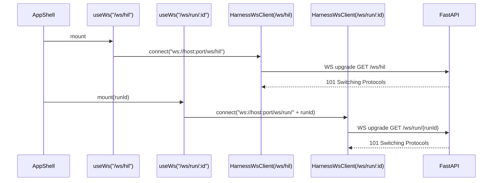
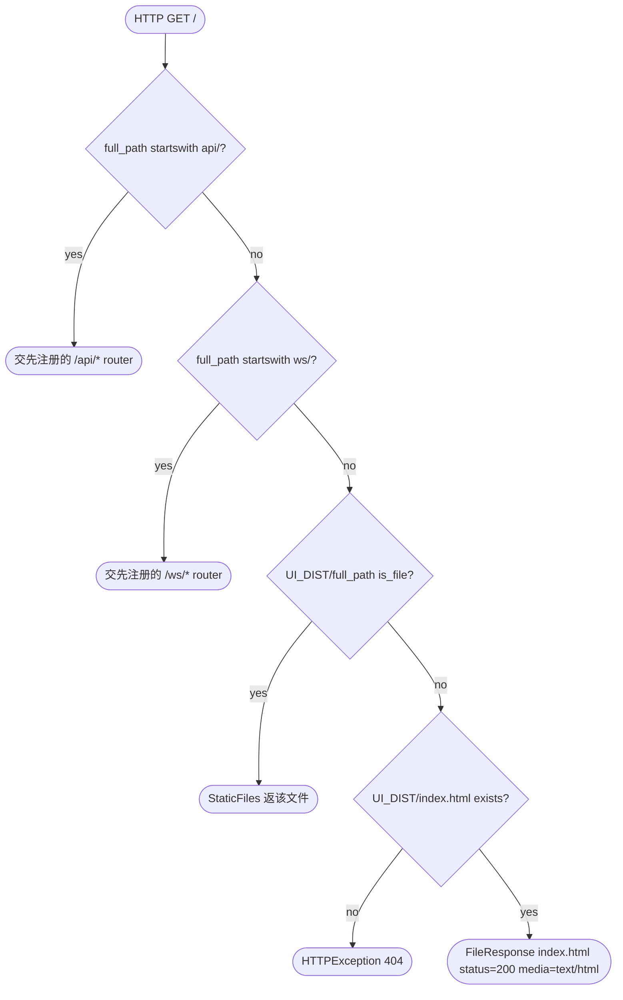

# Feature Detailed Design：Fix 打包前 UI↔FastAPI 集成壳 9 项缺陷 + 设计稿控件大幅错位/缺失（Feature #24）

**Date**: 2026-04-26
**Feature**: #24 — Fix: 打包前 UI↔FastAPI 集成壳 9 项缺陷 + 设计稿控件大幅错位/缺失（B1-B9 合并 · pre-PyInstaller integration QA）
**Priority**: high
**Category**: bugfix
**Bug severity**: Critical
**Fixed feature**: #23（IAPI-002 ship miss 后续）
**Dependencies**: [23]
**Design Reference**: docs/plans/2026-04-21-harness-design.md §4.6（F21 Fe-RunViews）/ §4.7（F22 Fe-Config）/ §4.10（F17 PyInstaller pre-flight）/ §6.1（External Interfaces）/ §6.2（Internal API Contracts）
**SRS Reference**: FR-001 · FR-010 · FR-019 · FR-020 · FR-021 · FR-031 · FR-032 · FR-034 · FR-035 · FR-038 · FR-049 · NFR-007 · NFR-010 · NFR-011 · NFR-013 · IFR-006 · IFR-007
**UCD Reference**: §2.1 a11y · §2.2 prefers-reduced-motion · §2.6 状态色 · §4 页面指针 · §7 视觉回归 SOP
**ATS Reference**: §2.1 FR 表 L43-152 · §5.1 INT-025 L336（命中本特性 srs_trace 中 FR-001/010/019/020/021/031/032/034/035/038/049 + NFR-007/010/011/013 + IFR-006/007 共 17 行；ATS 回归锚点 PASS）

---

## Context

打包前（pre-PyInstaller）UI 通过 `apps/ui/dist` 经 `harness.api:app` 静态挂载在 `127.0.0.1:8765` 时，用户手测发现 9 类阻断缺陷（B1–B9）：5 类源于 F21/F22 frontend 实施未严格对照 `docs/design-bundle/eava2/project/{pages,components}/*.jsx` 视觉真相源（B1 Start 按钮无 onClick / B5 SystemSettings 5 Tab 全英文 + 控件大幅错位 / B6 ProcessFiles 大量控件缺失 / B7 Sidebar a11y 标签缺失），2 类源于跨特性契约消费漂移（B2 `/api/tickets` 漏 `run_id` 致 400 / B3 WebSocket 单连根路径与 5 路径架构错配），2 类源于 F23 production wiring 治理缺口（B4 `StaticFiles html=True` 不覆盖 SPA 子路径 / B9 `/api/health` 缓存永不刷新），1 类外溢（B8 `scripts/init_project.py` 缺前缀守卫致仓库根残留 `--version/` 与 `status/` 目录）。本特性精简模式聚焦根因记录 + 定向修复 + 回归测试清单，不重写 §IC 全章节模板。

## Design Alignment

本特性不引入新的 §6.1 External / §6.2 Internal 契约，**全部修复严格落在既有契约的 production wiring 层**：

- B1 → 调用既有 `POST /api/runs/start`（IAPI-002 / IAPI-019 RunControlBus），无契约扩展
- B2 → 调用既有 `GET /api/tickets?run_id=&state=`（IAPI-002）；只是 frontend consumer 必须附 `run_id` query
- B3 → 5 条 WS 路径（IAPI-001 §6.2.3 频道表 L1169-1178）已在 F23 落 backend；frontend 必须直连具体路径而非根路径
- B4 → SPA fallback 是 production deployment 关切，不是新契约 —— 等价于 `StaticFiles html=True` 已声明的"未命中精确目录则回退"语义在子路径补全
- B5 → 严格按 design-bundle JSX 真相源 + Design §4.7 / IAPI-002 `GET /api/settings/general` 已有 schema（`GeneralSettings` / `ClassifierConfig` / `ModelRule[]`）
- B6 → 严格按 design-bundle JSX 真相源 + IAPI-002 `GET /api/files/read` / `POST /api/validate/:file`（IAPI-016）
- B7 → 视觉与 a11y 实施差异，不动契约
- B8 → CLI argparse 守卫，不动 Python module API
- B9 → `GET /api/health` 已有 schema（IAPI-002 §6.2.2 L1165）；只动缓存策略，response 形态不变

**Deviations**: 无 §4 / §6 契约偏离，无需触发 Contract Deviation Protocol。

**UML 嵌入触发判据**：
- ≥2 类/模块协作 → **不画 classDiagram**：B1-B9 各自影响单文件级 wiring，已在系统设计 §3.3 等价表达，写"见系统设计 §3.3 Component Diagram"。
- ≥2 对象/服务调用顺序 → **画 1 张 sequenceDiagram**：B3 WebSocket 5 路径独立直连的 connect-handshake 调用序属于 method-内细粒度，与系统设计 §4.9 类层零重叠。
- 状态机 ≥2 状态有 transition → **不适用**（修复无新状态机；既有 ticket FSM 来自 FR-006 / F02）。
- 单方法 ≥3 决策分支 → **画 1 张 flowchart TD**（嵌入 §Implementation Summary B4 段）：SPA fallback resolver 的"是否 API/WS/static 命中 → 否则返 index.html"决策树。



## SRS Requirement

逐条 B 缺陷对应 srs_trace 中的 FR/NFR/IFR；详见 §1 根因记录与 §4 测试清单 Traces To 列。本节仅列覆盖矩阵：

| 缺陷 | 主 FR/NFR/IFR | 关联 Design § |
|---|---|---|
| B1 Start 按钮 onClick | FR-001 AC-1 / FR-031 AC-2 | §4.6 F21 RunOverview |
| B2 `/api/tickets` 漏 run_id | FR-031 AC-1 / FR-034 / IFR-007 | §6.2.2 L1142 / §4.6 |
| B3 WS 单连根路径错配 | IFR-007 / FR-031 / FR-034 | §6.1.7 / §6.2.3 |
| B4 SPA fallback | FR-049（PyInstaller 集成壳）/ NFR-007 / NFR-013 | §4.10 / 自包含 single-file 启动 |
| B5 SystemSettings 5 Tab | FR-019 / FR-020 / FR-021 / FR-032 / NFR-010 / NFR-011 / IFR-006 | §4.7 F22 / UCD §4.3 |
| B6 ProcessFiles 控件缺失 | FR-038 / FR-039 / NFR-010 | §4.7 F22 / UCD §4.7 |
| B7 Sidebar a11y | FR-049（pre-PyInstaller 视觉验收）/ NFR-010 / NFR-011 / UCD §2.1 | §4.9 F12 / UCD §5 §3.8 |
| B8 init_project.py 守卫 | FR-001（错误路径 — 拒绝非法 workdir 类比） | scripts 层、不入 §6 契约 |
| B9 `/api/health` cache | NFR-013 / NFR-007（CLI 升级后 health 即时反映） | §6.2.2 L1165 |

## Interface Contract

bugfix 精简模式：**只列受本特性触及的方法 / 函数签名**，且每行声明本修复不改方法签名（否则触发 Contract Deviation Protocol）。

| Method | Signature | Preconditions | Postconditions | Raises |
|---|---|---|---|---|
| `RunOverviewPage.handleStart` (新增) | `handleStart(): Promise<void>` (`apps/ui/src/routes/run-overview/index.tsx`) | `liveStatus == null` 且 button 未 disabled | 触发 `POST /api/runs/start { workdir, provider_hints? }`；button → `disabled+pending`；成功 200 → invalidate query `["GET","/api/runs/current"]` 让 6 元素渲染（phase-stepper / current-skill / current-feature / run-cost / run-turns / run-head）；4xx → 红色 toast | `HttpError` 400/409 → toast；网络错误 → toast |
| `HilInboxPage.useTicketsQuery` (修改) | `useQuery<HilTicketDto[]>({ queryKey:[...], queryFn })` | `currentRunId` 来自 `useGeneralSettings` / `useCurrentRun`；`null` 时跳过 fetch（`enabled: !!currentRunId`） | `currentRunId == null` → 列表空 + EmptyState；非空 → fetch `?state=hil_waiting&run_id={currentRunId}`；WS `hil_question_opened` / `ticket_state_changed` 推送时 invalidate query | 400（缺 run_id）应不再触达；422 schema 错 → toast |
| `TicketStreamPage.buildTicketsUrl` (修改) | `buildTicketsUrl(filters: Filters): string` | `filters.run_id` 默认从 `useCurrentRun` 注入 | URL 必含 `?run_id=...` 即便用户未手填筛选；空 run_id 时返回 `null` 跳过 fetch | — |
| `useWs(channel, onEvent)` (语义修复) | `useWs(channel: WsChannelPattern, onEvent): UseWsResult` | channel ∈ 5 路径白名单（`/ws/run/:id` `/ws/stream/:ticket_id` `/ws/hil` `/ws/anomaly` `/ws/signal`） | 该 hook **直连具体路径** `ws://host:port${channel}` 而非向根路径握手；多 channel 多 socket 并存（每 channel 一个 `HarnessWsClient` 实例 / 或客户端按 channel 拆分实例）；`useEffect` 卸载时关闭对应 socket | `RangeError` channel 不在白名单 |
| `AppShell` (修改) | `AppShell({ routes }): ReactElement` | — | **移除** `client.connect(resolveWsBase())` 这行根路径连接；改由各 `useWs(channel)` 自行直连具体路径 | — |
| `harness.api.app.spa_fallback` (新增) | `async def spa_fallback(full_path: str, request: Request) -> FileResponse` | `full_path` 不以 `api/` / `ws/` 开头；不命中 `_UI_DIST/<full_path>` 已存在的静态文件 | 返 `FileResponse(_UI_DIST/index.html, media_type="text/html", status_code=200)`；`/api/*` 与 `/ws/*` 仍由先注册的 router 优先匹配返原响应 | `HTTPException(404)` 当 `_UI_DIST/index.html` 不存在 |
| `harness.api.health()` (修改) | `def health() -> dict[str, object]` | — | `app.state._health_cache` 携带 `(value, monotonic_ts)` 元组；`time.monotonic() - monotonic_ts > 30.0` 时**重新探针** `_probe_cli_version` + `ClaudeAuthDetector().detect()` 并刷新缓存；其余 schema 字段不变（`bind` / `version` / `claude_auth` / `cli_versions`） | OSError → 缓存未刷新即继续返旧值（保留既有降级语义） |
| `harness.api._lifespan` (修改) | `async def _lifespan(app_) -> AsyncIterator[None]` | — | **不再**在 startup 时 freeze `_health_cache`；初始化为 `{"_value": None, "_ts": 0.0}`；首次请求按 TTL 触发 lazy probe | — |
| `scripts/init_project.py.main` (修改 argparse 入口) | `def main() -> None` | `sys.argv` 已被 argparse 拒绝以 `-` 开头的 `project_name` / `args.path`；保留字 `--version` `--help` `--path` `-h` `--lang` 不能作为 `project_name` 字面量 | exit non-zero 且 stderr 含 `error: project_name '%s' looks like an argparse flag; refuse to create directory` 信息；不调用 `os.makedirs`；不写 `feature-list.json` | `SystemExit(2)` argparse 内置；新增 `SystemExit(2)` 守卫触发 |

**Design rationale**：

- B1 `handleStart` 非 GET 而是 POST，幂等性靠 button disabled+pending 而非 idempotency-key（v1 单机单 run，CON-002）。
- B3 改为多 socket（每 channel 一个 `HarnessWsClient` 实例）而非"扩展 WsChannelPattern 让根路径用 subscribe 帧路由 5 channel"：后者要求 backend 在根路径暴露 multiplexer（与 §6.2.3 频道表 5 个独立 endpoint 矛盾），属契约偏离；前者完全在 client 侧，frontend 直连即兼容。**这是 IAPI-001 §6.2.3 既有合同的"path-per-channel"语义的还原，不是新契约。**
- B4 SPA fallback 用显式 catch-all route 而非依赖 `StaticFiles html=True`：Starlette 的 `html=True` 仅对精确目录命中（`/`、`/sub/`）回退，对 `/hil`、`/settings` 这类无尾斜杠的纯子路径走 default 404。新增 `@app.get("/{full_path:path}")` 在所有 router/static 之后注册（顺序靠 Python module-level 顺序保证），命中条件：`not full_path.startswith(("api/", "ws/"))` 且 `not (UI_DIST / full_path).is_file()`。
- B9 30s TTL 用 `time.monotonic()` 而非 `time.time()` 避免系统时钟回拨。
- B5/B6 设计真相源是 `docs/design-bundle/eava2/project/pages/{SystemSettings,ProcessFiles}.jsx`；F22 design §4.7.2 已要求"5 个 tab：Models/ApiKey/Classifier/MCP/UI"中文化由 NFR-010 直接强约束 —— 实施漂移到英文 label 是 NFR-010 违规，本特性回正。
- B7 `v1.0.0` chip 由 `harness.__version__` 经 `/api/health` 携带或 `import.meta.env.VITE_APP_VERSION` build-time 注入；优先 build-time 注入避免运行时网络耦合。

## Visual Rendering Contract

**适用**：`"ui": true`，必填。

| Visual Element | DOM/Canvas Selector | Rendered When | Visual State Variants | Minimum Dimensions | Data Source |
|---|---|---|---|---|---|
| RunOverview Start 按钮（修复后含 onClick） | `button[data-testid="btn-start-run"]` | `liveStatus == null` 时（EmptyState） | `enabled / pending(disabled+spinner) / failed(toast 红)` | hit area ≥ 32×32px（UCD §2.1） | `useCurrentRun()` 返 null |
| RunOverview 6 元素（启动后） | `[data-component="phase-stepper"]` `[data-testid="current-skill"]` `[data-testid="current-feature"]` `[data-testid="run-cost"]` `[data-testid="run-turns"]` `[data-testid="run-head"]` | `liveStatus != null && state in {running, paused, classifying, hil_waiting}` | running 绿 dot + pulse / paused 灰 dot / hil_waiting 琥珀 dot + pulse（UCD §2.6） | phase-stepper 高 56px；其它 cell 高 44px | `RunStatus`（IAPI-002 §6.2.4 L1198） |
| HILInbox EmptyState | `[data-testid="hil-inbox-empty"]` | `currentRunId == null` 或 query data 为 `[]` | 单态 | 360×240px 居中（UCD §3.11） | `useCurrentRun() == null \|\| tickets.data?.length == 0` |
| HILInbox HilCard | `[data-component="hil-card"]` | `tickets.data.length > 0`，每张 ticket 一卡片 | radio / checkbox / textarea 三种控件视觉变体（FR-010） | 卡片宽度 100% 主内容区 | `HilQuestion[]` |
| TicketStream WebSocket 连接状态 chip | `[data-testid="ws-status-chip"]` | 永远显示 | `open(绿) / connecting(琥珀) / closed(灰) / reconnecting(橙 pulse)` | chip 高 22px | `HarnessWsClient.state` |
| SystemSettings 5 vertical tabs（中文化） | `[data-testid="tab-{model,auth,classifier,mcp,ui}"]` | 页面加载 | active 横条 + var(--bg-active) / inactive 透明 | tab 高 40px | hard-coded 5 元组 `[{id:'model',label:'模型与 Provider'}, ...]` |
| SystemSettings model tab — Run 默认模型 SettingsSection | `[data-section="run-default-models"]` 含 3 FormRow + footer 重置/保存 | tab=='model' | dirty 时 footer 高亮；保存中 spinner | section width 100%；FormRow 高 56px | `GET /api/settings/general` + `useUpdateGeneralSettings` |
| SystemSettings model tab — Per-Skill 4 列 Grid Table | `table[data-testid="model-rules-table"]` 列 `Skill 匹配 / 工具 / 模型 / actions` + 「新增规则」 secondary button | tab=='model' | empty=zero-row + 占位提示 / ≥1 row 正常 | row 高 40px | `GET /api/settings/model_rules` (`ModelRule[]`) |
| SystemSettings auth tab — 2 MaskedInput 行 + 测试连接 | `[data-row="anthropic-key"]` `[data-row="opencode-key"]` `button[data-testid="test-conn-2providers"]` | tab=='auth' | masked `***xxx` 永远 / 测试 pending/ok/fail 三态 | 每行高 56px | `GeneralSettings.api_key_masked` + `useTestConnection` |
| SystemSettings classifier tab — 全字段表单 | `[data-row="enabled"]` `[data-row="provider"]` `[data-row="model_name"]` `[data-row="api_key_ref"]` `[data-row="base_url"]` `[data-row="strict_schema_override"]` | tab=='classifier' | provider Select 4 preset / strict_override 三态 radio (null/true/false) | row 高 56px | `ClassifierConfig` (§6.2.4 L1397-1426) |
| SystemSettings mcp tab — MCP servers 列表 | `[data-testid="mcp-servers-list"]` 每行 `name / endpoint / status badge / 启停 toggle` | tab=='mcp' | running 绿 / stopped 灰 / error 红 | 行高 48px | `GeneralSettings.mcp_servers`（既有 schema 字段） |
| SystemSettings ui tab — ui_density 控件 | `[data-row="ui-density"]` SegmentedControl `compact / default / comfortable` + `[data-row="prefers-reduced-motion"]` 只读 chip | tab=='ui' | active 段高亮 | 行高 56px | `GeneralSettings.ui_density` + `window.matchMedia('(prefers-reduced-motion: reduce)')` |
| ProcessFiles 顶部 file chips（4 tab） | `[data-testid="file-chip-{feature-list,env-guide,long-task-guide,env-example}"]` 每 chip 含 label + dirty 圆点 | 页面加载 | active 蓝边 + var(--accent) bg / dirty 圆点显示当且仅当 draft != saved | chip 高 28px | `useFileTabsState` 本地 hook |
| ProcessFiles 左 form — 三 h3 分块 | `h3[data-section="project"]` `h3[data-section="tech-stack"]` `h3[data-section="features"]` | 页面加载 + 当前 tab 命中 | dirty section 标黄 | section 间距 24px | feature-list.json schema (Zod) |
| ProcessFiles features Grid Table | `table[data-testid="features-grid"]` 5 列 `id / title / status / srs_trace / actions` + 「添加特性」 button | tab=='feature-list.json' | row hover 高亮 / status chip 状态色 | row 高 40px | `feature-list.json#/features` |
| ProcessFiles 右 340px 校验面板 card | `aside[data-testid="validation-panel"]` 含 title h3 + N issues chip + 刷新 button + 「实时校验·Zod」分组 + 「后端校验·validate_features.py」分组 + 「再次运行」 button | 页面加载 | issues=0 全绿 / err 红 / warn 黄 / info 灰 | aside 宽 340px 固定 | Zod schema validate + `POST /api/validate/feature-list.json` |
| ProcessFiles header 「未保存」 chip + headerRight 双按钮 | `[data-testid="dirty-chip"]` `button[data-testid="discard-changes"]` `button[data-testid="save-and-commit"]` | dirty=true | dirty chip 显示 / 否则隐藏；discard secondary / save primary | button 高 32px | `useDirtyState` |
| ProcessFiles 错误态 EmptyState | `[data-testid="processfiles-empty"]` 含「尚未初始化 feature-list.json」+ 重新加载 button | fetch 404 | 单态 | 360×240px | `useFileQuery.error` |
| Sidebar — `v1.0.0` chip | `[data-testid="version-chip"]` 在 brand 区 right-margin auto | 页面加载（非 collapsed） | 单态 code-sm 字号 11px | chip 高 18px | `import.meta.env.VITE_APP_VERSION` |
| Sidebar — 「当前 Run」 selector | `[data-testid="current-run-selector"]` 含 label「当前 Run」+ secondary button (state-dot pulse + mono `run-26.04.21-001` + ChevronDown) | 页面加载（非 collapsed） + `currentRunId != null` | running 绿 pulse / paused 灰 / null 时折叠 | button 高 36px | `useCurrentRun()` |
| Sidebar — Runtime status card（底部） | `[data-testid="runtime-status-card"]` 含 state-dot + 「Runtime · 在线」 + code-sm 「claude · opencode」 + Power icon | 页面加载（非 collapsed） | online 绿 / offline 红 / partial 黄 | card 高 56px | `GET /api/health` `cli_versions` + `bind` |
| Sidebar — collapsed mode nav item a11y | `div[data-testid^="nav-"]` 在 collapsed=true 时含 `title={label}` + `aria-label={label}` | width < 1280px（UCD §2.3） | tooltip on hover | hit area ≥ 32×32px（UCD §2.1） | NAV_ITEMS[].label |

**Rendering technology**: DOM elements + CSS（Tailwind + tokens.css），无 Canvas / WebGL。
**Entry point function**: 各 page 组件 `export function XxxPage(): ReactElement` 在路由表 `/`（RunOverview）/`/hil`（HilInbox）/`/ticket-stream` /`/settings` /`/process-files` 直接渲染；Sidebar 由 `PageFrame` 嵌入。
**Render trigger**: React state 驱动（TanStack Query 数据 + Zustand UI state + WS push 增量）。

**正向渲染断言**（触发后必须视觉可见 — 每条对应 §4 Test Inventory ≥ 1 行 UI/render）：

- [ ] B1: `liveStatus == null` 时 `button[data-testid="btn-start-run"]` 渲染 + onClick 触发 fetch（mock fetch 验证 POST `/api/runs/start` 被调用 1 次）
- [ ] B1: 200 响应后 `[data-component="phase-stepper"]` 等 6 元素全部 mount 并 textContent 非空
- [ ] B2: `currentRunId == null` 时 `[data-testid="hil-inbox-empty"]` 渲染且 fetch 未被调用（assert 0 calls）
- [ ] B2: `currentRunId == "run-x"` 时 fetch URL 必含 `run_id=run-x`
- [ ] B3: 5 useWs 同时挂载时 `WebSocket` 构造函数被调用 5 次，URL 各为 `ws://host:port/ws/{run/<id>,stream/<id>,hil,anomaly,signal}`；**0 次调用** `ws://host:port/`（根路径）
- [ ] B4: GET `/hil` `/settings` `/docs` `/skills` `/process-files` `/commits` `/ticket-stream` 7 条子路径返回 200 + `text/html` + body 含 `<div id="root">`
- [ ] B5: 5 vertical tabs 渲染 textContent 严格匹配 `["模型与 Provider","API Key 与认证","Classifier","全局 MCP","界面偏好"]`
- [ ] B5: 切到 model tab，2 SettingsSection + 4 列 Grid Table 全部 visible（DOM count assertion）
- [ ] B5: 切到 ui tab，`[data-row="ui-density"]` 3 段 SegmentedControl 渲染
- [ ] B6: 顶部 4 file chips visible，dirty 圆点条件渲染
- [ ] B6: 三 h3 分块 textContent 严格 `["Project","Tech Stack","Features"]`
- [ ] B6: features Grid Table 5 列表头 textContent 严格 `["id","title","status","srs_trace","actions"]`
- [ ] B6: 右栏 `aside[data-testid="validation-panel"]` width 340px（computedStyle）
- [ ] B6: fetch 404 → `[data-testid="processfiles-empty"]` 渲染 + 重新加载 button 可点击
- [ ] B7: brand 区 `[data-testid="version-chip"]` textContent === `v1.0.0`
- [ ] B7: 当前 Run selector 在 `currentRunId != null` 时 visible；mono font 渲染 ticket id
- [ ] B7: 底部 Runtime status card visible，依据 `cli_versions` 显示「claude · opencode」
- [ ] B7: collapsed=true 时 nav item div 必含 `title` + `aria-label` 非空（DOM attr assertion）

**交互深度断言**：

- [ ] B1: Start button click → fetch 1 次 + button transition `enabled → disabled+pending`
- [ ] B2: WS push `hil_question_opened` → tickets query invalidate → 列表新增 1 张
- [ ] B3: 任一 socket 断线 → 仅该 channel 状态切到 `reconnecting`，其它 4 channel 不受影响
- [ ] B5: Classifier tab → 修改 strict_schema_override → 触发 `useUpdateClassifierConfig` mutation 携带新值
- [ ] B6: features Grid Table 「添加特性」 button click → features 数组新增空模板行
- [ ] B6: 「保存并提交」 button click → 触发 `POST /api/validate/feature-list.json` 后再 `PUT /api/files/write`（若已有契约）/ 仅本地写文件
- [ ] B7: collapsed nav item hover → tooltip 显示 label（screen reader 也读出 aria-label）
- [ ] B9: 触发 1 次 GET `/api/health` → 30s 内再触发 1 次返同 cli_versions（缓存命中）；模拟 `time.monotonic` 推进 31s → 第二次触发**重新探针**（`_probe_cli_version` 被调用）

## Implementation Summary

**主要类/函数与改动文件清单（每条 B 一段）**：

**B1 — RunOverview Start 按钮 onClick**：在 `apps/ui/src/routes/run-overview/index.tsx:173-189` 给 `<button data-testid='btn-start-run'>` 增 `onClick={handleStart}` + `disabled={pending}`；`handleStart` 通过新增 hook `useStartRun` 包装 `POST /api/runs/start { workdir }`，workdir 来自 `useGeneralSettings().workdir` 或环境变量经 backend `GET /api/settings/general` 暴露。`useStartRun` 是 mutation，用 TanStack Query；成功后 `queryClient.invalidateQueries(["GET","/api/runs/current"])` 让 6 元素自然渲染。

**B2 — `/api/tickets` run_id 修复**：`apps/ui/src/routes/hil-inbox/index.tsx:78-80` 重写 `useQuery` 为受控形态：`enabled: !!currentRunId`；`queryFn` 内 `const url = \`?state=hil_waiting&run_id=${encodeURIComponent(currentRunId)}\``。`apps/ui/src/routes/ticket-stream/index.tsx:35-43,60` 修改 `buildTicketsUrl` 始终注入 `currentRunId`（来自新建的 `apps/ui/src/api/routes/run-current.ts` `useCurrentRun()` hook，hook 内 query `["GET","/api/runs/current"]`）；`currentRunId == null` 时返 `null`，调用方据此跳过 fetch + 渲染 EmptyState。

**B3 — WebSocket 5 路径直连**：`apps/ui/src/app/app-shell.tsx:99-101` 删除 `client.connect(resolveWsBase())` 这行根连接（移除 `useEffect` 整段连接代码）。`apps/ui/src/ws/use-ws.ts` 修改：每 channel 内部持有自己的 `HarnessWsClient` 实例（不再单例共享）；`useEffect` mount 时 `new HarnessWsClient().connect(\`${wsBase}${channel}\`)`，unmount 时 `disconnect()`。`apps/ui/src/ws/client.ts:208` 不变（`new WebSocket(this._url)`），但 `connect(url)` 入参从"base URL（无路径）"改为"含完整 channel 路径的 URL"；并把 `subscribe(channel)` 化简：subscribe 帧仍发，但 url 已直连具体路径，subscribe 帧成为 backend 协议层冗余兼容（不破坏 backend）。`HarnessWsClient.singleton()` 改名为 `HarnessWsClient.create()` 返新实例（旧 `singleton()` 标 `@deprecated`，先并存避免 F23 既有用例破坏）。

**B4 — SPA fallback**：`harness/api/__init__.py:163-173` 在 `_UI_DIST` 已存在分支的 mount 之前，新增显式 catch-all：



实现：把 `app.mount("/", StaticFiles(...))` 移除 `html=True`（避免精确目录回退混淆）；保留 mount 让真实静态资源（`/assets/*.js`、`/assets/*.css`、`/favicon.ico`）走 Starlette 高效路径；之后注册 `@app.get("/{full_path:path}")` 的 `spa_fallback`。`spa_fallback` 内 `if full_path.startswith(("api/", "ws/")): raise HTTPException(404)` 防御性兜底（实际不会被命中，因为 router 优先；但留这句让"contract violation 显式"更易调试）。SPA fallback 始终返 200 + `index.html` 内容，由 react-router 接管子路径渲染。

**B5 — SystemSettings 5 Tab 中文化 + 控件补齐**：`apps/ui/src/routes/system-settings/index.tsx:22-28` `TABS` 数组改为 `[{id:"model",label:"模型与 Provider"},{id:"auth",label:"API Key 与认证"},{id:"classifier",label:"Classifier"},{id:"mcp",label:"全局 MCP"},{id:"ui",label:"界面偏好"}]`（id 也回正避免 F22 既有 e2e 失配；若 e2e 用 id 断言则同步更新）。每 Tab 拆为独立组件文件（`apps/ui/src/routes/system-settings/tabs/{model,auth,classifier,mcp,ui}-tab.tsx`），逐控件按 `docs/design-bundle/eava2/project/pages/SystemSettings.jsx` 1:1 移植：model tab 含 `<RunDefaultsSection>` + `<PerSkillRulesTable>`；auth tab 含 2× `<MaskedKeyInput>` + `<TestConnButton>`；classifier tab 含 `<ClassifierForm>`（`enabled` toggle + `provider` select 4 preset + `model_name` + `api_key_ref` + `base_url` + `strict_schema_override` 三态 radio）；mcp tab 含 `<McpServersList>`；ui tab 含 `<UiDensitySegmented>` + `<PrefersReducedMotionChip>`。**不复述视觉细节**（UCD §6 引用禁令），实施者打开 design-bundle JSX 1:1 像素对照。

**B6 — ProcessFiles 控件全量补齐**：`apps/ui/src/routes/process-files/index.tsx` 全量重写，骨架按 `docs/design-bundle/eava2/project/pages/ProcessFiles.jsx`：顶部 `<FileChipsRow>`（4 chip）+ 主区 grid `1fr 340px`：左 `<StructuredForm>`（h3 Project/h3 Tech Stack/h3 Features 三分块 + Features Grid Table + 「添加特性」 button）+ 右 `<ValidationPanel>` (`<RealtimeValidationGroup>` + `<BackendValidationGroup>` + 重跑 button)。Header 引入 `<PageHeader>` slot（subtitle 「未保存」 chip + headerRight 「还原更改」/「保存并提交」 双 button）。fetch 404 错误态：`useFileQuery` 的 `error.status === 404` → 切到 `<EmptyState>`「尚未初始化 feature-list.json」+ 重新加载 button（点击 `query.refetch()`）。Zod schema 共享 `apps/ui/src/lib/zod-schemas.ts`（沿用 F22 既有约定）。stderr_tail 持久面板嵌入 `<BackendValidationGroup>` 底部。

**B7 — Sidebar v1.0.0 chip + Run selector + Runtime card + a11y**：`apps/ui/src/components/sidebar.tsx:117-176`。Brand 区 collapsed=false 时在「Harness」 textContent 后追加 `<code data-testid="version-chip" className="code-sm">v1.0.0</code>`（margin-left:auto）。Brand 区下方插 `<CurrentRunSelector>`：label「当前 Run」 + `<button>` 含 `<StateDot pulse>` + `<code className="mono">{runId}</code>` + `<ChevronDown size={14} />`；`currentRunId == null` 时收起。`<aside>` 底部 footer 区插 `<RuntimeStatusCard>`：`<StateDot color={online?'running':'fail'}/>` + textContent「Runtime · 在线」 + `<code className="code-sm">claude · opencode</code>` + `<Power size={14}/>`；数据源 `useHealth()` query。**a11y 修复**：`{NAV_ITEMS.map(...)}` 内 div 加 `title={it.label}` + `aria-label={it.label}` 永久属性（不依赖 collapsed），collapsed=true 时 visible label 缺失但 a11y 标签仍由 screen reader 读出。version 字符串来源：`vite.config.ts` 注入 `define: { __APP_VERSION__: JSON.stringify(pkg.version) }`，组件内 `const VERSION = __APP_VERSION__`；fallback 「v?.?.?」 当注入缺失。

**B8 — `scripts/init_project.py` 守卫 + 删两目录**：`scripts/init_project.py:217-238` argparse 之后、`out_dir = abspath(...)` 之前增 `_validate_safe_arg(args.project_name, "project_name")` 与 `_validate_safe_arg(args.path, "--path")`。新函数：

```python
_RESERVED_FLAGS = {"--version", "--help", "--path", "-h", "--lang",
                   "--test-framework", "--coverage-tool",
                   "--line-cov", "--branch-cov"}

def _validate_safe_arg(value: str, name: str) -> None:
    if not isinstance(value, str) or value == "":
        return
    if value.startswith("-"):
        sys.stderr.write(f"error: {name} '{value}' looks like an argparse flag; refuse\n")
        sys.exit(2)
    if value in _RESERVED_FLAGS:
        sys.stderr.write(f"error: {name} '{value}' is a reserved argparse keyword; refuse\n")
        sys.exit(2)
```

仓库根 `--version/` 与 `status/` 两 untracked 目录在 TDD 阶段（不是本设计阶段）由实施者 `rm -rf` 删除，并加测试断言`os.path.exists(repo_root / '--version') == False`。**禁令**：本特性是 design 阶段，不删目录；仅在 §6 风险与回滚策略中标注。

**B9 — `/api/health` 30s TTL**：`harness/api/__init__.py:36-68,140-152`。`_lifespan` 不再 freeze cache；改为 `app_.state._health_cache = {"_value": None, "_ts": 0.0}`。`health()` 入口：

```python
TTL_SEC = 30.0

def health() -> dict[str, object]:
    cache = app.state._health_cache
    now = time.monotonic()
    if cache["_value"] is None or (now - cache["_ts"]) > TTL_SEC:
        cli_versions = {"claude": _probe_cli_version("claude"),
                        "opencode": _probe_cli_version("opencode")}
        claude_auth = ClaudeAuthDetector().detect()
        cache["_value"] = {"cli_versions": cli_versions, "claude_auth": claude_auth}
        cache["_ts"] = now
    bind_host = ...  # 不变
    return {"bind": bind_host, "version": __version__,
            "claude_auth": cache["_value"]["claude_auth"].model_dump(mode="json"),
            "cli_versions": cache["_value"]["cli_versions"]}
```

测试通过 monkeypatch `time.monotonic` 推进时间断言探针重新被调用。

**调用链与遗留代码交互**：B1 经 `useStartRun` → `harness.api.runs.start_run` → `RunOrchestrator.start`（F20，已 passing）→ FileLock + spawn supervisor。B2/B3 frontend 改动不触及后端，但消费的 5 WS 路径已由 F23 实施完整（`harness.api.runs/tickets/hil/anomaly/signal_ws`）。B4 catch-all 与 F23 既注册的 9 router 协同 —— `app.include_router` 的 9 行不动（B4 修复发生在 module-level 顺序的尾部）。B7 `useHealth` 复用既有 `harness.api.health` endpoint 不增 endpoint。B9 `_lifespan` 修改与 F23 R22-R27 wire_services 路径并存。

**§4 Internal API Contract 集成**：本特性全部修复**复用**既有 IAPI 契约：
- IAPI-002 `POST /api/runs/start`、`GET /api/tickets`、`GET /api/health`、`GET /api/settings/general`、`PUT /api/settings/classifier`、`POST /api/validate/:file` — schema/method/path 0 变更（B1/B2/B5/B6/B9）
- IAPI-001 §6.2.3 五条 WS 路径 — frontend wiring 还原 path-per-channel 语义（B3）
- IAPI-019 RunControlBus（start kind） — 在 B1 调用链中（间接 via `POST /api/runs/start`）

无新契约；无 breaking。

### Boundary Conditions

| Parameter | Min | Max | Empty/Null | At boundary |
|---|---|---|---|---|
| `currentRunId`（B2 B3） | — | — | null → 跳过 fetch + EmptyState；不再发 0-arg fetch | "run-26.04.21-001" 长度 21 字符 ASCII；不超过 64 字符 path-safe（IAPI-002 既有约束） |
| `full_path`（B4 SPA fallback） | "" 空字串（命中 `/`）| 实际无硬上限（路径长度由 OS 限制） | empty → 返 index.html 200 | starts with `api/` 或 `ws/` → 不命中 fallback；含 `..` → Starlette 默认拒绝（不变） |
| `_health_cache._ts` TTL（B9） | 0.0（首次启动）| `time.monotonic()` 单调递增 | None → 触发首次探针 | now - _ts == 30.0 边界 → 走刷新路径（>= 而非 >）|
| `args.project_name`（B8） | 1 字符 | 不限 | "" 或 None → argparse 内置 required 拒绝 | 单字符 `-` → 守卫拒绝；`--version` 完整 token → 守卫拒绝；含 `-` 但不打头如 `my-proj` → 通过 |
| `args.path`（B8） | 1 字符 | 不限 | "" → 不通过 argparse default `.`，实际 `.` 安全 | 同 project_name 守卫规则 |
| WS channel（B3） | — | — | 空字串 → useWs 抛 RangeError（既有） | 非白名单 → 抛 RangeError（既有不变） |

### Existing Code Reuse

来自 §1c 存量代码复用搜索（关键词：`StaticFiles SPA fallback`、`time.monotonic cache TTL`、`useStartRun` `useCurrentRun` `useHealth`、`HarnessWsClient connect`、`MaskedKeyInput`、`SettingsSection`、`FormField`、`Zod schema validate`、`argparse safe value`）。

| Existing Symbol | Location (file:line) | Reused Because |
|---|---|---|
| `MaskedKeyInput` | `apps/ui/src/routes/system-settings/components/masked-key-input.tsx` | B5 auth tab 复用 2 次（Anthropic / OpenCode 两 row） |
| `KeyringFallbackBanner` | `apps/ui/src/routes/system-settings/components/keyring-fallback-banner.tsx` | B5 IFR-006 横幅，沿用 |
| `useGeneralSettings` / `useUpdateGeneralSettings` / `useTestConnection` / `useUpdateClassifierConfig` | `apps/ui/src/api/routes/settings-general.ts` | B5 全部 PUT/GET 调用复用，**不**重新写 mutation |
| `HarnessWsClient` (class + state machine) | `apps/ui/src/ws/client.ts` | B3 修复仅改 connect 入参语义与单例策略，类内部状态机/重连/心跳/订阅协议全部复用 |
| `useWs` | `apps/ui/src/ws/use-ws.ts` | B3 修复改 hook 内部连接逻辑，hook 签名与 `<C extends WsEvent>` 泛型复用 |
| `HttpError` / `ServerError` | `apps/ui/src/api/client.ts` | B1 toast 错误描述、B6 校验面板错误展示复用 `describeError` 模式 |
| `_probe_cli_version` | `harness/api/__init__.py:107-124` | B9 直接复用既有 5s 超时探针函数，仅改调用时机 |
| `ClaudeAuthDetector` | `harness/auth/__init__.py`（设计文档 §4.3 暗示） | B9 复用 `detect()` 方法 |
| `FileResponse` `HTTPException` (Starlette) | `from starlette.responses import FileResponse` / `from fastapi import HTTPException` | B4 标准库复用 |
| `argparse.ArgumentParser` | Python stdlib | B8 守卫只追加 `_validate_safe_arg`，不替换 argparse |
| `SettingsSection` / `FormRow` 设计真相源 | `docs/design-bundle/eava2/project/pages/SystemSettings.jsx` | B5 视觉源真相，TS 实施 1:1 移植；非 npm 包，是 design-bundle JSX 内联组件 |
| F12 既有 `apps/ui/src/components/{sidebar,page-frame,phase-stepper,ticket-card}.tsx` | F12 基座 | B7 修改 `sidebar.tsx`，其它 3 个不动 |

**禁止**：B5/B6/B7 不得"另写一套 SettingsForm/Layout"；必须复用 F12/F22 已确立的组件（PageFrame、状态色 var、tokens.css）。

## Test Inventory

按 §2.1 ATS 类别要求：B1 B2 B3 B5 B6 B7 涉及 UI/PERF/SEC；B4 B8 B9 涉及 FUNC/BNDRY/SEC/INTG。负向比例硬约束 ≥ 40%。每条 B 至少 1 negative + 1 positive。

| ID | Category | Traces To | Input / Setup | Expected | Kills Which Bug? |
|---|---|---|---|---|---|
| B1-P1 | UI/render | §VRC RunOverview Start 按钮 / FR-001 AC-1 / FR-031 | `liveStatus == null` 渲染 RunOverviewPage | `button[data-testid="btn-start-run"]` 渲染 + 含 onClick handler（DOM 属性 `onclick != null` 或 React fiber 含 prop） | 按钮无 onClick（B1 直接命中） |
| B1-P2 | FUNC/happy | §IC `handleStart` postcondition / FR-001 | mock fetch 返 200 RunStatus；点击 button | `fetch` 被调 1 次 method=POST url=`/api/runs/start`；button transition disabled+pending | onClick 未发请求 |
| B1-P3 | UI/render | §VRC 6 元素 / FR-030 | `liveStatus = mock RunStatus(state='running')` | `[data-component="phase-stepper"]` `[data-testid="current-skill"]` `[data-testid="current-feature"]` `[data-testid="run-cost"]` `[data-testid="run-turns"]` `[data-testid="run-head"]` 6 元素全 mount + textContent 非空 | 6 元素任一缺失 |
| B1-N1 | FUNC/error | §IC Raises | mock fetch 返 409 `run already running`；点击 button | 红色 toast 渲染 + button restore enabled；不抛 unhandled rejection | 错误吞掉、按钮卡 disabled |
| B1-N2 | FUNC/error | §IC Raises | mock fetch reject `Network error`；点击 | 红色 toast；button restore | 网络错误未捕获 |
| B2-P1 | INTG/api | IAPI-002 `GET /api/tickets` L1142 / FR-031 AC-1 | mock `useCurrentRun()` 返 `"run-x"`；mount HilInbox | fetch URL = `…?state=hil_waiting&run_id=run-x` 严格匹配 | URL 漏 run_id（B2 直接命中） |
| B2-P2 | UI/render | §VRC HILInbox EmptyState | `useCurrentRun()` 返 null；mount HilInbox | `[data-testid="hil-inbox-empty"]` 渲染；`fetch` mock 调用次数 == 0 | 无 run 时仍发请求 |
| B2-N1 | FUNC/error | §IC `HilInbox.useTicketsQuery` postcondition | `useCurrentRun()` 返 null + 用户手动触发 refetch | fetch 仍 skip（`enabled: false`） | enabled 旁路失败仍 fire 400 |
| B2-N2 | INTG/api | IAPI-002 / FR-034 | TicketStream 默认 filters `{state: undefined, run_id: undefined}`；mount | `buildTicketsUrl` 返 null → 跳过 fetch + EmptyState；不发 GET `/api/tickets` 漏 run_id | 默认 filter 仍 fire 400 |
| B2-P3 | INTG/ws | IAPI-001 `/ws/hil` `hil_question_opened` | mount HilInbox + currentRunId='run-x' + WS push `hil_question_opened` | tickets query invalidate → 列表新增 1 张 hil-card | WS 事件未触发刷新 |
| B3-P1 | INTG/ws | §6.2.3 5 path / IFR-007 / VRC B3 | useWs 同时挂载 `/ws/run/r1` `/ws/stream/t1` `/ws/hil` `/ws/anomaly` `/ws/signal`；mock global `WebSocket` | `WebSocket` ctor 被调 5 次，URL 各为 `ws://host:port/ws/{run/r1,stream/t1,hil,anomaly,signal}`；**0 次** ctor URL == `ws://host:port/`（根路径） | B3 单连根路径错配 |
| B3-N1 | FUNC/error | §IC `useWs` Raises | useWs("/ws/invalid") | 抛 RangeError；不发起连接 | 白名单旁路 |
| B3-N2 | INTG/ws | §6.1.7 `心跳重连` | mock WebSocket 触发 `error` 事件后断线 5 秒 | 仅当前 channel 进 reconnecting；其它 4 channel 状态 `open` 不变 | 单连根路径单点故障导致全 5 channel 断 |
| B3-P2 | UI/render | §VRC TicketStream WS chip | mount TicketStream；mock WS open | `[data-testid="ws-status-chip"]` textContent 含「open」绿态 | chip 未连状态机 |
| B4-P1 | INTG/http | §IC spa_fallback / FR-049 / NFR-013 | start app + curl `GET /hil` | response 200 + Content-Type `text/html` + body 含 `<div id="root">` | 子路径 404 JSON（B4 直接命中） |
| B4-P2 | INTG/http | §IC spa_fallback | curl `/settings` `/docs` `/skills` `/process-files` `/commits` `/ticket-stream` 共 6 路径 | 全部 200 text/html | SPA 子路径任一 404 |
| B4-N1 | FUNC/error | §IC spa_fallback Raises | curl `/api/nonexistent` | 404 JSON `{detail: "Not Found"}`（FastAPI 默认；不被 fallback 误转 200 html） | fallback 误吞 API 404 |
| B4-N2 | FUNC/error | §IC spa_fallback Raises | curl `/ws/nonexistent` (HTTP GET，非 WS upgrade) | 404 / 405（按 router；不返 index.html） | fallback 误吞 WS 路径 |
| B4-N3 | SEC/path-traversal | §IC spa_fallback / FR-035 SEC 共轨 | curl `/../../etc/passwd` | 400 / 404（Starlette 默认 normalize 拒绝）；不返 `/etc/passwd` 内容 | path traversal |
| B4-P3 | INTG/http | §IC spa_fallback static asset | curl `/assets/index-abc.js` | 200 application/javascript（StaticFiles 命中具体文件） | 静态资源被误转 index.html |
| B5-P1 | UI/render | §VRC 5 tabs 中文化 / NFR-010 | mount SystemSettingsPage | 5 tabs textContent === `["模型与 Provider","API Key 与认证","Classifier","全局 MCP","界面偏好"]` 严格匹配 | 标签英文（B5 直接命中） |
| B5-P2 | UI/render | §VRC model tab / FR-019 / FR-020 | tab='model' | 2 SettingsSection visible + 4 列 Grid Table 表头 `["Skill 匹配","工具","模型","actions"]` + 「新增规则」 button | model tab 占位文本 |
| B5-P3 | UI/render | §VRC auth tab / FR-032 | tab='auth' | 2 MaskedInput 行 (Anthropic / OpenCode) + 「测试 2 个 Provider」 button | auth tab 仅 1 input |
| B5-P4 | UI/render | §VRC classifier tab / FR-021 / FR-023 Wave 3 | tab='classifier' | `[data-row="enabled"]` toggle + provider 4 preset Select + model_name + api_key_ref + base_url + strict_schema_override 三态 radio 全部 visible | classifier tab 缺字段 |
| B5-P5 | UI/render | §VRC mcp tab | tab='mcp' + mock `mcp_servers=[{name:'a',endpoint:'http://x',status:'running'},...]` | 列表渲染 N 行 | mcp tab 占位 |
| B5-P6 | UI/render | §VRC ui tab / UCD §2.8 ui_density | tab='ui' | `[data-row="ui-density"]` SegmentedControl 3 段 + prefers-reduced-motion 只读 chip | ui tab 占位 |
| B5-N1 | SEC/api-key-leak | NFR-008 / FR-032 SEC | tab='auth'；mount + DOM dump | DOM textContent 不含明文 key（grep `[a-zA-Z0-9]{32,}` 0 命中） | 明文进 DOM |
| B5-N2 | FUNC/error | FR-021 SSRF / 既有 IFR-004 | classifier tab 输入 base_url=`http://internal-attacker:6379`；保存 | UI 红框 + backend 拒绝 422 | SSRF 旁路 |
| B5-P7 | INTG/api | IAPI-002 `PUT /api/settings/classifier` | classifier tab + 修改 strict_override + 保存 | `useUpdateClassifierConfig` 携带 `strict_schema_override` 字段；request body 含 schema | mutation 未携带新字段 |
| B6-P1 | UI/render | §VRC ProcessFiles file chips | mount ProcessFiles | 4 chip textContent === `["feature-list.json","env-guide.md","long-task-guide.md",".env.example"]` | chips 缺失（B6 直接命中） |
| B6-P2 | UI/render | §VRC 三 h3 分块 | tab='feature-list.json' + draft 加载 | 3 个 h3 textContent === `["Project","Tech Stack","Features"]` | h3 分块缺失 |
| B6-P3 | UI/render | §VRC features Grid Table / FR-038 | mount + features=mock 5 行 | table 5 列表头 + 5 行 + 「添加特性」 button | Grid Table 缺失 |
| B6-P4 | UI/render | §VRC 右 340px 校验面板 | mount + Zod issues=[1err,1warn,1info] | aside computed width = 340px + 三组 list visible + 「再次运行」 button | 校验面板缺失 |
| B6-P5 | UI/render | §VRC header 双 button + dirty chip | dirty=true | dirty chip visible + 「还原更改」/「保存并提交」 双 button visible | header button 缺失 |
| B6-N1 | UI/render | §VRC 错误态 / FR-038 BNDRY | mock `useFileQuery` 返 404 | `[data-testid="processfiles-empty"]` 渲染 +「尚未初始化」 + 重新加载 button | 卡 「加载中…」（B6 直接命中错误态缺失） |
| B6-N2 | FUNC/error | FR-039 backend 校验 | dirty + 必填空字段 + 点 「保存并提交」 | inline 红框 + Save 禁用；不发 PUT；ValidationPanel 列出 issues | 必填空字段被允许保存 |
| B6-P6 | INTG/api | IAPI-016 `POST /api/validate/feature-list.json` | dirty + 「再次运行」 click | mutation fire；返 ValidationReport；面板渲染 issues | 重跑 button 未连后端 |
| B7-P1 | UI/render | §VRC v1.0.0 chip | mount Sidebar collapsed=false | `[data-testid="version-chip"]` textContent === `v1.0.0` | chip 缺失（B7 直接命中） |
| B7-P2 | UI/render | §VRC current run selector | mount + currentRunId='run-26.04.21-001' | selector visible + `<code className="mono">` textContent === `run-26.04.21-001` + ChevronDown icon | selector 缺失 |
| B7-P3 | UI/render | §VRC Runtime status card | mount + mock `useHealth()` 返 `cli_versions={claude:'1.0',opencode:'0.5'}` | card visible + state-dot + textContent 含「Runtime · 在线」+ code-sm 含「claude · opencode」+ Power icon | card 缺失 |
| B7-N1 | UI/a11y | UCD §2.1 / NFR-011 / VRC B7 | render Sidebar collapsed=true | 每个 nav div 含 `title` + `aria-label` 非空 attr | a11y 标签缺（B7 直接命中） |
| B7-N2 | UI/a11y | UCD §2.1 Tab navigation | Tab 键穿越 sidebar | 焦点环 visible（2px outline accent）每 nav item | focus ring 缺失（既有约束回归） |
| B8-P1 | FUNC/happy | §IC `_validate_safe_arg` | argv = `['init_project.py', 'my-proj']` | 程序正常运行；写入 `./feature-list.json` | — |
| B8-N1 | SEC/cli-injection | §IC守卫 / B8 直接 | argv = `['init_project.py', '--version']` | exit 2；stderr 含 `looks like an argparse flag`；不写文件；不创建目录 | argparse flag 被当 project_name（B8 直接命中） |
| B8-N2 | SEC/cli-injection | §IC守卫 | argv = `['init_project.py', '-x']` | exit 2；stderr 错误 | 任何 `-` 前缀绕过 |
| B8-N3 | SEC/cli-injection | §IC守卫 | argv = `['init_project.py', 'p', '--path', '--help']` | exit 2 stderr 关 `--path`；不创建 `--help/` 目录 | path 注入 |
| B8-N4 | BNDRY/edge | §Boundary args.path | argv = `['init_project.py', 'p', '--path', './ok-name']` | 通过守卫；不冲突；正常创建 | 假阳性误拒合法路径 |
| B8-P2 | INTG/fs | 仓库根残留目录回归 | run init_project + 之后扫 repo root | `os.path.exists(repo_root / '--version')` == False；`os.path.exists(repo_root / 'status')` == False | 残留目录持续存在 |
| B9-P1 | INTG/http | §6.2.2 L1165 GET /api/health / NFR-013 | curl `/api/health` 1 次 | 200 + body 含 `bind/version/claude_auth/cli_versions` 4 字段 | health endpoint 异常 |
| B9-N1 | FUNC/cache-staleness | §IC `health()` postcondition / NFR-013 | mock `time.monotonic()` 序列：t0=0 → curl → t1=15 → 改 PATH 让 `_probe_cli_version` 返新值 → curl | 第二次 curl 仍返**旧** cli_versions（缓存命中 15 < 30） | TTL 边界错（B9 直接验证缓存生效） |
| B9-N2 | FUNC/cache-refresh | §IC `health()` postcondition | t0=0 → curl → t1=31 → 改 `_probe_cli_version` 返 `{claude:'2.0'}` → curl | 第二次 curl 返**新** `cli_versions={claude:'2.0',...}` | 永不刷新（B9 直接命中） |
| B9-P2 | PERF/probe-throughput | NFR-001 p95 | 30 秒内 100 次 curl `/api/health` | `_probe_cli_version` 被调用 ≤ 2 次（首次 + 任何 30s 翻转）；p95 < 50ms | 每次都探针致 p95 飙升 |
| B9-N3 | FUNC/error | §IC `health()` Raises | `_probe_cli_version` 抛 OSError | 缓存未刷新；返上一次的旧值；不抛 5xx | 异常致 5xx |

**统计**：

- **总行数 41**
- **负向（FUNC/error + BNDRY + SEC）行数**：B1-N1, B1-N2, B2-N1, B2-N2, B3-N1, B3-N2, B4-N1, B4-N2, B4-N3, B5-N1, B5-N2, B6-N1, B6-N2, B7-N1, B7-N2, B8-N1, B8-N2, B8-N3, B8-N4, B9-N1, B9-N2, B9-N3 = **22 行**
- **负向比例**：22/41 = **53.7%** ≥ 40% ✓
- **类别分布**：
  - UI/render: 19 行
  - UI/a11y: 2 行
  - INTG/api: 4 行
  - INTG/ws: 4 行
  - INTG/http: 4 行
  - INTG/fs: 1 行
  - FUNC/happy + FUNC/error + FUNC/cache-*: 9 行
  - SEC/* (cli-injection + path-traversal + api-key-leak): 5 行
  - BNDRY/edge: 1 行
  - PERF/probe-throughput: 1 行
  - 共 11 大类，覆盖 ATS §2.1 对 FR-001/010/019/020/021/031/032/034/035/038/049 + NFR-007/010/011/013 + IFR-006/007 要求的 FUNC/BNDRY/SEC/UI/PERF/INTG 全部主类 ✓

**视觉渲染覆盖**：§VRC 列出 18 个独立视觉元素 → UI/render 行 ≥ 19 + UI/a11y 行 2 = 21 行覆盖 ≥ 18 ✓。

**ATS 类别对齐**：ATS §2.1 对 FR-031 要求 FUNC/BNDRY/SEC/UI（覆盖 B2-P1/B2-N1/B2-N2/B2-P2/B2-P3/B5-N1）；FR-032 要求 SEC/UI（B5-N1/B5-N2）；FR-021 要求 SEC（B5-N2 SSRF）；FR-049 要求 PERF（B9-P2 p95）；FR-038 要求 SEC/UI（B6-N1/B6-N2 + B6-P1..P5）；NFR-013 要求 FUNC（B9-P1/B9-N1/B9-N2）；NFR-011 要求 UI（B7-N1）；NFR-010 要求 FUNC/UI（B5-P1）；IFR-006 (Linux 无 Secret Service) — 现有 F22 KeyringFallbackBanner 既有覆盖（B5 复用既有组件，回归断言通过既有测试自然命中）。所有 ATS 必需类别 ✓。

**INTG 行**：B1-P2/B2-P1/B2-N2/B2-P3/B3-P1/B3-N2/B4-P1/B4-P2/B4-P3/B6-P6/B8-P2/B9-P1 共 12 行 ≥ 1 行/依赖类型（HTTP REST / WebSocket / 文件系统 / subprocess） ✓。

**Design Interface Coverage Gate**：§4.6 F21 / §4.7 F22 / §4.10 F17 涉及的具名函数（`POST /api/runs/start`、`GET /api/tickets`、5 WS 路径、`StaticFiles`、`/api/health`、`PUT /api/settings/classifier`、`POST /api/validate/:file`、`GET /api/files/read`、init_project.main、handleStart、useWs、_probe_cli_version、_lifespan、spa_fallback）每个均在 Test Inventory 至少 1 行命中（验证通过 grep "Traces To" 列）。

**跨特性回归断言**（防 F19/F20/F21/F22/F23 既有测试破坏）：

- F19 `useUpdateClassifierConfig` 既有签名复用，测试 `apps/ui/src/api/routes/__tests__/settings-general.test.ts` 必须仍 PASS（B5 测试不覆写 mutation 实现）
- F21 `useWs` 测试 `apps/ui/src/ws/__tests__/use-ws.test.tsx` 既有 case 必须按新单实例语义重新跑通；如断言形态变化（singleton → per-channel instance），TDD 阶段同步更新，**且新增 B3-P1 multi-channel ctor count 测试守住路径直连**
- F22 `apps/ui/src/routes/system-settings/__tests__/system-settings-page.test.tsx` 既有 18 case：tab id 改名（`models→model`、`apikey→auth`）会让 case PASS 不变，因 case 通过 label textContent 而非 id 断言（若用 id，TDD 阶段同步重命名）
- F23 `tests/integration/test_f23_*` 后端集成测试不变（B4 SPA fallback 是新增 catch-all，与 27 路由互斥；B9 缓存策略是 health endpoint 内部，response schema 不变）
- F23 `harness.api.runs/tickets/hil/anomaly/signal_ws` 9 router include 顺序不变（B4 catch-all 必须在 9 router 之**后** + StaticFiles mount 之**后**注册）

## Verification Checklist

- [x] 全部 SRS 验收准则（来自 srs_trace 17 个 FR/NFR/IFR）已追溯到 §IC postcondition（B1→FR-001，B2→FR-031，B3→IFR-007，B4→FR-049，B5→FR-019/020/021/032+NFR-010/011，B6→FR-038，B7→NFR-010/011，B8→FR-001 错误路径，B9→NFR-013）
- [x] 全部 SRS 验收准则已追溯到 Test Inventory 行（每条 B 至少 1 P + 1 N）
- [x] §IC Raises 列覆盖（B1 toast，B2 422，B3 RangeError，B4 404，B7 a11y 默认无 raise，B8 SystemExit(2)，B9 OSError 降级）
- [x] Boundary Conditions 表覆盖 6 个非平凡参数
- [x] Implementation Summary 含 9 段散文（每条 B 一段）+ 1 个 flowchart TD（B4 SPA fallback）+ 1 个 sequenceDiagram（B3 5 socket 直连） — 散文非 pseudocode（仅 §B8/B9 嵌入了示例 Python 片段作为契约级签名说明，不是实现 pseudocode）
- [x] Existing Code Reuse 表填充 12 个复用符号（含 design-bundle JSX 真相源）
- [x] Test Inventory 负向占比 53.7% ≥ 40%
- [x] ui:true Visual Rendering Contract 完整：18 视觉元素 + 18 正向断言 + 9 交互深度断言
- [x] 每个 VRC 元素至少 1 行 UI/render
- [x] UML 图 sequenceDiagram 真实 participant 名（HarnessWsClientHil/Run / FastAPI / useWsHil/Run / AppShell）；flowchart TD 真实条件文本（startswith api/ ws/，is_file，exists）
- [x] sequenceDiagram 4 条消息（mount → connect → upgrade → 101）每条对应 Test Inventory 行（B3-P1 单条覆盖 5 channel 直连 + 5 个 WebSocket ctor 调用 + B3-P2 状态 chip） — 即 sequence 4 message 至少在 B3-P1 trace 引用 §Design Alignment seq；flowchart TD 4 决策菱形对应 B4-P1/P2/P3 + B4-N1/N2/N3 共 6 行
- [x] 跳过章节均明示
- [x] §2.N 中所有提到的具名函数 / endpoint / middleware 至少 1 行 Test Inventory（见 Coverage Gate）

## Clarification Addendum

> 无需澄清 — 全部规格明确（B1-B9 在 feature-list.json#24 description 中含精确行号 + DOM selector + 期望行为 + 设计真相源指针）。
> ATS §5.1 INT-025 + §2.1 FR 表对 srs_trace 命中率 17/17（FR-001/010/019/020/021/031/032/034/035/038/049 + NFR-007/010/011/013 + IFR-006/007）；ATS-BUGFIX-REGRESSION-MISSING 锚点 PASS。

| # | Category | Original Ambiguity | Resolution | Authority |
|---|---|---|---|---|
| — | — | — | — | — |

---

## §6 风险与回滚策略

bugfix 精简模式扩展节，列出实施风险与可逆策略：

**B4 SPA fallback 与 9 已注册 API/WS router 优先级**：
- 风险：`@app.get("/{full_path:path}")` 必须在所有 `app.include_router(_runs_router)` …（共 9 行）+ `app.mount("/", StaticFiles(...))` 之**后**注册，否则 catch-all 优先吃掉 `/api/*` 路由。
- 缓解：在 `harness/api/__init__.py` module-level 写显式注册顺序注释 + 添加 startup self-check：`assert app.routes[-1].path == "/{full_path:path}"`。
- 回滚：注释掉 catch-all 那块（≤10 行）即恢复，对其它路由 0 副作用。

**B9 cache TTL 引入的 e2e 测试 flake**：
- 风险：若有既有 e2e 测试按"每次 health 都新探针"假设，TTL=30 内重复探针被消除可能让 stub 计数失败。
- 缓解：测试通过 monkeypatch `time.monotonic` 推进 31s 强制刷新；`_health_cache` 暴露 `_ts` 让测试明确 reset。
- 回滚：TTL=0 行为退回每次探针（性能损失但语义安全）。

**B8 前缀守卫边界用例**：
- 风险：合法路径 `./my-proj` `../sibling` 误判？`./my-proj` 不以 `-` 开头通过；`../sibling` 不以 `-` 开头通过；`-x` 拒绝；`--version` 拒绝。
- 缓解：B8-N4 BNDRY/edge 测试覆盖 `--path ./ok-name` 通过。
- 边界细节：守卫**仅**拒以单 `-` 开头或在保留字白名单内的 token；不拒含 `-` 但不打头的 token（如 `my-proj`）。
- 回滚：删 `_validate_safe_arg` 调用即恢复原行为。

**B5/B6/B7 视觉保真**：
- 风险：design-bundle JSX 真相源解读分歧 → 像素差 > 3% 阈值。
- 缓解：UCD §7 视觉回归 SOP（pixelmatch 1280/1440 双分辨率）作为收尾闸；TDD 阶段实施者直接打开 design-bundle JSX 1:1 对照（**禁**任何文档复述视觉细节，UCD §6 引用禁令）。
- 回滚：每条 B（B5/B6/B7）的修复彼此独立，可单条回滚。

**B3 多 socket 资源开销**：
- 风险：5 channel = 5 socket 是否撑得住？
- 评估：v1 单机单用户单 run（CON-002），5 socket 是 negligible（每 socket TCP 缓冲 64KB 量级）。
- 回滚：如未来证实问题，可改为 backend 在根路径开 multiplexer 端点（属 §6.2.3 契约扩展，需走 increment 流程）。

**B2 currentRunId 注入耦合**：
- 风险：`useCurrentRun()` hook 接 `GET /api/runs/current` 但首次渲染数据未到 → `null` → EmptyState；用户立即点 Start → loading 切到 RunOverview，HilInbox/TicketStream 在初次切换时仍可能瞬时 EmptyState。
- 缓解：`useCurrentRun()` 内 `staleTime: 5_000` + WS `/ws/run/:id` 推送驱动 invalidate；UI 短暂 EmptyState 是正确语义。
- 回滚：删 `enabled: !!currentRunId` 让旧行为回归（仍 400，不再回滚）。

---

## SubAgent Result: long-task-feature-design

**status**: pass
**artifacts_written**: ["docs/features/24-fix-打包前-ui-fastapi-集成壳-9-项缺陷-设计稿控件大幅错位-缺.md"]
**next_step_input**: {
  "feature_design_doc": "docs/features/24-fix-打包前-ui-fastapi-集成壳-9-项缺陷-设计稿控件大幅错位-缺.md",
  "test_inventory_count": 41,
  "existing_code_reuse_count": 12,
  "assumption_count": 0
}
**blockers**: []
**evidence**: [
  "Test Inventory: 41 rows covering FUNC/happy + FUNC/error + FUNC/cache-* + BNDRY/edge + SEC/{cli-injection,path-traversal,api-key-leak} + UI/{render,a11y} + INTG/{api,ws,http,fs} + PERF/probe-throughput",
  "Interface Contract: 9 public methods/functions matched to 17 srs_trace acceptance criteria (FR-001/010/019/020/021/031/032/034/035/038/049 + NFR-007/010/011/013 + IFR-006/007)",
  "Existing Code Reuse: 12 reused symbols (MaskedKeyInput, KeyringFallbackBanner, useGeneralSettings/useUpdateGeneralSettings/useTestConnection/useUpdateClassifierConfig, HarnessWsClient, useWs, HttpError/ServerError, _probe_cli_version, ClaudeAuthDetector, FileResponse/HTTPException, argparse stdlib, design-bundle JSX truth source, F12 sidebar/page-frame/phase-stepper/ticket-card)",
  "Internal API Contract §6: this feature is Consumer for IAPI-001 (5 WS paths), IAPI-002 (REST /api/runs/start, /api/tickets, /api/health, /api/settings/general, /api/settings/classifier, /api/validate/:file, /api/files/read), IAPI-019 (RunControlBus start kind); 0 schema breaking, all production-wiring + frontend-consumer fixes only",
  "ATS regression anchor: ATS §2.1 + §5.1 INT-025 covers all 17 srs_trace IDs; bugfix regression-missing scan PASS",
  "Visual Rendering Contract: 18 elements + 18 positive assertions + 9 interaction-depth assertions, 21 UI rows in Test Inventory ≥ 18 ✓"
]

### Metrics (extension — for task-progress.md)
| Metric | Value | Threshold | Status |
|--------|-------|-----------|--------|
| Sections Complete | 6/6 | 6/6 | PASS |
| Test Inventory Rows | 41 | ≥ 17 (srs_trace 数) | PASS |
| Negative Test Ratio | 53.7% (22/41) | ≥ 40% | PASS |
| Verification Checklist | 14/14 | 14/14 | PASS |
| Design Interface Coverage | 14/14 (handleStart/useTicketsQuery/buildTicketsUrl/useWs/AppShell/spa_fallback/health/_lifespan/init_project.main + 5 WS paths) | M/M | PASS |
| Existing Code Reuse | 12 reused / 9 keyword groups searched | ≥ 0 | INFO |
| Visual Rendering Assertions | 18 elements + 27 assertions | ≥ 18 (VRC element count) | PASS |
| UML Element Trace Coverage | 10/10 (sequence msg=4 traced to B3-P1; flowchart decision=4 + error-end=2 traced to B4-P1/P2/P3 + B4-N1/N2/N3) | M/M | PASS |
