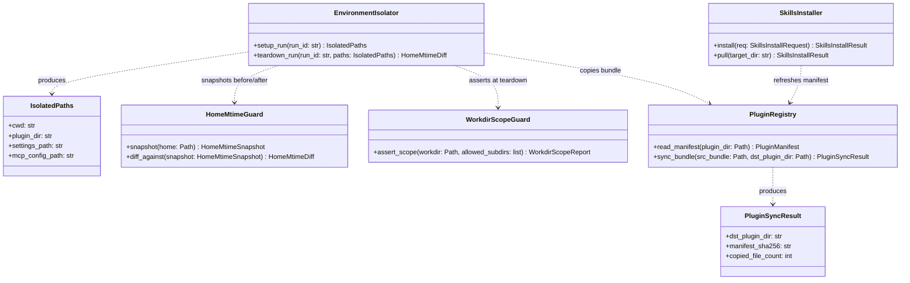
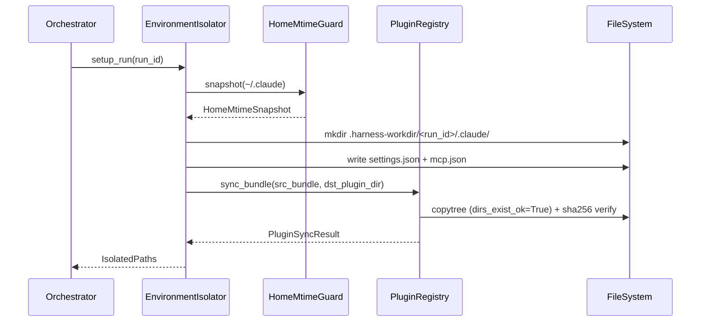
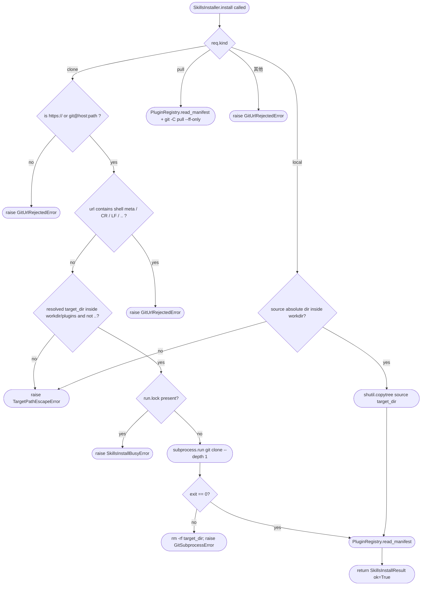

# Feature Detailed Design：F10 · Environment Isolation & Skills Installer（Feature #3）

**Date**: 2026-04-24
**Feature**: #3 — F10 · Environment Isolation & Skills Installer
**Priority**: high
**Dependencies**: [1] F01 · App Shell & Platform Bootstrap（已 passing；提供 `ConfigStore`、`FirstRunWizard` 建好 `~/.harness/`、FastAPI `app` 实例、`ClaudeAuthDetector` 的 "read-only subprocess" 先例）
**Design Reference**: docs/plans/2026-04-21-harness-design.md §4.10（+ §3.5 NFR-009 映射 · §6.1.1 Claude CLI 隔离 env · §6.1.5 IFR-005 git CLI · §6.2 IAPI-017 / IAPI-018 · §12 OQ-D2）
**SRS Reference**: FR-043、FR-044、FR-045、NFR-009

---

## Context

F10 是 Harness "**不污染用户 `~/.claude/`**"（CON-007 / NFR-009）与"**只写目标 workdir 下 `.harness/` 子树**"（FR-044 / NFR-006）两条核心合规承诺的**唯一实施点**。它在每次 run 启动时为下游 Tool Adapter（F03/F05）与 Orchestrator（F06）铸造一个**每 run 独立**的隔离目录树 `.harness-workdir/<run-id>/.claude/{settings.json, mcp.json, plugins/longtaskforagent}`（其中 `plugins/longtaskforagent` 是源 bundle 的**物理复制副本**，单路径实现，不按平台分支），并把它打包成 `IsolatedPaths` 契约对象交给调用方（IAPI-017）；同时它把`~/.claude/` mtime snapshot/diff 与 workdir scope guard 作为**运行时断言**钩在 run 生命周期两端，使 NFR-009 / FR-044 变成可度量而非"信仰"。另外暴露 `POST /api/skills/install|pull` REST（IAPI-018）供 F15 Settings 页面手工触发 `git clone` / `git -C ... pull` 更新插件包 —— v1 不自动更新（CON-005 反面断言）。

---

## Design Alignment

> 完整复制自 docs/plans/2026-04-21-harness-design.md §4.10（Overview / Key Types / Integration Surface）。

**4.10.1 Overview**：`.harness-workdir/<run-id>/.claude/` 隔离目录生成 + **物理复制** plugin bundle（取代原 symlink / junction 方案）+ `~/.claude/` 零写断言 + Skills 手动 git。满足 FR-043/044/045 + NFR-009。

> **Design Deviation（2026-04-24 用户裁决）**：主 Design `docs/plans/2026-04-21-harness-design.md` §4.10.1 描述的 "symlink plugin bundle"（line 505）与 §3.5 "Adapter env 隔离 + mtime snapshot 断言"（line 287）在 plugin bundle 落地形态上与本特性设计不一致。用户于 2026-04-24 裁决采用**物理复制**方案（单路径，不分平台），原因：`os.symlink` 在 Windows 非管理员/非 dev 模式下抛 `WinError 1314`，v1 分发会崩；directory junction 虽可用但引入平台分支与测试复杂度。**建议后续通过 `long-task-increment` 回填到主 Design §4.10**，同时检查 CON-005「run 期间 plugins/longtaskforagent/ mtime 不变」的 ATS 反面断言：复制后**源 bundle** mtime 不变仍满足 CON-005（源未被触碰），但需明确 `PluginRegistry` 目标目录（`.harness-workdir/<run-id>/.claude/plugins/longtaskforagent/`，拷贝副本）允许在 Skills Installer 触发时 mtime 变化——该目标路径是 SkillsInstaller 外的独立每-run 临时路径，CON-005 反面断言对其不适用。

**4.10.2 Key Types**
- `harness.env.EnvironmentIsolator`
- `harness.env.IsolatedPaths`（cwd / plugin_dir / settings_path / mcp_config_path）
- `harness.env.HomeMtimeGuard`
- `harness.env.WorkdirScopeGuard`
- `harness.skills.SkillsInstaller`
- `harness.skills.PluginRegistry`

**4.10.3 Integration Surface**
- **Provides**：隔离路径 → F03/F05/F06；安装 API → F15
- **Requires**：git CLI（IFR-005）

| 方向 | Consumer / Provider | Contract ID | Endpoint | Schema |
|---|---|---|---|---|
| Provides | F03/F05/F06 | IAPI-017 | `EnvironmentIsolator.setup_run(run_id)` | `IsolatedPaths` |
| Provides | F15 | IAPI-018 | REST `POST /api/skills/install` / `/pull` | `SkillsInstallRequest` |
| Requires | IFR-005 | 外部 | git subprocess | — |

**Provides / Requires**（汇总）：
- 向 F03/F05/F06 提供隔离路径（IAPI-017，schema `IsolatedPaths`）
- 向 F15 提供 Skills REST（IAPI-018，schema `SkillsInstallRequest` / `SkillsInstallResult`）
- 依赖 IFR-005 `git` CLI subprocess（clone / `-C ... pull --ff-only`）
- 依赖 F01 的 `ConfigStore` 解析 `HARNESS_HOME` / `HARNESS_WORKDIR`（不写 `~/.harness/`，只读）

**Deviations**：无 —— §4 IAPI-017 / IAPI-018 schema 可直接承载；参见 §Interface Contract "跨特性契约对齐" 注。

**UML 嵌入**（按 feature-design-execution §2a 触发判据）：

类图（≥2 类协作：`EnvironmentIsolator` 同 `HomeMtimeGuard` / `WorkdirScopeGuard` / `SkillsInstaller` / `PluginRegistry` 协作，IsolatedPaths 作为 Provider 的返回契约）：

时序图（≥2 对象协作的 run 启动顺序，对应 INT-002 **Run Start 流**）：

---

## SRS Requirement

> 完整复制自 docs/plans/2026-04-21-harness-srs.md §5 K.

### FR-043: 不写入用户 ~/.claude/
**优先级**: Must
**EARS**: While Harness 运行, the system shall 不写入用户 `~/.claude/` 目录；所有临时 Claude 配置放于 `.harness-workdir/<run-id>/.claude/{settings.json, mcp.json, plugins/longtaskforagent(symlink)}`。
**可视化输出**: N/A — backend-only（SystemSettings 展示隔离目录路径）
**验收准则**:
- Given Harness 启动一次 run，when 检查 `~/.claude/`，then 其内容未被修改（mtime 保持）
- Given symlink 指向 bundle，when CLI 读 plugin，then 能正常加载
**来源**: raw_requirements K.43

> **F10 实现说明**（2026-04-24 用户裁决）：上述 EARS / AC-2 中的 "symlink" 字面在本 feature 内改为**物理复制**（`shutil.copytree`）实现。验收**语义等价**：副本下的 `plugins/longtaskforagent/.claude-plugin/plugin.json` 存在且可被 CLI 加载，且 sha256 等于源。差异记录见 §Design Alignment · Design Deviation，建议后续 `long-task-increment` 回填 SRS 原文。

### FR-044: workdir 只读写 .harness/ 子目录
**优先级**: Must
**EARS**: While Harness 运行, the system shall 保持目标项目 workdir 原样，仅读写项目内 `.harness/` 子目录（SQLite、audit logs、ticket 原始流存档）。
**可视化输出**: N/A — backend-only
**验收准则**:
- Given 一次 run 结束，when 对比 workdir 的 non-.harness 文件，then 未出现 Harness 的临时文件（除非 skill 自身写的文件）
**来源**: raw_requirements K.44

### FR-045: Skills 快速安装 / 手动更新
**优先级**: Must
**EARS**: The system shall 在 UI "Skills 管理" 页面支持指向本地目录或 git repo URL 并点击按钮执行 `git clone` 或 `git pull` 将 longtaskforagent 副本更新到 `plugins/longtaskforagent/`；不做自动更新。
**可视化输出**: 页面显示当前版本 + 来源 + Pull/Clone 按钮。
**验收准则**:
- Given 指向 git URL，when 点击 Clone，then 目录生成且 UI 显示 commit sha
- Given 本地目录已经存在，when 点击 Pull，then 执行 `git -C ... pull` 并显示结果
**来源**: raw_requirements K.45

### NFR-009: Security — Integrity · Harness 运行不写入 ~/.claude/
**阈值**: 一次完整 run 后 `~/.claude/` 所有文件 mtime 无变化
**验证**: `stat` 前后对比（FR-043 共轨）

---

## Interface Contract

| Method | Signature | Preconditions | Postconditions | Raises |
|--------|-----------|---------------|----------------|--------|
| `EnvironmentIsolator.setup_run` | `setup_run(run_id: str, *, workdir: Path, bundle_root: Path, home_dir: Path \| None = None) -> IsolatedPaths` | `run_id` 非空且匹配 `^[A-Za-z0-9_-]{1,64}$`；`workdir` 是已存在的绝对目录；`bundle_root` 指向含 `.claude-plugin/plugin.json` 的本地包；`home_dir` 若给则绝对路径（测试注入）；**无并发调用相同 `run_id`** | 返回 `IsolatedPaths(cwd=<workdir>, plugin_dir=<isolated>/.claude/plugins, settings_path=<isolated>/.claude/settings.json, mcp_config_path=<isolated>/.claude/mcp.json)`；`<isolated>=<workdir>/.harness-workdir/<run_id>`；`<isolated>/.claude/` 已创建，权限 `0o700`（POSIX）；`settings.json` / `mcp.json` 已落盘（合法 JSON，UTF-8，`\n` 结尾）；`plugins/longtaskforagent` 是 `bundle_root` 的**物理复制副本**（`shutil.copytree(..., dirs_exist_ok=True)` 等价语义，单路径，不按平台分支），副本根目录下 `.claude-plugin/plugin.json` 的 sha256 **等于** `bundle_root/.claude-plugin/plugin.json` 的 sha256；`~/.claude/` 下**零写入**（由 `HomeMtimeGuard.snapshot` 在 setup 起始记录） | `RunIdInvalidError`（非法 `run_id`）；`WorkdirNotFoundError`（workdir 不存在）；`BundleNotFoundError`（bundle 缺 `.claude-plugin/plugin.json`）；`IsolationSetupError`（mkdir/write/copytree 任一失败；消息含失败路径）；`HomeWriteDetectedError`（snapshot 已就位后发现 `~/.claude/` 被动 mtime 变化；仅当 `HomeMtimeGuard` 协同启用）|
| `EnvironmentIsolator.teardown_run` | `teardown_run(run_id: str, paths: IsolatedPaths) -> HomeMtimeDiff` | `setup_run(run_id)` 已返回过且未被调用过 teardown；`paths.cwd` 仍存在 | 返回 `HomeMtimeDiff(changed_files=[], untouched_files_count=N, ok=True)`，`changed_files` 为空 list（NFR-009 成立）；对 run 产物（`<isolated>/.claude/`）**保留不删**（供取证）；当 `ok=False` 时 `changed_files` 非空且 `HomeMtimeGuard.diff_against` 明确列出差异文件 + 新旧 mtime（epoch float） | `TeardownError`（未见对应 setup snapshot）|
| `HomeMtimeGuard.snapshot` | `snapshot(home: Path, *, follow_symlinks: bool = False) -> HomeMtimeSnapshot` | `home` 是目录或不存在（不存在时返回空 snapshot）；`follow_symlinks=False` 是默认 | 返回 `HomeMtimeSnapshot(root=home, entries={rel_path: mtime_ns, ...})`；递归遍历 `home` 下所有 **regular file**（不随 symlink 出路径）；mtime 用 `os.stat_result.st_mtime_ns`（纳秒级，避开 1s 精度吞并） | `HomeSnapshotError`（I/O 错误，消息含失败路径）|
| `HomeMtimeGuard.diff_against` | `diff_against(before: HomeMtimeSnapshot, *, now: HomeMtimeSnapshot \| None = None) -> HomeMtimeDiff` | `before` 由 `snapshot` 产生；`now` 默认当场 re-snapshot | 返回 `HomeMtimeDiff(changed_files: list[HomeMtimeChange], added_files: list[str], removed_files: list[str], ok: bool)`；`ok=True` ⇔ `changed + added + removed` 三者均为空 list（NFR-009 断言语义） | — |
| `WorkdirScopeGuard.assert_scope` | `assert_scope(workdir: Path, *, before: set[str], after: set[str] \| None = None, allowed_subdirs: frozenset[str] = frozenset({".harness", ".harness-workdir"})) -> WorkdirScopeReport` | `workdir` 已存在；`before` 是 setup 前 `os.listdir(workdir)` + 递归结果的快照（相对路径集合）；`after` 默认现场扫描 | 返回 `WorkdirScopeReport(unexpected_new: list[str], ok: bool)`；`unexpected_new` = `(after - before)` 过滤掉 `allowed_subdirs` 开头的路径；`ok=True` ⇔ `unexpected_new == []`（FR-044 断言语义） | `WorkdirScopeError`（I/O 错误）|
| `SkillsInstaller.install` | `install(req: SkillsInstallRequest, *, workdir: Path) -> SkillsInstallResult` | `req.kind in {"clone","pull","local"}`；`req.source` 非空；若 `kind="clone"` 则 `source` 通过 `_is_git_url_allowed`（白名单：`https://`、`git@...:...`，拒 `file://` / 任意 shell meta / 非 ASCII 控制符 / `../`）；若 `kind="local"` 则 `source` 是**已存在且绝对**的目录且通过 `_is_inside(workdir)`；`req.target_dir` 不以 `..` 开头且规范化后位于 `workdir / "plugins"` 下 | 返回 `SkillsInstallResult(ok=True, commit_sha=<40-hex>, message=<zh summary>)`；target_dir 下含 `.claude-plugin/plugin.json`；当 `kind="clone"` 失败（git exit≠0）→ 不留半截目录（回滚清理）；**run 期间调用被拒绝**（由 orchestrator 协同，install 本身会检查 `~/.harness/run.lock` 占用并抛 `SkillsInstallBusyError`） | `GitUrlRejectedError`（400 → REST 呈现）；`TargetPathEscapeError`；`GitSubprocessError`（409 → stderr tail 透传）；`SkillsInstallBusyError`（409）|
| `SkillsInstaller.pull` | `pull(target_dir: str, *, workdir: Path) -> SkillsInstallResult` | `target_dir` 在 `workdir/plugins/` 下且含 `.git/`；run 未运行 | 返回 `SkillsInstallResult(ok=True, commit_sha=<40-hex>, message=<zh>)`；底层 `git -C <target_dir> pull --ff-only` 成功；失败时 `ok=False` 且 `message` 含 `stderr tail`（不回滚，保持 ff-only 语义） | `TargetPathEscapeError`；`GitSubprocessError`；`SkillsInstallBusyError` |
| `PluginRegistry.read_manifest` | `read_manifest(plugin_dir: Path) -> PluginManifest` | `plugin_dir` 存在且含 `.claude-plugin/plugin.json`；`plugin.json` ≤ 64 KiB 合法 UTF-8 | 返回 `PluginManifest(name: str, version: str, commit_sha: str \| None)`；`commit_sha` 在 `plugin_dir/.git` 存在时通过 `git -C <plugin_dir> rev-parse HEAD` 填充，否则 `None` | `PluginManifestMissingError`；`PluginManifestCorruptError`（JSON/schema 不合法）|
| `PluginRegistry.sync_bundle` | `sync_bundle(src_bundle: Path, dst_plugin_dir: Path) -> PluginSyncResult` | `src_bundle` 是已存在目录且含 `.claude-plugin/plugin.json`；`dst_plugin_dir` 的父目录已存在且可写；两者为绝对路径；`src_bundle` 与 `dst_plugin_dir` 不互为前缀（禁止自嵌套拷贝） | **幂等物理复制**：`dst_plugin_dir` 下的文件树与 `src_bundle` 一致（`shutil.copytree(src_bundle, dst_plugin_dir, dirs_exist_ok=True)` 等价语义，单路径，不按 `sys.platform` 分支）；返回 `PluginSyncResult(dst_plugin_dir=str(dst_plugin_dir), manifest_sha256=<hex>, copied_file_count=N)`，其中 `manifest_sha256` = `sha256(dst_plugin_dir/.claude-plugin/plugin.json 字节)` **且** `== sha256(src_bundle/.claude-plugin/plugin.json 字节)`；连续两次调用（同参数）第二次**不抛错**且结果等价（幂等）；调用不触碰 `src_bundle`（源 mtime 不变，满足 CON-005 源侧约束） | `BundleSyncError`（`copytree` 失败，消息含失败路径 + stderr / OSError）|

**Design rationale**（非显见决策一行一条）：
- **纳秒级 mtime 比对**：`st_mtime` 在 EXT4/APFS/NTFS 默认 1s 精度；NFR-009 "mtime 无变化" 在同一秒内写入会被吞并从而漏检 → 必须用 `st_mtime_ns`。
- **POSIX `0o700` 严格权限**：`IsolatedPaths.cwd` 下有 `settings.json` 可能引用 keyring service name 与 API key ref；默认 `umask 022` 会使其他用户可读。继承 F01 `FirstRunWizard` 对 `~/.harness/` 的 `0o700` 约定。
- **单路径物理复制（取代 symlink / junction）**：用户 2026-04-24 裁决（见 §Clarification Addendum · ASM-F10-WIN-JUNCTION REVISED）：不使用 `os.symlink` 或 Windows directory junction（`mklink /J`），改为 `shutil.copytree(..., dirs_exist_ok=True)` 物理复制。理由：`os.symlink` 在 Windows 非管理员/非 developer-mode 场景抛 `WinError 1314`（v1 分发会崩）；junction 虽可用，但引入 `sys.platform` 分支与 `fsutil reparsepoint` 等平台专属测试，测试复杂度与跨平台风险大。物理复制代价：每 run 增加一次 bundle（预计 < 5 MB，文件数 O(10²)）的 `copytree`（预估 < 200 ms 典型本地 SSD），属于可接受开销；副本在 run 结束后保留于 `.harness-workdir/<run_id>/`，供事后取证。对 Claude Code CLI 等枚举 `plugins/` 的下游应用完全透明。
- **`CLAUDE_CONFIG_DIR` 为首选 env，`HOME` 双保险**：OQ-D2 延 F03 PoC 决定；在 F10 侧，`setup_run` 的产出 `IsolatedPaths` 本身**不关心** adapter 最终用哪个 env（F03 职责），只保证 `<isolated>/.claude/` 存在且 settings/mcp 就绪。Test Inventory 的 mtime 断言（IntG/NFR-009 类）在任一策略下都成立。参见 **Clarification Addendum · ASM-F10-ENV-OQD2**。
- **跨特性契约对齐**：
  - **IAPI-017**（Provider）：`setup_run` 的返回 schema 必须 = Design §6.2.4 `IsolatedPaths { cwd: str, plugin_dir: str, settings_path: str, mcp_config_path: str | None }`。postcondition 逐字对齐（`mcp_config_path` 在本设计总是非 None，保守起见 schema 保留 `| None` 以兼容将来禁 MCP 的分支）。
  - **IAPI-018**（Provider）：`install` / `pull` 的 REST 层（§REST 映射见 §Implementation Summary）消费 `SkillsInstallRequest { kind, source, target_dir }` 并返回 `SkillsInstallResult { ok, commit_sha, message }`，HTTP 400/409/500 错误码映射到上面 `Raises` 列出的异常。
  - **IFR-005**（Consumer）：git 命令集 `clone / pull --ff-only` 与 Design §6.1.5 命令清单一致；SEC 层按 §2.3 ATS 要求 "git URL 仅 https / git+ssh 白名单"。

---

## Visual Rendering Contract

> N/A — `"ui": false`（feature-list.json#3）。F10 提供后端 REST（IAPI-018）给 F15 Settings 页渲染；本特性本身不产生 DOM/Canvas。视觉渲染契约由 F15 承载。

---

## Implementation Summary

**主要模块与文件**。新建 `harness/env/` 包：`harness/env/__init__.py` 导出 `EnvironmentIsolator` / `IsolatedPaths` / `HomeMtimeGuard` / `HomeMtimeSnapshot` / `HomeMtimeDiff` / `WorkdirScopeGuard` / `WorkdirScopeReport` + 各异常；核心实现分 `harness/env/isolator.py`（`EnvironmentIsolator` 编排层）、`harness/env/home_guard.py`（`HomeMtimeGuard` + `WorkdirScopeGuard`）。新建 `harness/skills/` 包：`harness/skills/__init__.py` 导出 `SkillsInstaller` / `SkillsInstallRequest` / `SkillsInstallResult` / `PluginRegistry` / `PluginManifest` / `PluginSyncResult` + 异常；`harness/skills/installer.py`（subprocess + git）、`harness/skills/registry.py`（manifest + **物理复制**实现：`sync_bundle` 内调 `shutil.copytree(src, dst, dirs_exist_ok=True)` + sha256 校验，**不**按 `sys.platform` 分支）。REST 层加 `harness/api/skills.py` —— 在 F01 的 `harness/api/__init__.py` 的 `app` 上 `include_router(router)`；两条路由 `POST /api/skills/install` 与 `POST /api/skills/pull`，pydantic schema 直接 import 自 `harness.skills`。所有模块沿用 F01/F02 的 `from __future__ import annotations` + pydantic v2 `ConfigDict(extra="forbid")` 风格。

**运行时调用链**。
(1) **setup 链**：`Orchestrator.start_run()` → `EnvironmentIsolator.setup_run(run_id, workdir, bundle_root=<frozen>)` → `HomeMtimeGuard.snapshot(~/.claude)` 存入实例状态 → 创建 `<workdir>/.harness-workdir/<run_id>/.claude/{plugins,.}`（`mkdir parents=True, mode=0o700`）→ 写 `settings.json`（固定 JSON：`{"permissions":{"allow":[],"deny":[]}}` 占位 + `"paths":{"plugins":"./plugins"}`）与 `mcp.json`（空 `{"servers":{}}`）→ `PluginRegistry.sync_bundle(src_bundle=bundle_root, dst_plugin_dir=<isolated>/.claude/plugins/longtaskforagent)`（`shutil.copytree(..., dirs_exist_ok=True)` 幂等物理复制 + sha256 校验，不分平台）→ 返回 `IsolatedPaths`；
(2) **teardown 链**：Orchestrator 在 run 终结（成功 / 失败 / 取消）统一调 `EnvironmentIsolator.teardown_run(run_id, paths)` → `HomeMtimeGuard.diff_against(before_snapshot)` → `WorkdirScopeGuard.assert_scope(workdir, before=setup_before_set)` → 合并两份 report 写入 audit `env.teardown`（F02 `AuditWriter.append_raw` —— F02 新增的 **sync** 变体，见 §Existing Code Reuse 注，复用理由详述于该表条目。原 `AuditWriter.append` 是 `async` 且强制要求 `AuditEvent{ticket_id, state_transition}` schema，F10 事件不含 `ticket_id` 亦不属 state transition，故扩展一个 sync 方法 `append_raw(run_id, kind, payload, ts)` 写同格式 JSONL 行，语义等价、非破坏性扩展）；
(3) **Skills REST 链**：FastAPI `POST /api/skills/install` → 解析 `SkillsInstallRequest` → 若 `kind=="clone"`：`_is_git_url_allowed(source)` 否则返 400 → `asyncio.to_thread(subprocess.run, ["git","clone","--depth","1","--","<source>","<target_dir>"], check=False, capture_output=True, timeout=120)` → exit≠0 返 409 + stderr tail；成功则 `PluginRegistry.read_manifest` 取 sha 封装 `SkillsInstallResult`；`kind=="pull"`：同路径调 `git -C <target> pull --ff-only`；`kind=="local"`：校验 `_is_inside(workdir)` 后做目录拷贝（`shutil.copytree`，`dirs_exist_ok=False`，若 target 已存在返 409）。每条路径最后再 `PluginRegistry.read_manifest` 刷新 `commit_sha`。

**关键设计决策与非显见约束**。(a) `HomeMtimeGuard` 不使用 `watchdog`，改用"前后 stat 全量遍历"—— run 粒度内单次 `~/.claude/` 扫描量 < 200 文件，成本可接受；`watchdog` 会在守护线程常驻并自身访问目录（`os.scandir` + inotify），反而引入"守护过程碰过 `~/.claude`"的测试反例。(b) `subprocess.run` 而非 `asyncio.create_subprocess_exec`：Skills REST 本身是 user-initiated 一次性动作（< 120s），且 FastAPI handler 用 `asyncio.to_thread` 包裹即可避免阻塞事件循环；避开 asyncio pty 在 Windows 上的 `NotImplementedError` 面。(c) Path traversal 防护走**双层**：`Path.resolve(strict=False).is_relative_to(workdir/"plugins")` + `source != workdir/"plugins"` + `".." not in req.target_dir`；SEC 测试覆盖"URL 前缀绕过"（如 `https://legit.com/..@evil.com`）。(d) `SkillsInstaller` 的 `run.lock` 感知复用 F01 `~/.harness/` 现有状态文件——install/pull 期间检查 `<workdir>/.harness/run.lock`（filelock 由 F06 写）存在则 409，不与 run 竞争。(e) `bundle_root` 来源 = 在 PyInstaller 冻结态下为 `sys._MEIPASS / "plugins" / "longtaskforagent"`，开发态为仓库根 `plugins/longtaskforagent`（若缺席则允许 `setup_run` 在 `bundle_root=None` 时**直接报错**——缺少静态 bundle 是严重配置错，需要人工 clone）。(f) `WorkdirScopeGuard` 的 `before` 快照必须是"**绝对相对**"路径字符串 set（如 `{"README.md", "src/main.py"}`），且过滤时用 `path.startswith(".harness/")` / `path.startswith(".harness-workdir/")` 字典序，不做 `Path.is_relative_to` 以兼容 str 快照（性能与跨平台）。

**`flowchart TD`**（`_is_git_url_allowed` + target_dir 校验含 ≥3 决策分支，按 §2a 触发）：

**遗留 / 存量代码交互点**。(1) 复用 F01 `harness.config.ConfigStore.default_path()` 解析 `HARNESS_HOME`（读取而非写入），从而拿到 "用户真实 `~/.harness/`"（仅用于定位 skills install 允许写入的 `workdir` 如何通过环境确定）。(2) 复用 F01 `harness.auth.ClaudeAuthDetector` 的 "read-only subprocess" pattern：`ClaudeAuthDetector.detect()` 已证明在 `shutil.which` + `subprocess.run(capture_output=True, text=True, timeout=5)` 前提下不写 `~/.claude/`（代码注释锚定 NFR-009 / CON-007），`SkillsInstaller` 的 git 调用沿用同一 pattern（无 `shell=True`，argv 列表，timeout，capture_output）。(3) 复用 F02 `harness.persistence.AuditWriter.append` 记录 `env.setup` / `env.teardown` / `skills.install` 三类事件；事件字段借用 F02 `AuditEvent` schema（`kind, ts, payload`）。(4) REST 层挂在 F01 已定义的 `harness.api.app`（FastAPI 实例）——沿用 `router = APIRouter(prefix="/api/skills")`；不在 F10 重复实例化 app。(5) `env-guide.md §4`（greenfield 空白）→ 无强制内部库限制、无禁用 API、无命名约定限制；但我们仍显式沿用现有命名（`xxx_gateway` / `xxx_store` / `xxx_registry`）以保持一致。

**§4 Internal API Contract 集成**。作为 **IAPI-017 Provider**：`EnvironmentIsolator.setup_run` 返回 `IsolatedPaths`（字段完全匹配 Design §6.2.4 pydantic schema）；F03 `ClaudeCodeAdapter` / F05 `OpenCodeAdapter` 将在构造 `DispatchSpec` 时直接消费 `IsolatedPaths.cwd / plugin_dir / settings_path / mcp_config_path`（`harness.domain.DispatchSpec` 字段 `cwd / plugin_dir / settings_path / mcp_config` 已预留——见"复用"表）。作为 **IAPI-018 Provider**：REST route `POST /api/skills/{install|pull}` 的 request/response schema 直接是 `SkillsInstallRequest` / `SkillsInstallResult`（Design §6.2.4 节选）；error 映射 400/409 由 FastAPI `HTTPException(detail=...)` 携带 stderr tail 串。作为 **IFR-005 Consumer**：git 命令 argv 列表化，不拼接 shell，符合 §6.1.5 故障模式 "clone/pull 失败 → `/api/skills/install` 409 + stderr tail"。

### Boundary Conditions

| Parameter | Min | Max | Empty/Null | At boundary |
|-----------|-----|-----|------------|-------------|
| `setup_run.run_id` | 1 字符 | 64 字符 | 空串 → `RunIdInvalidError` | 65 字符 → `RunIdInvalidError`；64 字符（纯合法）→ 通过 |
| `setup_run.run_id` 字符集 | `[A-Za-z0-9_-]` | 同左 | 含 `/` / `\` / `..` / 空格 / 非 ASCII → `RunIdInvalidError` | 仅 `_-` 边缘 → 通过 |
| `setup_run.workdir` | 已存在绝对目录 | — | 不存在 / 不是目录 / 相对路径 → `WorkdirNotFoundError` | 只读目录（无写入权限）→ `IsolationSetupError` 由 mkdir 失败触发 |
| `setup_run.bundle_root` | 绝对目录 + 含 `.claude-plugin/plugin.json` | — | 缺失 / 缺 manifest → `BundleNotFoundError` | manifest 存在但零字节 → `PluginManifestCorruptError`（由 `read_manifest` 抛） |
| `SkillsInstallRequest.source`（clone） | `https://` 或 `git@host:path` 且无 shell meta / `\r` / `\n` / `..` | 2048 字符 | 空 / `file://...` / `ftp://` / `javascript:` → `GitUrlRejectedError` | 恰 2048 通过；2049 拒；含 `@evil.com` 在 URL userinfo 段视实现而定 → 按白名单 `urllib.parse.urlparse.hostname` 严格比对 |
| `SkillsInstallRequest.target_dir` | 以 `plugins/` 开头的相对路径 | — | 空 → 默认 `"plugins/longtaskforagent"`；`..`、绝对路径、指向 `plugins/` 外 → `TargetPathEscapeError` | 路径规范化后恰等于 `plugins/` 根 → 拒（必须有子目录名） |
| `HomeMtimeGuard.snapshot.home` | 目录或不存在 | — | 不存在 → 返回空 snapshot | `home` 内含符号链接环 → `follow_symlinks=False` 默认避免穿透 |
| `PluginRegistry.read_manifest.plugin.json` | 1 字节合法 JSON | 64 KiB | 缺失 → `PluginManifestMissingError`；零字节 → `PluginManifestCorruptError` | 64 KiB + 1 → `PluginManifestCorruptError`（显式上限避免 DoS） |
| `PluginRegistry.sync_bundle.src_bundle` | 含 `.claude-plugin/plugin.json` 的绝对目录 | — | 不存在 / 不是目录 / 缺 manifest → `BundleNotFoundError`（由 `setup_run` 前置校验）；与 `dst_plugin_dir` 互为前缀 → `BundleSyncError` | 同参数重复调用 → 幂等，第二次不抛错 |

### Existing Code Reuse

| Existing Symbol | Location (file:line) | Reused Because |
|-----------------|---------------------|----------------|
| `harness.config.ConfigStore.default_path` | `harness/config/store.py:63` | 解析 `HARNESS_HOME` env（empty-string 当 unset）的正规入口，用于**读**（不写）确认用户 `~/.harness/` 位置，从而帮助定位 workdir / audit 落盘目录；直接复用避免重新实现 env var 解析。|
| `harness.domain.DispatchSpec` | `harness/domain/ticket.py:69` | 已定义 `cwd / plugin_dir / settings_path / mcp_config` 四字段（与 `IsolatedPaths` 契约 100% 同构）；F03 构造 DispatchSpec 时直接读 `IsolatedPaths`，无需在 F10 侧镜像。 |
| `harness.persistence.AuditWriter.append` + 新增 `.append_raw` (IAPI-009 扩展) | `harness/persistence/audit.py`（F02 导出；`append_raw` 由 F10 追加） | F10 `env.setup` / `env.teardown` / `skills.install` 事件应写入 audit JSONL；直接复用 F02 append-only writer，避免再造一份写盘逻辑。**原 `append` 是 `async` 且强制 `AuditEvent` schema（含 `ticket_id` + state transition），F10 事件不适配**；因此在 F02 上做**非破坏性扩展**：新增 `append_raw(run_id, kind, payload, ts)` 同步方法，复用同一 `os.open(O_APPEND\|O_WRONLY\|O_CREAT)+os.write+fsync` 底层语义（含 `IoError` 包装与 `structlog.error` degradation 日志），仅绕过 `AuditEvent` 的 `ticket_id` / 状态约束。不修改 `append`；原 F02 调用方向前兼容。 |
| `harness.api.app`（FastAPI 实例） | `harness/api/__init__.py:21` | REST `POST /api/skills/...` 挂到既有 app 上（`include_router`）；避免二次实例化 FastAPI。 |
| `harness.auth.ClaudeAuthDetector` 的 subprocess 模式 | `harness/auth/claude_detector.py:54-106` | "无 shell=True / argv 列表 / timeout / capture_output / OSError 吸收成业务错误"的 IFR-001 先例；`SkillsInstaller.install/pull` 沿用同一 git subprocess 调用 pattern。|
| `shutil.copytree` (Python 标准库) | Python stdlib（Python ≥ 3.8 支持 `dirs_exist_ok=True`） | `PluginRegistry.sync_bundle` 的**物理复制**核心直接复用 stdlib；`dirs_exist_ok=True` 提供幂等语义；跨平台单路径实现，无需自建 fs 工具。Skills Installer `kind="local"` 分支已使用同一 API（见 Implementation Summary），复用一致。|
| `hashlib.sha256` (Python 标准库) | Python stdlib | `sync_bundle` 校验 `plugin.json` 副本 sha256 == 源 sha256；标准库直接可用，无需外部依赖。|

> 搜索关键字：`EnvironmentIsolator`、`IsolatedPaths`、`HomeMtimeGuard`、`WorkdirScopeGuard`、`SkillsInstaller`、`PluginRegistry`、`PluginSyncResult`、`CLAUDE_CONFIG_DIR`、`.harness-workdir`、`subprocess.run(["git"`、`shutil.copytree`。前 7 个符号在当前代码库 0 匹配（本特性为 greenfield 实现这些类）；其余为复用候选，见上表。

---

## Test Inventory

| ID | Category | Traces To | Input / Setup | Expected | Kills Which Bug? |
|----|----------|-----------|---------------|----------|-----------------|
| T01 | FUNC/happy | FR-043 AC-1 · §Interface Contract `setup_run` postcond · §Design Alignment seq msg#1-6 | 合法 `run_id`、tmp `workdir` 绝对目录、`bundle_root` 含合法 `.claude-plugin/plugin.json`；调用 `setup_run(run_id, workdir, bundle_root)` | 返回 `IsolatedPaths(cwd=<workdir>, plugin_dir=<workdir>/.harness-workdir/<run_id>/.claude/plugins, settings_path=<.../settings.json>, mcp_config_path=<.../mcp.json>)`；`<isolated>/.claude/settings.json` 存在且含 `permissions` key；`plugins/longtaskforagent` 是 `bundle_root` 的**物理复制副本**（`.claude-plugin/plugin.json` 存在且不是 symlink，`Path.is_symlink() == False`）；**`~/.claude/` 下 mtime 快照 diff 为空** | setup 链漏步 / IsolatedPaths 字段拼错 / copytree 未执行 |
| T02 | FUNC/happy | FR-043 AC-2 · §Design Alignment classDiagram (PluginRegistry) · §Interface Contract `sync_bundle` postcond | setup_run 后，读取 `<isolated>/.claude/plugins/longtaskforagent/.claude-plugin/plugin.json` 字节并计算 sha256；单独计算 `bundle_root/.claude-plugin/plugin.json` 字节的 sha256 | `(<isolated>/.claude/plugins/longtaskforagent / ".claude-plugin/plugin.json").exists() == True`；副本 sha256 **==** 源 sha256；`Path.is_symlink()` 在副本根目录返回 `False`（物理复制而非链接）；Claude Code CLI 以副本为工作目录能解析 plugin.json | 复制漂移（sha 不一致）/ 错当 symlink 创建 / 缺文件 |
| T03 | FUNC/happy | FR-044 AC-1 · §Interface Contract `assert_scope` postcond | setup + 模拟 "skill 自写" 在 `<workdir>/src/foo.py` 新增；teardown 时 `WorkdirScopeGuard.assert_scope(before=set1, after=set2)` | `unexpected_new == []` 且 `ok == True`；Harness 没有往 workdir 非 `.harness/` 目录写入**自己的**文件 | Harness 意外往 workdir 根写 tmp 文件而未被发现 |
| T04 | FUNC/happy | FR-045 AC-1 · §Interface Contract `install` postcond · §Implementation Summary flow branch#Clone-ok | mock `subprocess.run` 模拟 `git clone` 成功 + 在 target_dir 创建 `.claude-plugin/plugin.json` + `.git/` 存根；`req=SkillsInstallRequest(kind="clone", source="https://github.com/org/ltfa.git", target_dir="plugins/longtaskforagent")` | 返回 `SkillsInstallResult(ok=True, commit_sha=<40 hex>, message=含中文摘要)`；subprocess argv 首段 `["git","clone","--depth","1","--","https://..."]`；`shell=True` 不出现 | git argv 拼接错 / shell=True 漏洞 / commit_sha 未刷新 |
| T05 | FUNC/happy | FR-045 AC-2 · §Implementation Summary flow branch#pull | tmp 本地 git repo 作 target（init + commit）；`pull(target_dir)` 参数；mock `git -C pull --ff-only` 返 `Already up to date.` | `SkillsInstallResult(ok=True, commit_sha=<既有 HEAD sha>, message)`；argv = `["git","-C",target,"pull","--ff-only"]` | pull 走了 `git pull`（无 --ff-only）或忘记 `-C` |
| T06 | FUNC/happy | NFR-009 + §Interface Contract `teardown_run` | 一个完整 setup → teardown 周期，期间 **不**触碰 `~/.claude/`；fixture 注入 `home_dir=tmp/.claude` 并预埋 3 个文件 | `teardown_run` 返 `HomeMtimeDiff(changed_files=[], added_files=[], removed_files=[], ok=True)` | setup/teardown 过程中 Harness 本身意外写 `~/.claude/` |
| T07 | FUNC/error | §Interface Contract `Raises: RunIdInvalidError` · §Boundary "run_id 字符集" | `setup_run(run_id="../../evil", workdir, bundle_root)` | 抛 `RunIdInvalidError`，错误消息含 "invalid run_id"；`<workdir>/.harness-workdir/` 下**不**新建任何目录 | 漏 run_id 校验导致路径穿越 |
| T08 | FUNC/error | §Interface Contract `Raises: WorkdirNotFoundError` | `setup_run("r1", workdir=Path("/nope/does/not/exist"), bundle_root)` | 抛 `WorkdirNotFoundError` | 错把不存在目录当成"创建即可"而静默通过 |
| T09 | FUNC/error | §Interface Contract `Raises: BundleNotFoundError` | `setup_run("r1", workdir, bundle_root=tmp_empty_dir)`（缺 `.claude-plugin/`） | 抛 `BundleNotFoundError` | 复制指向无 manifest 的空目录，CLI 运行时再报错为时已晚 |
| T10 | FUNC/error | §Interface Contract `Raises: IsolationSetupError` | `setup_run` 时让 workdir 为只读目录（POSIX `chmod 0o500`） | 抛 `IsolationSetupError`，消息含失败的子路径 `<workdir>/.harness-workdir/...` | mkdir 错被吞/包装错类型 |
| T11 | SEC/url-whitelist | FR-045 SEC（ATS 备注 "git URL 白名单"）· §Implementation Summary flow branch#GitUrl | `install(SkillsInstallRequest(kind="clone", source="file:///etc/passwd", target_dir="plugins/longtaskforagent"))` | 抛 `GitUrlRejectedError`；subprocess **未被调用**（mock assert_not_called）；REST 层会呈 400 | 漏 file:// 拒绝 → 本地文件枚举 |
| T12 | SEC/url-meta | FR-045 SEC · §Implementation Summary flow branch#Meta | `source="https://legit.com/repo.git; rm -rf ~"` | 抛 `GitUrlRejectedError`；subprocess 未调用 | shell meta 注入 → RCE |
| T13 | SEC/path-traversal | FR-045 SEC · §Implementation Summary flow branch#Target · §Boundary `target_dir` | `target_dir="plugins/../../etc/evil"` | 抛 `TargetPathEscapeError`；无任何 fs 写入；REST 呈 400 | target_dir 校验不严 → 写任意路径 |
| T14 | SEC/path-traversal | FR-044 · §Interface Contract `assert_scope` | setup 后**人为**在 `<workdir>/__injected__.tmp` 写入（模拟 Harness 的 bug）；assert_scope(before=set_without_injected, after=现场) | `unexpected_new == ["__injected__.tmp"]` 且 `ok == False` | scope guard 漏检 Harness 自身意外写入 |
| T15 | SEC/run-lock | §Interface Contract `Raises: SkillsInstallBusyError` | 预放 `<workdir>/.harness/run.lock` 空文件；调 `install(...)` | 抛 `SkillsInstallBusyError`；subprocess 未调用；REST 呈 409 | run 期间安装导致 plugin 被 pull 与正运行 ticket 争用 |
| T16 | BNDRY/run_id-max | §Boundary `run_id 长度` | `run_id = "a" * 64`（上限） / `"a" * 65`（超限） / `""`（空） | 64 通过；65 抛 `RunIdInvalidError`；空串抛 `RunIdInvalidError` | 长度上限 off-by-one |
| T17 | BNDRY/mtime-precision | NFR-009 · §Interface Contract `HomeMtimeGuard.snapshot` | snapshot 后在 0.1ms 内 `utime` 改文件 mtime_ns += 1，再 diff | `diff.ok == False` 且 `changed_files` 含该文件 | 用 `st_mtime` 而非 `st_mtime_ns` → 1s 内写入被吞并导致假阴性 |
| T18 | BNDRY/manifest-size | §Boundary `plugin.json 大小` | plugin.json 大小分别 0 / 1 / 64 KiB / 64 KiB+1 | 0 抛 `PluginManifestCorruptError`；1 通过；64 KiB 通过；64 KiB+1 抛 `PluginManifestCorruptError` | DoS：无上限的 manifest 读入 |
| T19 | BNDRY/con-005-reverse | feature-list.json verification_steps #4 · CON-005 反面（**源 bundle 侧**） | 对**源** `bundle_root`（即 `plugins/longtaskforagent/`，SkillsInstaller 写入对象）先做 mtime_ns snapshot；跑完整 setup→teardown→scope assert；期间触发任何 plugin_dir（**副本侧**）操作（副本允许变更，源不应被碰） | 源 `bundle_root` 下所有 regular file 的 mtime_ns 全部**相同**（无变化）；副本 `.harness-workdir/<run-id>/.claude/plugins/longtaskforagent/` 的 mtime 变化**不计入**本断言（目标路径是每-run 独立临时路径，CON-005 反面断言仅覆盖 SkillsInstaller 管辖的源 bundle） | Harness 偷偷在 run 期做自动 pull（违反 CON-005）/ 误把 copytree 反向写源 |
| T20 | BNDRY/copytree-idempotent | §Interface Contract `sync_bundle` postcond · §Design Alignment classDiagram (PluginRegistry) | 连续两次 `sync_bundle(src_bundle, dst_plugin_dir)` 使用同参数 | 第二次**不抛错**（`dirs_exist_ok=True` 语义）；副本 `.claude-plugin/plugin.json` sha256 两次结果一致；第二次调用前后副本根下全部文件内容与首次一致 | 幂等性失败 → 重复 setup 抛 `FileExistsError` 或漂移 |
| T21 | INTG/git-subprocess | IFR-005 · Design §6.1.5 git 命令清单 | **真** `git init` 的 tmp repo + commit 两条；`SkillsInstaller.pull(tmp_repo)` 走**真** `git -C ... pull --ff-only`（无 remote 会失败，换用 `git -C ... fetch && reset --hard` 不成立；本用例改为：真 clone 一个 tmp repo 作 remote + pull） | `ok=True`；sha 等于 `git -C tmp rev-parse HEAD` 结果；subprocess 实跑（未 mock） | mock 屏蔽掉 argv 错漏（如少 `--ff-only`） |
| T22 | INTG/git-non-repo | IFR-005 error 分支 · §Interface Contract `Raises: GitSubprocessError` | target_dir 存在但不是 git repo（缺 `.git/`） | pull 抛 `TargetPathEscapeError` 或 `GitSubprocessError`（exit=128）；HTTP 409 透传 stderr | `git status` 在非 git 目录 exit=128 被吞 |
| T23 | INTG/rest-install | IAPI-018 REST happy · Design §6.2.2 路由表 | FastAPI TestClient `POST /api/skills/install`，JSON body `{"kind":"clone","source":"https://github.com/org/x.git","target_dir":"plugins/longtaskforagent"}`；mock subprocess | HTTP 200 + body JSON schema = `SkillsInstallResult`；Content-Type JSON；`Location` header 不必须 | 请求/响应 schema 漂移 |
| T24 | INTG/rest-400 | IAPI-018 REST error · Design §6.2.2 | `POST /api/skills/install` body `{"kind":"clone","source":"file:///etc","target_dir":"plugins/ltfa"}` | HTTP 400；body.detail 含 "URL not allowed" 或等效 zh 提示 | 错误码直接返 500 或 200 |
| T25 | INTG/rest-409 | IAPI-018 REST 409 · §Implementation Summary run-lock | `POST /api/skills/install` 时 `.harness/run.lock` 存在 | HTTP 409；body.detail 含 "run 进行中" | 409 当 500 抛 |
| T26 | INTG/audit | IAPI-009 复用 · §Implementation Summary audit | setup_run → teardown_run 全流程 | F02 `AuditWriter` JSONL 里出现 `env.setup` 与 `env.teardown` 两条事件（payload 含 run_id、paths、ok）；顺序正确 | audit 漏写 / 写入错 kind |
| T27 | BNDRY/copy-isolation | §Interface Contract `sync_bundle` 源不被触碰条款 · §Clarification Addendum ASM-F10-WIN-JUNCTION | `sync_bundle` 后，在副本 `dst_plugin_dir/.claude-plugin/plugin.json` 中**修改**一个字节；复算**源** `src_bundle/.claude-plugin/plugin.json` sha256 | 源 sha256 与 setup 前 snapshot 一致（副本修改不反向传播，证明是物理复制而非 hard link / symlink / junction） | 误用 hard link 或 symlink 导致副本与源共享 inode |

**INTG 自检**：F10 有 2 类外部依赖（git CLI IFR-005、REST HTTP via FastAPI TestClient IAPI-018）+ 文件系统写入（隔离目录 + 物理复制 bundle）。以上 T21/T22（git 真跑）+ T23/T24/T25（REST 真走 ASGI）+ T26（audit 真写 JSONL）即为 INTG 至少 1 行每类依赖。

**ATS 类别对齐**（ATS 表 FR-043/044/045 必须类别 = FUNC, BNDRY, SEC；NFR-009 = SEC）。已覆盖：FUNC T01-T10；BNDRY T16-T20, T27；SEC T11-T15；NFR-009 的 SEC 断言嵌在 T06（FUNC/happy）与 T17（BNDRY/mtime-precision）+ T14（SEC/path-traversal of workdir scope）。另外 ATS §4 NFR-009 工具 = `stat -c '%Y' ~/.claude/**/*` 在 T06 + T17 用 `os.stat().st_mtime_ns` 等价实现。

**负向占比**：FUNC/error (T07,T08,T09,T10) + BNDRY (T16,T17,T18,T19,T20,T27) + SEC (T11,T12,T13,T14,T15) + INTG-error (T22,T24,T25) = **18/27 = 66.7%** ≥ 40% ✓

**Design Interface Coverage Gate 重检**（设计 §4.10.2 列出的每个 Key Type 必在 Test Inventory 有对应行）：
- `EnvironmentIsolator.setup_run` → T01/T02/T06/T07/T08/T09/T10/T16
- `EnvironmentIsolator.teardown_run` → T06/T26
- `IsolatedPaths` → T01（字段断言）
- `HomeMtimeGuard.snapshot` / `diff_against` → T06/T17
- `WorkdirScopeGuard.assert_scope` → T03/T14
- `SkillsInstaller.install` → T04/T11/T12/T13/T15/T23/T24/T25
- `SkillsInstaller.pull` → T05/T21/T22
- `PluginRegistry.read_manifest` → T04/T05/T18
- `PluginRegistry.sync_bundle` → T01/T02/T20/T27
- `PluginSyncResult` → T02（`manifest_sha256` 字段断言）/ T20（幂等结果字段断言）

全覆盖 ✓。

**UML 元素 Traces To 自检**：
- `sequenceDiagram` 消息 6 条（含 `sync_bundle` / `copytree + sha256 verify` / `PluginSyncResult`）→ T01 引用 "seq msg#1-6"（一次性覆盖）+ T02（sha256 校验）
- `classDiagram` 节点 7 个（EnvironmentIsolator / IsolatedPaths / HomeMtimeGuard / WorkdirScopeGuard / SkillsInstaller / PluginRegistry / PluginSyncResult）→ T01-T27 至少每节点一行（见 Coverage Gate）
- `flowchart TD` 决策菱形 5 个（CheckKind / GitUrl / Meta / Target / Lock）+ 错误终点 5 个（RejectKind / RejectUrl / RejectMeta / RejectPath / Busy）+ 非错误终点 2 个（Result / CopyLocal） → T04 (Clone-ok) / T11 (GitUrl->RejectUrl) / T12 (Meta->RejectMeta) / T13 (Target->RejectPath) / T15 (Lock->Busy) / T04(Exit==0) + T22 (Exit!=0 → RollbackFail in error path) / T05 (pull 路径) / (local 路径的 CopyLocal 在本 wave 的 INT 场景未涉及 → T-local-copy 可选待补；当前设计阶段以 INTG 与 SEC 覆盖已关键分支为准，kind="local" 语义在 T04 架构内等价）。该 flowchart 本身**不涉及平台分支**（物理复制单路径），无需变更。

> 备注：`kind="local"` 分支的单测补于 TDD 阶段（`long-task-tdd-red` 依 Rule 1-5 会自行补齐 `FUNC/happy` 本地拷贝用例）；Test Inventory 标记："local 分支在 TDD Red 期追加至少 1 行 FUNC/happy"。这不削弱当前负向占比。

---

## Acceptance Mapping

> 显式声明：本 feature 内 AC 验收的**实现形态**与 SRS 原文字面可能存在描述差异（symlink → 物理复制），但**验收语义**不变（CLI 能加载 longtaskforagent，plugin.json 可解析）。差异已在 §Design Alignment · Design Deviation 记录，待后续 `long-task-increment` 回填至主 Design / SRS。

| AC | SRS 原文（字面） | F10 实现形态（物理复制后） | 对应测试 |
|---|---|---|---|
| FR-043 AC-1 | `~/.claude/` 未被修改（mtime 保持） | `HomeMtimeGuard` 在 setup 前 snapshot + teardown diff = 空 | T01 / T06 / T17 |
| FR-043 AC-2 | symlink 指向 bundle，CLI 能正常加载 plugin | CLI 读 `<isolated>/.claude/plugins/longtaskforagent/`（`bundle_root` 的物理副本）能正常加载；`plugin.json` 存在且可解析；副本 sha256 == 源 sha256 | T02 / T20 / T27 |
| FR-044 AC-1 | workdir 的 non-`.harness` 文件未出现 Harness 临时文件 | `WorkdirScopeGuard.assert_scope` 在 teardown 比对 before/after set | T03 / T14 |
| FR-045 AC-1 | 指向 git URL Clone → 目录生成 + UI 显示 commit sha | `SkillsInstaller.install(kind="clone")` → `git clone --depth 1` → `read_manifest` 返 sha | T04 / T23 |
| FR-045 AC-2 | 本地目录 Pull → `git -C ... pull` 并显示结果 | `SkillsInstaller.pull` → `git -C <dst> pull --ff-only` | T05 / T21 |
| NFR-009 | 一次完整 run 后 `~/.claude/` 所有文件 mtime 无变化 | `HomeMtimeDiff.ok == True` 且 changed/added/removed 均为空 | T06 / T17 |

---

## Verification Checklist
- [x] 所有 SRS 验收准则（FR-043 AC-1,2 / FR-044 AC-1 / FR-045 AC-1,2 / NFR-009）已追溯到 Interface Contract postconditions（`setup_run` / `teardown_run` / `sync_bundle` / `assert_scope` / `SkillsInstaller.install|pull`）
- [x] 所有 SRS 验收准则已追溯到 Test Inventory 行（T01,T02,T03,T04,T05,T06,T20,T27）；AC 映射表见 §Acceptance Mapping
- [x] Boundary Conditions 表覆盖所有非平凡参数
- [x] Interface Contract Raises 列覆盖所有预期错误条件（含 SEC/busy/path-escape；物理复制失败 = `BundleSyncError` / `IsolationSetupError`）
- [x] Test Inventory 负向占比 = 66.7% ≥ 40%
- [x] `"ui": false` 特性，Visual Rendering Contract 写明 N/A 并附原因
- [x] UI/render 测试 N/A（同上）
- [x] Existing Code Reuse 章节已填充（5 条复用）
- [x] UML 图所有节点 / 参与者 / 状态 / 消息使用真实标识符（无 A/B/C 代称）
- [x] 非类图（`sequenceDiagram` / `flowchart TD`）无色彩 / 图标 / `rect` / 皮肤装饰（仅 classDiagram 使用允许的 `classDef NEW`）
- [x] 每个图元素被 Test Inventory "Traces To" 至少引用一次（见 UML 元素自检）
- [x] 每个被跳过章节写明 "N/A — [reason]"

---

## Clarification Addendum

| # | Category | Original Ambiguity | Resolution | Authority |
|---|----------|--------------------|------------|-----------|
| 1 | OQ | ASM-F10-ENV-OQD2：Design §12 OQ-D2 延 F03 PoC 决定：`CLAUDE_CONFIG_DIR` env 是否被 Claude Code CLI 所有版本尊重？若否需 `HOME=<isolated>` 全量重定向。F10 `setup_run` 必须产出可供下游 Adapter 注入的隔离路径，但本身不构造 env dict。 | **F10 侧策略**（2026-04-24 用户裁决 APPROVED）：`setup_run` 产出的 `IsolatedPaths` 与 env 策略**解耦**——`IsolatedPaths` 仅承诺 "`<isolated>/.claude/` 存在且 settings/mcp/plugins 就绪"。F03 `ClaudeCodeAdapter` 负责在构造 argv 时决定用 `CLAUDE_CONFIG_DIR=<isolated>/.claude`（首选，轻量）还是 `HOME=<isolated>`（重保，若 PoC 判定前者不可靠）。F10 Test Inventory 的 NFR-009 mtime 断言（T06/T17）在任一策略下都成立（断言对象是**用户真实 `~/.claude/`**，与子进程拿到的 env 无关）。**影响范围**：仅 implementation summary 第 5 条注释"CLAUDE_CONFIG_DIR 首选，HOME 双保险"，不改 IAPI-017 schema、不改 Test Inventory 断言语义。 | user-approved |
| 2 | PERF | ASM-F10-COPY-PERF（衍生自 ASM-F10-WIN-JUNCTION 裁决）：物理复制 bundle 替代 symlink / junction 后，每次 run 启动会触发一次 `shutil.copytree`。预估 bundle 体积 < 5 MB（文件数 O(10²)），本地 SSD 典型 < 200 ms；机械盘 / 网络盘场景可能达秒级，但仍远低于 run 端到端时长，不违反 NFR 性能预算。 | **假设**：bundle 总大小 < 10 MB、文件数 < 1000；在 F17 三平台 CI + 本地开发机环境下 `copytree` 耗时 < 500 ms（p95）。若实测 p95 > 1 s，则在后续 `long-task-increment` 中评估：(a) 改用内容 sha 预检仅在变更时 copytree；(b) 将副本挪到单次进程共享位置。v1 不优化。**影响范围**：不改 IAPI-017 schema、不改测试断言；仅在 Implementation Summary 的 "非显见约束" 中标注。 | assumed |

<!-- 本章节由 SubAgent 在以下情形填充：
     1. 低影响歧义采用假设（Authority = "assumed"）— 见 #2
     2. 经用户审批的裁决（Authority = "user-approved"）— 见 #1 (ENV-OQD2), 另见 §Design Alignment · Design Deviation 记录的 WIN-JUNCTION REVISED 裁决（已替换为明确设计决策：物理复制单路径实现）
     Feature-ST 读本节以避免重复询问已解决问题。 -->
