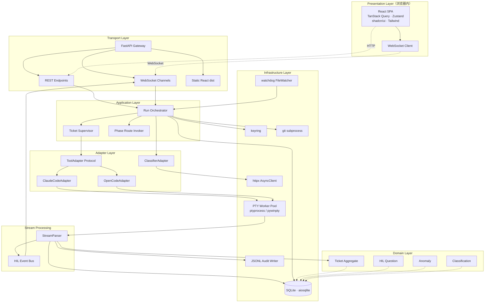
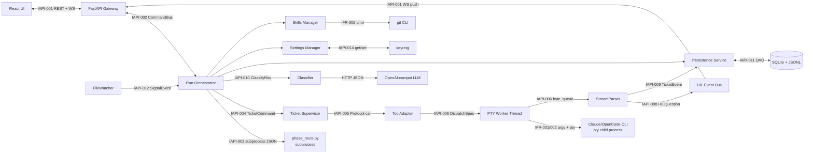
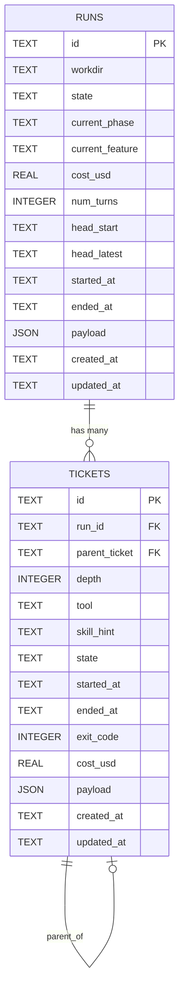
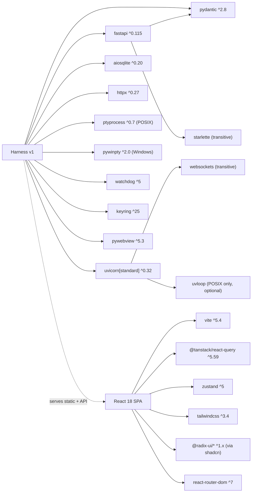
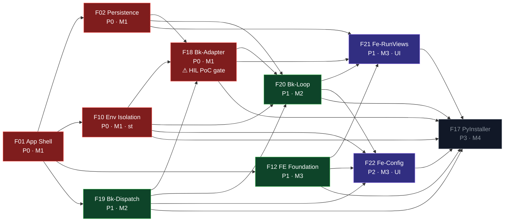

# Harness — Design Document

**Date**: 2026-04-21
**Status**: Approved
**SRS Reference**: docs/plans/2026-04-21-harness-srs.md
**UCD Reference**: docs/plans/2026-04-21-harness-ucd.md
**Deferred Backlog**: docs/plans/2026-04-21-harness-deferred.md
**Template**: reference/longtaskforagent/docs/templates/design-template.md
**Track**: Lite
**Project Kind**: Greenfield · Desktop Single-User · Python + React（PyWebView 壳）

---

## 1. Design Drivers

抽取自 SRS v1 Approved + UCD v1 Approved 的关键架构驱动。

### 1.1 功能范围总览
- 50 条 FR，其中 **46 条 active**，4 条延至 v1.1（FR-033b / FR-035b / FR-036 / FR-037，见 deferred backlog）
- 14 个 longtaskforagent skill 必须全部能被 Harness 驱动（FR-047）
- 8 个主 UI 页面（UCD §4.1-4.8）
- 两个 Tool Adapter：Claude Code + OpenCode（v1 OpenCode MCP 降级）

### 1.2 Must 级 NFR 阈值（锁定架构）
| NFR | 目标 | 对设计的硬约束 |
|---|---|---|
| NFR-001 | UI 响应 p95 < 500ms | 必须 WebSocket 直推，不轮询 |
| NFR-002 | Stream-json 事件 p95 < 2s | 必须增量解析 + 即推 |
| NFR-003 | context_overflow 自动恢复 ≤ 3 次 | 需 Anomaly + RetryPolicy 模块 |
| NFR-004 | rate_limit 指数退避 ≤ 3 次（30s/120s/300s） | 同上 |
| NFR-005 | 进程崩溃后 ticket 100% 可见且标记 interrupted | 每次状态转换必须同步 WAL 写入 SQLite |
| NFR-006 | 崩溃时仅 `.harness/` + `.harness-workdir/` 有写 | pty 子进程 cwd/env 白名单约束 |
| NFR-007 | FastAPI 仅绑 127.0.0.1 | uvicorn `host="127.0.0.1"` + 启动自检 |
| NFR-008 | API key 仅存 keyring | config.json 仅存服务引用 |
| NFR-009 | `~/.claude/` 零写入 | Adapter env 隔离 + mtime snapshot 断言 |

### 1.3 约束（CON-001..009）
- **CON-001** Python 3.11+ 后端 + PyInstaller 单文件 → 锁定语言与打包器
- **CON-003** UI 仅桌面 PyWebView + 仅简体中文 → 锁定前端壳
- **CON-006** FastAPI 绑 127.0.0.1 only → 锁定网络边界
- **CON-007** Harness 不写 `~/.claude/` → 锁定环境隔离策略
- **CON-008** 路由由 `scripts/phase_route.py` 单一事实源 → 不重新实现路由

### 1.4 接口需求（驱动 §6.1 External Interfaces）
7 个 IFR：Claude Code CLI / OpenCode CLI / phase_route.py subprocess / OpenAI-compatible HTTP / git CLI / keyring / WebSocket（内部）

### 1.5 用户画像
单一 persona **Harness User**（中高技术水平，已装 Claude Code CLI 且完成 `claude auth login`），所有设计决策（错误信息、日志详略、CLI 透传）以此画像为基线。

### 1.6 UCD 样式驱动
UCD 选 **Cockpit Dark**（Linear/Raycast/Vercel Dashboard 风），锁定前端 token 需以 CSS 变量形式落库、组件库需允许 token 级改造 → 直接决定 Tailwind + shadcn/ui 选型（§3.4）。

### 1.7 SRS Open Questions 状态
- **OQ-5**（Classifier 规则 vs LLM 一致性）：延到 ATS 阶段解决，不阻塞本设计。

---

## 2. Approach Selection

### 2.1 选定方案：**Approach A — asyncio 单进程编排 + 工作线程做 pty 阻塞 I/O**

**核心形态**：
- 单 Python 进程：FastAPI (uvicorn) + PyWebView 窗口共驻
- `asyncio` 事件循环承载 WebSocket、HTTP、编排主循环
- 每张 ticket 的 pty 阻塞 I/O 交由 `loop.run_in_executor()` 下的工作线程（POSIX `ptyprocess`、Windows `pywinpty`）
- `asyncio.Queue` 串联 pty→解析器→持久化/WebSocket 广播
- 前端 React 18 + Vite + TailwindCSS + shadcn/ui

### 2.2 论证（对照 SRS 约束与 NFR）
1. v1 场景单 workdir 单 run（CON-002、NFR-016、EXC-011）——崩溃隔离收益有限，无需子进程级隔离
2. NFR-001/002 对 UI 响应与流延迟最敏感，asyncio + WebSocket 推送是最短路径
3. pty 子进程天然与 Harness 主进程隔离；主进程仅承担解析/UI/编排——真正的 workdir 写入隔离由 pty 子进程 `cwd`/`env` 约束（与 B/C 方案等价）
4. PyInstaller 单文件打包 asyncio+uvloop（POSIX）或默认 loop（Windows）有成熟案例

### 2.3 被淘汰方案
- **Approach B（同步线程池）**：WebSocket 并发弱、同步 sqlite 阻塞 UI，NFR-001 风险高
- **Approach C（每 ticket 子进程隔离）**：IPC 序列化延迟叠加伤害 NFR-002；v1 单 run 场景隔离收益小于复杂度

---

## 3. Architecture

### 3.1 Architecture Overview

Harness 是单 Python 进程桌面应用：PyWebView 嵌 Chromium 窗口指向本机 FastAPI 服务（127.0.0.1:<ephemeral>）。核心构件：

- **PyWebView shell** — Chromium 渲染 React SPA；与 FastAPI 共进程
- **FastAPI (async)** — REST（设置/票据查询/文件）+ WebSocket（stream 事件/HIL 问题/phase 推进）+ React dist 静态路由
- **Run Orchestrator** (asyncio) — 单 Run 生命周期，调 `phase_route.py` 子进程决定下一张 ticket
- **Ticket Supervisor** (asyncio.Task 每 ticket 一条) — 管 ticket spawn→stream→HIL→terminate 全周期
- **ToolAdapter** (Protocol) — ClaudeCodeAdapter / OpenCodeAdapter 各实现 6 方法（FR-015）
- **PTY Worker** (线程，每 ticket 一条) — 包 ptyprocess（POSIX）/ pywinpty（Windows）；阻塞 read/write 经 `call_soon_threadsafe` 递交 asyncio 队列
- **StreamParser** (asyncio) — 增量 JSONL 解析 → 发射结构化事件；对 `AskUserQuestion`/`Question` tool_use 触发 HIL 分支
- **Classifier** (httpx.AsyncClient) — OpenAI-compat endpoint + `response_format=json_schema`；rule-based 降级
- **Persistence** (aiosqlite + 追加 JSONL) — `tickets` 单表 JSON1；audit log 每状态转 append
- **Secrets** (keyring) — LLM provider API key 存平台 keyring；Anthropic 继承 `claude auth login`
- **FileWatcher** (watchdog) — signal files + docs/plans + feature-list.json 监听
- **SkillsManager** (subprocess.git) — plugin 目录 git clone/pull

### 3.2 Logical View



**依赖方向**：自顶向下单向（Presentation → Transport → Application → Adapter/Parser → Infrastructure；Adapter/Parser 依赖 Domain 类型但 Domain 不反向依赖）。

### 3.3 Component Diagram



每条标注 `IAPI-xxx` 的边在 §6.2 内部 API 契约中展开（请求/响应 schema + 错误码）。`argv + pty`、`HTTP JSON` 属外部接口，追溯到 §6.1 IFR。

### 3.4 Tech Stack Decisions

| 层 | 选型 | 精确版本 | 论证（针对 SRS 约束 / NFR） | 被淘汰方案 |
|---|---|---|---|---|
| 后端语言 | Python | 3.11.x – 3.12.x | CON-001 硬要求 3.11+；3.13 PyInstaller 支持尚不稳 | 3.10（违反 CON-001）；3.13（打包稳定性） |
| Web 框架 | FastAPI | `^0.115` | async 原生 WebSocket（IFR-007）；Pydantic 2 直给 Ticket schema；NFR-001 可达 | Flask（sync 并发差）；Starlette 纯手写 |
| ASGI server | uvicorn[standard] | `^0.32` | httptools+uvloop+websockets 性能最佳；uvloop 可选（Windows 无） | hypercorn |
| Desktop shell | pywebview | `^5.3` | CON-003 要 PyWebView；5.x Cocoa/GTK/EdgeChromium 三平台稳定 | Electron（非 Python）；PyQt6 WebEngineView（LGPL + 体积 +200MB） |
| 打包器 | PyInstaller | `^6.10` | FR-049 三平台单文件 | Nuitka（编译慢） |
| SQLite 异步驱动 | aiosqlite | `^0.20` | FR-005 + NFR-005 + asyncio 原生 | sync sqlite3 + run_in_executor |
| HTTP 客户端 | httpx | `^0.27` | IFR-004；async；HTTP/2 | requests；aiohttp |
| PTY (POSIX) | ptyprocess | `^0.7` | FR-008；低层 raw bytes 便于解析器 | pexpect（expect 抽象太厚） |
| PTY (Windows) | pywinpty | `^2.0` | 基于 ConPTY（Win10 1809+）；维护活跃 | winpty（老旧，.NET 依赖） |
| 文件观察 | watchdog | `^5.0` | FR-048 跨平台统一 | pyinotify（仅 Linux） |
| 凭证 | keyring | `^25` | IFR-006 + NFR-008；三平台原生 backend | secretstorage（仅 Linux） |
| JSON Schema 验证 | pydantic | `^2.8` | FastAPI 深度绑定；FR-007 字段 schema；FR-023 response schema | dataclasses-json |
| Log | structlog | `^24.4` | 结构化 audit log；NFR-005 便于还原 | stdlib logging |
| 前端语言 | TypeScript | `^5.5` | 约束 stream-json 事件类型 | JavaScript |
| 前端构建 | Vite | `^5.4` | 快；dist 便于嵌入 PyInstaller | webpack；Next.js |
| 前端框架 | React | `^18.3` | shadcn/ui + Radix 依赖 | Vue；Svelte |
| UI 组件层 | shadcn/ui + Radix UI | shadcn CLI `^0.9`；Radix `^1.x` | copy-paste 模式直映射 UCD token | Chakra v3；Mantine v7 |
| CSS | TailwindCSS | `^3.4` | UCD §2 token 以 CSS 变量落库 → tailwind.config 直引用 | styled-components |
| 数据获取 | TanStack Query | `^5.59` | WebSocket + 轮询混合归一 | SWR |
| 客户端状态 | Zustand | `^5.0` | 轻量局部 state | Redux Toolkit |
| 图标 | lucide-react | `^0.441` | UCD §2.4 锚定 Lucide | heroicons |
| 路由 | react-router-dom | `^7.0` | 8 页面 SPA | TanStack Router |
| Markdown 渲染 | react-markdown | `^9` | FR-033/035 预览 | marked + dompurify |
| 代码高亮 | shiki | `^1.22` | FR-034/041；VSCode 同语法主题对齐 UCD `--color-code-*` | prism-react-renderer |
| Diff 渲染 | react-diff-view | `^3.2` | FR-041 unified + side-by-side 两变体 | diff2html |
| 虚拟滚动 | @tanstack/react-virtual | `^3.10` | FR-034 10k+ 事件 | react-window |
| 后端测试 | pytest + pytest-asyncio | pytest `^8.3`；pytest-asyncio `^0.24` | asyncio 标配 | unittest |
| 前端测试 | Vitest + React Testing Library | vitest `^2.1`；@testing-library/react `^16` | Vite 生态默认 | Jest |
| E2E | Playwright | `^1.48` | NFR-001 验收；chromium 覆盖 pywebview | Cypress |
| Mutation 测试 | mutmut | `^3.0` | 对齐 long-task-guide 质量门 | cosmic-ray |
| Lint/Format (Python) | ruff + black | ruff `^0.6`；black `^24.8` | 业内标配 | flake8 |
| Lint/Format (TS) | eslint + prettier | eslint `^9`；prettier `^3.3` | shadcn 默认 | biome |

**License 审查**：pywebview **BSD-3**；ptyprocess **ISC**；pywinpty **MIT**；keyring **MIT**；FastAPI/uvicorn/httpx **BSD-3/MIT**；shadcn/Radix/Tailwind **MIT**；PyInstaller **GPL-2 with bootloader exception**（生成二进制不受传染，采纳）。无 AGPL/GPL 传染。

**版本策略**：主力依赖 `^x.y` 区间（允许补丁+次版本升级）；PyInstaller / pywebview / ptyprocess / pywinpty 精确锁主版本；`requirements.txt` 同时提供 `requirements.lock`（pip-compile 产出）。

### 3.5 NFR Alignment Summary（Must NFRs）

| NFR | 目标 | 由本架构如何满足 |
|---|---|---|
| NFR-001 p95 UI 响应 <500ms | WebSocket push 取代轮询；FastAPI async；WebSocket 广播在 asyncio 事件循环中直接从 parser queue 推送 |
| NFR-002 流式 p95 <2s | PTY Worker 读到字节后 `call_soon_threadsafe` 立刻入队；StreamParser 增量解析 JSONL 无缓冲累积；WebSocket 边解析边推 |
| NFR-003 context_overflow 3 次上限 | Classifier + rule-based 双层判定写 `ticket.anomaly.retry_count`；Orchestrator 读阈值 3 则 escalate |
| NFR-004 rate_limit 3 次指数退避 | Orchestrator 的 RetryPolicy 状态机（30s/120s/300s）计数 |
| NFR-005 崩溃后可见 interrupted | aiosqlite 每次状态转换同步 WAL；重启时 Orchestrator 扫 `state in (running, classifying, hil_waiting)` 标 interrupted |
| NFR-006 workdir 写入隔离 | pty 子进程 `cwd=.harness-workdir/<run-id>`；Harness 主进程仅写 `.harness/`；subprocess env 白名单 |
| NFR-007 127.0.0.1 only | uvicorn `host="127.0.0.1"`，`--reload` 禁用；启动自检断言 |
| NFR-008 API key 仅 keyring | 所有 provider key 走 `keyring.set_password(service, user, secret)`；config.json 仅存服务名+用户名引用 |
| NFR-009 不写 ~/.claude | Adapter 构造 argv 时 `--settings <.harness-workdir/<run-id>/.claude/settings.json>`；`HOME` 或 `CLAUDE_CONFIG_DIR` env 覆盖；run 启动前 snapshot mtime，退出时 diff 断言 |

---

## 4. Feature Integration Specs

> **Wave 2 重整（2026-04-24）**：旧 17 特性合并为 10 特性（2 passing + 1 st + 7 failing），12 个旧 ID（F03/F04/F05/F06/F07/F08/F09/F11/F13/F14/F15/F16）整体废弃并在 `feature-list.json` 保留为 `status=deprecated`（`srs_trace` 清空）；5 个新 ID（F18–F22）承载旧特性全量 FR/NFR/IFR。旧 ID 不再被 SKILL 调度，但文档中仍以 "consolidated from F0x/F0y" 方式回溯。本轮不改 SRS 层 FR/NFR/IFR 语义，仅做 feature 重包装。

每个 §4.N 仅含 Overview / Key Types / Integration Surface（**不**包含类图/时序图/流程图）。IAPI 引用指向 §6.2 契约表。编号顺序：§4.1 F01 · §4.2 F02 · §4.3 F18 · §4.4 F19 · §4.5 F20 · §4.6 F21 · §4.7 F22 · §4.8 F10 · §4.9 F12 · §4.10 F17。

### 4.1 F01 · App Shell & Platform Bootstrap

**4.1.1 Overview**：Python 入口、FastAPI 实例、PyWebView 窗口、首次启动向导、`~/.harness/` 初始化、keyring 门面；强制 FastAPI 绑 127.0.0.1。满足 FR-046、FR-050 + NFR-007/008 基线。

**4.1.2 Key Types**
- `harness.app.AppBootstrap` — 选 ephemeral 端口、启 uvicorn、拉 PyWebView 窗口
- `harness.app.FirstRunWizard` — 检测 `~/.harness/config.json` 缺失 → 引导设置
- `harness.config.ConfigStore` — 读/写 `~/.harness/config.json`
- `harness.auth.KeyringGateway` — 封装 `keyring.get/set/delete_password`
- `harness.auth.ClaudeAuthDetector` — 探测 claude auth 状态
- `harness.net.BindGuard` — 启动自检 127.0.0.1 bind

**4.1.3 Integration Surface**
- **Provides**：ConfigStore + Keyring 门面 → F19/F22
- **Requires**：Self-contained

| 方向 | Consumer | Contract ID | Endpoint | Schema |
|---|---|---|---|---|
| Provides | F19/F22 | IAPI-014 | Settings Manager ↔ keyring | `get_secret(service, user) → str \| None` |

### 4.2 F02 · Persistence Core

**4.2.1 Overview**：SQLite schema（`runs` + `tickets`）、aiosqlite DAO、JSONL append、Ticket 状态机。满足 FR-005/006/007。

**4.2.2 Key Types**
- `harness.persistence.Schema` — CREATE TABLE DDL，启动迁移幂等
- `harness.persistence.TicketRepository` — async CRUD + JSON1 查询
- `harness.persistence.RunRepository` — Run 元数据
- `harness.persistence.AuditWriter` — JSONL append-only，按 run_id 分文件
- `harness.domain.Ticket` — pydantic aggregate（FR-007 全字段）
- `harness.domain.TicketStateMachine` — 9 态枚举 + 合法转移表
- `harness.domain.TransitionError` — 非法跳转

**4.2.3 Integration Surface**
- **Provides**：DAO + 状态机 → 几乎所有后端特性
- **Requires**：Self-contained

| 方向 | Consumer | Contract ID | Endpoint | Schema |
|---|---|---|---|---|
| Provides | F18/F20 | IAPI-011 | `TicketRepository.save/get/list_by_run` | `Ticket` |
| Provides | F18/F20 | IAPI-009 | `AuditWriter.append` | `AuditEvent` |

### 4.3 F18 · Bk-Adapter — Agent Adapter & HIL Pipeline

> **Consolidates**: 旧 F03（PTY & ToolAdapter Foundation）+ 旧 F04（Stream Parser & HIL Pipeline）+ 旧 F05（OpenCode Adapter）。HIL PoC gate（FR-013 · 20 次 round-trip ≥95%）owner 已迁至本特性。

**4.3.1 Overview**：跨平台 PTY 包装 + ToolAdapter Protocol（ClaudeCode / OpenCode 双实现）+ 增量 JSON-Lines 解析 + HIL question 捕获与 pty stdin 回写 + 终止横幅冲突仲裁；一个 feature 覆盖 "Agent 启动 → 流 → HIL 回写" 单向链路，使 TDD 时 mock 面最小。满足 FR-008/009/011/012/013/014/015/016/017/018 + NFR-014。提供 IFR-001（Claude Code CLI argv / flag / stream-json 解析）与 IFR-002（OpenCode CLI argv / hooks / MCP 降级）的宿主。

**4.3.2 Key Types**
- `harness.adapter.ToolAdapter` (Protocol) — `build_argv / spawn / extract_hil / parse_result / detect_anomaly / supports`
- `harness.adapter.DispatchSpec` — pydantic（FR-007 dispatch 字段）
- `harness.adapter.CapabilityFlags` — enum
- `harness.adapter.claude.ClaudeCodeAdapter` — 实现 FR-016 全 flag（含 `--settings <isolated>` 注入）
- `harness.adapter.opencode.OpenCodeAdapter` — FR-012/017
- `harness.adapter.opencode.HookConfigWriter` / `HookQuestionParser` / `McpDegradation` / `VersionCheck`
- `harness.pty.PtyProcessAdapter` (Protocol) — 跨平台统一 API
- `harness.pty.posix.PosixPty` — 基于 ptyprocess（POSIX）
- `harness.pty.windows.WindowsPty` — 基于 pywinpty ConPTY（Windows 10 1809+）
- `harness.pty.PtyWorker` — threading.Thread + asyncio.Queue 桥；`call_soon_threadsafe` 入队
- `harness.stream.JsonLinesParser` — 增量 decode，容忍半行
- `harness.stream.StreamEvent` — pydantic union（text/tool_use/tool_result/thinking/error/system）
- `harness.stream.BannerConflictArbiter` — FR-014 终止横幅 vs HIL 冲突仲裁（HIL 优先）
- `harness.hil.HilExtractor` — 监 `tool_use.name ∈ {AskUserQuestion, Question}`
- `harness.hil.HilQuestion` — 标准化 schema
- `harness.hil.HilControlDeriver` — FR-010 规则导出 kind（radio / checkbox / textarea）
- `harness.hil.HilWriteback` — pty stdin 格式化写回
- `harness.hil.HilEventBus` — asyncio fan-out（WebSocket + DB）

**4.3.3 Module Layout 建议**
- `harness/adapter/` — Protocol / DispatchSpec / CapabilityFlags / claude / opencode 子包
- `harness/pty/` — `posix.py` + `windows.py` + `worker.py`
- `harness/stream/` — `parser.py` + `events.py` + `banner_arbiter.py`
- `harness/hil/` — `extractor.py` + `question.py` + `control.py` + `writeback.py` + `event_bus.py`

**4.3.4 Integration Surface**
- **Provides**：ToolAdapter 生命周期 + StreamEvent + HilEventBus → F20（Bk-Loop）；WebSocket `/ws/hil` → F21（Fe-RunViews）
- **Requires**：F02（Persistence）·  F10（Environment Isolation）· F19（Model Resolver）

| 方向 | Consumer / Provider | Contract ID | Endpoint | Schema |
|---|---|---|---|---|
| Provides | F20 | IAPI-005 | `ToolAdapter.spawn(DispatchSpec) → TicketProcess` | `DispatchSpec`, `TicketProcess` |
| Provides | F18（内聚，跨子包） | IAPI-006 | `PtyWorker.byte_queue` → `StreamParser` | `asyncio.Queue[bytes]` |
| Provides | F18（内聚，跨子包） | IAPI-007 | `HilWriteback → PtyWorker.write` | `bytes` |
| Provides | F18/F20 | IAPI-008 | `StreamParser.events()` async iterator | `StreamEvent` |
| Provides | F21 | IAPI-001 | WebSocket `/ws/hil` | `HilQuestion`, `HilAnswerAck` |
| Provides | F02 | IAPI-009 | `AuditWriter.append` | `AuditEvent` |
| Requires | F19 | IAPI-015 | `ModelResolver.resolve(...)` | 见 §6.2 |
| Requires | F10 | IAPI-017 | `EnvironmentIsolator.setup_run(run_id)` | `IsolatedPaths` |
| Requires | F02 | IAPI-011 | `TicketRepository` | `Ticket` |

**4.3.5 HIL PoC Gate（FR-013）**
在 F18 TDD Green 阶段必须跑一个覆盖 Claude Code CLI 的 20 次 HIL round-trip 集成测试（`AskUserQuestion` → UI 回答 → pty stdin 写回 → 下一轮 tool_use），成功率 ≥95%。不达标则阻塞 F20/F21 进入 TDD，由用户决定是否重评 SRS ASM-003。

**4.3.6 Test Inventory Hint**
- Protocol 合规：两个 Adapter 6 方法契约共 12 条
- argv 构造正/负：Claude flag 全集 + OpenCode flag 全集（FR-016/017）
- StreamParser 容错：半行 / 乱序 / extras 字段（FR-009）
- HIL 三控件派生规则矩阵（FR-010）+ XSS freeform 反注入
- BannerConflictArbiter fixture ≥10 条（覆盖终止横幅与 HIL 冲突）
- HIL PoC 20-round 集成测试（FR-013）

### 4.4 F19 · Bk-Dispatch — Model Resolver & Classifier

> **Consolidates**: 旧 F07（Model Override Resolver）+ 旧 F08（Classifier Service）。两者都在 "dispatch 决策" 链上（resolve model → classify ticket），合并后同一 feature 独立跑 TDD 时 mock 面减半。

**4.4.1 Overview**：Dispatch 前置决策服务——4 层模型优先级解析（per-ticket > per-skill > run-default > provider-default）+ ticket 结果分类（LLM backend via OpenAI-compat HTTP + rule backend 降级 + toggle off）。满足 FR-019/020/021/022/023；提供 IFR-004（OpenAI-compatible HTTP）的 httpx 客户端与 preset 管理。

**4.4.2 Key Types**
- `harness.dispatch.model.ModelResolver` — 4 层优先级链
- `harness.dispatch.model.ModelRule` / `ModelRulesStore` / `ProvenanceTag`
- `harness.dispatch.classifier.ClassifierService` — 门面
- `harness.dispatch.classifier.LlmBackend` — httpx AsyncClient + `response_format=json_schema`（**Wave 3**：strict-off 分支 — prompt-only JSON suffix + tolerant `<think>`/JSON 提取，见 §6.1.4 Effective Strict Schema 标志）
- `harness.dispatch.classifier.RuleBackend` — 硬编码规则降级
- `harness.dispatch.classifier.Verdict` — pydantic
- `harness.dispatch.classifier.PromptStore` — classifier prompt 当前 + 历史
- `harness.dispatch.classifier.ProviderPresets` — GLM / MiniMax / OpenAI / custom（**Wave 3**：含 `supports_strict_schema` 能力位）
- `harness.dispatch.classifier.FallbackDecorator` — LLM 失败自动 rule 降级

**4.4.3 Module Layout 建议**
- `harness/dispatch/` — `model/` 子包 + `classifier/` 子包 + `__init__.py`（暴露 `ModelResolver`、`ClassifierService`）

**4.4.4 Integration Surface**
- **Provides**：模型解析 → F18（Bk-Adapter）；分类服务 → F20（Bk-Loop）；CRUD 路由 → F22（Fe-Config）
- **Requires**：F01（ConfigStore + keyring）

| 方向 | Consumer / Provider | Contract ID | Endpoint | Schema |
|---|---|---|---|---|
| Provides | F18 | IAPI-015 | `ModelResolver.resolve` | `ResolveResult` |
| Provides | F20 | IAPI-010 | `ClassifierService.classify(ticket) → Verdict` | `Verdict` |
| Provides | F22 | IAPI-002 | REST `GET/PUT /api/settings/model_rules`、classifier/prompts 子路由 | `ModelRule[]`, `ClassifierConfig`, `ClassifierPrompt` |
| Requires | IFR-004 | 外部 | `POST <base_url>/v1/chat/completions` | OpenAI-compat |
| Requires | F01 | IAPI-014 | keyring（api_key） | — |

**4.4.5 Test Inventory Hint**
- ModelResolver 4 层优先级矩阵（per-ticket > per-skill > run-default > provider-default）
- Classifier LlmBackend 成功 / response_format 协议漂移 / rule 降级
- ProviderPresets × 4 preset `/test` 连通性
- PromptStore 版本化 diff

### 4.5 F20 · Bk-Loop — Run Orchestrator · Recovery · Subprocess

> **Consolidates**: 旧 F06（Run Orchestrator & Phase Router）+ 旧 F09（Anomaly Recovery & Watchdog）+ 旧 F11（Subprocess Integrations：git tracker + validator runner）。这是后端主回路——Orchestrator / Recovery / Subprocess 三子模块共享 RunContext 与 Ticket 状态机，合并后端到端 dry-run 可以在一个 feature 内闭环 TDD。

**4.5.1 Overview**：单 Run 主循环（phase_route.py 调用、signal file 感知、pause/cancel、14-skill 覆盖、depth ≤2）+ 5 类异常识别与恢复（context_overflow、rate_limit、auth、network、crash）+ Skip/ForceAbort 人为覆写 + Watchdog（30 分钟 SIGTERM → 5s → SIGKILL）+ ticket 级 git HEAD 追踪 + validate_*.py subprocess 执行。满足 FR-001/002/003/004/024/025/026/027/028/029/039/040/042/047/048 + NFR-003/004/015/016。提供 IFR-003（`scripts/phase_route.py` subprocess）与 IFR-005（git CLI）的客户端。

**4.5.2 Key Types**

*Orchestrator 子模块*
- `harness.orchestrator.RunOrchestrator` — 单 Run 主状态机
- `harness.orchestrator.TicketSupervisor` — 单 ticket asyncio.Task
- `harness.orchestrator.PhaseRouteInvoker` — subprocess 调用 phase_route.py
- `harness.orchestrator.PhaseRouteResult` — 松弛 JSON
- `harness.orchestrator.SignalFileWatcher` — watchdog observer（signal files + docs/plans + feature-list.json）
- `harness.orchestrator.RunControlBus` — WebSocket 指令路由
- `harness.orchestrator.DepthGuard` — 嵌套深度 ≤2
- `harness.orchestrator.RunLock` — filelock `.harness/run.lock`

*Recovery 子模块*
- `harness.recovery.AnomalyClassifier` — 5 类异常识别
- `harness.recovery.RetryPolicy` — 30s/120s/300s 指数退避
- `harness.recovery.Watchdog` — 超时 SIGTERM → SIGKILL
- `harness.recovery.RetryCounter` — 按 skill_hint 聚合
- `harness.recovery.EscalationEmitter` — ≥3 次升级用户
- `harness.recovery.UserOverride` — Skip / ForceAbort

*Subprocess 子模块*
- `harness.subprocess.git.GitTracker` — ticket begin/end HEAD 追踪
- `harness.subprocess.git.GitCommit` / `DiffLoader`
- `harness.subprocess.validator.ValidatorRunner` — `scripts/validate_*.py` 执行
- `harness.subprocess.validator.ValidationReport` — 统一报告 schema
- `harness.subprocess.validator.FrontendValidator` — pydantic → TS/Zod 导出

**4.5.3 Module Layout 建议**
- `harness/orchestrator/` — 主循环 + supervisor + phase_route invoker + run lock + signal watcher
- `harness/recovery/` — anomaly classifier + retry policy + watchdog + user override
- `harness/subprocess/` — `git/` + `validator/` 两子包

**4.5.4 Integration Surface**

*Orchestrator → 外部*
- **Provides**：Run 生命周期 REST + RunControlBus（WebSocket）→ F21（Fe-RunViews）· F22（Fe-Config）
- **Requires**：F02 / F18 / F19 / F10

*Recovery → 外部*
- **Provides**：异常事件 → F21（Fe-RunViews `/ws/anomaly`）
- **Requires**：F19 Classifier（验证是否 `context_overflow`）· F02

*Subprocess → 外部*
- **Provides**：git 历史 + validate 报告 → F22（Fe-Config 的 ProcessFiles + Commits tab）
- **Requires**：IFR-005 git CLI · `scripts/validate_*.py`

| 方向 | Consumer / Provider | Contract ID | Endpoint | Schema |
|---|---|---|---|---|
| Provides | F21 | IAPI-002 | REST `POST /api/runs/start` · `/api/runs/:id/pause` · `/api/runs/:id/cancel` · `POST /api/anomaly/:ticket_id/skip` · `/force-abort` | `RunStartRequest`, `RunStatus`, `RecoveryDecision` |
| Provides | F21 | IAPI-001 | WebSocket `/ws/run/:id`、`/ws/anomaly`、`/ws/signal` | `RunEvent`, `AnomalyEvent`, `SignalFileChanged` |
| Provides | F21 | IAPI-019 | RunControlBus REST + WS | `RunControlCommand`, `RunControlAck` |
| Provides | F22 | IAPI-002 | REST `GET /api/git/commits` · `GET /api/git/diff/:sha` · `GET /api/files/tree` · `GET /api/files/read` | `GitCommit[]`, `DiffPayload`, `FileTree`, `FileContent` |
| Provides | F22 | IAPI-016 | REST `POST /api/validate/:file` | `ValidationReport` |
| Provides | F20（内聚） | IAPI-004 | `TicketSupervisor.reenqueue_ticket` ← `AnomalyRecovery.decide` | `TicketCommand`, `RecoveryDecision` |
| Provides | F20（内聚） | IAPI-012 | `SignalFileWatcher` → `Orchestrator` | `SignalEvent` |
| Provides | F20（内聚） | IAPI-013 | `GitTracker.begin/end(ticket)` → orchestrator | `GitContext` |
| Requires | phase_route.py | IAPI-003 | subprocess | `PhaseRouteResult` |
| Requires | F18 | IAPI-005/008 | ToolAdapter + StreamParser | `DispatchSpec`, `StreamEvent` |
| Requires | F19 | IAPI-010 | Classifier.classify | `Verdict` |
| Requires | F02 | IAPI-011/009 | TicketRepository + AuditWriter | `Ticket`, `AuditEvent` |
| Requires | F10 | IAPI-017 | EnvironmentIsolator | `IsolatedPaths` |
| Requires | IFR-005 | 外部 | git CLI subprocess | — |
| Requires | scripts/validate_*.py | 外部 | python subprocess | 脚本协议 |

**4.5.5 Test Inventory Hint**
- Orchestrator：phase_route.py 输入/输出矩阵（正常 / missing feature / depth>2） + pause/cancel 状态合法性 + signal file event fan-out
- Recovery：5 类异常分类器 × 3 次退避 + 升级门槛；Watchdog SIGTERM→SIGKILL 时序
- Subprocess：GitTracker begin/end × 非 git 目录 exit=128 降级；ValidatorRunner schema 错误 / 超时
- 端到端 dry-run：一次 `/api/runs/start` → phase_route → spawn → stream → classify → recovery → persist

### 4.6 F21 · Fe-RunViews — RunOverview + HILInbox + TicketStream

> **Consolidates**: 旧 F13（RunOverview + HILInbox Pages）+ 旧 F14（TicketStream Page）。都消费 F20 的 run/ticket/stream 契约，合并后视觉回归 SOP 一次跑完三页。

**4.6.1 Overview**：实现 UCD §4.1（RunOverview）·  §4.2（HILInbox）· §4.5（TicketStream）三个实时面板——phase stepper + 当前 run 控制、HIL 问题列表与 radio/checkbox/textarea 映射、ticket list + event tree + inspector 三栏配合虚拟滚动。**feature-list.json 的 `ui_entry` 为 `/`**（RunOverview 作首屏）。承接 FR-010/030/031/034 + NFR-002/011 + IFR-007。视觉真相源：`docs/design-bundle/eava2/project/pages/RunOverview.jsx` / `HILInbox.jsx` / `TicketStream.jsx`。

**4.6.2 职责范围**
- **RunOverview (`/`)**：移植 prototype；接 F20 `GET /api/runs/current` 与 `POST /api/runs/:id/{pause,cancel}`；phase stepper 数据来自 `/ws/run/:id`。
- **HILInbox (`/hil`)**：移植 prototype（含 local `HILCard` + `RadioRow`）；HIL 问题经 `/ws/hil` 到达；三控件映射：`multiSelect=false` + `options≥2` → radio；`multiSelect=true` → checkbox；`allowFreeform=true` + `options=0` → textarea（FR-010）。
- **TicketStream (`/ticket-stream`)**：三栏 layout；event tree 用 `@tanstack/react-virtual` 支持 10k+ 事件（滚动 ≥30fps，FR-034 PERF）；`state`/`tool`/`run_id` 筛选 + URL 参数同步；Ctrl/Cmd+F 内联搜索；新事件 WebSocket 增量追加；用户滚动时暂停自动 scroll-to-bottom。
- **反 XSS**：HIL freeform 文本回填 DOM 使用 React `textContent` 赋值，禁止 `dangerouslySetInnerHTML`。

**4.6.3 Module Layout 建议**
- `apps/ui/src/routes/run-overview/`
- `apps/ui/src/routes/hil-inbox/`（含 local `HILCard` / `RadioRow`）
- `apps/ui/src/routes/ticket-stream/`（含 local `EventTree` 组件）

**4.6.4 Integration Surface**
- **Provides**：路由 `/` · `/hil` · `/ticket-stream`
- **Requires**：F02（ticket 列表）· F12（前端基座）· F18（HIL + stream 契约）· F20（run 控制 / REST ticket 查询）

| 方向 | Consumer / Provider | Contract ID | Endpoint | Schema |
|---|---|---|---|---|
| Requires | F20 | IAPI-002 | `GET /api/runs/current` · `POST /api/runs/:id/pause\|cancel` · `GET /api/tickets?...` · `GET /api/tickets/:id` · `GET /api/tickets/:id/stream` | `RunStatus`, `Ticket[]`, `StreamEvent[]` |
| Requires | F20 | IAPI-001 | WebSocket `/ws/run/:id` · `/ws/anomaly` · `/ws/signal` | `RunEvent`, `AnomalyEvent`, `SignalFileChanged` |
| Requires | F20 | IAPI-019 | REST + WS RunControlBus | `RunControlCommand`, `RunControlAck` |
| Requires | F18 | IAPI-001 | WebSocket `/ws/hil` · `/ws/stream/:ticket_id` + `POST /api/hil/:ticket_id/answer` | `HilQuestion`, `HilAnswer`, `StreamEvent` |
| Requires | F12 | 内部 FE | `Sidebar` · `PhaseStepper` · `TicketCard` · `PageFrame` | — |

**4.6.5 视觉保真义务**
三页各自跑 UCD §7 视觉回归（像素差 < 3%）。HIL phase 色带氤氲 header、pulse 光环、状态 chip 必须与 prototype 等价（`pages/HILInbox.jsx` `HILCard` 与 `tokens.css` `.state-dot.pulse`）。TicketStream event tree 展开/收起图标、缩进层级、monospace 对齐、hover 高亮与 `pages/TicketStream.jsx` 内 local `EventTree` 等价。

**4.6.6 Test Inventory Hint**
- RunOverview 首屏渲染（UCD §4.1）+ pause/cancel 行为 + 无 run idle 态
- HILInbox 三控件派生规则 ×8 fixture + freeform XSS 防注入
- TicketStream 虚拟滚动 fps benchmark + 筛选 URL 同步 + 内联搜索命中高亮
- 视觉回归 ×3 页

### 4.7 F22 · Fe-Config — SystemSettings + PromptsAndSkills + Docs + ProcessFiles + Commits

> **Consolidates**: 旧 F15（SystemSettings + PromptsAndSkills）+ 旧 F16（DocsAndROI + ProcessFiles + CommitHistory）。五页共享"配置 / 文档 / 过程数据"表单形态与 tab layout，合并后 shadcn tabs 组件抽象一次。

**4.7.1 Overview**：实现 UCD §4.3（SystemSettings）·  §4.4（PromptsAndSkills）· §4.6（DocsAndROI）· §4.7（ProcessFiles）· §4.8（CommitHistory）五页，入口 `/settings`（**feature-list.json 的 `ui_entry`**）。承接 FR-032/033/035/038/041 + NFR-008（API key 仅走 keyring，UI 层 masked input）+ IFR-004/005/006。视觉真相源：`pages/SystemSettings.jsx` · `PromptsAndSkills.jsx` · `DocsAndROI.jsx` · `ProcessFiles.jsx` · `CommitHistory.jsx`。

**4.7.2 职责范围**
- **SystemSettings (`/settings`)**：5 个 tab：`Models` / `ApiKey` / `Classifier` / `MCP` / `UI`。**NFR-008 落点**：`ApiKey` tab 的密钥字段用 masked input（显示 `***abc`），明文不入 DOM；提交 PUT `/api/settings/general` 只写 keyring reference（service + user），不写明文到 `config.json`。Linux 无 Secret Service daemon 降级 keyrings.alt + 顶部告警横幅（IFR-006）。
- **PromptsAndSkills (`/skills`)**：skill tree 只读 + markdown 预览 + classifier prompt 可编辑 + Plugin 更新 modal（`POST /api/skills/install|pull`）。prompt 编辑保存时 diff 写入历史表（F19 提供）。skill tree 路径不允许 `..` 穿越。
- **DocsAndROI (`/docs`)**：文件树（`docs/plans/*.md` + `docs/features/*.md`）+ markdown 预览 + 右侧 TOC。ROI 按钮 `disabled` 带 tooltip "v1.1 规划中"（FR-035 subset）。路径 `..` 请求一律拒绝（SEC）。
- **ProcessFiles (`/process-files`)**：结构化编辑器，专门针对 `feature-list.json` 等"过程文件"，schema 驱动（pydantic → Zod 导出到 `apps/ui/src/lib/zod-schemas.ts`）；双层校验（前端 Zod + 后端 `POST /api/validate/:file`）；必填空字段红框 + Save 禁用。
- **CommitHistory (`/commits`)**：commit 列表 + diff viewer。二进制文件 diff 显示占位（不崩）。非 git 目录 `exit=128` UI 横幅告警（IFR-005）。Diff 视觉用 prototype `DiffViewer`。

**4.7.3 Module Layout 建议**
- `apps/ui/src/routes/system-settings/` —— 5 tab 子组件
- `apps/ui/src/routes/prompts-and-skills/`
- `apps/ui/src/routes/docs-and-roi/`
- `apps/ui/src/routes/process-files/`（含 Zod schema 导入层）
- `apps/ui/src/routes/commit-history/`

**4.7.4 Integration Surface**
- **Provides**：路由 `/settings` · `/skills` · `/docs` · `/process-files` · `/commits`
- **Requires**：F01（通用 settings REST）· F12（前端基座）· F19（model rules / classifier / prompts）· F20（git / validator / files REST）· F10（skills install / pull）

| 方向 | Consumer / Provider | Contract ID | Endpoint | Schema |
|---|---|---|---|---|
| Requires | F01 | IAPI-002 | `GET/PUT /api/settings/general` | `GeneralSettings` |
| Requires | F01 | IAPI-014 | keyring（经 REST，明文不过线） | `ApiKeyRef` |
| Requires | F19 | IAPI-002 | `GET/PUT /api/settings/model_rules` · `classifier` · `GET/PUT /api/prompts/classifier` | `ModelRule[]`, `ClassifierConfig`, `ClassifierPrompt` |
| Requires | F10 | IAPI-018 | `GET /api/skills/tree` · `POST /api/skills/install\|pull` | `SkillTree`, `SkillsInstallRequest`, `SkillsInstallResult` |
| Requires | F20 | IAPI-002 | `GET /api/files/tree` · `GET /api/files/read` · `GET /api/git/commits` · `GET /api/git/diff/:sha` | `FileTree`, `FileContent`, `GitCommit[]`, `DiffPayload` |
| Requires | F20 | IAPI-016 | `POST /api/validate/:file` | `ValidationReport` |
| Requires | F20 | IAPI-013 | `GitTracker` 经 REST 映射 | `GitContext` |
| Requires | F12 | 内部 FE | `Sidebar` · `PageFrame` · shared primitives | — |

**4.7.5 视觉保真义务**
5 页各自跑 UCD §7 视觉回归（像素差 < 3%）。SystemSettings 5 tab 左侧 vertical tab + 右侧 `SettingsFormSection` 卡片堆叠；Skill tree 节点的 expand chevron、readonly 锁图标；DiffViewer add/del 行背景透明度、gutter 色取 `tokens.css` `--diff-*` 变量。

**4.7.6 Test Inventory Hint**
- SystemSettings ApiKey masked 输入 + 明文不入 DOM assert + keyring fallback 横幅
- PromptsAndSkills tree 渲染 + `..` 拒绝 + prompt diff 历史写入
- DocsAndROI 路径穿越拒绝 + ROI disabled tooltip
- ProcessFiles Zod + 后端 validate 双层覆盖 × 5 种坏样本
- CommitHistory 非 git 目录 + 二进制 diff 占位
- 视觉回归 ×5 页

### 4.8 F10 · Environment Isolation & Skills Installer

> **Preserved from Wave 1** — 当前 `current.phase=st`，id=3 保留不变；consumer 按 Wave 2 新 ID 重映射，模块 `harness/env/` 与 `harness/skills/` 不改包名。

**4.8.1 Overview**：`.harness-workdir/<run-id>/.claude/` 隔离目录生成 + symlink plugin bundle + `~/.claude/` 零写断言 + Skills 手动 git。满足 FR-043/044/045 + NFR-009。

**4.8.2 Key Types**
- `harness.env.EnvironmentIsolator`
- `harness.env.IsolatedPaths`（cwd / plugin_dir / settings_path / mcp_config_path）
- `harness.env.HomeMtimeGuard`
- `harness.env.WorkdirScopeGuard`
- `harness.skills.SkillsInstaller`
- `harness.skills.PluginRegistry`

**4.8.3 Integration Surface**
- **Provides**：隔离路径 → F18（Bk-Adapter）· F20（Bk-Loop）；安装 API → F22（Fe-Config）
- **Requires**：git CLI

| 方向 | Consumer / Provider | Contract ID | Endpoint | Schema |
|---|---|---|---|---|
| Provides | F18/F20 | IAPI-017 | `EnvironmentIsolator.setup_run(run_id)` | `IsolatedPaths` |
| Provides | F22 | IAPI-018 | REST `POST /api/skills/install` / `/pull` | `SkillsInstallRequest` |
| Requires | IFR-005 | 外部 | git subprocess | — |

### 4.9 F12 · Frontend Foundation

**4.9.1 Overview**：React 18 + Vite + TypeScript + TailwindCSS + shadcn/ui 前端基座。**视觉真相源**: `docs/design-bundle/eava2/project/`(由 Claude Design 导出的可运行 prototype);**视觉规则源**:UCD §2(a11y / 动效 / 中文排印 / 响应式 / 状态色)。本节**只描述架构与集成契约**,不复述视觉细节(UCD §6 引用禁令)。

**4.9.2 职责范围**
- **基座**:AppShell + 路由 + WebSocket 客户端(重连 + 多 channel 订阅) + REST client(TanStack Query hook 工厂) + Zustand store slices。
- **主题**:把 `design-bundle/eava2/project/styles/tokens.css` **原样**移入 `apps/ui/src/theme/tokens.css`;追加 UCD §2.5 中文排印扩展 class 与 §2.2 `prefers-reduced-motion` 降级分支;不新增 token,不改 token 值。
- **shared primitives 移植**(由 prototype `components/*.jsx` 的 CDN React + 内联 style **重构**为 TS + Tailwind + shadcn/ui,视觉产物**像素等价**):
  - `components/Icons.jsx` → `apps/ui/src/components/icons.ts`(或直接用 `lucide-react`,见 UCD §2.7)
  - `components/Sidebar.jsx` → `apps/ui/src/components/sidebar.tsx`
  - `components/PhaseStepper.jsx` → `apps/ui/src/components/phase-stepper.tsx`
  - `components/TicketCard.jsx` → `apps/ui/src/components/ticket-card.tsx`
  - `components/PageFrame.jsx` → `apps/ui/src/components/page-frame.tsx`
- **无业务逻辑**:不实现任何 FR(F21/F22 才实现具体页面业务)。

**4.9.3 Integration Surface**
- **Provides**:基座组件 / hook / client / tokens → F21（Fe-RunViews）· F22（Fe-Config）
- **Requires**:F01 提供的 REST + WebSocket endpoint；消费的后端 WebSocket/REST 由 F18/F19/F20 提供

| 方向 | Consumer / Provider | Contract ID | Endpoint | Schema |
|---|---|---|---|---|
| Provides | F21/F22 | 内部 FE import | — | — |
| Requires | F18/F20 | IAPI-001 | WebSocket | — |
| Requires | F19/F20 | IAPI-002 | REST | — |

**4.9.4 视觉保真义务**
所有 shared primitives 的移植产物必须通过 UCD §7 视觉回归 SOP(像素差 < 3%)。token 值来自 `design-bundle/eava2/project/styles/tokens.css`,禁止在 `apps/ui/src/theme/tokens.css` 中覆写或偏移。

### 4.10 F17 · PyInstaller Packaging

**4.10.1 Overview**：三平台（Linux x86_64 / macOS arm64+x86_64 / Windows x86_64）单文件打包；React dist 嵌入；ptyprocess/pywinpty 条件包含。满足 FR-049 + NFR-012/013。

**4.10.2 Key Types**
- `packaging/harness.spec`
- `packaging/build.py`
- `packaging/plugins_bundle.py`
- `packaging/platform_conditional.py`
- `.github/workflows/release.yml`

**4.10.3 Integration Surface**
- **Provides**：发布产物
- **Requires**：F10 · F12 · F18 · F19 · F20 · F21 · F22 全就绪（Wave 2 映射；原 F11/F13/F14/F15/F16 已并入 F20/F21/F22，依赖集合等价）

| 方向 | Consumer / Provider | Contract ID | Endpoint | Schema |
|---|---|---|---|---|
| Provides | 终端用户 | — | 二进制可执行 | N/A |
| Requires | F10, F12, F18, F19, F20, F21, F22 | — | 全特性完成 | N/A |

---

### 4.11 Deprecated Feature IDs（Wave 2 · 2026-04-24）

以下 12 个旧 ID 已整体合并到 F18–F22，`feature-list.json` 保留 `status=deprecated` 条目但 `srs_trace` 清空；文档引用请迁移到新 ID。

| Old ID | Old Title | Merged Into |
|---|---|---|
| F03 | PTY & ToolAdapter Foundation | **F18** Bk-Adapter |
| F04 | Stream Parser & HIL Pipeline | **F18** Bk-Adapter |
| F05 | OpenCode Adapter | **F18** Bk-Adapter |
| F06 | Run Orchestrator & Phase Router | **F20** Bk-Loop |
| F07 | Model Override Resolver | **F19** Bk-Dispatch |
| F08 | Classifier Service | **F19** Bk-Dispatch |
| F09 | Anomaly Recovery & Watchdog | **F20** Bk-Loop |
| F11 | Subprocess Integrations (git + validators) | **F20** Bk-Loop |
| F13 | RunOverview + HILInbox Pages | **F21** Fe-RunViews |
| F14 | TicketStream Page | **F21** Fe-RunViews |
| F15 | SystemSettings + PromptsAndSkills Pages | **F22** Fe-Config |
| F16 | DocsAndROI + ProcessFiles + CommitHistory Pages | **F22** Fe-Config |

---

## 5. Data Model

### 5.1 持久化层级

- **SQLite**（`<workdir>/.harness/tickets.sqlite3`）：`runs`、`tickets` 两张表
- **JSONL audit log**（`<workdir>/.harness/audit/<run_id>.jsonl`）：append-only 状态转换流水
- **Stream archive**（`<workdir>/.harness/streams/<ticket_id>.jsonl`）：pty 原始 stream 按 ticket 归档
- **Config JSON**：`~/.harness/config.json`、`~/.harness/model_rules.json`、`~/.harness/ui-state.json`
- **Platform keyring**：LLM provider API key

FR-005 明确要求 **ticket 单表**；HIL/异常/classification/git context 全部存 `tickets.payload` JSON1 列。

### 5.2 ER 图



### 5.3 SQLite DDL

```sql
-- Run lifecycle + 汇总指标（便于 UI 列表查询而不必解 payload）
CREATE TABLE IF NOT EXISTS runs (
    id               TEXT PRIMARY KEY,             -- "run-2026-04-21-001"
    workdir          TEXT NOT NULL,
    state            TEXT NOT NULL CHECK(state IN
                     ('idle','starting','running','paused','cancelled','completed','failed')),
    current_phase    TEXT,
    current_feature  TEXT,
    cost_usd         REAL NOT NULL DEFAULT 0,
    num_turns        INTEGER NOT NULL DEFAULT 0,
    head_start       TEXT,
    head_latest      TEXT,
    started_at       TEXT NOT NULL,
    ended_at         TEXT,
    payload          TEXT NOT NULL DEFAULT '{}',
    created_at       TEXT NOT NULL DEFAULT (datetime('now')),
    updated_at       TEXT NOT NULL DEFAULT (datetime('now'))
);
CREATE INDEX IF NOT EXISTS idx_runs_state ON runs(state);
CREATE INDEX IF NOT EXISTS idx_runs_started ON runs(started_at DESC);

-- Ticket 单表（FR-005 硬约束）
CREATE TABLE IF NOT EXISTS tickets (
    id               TEXT PRIMARY KEY,             -- "t-<run_id>-<monotonic>"
    run_id           TEXT NOT NULL REFERENCES runs(id) ON DELETE CASCADE,
    parent_ticket    TEXT REFERENCES tickets(id),
    depth            INTEGER NOT NULL DEFAULT 0 CHECK(depth BETWEEN 0 AND 2),
    tool             TEXT NOT NULL CHECK(tool IN ('claude','opencode')),
    skill_hint       TEXT,
    state            TEXT NOT NULL CHECK(state IN
                     ('pending','running','classifying','hil_waiting',
                      'completed','failed','aborted','retrying','interrupted')),
    started_at       TEXT,
    ended_at         TEXT,
    exit_code        INTEGER,
    cost_usd         REAL NOT NULL DEFAULT 0,
    payload          TEXT NOT NULL,
    created_at       TEXT NOT NULL DEFAULT (datetime('now')),
    updated_at       TEXT NOT NULL DEFAULT (datetime('now'))
);
CREATE INDEX IF NOT EXISTS idx_tickets_run ON tickets(run_id);
CREATE INDEX IF NOT EXISTS idx_tickets_run_state ON tickets(run_id, state);
CREATE INDEX IF NOT EXISTS idx_tickets_state ON tickets(state);
CREATE INDEX IF NOT EXISTS idx_tickets_parent ON tickets(parent_ticket);
CREATE INDEX IF NOT EXISTS idx_tickets_tool_skill ON tickets(tool, skill_hint);
CREATE INDEX IF NOT EXISTS idx_tickets_started ON tickets(started_at DESC);

PRAGMA journal_mode = WAL;
PRAGMA synchronous = NORMAL;
PRAGMA foreign_keys = ON;
PRAGMA busy_timeout = 5000;
```

### 5.4 Ticket JSON1 Payload（pydantic）

```python
class Ticket(BaseModel):
    id: str
    run_id: str
    parent_ticket: str | None = None
    depth: int = Field(0, ge=0, le=2)
    tool: Literal["claude", "opencode"]
    skill_hint: str | None = None
    state: TicketState
    dispatch: DispatchSpec
    execution: ExecutionInfo
    output: OutputInfo
    hil: HilInfo
    anomaly: AnomalyInfo | None = None
    classification: Classification | None = None
    git: GitContext

class TicketState(str, Enum):
    PENDING = "pending"
    RUNNING = "running"
    CLASSIFYING = "classifying"
    HIL_WAITING = "hil_waiting"
    COMPLETED = "completed"
    FAILED = "failed"
    ABORTED = "aborted"
    RETRYING = "retrying"
    INTERRUPTED = "interrupted"    # 崩溃重启后标记

class DispatchSpec(BaseModel):
    prompt: str | None = None
    argv: list[str]
    env: dict[str, str]
    cwd: str
    model: str | None = None
    model_provenance: Literal["per-ticket","per-skill","run-default","cli-default"] = "cli-default"
    mcp_config: str | None = None
    plugin_dir: str
    settings_path: str

class ExecutionInfo(BaseModel):
    pid: int | None = None
    started_at: str | None = None
    ended_at: str | None = None
    exit_code: int | None = None
    duration_ms: int | None = None
    cost_usd: float = 0.0

class OutputInfo(BaseModel):
    result_text: str | None = None
    stream_log_ref: str | None = None  # 相对路径 streams/<ticket_id>.jsonl
    session_id: str | None = None

class HilInfo(BaseModel):
    detected: bool = False
    source: Literal["AskUserQuestion","Question"] | None = None
    questions: list[HilQuestion] = []
    answers: list[HilAnswer] = []

class HilQuestion(BaseModel):
    id: str
    kind: Literal["single_select","multi_select","free_text"]
    header: str
    question: str
    options: list[HilOption] = []
    multi_select: bool = False
    allow_freeform: bool = False

class HilOption(BaseModel):
    label: str
    description: str | None = None

class HilAnswer(BaseModel):
    question_id: str
    selected_labels: list[str] = []
    freeform_text: str | None = None
    answered_at: str

class AnomalyInfo(BaseModel):
    cls: Literal["context_overflow","rate_limit","network","timeout","skill_error"]
    detail: str
    retry_count: int = 0
    next_attempt_at: str | None = None

class Classification(BaseModel):
    verdict: Literal["HIL_REQUIRED","CONTINUE","RETRY","ABORT","COMPLETED"]
    reason: str
    anomaly: str | None = None
    hil_source: str | None = None
    backend: Literal["llm","rule"]

class GitContext(BaseModel):
    head_before: str | None = None
    head_after: str | None = None
    commits: list[GitCommit] = []

class GitCommit(BaseModel):
    sha: str
    message: str
    author: str
    time: str
    files_changed: list[str] = []
```

### 5.5 文件型存储约定

| 路径 | 用途 | 写时机 | 保留 |
|---|---|---|---|
| `<workdir>/.harness/tickets.sqlite3` | 主库 | 每 ticket 状态变化 | 永久（NFR-017 主列表 20 run） |
| `<workdir>/.harness/audit/<run_id>.jsonl` | 状态转换 audit | 状态转 callback 同步 append | 与主库同策略 |
| `<workdir>/.harness/streams/<ticket_id>.jsonl` | 原始 stream 归档 | pty 读到字节即 append | 与 ticket 同寿 |
| `<workdir>/.harness/run.lock` | 单 run filelock | 启动 acquire | run 结束释放 |
| `<workdir>/.harness-workdir/<run-id>/.claude/settings.json` | 隔离 Claude 配置 | run 启动 | run 结束可清理（默认保留便于取证） |
| `~/.harness/config.json` | 全局配置 | 首启 + 设置变更 | 永久 |
| `~/.harness/model_rules.json` | 覆写规则表 | 设置变更 | 永久 |
| `~/.harness/ui-state.json` | UI 偏好 | 用户操作 | 永久 |
| Platform keyring | LLM provider API key | 设置变更 | 永久（NFR-008） |

### 5.6 Audit Log 行 Schema

```python
class AuditEvent(BaseModel):
    ts: str                          # ISO 8601 micro
    ticket_id: str
    run_id: str
    event_type: Literal["state_transition","hil_captured","hil_answered",
                        "anomaly_detected","retry_scheduled","classification",
                        "git_snapshot","watchdog_trigger","interrupted"]
    state_from: TicketState | None = None
    state_to: TicketState | None = None
    payload: dict | None = None
```

---

## 6. API / Interface Design

### 6.1 External Interfaces

追溯 SRS §6 IFR-001..007。

#### 6.1.1 IFR-001 · Claude Code CLI

**方向**：Harness → spawn（outbound）；bidirectional via pty stdin/stdout
**协议**：pty 子进程 + argv + JSON-Lines stdout
**调用形式**（FR-008/016）：

```bash
claude \
  --dangerously-skip-permissions \
  --output-format stream-json --include-partial-messages \
  --plugin-dir <isolated>/plugins \
  --mcp-config <isolated>/mcp.json --strict-mcp-config \
  --settings <isolated>/settings.json \
  --setting-sources user,project \
  [--model <alias>]
```

**隔离 env**（NFR-009/FR-043）：`CLAUDE_CONFIG_DIR=<isolated>/.claude` 或 `HOME=<isolated>`（OQ-D2 待 PoC 决定）；白名单透传 `PATH / PYTHONPATH / SHELL / LANG / USER / LOGNAME / TERM`。

**Stream-json 事件识别**：`type ∈ {text, tool_use, tool_result, thinking, error, system}`；`tool_use.name == "AskUserQuestion"` 触发 HIL。

**故障模式**：
- CLI 缺失 → ticket `failed` + `anomaly=skill_error`
- `claude auth login` 未完成 → CLI stderr → `skill_error`（FR-046 错误路径）
- pty 异常 exit → F09 流水

**约束**：Claude Code ≥ v1.0.0（有 `--include-partial-messages`）；版本号在 `/api/health` 返给 UI。

#### 6.1.2 IFR-002 · OpenCode CLI

**方向**：同上
**协议**：pty + argv + hooks 配置文件
**调用形式**（FR-017）：`opencode [--model <alias>] [--agent <name>]`

**Hook 配置**（F05 启动前写 `<isolated>/.opencode/hooks.json`）：

```json
{
  "onToolCall": [
    { "match": { "name": "Question" }, "action": "emit", "channel": "harness-hil" }
  ]
}
```

Hook 输出：OpenCode stdout `{"kind":"hook","channel":"harness-hil","payload":{...}}`。

**MCP 降级**（v1）：若 DispatchSpec 指定 `mcp_config`，OpenCodeAdapter 打印 warning 并推 UI 提示 "OpenCode MCP 延后 v1.1"。

**故障模式**：hooks 注册失败 → ticket `failed` + `skill_error`，提示用户升级 OpenCode。

#### 6.1.3 IFR-003 · `scripts/phase_route.py` subprocess

**方向**：Harness → subprocess outbound
**协议**：`asyncio.create_subprocess_exec("python", "scripts/phase_route.py", "--json", cwd=workdir)`
**Request**：无 stdin；仅 workdir 作 cwd
**Response**：stdout JSON（松弛解析）——schema 见 §6.2 `PhaseRouteResult`
**Timeout**：30s；超时 SIGTERM → SIGKILL

**故障模式**：
- exit ≠ 0 → Orchestrator 暂停 run，UI 显示 stderr（FR-002 AC）
- stdout 非 JSON → 暂停 + 记 audit `phase_route_parse_error`

**约束**：`phase_route.py` 在 plugin bundle 的 `scripts/`；F10 setup_run 将 `plugin_dir/scripts/phase_route.py` 绝对路径透传。

#### 6.1.4 IFR-004 · OpenAI-compatible HTTP（Classifier）

**方向**：Harness → HTTP outbound
**协议**：HTTPS POST `<base_url>/v1/chat/completions`
**Headers**：`Authorization: Bearer <api_key>`、`Content-Type: application/json`、`User-Agent: Harness/<version>`
**Request body** 关键字段：

```json
{
  "model": "<model_name>",
  "messages": [
    {"role":"system","content":"<classifier_system_prompt>"},
    {"role":"user","content":"<ticket_tail_summary>"}
  ],
  "response_format": {
    "type": "json_schema",
    "json_schema": {
      "name": "HarnessVerdict",
      "strict": true,
      "schema": {
        "type":"object",
        "properties":{
          "verdict":{"type":"string","enum":["HIL_REQUIRED","CONTINUE","RETRY","ABORT","COMPLETED"]},
          "reason":{"type":"string"},
          "anomaly":{"type":"string"},
          "hil_source":{"type":"string"}
        },
        "required":["verdict","reason"],
        "additionalProperties": false
      }
    }
  },
  "temperature": 0
}
```

**Preset base_url**：
- `glm` → `https://open.bigmodel.cn/api/paas/v4`
- `minimax` → `https://api.minimax.chat/v1`
- `openai` → `https://api.openai.com/v1`
- `custom` → 用户输入

**Effective Strict Schema 标志（Wave 3 · 2026-04-25）**：
`LlmBackend` 发送 body 时使用 `effective_strict: bool` 决定是否附带 `response_format` 字段；取值由 `ProviderPreset.supports_strict_schema: bool`（preset 能力位，默认 `True`；MiniMax=`False`）与 `ClassifierConfig.strict_schema_override: bool | None`（用户显式覆写，默认 `None`）按下式计算：

```
effective_strict = (
    config.strict_schema_override
    if config.strict_schema_override is not None
    else preset.supports_strict_schema
)
```

- `effective_strict=True` → body 含 `response_format.type="json_schema"` + `strict=true` + 上文 schema；与原协议等价。
- `effective_strict=False` → body **不含** `response_format` 字段；system message 末尾拼接 `_JSON_ONLY_SUFFIX` 常量（“只输出严格 JSON，无 markdown / 无 `<think>`”等 prompt-only 约束）；响应走 tolerant 提取（剥离 `<think>...</think>` 块后扫首个语法平衡的 JSON 对象）。无合法 JSON → 抛 `ClassifierProtocolError` → FallbackDecorator 捕获 → RuleBackend 兜底 + audit `cause="json_parse_error"`。
- URL / method / `Authorization: Bearer <api_key>` / `Content-Type` / `User-Agent` / `temperature=0` **均不变**；IFR-004 协议根不动，仅 body 的可选字段与解析容忍度变更。
- `ClassifierService` 内完成 effective_strict 计算并注入 `LlmBackend`，外契约（IAPI-010 `classify` 签名 + 永不抛承诺）0 变化。

**故障模式**：HTTP 4xx/5xx 或 JSON 不合 schema → F08 FallbackDecorator 降级 rule，audit warning。HTTP timeout 10s → 同上。

**重试策略**：classifier 本身不重试（由 F09 rate_limit 统一处理）。

#### 6.1.5 IFR-005 · git CLI subprocess

**方向**：Harness → subprocess outbound
**协议**：`asyncio.create_subprocess_exec("git", ...)` 或同步 `subprocess.run`

**命令清单**：
| 用途 | 命令 | 模块 |
|---|---|---|
| 合法性检查 | `git status --porcelain` | F06（FR-001 错误路径） |
| HEAD 快照 | `git rev-parse HEAD` | F11 |
| 提交历史 | `git log --oneline <head_before>..<head_after>` | F11 |
| 详细 diff | `git show --stat <sha>` + `git diff --patch <sha>^ <sha>` | F11 |
| 插件 clone | `git clone <url> <target_dir>` | F10 |
| 插件更新 | `git -C <target_dir> pull --ff-only` | F10 |

**故障模式**：非 git repo → exit 128 → `RunStartError` 透传 FR-001 错误路径；clone/pull 失败 → `/api/skills/install` 409 + stderr tail。

#### 6.1.6 IFR-006 · Platform keyring

**方向**：Bidirectional（read/write）
**协议**：`keyring` 库，backend 自动（macOS Keychain / freedesktop Secret Service / Windows Credential Manager）
**命名约定**：
- Service：`harness-<purpose>`（如 `harness-classifier-glm`）
- User：别名（如 `default`）
- Value：API key 明文

**config.json 中仅存引用**：`{ "api_key_ref": { "service": "harness-classifier-glm", "user": "default" } }`。

**故障模式**：Linux 无 Secret Service → 降级 `keyrings.alt` 明文文件（**安全告警横幅**）；macOS Keychain 锁定 → 系统解锁对话框。

#### 6.1.7 IFR-007 · WebSocket (FastAPI → React)

见 §6.2 频道表。本接口**同进程内 127.0.0.1**，无公网；无 JWT/CSRF（NFR-007/CON-006）。

心跳：服务端每 30s 发 `{"kind":"ping"}`；客户端 60s 未收重连（TanStack Query 乐观化 + refetch）。

### 6.2 Internal API Contracts

§3.3 每条边 + §4 跨特性集成面的完整契约清单。后端 pydantic v2；前端 Zod（从 pydantic 导出 TS 类型）。

#### 6.2.1 契约总表

> **Wave 2 OWNER-REMAP（2026-04-24）**：19 条 IAPI 签名与语义 **0 变更**；仅 Provider/Consumer 的 feature id 按 Wave 2 重包装重映射。没有 Breaking Contract，没有新契约。

| Contract ID | Provider | Consumer(s) | Endpoint / Method | Request | Response | Errors |
|---|---|---|---|---|---|---|
| **IAPI-001** | F12 | F21 | WebSocket multi-channel | `SubscribeMsg` | `WsEvent` union | close 1008/1011 |
| **IAPI-002** | F12 | F21, F22 | REST（详 §6.2.2） | 各 route | 各 route | 400/404/409/500 |
| **IAPI-003** | F20 | `scripts/phase_route.py` | `subprocess.exec([...])` | — | stdout `PhaseRouteResult` JSON | exit≠0 → `PhaseRouteError` |
| **IAPI-004** | F20 | F20（internal: Orchestrator↔TicketSupervisor） | in-proc asyncio | `TicketCommand` | `TicketOutcome` async | `TicketError` |
| **IAPI-005** | F18 | F18, F20 | Python Protocol | `DispatchSpec` | `TicketProcess` | `SpawnError`, `AdapterError` |
| **IAPI-006** | F18 | F18（internal: Adapter↔PtyWorker） | Protocol | `DispatchSpec` | `PtyHandle { byte_queue, pid, write }` | `PtyError` |
| **IAPI-007** | F18 | F18（internal: HilWriteback↔PtyWorker） | method | `bytes` | None | `PtyClosedError` |
| **IAPI-008** | F18 | F18, F20 | async iterator | — | `StreamEvent` union | — |
| **IAPI-009** | F02 | F18, F20 | method | `AuditEvent` | None | `IoError`（降级 stderr） |
| **IAPI-010** | F19 | F20 | async method | `ClassifyRequest` | `Verdict` | `ClassifierHttpError`（rule 降级后抛） |
| **IAPI-011** | F02 | F18, F20 | DAO | `Ticket \| partial` | `Ticket \| None \| list[Ticket]` | `DaoError` |
| **IAPI-012** | F20 | F20（internal: FileWatcher↔Orchestrator） | asyncio.Queue | — | `SignalEvent` | — |
| **IAPI-013** | F20 | F20, F22 | method | `run_id \| ticket_id` | `GitContext \| GitCommit[] \| DiffPayload` | `GitError` |
| **IAPI-014** | F01 | F19, F22 | method | `(service, user)` | `str \| None` | `KeyringError` |
| **IAPI-015** | F19 | F18 | method | `ModelOverrideContext` | `ResolveResult` | — |
| **IAPI-016** | F20 | F22 | REST `POST /api/validate/:file` | `ValidateRequest` | `ValidationReport` | 400/500 |
| **IAPI-017** | F10 | F18, F20 | method | `run_id` | `IsolatedPaths` | `EnvError` |
| **IAPI-018** | F10 | F22 | REST `POST /api/skills/{install\|pull}` | `SkillsInstallRequest` | `SkillsInstallResult` | 400/409/500 |
| **IAPI-019** | F20 | F21 | REST + WS | `RunControlCommand` | `RunControlAck` | 404/409 |

#### 6.2.2 REST 路由表（IAPI-002 展开）

| Method | Path | Request | Response | Error |
|---|---|---|---|---|
| `POST` | `/api/runs/start` | `RunStartRequest { workdir, provider_hints? }` | `RunStatus` | 400（非 git repo）/ 409（run 已跑） |
| `GET` | `/api/runs/current` | — | `RunStatus \| null` | — |
| `GET` | `/api/runs` | `?limit=&offset=` | `RunSummary[]` | — |
| `POST` | `/api/runs/:id/pause` | — | `RunStatus` | 404/409 |
| `POST` | `/api/runs/:id/cancel` | — | `RunStatus` | 404 |
| `GET` | `/api/tickets` | `?run_id=&state=&tool=&parent=` | `Ticket[]` | — |
| `GET` | `/api/tickets/:id` | — | `Ticket` | 404 |
| `GET` | `/api/tickets/:id/stream` | `?offset=` | `StreamEvent[]` | 404 |
| `POST` | `/api/hil/:ticket_id/answer` | `HilAnswerSubmit { question_id, selected_labels?, freeform_text? }` | `HilAnswerAck` | 400/404/409 |
| `POST` | `/api/anomaly/:ticket_id/skip` | — | `RecoveryDecision` | 404/409 |
| `POST` | `/api/anomaly/:ticket_id/force-abort` | — | `RecoveryDecision` | 404/409 |
| `GET` | `/api/settings/general` | — | `GeneralSettings` | — |
| `PUT` | `/api/settings/general` | `GeneralSettings` | `GeneralSettings` | 400 |
| `GET` | `/api/settings/model_rules` | — | `ModelRule[]` | — |
| `PUT` | `/api/settings/model_rules` | `ModelRule[]` | `ModelRule[]` | 400 |
| `GET` | `/api/settings/classifier` | — | `ClassifierConfig` | — |
| `PUT` | `/api/settings/classifier` | `ClassifierConfig` | `ClassifierConfig` | 400 |
| `POST` | `/api/settings/classifier/test` | `TestConnectionRequest` | `TestConnectionResult` | 400/502 |
| `GET` | `/api/prompts/classifier` | — | `ClassifierPrompt { current, history[] }` | — |
| `PUT` | `/api/prompts/classifier` | `{ content }` | `ClassifierPrompt` | 400 |
| `GET` | `/api/skills/tree` | — | `SkillTree` | — |
| `POST` | `/api/skills/install` | `SkillsInstallRequest` | `SkillsInstallResult` | 400/409 |
| `POST` | `/api/skills/pull` | — | `SkillsInstallResult` | 404/500 |
| `GET` | `/api/files/tree` | `?root=docs` | `FileTree` | 400 |
| `GET` | `/api/files/read` | `?path=` | `FileContent` | 404 |
| `POST` | `/api/validate/:file` | `ValidateRequest { script?, path }` | `ValidationReport` | 400/500 |
| `GET` | `/api/git/commits` | `?run_id=&feature_id=` | `GitCommit[]` | — |
| `GET` | `/api/git/diff/:sha` | — | `DiffPayload` | 404 |
| `GET` | `/api/health` | — | `{ bind: "127.0.0.1", version, claude_auth, cli_versions }` | — |

> **Wave 3（2026-04-25）payload 增量**：`PUT /api/settings/classifier` 的 `ClassifierConfig` payload 新增 **Additive** 字段 `strict_schema_override: bool | None = None`；旧 payload 缺此字段等价于 `None`（沿用 `ProviderPreset.supports_strict_schema` 默认能力位），向后兼容不视为 Breaking。IAPI-002 路由签名 / method / path / 错误码均不变。

#### 6.2.3 WebSocket 频道（IAPI-001 展开）

| Channel Path | Direction | Envelope | Payload union |
|---|---|---|---|
| `/ws/run/:id` | server → client | `WsEvent` | `RunPhaseChanged \| TicketSpawned \| TicketStateChanged \| RunCompleted` |
| `/ws/stream/:ticket_id` | server → client | `WsEvent` | `StreamEvent` |
| `/ws/hil` | server → client | `WsEvent` | `HilQuestionOpened \| HilAnswerAccepted \| HilTicketClosed` |
| `/ws/anomaly` | server → client | `WsEvent` | `AnomalyDetected \| RetryScheduled \| Escalated` |
| `/ws/signal` | server → client | `WsEvent` | `SignalFileChanged { path, kind }` |
| 所有频道 | client → server | `ControlFrame` | `{ kind: "ping" \| "ack", ... }` |

#### 6.2.4 Schema Definitions（pydantic v2 节选）

```python
# ===== Phase route =====
class PhaseRouteResult(BaseModel):
    ok: bool
    next_skill: str | None = None
    feature_id: str | None = None
    starting_new: bool = False
    needs_migration: bool = False
    counts: dict[str, int] | None = None
    errors: list[str] = []

# ===== Run control =====
class RunStartRequest(BaseModel):
    workdir: str
    provider_hints: dict[str, str] | None = None

class RunStatus(BaseModel):
    id: str
    state: Literal["idle","starting","running","paused","cancelled","completed","failed"]
    workdir: str
    current_phase: str | None
    current_feature: str | None
    cost_usd: float
    num_turns: int
    head_latest: str | None
    started_at: str
    ended_at: str | None

class RunControlCommand(BaseModel):
    kind: Literal["start","pause","cancel","skip_ticket","force_abort"]
    target_ticket_id: str | None = None

class RunControlAck(BaseModel):
    accepted: bool
    current_state: str
    reason: str | None = None

# ===== Ticket supervisor =====
class TicketCommand(BaseModel):
    kind: Literal["spawn","retry","cancel"]
    skill_hint: str | None
    tool: Literal["claude","opencode"]
    parent_ticket: str | None = None
    model_override: str | None = None

class TicketOutcome(BaseModel):
    ticket_id: str
    final_state: TicketState
    verdict: Literal["HIL_REQUIRED","CONTINUE","RETRY","ABORT","COMPLETED"] | None

class TicketProcess(BaseModel):
    ticket_id: str
    pid: int
    pty_handle_id: str
    started_at: str

# ===== Stream =====
class StreamEvent(BaseModel):
    ticket_id: str
    seq: int
    ts: str
    kind: Literal["text","tool_use","tool_result","thinking","error","system"]
    payload: dict

# ===== HIL =====
class HilQuestionOpened(BaseModel):
    ticket_id: str
    questions: list[HilQuestion]

class HilAnswerSubmit(BaseModel):
    question_id: str
    selected_labels: list[str] = []
    freeform_text: str | None = None

class HilAnswerAck(BaseModel):
    accepted: bool
    ticket_state: TicketState
    reason: str | None = None

# ===== Classify =====
class ClassifyRequest(BaseModel):
    ticket_id: str
    exit_code: int | None
    stderr_tail: str
    stdout_tail: str
    has_termination_banner: bool

class Verdict(BaseModel):
    verdict: Literal["HIL_REQUIRED","CONTINUE","RETRY","ABORT","COMPLETED"]
    reason: str
    anomaly: str | None = None
    hil_source: str | None = None
    backend: Literal["llm","rule"]

# ===== Anomaly =====
class AnomalyDetected(BaseModel):
    ticket_id: str
    cls: Literal["context_overflow","rate_limit","network","timeout","skill_error"]
    retry_count: int
    next_attempt_at: str | None

class RecoveryDecision(BaseModel):
    kind: Literal["retry","escalate","abort","skipped"]
    reason: str
    next_ticket_id: str | None

# ===== Model resolver =====
class ModelOverrideContext(BaseModel):
    ticket_override: str | None
    skill_hint: str | None
    run_default: str | None
    tool: Literal["claude","opencode"]

class ResolveResult(BaseModel):
    model: str | None
    provenance: Literal["per-ticket","per-skill","run-default","cli-default"]

# ===== Validator =====
class ValidateRequest(BaseModel):
    path: str
    script: Literal["validate_features","validate_guide","check_configs",
                    "check_st_readiness"] | None = None

class ValidationReport(BaseModel):
    ok: bool
    issues: list[ValidationIssue]
    script_exit_code: int
    duration_ms: int

class ValidationIssue(BaseModel):
    severity: Literal["error","warning","info"]
    rule_id: str | None = None
    path_json_pointer: str | None = None
    message: str

# ===== Environment =====
class IsolatedPaths(BaseModel):
    cwd: str
    plugin_dir: str
    settings_path: str
    mcp_config_path: str | None

# ===== Skills =====
class SkillsInstallRequest(BaseModel):
    kind: Literal["clone","pull","local"]
    source: str
    target_dir: str = "plugins/longtaskforagent"

class SkillsInstallResult(BaseModel):
    ok: bool
    commit_sha: str | None
    message: str

# ===== Git =====
class DiffPayload(BaseModel):
    sha: str
    files: list[DiffFile]
    stats: DiffStats

class DiffFile(BaseModel):
    path: str
    old_path: str | None
    kind: Literal["added","modified","deleted","renamed","binary"]
    hunks: list[DiffHunk]

class DiffHunk(BaseModel):
    header: str
    old_start: int
    new_start: int
    lines: list[DiffLine]

class DiffLine(BaseModel):
    kind: Literal["context","add","del"]
    old_lineno: int | None
    new_lineno: int | None
    text: str

# ===== Signal =====
class SignalEvent(BaseModel):
    kind: Literal["bugfix_request","increment_request","feature_list_changed",
                  "srs_changed","design_changed","ats_changed","ucd_changed",
                  "rules_changed"]
    path: str
    mtime: str

# ===== File tree =====
class FileTree(BaseModel):
    root: str
    nodes: list[FileNode]

class FileNode(BaseModel):
    path: str
    kind: Literal["file","directory"]
    size: int | None = None
    mtime: str | None = None
    children: list[FileNode] = []

class FileContent(BaseModel):
    path: str
    mime: str
    encoding: Literal["utf-8","binary"]
    content: str

# ===== Settings =====
class GeneralSettings(BaseModel):
    ui_language: Literal["zh-CN"] = "zh-CN"
    ui_density: Literal["compact","comfortable"] = "compact"
    sidebar_collapsed: bool = False
    retention_run_count: int = 20

class ModelRule(BaseModel):
    skill: str | None
    tool: Literal["claude","opencode"]
    model: str

class ClassifierConfig(BaseModel):
    enabled: bool = True
    provider: Literal["glm","minimax","openai","custom"]
    base_url: str
    model_name: str
    api_key_ref: str | None
    # Wave 3 (2026-04-25): 用户显式覆写 provider 能力位；None=沿用 preset.supports_strict_schema
    # rationale：部分 provider（MiniMax）默认走 prompt-only；用户亦可为调试强制开/关
    strict_schema_override: bool | None = None

# Wave 3 (2026-04-25): ProviderPreset 增 supports_strict_schema 能力位
# rationale：MiniMax OpenAI-compat 端点对 response_format=json_schema 支持不稳（F19 smoke 回归证据），
# 需要在 preset 层声明能力；旧 preset JSON 缺字段加载时默认 True，向后兼容。
class ProviderPreset(BaseModel):
    name: Literal["glm","minimax","openai","custom"]
    base_url: str
    default_model: str
    api_key_user_slot: str
    supports_strict_schema: bool = True

class ClassifierPrompt(BaseModel):
    current: str
    history: list[ClassifierPromptRev]

class ClassifierPromptRev(BaseModel):
    rev: int
    saved_at: str
    hash: str
    summary: str
```

#### 6.2.5 错误码规范

| 状态码 | 语义 | 用例 |
|---|---|---|
| 400 | Bad Request / Validation | pydantic 校验失败、非 git repo |
| 404 | Not Found | ticket/run/file 不存在 |
| 409 | Conflict | run 已跑、ticket 状态不允许操作 |
| 500 | Internal Error | 未分类异常 |
| 502 | Bad Gateway | classifier LLM 连接失败（测连通性时） |

所有 4xx/5xx 响应统一 envelope：`{ error_code: str, message: str, detail: any }`。

---

## 7. UI/UX Approach

UI 设计细节已在 **UCD 文档**（docs/plans/2026-04-21-harness-ucd.md）完整定义。本设计文档仅在架构与集成层引用：

- **风格方向**：Cockpit Dark（Linear/Raycast/Vercel Dashboard 血统）
- **色板 / 字体 / 间距 / 图标 / 动画**：全部以 CSS 变量落库（见 UCD §2 Style Tokens）
- **组件库**：UCD §3 定义 15 个组件；全部由 **shadcn/ui 生成并根据 UCD prompts 改写**，最终成为 `apps/ui/src/components/` 下的 TS 源码
- **页面设计**：UCD §4 定义 8 个主页面；F13-F16 实现
- **可访问性 / 动效 / 响应式 / dark-only / 中文排印 / 数据密度**：UCD §5 全量规则绑定到前端实现
- **ROI 按钮占位**：v1 渲染 disabled + tooltip "v1.1 规划中"（对齐 deferred backlog DFR-002/003/004）

前端与后端间的集成契约见 §6.2（REST + WebSocket）。

---

## 8. Third-Party Dependencies

### 8.1 Python 后端

| Library | Version | Purpose | License | Notes |
|---|---|---|---|---|
| fastapi | ^0.115 | Web 框架 + WebSocket + Pydantic 集成 | MIT | 与 uvicorn 搭配 |
| uvicorn[standard] | ^0.32 | ASGI server | BSD-3 | 含 uvloop（POSIX）+ httptools + websockets |
| pydantic | ^2.8 | Domain schema / 校验 / 序列化 | MIT | v2 API；强制 strict mode |
| aiosqlite | ^0.20 | SQLite async 驱动 | MIT | 依赖 stdlib sqlite3 |
| httpx | ^0.27 | OpenAI-compat HTTP | BSD-3 | async/sync 双模 |
| ptyprocess | ^0.7 | POSIX pty 包装 | ISC | 仅 Linux/macOS 装入 |
| pywinpty | ^2.0 | Windows ConPTY 包装 | MIT | 仅 Windows 装入；需 Win10 1809+ |
| watchdog | ^5.0 | 跨平台文件监听 | Apache-2.0 | 依 inotify/fsevents/ReadDirectoryChangesW |
| keyring | ^25 | 平台 keyring 统一接口 | MIT | 依各平台 backend |
| structlog | ^24.4 | 结构化日志 | MIT / Apache-2.0 | 供 audit log 主体 |
| filelock | ^3.16 | 跨进程 run 互斥 | Unlicense | `.harness/run.lock` |
| pywebview | ^5.3 | 桌面壳（Chromium/WebKit 嵌入） | BSD-3 | GTK / Cocoa / EdgeChromium |
| pyinstaller | ^6.10 | 单文件打包 | GPL-2 with bootloader exception | 生成二进制不受传染 |
| pytest | ^8.3 | 后端测试 | MIT | — |
| pytest-asyncio | ^0.24 | asyncio 测试 | Apache-2.0 | — |
| pytest-cov | ^5.0 | 覆盖率 | MIT | — |
| mutmut | ^3.0 | Mutation testing | MIT | 对齐质量门 |
| ruff | ^0.6 | Lint + format | MIT | — |
| black | ^24.8 | Format | MIT | 与 ruff 协作 |
| mypy | ^1.11 | 静态类型 | MIT | Protocol 校验 |

### 8.2 前端

| Library | Version | Purpose | License |
|---|---|---|---|
| react | ^18.3 | UI 框架 | MIT |
| react-dom | ^18.3 | DOM 渲染 | MIT |
| typescript | ^5.5 | 语言 | Apache-2.0 |
| vite | ^5.4 | 构建 | MIT |
| @vitejs/plugin-react | ^4.3 | React 插件 | MIT |
| tailwindcss | ^3.4 | CSS 原子类 | MIT |
| shadcn CLI（生成器）| ^0.9 | 组件脚手架 | MIT（生成代码进仓库） |
| @radix-ui/react-* | ^1.x | 无样式 primitive（shadcn 依赖） | MIT |
| class-variance-authority | ^0.7 | variant 工具 | Apache-2.0 |
| clsx | ^2.1 | className 合并 | MIT |
| lucide-react | ^0.441 | 图标 | ISC |
| @tanstack/react-query | ^5.59 | 数据获取 | MIT |
| zustand | ^5.0 | 客户端状态 | MIT |
| react-router-dom | ^7.0 | 路由 | MIT |
| react-markdown | ^9 | Markdown 渲染 | MIT |
| remark-gfm | ^4 | GFM 支持 | MIT |
| shiki | ^1.22 | 代码高亮 | MIT |
| react-diff-view | ^3.2 | diff 展示 | MIT |
| @tanstack/react-virtual | ^3.10 | 虚拟滚动 | MIT |
| vitest | ^2.1 | 前端测试 | MIT |
| @testing-library/react | ^16 | 组件测试 | MIT |
| @testing-library/jest-dom | ^6.5 | DOM 断言 | MIT |
| jsdom | ^24 | vitest DOM 环境 | MIT |
| @playwright/test | ^1.48 | E2E | Apache-2.0 |
| eslint | ^9 | Lint | MIT |
| prettier | ^3.3 | Format | MIT |

### 8.3 版本约束

- **精确锁**：`pyinstaller`（打包 breaking）、`pywebview`（WebKit2GTK 兼容）、`ptyprocess`、`pywinpty`
- **区间锁**（`^x.y`）：其余
- **锁文件**：`requirements.lock`（pip-compile 产出）+ `package-lock.json`（npm/pnpm 产出）
- **升级节奏**：次版本每季度评估；主版本个别评估

### 8.4 依赖图（核心）



---

## 9. Testing Strategy

> 本设计阶段仅给出框架级策略；**完整的验收测试映射将在 ATS 阶段**（`long-task-ats`）落实。

### 9.1 测试类型
- **Unit（pytest / Vitest）**：Python 域逻辑（状态机、parser、retry policy）；TS 组件 props/hooks 级
- **Integration（pytest + 真子进程）**：ClaudeCodeAdapter × PTY × StreamParser 全链路；phase_route.py 子进程；git subprocess；validator subprocess；keyring（可接受 mock 降级）
- **HIL PoC（F03 专属）**：20 次 round-trip ≥95% 成功率，作为 F03 AC
- **E2E（Playwright）**：浏览器指向 FastAPI，跑完整 RunOverview / HILInbox / TicketStream 流程
- **Mutation（mutmut）**：按 long-task-guide 质量门（特性级 ≥80%）
- **PyInstaller 烟雾（三平台 CI matrix）**：干净 VM 运行二进制

### 9.2 覆盖率目标
- line coverage ≥ 90%
- branch coverage ≥ 80%
- mutation score ≥ 80%（特性级；全量 ≥ mutation_full_threshold 在 ST 阶段执行）

### 9.3 Chrome DevTools MCP（UI 特性）
所有 UI 特性（F13-F16）标 `ui: true`，Worker 阶段走 Chrome DevTools MCP：
- Visual Rendering Contract（selectors + render triggers + interactive assertions）
- Blank canvas = failing；display-only = Major defect

### 9.4 SRS 可追溯性（RTM）
每条 FR/NFR/IFR 在 ATS 阶段映射到具体场景 + category（FUNC/NFR/SEC/PERF/EDGE/RECOV）。

---

## 10. Deployment / Infrastructure

Harness 是**桌面应用**，无服务端部署。

### 10.1 分发
- PyInstaller 单文件 per-platform（Linux x86_64 / macOS arm64+x86_64 / Windows x86_64）
- 分发渠道：GitHub Releases；签名（macOS codesign + notarize / Windows Authenticode）留到 v1.1 考虑
- 自更新：不提供（EXC-006）；用户手动下载新版覆盖

### 10.2 用户环境前提
- Linux：libwebkit2gtk-4.1（Ubuntu 22.04+ / Fedora 38+）
- macOS：macOS 12+（Monterey）
- Windows：Windows 10 1809+（ConPTY 依赖）
- 用户已装 Claude Code CLI ≥ 1.0.0 且完成 `claude auth login`
- 用户已装 git CLI

### 10.3 发布流程
1. 标 tag → `.github/workflows/release.yml` 触发 3 matrix job
2. 每 job 在对应 OS runner 跑 `vite build` + `pyinstaller`
3. 三份产物上传 release + SHA256 校验和

---

## 11. Development Plan

### 11.1 Milestones

> Wave 2（2026-04-24）：Scope 按新 feature id 重写；M1/M2/M3 的 Exit Criteria 语义不变。

| Milestone | Target | Scope | Exit Criteria |
|---|---|---|---|
| **M1 Foundation** | S1-S3 | F01 / F02 / F10 / F18（含 HIL PoC） | F18 HIL PoC 通过（≥95%，FR-013）；端到端 spawn 一张 claude ticket 并持久化（无 UI） |
| **M2 Core Loop** | S4-S7 | F19 / F20 | 端到端 dry-run：`/api/runs/start` → phase_route → spawn → stream → classify → recovery → persist（API-only） |
| **M3 UI & Integration** | S8-S12 | F12 / F21 / F22 | 浏览器跑通一次完整 run；HIL round-trip UI 点击回答成功；五 config 页配置变更生效 |
| **M4 Polish & Release** | S13-S14 | F17 + NFR 审计 | 三平台 PyInstaller 二进制在干净 VM 成功；NFR-001/005/007/008/009 审计通过 |

### 11.2 Task Decomposition & Priority

每一行将成为 `feature-list.json` 的一个特性。Wave 2（2026-04-24）后总数 10 活跃条目（2 passing · 1 st · 7 failing）+ 12 deprecated 条目（附脚注）。

| Priority | Feature | Mapped FRs / NFRs | Dependencies | Milestone | UI | Rationale |
|---|---|---|---|---|---|---|
| P0 | **F01 · App Shell & Platform Bootstrap** | FR-046, FR-050 | — | M1 | no | 所有后端的出厂前提；NFR-007/008 基线 |
| P0 | **F02 · Persistence Core** | FR-005, FR-006, FR-007 | F01 | M1 | no | 所有 ticket 生命周期依赖 |
| P0 | **F10 · Environment Isolation & Skills Installer** | FR-043, FR-044, FR-045 + NFR-009 | F01 | M1 | no | F18 需 IsolatedPaths；`current.phase=st` 进行中 |
| P0 | **F18 · Bk-Adapter — Agent Adapter & HIL Pipeline** | FR-008, FR-009, FR-011, FR-012, FR-013, FR-014, FR-015, FR-016, FR-017, FR-018 + NFR-014 + IFR-001/002 | F02, F10 | M1 | no | 含 HIL PoC gating（FR-013 · 不过则冻结 v1） |
| P1 | **F19 · Bk-Dispatch — Model Resolver & Classifier** | FR-019, FR-020, FR-021, FR-022, FR-023 + IFR-004 | F01 | M2 | no | Dispatch 前置决策；toggle off rule 降级 |
| P1 | **F20 · Bk-Loop — Run Orchestrator · Recovery · Subprocess** | FR-001, FR-002, FR-003, FR-004, FR-024, FR-025, FR-026, FR-027, FR-028, FR-029, FR-039, FR-040, FR-042, FR-047, FR-048 + NFR-003, NFR-004, NFR-015, NFR-016 + IFR-003 | F02, F10, F18, F19 | M2 | no | 主控后端回路；端到端 dry-run 收敛点 |
| P1 | **F12 · Frontend Foundation** | UCD §3.1-3.14 + 间接 FR-010/030-035/038/041 | F01 | M3 | yes | 所有 UI 页面母板 |
| P1 | **F21 · Fe-RunViews — RunOverview + HILInbox + TicketStream** | FR-010, FR-030, FR-031, FR-034 + NFR-002, NFR-011 + IFR-007 | F02, F12, F18, F20 | M3 | yes | `ui_entry=/` · 首屏 + HIL + 流可视化 |
| P2 | **F22 · Fe-Config — SystemSettings + PromptsAndSkills + Docs + ProcessFiles + Commits** | FR-032, FR-033, FR-035, FR-038, FR-041 + NFR-008 + IFR-004/005/006 | F01, F10, F12, F19, F20 | M3 | yes | `ui_entry=/settings` · 5 页 tab + 过程文件 + diff |
| P3 | **F17 · PyInstaller Packaging** | FR-049 + NFR-012/013 | F10, F12, F18, F19, F20, F21, F22 | M4 | no | 最末；三平台单文件（依赖 Wave 2 重映射） |

**Deprecated（Wave 2 合并，保留条目 status=deprecated 但 srs_trace 清空）**：

| Old ID | Old Title | Merged Into |
|---|---|---|
| F03 | PTY & ToolAdapter Foundation | F18 |
| F04 | Stream Parser & HIL Pipeline | F18 |
| F05 | OpenCode Adapter | F18 |
| F06 | Run Orchestrator & Phase Router | F20 |
| F07 | Model Override Resolver | F19 |
| F08 | Classifier Service | F19 |
| F09 | Anomaly Recovery & Watchdog | F20 |
| F11 | Subprocess Integrations (git + validators) | F20 |
| F13 | RunOverview + HILInbox Pages | F21 |
| F14 | TicketStream Page | F21 |
| F15 | SystemSettings + PromptsAndSkills Pages | F22 |
| F16 | DocsAndROI + ProcessFiles + CommitHistory Pages | F22 |

### 11.3 Dependency Chain

Wave 2（2026-04-24）重画：节点 10 · 边 20。依赖集合与 Wave 1 的 17-feature 图等价（consumer/provider 按合并后 id 去重）。



**关键路径**（最长前序链）：F01 → F02/F10 → F18 → F20 → F21 → F17（**6 跳**；任一断裂阻塞交付）。

**HIL PoC gate**：F18 出厂前必须 20 次 HIL round-trip ≥ 95% 成功率（FR-013）；若不达标，冻结 F19/F20/F21/F22/F17 并让用户重评 SRS ASM-003。

### 11.4 Risk & Mitigation

| Risk | Impact | Likelihood | Mitigation |
|---|---|---|---|
| Claude Code `AskUserQuestion` + pty stdin round-trip 不稳 | High | Medium | F03 PoC 门；失败上报用户 + 冻结 v1 |
| stream-json schema 跨 Claude Code 小版本漂移 | Medium | Medium | StreamEvent pydantic 宽松（`extras` 保留未知字段）；`/api/health` 返 CLI 版本 |
| Windows ConPTY 在 Win10 1809 以下不可用 | Medium | Low | 启动自检；过旧拒启动 |
| PyInstaller 嵌入 ptyprocess / pywinpty / plugins symlink 失败 | High | Medium | F17 分平台条件打包；CI 三 matrix job 全跑才发版 |
| OpenAI-compat LLM 供应商 `response_format` 协议漂移 | Medium | Medium | F08 启动对每 preset 跑 `/api/settings/classifier/test`；失败禁用 classifier 自动降级 rule |
| SQLite 单文件积累 > 1GB 影响查询 | Low | Low | NFR-017 主列表 20 run 上限 + archived 迁 `.harness/archive/` |
| pywebview 在 Linux 对 WebKit2GTK 版本敏感 | Medium | Medium | 打包文档要求 libwebkit2gtk-4.1 |
| FR-014 终止横幅 + HIL 冲突误判 | Medium | Low | F04 BannerConflictArbiter 单测集 ≥10 条 fixture |
| **Wave 3**：strict-off + prompt-only LLM 输出不稳定（JSON 随机性 / `<think>` 包裹 / 多段 JSON）→ real_external_llm smoke 失败 → ASM-008 invalidated | Medium | Medium | FallbackDecorator rule 兜底仍保活（IAPI-010 永不抛不变）；tolerant extractor 覆盖 `<think>` 剥离 + 首个语法平衡 JSON 对象；若 smoke 多次失败记为 ASM-008 假设失效，升级为 OQ 重新评估 preset 能力位 |

---

## 12. Open Questions / Risks

- **OQ-D1**（延 ATS 阶段）：Classifier 硬编码规则 vs LLM 输出一致性金标准测试集——SRS OQ-5 的延续
- **OQ-D2**（延 F03 PoC 决定）：`CLAUDE_CONFIG_DIR` env 是否被 Claude Code CLI 所有版本尊重？若否，F10 需用 `HOME=<isolated>` 全量重定向（影响 NFR-009 断言方式）
- **OQ-D3**（延 F05 开始前决定）：OpenCode hooks JSON schema 稳定版本号；若协议未稳，降级策略扩大（整 F05 延至 v1.1 候选）

---

## 13. Codebase Conventions & Constraints

[Not applicable — greenfield project] 无 `docs/rules/`；本项目 Lite track + greenfield，无既有代码约定需合并。
