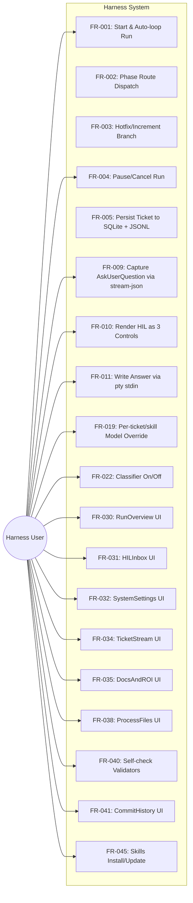
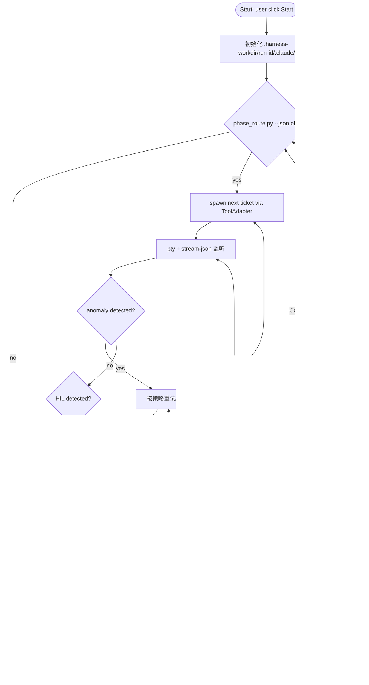
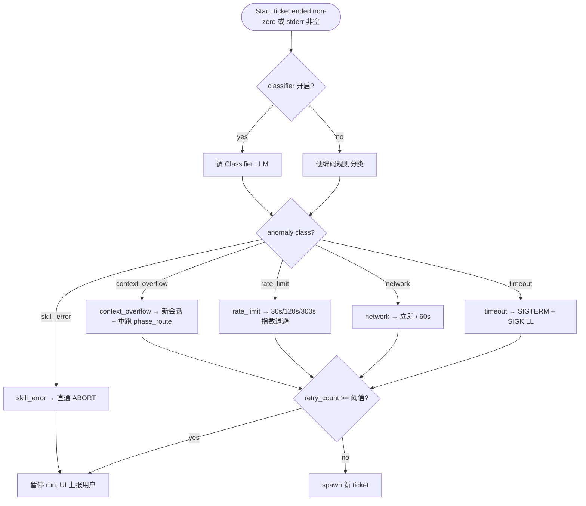

# Harness — 软件需求规约（Software Requirements Specification）

**日期（Date）**: 2026-04-21
**状态（Status）**: Approved
**参照标准（Standard）**: 对齐 ISO/IEC/IEEE 29148
**轨道（Track）**: Lite

## 1. 目的与范围（Purpose & Scope）

Harness 是一个桌面外部包裹层（external wrapper），用于在单机单用户场景下自动编排 longtaskforagent 的 14-skill long-task 管线，驱动 Claude Code 与 OpenCode 交互会话，实现从 Requirements 到 ST Go verdict 的闭环自动执行。核心价值在于消除开发者手动起会话 / 手动路由 / 手动捕捉 HIL / 手动切模型的负担，同时通过 pty 穿透保留 `AskUserQuestion` 等交互工具的阻塞式人机协作能力。

系统边界：Harness 是桌面端 PyWebView 应用（PyInstaller 单文件分发 Linux/macOS/Windows），与外部 Claude Code CLI、OpenCode CLI、`scripts/phase_route.py`、git、OpenAI-compatible LLM endpoint、平台 keyring 交互；不包含云端、多用户、CI/CD 外部触发；路由暂由 longtaskforagent 内部的 phase_route 控制，Harness 只做 orchestration / HIL 捕获 / 票据持久化 / UI 可视化。

### 1.1 范围内（In Scope）
- 自动循环驱动 longtaskforagent 14 skill（using / requirements / ucd / design / ats / init / work(含 feature-design/tdd/st 子 skill) / quality / feature-st / st / finalize / hotfix / increment / retrospective / explore / brownfield codebase-scanner subagent）
- 两个 ToolAdapter：Claude Code（交互模式 + pty 穿透）+ OpenCode（交互模式 + hooks）
- 票据系统（SQLite `tickets` 表 + append-only JSONL audit log）
- HIL 捕获 + UI 渲染（single_select / multi_select / free_text）+ pty stdin 回写原会话
- 异常分类（context_overflow / rate_limit / network / timeout / skill_error）+ 指数退避自动恢复
- 自身 Classifier（OpenAI-compatible：GLM / MiniMax / OpenAI / 自定义）可开关
- 模型三层覆写（per-ticket / per-skill / run default）
- 8 大 UI 视图：RunOverview / HILInbox / SystemSettings / PromptsAndSkills / TicketStream / DocsAndROI / ProcessFiles / CommitHistory
- 工具环境清洁隔离（`.harness-workdir/<run-id>/.claude/`，不写 `~/.claude/`）
- 过程文件结构化编辑 + 权威校验脚本集成
- 文档 ROI 下游 skill 消费链分析（side-ticket）
- 三平台 PyInstaller 分发 + 平台 keyring 存 API key

### 1.2 范围外（Out of Scope）
- 云端 / SaaS 部署（EXC-001）
- 多用户 / 团队协作（EXC-002）
- CI/CD 外部触发（webhook / REST API 开放给外部）（EXC-003）
- 移动 / 平板 UI（EXC-004）
- i18n / 国际化（仅简体中文）（EXC-005）
- Skill 自动更新 / 插件市场（EXC-006）
- 历史全文搜索（仅近 N run 保留）（EXC-007）
- 动态上移 skill 路由到 Harness（暂保持 phase_route.py 为单一事实源）（EXC-008）
- Gemini / Cursor 等其他 CLI 适配（v1 仅 Claude + OpenCode；OpenCode 的 MCP 完整适配延后 v1.1）（EXC-009）
- 已取消 run 的恢复（EXC-010）
- 同 workdir 并发多 run（filelock 互斥）（EXC-011）

延期需求记录于 [deferred backlog](2026-04-21-harness-deferred.md)。

### 1.3 问题陈述（Problem Statement）

**根因（5-Whys）**:
```
Symptom: 开发者用 longtaskforagent 执行 long-task 项目时，需要手动起多次 claude/opencode 会话，手动判断阶段路由，手动处理 AskUserQuestion，手动记录 cost/commits，效率低且易出错
Why 1: 没有一个统一的 orchestrator 驱动 14-skill 管线
Why 2: Claude Code `-p` 非交互模式下 AskUserQuestion 失效，无法简单用 subprocess pipe 做自动化
Why 3: 缺少 pty 穿透层 + stream-json 解析 + HIL UI + 票据持久化的集成方案
Root Cause: long-task 管线需要一个外部 Harness，既保留交互模式的 HIL 能力，又能自动编排、捕获、持久化、可视化，且不侵入 skill 内部
```

**Jobs-to-be-Done**: When 我要用 longtaskforagent 完成一个新项目从需求到 ST 通过的全流程，I want to 指定 workdir 点击 Start 后让 Harness 自主驱动全部 skill、在需要我回答时在 UI 中弹出问题、失败时智能重试并在无可恢复时停下来等我决策，so I can 专注于回答设计/需求层问题而不用管控会话生命周期 / 路由切换 / 模型切换 / 票据记录。

**痛点图（Pain Map）**:
| Pain Point | Current Workaround | Frequency | Severity | Score |
|---|---|---|---|---|
| 手动起 claude 会话并记 phase | 人工记日志 | 每个 skill 至少 1 次 | High | 9 |
| AskUserQuestion 在 -p 模式失效 | 改用交互模式手工回答 | 每个 HIL 点 | High | 9 |
| rate_limit / context_overflow 需手动切会话 | 人工重试 | 每次 run 数次 | Medium | 6 |
| 模型成本不可控（每票据一个 CLI 默认 model） | 手动加 --model | 每张票据 | Medium | 5 |
| 多 run 的 commits/cost/HIL 问题散落无汇总 | 自己翻 terminal log | 每次 run 全程 | Medium | 6 |

**对齐校验（Alignment Validation）**: PASS — 50 条 FR 候选全部能追溯到上述 5 个痛点之一，无孤立 FR。

## 2. 术语与定义（Glossary & Definitions）
| 术语（Term） | 定义（Definition） | 切勿混淆于（Do NOT confuse with） |
|------|-----------|---------------------|
| Harness | 本项目定义的桌面外部包裹层，驱动 longtaskforagent skill 管线 | longtaskforagent 本身（skill 集合）|
| Ticket（票据） | 一次 Claude Code 或 OpenCode 的完整交互生命周期（spawn → stream → HIL → result），Harness 最小执行单元 | HTTP ticket / support ticket |
| Run（运行） | 一个完整的从 Requirements 到 ST Go verdict 的 long-task 执行周期，由多张 ticket 组成 | 单次 CLI 调用 |
| HIL（Human-in-the-Loop） | 需要用户输入的阻塞点；来自 skill 的 AskUserQuestion / Question 工具调用 | 普通 UI 表单 |
| Classifier | Harness 自身的被动 LLM workflow，对 ticket 结果做类别识别（HIL_REQUIRED/CONTINUE/RETRY/ABORT/COMPLETED） | longtaskforagent 内部的 quality skill |
| Workdir | 目标项目的根目录，Harness 读写其中 `.harness/` 子目录 | Harness 自身进程工作目录 |
| Skill | longtaskforagent plugin 定义的 14 个阶段 skill | Claude 的内建 /命令 |
| Phase route | `scripts/phase_route.py` 的判定，Harness 的单一事实源 | Harness 内部路由 |
| 下游 skill 消费者 | 文档某节会被读取的 longtaskforagent skill 步骤（ROI 分析的 consumer） | 产品消费者 |
| ControlPlaneAdapter | 路由与过程记录的抽象 Python Protocol | ToolAdapter |
| ToolAdapter | Claude Code / OpenCode 的统一调用抽象 Python Protocol | ControlPlaneAdapter |
| Pty 穿透 | 通过伪终端包装交互 CLI 以捕获/注入 tool 调用 | 直接 subprocess.Popen |

## 3. 干系人与用户画像（Stakeholders & User Personas）
| Persona | Technical Level | Key Needs | Access Level |
|---------|----------------|-----------|--------------|
| Harness User（Harness 使用者）| 中-高（已装 Claude Code CLI 且 auth login 完成；会用 git 查看 diff；不需熟悉 longtaskforagent skill 内部细节）| 指定 workdir 启动 run；在 UI 回答 HIL；观察 phase/cost/commits 进度；编辑过程文件并校验；手动更新 skills 插件；切换模型与 classifier | 本机本用户（Localhost only，127.0.0.1）|

### 3.1 用例视图（Use Case View）



## 4. 功能需求（Functional Requirements）

### A. 自动编排（Orchestration）

### FR-001: 启动 Run 并自主循环驱动 14-skill 管线
**优先级**: Must
**EARS**: When Harness User 指定目标项目 workdir 并点击 Start, the system shall 启动自主循环驱动 longtaskforagent 14-skill 管线直至 ST Go verdict 或异常终止，且过程中不要求用户手动启动任何 claude/opencode 会话。
**可视化输出**: RunOverview 页面 phase 横向进度条从 requirements 开始推进，每张 ticket 推进时 UI 实时更新。
**验收准则**:
- Given 一个合法 git 仓库 workdir，when 用户点击 Start，then Harness 在 5s 内进入 running 状态并展示第一张 ticket
- Given ST skill 返回 Go verdict，when ticket 结束，then Harness 进入 COMPLETED 并停止循环
- Given 一个非 git 仓库的目录，when 用户点击 Start，then Harness 拒绝启动并提示 "workdir 必须是 git repo"（错误路径，来自 ASM-007 失效）
**来源**: raw_requirements A.1

### FR-002: 每张票据结束后调用 phase_route.py 决定下一张票据
**优先级**: Must
**EARS**: When 一张 ticket 进入终态（completed/failed/aborted/retrying resolved），the system shall 调用 `python scripts/phase_route.py --json` 子进程并以其 JSON 输出为下一张票据的 skill_hint 唯一事实源。
**可视化输出**: RunOverview 的 phase 进度条位置由 phase_route 输出决定，切换时 UI 跳转新阶段。
**验收准则**:
- Given 上一张 ticket 刚进入终态，when 循环器继续，then Harness 必须调用 phase_route.py 而非使用缓存或内部路由
- Given phase_route.py 返回 `{ok:true, next_skill:"long-task-design"}`，when 构造下一张 ticket，then ticket.skill_hint == "long-task-design"
- Given phase_route.py 返回 `{ok:false, errors:[...]}`，when 收到非零 exit，then Harness 暂停 run 并把错误呈现给用户（不自动继续）
**来源**: raw_requirements A.2

### FR-003: 检测 hotfix/increment 信号文件并自动进入对应分支
**优先级**: Must
**EARS**: When `bugfix-request.json` 或 `increment-request.json` 信号文件在 workdir 中出现, the system shall 透过 phase_route 的路由自动进入 hotfix 或 increment skill 分支，而无需用户手动切换。
**可视化输出**: RunOverview 横向进度条在 hotfix/increment 被命中时显示额外分支条，并高亮当前分支。
**验收准则**:
- Given `bugfix-request.json` 存在，when phase_route 判定 next_skill=long-task-hotfix，then Harness dispatch 对应 ticket
- Given 两个信号文件同时存在，when phase_route 按其策略决定优先级，then Harness 忠实执行其判定，不做二次决策
**来源**: raw_requirements A.3

### FR-004: Run 支持主动 Pause / Cancel
**优先级**: Must
**EARS**: When Harness User 在 UI 点击 Pause 或 Cancel, the system shall 在当前 ticket 结束点暂停或取消 run；取消后所有已产生票据保留在 SQLite 并可在 Run 历史查看；且不支持恢复已取消的 run。
**可视化输出**: RunOverview 顶部出现 "Paused" / "Cancelled" 状态横幅；Run 历史列表该 run 标签变灰。
**验收准则**:
- Given run 处于 running，when 用户点击 Pause，then 当前 ticket 完成后 Harness 进入 paused 状态不调 phase_route
- Given run 被 Cancel，when 用户之后进入 Run 历史，then 能看到该 run 所有 ticket 只读快照
- Given run 被 Cancel，when 用户尝试 Resume，then UI 禁用 Resume 按钮（v1 MVP 不支持恢复）
**来源**: raw_requirements A.4

### B. 票据系统（Ticket）

### FR-005: 票据持久化到 SQLite 单表 + JSONL audit log
**优先级**: Must
**EARS**: When 一张 ticket 的任何状态字段发生变化, the system shall 将完整 ticket payload 写入 SQLite 单表 `tickets`（JSON1 列存 payload）并 append 一条 JSON 对象到该 run 的 append-only audit JSONL 文件。
**可视化输出**: N/A — backend-only（TicketStream UI 从 SQLite 读取）
**验收准则**:
- Given ticket 从 pending 转 running，when Harness 写库，then SQLite 对应行 updated_at 更新且 JSONL 文件多一行 `{ts, ticket_id, state_from, state_to}`
- Given Harness 进程崩溃后重启，when 读 SQLite，then 未完成 ticket 可见且标记 interrupted（支持 FR-NFR Reliability）
**来源**: raw_requirements B.5

### FR-006: 票据状态机
**优先级**: Must
**EARS**: While 一张 ticket 存在, the system shall 强制状态转换遵循 `pending → running → classifying → {hil_waiting | completed | failed | aborted | retrying}` 且拒绝非法跳转。
**可视化输出**: TicketStream 左侧时间线以枚举色彩显示状态历次变化。
**验收准则**:
- Given ticket 在 pending，when 尝试直接跳 completed，then Harness 拒绝并抛错
- Given ticket 在 hil_waiting，when 用户答完，then 状态转 classifying 后续由 classifier 决定终态
**来源**: raw_requirements B.6

### FR-007: 票据字段覆盖核心元数据
**优先级**: Must
**EARS**: The system shall 为每张 ticket 记录至少以下字段: id, run_id, parent_ticket, depth (≤2), tool (claude|opencode), skill_hint, state, dispatch (prompt/argv/env/cwd/model/mcp_config/plugin_dir/settings_path), execution (pid/started_at/ended_at/exit_code/duration_ms/cost_usd), output (result_text/stream_log_ref/session_id), hil (detected/source/questions[]/answers), anomaly (class/detail/retry_count), classification (verdict/reason), git (head_before/head_after/commits[])。
**可视化输出**: TicketStream 卡片右侧展开可看到全部字段；PromptsAndSkills 只读；RunOverview cost_usd 汇总。
**验收准则**:
- Given 一张已结束的 ticket，when 查询 SQLite 该行，then 列出字段全部可读取（缺失字段为 null 而非不存在）
- Given ticket 嵌套深度 > 2，when Harness 尝试 spawn 子 ticket，then 拒绝并上报（防无限递归）
**来源**: raw_requirements B.7

### C. HIL（Human-in-the-Loop）

### FR-008: 用交互模式 + pty 包装运行 Claude Code
**优先级**: Must
**EARS**: The system shall 通过交互模式（而非 `-p` 非交互）+ pty 包装运行 Claude Code，以使 AskUserQuestion 工具可被捕获并响应。
**可视化输出**: N/A — backend-only
**验收准则**:
- Given Harness 启动一张 claude ticket，when 观察进程，then 它是 pty 子进程且 argv 不含 `-p`
- Given pty 通道建立，when skill 调用 AskUserQuestion，then stream-json 中能看到对应 tool_use 事件
**来源**: raw_requirements C.8

### FR-009: 监听 stream-json 捕获 AskUserQuestion
**优先级**: Must
**EARS**: While 交互 ticket 处于 running, the system shall 解析 stream-json 输出并识别 `AskUserQuestion` 工具调用，提取 questions[] 数组中的 header/question/options/multiSelect/allowFreeformInput 字段。
**可视化输出**: 捕获成功时 TicketStream 对应 ticket 卡片时间线出现 "HIL" 节点。
**验收准则**:
- Given stream-json 中出现 `{type:"tool_use", name:"AskUserQuestion"}`，when 解析器处理，then ticket.hil.detected=true 且 questions[] 非空
- Given 问题 JSON 缺字段（如无 options），when 解析，then 用默认值补齐并记录 warning
**来源**: raw_requirements C.9

### FR-010: UI 渲染 3 种 HIL 控件
**优先级**: Must
**EARS**: When 一张 ticket 进入 hil_waiting 状态, the system shall 在 HILInbox UI 中把每个 question 按类型渲染为 single_select（Radio）/ multi_select（Checkbox）/ free_text（Textarea）其中一种，类型由 options 数量 + multiSelect 标志 + allowFreeformInput 标志推导。
**可视化输出**: HILInbox 中该 ticket 卡片显示对应控件；用户可看到 header 粗体 + question + options。
**验收准则**:
- Given multiSelect=false 且 options.length>=2，when UI 渲染，then 使用 Radio
- Given multiSelect=true，when UI 渲染，then 使用 Checkbox
- Given allowFreeformInput=true 且 options.length==0，when UI 渲染，then 使用 Textarea
- Given allowFreeformInput=true 且 options.length>0，when UI 渲染，then Radio/Checkbox + 附加 "其他…" free 输入
**来源**: raw_requirements C.10

### FR-011: 通过 pty stdin 回写原交互会话
**优先级**: Must
**EARS**: When Harness User 在 HILInbox 提交答案, the system shall 通过原 ticket 的 pty stdin 写回格式化回答让原会话续跑，而不是启动新会话。
**可视化输出**: 提交后 TicketStream 该 ticket 时间线出现 "Answered" 节点；stream-json 继续产出新事件。
**验收准则**:
- Given 一个 hil_waiting ticket，when 答案写入 stdin，then 同一个 pid 继续产出后续 stream-json 事件
- Given 原会话已崩溃或 pty 已关闭，when 尝试写入，then Harness 标记 ticket failed 并把 HIL 答案保留（便于重试时重放）
**来源**: raw_requirements C.11

### FR-012: OpenCode HIL 通过 hooks 机制捕获 Question 工具
**优先级**: Must
**EARS**: While OpenCode ticket 处于 running, the system shall 通过 OpenCode hooks 机制捕获 Question 工具调用并以与 Claude 相同的 schema 渲染到 HILInbox，同样通过 stdin 回传答案到原会话。
**可视化输出**: HILInbox 中 OpenCode ticket 与 Claude ticket 在 UI 层无差别呈现（tool 字段区分来源）。
**验收准则**:
- Given OpenCode hooks 注册成功，when skill 调用 Question 工具，then Harness 收到事件且生成 HIL 控件
- Given hooks 因 OpenCode 版本不兼容注册失败，when Harness 启动 ticket，then ticket 立即 failed 并提示用户升级 OpenCode
**来源**: raw_requirements C.12

### FR-013: HIL pty 穿透 Proof of Concept
**优先级**: Must
**EARS**: The system shall 在 v1 MVP 阶段先产出可行性原型（PoC）验证 Claude Code 的 AskUserQuestion 在 pty 穿透 + stdin 回写机制下能稳定工作，PoC 报告须记录 20 次 HIL 循环成功率 ≥ 95%。
**可视化输出**: N/A — backend-only（PoC 报告以 markdown 形式归档在 docs/poc/）
**验收准则**:
- Given PoC 脚本独立运行 20 次模拟 HIL，when 统计结果，then 成功率 ≥ 95%
- Given PoC 失败率 > 5%，when 进入 v1 开发，then 冻结 HIL 相关 FR 并上报用户重新决策（防止基于错误假设开发）
**来源**: raw_requirements C.13

### FR-014: Skill 终止横幅与未答 HIL 冲突时 HIL 优先
**优先级**: Must
**EARS**: If 一张 ticket 同时出现 skill 终止横幅和未答 HIL 问题, then the system shall 优先暂停并收集 HIL 答案，在答完后重跑 phase_route 而非直接结束 ticket。
**可视化输出**: TicketStream 该卡片同时显示 "terminated banner" + "hil_waiting"，answered 后 "rerunning phase_route"。
**验收准则**:
- Given ticket 末尾同时出现 "# 终止" 横幅和未答 AskUserQuestion，when 解析器处理，then 状态走 hil_waiting 而非 completed
- Given HIL 答完，when Harness 继续，then 调用 phase_route 而非假设下一 skill
**来源**: raw_requirements C.14

### D. 工具适配（Tool Adapter）

### FR-015: ToolAdapter 接口定义
**优先级**: Must
**EARS**: The system shall 提供 `ToolAdapter` Python Protocol，方法签名包含: `build_argv(dispatch)`, `spawn(dispatch)`, `extract_hil(ticket)`, `parse_result(raw)`, `detect_anomaly(ticket)`, `supports(capability)`。
**可视化输出**: N/A — backend-only
**验收准则**:
- Given Protocol 定义文件，when mypy 静态检查 ClaudeCodeAdapter + OpenCodeAdapter，then 符合 Protocol
- Given 未来新增 GeminiAdapter（示例），when 实现同 Protocol，then orchestrator 无需改动
**来源**: raw_requirements D.15

### FR-016: ClaudeCodeAdapter argv 构造
**优先级**: Must
**EARS**: When 为 Claude Code ticket 构造 argv, the system shall 按交互模式包含以下 flags: `--dangerously-skip-permissions`, `--output-format stream-json --include-partial-messages`, `--plugin-dir <bundle>`, `--mcp-config <json> --strict-mcp-config`, `--settings <json>`, `--setting-sources user,project`（排除 local）, 以及可选 `--model <alias>`。
**可视化输出**: TicketStream 卡片 dispatch.argv 字段可看到完整命令行。
**验收准则**:
- Given 一个 dispatch 请求，when ClaudeCodeAdapter.build_argv，then argv 中必含上述所有必选 flag
- Given dispatch 未指定 model，when build_argv，then argv 不含 `--model`（交由 CLI 默认）
**来源**: raw_requirements D.16

### FR-017: OpenCodeAdapter argv + hooks
**优先级**: Must
**EARS**: When 为 OpenCode ticket 构造 argv, the system shall 按交互模式构造 `opencode [--model <alias>] [--agent <name>]` 并在启动前写入 hooks 配置以拦截 Question 工具；且 v1 对 OpenCode 的 MCP 完整适配延后到 v1.1。
**可视化输出**: N/A — backend-only
**验收准则**:
- Given OpenCode dispatch，when build_argv，then argv 含 `opencode` 起首且包含可选 model/agent
- Given v1 版本，when 用户指定 mcp_config，then OpenCode ticket 降级并在 UI 提示 "OpenCode MCP 延后 v1.1"
**来源**: raw_requirements D.17

### FR-018: 适配器接口稳定性
**优先级**: Should
**EARS**: The system shall 保持 ToolAdapter 接口签名稳定，新增 provider 仅需实现同 Protocol 而不改 orchestrator 代码。
**可视化输出**: N/A — backend-only
**验收准则**:
- Given 一个 provider mock 实现了 Protocol 全部 6 方法，when 注册到 orchestrator，then 能被正常 dispatch
**来源**: raw_requirements D.18

### E. 模型资源（Models）

### FR-019: per-ticket / per-skill 模型覆写
**优先级**: Must
**EARS**: The system shall 支持在 SystemSettings 中配置 per-ticket 与 per-skill 的模型覆写规则，例如 `requirements` skill 默认 opus、`work` skill 默认 sonnet，并在 UI 中以规则表呈现可编辑。
**可视化输出**: SystemSettings 模型规则表列出 (skill → model) 映射；新建/编辑后立即生效。
**验收准则**:
- Given per-skill 映射 `requirements=opus`，when dispatch 一张 requirements ticket，then argv 含 `--model opus`
- Given 同时存在 per-ticket 与 per-skill 规则，when 构造 argv，then 按 FR-020 优先级链选择
**来源**: raw_requirements E.19

### FR-020: 模型配置三层优先级
**优先级**: Must
**EARS**: When 为一张 ticket 选择 model, the system shall 按 per-ticket > per-skill > run-level default > provider default（省略 --model）优先级链决定最终值。
**可视化输出**: TicketStream 卡片 dispatch.model 字段显示最终选择 + tooltip 说明来源层级。
**验收准则**:
- Given 仅 run-level default 设置，when dispatch，then argv 含该 model
- Given 四层都未设置，when dispatch，then argv 不含 --model（交 CLI）
- Given per-ticket 覆写优先于 per-skill，when 两者都设置，then per-ticket 胜出
**来源**: raw_requirements E.20

### FR-021: Classifier OpenAI-compatible endpoint 支持
**优先级**: Must
**EARS**: The system shall 支持 Classifier 连接任意 OpenAI-compatible 聊天 completion endpoint（内置 GLM / MiniMax / OpenAI.com 预设，另支持自定义 endpoint），配置项包含 base_url / api_key / model_name。
<!-- Wave 3: Extended 2026-04-25 — 新增 Provider capability 位 `supports_strict_schema`（GLM/OpenAI/custom=True；MiniMax=False）；ClassifierConfig 新增 `strict_schema_override: bool | None` 运行时覆写（参见 design §6.2.4） -->
**EARS（Wave 3 extension）**: The system shall 在 ProviderPreset 数据结构中包含 `supports_strict_schema: bool` 能力位 (GLM/OpenAI/custom=True, MiniMax=False); ClassifierConfig 增 `strict_schema_override: bool | None = None`，None 沿用 preset，True/False 运行时覆写。
**可视化输出**: SystemSettings Classifier 卡片有三个字段 + provider 预设下拉。
**验收准则**:
- Given 选中 GLM 预设，when 保存，then base_url 自动填为 GLM 官方；api_key 从 keyring 读
- Given 自定义 endpoint，when 保存空 base_url，then 前端阻止提交并红色提示
- AC-4 (Wave 3): Given preset='minimax' when ProviderPresets.resolve then supports_strict_schema=False
- AC-5 (Wave 3): Given preset ∈ {glm,openai,custom} when resolve then supports_strict_schema=True
- AC-6 (Wave 3): Given strict_schema_override=False + preset.supports_strict_schema=True when 计算 effective_strict then 取覆写值 False
**来源**: raw_requirements E.21; Wave 3 增量 (2026-04-25 MiniMax 兼容)

### FR-022: Classifier 开关 + 硬编码规则降级
**优先级**: Must
**EARS**: Where Classifier 开关被用户关闭, the system shall 使用硬编码规则（exit_code / stderr 正则 / permission_denials / 终止横幅）替代 LLM 分类判定票据类别。
**可视化输出**: SystemSettings 有 Classifier On/Off toggle；Off 时 TicketStream 卡片 classification.reason 显示 "rule-based"。
**验收准则**:
- Given Classifier Off，when ticket 结束 exit_code=0 且无终止横幅，then 硬编码规则判 COMPLETED
- Given Classifier Off，when stderr 含 "context window"，then 判 context_overflow 类
**来源**: raw_requirements E.22

### FR-023: Classifier 启用时固定 Schema JSON 输出
**优先级**: Must
**EARS**: While Classifier 启用, the system shall 按固定 System Prompt 做无状态单次分类，使用 response_format=json_schema 强制返回 `{verdict: HIL_REQUIRED|CONTINUE|RETRY|ABORT|COMPLETED, reason, anomaly, hil_source}` 严格 JSON。
<!-- Wave 3: Extended 2026-04-25 — strict-off 模式用 prompt-only JSON 约束；对所有 provider 统一应用容错解析（<think> 剥离 + 首个平衡 JSON 提取）；解析失败走 RuleBackend 兜底 -->
**EARS（Wave 3 extension — strict-off path）**: When effective_supports_strict_schema=False, the LlmBackend shall 不发送 `response_format` 字段；改为在 system message 末尾追加固定 JSON-only suffix；HTTP method/URL/Authorization header 与 strict-on 路径完全一致。
**EARS（Wave 3 extension — tolerant parse）**: The system shall 对所有 provider 的 LLM 响应内容应用容错解析（不论 strict on/off）：剥离 `<think>...</think>` 包裹的推理段；提取首个语法平衡 JSON 对象；解析失败仍走 RuleBackend 兜底（IAPI-010 永不抛保留）。
**可视化输出**: TicketStream 卡片 classification 字段显示 verdict + reason。
**验收准则**:
- Given LLM 返回非合法 JSON，when 解析失败，then 降级到硬编码规则且在 audit log 记 warning
- Given LLM 返回合法 JSON 但 verdict 不在枚举，then 降级并记 warning
- AC-3 (Wave 3): Given effective strict-off when LlmBackend.invoke then request body 不含 'response_format' 键；system message = PromptStore.current + 固定 JSON-only suffix
- AC-4 (Wave 3): Given strict-off + LLM 返合法 JSON when parse then Verdict(backend='llm') verdict ∈ enum
- AC-5 (Wave 3): Given content='<think>x</think>{...}' when parse then 提取后段合法 JSON 解析成功
- AC-6 (Wave 3): Given content 含多个 JSON 段 when parse then 取首个语法平衡对象
- AC-7 (Wave 3): Given content 无可提取 JSON when parse then ClassifierProtocolError(cause='json_parse_error') → FallbackDecorator 兜底 rule（audit 记 classifier_fallback）
**来源**: raw_requirements E.23; Wave 3 增量 (2026-04-25 MiniMax 兼容 + tolerant parse)

### F. 异常处理（Anomaly）

### FR-024: context_overflow 识别与恢复
**优先级**: Must
**EARS**: If stderr 或 result_text 含 `context window` / `exceeded max tokens` / `token limit` 之一, then the system shall 标记 anomaly.class=context_overflow 并自动切新会话 + 重跑 phase_route；同一 skill 连续 3 次命中后上报用户不再自动重试。
**可视化输出**: TicketStream 异常节点显示 "context_overflow 重试中 N/3"；达到 3 次后显示红色 "上报用户"。
**验收准则**:
- Given stderr 含匹配字符串，when classifier 判定，then 自动 spawn 新 ticket 继承 skill_hint 且 retry_count+1
- Given 同 skill 第 3 次命中，when 继续，then 暂停 run 并在 UI 提示
**来源**: raw_requirements F.24

### FR-025: rate_limit / overloaded 指数退避
**优先级**: Must
**EARS**: If stderr 含 `rate limit` / `overloaded` / HTTP 429, then the system shall 按指数退避（30s, 120s, 300s）最多 3 次自动重试，第 4 次上报用户。
**可视化输出**: TicketStream 异常节点显示 "下次重试倒计时 MM:SS"。
**验收准则**:
- Given 首次 rate_limit，when 恢复，then 30s 后 spawn 新 ticket
- Given 第 4 次 rate_limit，when 判定，then 暂停并上报
**来源**: raw_requirements F.25

### FR-026: network 异常识别与恢复
**优先级**: Must
**EARS**: If stderr 含 `ECONNREFUSED` / `connection reset` / DNS 错误 或 exit_code 非零且 stderr 空, then the system shall 按立即重试 1 次 → 退避 60s 1 次 → 仍失败则上报。
**可视化输出**: TicketStream 异常节点显示 network 图标 + 当前重试阶段。
**验收准则**:
- Given 首次 network 异常，when 恢复，then 立即 spawn 新 ticket
- Given 第二次仍失败，when 恢复，then 60s 后 spawn
- Given 第三次仍失败，when 恢复，then 上报
**来源**: raw_requirements F.26

### FR-027: 单 ticket watchdog timeout
**优先级**: Must
**EARS**: While 一张 ticket 处于 running, the system shall 按默认 30 分钟的 watchdog 在超时后 SIGTERM 进程，5s 后仍存活则 SIGKILL。
**可视化输出**: TicketStream 卡片倒计时条；超时时卡片红色标注 "timeout"。
**验收准则**:
- Given ticket 运行 30 分钟仍未结束，when watchdog 触发，then 发 SIGTERM
- Given SIGTERM 5s 后进程仍存活，when watchdog 二次触发，then 发 SIGKILL
**来源**: raw_requirements F.27

### FR-028: skill_error 直通 ABORT 不自动重试
**优先级**: Must
**EARS**: If result_text 含 `[CONTRACT-DEVIATION]` 前缀, then the system shall 直通 ABORT 状态且不自动重试，并向用户呈现原始输出。
**可视化输出**: TicketStream 卡片红色 banner "skill_error — 需人工审查"；ABORT 按钮禁用自动恢复。
**验收准则**:
- Given result_text 首行含 `[CONTRACT-DEVIATION]`，when classifier 判定，then ticket.state=aborted 且 anomaly.class=skill_error
- Given skill_error，when 循环器继续，then 暂停 run 等待用户决定
**来源**: raw_requirements F.28

### FR-029: 异常可视化 + 手动控制
**优先级**: Must
**EARS**: The system shall 在 UI 中可视化每张 ticket 的异常分类、当前重试次数、下次尝试倒计时，并提供手动 Skip / Force-Abort 按钮。
**可视化输出**: TicketStream 卡片异常详情面板含上述 4 个元素。
**验收准则**:
- Given 用户点击 Skip，when ticket 在 retrying，then Harness 跳过该 ticket 并调 phase_route
- Given 用户点击 Force-Abort，when ticket 在任一非终态，then ticket 立即 aborted
**来源**: raw_requirements F.29

### G. UI / 可视化

### FR-030: RunOverview 界面
**优先级**: Must
**EARS**: The system shall 提供 RunOverview 界面显示当前 run 的 phase 横向进度条（requirements → ucd → design → ats → init → work(N/M features) → st → finalize）、当前 skill、当前 feature id/title、累计 cost_usd / num_turns、git HEAD 推进轨迹。
**可视化输出**: 单页面含所列 6 元素，实时刷新。
**验收准则**:
- Given 一个 running run，when 用户打开 RunOverview，then 以上 6 元素可见且 cost 总和 = Σ ticket.cost_usd
- Given run 进入 work 阶段第 3/8 feature，when 渲染，then 显示 "work 3/8"
**来源**: raw_requirements G.30

### FR-031: HILInbox 界面
**优先级**: Must
**EARS**: The system shall 提供 HILInbox 界面列出所有 state=hil_waiting 的 ticket 卡片，点开卡片渲染其 HIL 问题（single/multi/free 控件），提交答案后该卡片转为已答状态。
**可视化输出**: Inbox 列表 + 卡片详情 + 已答标记。
**验收准则**:
- Given 3 张 hil_waiting ticket，when 打开 HILInbox，then 列出 3 张卡片
- Given 用户提交答案，when 请求完成，then 卡片变 answered 状态且 ticket 状态推进
**来源**: raw_requirements G.31

### FR-032: SystemSettings 界面
**优先级**: Must
**可视化输出**: 分区表单，API key 字段显示 `***abc` 形式。
**验收准则**:
- Given 用户输入 API key，when 保存，then keyring 存原文且 UI 下次打开显示 masked
**来源**: raw_requirements G.32

### FR-033 (v1 仅基础编辑): PromptsAndSkills 界面
**优先级**: Should
**EARS**: The system shall 提供 PromptsAndSkills 界面只读展示 `plugins/longtaskforagent/skills/*/SKILL.md`（markdown 高亮 + YAML frontmatter）；Harness 自身 `classifier/system_prompt.md` 可编辑且带版本历史（diff 列表）。
**可视化输出**: 左侧 skill 树 + 右侧内容渲染；classifier prompt 有 Edit 按钮和历史版本对比。
**验收准则**:
- Given skill 目录，when 打开页面，then 树形列出所有 SKILL.md 且点击显示内容只读
- Given 编辑 classifier prompt 并保存，when 重新打开，then 版本历史多一条
**来源**: raw_requirements G.33

### FR-033b: Classifier Prompt 版本历史与 Diff 视图
**优先级（Priority）**: Won't (v1) — 延后至 v1.1
**EARS**: When the user edits `classifier/system_prompt.md`, the system shall preserve version history and present a side-by-side diff viewer.
**可视化输出**: 版本树 + inline diff highlight
**验收准则**: 延到 v1.1 SRS 补完整 AC。v1 验收范围不覆盖本项。

### FR-034: TicketStream 界面
**优先级**: Must
**EARS**: The system shall 提供 TicketStream 界面，每张 ticket 一张卡片，左侧时间线（spawn → running → HIL → result）右侧 stream-json 展开树（tool_use / tool_result / text 三类事件折叠展开），并支持按 state / run / parent_ticket / tool 筛选。
**可视化输出**: 两栏卡片；筛选栏在顶部。
**验收准则**:
- Given 筛选 tool=claude，when 应用，then 仅列出 claude ticket
- Given stream-json 有 100 事件，when 展开，then 按三类分组折叠
**来源**: raw_requirements G.34

### FR-035 (v1 仅文件树 + Markdown 预览): DocsAndROI 界面
**优先级**: Should
**可视化输出**: 左树 + 右 markdown 预览 + ROI 按钮。
**验收准则**:
- Given 选中 SRS §4.1 节，when 点击 ROI 按钮，then 右侧显示 ROI 面板（由 FR-036/037 生成）
**来源**: raw_requirements G.35

### H. 文档 ROI 分析

### FR-035b: ROI 面板入口
**优先级（Priority）**: Won't (v1) — 延后至 v1.1
**EARS**: When the user selects a document section in DocsAndROI, the system shall expose a "Run ROI Analysis" button that dispatches a side-ticket.
**验收准则**: 延到 v1.1 SRS 补完整 AC。v1 验收范围不覆盖本项。

### FR-036: ROI 下游 skill 消费链分析
**优先级**: Should
**EARS**: When 用户在 DocsAndROI 中选定文档章节并触发 ROI 分析, the system shall 识别该节被哪些 longtaskforagent 下游 skill 在哪些步骤读取消费（如 `long-task-design Step 3`、`long-task-ats Step 2`、`long-task-feature-design Step 4`、`long-task-tdd Red Step`、`long-task-feature-st Case 1-3`）。
**可视化输出**: ROI 面板列表展示 consumer skill + step + 引用行号。
**验收准则**:
- Given SRS §4.1 FR-001，when 分析完成，then 列出 ≥1 consumer（否则 orphan）
**来源**: raw_requirements H.36

### FR-037: ROI 由 side-ticket 执行并缓存
**优先级**: Should
**EARS**: The system shall 将 ROI 分析作为专用 side-ticket（独立 claude 会话 + 指定 system prompt 分析 skill 消费者 + 引用章节 + 给出 `roi_verdict: kept | candidate_for_trim | orphan`）执行；结果缓存到 `docs/roi/<doc>-roi.json` 避免重复计算。
**可视化输出**: ROI 面板首次触发时显示 "analyzing…"，缓存命中时即时显示。
**验收准则**:
- Given 首次分析 SRS，when side-ticket 完成，then `docs/roi/srs-roi.json` 文件产生
- Given 二次打开同一节，when 读缓存，then 即时显示且不 spawn 新 ticket
**来源**: raw_requirements H.37

### I. 过程文件编辑 + 自检

**补充说明**: 失效策略采用混合模式 —— (a) file watcher 观察到源文档（SRS / design / ATS / UCD / feature-list.json）变更时自动将缓存标记为 `outdated`；(b) 用户必须在 UI 主动点击 Refresh 才真正重算新 ROI。避免文档编辑期间无意触发高 LLM 成本。

### FR-038: ProcessFiles 界面结构化表单
**优先级**: Must
**EARS**: The system shall 提供 ProcessFiles 界面，对 workdir 下的 `feature-list.json` / `env-guide.md` / `long-task-guide.md` / `.env.example` 等关键过程文件提供结构化表单编辑。
**可视化输出**: 文件选择 → 表单视图 + raw 视图切换按钮。
**验收准则**:
- Given `feature-list.json` schema，when 打开表单，then 字段按 schema 分组呈现
**来源**: raw_requirements I.38

### FR-039: 过程文件前端+后端双层校验
**优先级**: Must
**EARS**: While 用户在 ProcessFiles 表单中编辑, the system shall 实时（onChange）执行前端结构校验（字段类型/必填）；保存时调用后端权威校验脚本（如 `scripts/validate_features.py`）集中校验并以 inline 红色显示错误。
**可视化输出**: 字段右侧红色圈 + 错误消息；保存后总结面板。
**验收准则**:
- Given 必填字段空，when onChange，then 字段红色且 Save 按钮禁用
- Given 前端通过但后端报错（跨字段校验），when 保存，then 错误列表内联显示
**来源**: raw_requirements I.39

### FR-040: 关键过程文件自检按钮
**优先级**: Must
**EARS**: The system shall 为每个关键过程文件提供自检按钮，触发对应权威脚本（`validate_features.py` / `validate_guide.py` / `check_configs.py` / `check_st_readiness.py`）并返回结构化校验报告。
**可视化输出**: 按钮点击后面板展示 PASS/FAIL + 各规则结果。
**验收准则**:
- Given 合法 feature-list.json，when 点自检，then 面板显示 PASS
- Given 脚本崩溃（exit 非零且 stderr 非空），when 呈现，then 错误详情不被吞
**来源**: raw_requirements I.40

### J. 提交记录 + Diff

### FR-041: CommitHistory 界面
**优先级**: Must
**EARS**: The system shall 提供 CommitHistory 界面显示每个 run 每个 feature 完成后的 git commits 列表，点击 commit 显示 `git show --stat` + 文件 diff（web diff viewer），并支持按 feature / run 过滤。
**可视化输出**: 列表 + diff viewer 两栏。
**验收准则**:
- Given run 完成 5 个 feature 产生 8 commits，when 打开页面，then 列表显示 8 条
- Given 选中一个 commit，when 右侧 diff viewer，then 显示文件级 diff
**来源**: raw_requirements J.41

### FR-042: Ticket 级 git 记录
**优先级**: Must
**EARS**: When 一张 ticket 结束, the system shall 用 `git rev-parse HEAD` 和 `git log --oneline` 记录 head_before / head_after / commits[] 到 ticket.git 字段；feature 完成 ticket 额外关联 feature_id 与 git_sha。
**可视化输出**: TicketStream 卡片 git 字段展示 HEAD 推进。
**验收准则**:
- Given ticket 期间有 2 个 commit，when 结束，then ticket.git.commits 长度=2 且 head_after != head_before
- Given feature 完成 ticket，when 查 SQLite，then feature_id 非空且 git_sha == head_after
**来源**: raw_requirements J.42

### K. 环境清洁 + Skills 管理

### FR-043: 不写入用户 ~/.claude/
**优先级**: Must
**EARS**: While Harness 运行, the system shall 不写入用户 `~/.claude/` 目录；所有临时 Claude 配置放于 `.harness-workdir/<run-id>/.claude/{settings.json, mcp.json, plugins/longtaskforagent(symlink)}`。
**可视化输出**: N/A — backend-only（SystemSettings 展示隔离目录路径）
**验收准则**:
- Given Harness 启动一次 run，when 检查 `~/.claude/`，then 其内容未被修改（mtime 保持）
- Given symlink 指向 bundle，when CLI 读 plugin，then 能正常加载
**来源**: raw_requirements K.43

### FR-044: workdir 只读写 .harness/ 子目录
**优先级**: Must
**EARS**: While Harness 运行, the system shall 保持目标项目 workdir 原样，仅读写项目内 `.harness/` 子目录（SQLite、audit logs、ticket 原始流存档）。
**可视化输出**: N/A — backend-only
**验收准则**:
- Given 一次 run 结束，when 对比 workdir 的 non-.harness 文件，then 未出现 Harness 的临时文件（除非 skill 自身写的文件）
**来源**: raw_requirements K.44

### FR-045: Skills 快速安装 / 手动更新
**优先级**: Must
**EARS**: The system shall 在 UI "Skills 管理" 页面支持指向本地目录或 git repo URL 并点击按钮执行 `git clone` 或 `git pull` 将 longtaskforagent 副本更新到 `plugins/longtaskforagent/`；不做自动更新。
**可视化输出**: 页面显示当前版本 + 来源 + Pull/Clone 按钮。
**验收准则**:
- Given 指向 git URL，when 点击 Clone，then 目录生成且 UI 显示 commit sha
- Given 本地目录已经存在，when 点击 Pull，then 执行 `git -C ... pull` 并显示结果
**来源**: raw_requirements K.45

### FR-046: 继承 claude auth login 凭证
**优先级**: Must
**EARS**: The system shall 继承用户机器 `claude auth login` 凭证运行 Claude Code，不单独管理 Anthropic API key。
**可视化输出**: SystemSettings 中 Claude 账号区域显示 "使用系统 claude auth login（只读）"。
**验收准则**:
- Given 用户已 claude auth login，when Harness 启动 claude ticket，then 不额外提示 API key
- Given 用户未 auth，when ticket 启动，then CLI 自身报错并被 Harness 捕获为 skill_error 上报
**来源**: raw_requirements K.46

### L. 全 skill 覆盖

### FR-047: 驱动全部 14 longtaskforagent skill
**优先级**: Must
**EARS**: The system shall 在 v1 能驱动 longtaskforagent 全部 skill: using-long-task, requirements, ucd, design, ats, init, work（含 feature-design / tdd / st 子 skill）, quality, feature-st, st, finalize, hotfix, increment, retrospective, explore, brownfield codebase-scanner subagent。
**可视化输出**: RunOverview phase 进度条涵盖全部 phase；SystemSettings 展示 skill 清单。
**验收准则**:
- Given 一个完整 run，when 全流程跑完，then 实际 dispatch 过的 skill 名集合 ⊇ 14-skill 必要子集
- Given 新 skill 被加入 longtaskforagent（未来），when phase_route 返回其名，then Harness 能 dispatch 而不硬编码
**来源**: raw_requirements L.47

### FR-048: 信号文件感知
**优先级**: Must
**EARS**: The system shall 感知以下信号文件路径变更（inotify/fswatch/polling）: `bugfix-request.json`, `increment-request.json`, `feature-list.json`, `docs/plans/*-srs.md` / `-ucd.md` / `-design.md` / `-ats.md` / `-st-report.md`, `docs/rules/*.md`，并在 UI 中反映。
**可视化输出**: DocsAndROI 树中新增文件出现 "NEW" 徽章；RunOverview 在 bugfix/increment 信号出现时闪烁提示。
**验收准则**:
- Given 用户外部编辑新增 `bugfix-request.json`，when watcher 触发，then 2s 内 UI 可见
**来源**: raw_requirements L.48

### M. 分发

### FR-049: PyInstaller 三平台单文件打包
**优先级**: Must
**EARS**: The system shall 用 PyInstaller 打包为 Linux / macOS / Windows 三平台各一份单文件可执行，包含 Python 3.11+ 运行时和内嵌 React dist。
**可视化输出**: N/A — distribution-only
**验收准则**:
- Given 在无 Python 的 Linux，when 运行二进制，then 能启动 UI
- Given 在 macOS Apple Silicon，when 运行，then 能启动 UI（或明确提示平台变体需要）
**来源**: raw_requirements M.49

### FR-050: 首次启动自动建 ~/.harness/ 与 keyring secrets
**优先级**: Must
**EARS**: When 首次启动 Harness, the system shall 自动创建 `~/.harness/` 目录存配置，且通过平台 keyring（macOS Keychain / freedesktop Secret Service / Windows Credential Manager）存取 LLM provider API key。
**可视化输出**: 首次启动弹窗 "Welcome, 已初始化 ~/.harness/"。
**验收准则**:
- Given 首次启动，when 结束，then `~/.harness/config.json` 存在
- Given 用户保存 API key，when 查配置文件，then 配置文件不含明文 key（仅 keyring 引用）
**来源**: raw_requirements M.50

### 4.1 流程图（Process Flows）

#### Flow: Run 主循环与 phase_route 调度



#### Flow: HIL 捕获与回写

```mermaid
flowchart TD
    S([Start: ticket running in pty])
    Evt[stream-json 事件到达]
    Tu{tool_use == AskUserQuestion 或 OpenCode Question?}
    Parse[解析 questions[] 字段]
    Derive{导出控件类型 multiSelect+options+allowFreeform}
    Single[single_select Radio]
    Multi[multi_select Checkbox]
    Free[free_text Textarea]
    Persist[写 ticket.hil.questions + state=hil_waiting]
    UserAns([User 提交答案])
    Validate{答案合法?}
    Retry[UI 红色错误并保持等待]
    Write[pty stdin 写回原会话]
    Continue([Stream 续跑])

    S --> Evt --> Tu
    Tu -- no --> Evt
    Tu -- yes --> Parse --> Derive
    Derive --> Single
    Derive --> Multi
    Derive --> Free
    Single --> Persist
    Multi --> Persist
    Free --> Persist
    Persist --> UserAns --> Validate
    Validate -- no --> Retry --> UserAns
    Validate -- yes --> Write --> Continue
```

#### Flow: 异常分类与恢复



## 5. 非功能需求（Non-Functional Requirements）
| ID | Category (ISO 25010) | Requirement | Measurable Criterion | Measurement Method |
|----|---------------------|-------------|---------------------|-------------------|
| NFR-001 | Performance — Time Behavior | UI 操作响应（ticket 提交、页面切换、表单提交） | p95 < 500ms（不计被调 claude 的执行时间） | Playwright E2E 计时 + Chrome DevTools 抽样 |
| NFR-002 | Performance — Time Behavior | Stream-json 解析延迟 | 不做硬数值约束，但流式事件 p95 < 2s | 人工验收 + TicketStream 事件到达时间戳差 |
| NFR-003 | Reliability — Fault Tolerance | 同 skill 连续 context_overflow 自动恢复上限 | ≤ 3 次后必停止自动重试并上报用户 | 集成测试注入 mock stderr |
| NFR-004 | Reliability — Fault Tolerance | rate_limit 自动重试上限 | ≤ 3 次（30s/120s/300s），第 4 次上报用户 | 集成测试注入 HTTP 429 mock |
| NFR-005 | Reliability — Recoverability | Ticket 状态持久化 | 进程崩溃后重启，未完成 ticket 100% 可见且标记 interrupted | 杀进程后重启观察 UI |
| NFR-006 | Reliability — Maturity | Harness 自身崩溃对目标 workdir 的写入隔离 | 崩溃时仅 `.harness/` 与 `.harness-workdir/` 路径下产生写入；其他路径 0 字节变更 | filesystem audit（`lsof` + 路径 diff）|
| NFR-007 | Security — Access Control | FastAPI 绑定地址 | 仅绑 127.0.0.1，不监听 0.0.0.0 / LAN | `ss -tnlp` 验证 socket bind |
| NFR-008 | Security — Confidentiality | LLM provider API key 存储 | 仅存平台 keyring，不以明文写入任何 json/yaml 文件 | 递归 grep 配置目录 + keyring list |
| NFR-009 | Security — Integrity | Harness 运行不写入 ~/.claude/ | 一次完整 run 后 `~/.claude/` 所有文件 mtime 无变化 | `stat` 前后对比 |
| NFR-010 | Usability — Appropriateness Recognizability | UI 语言 | 仅简体中文（v1 不做 i18n）| 视觉评审 + 源代码 grep 无其他语言 strings |
| NFR-011 | Usability — Operability | HIL 控件标注 | 控件顶部显示 "单选/多选/自由文本" 标签；自由文本提供 skill hint 建议 | UI 验收 |
| NFR-012 | Portability — Installability | 支持平台 | Linux x86_64 / macOS x86_64+arm64 / Windows x86_64；PyInstaller 各平台打包 | 三平台 smoke 测试 |
| NFR-013 | Portability — Adaptability | 不依赖用户预装 Python | 二进制在无 Python 环境中能启动 | 干净 VM 测试 |
| NFR-014 | Maintainability — Modularity | 适配器 Protocol | ControlPlaneAdapter / ToolAdapter 均用 Python Protocol 定义；新增 provider 不改 orchestrator 代码 | 静态 mypy 检查 + 代码 review |
| NFR-015 | Maintainability — Modifiability | skill 演化容忍 | phase_route.py 输出字段增删不破坏适配器（松弛解析带默认值） | 单元测试用缺字段输入 |
| NFR-016 | Scalability | v1 并发 run 数 | 单 workdir 单 run；filelock 互斥多 run | 并发启动 2 run 观察二者行为 |
| NFR-017 | Scalability — Retention | 历史 run 保留策略 | 主列表保留近 N=20 run（N 可配置）；超过后移出主列表但保持原样（通过"归档"入口访问），不压缩不脱敏 | 配置测试 + 自动归档观察 |

## 7. 约束（Constraints）
| ID | Constraint | Rationale |
|----|-----------|-----------|
| CON-001 | Python 3.11+ 后端 + PyInstaller 单文件分发 | 现代语法支持 + 零依赖安装 |
| CON-002 | 单机单用户，无 SaaS 化 / 团队协作 | v1 聚焦 |
| CON-003 | UI 仅桌面（PyWebView），仅简体中文 | 用户画像 + v1 范围 |
| CON-004 | 继承用户 `claude auth login` 凭证，不管 Anthropic API key | 避免双重凭证管理 |
| CON-005 | 静态 bundle longtaskforagent plugin，不自动更新；仅 UI 手动 git pull | 版本可控 |
| CON-006 | FastAPI 绑 127.0.0.1 only | 安全（NFR-007）|
| CON-007 | Harness 不写入 ~/.claude/ | 环境清洁（NFR-009）|
| CON-008 | 路由暂由 longtaskforagent phase_route.py 控制；v1 不上移到 Harness | 单一事实源，避免重复实现 |
| CON-009 | v1 Out-of-Scope: 云端/多用户、CI/CD 外部触发、移动 UI、i18n、skill 自动更新、历史全文搜索、插件市场 | 范围明确 |

## 6. 接口需求（Interface Requirements）
| ID | External System | Direction | Protocol | Data Format |
|----|----------------|-----------|----------|-------------|
| IFR-001 | Claude Code CLI | Outbound（spawn）+ Bidirectional（pty stdin/stdout）| pty + argv + stream-json stdout | JSON-Lines（stream-json），argv flags 见 FR-016 |
| IFR-002 | OpenCode CLI | Outbound（spawn）+ Bidirectional（stdin via hooks）| pty + argv + hooks 配置文件 | argv + JSON hooks 配置 |
| IFR-003 | `scripts/phase_route.py` subprocess | Outbound invoke | Python subprocess + `--json` flag | stdout JSON: `{ok, next_skill, feature_id, starting_new, needs_migration, counts, errors}`（松弛解析）|
| IFR-004 | OpenAI-compatible HTTP API（GLM / MiniMax / OpenAI / 自定义）| Outbound | HTTP POST `<base_url>/v1/chat/completions` + `Authorization: Bearer <key>` | JSON request + JSON response（response_format=json_schema 在 effective_strict=true 时发送；effective_strict=false 时省略该字段并在 system message 追加 JSON-only suffix — 详见下方 "Effective Strict Schema 标志"）|
| IFR-005 | git CLI subprocess | Outbound | subprocess | 命令: `status --porcelain` / `rev-parse HEAD` / `log --oneline` / `show --stat` / `pull` |
| IFR-006 | 平台 keyring | Bidirectional | python `keyring` 库（macOS Keychain / freedesktop Secret Service / Windows Credential Manager）| Key-Value string pair |
| IFR-007 | HIL 前端控件 WebSocket（FastAPI → React） | Bidirectional | WebSocket + JSON message | `{kind: single_select|multi_select|free_text, header, question, options[], multiSelect, allowFreeformInput}` |

<!-- Wave 3: Modified 2026-04-25 — IFR-004 新增 effective_strict 标志条件性发送 response_format；协议根不变 -->

### Effective Strict Schema 标志（Wave 3 · IFR-004 细化）

维持 OpenAI-compat HTTP 协议根（POST `<base_url>/v1/chat/completions` + Bearer auth）不变；`response_format=json_schema strict` 由 effective_strict 标志条件性发送。effective_strict 由 ProviderPreset.supports_strict_schema + ClassifierConfig.strict_schema_override 合并计算（详见 design §6.1.4 / §6.2.4）：
- effective_strict=true（GLM/OpenAI/custom 默认）→ request body 包含 `response_format={type:'json_schema', json_schema:{strict:true, ...}}`
- effective_strict=false（MiniMax 默认，或用户覆写）→ request body **不含** `response_format` 字段；system message 末尾追加固定 JSON-only suffix 引导输出

**验收准则**:
- AC-mod (Wave 3): Given effective_strict=false when 构造 HTTP request then URL/method/Authorization 一致；body 不含 'response_format' 字段

## 8. 假设与依赖（Assumptions & Dependencies）
| ID | Assumption | Impact if Invalid |
|----|-----------|------------------|
| ASM-001 | `scripts/phase_route.py --json` 返回字段稳定（松弛解析容忍增减）| 若字段语义变更，Harness 分支判定可能失效需更新 |
| ASM-002 | Claude Code CLI 和 OpenCode CLI 在用户 PATH 可调用，用户已完成各自 auth/login | 否则 ticket 直接 skill_error |
| ASM-003 | Claude Code 交互模式下 AskUserQuestion 可被 pty 捕获且 stdin 写回后会话能续跑（v1 MVP 需 PoC 验证 FR-013）| PoC 失败则 HIL 相关 FR 需重新设计，冻结 v1 |
| ASM-004 | OpenCode hooks 机制可监听 Question 工具 | hooks 失效则 OpenCode 分支降级到仅非 HIL skill |
| ASM-005 | LLM provider（GLM / MiniMax 等）与 OpenAI-compatible chat completions schema 兼容 | 不兼容则 provider 适配器需特殊处理 |
| ASM-006 | longtaskforagent skill 已把关键状态持久化到磁盘，HIL 答案注入交互消息后能从磁盘正确续跑 | skill 续跑失败则用户需重启 run |
| ASM-007 | 目标项目 workdir 为 git 仓库 | 非 git 仓库则 Harness 拒绝启动（FR-001 错误路径）|
| ASM-008 | Some OpenAI-compatible providers (典型 MiniMax) reject `response_format=json_schema strict` 子协议；本系统在 strict-off 模式下仍可通过 prompt-only JSON 约束 + 容错解析完成分类。 | 若 prompt-only 约束亦无法稳定产出合法 JSON，FR-023 在该 provider 上等同 disabled；real_external_llm smoke 验证（Wave 3 · 2026-04-25 新增） |

### 已排除（Exclusions — 详见 1.2）
- EXC-001: 云端 / SaaS
- EXC-002: 多用户 / 团队协作
- EXC-003: CI/CD 外部触发（webhook / 开放 REST API）
- EXC-004: 移动 / 平板 UI
- EXC-005: i18n
- EXC-006: skill 自动更新 / 插件市场
- EXC-007: 历史全文搜索
- EXC-008: skill 路由动态上移到 Harness
- EXC-009: Gemini / Cursor 等其他 CLI 适配（v1 仅 Claude + OpenCode）
- EXC-010: 已取消 run 的恢复
- EXC-011: 同 workdir 并发多 run
- EXC-012: workdir 隔离开关（硬编码为始终启用，不提供 UI toggle 或 CLI flag 关闭）
- EXC-013 (v1.1 deferrals): FR-033b（classifier prompt 版本历史 / diff 视图）、FR-035b（ROI 面板入口）、FR-036（ROI 下游 skill 消费链分析）、FR-037（ROI 缓存策略）

## 10. 可追溯矩阵（Traceability Matrix）
| Requirement ID | Source | Pain Point Addressed | Verification Method |
|---------------|--------|---------------------|---------------------|
| FR-001 | raw A.1 | 手动起会话 | 集成测试 + E2E |
| FR-002 | raw A.2 | 手动判定阶段 | 单元测试 + 集成 |
| FR-003 | raw A.3 | hotfix/increment 手动切分支 | 集成测试 |
| FR-004 | raw A.4 | 无 Pause/Cancel | E2E |
| FR-005 | raw B.5 | 票据无持久化 | 单元 + 重启验证 |
| FR-006 | raw B.6 | 状态机混乱 | 单元测试 |
| FR-007 | raw B.7 | 字段不全 | schema 验证 |
| FR-008 | raw C.8 | -p 模式 HIL 失效 | 集成测试 + PoC |
| FR-009 | raw C.9 | HIL 未捕获 | 单元测试 (mock stream) |
| FR-010 | raw C.10 | HIL 控件错配 | E2E |
| FR-011 | raw C.11 | HIL 答案无法写回 | 集成 (pty) |
| FR-012 | raw C.12 | OpenCode HIL 缺失 | 集成 (hooks mock) |
| FR-013 | raw C.13 | HIL 风险未验证 | PoC 报告 20 次成功率 ≥ 95% |
| FR-014 | raw C.14 | banner+HIL 冲突 | 集成测试 |
| FR-015 | raw D.15 | 适配器接口不稳 | mypy + 代码 review |
| FR-016 | raw D.16 | Claude argv 错配 | 单元测试 |
| FR-017 | raw D.17 | OpenCode argv 错配 | 单元测试 |
| FR-018 | raw D.18 | provider 扩展困难 | 代码 review + mock provider |
| FR-019 | raw E.19 | 模型无覆写 | E2E |
| FR-020 | raw E.20 | 模型优先级乱 | 单元测试 |
| FR-021 | raw E.21 | classifier endpoint 单一 | 集成 (GLM/OpenAI) |
| FR-022 | raw E.22 | classifier 强制 | 单元 + E2E |
| FR-023 | raw E.23 | classifier 输出不稳 | schema 验证 + 单元 |
| FR-024 | raw F.24 | context_overflow 手动处理 | 集成 (mock stderr) |
| FR-025 | raw F.25 | rate_limit 手动处理 | 集成 (mock 429) |
| FR-026 | raw F.26 | network 不自愈 | 集成 (mock) |
| FR-027 | raw F.27 | 单 ticket 挂死 | 集成 (模拟挂起) |
| FR-028 | raw F.28 | skill_error 自动吞没 | 集成测试 |
| FR-029 | raw F.29 | 异常不可视化 | E2E |
| FR-030 | raw G.30 | run 整体进度盲 | E2E |
| FR-031 | raw G.31 | HIL 问题散落 | E2E |
| FR-032 | raw G.32 | 配置散乱 | E2E |
| FR-033 | raw G.33 | skill prompt 不可见 | E2E (只读) | (deferred v1.1)
| FR-034 | raw G.34 | stream-json 不可视 | E2E |
| FR-035 | raw G.35 | docs 无统一入口 | E2E | (deferred v1.1)
| FR-036 | raw H.36 | 文档 ROI 无分析 | 集成 (side-ticket) | (deferred v1.1)
| FR-037 | raw H.37 | ROI 重复计算 | 缓存命中测试 | (deferred v1.1)
| FR-038 | raw I.38 | 过程文件难编辑 | E2E |
| FR-039 | raw I.39 | 过程文件校验孤立 | 单元 + 集成 |
| FR-040 | raw I.40 | 自检按钮缺 | E2E |
| FR-041 | raw J.41 | commits 散落 | E2E |
| FR-042 | raw J.42 | ticket 无 git 关联 | 单元测试 |
| FR-043 | raw K.43 | ~/.claude 污染 | filesystem audit |
| FR-044 | raw K.44 | workdir 污染 | filesystem audit |
| FR-045 | raw K.45 | 插件更新不便 | E2E |
| FR-046 | raw K.46 | API key 重复管理 | 集成 |
| FR-047 | raw L.47 | 14 skill 全覆盖 | 端到端 full run |
| FR-048 | raw L.48 | 信号文件不感知 | 集成 (watcher) |
| FR-049 | raw M.49 | 分发困难 | 三平台烟雾 |
| FR-050 | raw M.50 | secrets 管理不安全 | keyring + filesystem audit |
| NFR-001..017 | raw_nfrs | 对应 FR/质量 | 测量方法见表 |

## 11. 遗留问题（Open Questions）
- OQ-5: Classifier 硬编码规则（FR-022）与 LLM 分类在生产环境下的一致性如何回归测试？需要一个金标准测试集（例如 50 条已知 ticket 结果，含 HIL / 异常 / 正常结束各类样本）—— 延到 ATS 阶段定义。

## 12. 变更历史（Revision History）

| Date | Rev | 变更 | Author |
|---|---|---|---|
| 2026-04-21 | v1.0 | 初始 SRS — 46 active FR / 17 NFR / 7 IFR / 9 CON / 7 ASM | long-task-requirements skill |
| 2026-04-25 | v1.0-w3 | Wave 3 增量 — FR-021 +AC-4/5/6（preset capability 位 `supports_strict_schema`）；FR-023 +AC-3..7（strict-off 路径 + `<think>` 剥离 + tolerant JSON 提取）；IFR-004 MODIFY（effective_strict 标志条件性发送 `response_format`）+AC-mod；ASM-008 NEW（MiniMax OpenAI-compat strict 子协议拒绝假设）。8 新 AC / 0 新 FR / 0 breaking contract / 1 hard impact (F19) / 1 soft impact (F22) | long-task-increment skill |
| 2026-04-24 | v1.1 | Wave 2 refactor-only feature repackaging — 0 FR/NFR/IFR 修改；feature 边界调整参见 feature-list.json 与 design.md §4；SRS 本体零语义变更 | long-task-increment-srs SubAgent |
